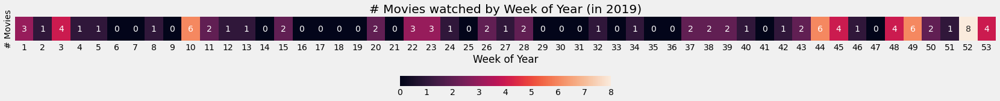
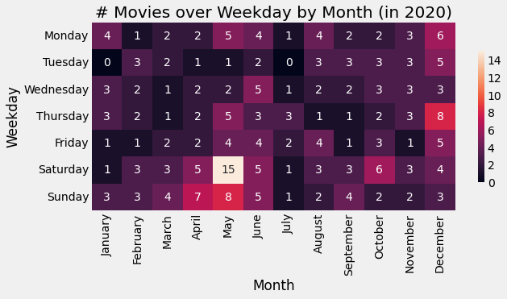
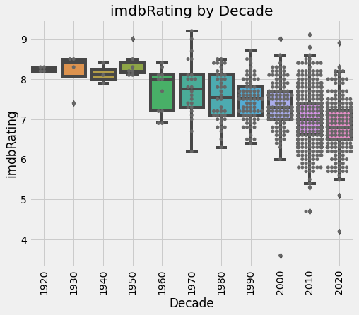

# My Movie Database (MMDb)

## Structure

- Sources
    - Trakt : Track what you watch and when (API connection)
    - IMDb : Internet Movie Database (API connection)
    
- User's watched movies data analysis

## I/O

- Dataset : pickle file (Input/Output)
- Trakt : API connection (Input)
- IMDb  : API connection (Input) or txt (Input/Output)

---

# Imports


```python
# Import functions
# https://stackoverflow.com/questions/66920753/running-a-justpy-web-app-on-jupyter-returns-runtimeerror\n",
import nest_asyncio
nest_asyncio.apply()

# https://stackoverflow.com/questions/20186344/ipynb-import-another-ipynb-file
%run MMDb_functions.ipynb
```

    Do you want to get new data (True/False)?  false
    Do you want to export data (True/False)?  false
    

## Pickle file


```python
# The pickle module implements binary protocols for serializing and de-serializing a Python object structure. 
# “Pickling” is the process whereby a Python object hierarchy is converted into a byte stream, and “unpickling” is the inverse operation, 
# whereby a byte stream (from a binary file or bytes-like object) is converted back into an object hierarchy.
foo = load_pickle()
```

    <class 'pandas.core.frame.DataFrame'>
    RangeIndex: 1044 entries, 0 to 1043
    Data columns (total 25 columns):
     #   Column           Non-Null Count  Dtype              
    ---  ------           --------------  -----              
     0   title            1044 non-null   object             
     1   year             1044 non-null   int32              
     2   imdbid           1044 non-null   object             
     3   rated            1044 non-null   object             
     4   runtime          1044 non-null   int32              
     5   genre            1044 non-null   object             
     6   director         1044 non-null   object             
     7   writer           1044 non-null   object             
     8   cinematographer  1044 non-null   object             
     9   actors           1044 non-null   object             
     10  country          1044 non-null   object             
     11  language         1044 non-null   object             
     12  metascore        1044 non-null   int32              
     13  imdbrating       1044 non-null   float64            
     14  imdbvotes        1044 non-null   int32              
     15  plot             1044 non-null   object             
     16  production       1044 non-null   object             
     17  distributor      1044 non-null   object             
     18  producer         1044 non-null   object             
     19  composer         1044 non-null   object             
     20  boxoffice        1044 non-null   object             
     21  budget           1044 non-null   object             
     22  timestamp        1044 non-null   datetime64[ns, UTC]
     23  date             1044 non-null   object             
     24  time             1044 non-null   object             
    dtypes: datetime64[ns, UTC](1), float64(1), int32(4), object(19)
    memory usage: 187.7+ KB
    

# APIs

## Trakt


```python
# Create empty Trakt dataframe
df_trakt = pd.DataFrame()
# Get data mode - get new movies
if get_data:
    # Initialize Trakt class
    trakt = TRAKT()    
    print()    
    # Create Trakt dataframe since "from_date"
    from_date = '2018-01-01'
    df_trakt = trakt.create_df(start_date = from_date)    
    df_trakt.info()
    print()
    # Last movies added
    show_all(df_trakt.tail())
```

### New movies watched?


```python
# Pickle VS Trakt
if get_data:
    data = []
    # Check if pickle's size if different than df_trakt's size (new movies watched)
    _, newMovies = check_new_movies(foo, df_trakt)
    # If pickle file exists and new movies were watched
    if isinstance(foo, pd.core.frame.DataFrame) and newMovies > 0:
        # Select data to request API
        data = df_trakt.sort_values(by='timestamp').iloc[-newMovies:,:].reset_index(drop=True)
        # Check new movies
        show_all(data)
    else:
        # If nothing new, use df_trakt
        data = df_trakt.copy() 
    print('New Movies: ', newMovies)   
else:
    newMovies = 0
    print('Do nothing.') 
```

    Do nothing.
    

## IMDb


```python
# Initialize IMDB class
imdb = IMDB()
```


```python
# Connect with IMDb
if isinstance(foo, pd.DataFrame) and newMovies == 0:
    # If nothing new, get data from pickle file
    df_all = foo.copy()
else:
    # Get new data
    df_all = imdb.get_imdb_data(src_path, newMovies, get_data, foo, df_trakt)
```

---

# Update data


```python
# Get actual date
now = pd.Timestamp('now')
current_year = now.year
# Update most recent movies (considering release year)
if update:
    # Considering recent movies...
    # Update metascore, imdbRating and imdbVotes
    df_all = imdb.update_imdb_values(df_all, current_year)
```

---

# IMDb DataFrame


```python
# Rename columns
cols = ['Title','Year','imdbID','Rated','Runtime','Genre',
        'Director','Writer','Cinematographer','Actors','Country',
        'Language','Metascore','imdbRating','imdbVotes','Plot',
        'Production','Distributor','Producer','Composer',
        'BoxOffice','Budget','Timestamp','Date','Time']

# Convert to timestamp type
df_all = from_timestamp(df_all)
# Set column names
df_all.columns = cols
# Confirm that all imdbID have at least 7 digits (for API query)
df_all.imdbID = df_all.imdbID.str.zfill(7)
# Check data info
df_all.info()
```

    <class 'pandas.core.frame.DataFrame'>
    RangeIndex: 1044 entries, 0 to 1043
    Data columns (total 25 columns):
     #   Column           Non-Null Count  Dtype         
    ---  ------           --------------  -----         
     0   Title            1044 non-null   object        
     1   Year             1044 non-null   int32         
     2   imdbID           1044 non-null   object        
     3   Rated            1044 non-null   object        
     4   Runtime          1044 non-null   int32         
     5   Genre            1044 non-null   object        
     6   Director         1044 non-null   object        
     7   Writer           1044 non-null   object        
     8   Cinematographer  1044 non-null   object        
     9   Actors           1044 non-null   object        
     10  Country          1044 non-null   object        
     11  Language         1044 non-null   object        
     12  Metascore        1044 non-null   int32         
     13  imdbRating       1044 non-null   float64       
     14  imdbVotes        1044 non-null   int32         
     15  Plot             1044 non-null   object        
     16  Production       1044 non-null   object        
     17  Distributor      1044 non-null   object        
     18  Producer         1044 non-null   object        
     19  Composer         1044 non-null   object        
     20  BoxOffice        1044 non-null   object        
     21  Budget           1044 non-null   object        
     22  Timestamp        1044 non-null   datetime64[ns]
     23  Date             1044 non-null   object        
     24  Time             1044 non-null   object        
    dtypes: datetime64[ns](1), float64(1), int32(4), object(19)
    memory usage: 187.7+ KB
    


```python
# Last entries
df_all.tail(3)
```


<div>
<style scoped>
    .dataframe tbody tr th:only-of-type {
        vertical-align: middle;
    }

    .dataframe tbody tr th {
        vertical-align: top;
    }

    .dataframe thead th {
        text-align: right;
    }
</style>
<table border="1" class="dataframe">
  <thead>
    <tr style="text-align: right;">
      <th></th>
      <th>Title</th>
      <th>Year</th>
      <th>imdbID</th>
      <th>Rated</th>
      <th>Runtime</th>
      <th>Genre</th>
      <th>Director</th>
      <th>Writer</th>
      <th>Cinematographer</th>
      <th>Actors</th>
      <th>...</th>
      <th>Plot</th>
      <th>Production</th>
      <th>Distributor</th>
      <th>Producer</th>
      <th>Composer</th>
      <th>BoxOffice</th>
      <th>Budget</th>
      <th>Timestamp</th>
      <th>Date</th>
      <th>Time</th>
    </tr>
  </thead>
  <tbody>
    <tr>
      <th>1041</th>
      <td>Beetlejuice</td>
      <td>1988</td>
      <td>0094721</td>
      <td>TV-14, TV-PG, TV-MA, PG</td>
      <td>92</td>
      <td>Comedy, Fantasy</td>
      <td>Tim Burton</td>
      <td>Warren Skaaren, Michael McDowell, Larry Wilson</td>
      <td>Thomas E. Ackerman</td>
      <td>Alec Baldwin, Adelle Lutz, Jack Angel, Robert ...</td>
      <td>...</td>
      <td>Adam and Barbara are a normal couple...who hap...</td>
      <td>The Geffen Company</td>
      <td>Argentina Video Home, Warner Bros. Entertainme...</td>
      <td>Richard Hashimoto, June Petersen, Eric Angelso...</td>
      <td>Danny Elfman</td>
      <td>10,846,736</td>
      <td>15,000,000</td>
      <td>2022-08-12 23:22:40</td>
      <td>2022-08-12</td>
      <td>23:22:40</td>
    </tr>
    <tr>
      <th>1042</th>
      <td>Watcher</td>
      <td>2022</td>
      <td>12004038</td>
      <td>R</td>
      <td>91</td>
      <td>Drama, Horror, Thriller</td>
      <td>Chloe Okuno</td>
      <td>Zack Ford, Chloe Okuno</td>
      <td>Benjamin Kirk Nielsen</td>
      <td>Catalin Cnej, Otilia Panainte, Edoard Leroy, A...</td>
      <td>...</td>
      <td>N/A</td>
      <td>Imagenation Abu Dhabi FZ</td>
      <td>IFC Midnight, Shudder, IFC Films</td>
      <td>Zack Ford, Sean Perrone, Costin Rantes, Roy Le...</td>
      <td>Nathan Halpern</td>
      <td>0</td>
      <td>0</td>
      <td>2022-08-13 23:33:56</td>
      <td>2022-08-13</td>
      <td>23:33:56</td>
    </tr>
    <tr>
      <th>1043</th>
      <td>Mad God</td>
      <td>2021</td>
      <td>15090124</td>
      <td>Not Rated</td>
      <td>83</td>
      <td>Animation, Fantasy, Horror, Sci-Fi</td>
      <td>Phil Tippett</td>
      <td>Phil Tippett</td>
      <td>Chris Morley, Phil Tippett</td>
      <td>Arne Hain, Tucker Gibbons, Satish Ratakonda, C...</td>
      <td>...</td>
      <td>Equipped with a gas mask and a crumbling map, ...</td>
      <td>Tippett Studio</td>
      <td>IFC Midnight, Shudder</td>
      <td>Jack Morrissey, Colin Geddes, Ken Birdwell, Da...</td>
      <td>Dan Wool</td>
      <td>0</td>
      <td>0</td>
      <td>2022-08-15 23:25:16</td>
      <td>2022-08-15</td>
      <td>23:25:16</td>
    </tr>
  </tbody>
</table>
<p>3 rows × 25 columns</p>
</div>


---

## Data check


```python
# Check all data
if data_check:
    cols = ['Title','Year','Runtime','Genre','Director','Actors','Plot','Date']
    show_all(df_all[cols].sort_values('Date', ascending=False))    
    input("Press Enter to continue...")
```

---

# Export data


```python
# Export data
if export:
    # Export to pickle
    df_all.to_pickle(pkl_path)
    # Export to txt     
    df_all.to_csv(txt_path, encoding='utf-8', index=False)
```

---

# Analysis


```python
# Set plot style
plt.style.use('fivethirtyeight')
# Work with top 10
N = 10
```

## Remove short films


```python
# Select columns
short_cols = ['Title','Year','Runtime','Genre','Director']
# Any shorts?
# Create mask (remove 'short' genre from df)
mask = df_all['Genre'].str.contains('Short')
shorts = df_all[mask]
# Show 'short' movies
show_all(shorts[short_cols])

# Remove 'short' genre from the df
shorts = df_all[mask]
print('There are ' + str(len(shorts)) + ' shorts in the dataset.')
```


<table border="1" class="dataframe">
  <thead>
    <tr style="text-align: right;">
      <th></th>
      <th>Title</th>
      <th>Year</th>
      <th>Runtime</th>
      <th>Genre</th>
      <th>Director</th>
    </tr>
  </thead>
  <tbody>
    <tr>
      <th>252</th>
      <td>What Did Jack Do?</td>
      <td>2017</td>
      <td>17</td>
      <td>Short, Comedy, Crime, Drama, Mystery, Thriller</td>
      <td>David Lynch</td>
    </tr>
    <tr>
      <th>266</th>
      <td>The Grandmother</td>
      <td>1970</td>
      <td>34</td>
      <td>Animation, Short, Horror</td>
      <td>David Lynch</td>
    </tr>
    <tr>
      <th>633</th>
      <td>Anima</td>
      <td>2019</td>
      <td>15</td>
      <td>Short, Music</td>
      <td>Paul Thomas Anderson</td>
    </tr>
    <tr>
      <th>704</th>
      <td>2036: Nexus Dawn</td>
      <td>2017</td>
      <td>6</td>
      <td>Short, Sci-Fi, Thriller</td>
      <td>Luke Scott</td>
    </tr>
    <tr>
      <th>705</th>
      <td>Blade Runner: Black Out 2022</td>
      <td>2017</td>
      <td>15</td>
      <td>Animation, Short, Action, Sci-Fi</td>
      <td>Shin'ichirô Watanabe</td>
    </tr>
    <tr>
      <th>706</th>
      <td>2048: Nowhere to Run</td>
      <td>2017</td>
      <td>5</td>
      <td>Short, Action, Sci-Fi, Thriller</td>
      <td>Luke Scott</td>
    </tr>
    <tr>
      <th>717</th>
      <td>Next Floor</td>
      <td>2008</td>
      <td>11</td>
      <td>Short, Comedy</td>
      <td>Denis Villeneuve</td>
    </tr>
    <tr>
      <th>720</th>
      <td>Cyberpunk 2077 - Phoenix Program</td>
      <td>2020</td>
      <td>40</td>
      <td>Short, Action</td>
      <td>Vi-Dan Tran</td>
    </tr>
    <tr>
      <th>825</th>
      <td>Nimic</td>
      <td>2019</td>
      <td>12</td>
      <td>Short, Drama, Fantasy</td>
      <td>Yorgos Lanthimos</td>
    </tr>
  </tbody>
</table>


    There are 9 shorts in the dataset.
    

## Create DataFrame without short films


```python
# Create working df
df = df_all[~mask].copy()
# Reset index after removing shorts
df.reset_index(drop=True, inplace=True)
# Show df shape after filtering
df.shape
```


    (1035, 25)


```python
# Describe df (only object columns)
without_cols = ['Title', 'Actors', 'Plot', 'imdbID']
df[df.columns.difference(without_cols)].describe(include=['object'])
```


<div>
<style scoped>
    .dataframe tbody tr th:only-of-type {
        vertical-align: middle;
    }

    .dataframe tbody tr th {
        vertical-align: top;
    }

    .dataframe thead th {
        text-align: right;
    }
</style>
<table border="1" class="dataframe">
  <thead>
    <tr style="text-align: right;">
      <th></th>
      <th>BoxOffice</th>
      <th>Budget</th>
      <th>Cinematographer</th>
      <th>Composer</th>
      <th>Country</th>
      <th>Date</th>
      <th>Director</th>
      <th>Distributor</th>
      <th>Genre</th>
      <th>Language</th>
      <th>Producer</th>
      <th>Production</th>
      <th>Rated</th>
      <th>Time</th>
      <th>Writer</th>
    </tr>
  </thead>
  <tbody>
    <tr>
      <th>count</th>
      <td>1035</td>
      <td>1035</td>
      <td>1035</td>
      <td>1035</td>
      <td>1035</td>
      <td>1035</td>
      <td>1035</td>
      <td>1035</td>
      <td>1035</td>
      <td>1035</td>
      <td>1035</td>
      <td>1035</td>
      <td>1035</td>
      <td>1035</td>
      <td>1035</td>
    </tr>
    <tr>
      <th>unique</th>
      <td>329</td>
      <td>275</td>
      <td>681</td>
      <td>627</td>
      <td>272</td>
      <td>838</td>
      <td>764</td>
      <td>946</td>
      <td>371</td>
      <td>288</td>
      <td>1025</td>
      <td>1006</td>
      <td>77</td>
      <td>985</td>
      <td>927</td>
    </tr>
    <tr>
      <th>top</th>
      <td>0</td>
      <td>0</td>
      <td>N/A</td>
      <td>N/A</td>
      <td>United States</td>
      <td>2020-05-16</td>
      <td>David Lynch</td>
      <td>Netflix</td>
      <td>Drama</td>
      <td>English</td>
      <td>Charles Chaplin</td>
      <td>Walt Disney Pictures, Pixar Animation Studios</td>
      <td>R</td>
      <td>23:15:00</td>
      <td>N/A</td>
    </tr>
    <tr>
      <th>freq</th>
      <td>707</td>
      <td>450</td>
      <td>19</td>
      <td>77</td>
      <td>405</td>
      <td>5</td>
      <td>10</td>
      <td>72</td>
      <td>78</td>
      <td>471</td>
      <td>3</td>
      <td>7</td>
      <td>412</td>
      <td>3</td>
      <td>25</td>
    </tr>
  </tbody>
</table>
</div>


```python
## Duplicated movies in the dataset (rewatched movies within date range)
#df[df[['Title','Year','Runtime']].duplicated(keep=False)][['Title','Year','Director','imdbRating','Timestamp']]
```


```python
# Get unique years - since the beginning of data
years = df['Timestamp'].dt.year.unique()
years.sort()
years = tuple(years)
```

---

## IMDb extra info

### Top IMDb 250 Movies


```python
# Initialize IMDb class (connect to API)
moviedb = IMDb()
# Get list of IMDb top 250 movies
top250 = moviedb.get_top250_movies()
# Top 250 movies dataframe
df_top250 = pd.DataFrame([[movie.get('title'), movie.get('year')] for movie in top250], columns=['Title','Year'])
# Merge to get top 250 movies seen since the beginning of data get
df_top250_seen = df[['Title','Year','Timestamp']].merge(df_top250, on=['Title', 'Year'])
# Total IMDb top 250 movies watched since first year in the dataset (year in years)
print('IMDb top 250 movies watched since ' + str(years[0]) + ': ' + str(df_top250_seen.shape[0]))
```

    IMDb top 250 movies watched since 2018: 83
    


```python
# Group by watched in year
df_top250_seen['WatchedIn'] = pd.to_datetime(df_top250_seen['Timestamp']).dt.year
gb_top250_seen = df_top250_seen.groupby('WatchedIn').agg({'Title':['count','; '.join]})
show_all(gb_top250_seen)
```


<table border="1" class="dataframe">
  <thead>
    <tr>
      <th></th>
      <th colspan="2" halign="left">Title</th>
    </tr>
    <tr>
      <th></th>
      <th>count</th>
      <th>join</th>
    </tr>
    <tr>
      <th>WatchedIn</th>
      <th></th>
      <th></th>
    </tr>
  </thead>
  <tbody>
    <tr>
      <th>2018</th>
      <td>7</td>
      <td>Coco; Three Billboards Outside Ebbing, Missouri; Pan's Labyrinth; The Dark Knight; Avengers: Infinity War; Dead Poets Society; The Truman Show</td>
    </tr>
    <tr>
      <th>2019</th>
      <td>7</td>
      <td>Spirited Away; Green Book; The Sound of Music; Avengers: Endgame; Joker; Parasite; The Shining</td>
    </tr>
    <tr>
      <th>2020</th>
      <td>24</td>
      <td>1917; Requiem for a Dream; Groundhog Day; My Neighbor Totoro; Eternal Sunshine of the Spotless Mind; Alien; Aliens; Ford v Ferrari; The Usual Suspects; The Godfather; Princess Mononoke; The Elephant Man; Howl's Moving Castle; Your Name.; Into the Wild; Cinema Paradiso; Spider-Man: Into the Spider-Verse; Lock, Stock and Two Smoking Barrels; Inception; Catch Me If You Can; Capernaum; Incendies; Klaus; No Country for Old Men</td>
    </tr>
    <tr>
      <th>2021</th>
      <td>20</td>
      <td>Mary and Max; The Father; Amélie; La Haine; The Sixth Sense; Persona; Dr. Strangelove or: How I Learned to Stop Worrying and Love the Bomb; Heat; The Seventh Seal; Apocalypse Now; Wild Tales; There Will Be Blood; Memories of Murder; Léon: The Professional; 12 Angry Men; The Matrix; Before Sunrise; Before Sunset; Memento; Back to the Future</td>
    </tr>
    <tr>
      <th>2022</th>
      <td>25</td>
      <td>Interstellar; Sherlock Jr.; The General; The Kid; City Lights; Modern Times; The Third Man; Amadeus; The Great Dictator; Spider-Man: No Way Home; Lawrence of Arabia; Million Dollar Baby; One Flew Over the Cuckoo's Nest; Inglourious Basterds; M; Everything Everywhere All at Once; Scarface; Jaws; Vertigo; Metropolis; Dial M for Murder; Rear Window; Come and See; Wild Strawberries; Rashomon</td>
    </tr>
  </tbody>
</table>


### Filming locations


```python
# Show top results
N = 20
# Get movie filming locations
get = 'locations'
df_movie_locations = imdb.movie_extra_info(moviedb, df, get)
# Clean strings - remove scene description ('::')
df_movie_locations['locations'] = [[s.split('::')[0] for s in item] for item in df_movie_locations['locations']]
# Explode string into single results
locations_list = df_movie_locations.explode(get)
# Show locations
locations_list.value_counts().head(N)
```


    locations                                                 
    USA                                                           222
    Los Angeles, California, USA                                  134
    California, USA                                               101
    New York City, New York, USA                                   86
    UK                                                             60
    New York, USA                                                  58
    London, England, UK                                            47
    England, UK                                                    42
    Canada                                                         31
    Atlanta, Georgia, USA                                          31
    Toronto, Ontario, Canada                                       30
    Manhattan, New York City, New York, USA                        27
    Paris, France                                                  27
    Germany                                                        24
    Georgia, USA                                                   24
    Brooklyn, New York City, New York, USA                         23
    Santa Clarita, California, USA                                 22
    France                                                         21
    Pinewood Studios, Iver Heath, Buckinghamshire, England, UK     20
    Berlin, Germany                                                20
    dtype: int64


```python
# Get only the country (the end of the string)
locations_country_list = [x.split(', ')[-1] for item in df_movie_locations[get] for x in item]
# Show countries
pd.Series(locations_country_list).value_counts().head(N)
```


    USA               4275
    UK                1301
    Canada             366
    Germany            268
    Australia          246
    France             238
    Italy              215
    Spain              209
    Japan               80
    Mexico              61
    South Korea         57
    Norway              56
    Hungary             54
    Austria             53
    Ireland             49
    Romania             47
    Czech Republic      47
    Sweden              46
    Iceland             41
    China               41
    dtype: int64


### Movie Keywords


```python
# Get movie keywords
get = 'keywords'
df_movie_keywords = imdb.movie_extra_info(moviedb, df, get)
# Explode string into single results
keywords_list = df_movie_keywords.explode(get)
# Show keywords
keywords_list.value_counts().head(N)
```


    keywords                    
    murder                          400
    blood                           389
    death                           379
    violence                        375
    husband-wife-relationship       325
    flashback                       317
    cigarette-smoking               309
    father-son-relationship         295
    title-spoken-by-character       283
    father-daughter-relationship    270
    mother-son-relationship         269
    photograph                      257
    female-nudity                   257
    friendship                      250
    telephone-call                  246
    fear                            244
    gun                             242
    mother-daughter-relationship    237
    surprise-ending                 235
    kiss                            232
    dtype: int64


---

## Overview


```python
# Overview all watched (movies and documentaries) by year
df_diff_watched_year, df_all_watched = total_by_year(df, True, True)
df_all_watched.style.background_gradient(subset=[('Title','count')], axis=0)
```


<style type="text/css">
#T_839a4_row0_col0 {
  background-color: #fff7fb;
  color: #000000;
}
#T_839a4_row1_col0 {
  background-color: #f9f2f8;
  color: #000000;
}
#T_839a4_row2_col0 {
  background-color: #589ec8;
  color: #f1f1f1;
}
#T_839a4_row3_col0 {
  background-color: #023858;
  color: #f1f1f1;
}
#T_839a4_row4_col0 {
  background-color: #5c9fc9;
  color: #f1f1f1;
}
</style>
<table id="T_839a4_">
  <thead>
    <tr>
      <th class="blank level0" >&nbsp;</th>
      <th class="col_heading level0 col0" >Title</th>
    </tr>
    <tr>
      <th class="blank level1" >&nbsp;</th>
      <th class="col_heading level1 col0" >count</th>
    </tr>
    <tr>
      <th class="index_name level0" >Year</th>
      <th class="blank col0" >&nbsp;</th>
    </tr>
  </thead>
  <tbody>
    <tr>
      <th id="T_839a4_level0_row0" class="row_heading level0 row0" >2018</th>
      <td id="T_839a4_row0_col0" class="data row0 col0" >59</td>
    </tr>
    <tr>
      <th id="T_839a4_level0_row1" class="row_heading level0 row1" >2019</th>
      <td id="T_839a4_row1_col0" class="data row1 col0" >73</td>
    </tr>
    <tr>
      <th id="T_839a4_level0_row2" class="row_heading level0 row2" >2020</th>
      <td id="T_839a4_row2_col0" class="data row2 col0" >251</td>
    </tr>
    <tr>
      <th id="T_839a4_level0_row3" class="row_heading level0 row3" >2021</th>
      <td id="T_839a4_row3_col0" class="data row3 col0" >404</td>
    </tr>
    <tr>
      <th id="T_839a4_level0_row4" class="row_heading level0 row4" >2022</th>
      <td id="T_839a4_row4_col0" class="data row4 col0" >248</td>
    </tr>
  </tbody>
</table>


```python
# Percentage difference from previous year
pct_col = '%'
df_year_change = df_diff_watched_year.copy()
df_year_change = df_year_change.diff().fillna(0).astype(int)
# Create percentage column and convert
df_year_change[pct_col] = pd.DataFrame(df_all_watched.pct_change()[('Title','count')]*100)
df_year_change[pct_col] = df_year_change[pct_col].fillna(0).astype(int)
# Drop columns to create cleaner visualization
df_year_change.drop(['Genre','Title'], axis=1, inplace=True)
df_year_change.style.background_gradient(cmap='RdBu', subset=pct_col, axis=0)
```


<style type="text/css">
#T_48ddc_row0_col0 {
  background-color: #be3036;
  color: #f1f1f1;
}
#T_48ddc_row1_col0 {
  background-color: #db6b55;
  color: #f1f1f1;
}
#T_48ddc_row2_col0 {
  background-color: #053061;
  color: #f1f1f1;
}
#T_48ddc_row3_col0 {
  background-color: #f8bfa4;
  color: #000000;
}
#T_48ddc_row4_col0 {
  background-color: #67001f;
  color: #f1f1f1;
}
</style>
<table id="T_48ddc_">
  <thead>
    <tr>
      <th class="blank level0" >&nbsp;</th>
      <th class="col_heading level0 col0" >%</th>
    </tr>
    <tr>
      <th class="index_name level0" >Year</th>
      <th class="blank col0" >&nbsp;</th>
    </tr>
  </thead>
  <tbody>
    <tr>
      <th id="T_48ddc_level0_row0" class="row_heading level0 row0" >2018</th>
      <td id="T_48ddc_row0_col0" class="data row0 col0" >0</td>
    </tr>
    <tr>
      <th id="T_48ddc_level0_row1" class="row_heading level0 row1" >2019</th>
      <td id="T_48ddc_row1_col0" class="data row1 col0" >23</td>
    </tr>
    <tr>
      <th id="T_48ddc_level0_row2" class="row_heading level0 row2" >2020</th>
      <td id="T_48ddc_row2_col0" class="data row2 col0" >243</td>
    </tr>
    <tr>
      <th id="T_48ddc_level0_row3" class="row_heading level0 row3" >2021</th>
      <td id="T_48ddc_row3_col0" class="data row3 col0" >60</td>
    </tr>
    <tr>
      <th id="T_48ddc_level0_row4" class="row_heading level0 row4" >2022</th>
      <td id="T_48ddc_row4_col0" class="data row4 col0" >-38</td>
    </tr>
  </tbody>
</table>


```python
# Difference between years
# Get values from all movies watched
values = list(df_all_watched.iloc[:,-1])
# List difference between years
l = [i-j for i in values for j in values if i != j]
# Initialize 
results = []
j = 0

# Fill list 
for i in range(len(years)):
    temp_list = l[j:j+4] # get 4 values each time (doesn't contain difference between itself)
    temp_list.insert(i,0) # insert difference between itself =0
    results.append(temp_list) # append to list
    j += 4 # add step 

# Convert to dataframe
df_year_heatmap = pd.DataFrame(results, index=years, columns=years)
df_year_heatmap.style.background_gradient(cmap='RdBu', axis=None)
```


<style type="text/css">
#T_3ecfb_row0_col0, #T_3ecfb_row1_col1, #T_3ecfb_row2_col2, #T_3ecfb_row3_col3, #T_3ecfb_row4_col4 {
  background-color: #f6f7f7;
  color: #000000;
}
#T_3ecfb_row0_col1 {
  background-color: #f8f1ed;
  color: #000000;
}
#T_3ecfb_row0_col2 {
  background-color: #dc6e57;
  color: #f1f1f1;
}
#T_3ecfb_row0_col3 {
  background-color: #67001f;
  color: #f1f1f1;
}
#T_3ecfb_row0_col4 {
  background-color: #dd7059;
  color: #f1f1f1;
}
#T_3ecfb_row1_col0 {
  background-color: #eff3f5;
  color: #000000;
}
#T_3ecfb_row1_col2 {
  background-color: #e27b62;
  color: #f1f1f1;
}
#T_3ecfb_row1_col3 {
  background-color: #760521;
  color: #f1f1f1;
}
#T_3ecfb_row1_col4 {
  background-color: #e48066;
  color: #f1f1f1;
}
#T_3ecfb_row2_col0 {
  background-color: #529dc8;
  color: #f1f1f1;
}
#T_3ecfb_row2_col1 {
  background-color: #62a7ce;
  color: #f1f1f1;
}
#T_3ecfb_row2_col3 {
  background-color: #ee9677;
  color: #000000;
}
#T_3ecfb_row2_col4 {
  background-color: #f5f6f7;
  color: #000000;
}
#T_3ecfb_row3_col0 {
  background-color: #053061;
  color: #f1f1f1;
}
#T_3ecfb_row3_col1 {
  background-color: #0a3b70;
  color: #f1f1f1;
}
#T_3ecfb_row3_col2 {
  background-color: #81bad8;
  color: #000000;
}
#T_3ecfb_row3_col4 {
  background-color: #7eb8d7;
  color: #000000;
}
#T_3ecfb_row4_col0 {
  background-color: #569fc9;
  color: #f1f1f1;
}
#T_3ecfb_row4_col1 {
  background-color: #68abd0;
  color: #f1f1f1;
}
#T_3ecfb_row4_col2 {
  background-color: #f7f5f4;
  color: #000000;
}
#T_3ecfb_row4_col3 {
  background-color: #ec9374;
  color: #f1f1f1;
}
</style>
<table id="T_3ecfb_">
  <thead>
    <tr>
      <th class="blank level0" >&nbsp;</th>
      <th class="col_heading level0 col0" >2018</th>
      <th class="col_heading level0 col1" >2019</th>
      <th class="col_heading level0 col2" >2020</th>
      <th class="col_heading level0 col3" >2021</th>
      <th class="col_heading level0 col4" >2022</th>
    </tr>
  </thead>
  <tbody>
    <tr>
      <th id="T_3ecfb_level0_row0" class="row_heading level0 row0" >2018</th>
      <td id="T_3ecfb_row0_col0" class="data row0 col0" >0</td>
      <td id="T_3ecfb_row0_col1" class="data row0 col1" >-14</td>
      <td id="T_3ecfb_row0_col2" class="data row0 col2" >-192</td>
      <td id="T_3ecfb_row0_col3" class="data row0 col3" >-345</td>
      <td id="T_3ecfb_row0_col4" class="data row0 col4" >-189</td>
    </tr>
    <tr>
      <th id="T_3ecfb_level0_row1" class="row_heading level0 row1" >2019</th>
      <td id="T_3ecfb_row1_col0" class="data row1 col0" >14</td>
      <td id="T_3ecfb_row1_col1" class="data row1 col1" >0</td>
      <td id="T_3ecfb_row1_col2" class="data row1 col2" >-178</td>
      <td id="T_3ecfb_row1_col3" class="data row1 col3" >-331</td>
      <td id="T_3ecfb_row1_col4" class="data row1 col4" >-175</td>
    </tr>
    <tr>
      <th id="T_3ecfb_level0_row2" class="row_heading level0 row2" >2020</th>
      <td id="T_3ecfb_row2_col0" class="data row2 col0" >192</td>
      <td id="T_3ecfb_row2_col1" class="data row2 col1" >178</td>
      <td id="T_3ecfb_row2_col2" class="data row2 col2" >0</td>
      <td id="T_3ecfb_row2_col3" class="data row2 col3" >-153</td>
      <td id="T_3ecfb_row2_col4" class="data row2 col4" >3</td>
    </tr>
    <tr>
      <th id="T_3ecfb_level0_row3" class="row_heading level0 row3" >2021</th>
      <td id="T_3ecfb_row3_col0" class="data row3 col0" >345</td>
      <td id="T_3ecfb_row3_col1" class="data row3 col1" >331</td>
      <td id="T_3ecfb_row3_col2" class="data row3 col2" >153</td>
      <td id="T_3ecfb_row3_col3" class="data row3 col3" >0</td>
      <td id="T_3ecfb_row3_col4" class="data row3 col4" >156</td>
    </tr>
    <tr>
      <th id="T_3ecfb_level0_row4" class="row_heading level0 row4" >2022</th>
      <td id="T_3ecfb_row4_col0" class="data row4 col0" >189</td>
      <td id="T_3ecfb_row4_col1" class="data row4 col1" >175</td>
      <td id="T_3ecfb_row4_col2" class="data row4 col2" >-3</td>
      <td id="T_3ecfb_row4_col3" class="data row4 col3" >-156</td>
      <td id="T_3ecfb_row4_col4" class="data row4 col4" >0</td>
    </tr>
  </tbody>
</table>


```python
# Plot watched by year
plot_watched_movies(df_all_watched)
```


    

    


```python
# Plot overview by month and weekday
plot_heatmap(df, 'Weekday', None)
plot_weekday_bar(df, None)
```


    

    


    

    


    36% of the movies were watched on the weekend!
    

---

### Only Movies 


```python
# Movies (only - no documentaries) by year
df_movies_year, df_show_movies = total_by_year(df)
# Difference from previous year
diff = '+/-'
df_show_movies[diff] = df_movies_year.diff().drop('Genre', axis=1).fillna(0).astype(int)
df_show_movies.style.background_gradient(cmap='RdBu', subset=diff)
```


<style type="text/css">
#T_1f50a_row0_col1 {
  background-color: #f9f0eb;
  color: #000000;
}
#T_1f50a_row1_col1 {
  background-color: #eff3f5;
  color: #000000;
}
#T_1f50a_row2_col1 {
  background-color: #053061;
  color: #f1f1f1;
}
#T_1f50a_row3_col1 {
  background-color: #0a3b70;
  color: #f1f1f1;
}
#T_1f50a_row4_col1 {
  background-color: #67001f;
  color: #f1f1f1;
}
</style>
<table id="T_1f50a_">
  <thead>
    <tr>
      <th class="blank level0" >&nbsp;</th>
      <th class="col_heading level0 col0" >Title</th>
      <th class="col_heading level0 col1" >+/-</th>
    </tr>
    <tr>
      <th class="blank level1" >&nbsp;</th>
      <th class="col_heading level1 col0" >count</th>
      <th class="col_heading level1 col1" ></th>
    </tr>
    <tr>
      <th class="index_name level0" >Year</th>
      <th class="blank col0" >&nbsp;</th>
      <th class="blank col1" >&nbsp;</th>
    </tr>
  </thead>
  <tbody>
    <tr>
      <th id="T_1f50a_level0_row0" class="row_heading level0 row0" >2018</th>
      <td id="T_1f50a_row0_col0" class="data row0 col0" >56</td>
      <td id="T_1f50a_row0_col1" class="data row0 col1" >0</td>
    </tr>
    <tr>
      <th id="T_1f50a_level0_row1" class="row_heading level0 row1" >2019</th>
      <td id="T_1f50a_row1_col0" class="data row1 col0" >71</td>
      <td id="T_1f50a_row1_col1" class="data row1 col1" >15</td>
    </tr>
    <tr>
      <th id="T_1f50a_level0_row2" class="row_heading level0 row2" >2020</th>
      <td id="T_1f50a_row2_col0" class="data row2 col0" >231</td>
      <td id="T_1f50a_row2_col1" class="data row2 col1" >160</td>
    </tr>
    <tr>
      <th id="T_1f50a_level0_row3" class="row_heading level0 row3" >2021</th>
      <td id="T_1f50a_row3_col0" class="data row3 col0" >384</td>
      <td id="T_1f50a_row3_col1" class="data row3 col1" >153</td>
    </tr>
    <tr>
      <th id="T_1f50a_level0_row4" class="row_heading level0 row4" >2022</th>
      <td id="T_1f50a_row4_col0" class="data row4 col0" >240</td>
      <td id="T_1f50a_row4_col1" class="data row4 col1" >-144</td>
    </tr>
  </tbody>
</table>


### Only Documentaries


```python
# Documentaries (only) by year
df_docs_year, df_show_docs = total_by_year(df, docs=True)
# Difference from previous year of documentaries watched
df_show_docs[diff] = df_docs_year.diff().drop('Genre', axis=1).fillna(0).astype(int)
df_show_docs.style.background_gradient(cmap='RdBu', subset=diff)
```


<style type="text/css">
#T_34aa4_row0_col1, #T_34aa4_row3_col1 {
  background-color: #fddbc7;
  color: #000000;
}
#T_34aa4_row1_col1 {
  background-color: #fac8af;
  color: #000000;
}
#T_34aa4_row2_col1 {
  background-color: #053061;
  color: #f1f1f1;
}
#T_34aa4_row4_col1 {
  background-color: #67001f;
  color: #f1f1f1;
}
</style>
<table id="T_34aa4_">
  <thead>
    <tr>
      <th class="blank level0" >&nbsp;</th>
      <th class="col_heading level0 col0" >Title</th>
      <th class="col_heading level0 col1" >+/-</th>
    </tr>
    <tr>
      <th class="blank level1" >&nbsp;</th>
      <th class="col_heading level1 col0" >count</th>
      <th class="col_heading level1 col1" ></th>
    </tr>
    <tr>
      <th class="index_name level0" >Year</th>
      <th class="blank col0" >&nbsp;</th>
      <th class="blank col1" >&nbsp;</th>
    </tr>
  </thead>
  <tbody>
    <tr>
      <th id="T_34aa4_level0_row0" class="row_heading level0 row0" >2018</th>
      <td id="T_34aa4_row0_col0" class="data row0 col0" >3</td>
      <td id="T_34aa4_row0_col1" class="data row0 col1" >0</td>
    </tr>
    <tr>
      <th id="T_34aa4_level0_row1" class="row_heading level0 row1" >2019</th>
      <td id="T_34aa4_row1_col0" class="data row1 col0" >2</td>
      <td id="T_34aa4_row1_col1" class="data row1 col1" >-1</td>
    </tr>
    <tr>
      <th id="T_34aa4_level0_row2" class="row_heading level0 row2" >2020</th>
      <td id="T_34aa4_row2_col0" class="data row2 col0" >20</td>
      <td id="T_34aa4_row2_col1" class="data row2 col1" >18</td>
    </tr>
    <tr>
      <th id="T_34aa4_level0_row3" class="row_heading level0 row3" >2021</th>
      <td id="T_34aa4_row3_col0" class="data row3 col0" >20</td>
      <td id="T_34aa4_row3_col1" class="data row3 col1" >0</td>
    </tr>
    <tr>
      <th id="T_34aa4_level0_row4" class="row_heading level0 row4" >2022</th>
      <td id="T_34aa4_row4_col0" class="data row4 col0" >8</td>
      <td id="T_34aa4_row4_col1" class="data row4 col1" >-12</td>
    </tr>
  </tbody>
</table>


---

## By Year 


```python
# Select columns
cols = ['Title','Year','Runtime','Genre','Director','imdbRating','Timestamp','Time']
# Create "by year" dataframe
df_byear = df[cols].copy()
```


```python
# All (movies + documentaries) watched per day by year
[[movies_per_day(df_diff_watched_year, year)] for year in years];
```

    0.16 movies per day in 2018
    0.2 movies per day in 2019
    0.69 movies per day in 2020
    1.11 movies per day in 2021
    1.09 movies per day in 2022
    


```python
# All by month/year
ct_month_year = crosstab_by_year(df_byear).droplevel('Month', axis=1)
ct_month_year.style.background_gradient(axis=1, subset=ct_month_year.columns[:-1]) # evaluate by year
```


<style type="text/css">
#T_0a053_row0_col0, #T_0a053_row0_col3 {
  background-color: #d4d4e8;
  color: #000000;
}
#T_0a053_row0_col1 {
  background-color: #1b7eb7;
  color: #f1f1f1;
}
#T_0a053_row0_col2, #T_0a053_row1_col11, #T_0a053_row2_col4, #T_0a053_row3_col0, #T_0a053_row4_col0, #T_0a053_row5_col0 {
  background-color: #023858;
  color: #f1f1f1;
}
#T_0a053_row0_col4 {
  background-color: #e6e2ef;
  color: #000000;
}
#T_0a053_row0_col5 {
  background-color: #bdc8e1;
  color: #000000;
}
#T_0a053_row0_col6, #T_0a053_row0_col8, #T_0a053_row1_col1, #T_0a053_row1_col3, #T_0a053_row1_col7, #T_0a053_row2_col6, #T_0a053_row3_col6, #T_0a053_row4_col8, #T_0a053_row4_col9, #T_0a053_row4_col10, #T_0a053_row4_col11, #T_0a053_row5_col8 {
  background-color: #fff7fb;
  color: #000000;
}
#T_0a053_row0_col7 {
  background-color: #a2bcda;
  color: #000000;
}
#T_0a053_row0_col9, #T_0a053_row0_col11 {
  background-color: #f4edf6;
  color: #000000;
}
#T_0a053_row0_col10 {
  background-color: #83afd3;
  color: #f1f1f1;
}
#T_0a053_row1_col0, #T_0a053_row1_col9 {
  background-color: #056ba7;
  color: #f1f1f1;
}
#T_0a053_row1_col2 {
  background-color: #045687;
  color: #f1f1f1;
}
#T_0a053_row1_col4 {
  background-color: #b4c4df;
  color: #000000;
}
#T_0a053_row1_col5, #T_0a053_row1_col8 {
  background-color: #8bb2d4;
  color: #000000;
}
#T_0a053_row1_col6, #T_0a053_row5_col7 {
  background-color: #eee9f3;
  color: #000000;
}
#T_0a053_row1_col10 {
  background-color: #2685bb;
  color: #f1f1f1;
}
#T_0a053_row2_col0, #T_0a053_row2_col1, #T_0a053_row2_col2 {
  background-color: #dddbec;
  color: #000000;
}
#T_0a053_row2_col3, #T_0a053_row2_col9 {
  background-color: #a1bbda;
  color: #000000;
}
#T_0a053_row2_col5, #T_0a053_row5_col3 {
  background-color: #3d93c2;
  color: #f1f1f1;
}
#T_0a053_row2_col7 {
  background-color: #b8c6e0;
  color: #000000;
}
#T_0a053_row2_col8 {
  background-color: #d6d6e9;
  color: #000000;
}
#T_0a053_row2_col10 {
  background-color: #c2cbe2;
  color: #000000;
}
#T_0a053_row2_col11 {
  background-color: #0566a0;
  color: #f1f1f1;
}
#T_0a053_row3_col1, #T_0a053_row3_col9 {
  background-color: #056dac;
  color: #f1f1f1;
}
#T_0a053_row3_col2, #T_0a053_row3_col3 {
  background-color: #65a3cb;
  color: #f1f1f1;
}
#T_0a053_row3_col4, #T_0a053_row3_col8 {
  background-color: #80aed2;
  color: #f1f1f1;
}
#T_0a053_row3_col5 {
  background-color: #e0deed;
  color: #000000;
}
#T_0a053_row3_col7 {
  background-color: #c1cae2;
  color: #000000;
}
#T_0a053_row3_col10 {
  background-color: #034871;
  color: #f1f1f1;
}
#T_0a053_row3_col11 {
  background-color: #04588a;
  color: #f1f1f1;
}
#T_0a053_row4_col1 {
  background-color: #308cbe;
  color: #f1f1f1;
}
#T_0a053_row4_col2 {
  background-color: #056ead;
  color: #f1f1f1;
}
#T_0a053_row4_col3 {
  background-color: #2081b9;
  color: #f1f1f1;
}
#T_0a053_row4_col4 {
  background-color: #4295c3;
  color: #f1f1f1;
}
#T_0a053_row4_col5 {
  background-color: #187cb6;
  color: #f1f1f1;
}
#T_0a053_row4_col6 {
  background-color: #84b0d3;
  color: #f1f1f1;
}
#T_0a053_row4_col7 {
  background-color: #ede8f3;
  color: #000000;
}
#T_0a053_row5_col1 {
  background-color: #2f8bbe;
  color: #f1f1f1;
}
#T_0a053_row5_col2, #T_0a053_row5_col4 {
  background-color: #045c90;
  color: #f1f1f1;
}
#T_0a053_row5_col5 {
  background-color: #1077b4;
  color: #f1f1f1;
}
#T_0a053_row5_col6 {
  background-color: #f3edf5;
  color: #000000;
}
#T_0a053_row5_col9 {
  background-color: #d7d6e9;
  color: #000000;
}
#T_0a053_row5_col10 {
  background-color: #c5cce3;
  color: #000000;
}
#T_0a053_row5_col11 {
  background-color: #79abd0;
  color: #f1f1f1;
}
</style>
<table id="T_0a053_">
  <thead>
    <tr>
      <th class="index_name level0" >MonthName</th>
      <th class="col_heading level0 col0" >January</th>
      <th class="col_heading level0 col1" >February</th>
      <th class="col_heading level0 col2" >March</th>
      <th class="col_heading level0 col3" >April</th>
      <th class="col_heading level0 col4" >May</th>
      <th class="col_heading level0 col5" >June</th>
      <th class="col_heading level0 col6" >July</th>
      <th class="col_heading level0 col7" >August</th>
      <th class="col_heading level0 col8" >September</th>
      <th class="col_heading level0 col9" >October</th>
      <th class="col_heading level0 col10" >November</th>
      <th class="col_heading level0 col11" >December</th>
      <th class="col_heading level0 col12" ></th>
    </tr>
    <tr>
      <th class="index_name level0" >DateYear</th>
      <th class="blank col0" >&nbsp;</th>
      <th class="blank col1" >&nbsp;</th>
      <th class="blank col2" >&nbsp;</th>
      <th class="blank col3" >&nbsp;</th>
      <th class="blank col4" >&nbsp;</th>
      <th class="blank col5" >&nbsp;</th>
      <th class="blank col6" >&nbsp;</th>
      <th class="blank col7" >&nbsp;</th>
      <th class="blank col8" >&nbsp;</th>
      <th class="blank col9" >&nbsp;</th>
      <th class="blank col10" >&nbsp;</th>
      <th class="blank col11" >&nbsp;</th>
      <th class="blank col12" >&nbsp;</th>
    </tr>
  </thead>
  <tbody>
    <tr>
      <th id="T_0a053_level0_row0" class="row_heading level0 row0" >2018</th>
      <td id="T_0a053_row0_col0" class="data row0 col0" >4</td>
      <td id="T_0a053_row0_col1" class="data row0 col1" >10</td>
      <td id="T_0a053_row0_col2" class="data row0 col2" >14</td>
      <td id="T_0a053_row0_col3" class="data row0 col3" >4</td>
      <td id="T_0a053_row0_col4" class="data row0 col4" >3</td>
      <td id="T_0a053_row0_col5" class="data row0 col5" >5</td>
      <td id="T_0a053_row0_col6" class="data row0 col6" >1</td>
      <td id="T_0a053_row0_col7" class="data row0 col7" >6</td>
      <td id="T_0a053_row0_col8" class="data row0 col8" >1</td>
      <td id="T_0a053_row0_col9" class="data row0 col9" >2</td>
      <td id="T_0a053_row0_col10" class="data row0 col10" >7</td>
      <td id="T_0a053_row0_col11" class="data row0 col11" >2</td>
      <td id="T_0a053_row0_col12" class="data row0 col12" >59</td>
    </tr>
    <tr>
      <th id="T_0a053_level0_row1" class="row_heading level0 row1" >2019</th>
      <td id="T_0a053_row1_col0" class="data row1 col0" >9</td>
      <td id="T_0a053_row1_col1" class="data row1 col1" >2</td>
      <td id="T_0a053_row1_col2" class="data row1 col2" >10</td>
      <td id="T_0a053_row1_col3" class="data row1 col3" >2</td>
      <td id="T_0a053_row1_col4" class="data row1 col4" >5</td>
      <td id="T_0a053_row1_col5" class="data row1 col5" >6</td>
      <td id="T_0a053_row1_col6" class="data row1 col6" >3</td>
      <td id="T_0a053_row1_col7" class="data row1 col7" >2</td>
      <td id="T_0a053_row1_col8" class="data row1 col8" >6</td>
      <td id="T_0a053_row1_col9" class="data row1 col9" >9</td>
      <td id="T_0a053_row1_col10" class="data row1 col10" >8</td>
      <td id="T_0a053_row1_col11" class="data row1 col11" >11</td>
      <td id="T_0a053_row1_col12" class="data row1 col12" >73</td>
    </tr>
    <tr>
      <th id="T_0a053_level0_row2" class="row_heading level0 row2" >2020</th>
      <td id="T_0a053_row2_col0" class="data row2 col0" >15</td>
      <td id="T_0a053_row2_col1" class="data row2 col1" >15</td>
      <td id="T_0a053_row2_col2" class="data row2 col2" >15</td>
      <td id="T_0a053_row2_col3" class="data row2 col3" >21</td>
      <td id="T_0a053_row2_col4" class="data row2 col4" >40</td>
      <td id="T_0a053_row2_col5" class="data row2 col5" >28</td>
      <td id="T_0a053_row2_col6" class="data row2 col6" >9</td>
      <td id="T_0a053_row2_col7" class="data row2 col7" >19</td>
      <td id="T_0a053_row2_col8" class="data row2 col8" >16</td>
      <td id="T_0a053_row2_col9" class="data row2 col9" >21</td>
      <td id="T_0a053_row2_col10" class="data row2 col10" >18</td>
      <td id="T_0a053_row2_col11" class="data row2 col11" >34</td>
      <td id="T_0a053_row2_col12" class="data row2 col12" >251</td>
    </tr>
    <tr>
      <th id="T_0a053_level0_row3" class="row_heading level0 row3" >2021</th>
      <td id="T_0a053_row3_col0" class="data row3 col0" >41</td>
      <td id="T_0a053_row3_col1" class="data row3 col1" >37</td>
      <td id="T_0a053_row3_col2" class="data row3 col2" >33</td>
      <td id="T_0a053_row3_col3" class="data row3 col3" >33</td>
      <td id="T_0a053_row3_col4" class="data row3 col4" >32</td>
      <td id="T_0a053_row3_col5" class="data row3 col5" >27</td>
      <td id="T_0a053_row3_col6" class="data row3 col6" >24</td>
      <td id="T_0a053_row3_col7" class="data row3 col7" >29</td>
      <td id="T_0a053_row3_col8" class="data row3 col8" >32</td>
      <td id="T_0a053_row3_col9" class="data row3 col9" >37</td>
      <td id="T_0a053_row3_col10" class="data row3 col10" >40</td>
      <td id="T_0a053_row3_col11" class="data row3 col11" >39</td>
      <td id="T_0a053_row3_col12" class="data row3 col12" >404</td>
    </tr>
    <tr>
      <th id="T_0a053_level0_row4" class="row_heading level0 row4" >2022</th>
      <td id="T_0a053_row4_col0" class="data row4 col0" >50</td>
      <td id="T_0a053_row4_col1" class="data row4 col1" >32</td>
      <td id="T_0a053_row4_col2" class="data row4 col2" >38</td>
      <td id="T_0a053_row4_col3" class="data row4 col3" >34</td>
      <td id="T_0a053_row4_col4" class="data row4 col4" >30</td>
      <td id="T_0a053_row4_col5" class="data row4 col5" >35</td>
      <td id="T_0a053_row4_col6" class="data row4 col6" >23</td>
      <td id="T_0a053_row4_col7" class="data row4 col7" >6</td>
      <td id="T_0a053_row4_col8" class="data row4 col8" >0</td>
      <td id="T_0a053_row4_col9" class="data row4 col9" >0</td>
      <td id="T_0a053_row4_col10" class="data row4 col10" >0</td>
      <td id="T_0a053_row4_col11" class="data row4 col11" >0</td>
      <td id="T_0a053_row4_col12" class="data row4 col12" >248</td>
    </tr>
    <tr>
      <th id="T_0a053_level0_row5" class="row_heading level0 row5" >All</th>
      <td id="T_0a053_row5_col0" class="data row5 col0" >119</td>
      <td id="T_0a053_row5_col1" class="data row5 col1" >96</td>
      <td id="T_0a053_row5_col2" class="data row5 col2" >110</td>
      <td id="T_0a053_row5_col3" class="data row5 col3" >94</td>
      <td id="T_0a053_row5_col4" class="data row5 col4" >110</td>
      <td id="T_0a053_row5_col5" class="data row5 col5" >101</td>
      <td id="T_0a053_row5_col6" class="data row5 col6" >60</td>
      <td id="T_0a053_row5_col7" class="data row5 col7" >62</td>
      <td id="T_0a053_row5_col8" class="data row5 col8" >55</td>
      <td id="T_0a053_row5_col9" class="data row5 col9" >69</td>
      <td id="T_0a053_row5_col10" class="data row5 col10" >73</td>
      <td id="T_0a053_row5_col11" class="data row5 col11" >86</td>
      <td id="T_0a053_row5_col12" class="data row5 col12" >1035</td>
    </tr>
  </tbody>
</table>


```python
# Movies watched each month by year
plot_movies_month_by_year(df_byear)
```


    

    


```python
# Movies trend by year
plot_movies_trend(df_byear)
```


    

    


```python
# Difference from previous year (movies & documentaries watched)
ct_month_year_diff = crosstab_by_year(df_byear).diff().drop('All').fillna(0).astype(int)
ct_month_year_diff = ct_month_year_diff.droplevel('Month', axis=1)
ct_month_year_diff.style.background_gradient(cmap='RdBu', subset=ct_month_year_diff.columns[:-1], axis=None) # evaluate by year
```


<style type="text/css">
#T_573f1_row0_col0, #T_573f1_row0_col1, #T_573f1_row0_col2, #T_573f1_row0_col3, #T_573f1_row0_col4, #T_573f1_row0_col5, #T_573f1_row0_col6, #T_573f1_row0_col7, #T_573f1_row0_col8, #T_573f1_row0_col9, #T_573f1_row0_col10, #T_573f1_row0_col11 {
  background-color: #eaf1f5;
  color: #000000;
}
#T_573f1_row1_col0, #T_573f1_row1_col8, #T_573f1_row2_col2, #T_573f1_row3_col11, #T_573f1_row4_col2 {
  background-color: #d1e5f0;
  color: #000000;
}
#T_573f1_row1_col1, #T_573f1_row3_col4 {
  background-color: #fbe3d4;
  color: #000000;
}
#T_573f1_row1_col2, #T_573f1_row1_col7 {
  background-color: #f8f1ed;
  color: #000000;
}
#T_573f1_row1_col3, #T_573f1_row4_col4 {
  background-color: #f5f6f7;
  color: #000000;
}
#T_573f1_row1_col4, #T_573f1_row1_col6 {
  background-color: #e0ecf3;
  color: #000000;
}
#T_573f1_row1_col5, #T_573f1_row1_col10, #T_573f1_row4_col3 {
  background-color: #e6eff4;
  color: #000000;
}
#T_573f1_row1_col9 {
  background-color: #c0dceb;
  color: #000000;
}
#T_573f1_row1_col11, #T_573f1_row4_col0 {
  background-color: #aed3e6;
  color: #000000;
}
#T_573f1_row2_col0, #T_573f1_row2_col6 {
  background-color: #c7e0ed;
  color: #000000;
}
#T_573f1_row2_col1 {
  background-color: #8dc2dc;
  color: #000000;
}
#T_573f1_row2_col3 {
  background-color: #4c99c6;
  color: #f1f1f1;
}
#T_573f1_row2_col4 {
  background-color: #053061;
  color: #f1f1f1;
}
#T_573f1_row2_col5, #T_573f1_row3_col1, #T_573f1_row3_col10 {
  background-color: #3a87bd;
  color: #f1f1f1;
}
#T_573f1_row2_col7 {
  background-color: #62a7ce;
  color: #f1f1f1;
}
#T_573f1_row2_col8, #T_573f1_row2_col10, #T_573f1_row3_col7 {
  background-color: #a7d0e4;
  color: #000000;
}
#T_573f1_row2_col9, #T_573f1_row3_col3 {
  background-color: #96c7df;
  color: #000000;
}
#T_573f1_row2_col11 {
  background-color: #3480b9;
  color: #f1f1f1;
}
#T_573f1_row3_col0 {
  background-color: #276eb0;
  color: #f1f1f1;
}
#T_573f1_row3_col2 {
  background-color: #59a1ca;
  color: #f1f1f1;
}
#T_573f1_row3_col5, #T_573f1_row4_col6 {
  background-color: #eff3f5;
  color: #000000;
}
#T_573f1_row3_col6 {
  background-color: #78b4d5;
  color: #000000;
}
#T_573f1_row3_col8, #T_573f1_row3_col9 {
  background-color: #6bacd1;
  color: #f1f1f1;
}
#T_573f1_row4_col1 {
  background-color: #f9eee7;
  color: #000000;
}
#T_573f1_row4_col5 {
  background-color: #b8d8e9;
  color: #000000;
}
#T_573f1_row4_col7 {
  background-color: #de735c;
  color: #f1f1f1;
}
#T_573f1_row4_col8 {
  background-color: #b41c2d;
  color: #f1f1f1;
}
#T_573f1_row4_col9 {
  background-color: #840924;
  color: #f1f1f1;
}
#T_573f1_row4_col10 {
  background-color: #67001f;
  color: #f1f1f1;
}
#T_573f1_row4_col11 {
  background-color: #700320;
  color: #f1f1f1;
}
</style>
<table id="T_573f1_">
  <thead>
    <tr>
      <th class="index_name level0" >MonthName</th>
      <th class="col_heading level0 col0" >January</th>
      <th class="col_heading level0 col1" >February</th>
      <th class="col_heading level0 col2" >March</th>
      <th class="col_heading level0 col3" >April</th>
      <th class="col_heading level0 col4" >May</th>
      <th class="col_heading level0 col5" >June</th>
      <th class="col_heading level0 col6" >July</th>
      <th class="col_heading level0 col7" >August</th>
      <th class="col_heading level0 col8" >September</th>
      <th class="col_heading level0 col9" >October</th>
      <th class="col_heading level0 col10" >November</th>
      <th class="col_heading level0 col11" >December</th>
      <th class="col_heading level0 col12" ></th>
    </tr>
    <tr>
      <th class="index_name level0" >DateYear</th>
      <th class="blank col0" >&nbsp;</th>
      <th class="blank col1" >&nbsp;</th>
      <th class="blank col2" >&nbsp;</th>
      <th class="blank col3" >&nbsp;</th>
      <th class="blank col4" >&nbsp;</th>
      <th class="blank col5" >&nbsp;</th>
      <th class="blank col6" >&nbsp;</th>
      <th class="blank col7" >&nbsp;</th>
      <th class="blank col8" >&nbsp;</th>
      <th class="blank col9" >&nbsp;</th>
      <th class="blank col10" >&nbsp;</th>
      <th class="blank col11" >&nbsp;</th>
      <th class="blank col12" >&nbsp;</th>
    </tr>
  </thead>
  <tbody>
    <tr>
      <th id="T_573f1_level0_row0" class="row_heading level0 row0" >2018</th>
      <td id="T_573f1_row0_col0" class="data row0 col0" >0</td>
      <td id="T_573f1_row0_col1" class="data row0 col1" >0</td>
      <td id="T_573f1_row0_col2" class="data row0 col2" >0</td>
      <td id="T_573f1_row0_col3" class="data row0 col3" >0</td>
      <td id="T_573f1_row0_col4" class="data row0 col4" >0</td>
      <td id="T_573f1_row0_col5" class="data row0 col5" >0</td>
      <td id="T_573f1_row0_col6" class="data row0 col6" >0</td>
      <td id="T_573f1_row0_col7" class="data row0 col7" >0</td>
      <td id="T_573f1_row0_col8" class="data row0 col8" >0</td>
      <td id="T_573f1_row0_col9" class="data row0 col9" >0</td>
      <td id="T_573f1_row0_col10" class="data row0 col10" >0</td>
      <td id="T_573f1_row0_col11" class="data row0 col11" >0</td>
      <td id="T_573f1_row0_col12" class="data row0 col12" >0</td>
    </tr>
    <tr>
      <th id="T_573f1_level0_row1" class="row_heading level0 row1" >2019</th>
      <td id="T_573f1_row1_col0" class="data row1 col0" >5</td>
      <td id="T_573f1_row1_col1" class="data row1 col1" >-8</td>
      <td id="T_573f1_row1_col2" class="data row1 col2" >-4</td>
      <td id="T_573f1_row1_col3" class="data row1 col3" >-2</td>
      <td id="T_573f1_row1_col4" class="data row1 col4" >2</td>
      <td id="T_573f1_row1_col5" class="data row1 col5" >1</td>
      <td id="T_573f1_row1_col6" class="data row1 col6" >2</td>
      <td id="T_573f1_row1_col7" class="data row1 col7" >-4</td>
      <td id="T_573f1_row1_col8" class="data row1 col8" >5</td>
      <td id="T_573f1_row1_col9" class="data row1 col9" >7</td>
      <td id="T_573f1_row1_col10" class="data row1 col10" >1</td>
      <td id="T_573f1_row1_col11" class="data row1 col11" >9</td>
      <td id="T_573f1_row1_col12" class="data row1 col12" >14</td>
    </tr>
    <tr>
      <th id="T_573f1_level0_row2" class="row_heading level0 row2" >2020</th>
      <td id="T_573f1_row2_col0" class="data row2 col0" >6</td>
      <td id="T_573f1_row2_col1" class="data row2 col1" >13</td>
      <td id="T_573f1_row2_col2" class="data row2 col2" >5</td>
      <td id="T_573f1_row2_col3" class="data row2 col3" >19</td>
      <td id="T_573f1_row2_col4" class="data row2 col4" >35</td>
      <td id="T_573f1_row2_col5" class="data row2 col5" >22</td>
      <td id="T_573f1_row2_col6" class="data row2 col6" >6</td>
      <td id="T_573f1_row2_col7" class="data row2 col7" >17</td>
      <td id="T_573f1_row2_col8" class="data row2 col8" >10</td>
      <td id="T_573f1_row2_col9" class="data row2 col9" >12</td>
      <td id="T_573f1_row2_col10" class="data row2 col10" >10</td>
      <td id="T_573f1_row2_col11" class="data row2 col11" >23</td>
      <td id="T_573f1_row2_col12" class="data row2 col12" >178</td>
    </tr>
    <tr>
      <th id="T_573f1_level0_row3" class="row_heading level0 row3" >2021</th>
      <td id="T_573f1_row3_col0" class="data row3 col0" >26</td>
      <td id="T_573f1_row3_col1" class="data row3 col1" >22</td>
      <td id="T_573f1_row3_col2" class="data row3 col2" >18</td>
      <td id="T_573f1_row3_col3" class="data row3 col3" >12</td>
      <td id="T_573f1_row3_col4" class="data row3 col4" >-8</td>
      <td id="T_573f1_row3_col5" class="data row3 col5" >-1</td>
      <td id="T_573f1_row3_col6" class="data row3 col6" >15</td>
      <td id="T_573f1_row3_col7" class="data row3 col7" >10</td>
      <td id="T_573f1_row3_col8" class="data row3 col8" >16</td>
      <td id="T_573f1_row3_col9" class="data row3 col9" >16</td>
      <td id="T_573f1_row3_col10" class="data row3 col10" >22</td>
      <td id="T_573f1_row3_col11" class="data row3 col11" >5</td>
      <td id="T_573f1_row3_col12" class="data row3 col12" >153</td>
    </tr>
    <tr>
      <th id="T_573f1_level0_row4" class="row_heading level0 row4" >2022</th>
      <td id="T_573f1_row4_col0" class="data row4 col0" >9</td>
      <td id="T_573f1_row4_col1" class="data row4 col1" >-5</td>
      <td id="T_573f1_row4_col2" class="data row4 col2" >5</td>
      <td id="T_573f1_row4_col3" class="data row4 col3" >1</td>
      <td id="T_573f1_row4_col4" class="data row4 col4" >-2</td>
      <td id="T_573f1_row4_col5" class="data row4 col5" >8</td>
      <td id="T_573f1_row4_col6" class="data row4 col6" >-1</td>
      <td id="T_573f1_row4_col7" class="data row4 col7" >-23</td>
      <td id="T_573f1_row4_col8" class="data row4 col8" >-32</td>
      <td id="T_573f1_row4_col9" class="data row4 col9" >-37</td>
      <td id="T_573f1_row4_col10" class="data row4 col10" >-40</td>
      <td id="T_573f1_row4_col11" class="data row4 col11" >-39</td>
      <td id="T_573f1_row4_col12" class="data row4 col12" >-156</td>
    </tr>
  </tbody>
</table>


```python
# Get overview by year
N = 10
df_top_movies = df_byear[~df_byear['Genre'].str.contains('Documentary')][~df_byear.duplicated(['Title','Year'], keep='first')]
# Plot
[
    [print(year,'\n'), 
     # Show top movies
     show_all(df_top_movies[df_top_movies['Timestamp'].dt.year == year].nlargest(N, 'imdbRating', keep='all')),
     # Show number of movies watched by release year
     plot_movie_trend(df_byear, year),
     # Show movies per week of year
     plot_week_bar(df_byear, year),
     # Show heatmap of number of movies watched by day by month
     plot_heatmap(df_byear, 'Month', year),
     # Show heatmap of number of movies watched by weekday by month
     plot_heatmap(df_byear, 'Weekday', year),
     ## Show number of hours watched by month 
     #plot_hour_month_bar(df_byear, year),
     # Show number of movies watched by weekday 
     plot_weekday_bar(df_byear, year), 
     plt.show(),
     print('\n\n')] 
    for year in years
];
```

    2018 
    
    


<table border="1" class="dataframe">
  <thead>
    <tr style="text-align: right;">
      <th></th>
      <th>Title</th>
      <th>Year</th>
      <th>Runtime</th>
      <th>Genre</th>
      <th>Director</th>
      <th>imdbRating</th>
      <th>Timestamp</th>
      <th>Time</th>
    </tr>
  </thead>
  <tbody>
    <tr>
      <th>34</th>
      <td>The Dark Knight</td>
      <td>2008</td>
      <td>152</td>
      <td>Action, Crime, Drama, Thriller</td>
      <td>Christopher Nolan</td>
      <td>9.0</td>
      <td>2018-05-31 22:36:06</td>
      <td>22:36:06</td>
    </tr>
    <tr>
      <th>7</th>
      <td>Coco</td>
      <td>2017</td>
      <td>105</td>
      <td>Animation, Adventure, Comedy, Family, Fantasy, Music, Mystery</td>
      <td>Adrian Molina, Lee Unkrich</td>
      <td>8.4</td>
      <td>2018-02-16 23:21:56</td>
      <td>23:21:56</td>
    </tr>
    <tr>
      <th>41</th>
      <td>Avengers: Infinity War</td>
      <td>2018</td>
      <td>149</td>
      <td>Action, Adventure, Sci-Fi</td>
      <td>Joe Russo, Anthony Russo</td>
      <td>8.4</td>
      <td>2018-08-05 11:25:49</td>
      <td>11:25:49</td>
    </tr>
    <tr>
      <th>18</th>
      <td>Pan's Labyrinth</td>
      <td>2006</td>
      <td>118</td>
      <td>Drama, Fantasy, War</td>
      <td>Guillermo del Toro</td>
      <td>8.2</td>
      <td>2018-03-10 00:27:44</td>
      <td>00:27:44</td>
    </tr>
    <tr>
      <th>58</th>
      <td>The Truman Show</td>
      <td>1998</td>
      <td>103</td>
      <td>Comedy, Drama</td>
      <td>Peter Weir</td>
      <td>8.2</td>
      <td>2018-12-17 10:15:00</td>
      <td>10:15:00</td>
    </tr>
    <tr>
      <th>10</th>
      <td>Three Billboards Outside Ebbing, Missouri</td>
      <td>2017</td>
      <td>115</td>
      <td>Comedy, Crime, Drama</td>
      <td>Martin McDonagh</td>
      <td>8.1</td>
      <td>2018-02-19 23:43:30</td>
      <td>23:43:30</td>
    </tr>
    <tr>
      <th>44</th>
      <td>Dead Poets Society</td>
      <td>1989</td>
      <td>128</td>
      <td>Comedy, Drama</td>
      <td>Peter Weir</td>
      <td>8.1</td>
      <td>2018-08-13 22:56:26</td>
      <td>22:56:26</td>
    </tr>
    <tr>
      <th>3</th>
      <td>Thor: Ragnarok</td>
      <td>2017</td>
      <td>130</td>
      <td>Action, Adventure, Comedy, Fantasy, Sci-Fi</td>
      <td>Taika Waititi</td>
      <td>7.9</td>
      <td>2018-01-28 09:01:00</td>
      <td>09:01:00</td>
    </tr>
    <tr>
      <th>13</th>
      <td>Loving Vincent</td>
      <td>2017</td>
      <td>94</td>
      <td>Animation, Biography, Crime, Drama, Mystery</td>
      <td>Dorota Kobiela, Hugh Welchman</td>
      <td>7.8</td>
      <td>2018-02-25 23:16:19</td>
      <td>23:16:19</td>
    </tr>
    <tr>
      <th>52</th>
      <td>Isle of Dogs</td>
      <td>2018</td>
      <td>101</td>
      <td>Animation, Adventure, Comedy, Drama, Sci-Fi</td>
      <td>Wes Anderson</td>
      <td>7.8</td>
      <td>2018-11-04 22:09:09</td>
      <td>22:09:09</td>
    </tr>
  </tbody>
</table>


    

    


    

    


    

    


    

    


    

    


    62% of the movies were watched on the weekend!
    
    
    
    2019 
    
    


<table border="1" class="dataframe">
  <thead>
    <tr style="text-align: right;">
      <th></th>
      <th>Title</th>
      <th>Year</th>
      <th>Runtime</th>
      <th>Genre</th>
      <th>Director</th>
      <th>imdbRating</th>
      <th>Timestamp</th>
      <th>Time</th>
    </tr>
  </thead>
  <tbody>
    <tr>
      <th>62</th>
      <td>Spirited Away</td>
      <td>2001</td>
      <td>125</td>
      <td>Animation, Adventure, Family, Fantasy, Mystery</td>
      <td>Hayao Miyazaki</td>
      <td>8.6</td>
      <td>2019-01-13 00:22:46</td>
      <td>00:22:46</td>
    </tr>
    <tr>
      <th>107</th>
      <td>Parasite</td>
      <td>2019</td>
      <td>132</td>
      <td>Comedy, Drama, Thriller</td>
      <td>Bong Joon Ho</td>
      <td>8.5</td>
      <td>2019-10-22 18:30:00</td>
      <td>18:30:00</td>
    </tr>
    <tr>
      <th>100</th>
      <td>Avengers: Endgame</td>
      <td>2019</td>
      <td>181</td>
      <td>Action, Adventure, Drama, Sci-Fi</td>
      <td>Joe Russo, Anthony Russo</td>
      <td>8.4</td>
      <td>2019-09-16 11:21:12</td>
      <td>11:21:12</td>
    </tr>
    <tr>
      <th>106</th>
      <td>Joker</td>
      <td>2019</td>
      <td>122</td>
      <td>Crime, Drama, Thriller</td>
      <td>Todd Phillips</td>
      <td>8.4</td>
      <td>2019-10-21 23:55:00</td>
      <td>23:55:00</td>
    </tr>
    <tr>
      <th>111</th>
      <td>The Shining</td>
      <td>1980</td>
      <td>146</td>
      <td>Drama, Horror</td>
      <td>Stanley Kubrick</td>
      <td>8.4</td>
      <td>2019-10-31 15:32:04</td>
      <td>15:32:04</td>
    </tr>
    <tr>
      <th>68</th>
      <td>Green Book</td>
      <td>2018</td>
      <td>130</td>
      <td>Biography, Comedy, Drama, Music</td>
      <td>Peter Farrelly</td>
      <td>8.2</td>
      <td>2019-02-03 22:52:00</td>
      <td>22:52:00</td>
    </tr>
    <tr>
      <th>97</th>
      <td>The Sound of Music</td>
      <td>1965</td>
      <td>172</td>
      <td>Biography, Drama, Family, Musical, Romance</td>
      <td>Robert Wise</td>
      <td>8.1</td>
      <td>2019-08-22 22:04:00</td>
      <td>22:04:00</td>
    </tr>
    <tr>
      <th>64</th>
      <td>Song of the Sea</td>
      <td>2014</td>
      <td>93</td>
      <td>Animation, Adventure, Drama, Family, Fantasy</td>
      <td>Tomm Moore</td>
      <td>8.0</td>
      <td>2019-01-17 17:38:43</td>
      <td>17:38:43</td>
    </tr>
    <tr>
      <th>113</th>
      <td>The Invisible Guest</td>
      <td>2016</td>
      <td>106</td>
      <td>Crime, Drama, Mystery, Thriller</td>
      <td>Oriol Paulo</td>
      <td>8.0</td>
      <td>2019-11-01 18:55:22</td>
      <td>18:55:22</td>
    </tr>
    <tr>
      <th>70</th>
      <td>Shoplifters</td>
      <td>2018</td>
      <td>121</td>
      <td>Crime, Drama, Thriller</td>
      <td>Hirokazu Koreeda</td>
      <td>7.9</td>
      <td>2019-03-05 00:54:24</td>
      <td>00:54:24</td>
    </tr>
    <tr>
      <th>108</th>
      <td>Edge of Tomorrow</td>
      <td>2014</td>
      <td>113</td>
      <td>Action, Adventure, Sci-Fi</td>
      <td>Doug Liman</td>
      <td>7.9</td>
      <td>2019-10-29 19:55:53</td>
      <td>19:55:53</td>
    </tr>
    <tr>
      <th>112</th>
      <td>In Bruges</td>
      <td>2008</td>
      <td>107</td>
      <td>Comedy, Crime, Drama, Thriller</td>
      <td>Martin McDonagh</td>
      <td>7.9</td>
      <td>2019-10-31 22:31:00</td>
      <td>22:31:00</td>
    </tr>
    <tr>
      <th>128</th>
      <td>Marriage Story</td>
      <td>2019</td>
      <td>137</td>
      <td>Drama, Romance</td>
      <td>Noah Baumbach</td>
      <td>7.9</td>
      <td>2019-12-08 23:11:00</td>
      <td>23:11:00</td>
    </tr>
  </tbody>
</table>


    

    


    

    


    

    


    

    


    

    


    34% of the movies were watched on the weekend!
    
    
    
    2020 
    
    


<table border="1" class="dataframe">
  <thead>
    <tr style="text-align: right;">
      <th></th>
      <th>Title</th>
      <th>Year</th>
      <th>Runtime</th>
      <th>Genre</th>
      <th>Director</th>
      <th>imdbRating</th>
      <th>Timestamp</th>
      <th>Time</th>
    </tr>
  </thead>
  <tbody>
    <tr>
      <th>249</th>
      <td>The Godfather</td>
      <td>1972</td>
      <td>175</td>
      <td>Crime, Drama</td>
      <td>Francis Ford Coppola</td>
      <td>9.2</td>
      <td>2020-06-07 19:42:43</td>
      <td>19:42:43</td>
    </tr>
    <tr>
      <th>287</th>
      <td>Inception</td>
      <td>2010</td>
      <td>148</td>
      <td>Action, Adventure, Sci-Fi, Thriller</td>
      <td>Christopher Nolan</td>
      <td>8.8</td>
      <td>2020-08-27 23:51:02</td>
      <td>23:51:02</td>
    </tr>
    <tr>
      <th>192</th>
      <td>Alien</td>
      <td>1979</td>
      <td>117</td>
      <td>Horror, Sci-Fi</td>
      <td>Ridley Scott</td>
      <td>8.5</td>
      <td>2020-04-19 23:59:00</td>
      <td>23:59:00</td>
    </tr>
    <tr>
      <th>239</th>
      <td>The Usual Suspects</td>
      <td>1995</td>
      <td>106</td>
      <td>Crime, Drama, Mystery, Thriller</td>
      <td>Bryan Singer</td>
      <td>8.5</td>
      <td>2020-06-01 23:21:34</td>
      <td>23:21:34</td>
    </tr>
    <tr>
      <th>271</th>
      <td>Cinema Paradiso</td>
      <td>1988</td>
      <td>155</td>
      <td>Drama, Romance</td>
      <td>Giuseppe Tornatore</td>
      <td>8.5</td>
      <td>2020-07-06 23:15:34</td>
      <td>23:15:34</td>
    </tr>
    <tr>
      <th>210</th>
      <td>Aliens</td>
      <td>1986</td>
      <td>137</td>
      <td>Action, Adventure, Sci-Fi, Thriller</td>
      <td>James Cameron</td>
      <td>8.4</td>
      <td>2020-05-11 00:09:45</td>
      <td>00:09:45</td>
    </tr>
    <tr>
      <th>253</th>
      <td>Princess Mononoke</td>
      <td>1997</td>
      <td>134</td>
      <td>Animation, Adventure, Fantasy</td>
      <td>Hayao Miyazaki</td>
      <td>8.4</td>
      <td>2020-06-16 14:14:27</td>
      <td>14:14:27</td>
    </tr>
    <tr>
      <th>259</th>
      <td>Your Name.</td>
      <td>2016</td>
      <td>106</td>
      <td>Animation, Drama, Fantasy, Romance</td>
      <td>Makoto Shinkai</td>
      <td>8.4</td>
      <td>2020-06-20 10:26:48</td>
      <td>10:26:48</td>
    </tr>
    <tr>
      <th>280</th>
      <td>Spider-Man: Into the Spider-Verse</td>
      <td>2018</td>
      <td>117</td>
      <td>Animation, Action, Adventure, Comedy, Family, Fantasy, Sci-Fi</td>
      <td>Rodney Rothman, Bob Persichetti, Peter Ramsey</td>
      <td>8.4</td>
      <td>2020-08-19 23:45:34</td>
      <td>23:45:34</td>
    </tr>
    <tr>
      <th>333</th>
      <td>Capernaum</td>
      <td>2018</td>
      <td>126</td>
      <td>Drama</td>
      <td>Nadine Labaki</td>
      <td>8.4</td>
      <td>2020-11-04 23:47:27</td>
      <td>23:47:27</td>
    </tr>
  </tbody>
</table>


    

    


    

    


    

    


    

    


    

    


    38% of the movies were watched on the weekend!
    
    
    
    2021 
    
    


<table border="1" class="dataframe">
  <thead>
    <tr style="text-align: right;">
      <th></th>
      <th>Title</th>
      <th>Year</th>
      <th>Runtime</th>
      <th>Genre</th>
      <th>Director</th>
      <th>imdbRating</th>
      <th>Timestamp</th>
      <th>Time</th>
    </tr>
  </thead>
  <tbody>
    <tr>
      <th>555</th>
      <td>The Godfather: Part II</td>
      <td>1974</td>
      <td>202</td>
      <td>Crime, Drama</td>
      <td>Francis Ford Coppola</td>
      <td>9.0</td>
      <td>2021-05-29 23:25:34</td>
      <td>23:25:34</td>
    </tr>
    <tr>
      <th>735</th>
      <td>12 Angry Men</td>
      <td>1957</td>
      <td>96</td>
      <td>Crime, Drama</td>
      <td>Sidney Lumet</td>
      <td>9.0</td>
      <td>2021-11-20 21:22:30</td>
      <td>21:22:30</td>
    </tr>
    <tr>
      <th>742</th>
      <td>The Matrix</td>
      <td>1999</td>
      <td>136</td>
      <td>Action, Sci-Fi</td>
      <td>Lana Wachowski, Lilly Wachowski</td>
      <td>8.7</td>
      <td>2021-11-26 23:17:48</td>
      <td>23:17:48</td>
    </tr>
    <tr>
      <th>705</th>
      <td>Apocalypse Now</td>
      <td>1979</td>
      <td>147</td>
      <td>Drama, Mystery, War</td>
      <td>Francis Ford Coppola</td>
      <td>8.5</td>
      <td>2021-10-30 18:50:06</td>
      <td>18:50:06</td>
    </tr>
    <tr>
      <th>725</th>
      <td>Léon: The Professional</td>
      <td>1994</td>
      <td>110</td>
      <td>Action, Crime, Drama, Thriller</td>
      <td>Luc Besson</td>
      <td>8.5</td>
      <td>2021-11-13 21:22:19</td>
      <td>21:22:19</td>
    </tr>
    <tr>
      <th>779</th>
      <td>Back to the Future</td>
      <td>1985</td>
      <td>116</td>
      <td>Adventure, Comedy, Sci-Fi</td>
      <td>Robert Zemeckis</td>
      <td>8.5</td>
      <td>2021-12-25 18:09:14</td>
      <td>18:09:14</td>
    </tr>
    <tr>
      <th>670</th>
      <td>Dr. Strangelove or: How I Learned to Stop Worrying and Love the Bomb</td>
      <td>1964</td>
      <td>95</td>
      <td>Comedy, War</td>
      <td>Stanley Kubrick</td>
      <td>8.4</td>
      <td>2021-09-30 23:35:27</td>
      <td>23:35:27</td>
    </tr>
    <tr>
      <th>770</th>
      <td>Memento</td>
      <td>2000</td>
      <td>113</td>
      <td>Mystery, Thriller</td>
      <td>Christopher Nolan</td>
      <td>8.4</td>
      <td>2021-12-17 23:44:29</td>
      <td>23:44:29</td>
    </tr>
    <tr>
      <th>519</th>
      <td>Amélie</td>
      <td>2001</td>
      <td>122</td>
      <td>Comedy, Romance</td>
      <td>Jean-Pierre Jeunet</td>
      <td>8.3</td>
      <td>2021-04-23 21:55:57</td>
      <td>21:55:57</td>
    </tr>
    <tr>
      <th>693</th>
      <td>Heat</td>
      <td>1995</td>
      <td>170</td>
      <td>Action, Crime, Drama</td>
      <td>Michael Mann</td>
      <td>8.3</td>
      <td>2021-10-17 21:27:39</td>
      <td>21:27:39</td>
    </tr>
  </tbody>
</table>


    

    


    

    


    

    


    

    


    

    


    35% of the movies were watched on the weekend!
    
    
    
    2022 
    
    


<table border="1" class="dataframe">
  <thead>
    <tr style="text-align: right;">
      <th></th>
      <th>Title</th>
      <th>Year</th>
      <th>Runtime</th>
      <th>Genre</th>
      <th>Director</th>
      <th>imdbRating</th>
      <th>Timestamp</th>
      <th>Time</th>
    </tr>
  </thead>
  <tbody>
    <tr>
      <th>898</th>
      <td>One Flew Over the Cuckoo's Nest</td>
      <td>1975</td>
      <td>133</td>
      <td>Drama</td>
      <td>Milos Forman</td>
      <td>8.7</td>
      <td>2022-03-26 21:51:26</td>
      <td>21:51:26</td>
    </tr>
    <tr>
      <th>787</th>
      <td>Interstellar</td>
      <td>2014</td>
      <td>169</td>
      <td>Adventure, Drama, Sci-Fi</td>
      <td>Christopher Nolan</td>
      <td>8.6</td>
      <td>2022-01-01 00:52:28</td>
      <td>00:52:28</td>
    </tr>
    <tr>
      <th>798</th>
      <td>City Lights</td>
      <td>1931</td>
      <td>87</td>
      <td>Comedy, Drama, Romance</td>
      <td>Charles Chaplin</td>
      <td>8.5</td>
      <td>2022-01-05 23:50:08</td>
      <td>23:50:08</td>
    </tr>
    <tr>
      <th>802</th>
      <td>Modern Times</td>
      <td>1936</td>
      <td>87</td>
      <td>Comedy, Drama, Romance</td>
      <td>Charles Chaplin</td>
      <td>8.5</td>
      <td>2022-01-09 16:23:00</td>
      <td>16:23:00</td>
    </tr>
    <tr>
      <th>979</th>
      <td>Rear Window</td>
      <td>1954</td>
      <td>112</td>
      <td>Mystery, Thriller</td>
      <td>Alfred Hitchcock</td>
      <td>8.5</td>
      <td>2022-06-08 23:31:23</td>
      <td>23:31:23</td>
    </tr>
    <tr>
      <th>844</th>
      <td>Amadeus</td>
      <td>1984</td>
      <td>160</td>
      <td>Biography, Drama, Music</td>
      <td>Milos Forman</td>
      <td>8.4</td>
      <td>2022-02-06 23:09:53</td>
      <td>23:09:53</td>
    </tr>
    <tr>
      <th>864</th>
      <td>The Great Dictator</td>
      <td>1940</td>
      <td>125</td>
      <td>Comedy, Drama, War</td>
      <td>Charles Chaplin</td>
      <td>8.4</td>
      <td>2022-02-24 23:36:38</td>
      <td>23:36:38</td>
    </tr>
    <tr>
      <th>989</th>
      <td>Come and See</td>
      <td>1985</td>
      <td>142</td>
      <td>Drama, Thriller, War</td>
      <td>Elem Klimov</td>
      <td>8.4</td>
      <td>2022-06-16 23:24:28</td>
      <td>23:24:28</td>
    </tr>
    <tr>
      <th>793</th>
      <td>The Kid</td>
      <td>1921</td>
      <td>68</td>
      <td>Comedy, Drama, Family</td>
      <td>Charles Chaplin</td>
      <td>8.3</td>
      <td>2022-01-03 21:15:17</td>
      <td>21:15:17</td>
    </tr>
    <tr>
      <th>880</th>
      <td>Spider-Man: No Way Home</td>
      <td>2021</td>
      <td>148</td>
      <td>Action, Adventure, Fantasy, Sci-Fi</td>
      <td>Jon Watts</td>
      <td>8.3</td>
      <td>2022-03-12 18:20:30</td>
      <td>18:20:30</td>
    </tr>
    <tr>
      <th>882</th>
      <td>Lawrence of Arabia</td>
      <td>1962</td>
      <td>218</td>
      <td>Adventure, Biography, Drama, War</td>
      <td>David Lean</td>
      <td>8.3</td>
      <td>2022-03-13 22:51:39</td>
      <td>22:51:39</td>
    </tr>
    <tr>
      <th>918</th>
      <td>Inglourious Basterds</td>
      <td>2009</td>
      <td>153</td>
      <td>Adventure, Drama, War</td>
      <td>Quentin Tarantino</td>
      <td>8.3</td>
      <td>2022-04-10 23:21:34</td>
      <td>23:21:34</td>
    </tr>
    <tr>
      <th>920</th>
      <td>M</td>
      <td>1931</td>
      <td>117</td>
      <td>Crime, Mystery, Thriller</td>
      <td>Fritz Lang</td>
      <td>8.3</td>
      <td>2022-04-12 23:55:53</td>
      <td>23:55:53</td>
    </tr>
    <tr>
      <th>952</th>
      <td>Scarface</td>
      <td>1983</td>
      <td>170</td>
      <td>Crime, Drama</td>
      <td>Brian De Palma</td>
      <td>8.3</td>
      <td>2022-05-15 12:05:14</td>
      <td>12:05:14</td>
    </tr>
    <tr>
      <th>976</th>
      <td>Vertigo</td>
      <td>1958</td>
      <td>128</td>
      <td>Mystery, Romance, Thriller</td>
      <td>Alfred Hitchcock</td>
      <td>8.3</td>
      <td>2022-06-05 23:50:04</td>
      <td>23:50:04</td>
    </tr>
    <tr>
      <th>977</th>
      <td>Metropolis</td>
      <td>1927</td>
      <td>153</td>
      <td>Drama, Sci-Fi</td>
      <td>Fritz Lang</td>
      <td>8.3</td>
      <td>2022-06-06 23:39:51</td>
      <td>23:39:51</td>
    </tr>
  </tbody>
</table>


    

    


    

    


    

    


    

    


    

    


    31% of the movies were watched on the weekend!
    
    
    
    


```python
# Movie release year stats, looking for release year median, mean and standard deviation
df_byear.groupby(df_byear['Timestamp'].dt.year).agg({'Year':['count', 'median', 'mean', 'std']}).astype(int)
```


<div>
<style scoped>
    .dataframe tbody tr th:only-of-type {
        vertical-align: middle;
    }

    .dataframe tbody tr th {
        vertical-align: top;
    }

    .dataframe thead tr th {
        text-align: left;
    }

    .dataframe thead tr:last-of-type th {
        text-align: right;
    }
</style>
<table border="1" class="dataframe">
  <thead>
    <tr>
      <th></th>
      <th colspan="4" halign="left">Year</th>
    </tr>
    <tr>
      <th></th>
      <th>count</th>
      <th>median</th>
      <th>mean</th>
      <th>std</th>
    </tr>
    <tr>
      <th>Timestamp</th>
      <th></th>
      <th></th>
      <th></th>
      <th></th>
    </tr>
  </thead>
  <tbody>
    <tr>
      <th>2018</th>
      <td>59</td>
      <td>2017</td>
      <td>2015</td>
      <td>5</td>
    </tr>
    <tr>
      <th>2019</th>
      <td>73</td>
      <td>2018</td>
      <td>2015</td>
      <td>8</td>
    </tr>
    <tr>
      <th>2020</th>
      <td>251</td>
      <td>2016</td>
      <td>2011</td>
      <td>10</td>
    </tr>
    <tr>
      <th>2021</th>
      <td>404</td>
      <td>2017</td>
      <td>2011</td>
      <td>13</td>
    </tr>
    <tr>
      <th>2022</th>
      <td>248</td>
      <td>2015</td>
      <td>2006</td>
      <td>22</td>
    </tr>
  </tbody>
</table>
</div>


```python
# Total days without a movie watched
first_year = str(df_byear['Timestamp'].dt.year.min())
# Calendar - month days
calendar = pd.DataFrame({'date': pd.date_range(first_year+'-01', now, freq='M')})
calendar['daysinmonths'] = calendar['date'].apply(lambda t: pd.Period(t, freq='S').days_in_month)

print('Days without any movie watched:\n')
[[skip_days(df, calendar, year)] for year in years];
```

    Days without any movie watched:
    
    2018
    By month: [27, 18, 19, 27, 28, 25, 30, 26, 29, 29, 23, 29]
    Total: 310/365
    84 %
    
    
    2019
    By month: [24, 26, 22, 28, 28, 25, 28, 29, 25, 25, 23, 23]
    Total: 306/365
    83 %
    
    
    2020
    By month: [17, 17, 16, 14, 7, 11, 22, 17, 17, 16, 13, 5]
    Total: 172/366
    46 %
    
    
    2021
    By month: [5, 0, 0, 1, 2, 5, 12, 5, 1, 1, 0, 2]
    Total: 34/365
    9 %
    
    
    2022
    By month: [0, 0, 0, 2, 5, 0, 11]
    Total: 18/212
    8 %
    
    
    


```python
# Days wiht most movies watched
df_byear = explode_date(df_byear)
N_MOVIES = 2
df_byear_movies = df_byear.groupby('Date').agg({'WeekdayName':'unique', 
                                                'Title':['count','; '.join], 
                                                'Time':list,
                                                'Runtime':[list,'sum']})

df_byear_movies[('WeekdayName','unique')] = df_byear_movies[('WeekdayName','unique')].map(lambda x : x[0])
show_all(df_byear_movies[df_byear_movies['Title']['count'] > N_MOVIES]) # days with more than 2 movies watched
```


<table border="1" class="dataframe">
  <thead>
    <tr>
      <th></th>
      <th>WeekdayName</th>
      <th colspan="2" halign="left">Title</th>
      <th>Time</th>
      <th colspan="2" halign="left">Runtime</th>
    </tr>
    <tr>
      <th></th>
      <th>unique</th>
      <th>count</th>
      <th>join</th>
      <th>list</th>
      <th>list</th>
      <th>sum</th>
    </tr>
    <tr>
      <th>Date</th>
      <th></th>
      <th></th>
      <th></th>
      <th></th>
      <th></th>
      <th></th>
    </tr>
  </thead>
  <tbody>
    <tr>
      <th>2019-10-31</th>
      <td>Thursday</td>
      <td>3</td>
      <td>Under the Tree; The Shining; In Bruges</td>
      <td>[00:10:25, 15:32:04, 22:31:00]</td>
      <td>[89, 146, 107]</td>
      <td>342</td>
    </tr>
    <tr>
      <th>2020-02-25</th>
      <td>Tuesday</td>
      <td>3</td>
      <td>It Comes at Night; The Tale; American Factory</td>
      <td>[00:11:17, 12:06:10, 20:39:42]</td>
      <td>[91, 114, 110]</td>
      <td>315</td>
    </tr>
    <tr>
      <th>2020-04-19</th>
      <td>Sunday</td>
      <td>3</td>
      <td>Prospect; Fast Color; Alien</td>
      <td>[14:00:31, 16:03:18, 23:59:00]</td>
      <td>[100, 100, 117]</td>
      <td>317</td>
    </tr>
    <tr>
      <th>2020-05-02</th>
      <td>Saturday</td>
      <td>3</td>
      <td>Fallen; Lawless; Irreversible</td>
      <td>[14:43:22, 18:44:35, 22:18:46]</td>
      <td>[124, 116, 97]</td>
      <td>337</td>
    </tr>
    <tr>
      <th>2020-05-16</th>
      <td>Saturday</td>
      <td>5</td>
      <td>Private Life; Along With the Gods: The Two Worlds; District 9; Long Shot; Sicario: Day of the Soldado</td>
      <td>[01:49:01, 16:27:37, 16:31:26, 17:24:26, 22:08:11]</td>
      <td>[123, 139, 112, 40, 122]</td>
      <td>536</td>
    </tr>
    <tr>
      <th>2020-05-23</th>
      <td>Saturday</td>
      <td>4</td>
      <td>Behind the Mask: The Rise of Leslie Vernon; Ford v Ferrari; The Town; A Simple Favor</td>
      <td>[00:06:39, 12:15:47, 16:07:39, 23:22:09]</td>
      <td>[92, 152, 125, 117]</td>
      <td>486</td>
    </tr>
    <tr>
      <th>2020-06-06</th>
      <td>Saturday</td>
      <td>3</td>
      <td>Battle of the Sexes; Cold in July; Christine</td>
      <td>[00:58:24, 11:51:51, 15:39:10]</td>
      <td>[121, 109, 119]</td>
      <td>349</td>
    </tr>
    <tr>
      <th>2020-06-07</th>
      <td>Sunday</td>
      <td>3</td>
      <td>The Ballad of Buster Scruggs; The Walk; The Godfather</td>
      <td>[11:55:12, 14:47:27, 19:42:43]</td>
      <td>[133, 123, 175]</td>
      <td>431</td>
    </tr>
    <tr>
      <th>2020-09-06</th>
      <td>Sunday</td>
      <td>3</td>
      <td>Abducted in Plain Sight; Rams; Pain and Glory</td>
      <td>[12:18:27, 15:47:46, 22:37:03]</td>
      <td>[91, 93, 113]</td>
      <td>297</td>
    </tr>
    <tr>
      <th>2021-01-09</th>
      <td>Saturday</td>
      <td>3</td>
      <td>Death to 2020; His House; Pieces of a Woman</td>
      <td>[15:18:00, 18:28:41, 23:50:43]</td>
      <td>[70, 93, 126]</td>
      <td>289</td>
    </tr>
    <tr>
      <th>2021-01-10</th>
      <td>Sunday</td>
      <td>3</td>
      <td>Black Box; Crip Camp; He Never Died</td>
      <td>[17:25:38, 19:25:31, 23:12:45]</td>
      <td>[100, 106, 99]</td>
      <td>305</td>
    </tr>
    <tr>
      <th>2021-02-20</th>
      <td>Saturday</td>
      <td>4</td>
      <td>One Child Nation; Blackfish; Addams Family Values; Cargo</td>
      <td>[12:52:11, 15:51:00, 22:04:19, 23:54:51]</td>
      <td>[83, 83, 94, 105]</td>
      <td>365</td>
    </tr>
    <tr>
      <th>2021-04-02</th>
      <td>Friday</td>
      <td>3</td>
      <td>Biggie: I Got a Story to Tell; Annihilation; Moxie</td>
      <td>[10:48:18, 21:28:50, 23:49:37]</td>
      <td>[97, 115, 111]</td>
      <td>323</td>
    </tr>
    <tr>
      <th>2021-10-04</th>
      <td>Monday</td>
      <td>3</td>
      <td>Revenge; The Virgin Suicides; Melancholia</td>
      <td>[17:36:46, 20:39:38, 23:17:36]</td>
      <td>[108, 97, 135]</td>
      <td>340</td>
    </tr>
    <tr>
      <th>2021-11-20</th>
      <td>Saturday</td>
      <td>3</td>
      <td>Army of Thieves; 12 Angry Men; The Wicker Man</td>
      <td>[11:28:27, 21:22:30, 23:45:09]</td>
      <td>[127, 96, 88]</td>
      <td>311</td>
    </tr>
    <tr>
      <th>2021-12-25</th>
      <td>Saturday</td>
      <td>3</td>
      <td>Tokyo Godfathers; Back to the Future; The Unforgivable</td>
      <td>[16:15:22, 18:09:14, 23:08:51]</td>
      <td>[90, 116, 112]</td>
      <td>318</td>
    </tr>
    <tr>
      <th>2022-01-01</th>
      <td>Saturday</td>
      <td>4</td>
      <td>Interstellar; Good Morning, Vietnam; Sherlock Jr.; The General</td>
      <td>[00:52:28, 15:24:07, 20:08:03, 22:14:15]</td>
      <td>[169, 121, 45, 67]</td>
      <td>402</td>
    </tr>
    <tr>
      <th>2022-01-09</th>
      <td>Sunday</td>
      <td>3</td>
      <td>Modern Times; The Third Man; Tripping with Nils Frahm</td>
      <td>[16:23:00, 22:11:00, 23:47:56]</td>
      <td>[87, 104, 87]</td>
      <td>278</td>
    </tr>
    <tr>
      <th>2022-01-26</th>
      <td>Wednesday</td>
      <td>3</td>
      <td>Urban Explorers: Into the Darkness; Metalhead; The Man with the Answers</td>
      <td>[14:07:06, 21:31:02, 23:24:32]</td>
      <td>[86, 97, 80]</td>
      <td>263</td>
    </tr>
    <tr>
      <th>2022-05-29</th>
      <td>Sunday</td>
      <td>3</td>
      <td>The House; Deep Cover; 8MM</td>
      <td>[00:13:10, 21:17:21, 23:51:43]</td>
      <td>[97, 107, 123]</td>
      <td>327</td>
    </tr>
  </tbody>
</table>


```python
# Best movies watched (based on imdbRating) by month
cols = ['Year','Month','MonthName','Title','imdbRating','DateYear']
SHOW = 3 # show how many movies

# Remove duplicates and group by year, month and monthname
df_movies_by_month = df_byear[~df_byear.duplicated(['Title','Year'], keep='first')][cols]
df_movies_by_month = df_movies_by_month.groupby(['DateYear','Month','MonthName'], as_index=False)
# Select best movies by month
df_best_movies_by_month = df_movies_by_month.apply(lambda x: x.nlargest(SHOW, 'imdbRating', keep='last'))
df_best_movies_by_month = pd.crosstab(index=df_best_movies_by_month['DateYear'], 
                                      columns=[df_best_movies_by_month['Month'], df_best_movies_by_month['MonthName']],
                                      values=df_best_movies_by_month['Title'],
                                      aggfunc=' * '.join)
# Drop month (1 - 12) for visualization
df_best_movies_by_month = df_best_movies_by_month.droplevel('Month', axis=1)
show_all(df_best_movies_by_month)
```


<table border="1" class="dataframe">
  <thead>
    <tr style="text-align: right;">
      <th>MonthName</th>
      <th>January</th>
      <th>February</th>
      <th>March</th>
      <th>April</th>
      <th>May</th>
      <th>June</th>
      <th>July</th>
      <th>August</th>
      <th>September</th>
      <th>October</th>
      <th>November</th>
      <th>December</th>
    </tr>
    <tr>
      <th>DateYear</th>
      <th></th>
      <th></th>
      <th></th>
      <th></th>
      <th></th>
      <th></th>
      <th></th>
      <th></th>
      <th></th>
      <th></th>
      <th></th>
      <th></th>
    </tr>
  </thead>
  <tbody>
    <tr>
      <th>2018</th>
      <td>Thor: Ragnarok * The Killing of a Sacred Deer * Patti Cake$</td>
      <td>Coco * Three Billboards Outside Ebbing, Missouri * Loving Vincent</td>
      <td>Hans Zimmer Live in Prague * Pan's Labyrinth * My Life as a Zucchini</td>
      <td>Ready Player One * Do You Trust This Computer? * Breaking the Cycle</td>
      <td>The Dark Knight * The Broken Circle Breakdown * A Quiet Place</td>
      <td>Deadpool 2 * Hereditary * Tropic Thunder</td>
      <td>Central Intelligence</td>
      <td>Avengers: Infinity War * Dead Poets Society * Mission: Impossible - Fallout</td>
      <td>Mandy</td>
      <td>Upgrade * Solo: A Star Wars Story</td>
      <td>Isle of Dogs * Incredibles 2 * BlacKkKlansman</td>
      <td>The Truman Show * T2 Trainspotting</td>
    </tr>
    <tr>
      <th>2019</th>
      <td>Spirited Away * Song of the Sea * Roma</td>
      <td>Green Book * The Favourite</td>
      <td>Free Solo * Shoplifters * Vice</td>
      <td>The Boy Who Harnessed the Wind * Aquaman</td>
      <td>Burning * John Wick: Chapter 3 - Parabellum * Booksmart</td>
      <td>303 * McFarland, USA * I Dream in Another Language</td>
      <td>Alita: Battle Angel * Shazam! * Captain Marvel</td>
      <td>The Sound of Music * The Man from U.N.C.L.E.</td>
      <td>Avengers: Endgame * Toy Story 4 * Spider-Man: Far from Home</td>
      <td>Parasite * The Shining * Joker</td>
      <td>The Invisible Guest * Once Upon a Time... In Hollywood * The Talented Mr. Ripley</td>
      <td>Marriage Story * Run Lola Run * The Peanut Butter Falcon</td>
    </tr>
    <tr>
      <th>2020</th>
      <td>The Normal Heart * The Irishman * Selma</td>
      <td>Requiem for a Dream * 1917 * Groundhog Day</td>
      <td>Hell or High Water * Southpaw * The Place Beyond the Pines</td>
      <td>Alien * Eternal Sunshine of the Spotless Mind * My Neighbor Totoro</td>
      <td>Senna * Aliens * Ford v Ferrari</td>
      <td>The Godfather * The Usual Suspects * Your Name.</td>
      <td>Cinema Paradiso * Mystic River * Lost Highway</td>
      <td>Inception * Spider-Man: Into the Spider-Verse * Lock, Stock and Two Smoking Barrels</td>
      <td>A Star Is Born * The Social Dilemma * Tell Me Who I Am</td>
      <td>David Attenborough: A Life on Our Planet * Kiss the Ground * Cowspiracy: The Sustainability Secret</td>
      <td>Capernaum * Incendies * Wonder</td>
      <td>No Country for Old Men * Klaus * Soul</td>
    </tr>
    <tr>
      <th>2021</th>
      <td>Portrait of a Lady on Fire * Wolfwalkers * Call Me by Your Name</td>
      <td>Blackfish * Ghost in the Shell * Willy Wonka &amp; the Chocolate Factory</td>
      <td>Virunga * Mary and Max * Bohemian Rhapsody</td>
      <td>Amélie * The Father * My Octopus Teacher</td>
      <td>The Godfather: Part II * Untamed Romania * Tumbbad</td>
      <td>La Haine * 12 Monkeys * Nausicaä of the Valley of the Wind</td>
      <td>Blade Runner 2049 * Arrival * The Wind Rises</td>
      <td>CODA * Young Frankenstein * Rosemary's Baby</td>
      <td>Dr. Strangelove or: How I Learned to Stop Worrying and Love the Bomb * The Sixth Sense * Persona</td>
      <td>Apocalypse Now * Heat * The Seventh Seal</td>
      <td>12 Angry Men * The Matrix * Léon: The Professional</td>
      <td>Back to the Future * Memento * Before Sunset</td>
    </tr>
    <tr>
      <th>2022</th>
      <td>Interstellar * Modern Times * City Lights</td>
      <td>The Great Dictator * Amadeus * Exit Through the Gift Shop</td>
      <td>One Flew Over the Cuckoo's Nest * Lawrence of Arabia * Spider-Man: No Way Home</td>
      <td>M * Inglourious Basterds * Everything Everywhere All at Once</td>
      <td>Scarface * Boyz n the Hood * The Game</td>
      <td>Rear Window * Come and See * Metropolis</td>
      <td>Rashomon * Wild Strawberries * Quo Vadis, Aida?</td>
      <td>Beetlejuice * Prey * Mad God</td>
      <td>NaN</td>
      <td>NaN</td>
      <td>NaN</td>
      <td>NaN</td>
    </tr>
  </tbody>
</table>


```python
# Average movie rating by Month
df_best_month = df_byear[~df_byear.duplicated(['Title','Year'], keep='first')][cols]
df_best_month = pd.crosstab(index=df_best_month['DateYear'], 
                            columns=[df_best_month['Month'], df_best_month['MonthName']], 
                            values=df_best_month['imdbRating'], 
                            aggfunc='mean')
# Drop month (1 - 12) for visualization
df_best_month = df_best_month.droplevel('Month', axis=1)
df_best_month.style.background_gradient(axis=1).set_precision(1) # evaluate by year
```


<style type="text/css">
#T_05f75_row0_col0 {
  background-color: #81aed2;
  color: #f1f1f1;
}
#T_05f75_row0_col1 {
  background-color: #3b92c1;
  color: #f1f1f1;
}
#T_05f75_row0_col2 {
  background-color: #4697c4;
  color: #f1f1f1;
}
#T_05f75_row0_col3 {
  background-color: #76aad0;
  color: #f1f1f1;
}
#T_05f75_row0_col4, #T_05f75_row1_col1, #T_05f75_row2_col1, #T_05f75_row3_col10, #T_05f75_row4_col6 {
  background-color: #023858;
  color: #f1f1f1;
}
#T_05f75_row0_col5 {
  background-color: #7eadd1;
  color: #f1f1f1;
}
#T_05f75_row0_col6, #T_05f75_row1_col6, #T_05f75_row2_col2, #T_05f75_row3_col7, #T_05f75_row4_col7 {
  background-color: #fff7fb;
  color: #000000;
}
#T_05f75_row0_col7 {
  background-color: #157ab5;
  color: #f1f1f1;
}
#T_05f75_row0_col8, #T_05f75_row1_col10 {
  background-color: #eee9f3;
  color: #000000;
}
#T_05f75_row0_col9 {
  background-color: #6fa7ce;
  color: #f1f1f1;
}
#T_05f75_row0_col10 {
  background-color: #60a1ca;
  color: #f1f1f1;
}
#T_05f75_row0_col11 {
  background-color: #0569a4;
  color: #f1f1f1;
}
#T_05f75_row1_col0 {
  background-color: #a8bedc;
  color: #000000;
}
#T_05f75_row1_col2 {
  background-color: #f3edf5;
  color: #000000;
}
#T_05f75_row1_col3, #T_05f75_row1_col8 {
  background-color: #dad9ea;
  color: #000000;
}
#T_05f75_row1_col4 {
  background-color: #ebe6f2;
  color: #000000;
}
#T_05f75_row1_col5 {
  background-color: #e4e1ef;
  color: #000000;
}
#T_05f75_row1_col7 {
  background-color: #056fae;
  color: #f1f1f1;
}
#T_05f75_row1_col9 {
  background-color: #046299;
  color: #f1f1f1;
}
#T_05f75_row1_col11 {
  background-color: #d8d7e9;
  color: #000000;
}
#T_05f75_row2_col0 {
  background-color: #9cb9d9;
  color: #000000;
}
#T_05f75_row2_col3 {
  background-color: #e2dfee;
  color: #000000;
}
#T_05f75_row2_col4 {
  background-color: #99b8d8;
  color: #000000;
}
#T_05f75_row2_col5 {
  background-color: #03466e;
  color: #f1f1f1;
}
#T_05f75_row2_col6 {
  background-color: #2182b9;
  color: #f1f1f1;
}
#T_05f75_row2_col7 {
  background-color: #056ead;
  color: #f1f1f1;
}
#T_05f75_row2_col8 {
  background-color: #75a9cf;
  color: #f1f1f1;
}
#T_05f75_row2_col9 {
  background-color: #8fb4d6;
  color: #000000;
}
#T_05f75_row2_col10 {
  background-color: #5a9ec9;
  color: #f1f1f1;
}
#T_05f75_row2_col11 {
  background-color: #a7bddb;
  color: #000000;
}
#T_05f75_row3_col0 {
  background-color: #9fbad9;
  color: #000000;
}
#T_05f75_row3_col1 {
  background-color: #c0c9e2;
  color: #000000;
}
#T_05f75_row3_col2 {
  background-color: #f1ebf4;
  color: #000000;
}
#T_05f75_row3_col3 {
  background-color: #4897c4;
  color: #f1f1f1;
}
#T_05f75_row3_col4 {
  background-color: #b1c2de;
  color: #000000;
}
#T_05f75_row3_col5, #T_05f75_row4_col2 {
  background-color: #589ec8;
  color: #f1f1f1;
}
#T_05f75_row3_col6 {
  background-color: #efe9f3;
  color: #000000;
}
#T_05f75_row3_col8 {
  background-color: #2c89bd;
  color: #f1f1f1;
}
#T_05f75_row3_col9 {
  background-color: #569dc8;
  color: #f1f1f1;
}
#T_05f75_row3_col11 {
  background-color: #04588a;
  color: #f1f1f1;
}
#T_05f75_row4_col0 {
  background-color: #0872b1;
  color: #f1f1f1;
}
#T_05f75_row4_col1 {
  background-color: #5c9fc9;
  color: #f1f1f1;
}
#T_05f75_row4_col3 {
  background-color: #65a3cb;
  color: #f1f1f1;
}
#T_05f75_row4_col4 {
  background-color: #eee8f3;
  color: #000000;
}
#T_05f75_row4_col5 {
  background-color: #7bacd1;
  color: #f1f1f1;
}
#T_05f75_row4_col8, #T_05f75_row4_col9, #T_05f75_row4_col10, #T_05f75_row4_col11 {
  background-color: #000000;
  color: #f1f1f1;
}
</style>
<table id="T_05f75_">
  <thead>
    <tr>
      <th class="index_name level0" >MonthName</th>
      <th class="col_heading level0 col0" >January</th>
      <th class="col_heading level0 col1" >February</th>
      <th class="col_heading level0 col2" >March</th>
      <th class="col_heading level0 col3" >April</th>
      <th class="col_heading level0 col4" >May</th>
      <th class="col_heading level0 col5" >June</th>
      <th class="col_heading level0 col6" >July</th>
      <th class="col_heading level0 col7" >August</th>
      <th class="col_heading level0 col8" >September</th>
      <th class="col_heading level0 col9" >October</th>
      <th class="col_heading level0 col10" >November</th>
      <th class="col_heading level0 col11" >December</th>
    </tr>
    <tr>
      <th class="index_name level0" >DateYear</th>
      <th class="blank col0" >&nbsp;</th>
      <th class="blank col1" >&nbsp;</th>
      <th class="blank col2" >&nbsp;</th>
      <th class="blank col3" >&nbsp;</th>
      <th class="blank col4" >&nbsp;</th>
      <th class="blank col5" >&nbsp;</th>
      <th class="blank col6" >&nbsp;</th>
      <th class="blank col7" >&nbsp;</th>
      <th class="blank col8" >&nbsp;</th>
      <th class="blank col9" >&nbsp;</th>
      <th class="blank col10" >&nbsp;</th>
      <th class="blank col11" >&nbsp;</th>
    </tr>
  </thead>
  <tbody>
    <tr>
      <th id="T_05f75_level0_row0" class="row_heading level0 row0" >2018</th>
      <td id="T_05f75_row0_col0" class="data row0 col0" >7.1</td>
      <td id="T_05f75_row0_col1" class="data row0 col1" >7.4</td>
      <td id="T_05f75_row0_col2" class="data row0 col2" >7.3</td>
      <td id="T_05f75_row0_col3" class="data row0 col3" >7.2</td>
      <td id="T_05f75_row0_col4" class="data row0 col4" >8.1</td>
      <td id="T_05f75_row0_col5" class="data row0 col5" >7.1</td>
      <td id="T_05f75_row0_col6" class="data row0 col6" >6.3</td>
      <td id="T_05f75_row0_col7" class="data row0 col7" >7.5</td>
      <td id="T_05f75_row0_col8" class="data row0 col8" >6.5</td>
      <td id="T_05f75_row0_col9" class="data row0 col9" >7.2</td>
      <td id="T_05f75_row0_col10" class="data row0 col10" >7.3</td>
      <td id="T_05f75_row0_col11" class="data row0 col11" >7.7</td>
    </tr>
    <tr>
      <th id="T_05f75_level0_row1" class="row_heading level0 row1" >2019</th>
      <td id="T_05f75_row1_col0" class="data row1 col0" >7.3</td>
      <td id="T_05f75_row1_col1" class="data row1 col1" >7.8</td>
      <td id="T_05f75_row1_col2" class="data row1 col2" >7.1</td>
      <td id="T_05f75_row1_col3" class="data row1 col3" >7.2</td>
      <td id="T_05f75_row1_col4" class="data row1 col4" >7.1</td>
      <td id="T_05f75_row1_col5" class="data row1 col5" >7.2</td>
      <td id="T_05f75_row1_col6" class="data row1 col6" >7.0</td>
      <td id="T_05f75_row1_col7" class="data row1 col7" >7.7</td>
      <td id="T_05f75_row1_col8" class="data row1 col8" >7.2</td>
      <td id="T_05f75_row1_col9" class="data row1 col9" >7.7</td>
      <td id="T_05f75_row1_col10" class="data row1 col10" >7.1</td>
      <td id="T_05f75_row1_col11" class="data row1 col11" >7.2</td>
    </tr>
    <tr>
      <th id="T_05f75_level0_row2" class="row_heading level0 row2" >2020</th>
      <td id="T_05f75_row2_col0" class="data row2 col0" >7.1</td>
      <td id="T_05f75_row2_col1" class="data row2 col1" >7.5</td>
      <td id="T_05f75_row2_col2" class="data row2 col2" >6.9</td>
      <td id="T_05f75_row2_col3" class="data row2 col3" >7.0</td>
      <td id="T_05f75_row2_col4" class="data row2 col4" >7.1</td>
      <td id="T_05f75_row2_col5" class="data row2 col5" >7.5</td>
      <td id="T_05f75_row2_col6" class="data row2 col6" >7.3</td>
      <td id="T_05f75_row2_col7" class="data row2 col7" >7.3</td>
      <td id="T_05f75_row2_col8" class="data row2 col8" >7.2</td>
      <td id="T_05f75_row2_col9" class="data row2 col9" >7.1</td>
      <td id="T_05f75_row2_col10" class="data row2 col10" >7.2</td>
      <td id="T_05f75_row2_col11" class="data row2 col11" >7.1</td>
    </tr>
    <tr>
      <th id="T_05f75_level0_row3" class="row_heading level0 row3" >2021</th>
      <td id="T_05f75_row3_col0" class="data row3 col0" >7.0</td>
      <td id="T_05f75_row3_col1" class="data row3 col1" >7.0</td>
      <td id="T_05f75_row3_col2" class="data row3 col2" >6.9</td>
      <td id="T_05f75_row3_col3" class="data row3 col3" >7.1</td>
      <td id="T_05f75_row3_col4" class="data row3 col4" >7.0</td>
      <td id="T_05f75_row3_col5" class="data row3 col5" >7.1</td>
      <td id="T_05f75_row3_col6" class="data row3 col6" >6.9</td>
      <td id="T_05f75_row3_col7" class="data row3 col7" >6.8</td>
      <td id="T_05f75_row3_col8" class="data row3 col8" >7.2</td>
      <td id="T_05f75_row3_col9" class="data row3 col9" >7.1</td>
      <td id="T_05f75_row3_col10" class="data row3 col10" >7.3</td>
      <td id="T_05f75_row3_col11" class="data row3 col11" >7.3</td>
    </tr>
    <tr>
      <th id="T_05f75_level0_row4" class="row_heading level0 row4" >2022</th>
      <td id="T_05f75_row4_col0" class="data row4 col0" >7.1</td>
      <td id="T_05f75_row4_col1" class="data row4 col1" >7.0</td>
      <td id="T_05f75_row4_col2" class="data row4 col2" >7.0</td>
      <td id="T_05f75_row4_col3" class="data row4 col3" >7.0</td>
      <td id="T_05f75_row4_col4" class="data row4 col4" >6.8</td>
      <td id="T_05f75_row4_col5" class="data row4 col5" >7.0</td>
      <td id="T_05f75_row4_col6" class="data row4 col6" >7.3</td>
      <td id="T_05f75_row4_col7" class="data row4 col7" >6.8</td>
      <td id="T_05f75_row4_col8" class="data row4 col8" >nan</td>
      <td id="T_05f75_row4_col9" class="data row4 col9" >nan</td>
      <td id="T_05f75_row4_col10" class="data row4 col10" >nan</td>
      <td id="T_05f75_row4_col11" class="data row4 col11" >nan</td>
    </tr>
  </tbody>
</table>


---

## Recent trend


```python
# Movies by release year (recent trend)
trend_start = dt.date(now.year, now.month, 1)
trend_aux = df[df.Timestamp.dt.date >= trend_start].copy()
# Create trend dataframe
LAST = 15
N = 5
# If current month's number of movies watched less than LAST, select LAST 
if trend_aux.shape[0] < LAST: 
    df_recent_trend = df.tail(LAST).copy()
else: 
    df_recent_trend = trend_aux
# Plot
plot_recent_trend = df_recent_trend.groupby(by='Year').agg({'Title': 'count'}).reset_index()
plot_movie_trend(plot_recent_trend)
```


    

    


```python
# Recently watched
df_recent_trend.groupby(['Year','Title']).agg({'imdbRating':'mean', 
                                               'Genre':' '.join, 
                                               'Director':' '.join, 
                                               'Country':' '.join, 
                                               'Language':' '.join}) 
```


<div>
<style scoped>
    .dataframe tbody tr th:only-of-type {
        vertical-align: middle;
    }

    .dataframe tbody tr th {
        vertical-align: top;
    }

    .dataframe thead th {
        text-align: right;
    }
</style>
<table border="1" class="dataframe">
  <thead>
    <tr style="text-align: right;">
      <th></th>
      <th></th>
      <th>imdbRating</th>
      <th>Genre</th>
      <th>Director</th>
      <th>Country</th>
      <th>Language</th>
    </tr>
    <tr>
      <th>Year</th>
      <th>Title</th>
      <th></th>
      <th></th>
      <th></th>
      <th></th>
      <th></th>
    </tr>
  </thead>
  <tbody>
    <tr>
      <th>1961</th>
      <th>Last Year at Marienbad</th>
      <td>7.7</td>
      <td>Drama, Mystery</td>
      <td>Alain Resnais</td>
      <td>France, Italy</td>
      <td>French</td>
    </tr>
    <tr>
      <th>1964</th>
      <th>At Midnight I'll Take Your Soul</th>
      <td>6.9</td>
      <td>Horror</td>
      <td>José Mojica Marins</td>
      <td>Brazil</td>
      <td>Portuguese</td>
    </tr>
    <tr>
      <th>1988</th>
      <th>Beetlejuice</th>
      <td>7.5</td>
      <td>Comedy, Fantasy</td>
      <td>Tim Burton</td>
      <td>United States</td>
      <td>English</td>
    </tr>
    <tr>
      <th>2007</th>
      <th>Estomago: A Gastronomic Story</th>
      <td>7.8</td>
      <td>Comedy, Drama</td>
      <td>Marcos Jorge</td>
      <td>Brazil, Italy</td>
      <td>Portuguese</td>
    </tr>
    <tr>
      <th>2015</th>
      <th>Embrace of the Serpent</th>
      <td>7.8</td>
      <td>Adventure, Biography, Drama</td>
      <td>Ciro Guerra</td>
      <td>Colombia, Venezuela, Argentina</td>
      <td>Spanish, Portuguese, Aboriginal, German, Catal...</td>
    </tr>
    <tr>
      <th rowspan="2" valign="top">2020</th>
      <th>Beyond the Infinite Two Minutes</th>
      <td>7.3</td>
      <td>Comedy, Sci-Fi</td>
      <td>Junta Yamaguchi</td>
      <td>Japan</td>
      <td>Japanese</td>
    </tr>
    <tr>
      <th>The Man Who Sold His Skin</th>
      <td>6.9</td>
      <td>Drama</td>
      <td>Kaouther Ben Hania</td>
      <td>Tunisia, France, Belgium, Germany, Sweden, Qat...</td>
      <td>Arabic, English, French, Flemish</td>
    </tr>
    <tr>
      <th rowspan="3" valign="top">2021</th>
      <th>Compartment Number 6</th>
      <td>7.3</td>
      <td>Drama, Romance</td>
      <td>Juho Kuosmanen</td>
      <td>Finland, Russia, Estonia, Germany</td>
      <td>Russian, Finnish</td>
    </tr>
    <tr>
      <th>Mad God</th>
      <td>6.8</td>
      <td>Animation, Fantasy, Horror, Sci-Fi</td>
      <td>Phil Tippett</td>
      <td>United States</td>
      <td>None</td>
    </tr>
    <tr>
      <th>Wild Men</th>
      <td>6.5</td>
      <td>Comedy</td>
      <td>Thomas Daneskov</td>
      <td>Denmark</td>
      <td>Norwegian, Danish, English</td>
    </tr>
    <tr>
      <th rowspan="5" valign="top">2022</th>
      <th>Day Shift</th>
      <td>6.2</td>
      <td>Action, Comedy, Fantasy, Horror, Thriller</td>
      <td>J.J. Perry</td>
      <td>United States</td>
      <td>English</td>
    </tr>
    <tr>
      <th>Prey</th>
      <td>7.3</td>
      <td>Action, Drama, Horror, Sci-Fi, Thriller</td>
      <td>Dan Trachtenberg</td>
      <td>United States</td>
      <td>English, North American Indian, French</td>
    </tr>
    <tr>
      <th>The Gray Man</th>
      <td>6.6</td>
      <td>Action, Thriller</td>
      <td>Anthony Russo, Joe Russo</td>
      <td>Czechia, United States</td>
      <td>English</td>
    </tr>
    <tr>
      <th>The Roundup</th>
      <td>7.2</td>
      <td>Action, Crime</td>
      <td>Sang-yong Lee</td>
      <td>South Korea</td>
      <td>Korean</td>
    </tr>
    <tr>
      <th>Watcher</th>
      <td>6.3</td>
      <td>Drama, Horror, Thriller</td>
      <td>Chloe Okuno</td>
      <td>United Arab Emirates</td>
      <td>English, Romanian</td>
    </tr>
  </tbody>
</table>
</div>


```python
# Movies by genre (recent trend)
gb_trend_genre = split_explode(df_recent_trend, 'Genre')
gb_trend_genre = gb_trend_genre.groupby(['Genre']).agg({'Title':'count'}).sort_values(['Title'], ascending=False)
gb_trend_genre.nlargest(N, 'Title', keep='first')
```


<div>
<style scoped>
    .dataframe tbody tr th:only-of-type {
        vertical-align: middle;
    }

    .dataframe tbody tr th {
        vertical-align: top;
    }

    .dataframe thead th {
        text-align: right;
    }
</style>
<table border="1" class="dataframe">
  <thead>
    <tr style="text-align: right;">
      <th></th>
      <th>Title</th>
    </tr>
    <tr>
      <th>Genre</th>
      <th></th>
    </tr>
  </thead>
  <tbody>
    <tr>
      <th>Drama</th>
      <td>7</td>
    </tr>
    <tr>
      <th>Comedy</th>
      <td>5</td>
    </tr>
    <tr>
      <th>Horror</th>
      <td>5</td>
    </tr>
    <tr>
      <th>Action</th>
      <td>4</td>
    </tr>
    <tr>
      <th>Thriller</th>
      <td>4</td>
    </tr>
  </tbody>
</table>
</div>


```python
# Movies by director (recent trend, sorted by count/imdbRating)
get_mean_value(df_recent_trend, 'Director', 'imdbRating').nlargest(N, ['Total', 'imdbRating'], keep='first')
```


<div>
<style scoped>
    .dataframe tbody tr th:only-of-type {
        vertical-align: middle;
    }

    .dataframe tbody tr th {
        vertical-align: top;
    }

    .dataframe thead th {
        text-align: right;
    }
</style>
<table border="1" class="dataframe">
  <thead>
    <tr style="text-align: right;">
      <th></th>
      <th>Total</th>
      <th>Movies</th>
      <th>imdbRating</th>
    </tr>
    <tr>
      <th>Director</th>
      <th></th>
      <th></th>
      <th></th>
    </tr>
  </thead>
  <tbody>
    <tr>
      <th>Ciro Guerra</th>
      <td>1</td>
      <td>Embrace of the Serpent</td>
      <td>7.8</td>
    </tr>
    <tr>
      <th>Marcos Jorge</th>
      <td>1</td>
      <td>Estomago: A Gastronomic Story</td>
      <td>7.8</td>
    </tr>
    <tr>
      <th>Alain Resnais</th>
      <td>1</td>
      <td>Last Year at Marienbad</td>
      <td>7.7</td>
    </tr>
    <tr>
      <th>Tim Burton</th>
      <td>1</td>
      <td>Beetlejuice</td>
      <td>7.5</td>
    </tr>
    <tr>
      <th>Dan Trachtenberg</th>
      <td>1</td>
      <td>Prey</td>
      <td>7.3</td>
    </tr>
  </tbody>
</table>
</div>


```python
# Movies by actor (recent trend, sorted by count/imdbRating)
get_mean_value(df_recent_trend, 'Actors', 'imdbRating').nlargest(N, ['Total', 'imdbRating'], keep='first')
```


<div>
<style scoped>
    .dataframe tbody tr th:only-of-type {
        vertical-align: middle;
    }

    .dataframe tbody tr th {
        vertical-align: top;
    }

    .dataframe thead th {
        text-align: right;
    }
</style>
<table border="1" class="dataframe">
  <thead>
    <tr style="text-align: right;">
      <th></th>
      <th>Total</th>
      <th>Movies</th>
      <th>imdbRating</th>
    </tr>
    <tr>
      <th>Actors</th>
      <th></th>
      <th></th>
      <th></th>
    </tr>
  </thead>
  <tbody>
    <tr>
      <th>Abraham Rodríguez</th>
      <td>1</td>
      <td>Embrace of the Serpent</td>
      <td>7.8</td>
    </tr>
    <tr>
      <th>Miguel Portura</th>
      <td>1</td>
      <td>Embrace of the Serpent</td>
      <td>7.8</td>
    </tr>
    <tr>
      <th>Miguel Dionisio Ramos</th>
      <td>1</td>
      <td>Embrace of the Serpent</td>
      <td>7.8</td>
    </tr>
    <tr>
      <th>Mauricio Hernández</th>
      <td>1</td>
      <td>Embrace of the Serpent</td>
      <td>7.8</td>
    </tr>
    <tr>
      <th>Marlón Galvis</th>
      <td>1</td>
      <td>Embrace of the Serpent</td>
      <td>7.8</td>
    </tr>
  </tbody>
</table>
</div>


```python
# Movies by country (recent trend)
gb_trend_country = split_explode(df_recent_trend, 'Country')
gb_trend_country = gb_trend_country.groupby(['Country']).agg({'Title':'count'}).sort_values(['Title'], ascending=False)
gb_trend_country.nlargest(N, 'Title', keep='first')
```


<div>
<style scoped>
    .dataframe tbody tr th:only-of-type {
        vertical-align: middle;
    }

    .dataframe tbody tr th {
        vertical-align: top;
    }

    .dataframe thead th {
        text-align: right;
    }
</style>
<table border="1" class="dataframe">
  <thead>
    <tr style="text-align: right;">
      <th></th>
      <th>Title</th>
    </tr>
    <tr>
      <th>Country</th>
      <th></th>
    </tr>
  </thead>
  <tbody>
    <tr>
      <th>United States</th>
      <td>5</td>
    </tr>
    <tr>
      <th>Germany</th>
      <td>2</td>
    </tr>
    <tr>
      <th>Brazil</th>
      <td>2</td>
    </tr>
    <tr>
      <th>France</th>
      <td>2</td>
    </tr>
    <tr>
      <th>Italy</th>
      <td>2</td>
    </tr>
  </tbody>
</table>
</div>


```python
# Movies by language (recent trend)
gb_trend_language = split_explode(df_recent_trend, 'Language')
gb_trend_language = gb_trend_language.groupby(['Language']).agg({'Title':'count'}).sort_values(['Title'], ascending=False)
gb_trend_language.nlargest(N, 'Title', keep='first')
```


<div>
<style scoped>
    .dataframe tbody tr th:only-of-type {
        vertical-align: middle;
    }

    .dataframe tbody tr th {
        vertical-align: top;
    }

    .dataframe thead th {
        text-align: right;
    }
</style>
<table border="1" class="dataframe">
  <thead>
    <tr style="text-align: right;">
      <th></th>
      <th>Title</th>
    </tr>
    <tr>
      <th>Language</th>
      <th></th>
    </tr>
  </thead>
  <tbody>
    <tr>
      <th>English</th>
      <td>8</td>
    </tr>
    <tr>
      <th>Portuguese</th>
      <td>3</td>
    </tr>
    <tr>
      <th>French</th>
      <td>3</td>
    </tr>
    <tr>
      <th>Aboriginal</th>
      <td>1</td>
    </tr>
    <tr>
      <th>Latin</th>
      <td>1</td>
    </tr>
  </tbody>
</table>
</div>


### Previous month analysis


```python
# Get year and month
year = now.year
# If January
if now.month == 1:
    year -= 1 # previous year
    previous_month = 12 # get December
else:
    previous_month = now.month-1

# Filter dataset and create previous_month dataframe
df_previous_month = df[(df['Timestamp'].dt.year == year) & (df['Timestamp'].dt.month == previous_month)].copy()
# Movies watched last month
print('Movies watched last month: ' + str(len(df_previous_month)))
```

    Movies watched last month: 23
    


```python
# Plot watched movies' release year trend
plot_previous_month = df_previous_month.groupby(by='Year').agg({'Title': 'count'}).reset_index()
plot_movie_trend(plot_previous_month)
```


    

    


```python
# Last month
df_previous_month.groupby(['Year','Title']).agg({'imdbRating':'mean', 
                                                 'Genre':' '.join, 
                                                 'Director':' '.join, 
                                                 'Country':' '.join, 
                                                 'Language':' '.join}) 
```


<div>
<style scoped>
    .dataframe tbody tr th:only-of-type {
        vertical-align: middle;
    }

    .dataframe tbody tr th {
        vertical-align: top;
    }

    .dataframe thead th {
        text-align: right;
    }
</style>
<table border="1" class="dataframe">
  <thead>
    <tr style="text-align: right;">
      <th></th>
      <th></th>
      <th>imdbRating</th>
      <th>Genre</th>
      <th>Director</th>
      <th>Country</th>
      <th>Language</th>
    </tr>
    <tr>
      <th>Year</th>
      <th>Title</th>
      <th></th>
      <th></th>
      <th></th>
      <th></th>
      <th></th>
    </tr>
  </thead>
  <tbody>
    <tr>
      <th>1932</th>
      <th>Vampyr</th>
      <td>7.4</td>
      <td>Fantasy, Horror</td>
      <td>Carl Theodor Dreyer</td>
      <td>Germany, France</td>
      <td>German</td>
    </tr>
    <tr>
      <th>1950</th>
      <th>Rashomon</th>
      <td>8.2</td>
      <td>Crime, Drama, Mystery</td>
      <td>Akira Kurosawa</td>
      <td>Japan</td>
      <td>Japanese</td>
    </tr>
    <tr>
      <th>1957</th>
      <th>Wild Strawberries</th>
      <td>8.1</td>
      <td>Drama, Romance</td>
      <td>Ingmar Bergman</td>
      <td>Sweden</td>
      <td>Swedish, Latin</td>
    </tr>
    <tr>
      <th>1961</th>
      <th>Last Year at Marienbad</th>
      <td>7.7</td>
      <td>Drama, Mystery</td>
      <td>Alain Resnais</td>
      <td>France, Italy</td>
      <td>French</td>
    </tr>
    <tr>
      <th>1963</th>
      <th>Icarus XB 1</th>
      <td>6.9</td>
      <td>Sci-Fi</td>
      <td>Jindrich Polák</td>
      <td>Czechoslovakia</td>
      <td>Czech</td>
    </tr>
    <tr>
      <th>1964</th>
      <th>At Midnight I'll Take Your Soul</th>
      <td>6.9</td>
      <td>Horror</td>
      <td>José Mojica Marins</td>
      <td>Brazil</td>
      <td>Portuguese</td>
    </tr>
    <tr>
      <th>2001</th>
      <th>Y tu mamá también</th>
      <td>7.7</td>
      <td>Drama</td>
      <td>Alfonso Cuarón</td>
      <td>Mexico</td>
      <td>Spanish</td>
    </tr>
    <tr>
      <th>2003</th>
      <th>PTU</th>
      <td>6.9</td>
      <td>Crime, Drama, Thriller</td>
      <td>Johnnie To</td>
      <td>Hong Kong</td>
      <td>Cantonese, English</td>
    </tr>
    <tr>
      <th>2007</th>
      <th>Estomago: A Gastronomic Story</th>
      <td>7.8</td>
      <td>Comedy, Drama</td>
      <td>Marcos Jorge</td>
      <td>Brazil, Italy</td>
      <td>Portuguese</td>
    </tr>
    <tr>
      <th>2014</th>
      <th>A Hard Day</th>
      <td>7.2</td>
      <td>Action, Crime, Thriller</td>
      <td>Seong Hun Kim</td>
      <td>South Korea</td>
      <td>Korean</td>
    </tr>
    <tr>
      <th rowspan="2" valign="top">2015</th>
      <th>Baskin</th>
      <td>5.8</td>
      <td>Crime, Drama, Fantasy, Horror, Mystery, Thriller</td>
      <td>Can Evrenol</td>
      <td>Turkey</td>
      <td>Turkish</td>
    </tr>
    <tr>
      <th>Embrace of the Serpent</th>
      <td>7.8</td>
      <td>Adventure, Biography, Drama</td>
      <td>Ciro Guerra</td>
      <td>Colombia, Venezuela, Argentina</td>
      <td>Spanish, Portuguese, Aboriginal, German, Catal...</td>
    </tr>
    <tr>
      <th>2017</th>
      <th>Bad Genius</th>
      <td>7.6</td>
      <td>Comedy, Crime, Drama, Thriller</td>
      <td>Baz Poonpiriya</td>
      <td>Thailand</td>
      <td>Thai, English</td>
    </tr>
    <tr>
      <th>2019</th>
      <th>The Blackout</th>
      <td>6.1</td>
      <td>Action, Drama, Sci-Fi, Thriller</td>
      <td>Egor Baranov</td>
      <td>Russia</td>
      <td>Russian</td>
    </tr>
    <tr>
      <th rowspan="3" valign="top">2020</th>
      <th>Beyond the Infinite Two Minutes</th>
      <td>7.3</td>
      <td>Comedy, Sci-Fi</td>
      <td>Junta Yamaguchi</td>
      <td>Japan</td>
      <td>Japanese</td>
    </tr>
    <tr>
      <th>Quo Vadis, Aida?</th>
      <td>8.0</td>
      <td>Drama, History, War</td>
      <td>Jasmila Zbanic</td>
      <td>Bosnia &amp; Herzegovina, Austria, Romania, Nether...</td>
      <td>Serbo-Croatian, Bosnian, English, Dutch, Serbian</td>
    </tr>
    <tr>
      <th>The Man Who Sold His Skin</th>
      <td>6.9</td>
      <td>Drama</td>
      <td>Kaouther Ben Hania</td>
      <td>Tunisia, France, Belgium, Germany, Sweden, Qat...</td>
      <td>Arabic, English, French, Flemish</td>
    </tr>
    <tr>
      <th rowspan="4" valign="top">2021</th>
      <th>A Hero</th>
      <td>7.5</td>
      <td>Drama</td>
      <td>Asghar Farhadi</td>
      <td>Iran, France</td>
      <td>Persian</td>
    </tr>
    <tr>
      <th>Compartment Number 6</th>
      <td>7.3</td>
      <td>Drama, Romance</td>
      <td>Juho Kuosmanen</td>
      <td>Finland, Russia, Estonia, Germany</td>
      <td>Russian, Finnish</td>
    </tr>
    <tr>
      <th>The Sadness</th>
      <td>6.5</td>
      <td>Horror</td>
      <td>Rob Jabbaz</td>
      <td>Taiwan</td>
      <td>Mandarin</td>
    </tr>
    <tr>
      <th>Vortex</th>
      <td>7.5</td>
      <td>Drama</td>
      <td>Gaspar Noé</td>
      <td>France, Belgium, Monaco</td>
      <td>French, English</td>
    </tr>
    <tr>
      <th rowspan="2" valign="top">2022</th>
      <th>The Gray Man</th>
      <td>6.6</td>
      <td>Action, Thriller</td>
      <td>Anthony Russo, Joe Russo</td>
      <td>Czechia, United States</td>
      <td>English</td>
    </tr>
    <tr>
      <th>The Roundup</th>
      <td>7.2</td>
      <td>Action, Crime</td>
      <td>Sang-yong Lee</td>
      <td>South Korea</td>
      <td>Korean</td>
    </tr>
  </tbody>
</table>
</div>


```python
# Plot previous month's analysis
plot_previous_month_stats(df_previous_month, cols=['Genre','Director','Country','Language'])
```


    

    


```python
# Top movies from each genre (based on rating)
# Select columns
cols = ['Title','Genre','imdbRating']
df_last_genres = df_previous_month[cols].copy()
# Explode values
df_last_genres['Genre'] = df_last_genres['Genre'].str.split(',').apply(lambda x: [e.strip() for e in x])
df_last_genres = explode(df_last_genres, ['Genre'])  
# Group by genre
df_last_genres_best = df_last_genres.groupby(['Genre','Title']).mean().sort_values(['Genre','imdbRating'], ascending=False)
df_last_genres_best = df_last_genres_best.groupby(level=0, as_index=False).apply(lambda x: x.nlargest(1, 'imdbRating', keep='all')).reset_index(level=0, drop=True)
show_all(df_last_genres_best)
```


<table border="1" class="dataframe">
  <thead>
    <tr style="text-align: right;">
      <th></th>
      <th></th>
      <th>imdbRating</th>
    </tr>
    <tr>
      <th>Genre</th>
      <th>Title</th>
      <th></th>
    </tr>
  </thead>
  <tbody>
    <tr>
      <th rowspan="2" valign="top">Action</th>
      <th>A Hard Day</th>
      <td>7.2</td>
    </tr>
    <tr>
      <th>The Roundup</th>
      <td>7.2</td>
    </tr>
    <tr>
      <th>Adventure</th>
      <th>Embrace of the Serpent</th>
      <td>7.8</td>
    </tr>
    <tr>
      <th>Biography</th>
      <th>Embrace of the Serpent</th>
      <td>7.8</td>
    </tr>
    <tr>
      <th>Comedy</th>
      <th>Estomago: A Gastronomic Story</th>
      <td>7.8</td>
    </tr>
    <tr>
      <th>Crime</th>
      <th>Rashomon</th>
      <td>8.2</td>
    </tr>
    <tr>
      <th>Drama</th>
      <th>Rashomon</th>
      <td>8.2</td>
    </tr>
    <tr>
      <th>Fantasy</th>
      <th>Vampyr</th>
      <td>7.4</td>
    </tr>
    <tr>
      <th>History</th>
      <th>Quo Vadis, Aida?</th>
      <td>8.0</td>
    </tr>
    <tr>
      <th>Horror</th>
      <th>Vampyr</th>
      <td>7.4</td>
    </tr>
    <tr>
      <th>Mystery</th>
      <th>Rashomon</th>
      <td>8.2</td>
    </tr>
    <tr>
      <th>Romance</th>
      <th>Wild Strawberries</th>
      <td>8.1</td>
    </tr>
    <tr>
      <th>Sci-Fi</th>
      <th>Beyond the Infinite Two Minutes</th>
      <td>7.3</td>
    </tr>
    <tr>
      <th>Thriller</th>
      <th>Bad Genius</th>
      <td>7.6</td>
    </tr>
    <tr>
      <th>War</th>
      <th>Quo Vadis, Aida?</th>
      <td>8.0</td>
    </tr>
  </tbody>
</table>


```python
# Movies by director (last month trend, sorted by count/imdbRating)
gb_previous_month_director = get_mean_value(df_previous_month, 'Director', 'imdbRating')
show_all(gb_previous_month_director.nlargest(N, ['Total', 'imdbRating'], keep='first'))
```


<table border="1" class="dataframe">
  <thead>
    <tr style="text-align: right;">
      <th></th>
      <th>Total</th>
      <th>Movies</th>
      <th>imdbRating</th>
    </tr>
    <tr>
      <th>Director</th>
      <th></th>
      <th></th>
      <th></th>
    </tr>
  </thead>
  <tbody>
    <tr>
      <th>Akira Kurosawa</th>
      <td>1</td>
      <td>Rashomon</td>
      <td>8.2</td>
    </tr>
    <tr>
      <th>Ingmar Bergman</th>
      <td>1</td>
      <td>Wild Strawberries</td>
      <td>8.1</td>
    </tr>
    <tr>
      <th>Jasmila Zbanic</th>
      <td>1</td>
      <td>Quo Vadis, Aida?</td>
      <td>8.0</td>
    </tr>
    <tr>
      <th>Marcos Jorge</th>
      <td>1</td>
      <td>Estomago: A Gastronomic Story</td>
      <td>7.8</td>
    </tr>
    <tr>
      <th>Ciro Guerra</th>
      <td>1</td>
      <td>Embrace of the Serpent</td>
      <td>7.8</td>
    </tr>
  </tbody>
</table>


```python
# Movies by actor (last month trend, sorted by count/imdbRating)
gb_previous_month_actor = get_mean_value(df_previous_month, 'Actors', 'imdbRating')
show_all(gb_previous_month_actor.nlargest(N, ['Total', 'imdbRating'], keep='first'))
```


<table border="1" class="dataframe">
  <thead>
    <tr style="text-align: right;">
      <th></th>
      <th>Total</th>
      <th>Movies</th>
      <th>imdbRating</th>
    </tr>
    <tr>
      <th>Actors</th>
      <th></th>
      <th></th>
      <th></th>
    </tr>
  </thead>
  <tbody>
    <tr>
      <th>Yuriy Borisov</th>
      <td>2</td>
      <td>The Blackout; Compartment Number 6</td>
      <td>6.7</td>
    </tr>
    <tr>
      <th>Minoru Chiaki</th>
      <td>1</td>
      <td>Rashomon</td>
      <td>8.2</td>
    </tr>
    <tr>
      <th>Noriko Honma</th>
      <td>1</td>
      <td>Rashomon</td>
      <td>8.2</td>
    </tr>
    <tr>
      <th>Machiko Kyô</th>
      <td>1</td>
      <td>Rashomon</td>
      <td>8.2</td>
    </tr>
    <tr>
      <th>Masayuki Mori</th>
      <td>1</td>
      <td>Rashomon</td>
      <td>8.2</td>
    </tr>
  </tbody>
</table>


```python
# Movies by country (last month trend)
gb_previous_month_country = split_explode(df_previous_month, 'Country')
gb_previous_month_country = gb_previous_month_country.groupby(['Country']).agg({'Title':'count'}).sort_values(['Title'], ascending=False)
gb_previous_month_country.nlargest(N, 'Title', keep='first')
```


<div>
<style scoped>
    .dataframe tbody tr th:only-of-type {
        vertical-align: middle;
    }

    .dataframe tbody tr th {
        vertical-align: top;
    }

    .dataframe thead th {
        text-align: right;
    }
</style>
<table border="1" class="dataframe">
  <thead>
    <tr style="text-align: right;">
      <th></th>
      <th>Title</th>
    </tr>
    <tr>
      <th>Country</th>
      <th></th>
    </tr>
  </thead>
  <tbody>
    <tr>
      <th>France</th>
      <td>6</td>
    </tr>
    <tr>
      <th>Germany</th>
      <td>4</td>
    </tr>
    <tr>
      <th>Japan</th>
      <td>2</td>
    </tr>
    <tr>
      <th>South Korea</th>
      <td>2</td>
    </tr>
    <tr>
      <th>Italy</th>
      <td>2</td>
    </tr>
  </tbody>
</table>
</div>


```python
# Movies by language (last month trend)
gb_previous_month_language = split_explode(df_previous_month, 'Language')
gb_previous_month_language = gb_previous_month_language.groupby(['Language']).agg({'Title':'count'}).sort_values(['Title'], ascending=False)
gb_previous_month_language.nlargest(N, 'Title', keep='first')
```


<div>
<style scoped>
    .dataframe tbody tr th:only-of-type {
        vertical-align: middle;
    }

    .dataframe tbody tr th {
        vertical-align: top;
    }

    .dataframe thead th {
        text-align: right;
    }
</style>
<table border="1" class="dataframe">
  <thead>
    <tr style="text-align: right;">
      <th></th>
      <th>Title</th>
    </tr>
    <tr>
      <th>Language</th>
      <th></th>
    </tr>
  </thead>
  <tbody>
    <tr>
      <th>English</th>
      <td>7</td>
    </tr>
    <tr>
      <th>Portuguese</th>
      <td>3</td>
    </tr>
    <tr>
      <th>French</th>
      <td>3</td>
    </tr>
    <tr>
      <th>Japanese</th>
      <td>2</td>
    </tr>
    <tr>
      <th>Spanish</th>
      <td>2</td>
    </tr>
  </tbody>
</table>
</div>


---

## Release Year


```python
# Select columns
cols = ['Title','Year','Runtime','Genre','Director','Metascore','imdbRating','imdbVotes','Date']
# Create release year dataframe
df_release_year = df[cols].copy()
```


```python
# Last watched movies
N = 10
df_release_year[['Title','Year']].tail(N)
```


<div>
<style scoped>
    .dataframe tbody tr th:only-of-type {
        vertical-align: middle;
    }

    .dataframe tbody tr th {
        vertical-align: top;
    }

    .dataframe thead th {
        text-align: right;
    }
</style>
<table border="1" class="dataframe">
  <thead>
    <tr style="text-align: right;">
      <th></th>
      <th>Title</th>
      <th>Year</th>
    </tr>
  </thead>
  <tbody>
    <tr>
      <th>1025</th>
      <td>Beyond the Infinite Two Minutes</td>
      <td>2020</td>
    </tr>
    <tr>
      <th>1026</th>
      <td>At Midnight I'll Take Your Soul</td>
      <td>1964</td>
    </tr>
    <tr>
      <th>1027</th>
      <td>Estomago: A Gastronomic Story</td>
      <td>2007</td>
    </tr>
    <tr>
      <th>1028</th>
      <td>Embrace of the Serpent</td>
      <td>2015</td>
    </tr>
    <tr>
      <th>1029</th>
      <td>Prey</td>
      <td>2022</td>
    </tr>
    <tr>
      <th>1030</th>
      <td>Wild Men</td>
      <td>2021</td>
    </tr>
    <tr>
      <th>1031</th>
      <td>Day Shift</td>
      <td>2022</td>
    </tr>
    <tr>
      <th>1032</th>
      <td>Beetlejuice</td>
      <td>1988</td>
    </tr>
    <tr>
      <th>1033</th>
      <td>Watcher</td>
      <td>2022</td>
    </tr>
    <tr>
      <th>1034</th>
      <td>Mad God</td>
      <td>2021</td>
    </tr>
  </tbody>
</table>
</div>


### Movie stats


```python
# General stats by release year
df_group_year = df_release_year.groupby(by='Year').agg({'Title': 'count',
                                                        'Runtime': 'mean',
                                                        'imdbRating': 'mean'}
                                                      ).sort_values(by=['Title'], ascending=False).round(1)

df_group_year['Runtime'] = df_group_year['Runtime'].round(0).astype(int)
show_all(df_group_year.style.background_gradient(subset='imdbRating').set_precision(1))
```


<style type="text/css">
#T_e2cbe_row0_col2, #T_e2cbe_row4_col2 {
  background-color: #e5e1ef;
  color: #000000;
}
#T_e2cbe_row1_col2, #T_e2cbe_row5_col2, #T_e2cbe_row52_col2, #T_e2cbe_row68_col2 {
  background-color: #f0eaf4;
  color: #000000;
}
#T_e2cbe_row2_col2, #T_e2cbe_row7_col2, #T_e2cbe_row17_col2 {
  background-color: #f7f0f7;
  color: #000000;
}
#T_e2cbe_row3_col2, #T_e2cbe_row9_col2, #T_e2cbe_row10_col2, #T_e2cbe_row11_col2 {
  background-color: #d9d8ea;
  color: #000000;
}
#T_e2cbe_row6_col2, #T_e2cbe_row12_col2, #T_e2cbe_row15_col2, #T_e2cbe_row16_col2, #T_e2cbe_row19_col2, #T_e2cbe_row42_col2, #T_e2cbe_row51_col2, #T_e2cbe_row64_col2 {
  background-color: #cccfe5;
  color: #000000;
}
#T_e2cbe_row8_col2 {
  background-color: #fff7fb;
  color: #000000;
}
#T_e2cbe_row13_col2, #T_e2cbe_row18_col2, #T_e2cbe_row23_col2, #T_e2cbe_row24_col2, #T_e2cbe_row26_col2, #T_e2cbe_row37_col2, #T_e2cbe_row46_col2 {
  background-color: #94b6d7;
  color: #000000;
}
#T_e2cbe_row14_col2, #T_e2cbe_row20_col2, #T_e2cbe_row21_col2, #T_e2cbe_row31_col2, #T_e2cbe_row32_col2, #T_e2cbe_row36_col2, #T_e2cbe_row44_col2, #T_e2cbe_row48_col2, #T_e2cbe_row53_col2, #T_e2cbe_row55_col2 {
  background-color: #7eadd1;
  color: #f1f1f1;
}
#T_e2cbe_row22_col2, #T_e2cbe_row25_col2, #T_e2cbe_row41_col2, #T_e2cbe_row47_col2, #T_e2cbe_row60_col2, #T_e2cbe_row70_col2 {
  background-color: #a8bedc;
  color: #000000;
}
#T_e2cbe_row27_col2, #T_e2cbe_row29_col2, #T_e2cbe_row43_col2, #T_e2cbe_row67_col2 {
  background-color: #67a4cc;
  color: #f1f1f1;
}
#T_e2cbe_row28_col2, #T_e2cbe_row33_col2, #T_e2cbe_row35_col2, #T_e2cbe_row45_col2 {
  background-color: #1e80b8;
  color: #f1f1f1;
}
#T_e2cbe_row30_col2 {
  background-color: #4c99c5;
  color: #f1f1f1;
}
#T_e2cbe_row34_col2, #T_e2cbe_row38_col2, #T_e2cbe_row39_col2 {
  background-color: #bbc7e0;
  color: #000000;
}
#T_e2cbe_row40_col2, #T_e2cbe_row49_col2, #T_e2cbe_row54_col2, #T_e2cbe_row58_col2 {
  background-color: #045483;
  color: #f1f1f1;
}
#T_e2cbe_row50_col2 {
  background-color: #023858;
  color: #f1f1f1;
}
#T_e2cbe_row56_col2, #T_e2cbe_row62_col2, #T_e2cbe_row65_col2, #T_e2cbe_row71_col2 {
  background-color: #0569a4;
  color: #f1f1f1;
}
#T_e2cbe_row57_col2 {
  background-color: #03466e;
  color: #f1f1f1;
}
#T_e2cbe_row59_col2, #T_e2cbe_row66_col2, #T_e2cbe_row72_col2 {
  background-color: #046096;
  color: #f1f1f1;
}
#T_e2cbe_row61_col2, #T_e2cbe_row69_col2 {
  background-color: #0a73b2;
  color: #f1f1f1;
}
#T_e2cbe_row63_col2 {
  background-color: #348ebf;
  color: #f1f1f1;
}
</style>
<table id="T_e2cbe_">
  <thead>
    <tr>
      <th class="blank level0" >&nbsp;</th>
      <th class="col_heading level0 col0" >Title</th>
      <th class="col_heading level0 col1" >Runtime</th>
      <th class="col_heading level0 col2" >imdbRating</th>
    </tr>
    <tr>
      <th class="index_name level0" >Year</th>
      <th class="blank col0" >&nbsp;</th>
      <th class="blank col1" >&nbsp;</th>
      <th class="blank col2" >&nbsp;</th>
    </tr>
  </thead>
  <tbody>
    <tr>
      <th id="T_e2cbe_level0_row0" class="row_heading level0 row0" >2019</th>
      <td id="T_e2cbe_row0_col0" class="data row0 col0" >113</td>
      <td id="T_e2cbe_row0_col1" class="data row0 col1" >111</td>
      <td id="T_e2cbe_row0_col2" class="data row0 col2" >7.0</td>
    </tr>
    <tr>
      <th id="T_e2cbe_level0_row1" class="row_heading level0 row1" >2021</th>
      <td id="T_e2cbe_row1_col0" class="data row1 col0" >111</td>
      <td id="T_e2cbe_row1_col1" class="data row1 col1" >113</td>
      <td id="T_e2cbe_row1_col2" class="data row1 col2" >6.9</td>
    </tr>
    <tr>
      <th id="T_e2cbe_level0_row2" class="row_heading level0 row2" >2020</th>
      <td id="T_e2cbe_row2_col0" class="data row2 col0" >107</td>
      <td id="T_e2cbe_row2_col1" class="data row2 col1" >102</td>
      <td id="T_e2cbe_row2_col2" class="data row2 col2" >6.8</td>
    </tr>
    <tr>
      <th id="T_e2cbe_level0_row3" class="row_heading level0 row3" >2018</th>
      <td id="T_e2cbe_row3_col0" class="data row3 col0" >104</td>
      <td id="T_e2cbe_row3_col1" class="data row3 col1" >114</td>
      <td id="T_e2cbe_row3_col2" class="data row3 col2" >7.1</td>
    </tr>
    <tr>
      <th id="T_e2cbe_level0_row4" class="row_heading level0 row4" >2017</th>
      <td id="T_e2cbe_row4_col0" class="data row4 col0" >87</td>
      <td id="T_e2cbe_row4_col1" class="data row4 col1" >108</td>
      <td id="T_e2cbe_row4_col2" class="data row4 col2" >7.0</td>
    </tr>
    <tr>
      <th id="T_e2cbe_level0_row5" class="row_heading level0 row5" >2016</th>
      <td id="T_e2cbe_row5_col0" class="data row5 col0" >51</td>
      <td id="T_e2cbe_row5_col1" class="data row5 col1" >108</td>
      <td id="T_e2cbe_row5_col2" class="data row5 col2" >6.9</td>
    </tr>
    <tr>
      <th id="T_e2cbe_level0_row6" class="row_heading level0 row6" >2014</th>
      <td id="T_e2cbe_row6_col0" class="data row6 col0" >36</td>
      <td id="T_e2cbe_row6_col1" class="data row6 col1" >111</td>
      <td id="T_e2cbe_row6_col2" class="data row6 col2" >7.2</td>
    </tr>
    <tr>
      <th id="T_e2cbe_level0_row7" class="row_heading level0 row7" >2015</th>
      <td id="T_e2cbe_row7_col0" class="data row7 col0" >33</td>
      <td id="T_e2cbe_row7_col1" class="data row7 col1" >106</td>
      <td id="T_e2cbe_row7_col2" class="data row7 col2" >6.8</td>
    </tr>
    <tr>
      <th id="T_e2cbe_level0_row8" class="row_heading level0 row8" >2022</th>
      <td id="T_e2cbe_row8_col0" class="data row8 col0" >30</td>
      <td id="T_e2cbe_row8_col1" class="data row8 col1" >108</td>
      <td id="T_e2cbe_row8_col2" class="data row8 col2" >6.7</td>
    </tr>
    <tr>
      <th id="T_e2cbe_level0_row9" class="row_heading level0 row9" >2011</th>
      <td id="T_e2cbe_row9_col0" class="data row9 col0" >21</td>
      <td id="T_e2cbe_row9_col1" class="data row9 col1" >104</td>
      <td id="T_e2cbe_row9_col2" class="data row9 col2" >7.1</td>
    </tr>
    <tr>
      <th id="T_e2cbe_level0_row10" class="row_heading level0 row10" >2013</th>
      <td id="T_e2cbe_row10_col0" class="data row10 col0" >20</td>
      <td id="T_e2cbe_row10_col1" class="data row10 col1" >108</td>
      <td id="T_e2cbe_row10_col2" class="data row10 col2" >7.1</td>
    </tr>
    <tr>
      <th id="T_e2cbe_level0_row11" class="row_heading level0 row11" >2009</th>
      <td id="T_e2cbe_row11_col0" class="data row11 col0" >19</td>
      <td id="T_e2cbe_row11_col1" class="data row11 col1" >106</td>
      <td id="T_e2cbe_row11_col2" class="data row11 col2" >7.1</td>
    </tr>
    <tr>
      <th id="T_e2cbe_level0_row12" class="row_heading level0 row12" >2010</th>
      <td id="T_e2cbe_row12_col0" class="data row12 col0" >18</td>
      <td id="T_e2cbe_row12_col1" class="data row12 col1" >111</td>
      <td id="T_e2cbe_row12_col2" class="data row12 col2" >7.2</td>
    </tr>
    <tr>
      <th id="T_e2cbe_level0_row13" class="row_heading level0 row13" >1997</th>
      <td id="T_e2cbe_row13_col0" class="data row13 col0" >17</td>
      <td id="T_e2cbe_row13_col1" class="data row13 col1" >119</td>
      <td id="T_e2cbe_row13_col2" class="data row13 col2" >7.5</td>
    </tr>
    <tr>
      <th id="T_e2cbe_level0_row14" class="row_heading level0 row14" >2007</th>
      <td id="T_e2cbe_row14_col0" class="data row14 col0" >15</td>
      <td id="T_e2cbe_row14_col1" class="data row14 col1" >122</td>
      <td id="T_e2cbe_row14_col2" class="data row14 col2" >7.6</td>
    </tr>
    <tr>
      <th id="T_e2cbe_level0_row15" class="row_heading level0 row15" >2006</th>
      <td id="T_e2cbe_row15_col0" class="data row15 col0" >15</td>
      <td id="T_e2cbe_row15_col1" class="data row15 col1" >111</td>
      <td id="T_e2cbe_row15_col2" class="data row15 col2" >7.2</td>
    </tr>
    <tr>
      <th id="T_e2cbe_level0_row16" class="row_heading level0 row16" >2005</th>
      <td id="T_e2cbe_row16_col0" class="data row16 col0" >15</td>
      <td id="T_e2cbe_row16_col1" class="data row16 col1" >111</td>
      <td id="T_e2cbe_row16_col2" class="data row16 col2" >7.2</td>
    </tr>
    <tr>
      <th id="T_e2cbe_level0_row17" class="row_heading level0 row17" >2012</th>
      <td id="T_e2cbe_row17_col0" class="data row17 col0" >14</td>
      <td id="T_e2cbe_row17_col1" class="data row17 col1" >108</td>
      <td id="T_e2cbe_row17_col2" class="data row17 col2" >6.8</td>
    </tr>
    <tr>
      <th id="T_e2cbe_level0_row18" class="row_heading level0 row18" >1999</th>
      <td id="T_e2cbe_row18_col0" class="data row18 col0" >14</td>
      <td id="T_e2cbe_row18_col1" class="data row18 col1" >122</td>
      <td id="T_e2cbe_row18_col2" class="data row18 col2" >7.5</td>
    </tr>
    <tr>
      <th id="T_e2cbe_level0_row19" class="row_heading level0 row19" >2003</th>
      <td id="T_e2cbe_row19_col0" class="data row19 col0" >14</td>
      <td id="T_e2cbe_row19_col1" class="data row19 col1" >112</td>
      <td id="T_e2cbe_row19_col2" class="data row19 col2" >7.2</td>
    </tr>
    <tr>
      <th id="T_e2cbe_level0_row20" class="row_heading level0 row20" >1995</th>
      <td id="T_e2cbe_row20_col0" class="data row20 col0" >13</td>
      <td id="T_e2cbe_row20_col1" class="data row20 col1" >109</td>
      <td id="T_e2cbe_row20_col2" class="data row20 col2" >7.6</td>
    </tr>
    <tr>
      <th id="T_e2cbe_level0_row21" class="row_heading level0 row21" >2004</th>
      <td id="T_e2cbe_row21_col0" class="data row21 col0" >12</td>
      <td id="T_e2cbe_row21_col1" class="data row21 col1" >102</td>
      <td id="T_e2cbe_row21_col2" class="data row21 col2" >7.6</td>
    </tr>
    <tr>
      <th id="T_e2cbe_level0_row22" class="row_heading level0 row22" >2008</th>
      <td id="T_e2cbe_row22_col0" class="data row22 col0" >10</td>
      <td id="T_e2cbe_row22_col1" class="data row22 col1" >115</td>
      <td id="T_e2cbe_row22_col2" class="data row22 col2" >7.4</td>
    </tr>
    <tr>
      <th id="T_e2cbe_level0_row23" class="row_heading level0 row23" >2000</th>
      <td id="T_e2cbe_row23_col0" class="data row23 col0" >8</td>
      <td id="T_e2cbe_row23_col1" class="data row23 col1" >102</td>
      <td id="T_e2cbe_row23_col2" class="data row23 col2" >7.5</td>
    </tr>
    <tr>
      <th id="T_e2cbe_level0_row24" class="row_heading level0 row24" >1984</th>
      <td id="T_e2cbe_row24_col0" class="data row24 col0" >8</td>
      <td id="T_e2cbe_row24_col1" class="data row24 col1" >117</td>
      <td id="T_e2cbe_row24_col2" class="data row24 col2" >7.5</td>
    </tr>
    <tr>
      <th id="T_e2cbe_level0_row25" class="row_heading level0 row25" >1994</th>
      <td id="T_e2cbe_row25_col0" class="data row25 col0" >8</td>
      <td id="T_e2cbe_row25_col1" class="data row25 col1" >108</td>
      <td id="T_e2cbe_row25_col2" class="data row25 col2" >7.4</td>
    </tr>
    <tr>
      <th id="T_e2cbe_level0_row26" class="row_heading level0 row26" >1998</th>
      <td id="T_e2cbe_row26_col0" class="data row26 col0" >7</td>
      <td id="T_e2cbe_row26_col1" class="data row26 col1" >102</td>
      <td id="T_e2cbe_row26_col2" class="data row26 col2" >7.5</td>
    </tr>
    <tr>
      <th id="T_e2cbe_level0_row27" class="row_heading level0 row27" >1988</th>
      <td id="T_e2cbe_row27_col0" class="data row27 col0" >7</td>
      <td id="T_e2cbe_row27_col1" class="data row27 col1" >112</td>
      <td id="T_e2cbe_row27_col2" class="data row27 col2" >7.7</td>
    </tr>
    <tr>
      <th id="T_e2cbe_level0_row28" class="row_heading level0 row28" >2001</th>
      <td id="T_e2cbe_row28_col0" class="data row28 col0" >5</td>
      <td id="T_e2cbe_row28_col1" class="data row28 col1" >122</td>
      <td id="T_e2cbe_row28_col2" class="data row28 col2" >8.0</td>
    </tr>
    <tr>
      <th id="T_e2cbe_level0_row29" class="row_heading level0 row29" >1986</th>
      <td id="T_e2cbe_row29_col0" class="data row29 col0" >5</td>
      <td id="T_e2cbe_row29_col1" class="data row29 col1" >114</td>
      <td id="T_e2cbe_row29_col2" class="data row29 col2" >7.7</td>
    </tr>
    <tr>
      <th id="T_e2cbe_level0_row30" class="row_heading level0 row30" >1974</th>
      <td id="T_e2cbe_row30_col0" class="data row30 col0" >4</td>
      <td id="T_e2cbe_row30_col1" class="data row30 col1" >126</td>
      <td id="T_e2cbe_row30_col2" class="data row30 col2" >7.8</td>
    </tr>
    <tr>
      <th id="T_e2cbe_level0_row31" class="row_heading level0 row31" >1993</th>
      <td id="T_e2cbe_row31_col0" class="data row31 col0" >4</td>
      <td id="T_e2cbe_row31_col1" class="data row31 col1" >107</td>
      <td id="T_e2cbe_row31_col2" class="data row31 col2" >7.6</td>
    </tr>
    <tr>
      <th id="T_e2cbe_level0_row32" class="row_heading level0 row32" >2002</th>
      <td id="T_e2cbe_row32_col0" class="data row32 col0" >4</td>
      <td id="T_e2cbe_row32_col1" class="data row32 col1" >116</td>
      <td id="T_e2cbe_row32_col2" class="data row32 col2" >7.6</td>
    </tr>
    <tr>
      <th id="T_e2cbe_level0_row33" class="row_heading level0 row33" >1979</th>
      <td id="T_e2cbe_row33_col0" class="data row33 col0" >4</td>
      <td id="T_e2cbe_row33_col1" class="data row33 col1" >134</td>
      <td id="T_e2cbe_row33_col2" class="data row33 col2" >8.0</td>
    </tr>
    <tr>
      <th id="T_e2cbe_level0_row34" class="row_heading level0 row34" >1987</th>
      <td id="T_e2cbe_row34_col0" class="data row34 col0" >4</td>
      <td id="T_e2cbe_row34_col1" class="data row34 col1" >99</td>
      <td id="T_e2cbe_row34_col2" class="data row34 col2" >7.3</td>
    </tr>
    <tr>
      <th id="T_e2cbe_level0_row35" class="row_heading level0 row35" >1975</th>
      <td id="T_e2cbe_row35_col0" class="data row35 col0" >4</td>
      <td id="T_e2cbe_row35_col1" class="data row35 col1" >116</td>
      <td id="T_e2cbe_row35_col2" class="data row35 col2" >8.0</td>
    </tr>
    <tr>
      <th id="T_e2cbe_level0_row36" class="row_heading level0 row36" >1989</th>
      <td id="T_e2cbe_row36_col0" class="data row36 col0" >4</td>
      <td id="T_e2cbe_row36_col1" class="data row36 col1" >113</td>
      <td id="T_e2cbe_row36_col2" class="data row36 col2" >7.6</td>
    </tr>
    <tr>
      <th id="T_e2cbe_level0_row37" class="row_heading level0 row37" >1990</th>
      <td id="T_e2cbe_row37_col0" class="data row37 col0" >4</td>
      <td id="T_e2cbe_row37_col1" class="data row37 col1" >130</td>
      <td id="T_e2cbe_row37_col2" class="data row37 col2" >7.5</td>
    </tr>
    <tr>
      <th id="T_e2cbe_level0_row38" class="row_heading level0 row38" >1991</th>
      <td id="T_e2cbe_row38_col0" class="data row38 col0" >4</td>
      <td id="T_e2cbe_row38_col1" class="data row38 col1" >104</td>
      <td id="T_e2cbe_row38_col2" class="data row38 col2" >7.3</td>
    </tr>
    <tr>
      <th id="T_e2cbe_level0_row39" class="row_heading level0 row39" >1992</th>
      <td id="T_e2cbe_row39_col0" class="data row39 col0" >4</td>
      <td id="T_e2cbe_row39_col1" class="data row39 col1" >116</td>
      <td id="T_e2cbe_row39_col2" class="data row39 col2" >7.3</td>
    </tr>
    <tr>
      <th id="T_e2cbe_level0_row40" class="row_heading level0 row40" >1957</th>
      <td id="T_e2cbe_row40_col0" class="data row40 col0" >3</td>
      <td id="T_e2cbe_row40_col1" class="data row40 col1" >94</td>
      <td id="T_e2cbe_row40_col2" class="data row40 col2" >8.4</td>
    </tr>
    <tr>
      <th id="T_e2cbe_level0_row41" class="row_heading level0 row41" >1973</th>
      <td id="T_e2cbe_row41_col0" class="data row41 col0" >3</td>
      <td id="T_e2cbe_row41_col1" class="data row41 col1" >93</td>
      <td id="T_e2cbe_row41_col2" class="data row41 col2" >7.4</td>
    </tr>
    <tr>
      <th id="T_e2cbe_level0_row42" class="row_heading level0 row42" >1996</th>
      <td id="T_e2cbe_row42_col0" class="data row42 col0" >3</td>
      <td id="T_e2cbe_row42_col1" class="data row42 col1" >104</td>
      <td id="T_e2cbe_row42_col2" class="data row42 col2" >7.2</td>
    </tr>
    <tr>
      <th id="T_e2cbe_level0_row43" class="row_heading level0 row43" >1980</th>
      <td id="T_e2cbe_row43_col0" class="data row43 col0" >3</td>
      <td id="T_e2cbe_row43_col1" class="data row43 col1" >124</td>
      <td id="T_e2cbe_row43_col2" class="data row43 col2" >7.7</td>
    </tr>
    <tr>
      <th id="T_e2cbe_level0_row44" class="row_heading level0 row44" >1982</th>
      <td id="T_e2cbe_row44_col0" class="data row44 col0" >3</td>
      <td id="T_e2cbe_row44_col1" class="data row44 col1" >95</td>
      <td id="T_e2cbe_row44_col2" class="data row44 col2" >7.6</td>
    </tr>
    <tr>
      <th id="T_e2cbe_level0_row45" class="row_heading level0 row45" >1985</th>
      <td id="T_e2cbe_row45_col0" class="data row45 col0" >3</td>
      <td id="T_e2cbe_row45_col1" class="data row45 col1" >121</td>
      <td id="T_e2cbe_row45_col2" class="data row45 col2" >8.0</td>
    </tr>
    <tr>
      <th id="T_e2cbe_level0_row46" class="row_heading level0 row46" >1983</th>
      <td id="T_e2cbe_row46_col0" class="data row46 col0" >3</td>
      <td id="T_e2cbe_row46_col1" class="data row46 col1" >124</td>
      <td id="T_e2cbe_row46_col2" class="data row46 col2" >7.5</td>
    </tr>
    <tr>
      <th id="T_e2cbe_level0_row47" class="row_heading level0 row47" >1977</th>
      <td id="T_e2cbe_row47_col0" class="data row47 col0" >3</td>
      <td id="T_e2cbe_row47_col1" class="data row47 col1" >105</td>
      <td id="T_e2cbe_row47_col2" class="data row47 col2" >7.4</td>
    </tr>
    <tr>
      <th id="T_e2cbe_level0_row48" class="row_heading level0 row48" >1966</th>
      <td id="T_e2cbe_row48_col0" class="data row48 col0" >2</td>
      <td id="T_e2cbe_row48_col1" class="data row48 col1" >98</td>
      <td id="T_e2cbe_row48_col2" class="data row48 col2" >7.6</td>
    </tr>
    <tr>
      <th id="T_e2cbe_level0_row49" class="row_heading level0 row49" >1954</th>
      <td id="T_e2cbe_row49_col0" class="data row49 col0" >2</td>
      <td id="T_e2cbe_row49_col1" class="data row49 col1" >108</td>
      <td id="T_e2cbe_row49_col2" class="data row49 col2" >8.4</td>
    </tr>
    <tr>
      <th id="T_e2cbe_level0_row50" class="row_heading level0 row50" >1972</th>
      <td id="T_e2cbe_row50_col0" class="data row50 col0" >2</td>
      <td id="T_e2cbe_row50_col1" class="data row50 col1" >171</td>
      <td id="T_e2cbe_row50_col2" class="data row50 col2" >8.6</td>
    </tr>
    <tr>
      <th id="T_e2cbe_level0_row51" class="row_heading level0 row51" >1971</th>
      <td id="T_e2cbe_row51_col0" class="data row51 col0" >2</td>
      <td id="T_e2cbe_row51_col1" class="data row51 col1" >93</td>
      <td id="T_e2cbe_row51_col2" class="data row51 col2" >7.2</td>
    </tr>
    <tr>
      <th id="T_e2cbe_level0_row52" class="row_heading level0 row52" >1981</th>
      <td id="T_e2cbe_row52_col0" class="data row52 col0" >2</td>
      <td id="T_e2cbe_row52_col1" class="data row52 col1" >101</td>
      <td id="T_e2cbe_row52_col2" class="data row52 col2" >6.9</td>
    </tr>
    <tr>
      <th id="T_e2cbe_level0_row53" class="row_heading level0 row53" >1968</th>
      <td id="T_e2cbe_row53_col0" class="data row53 col0" >2</td>
      <td id="T_e2cbe_row53_col1" class="data row53 col1" >116</td>
      <td id="T_e2cbe_row53_col2" class="data row53 col2" >7.6</td>
    </tr>
    <tr>
      <th id="T_e2cbe_level0_row54" class="row_heading level0 row54" >1931</th>
      <td id="T_e2cbe_row54_col0" class="data row54 col0" >2</td>
      <td id="T_e2cbe_row54_col1" class="data row54 col1" >102</td>
      <td id="T_e2cbe_row54_col2" class="data row54 col2" >8.4</td>
    </tr>
    <tr>
      <th id="T_e2cbe_level0_row55" class="row_heading level0 row55" >1964</th>
      <td id="T_e2cbe_row55_col0" class="data row55 col0" >2</td>
      <td id="T_e2cbe_row55_col1" class="data row55 col1" >90</td>
      <td id="T_e2cbe_row55_col2" class="data row55 col2" >7.6</td>
    </tr>
    <tr>
      <th id="T_e2cbe_level0_row56" class="row_heading level0 row56" >1962</th>
      <td id="T_e2cbe_row56_col0" class="data row56 col0" >2</td>
      <td id="T_e2cbe_row56_col1" class="data row56 col1" >156</td>
      <td id="T_e2cbe_row56_col2" class="data row56 col2" >8.2</td>
    </tr>
    <tr>
      <th id="T_e2cbe_level0_row57" class="row_heading level0 row57" >1936</th>
      <td id="T_e2cbe_row57_col0" class="data row57 col0" >1</td>
      <td id="T_e2cbe_row57_col1" class="data row57 col1" >87</td>
      <td id="T_e2cbe_row57_col2" class="data row57 col2" >8.5</td>
    </tr>
    <tr>
      <th id="T_e2cbe_level0_row58" class="row_heading level0 row58" >1940</th>
      <td id="T_e2cbe_row58_col0" class="data row58 col0" >1</td>
      <td id="T_e2cbe_row58_col1" class="data row58 col1" >125</td>
      <td id="T_e2cbe_row58_col2" class="data row58 col2" >8.4</td>
    </tr>
    <tr>
      <th id="T_e2cbe_level0_row59" class="row_heading level0 row59" >1927</th>
      <td id="T_e2cbe_row59_col0" class="data row59 col0" >1</td>
      <td id="T_e2cbe_row59_col1" class="data row59 col1" >153</td>
      <td id="T_e2cbe_row59_col2" class="data row59 col2" >8.3</td>
    </tr>
    <tr>
      <th id="T_e2cbe_level0_row60" class="row_heading level0 row60" >1932</th>
      <td id="T_e2cbe_row60_col0" class="data row60 col0" >1</td>
      <td id="T_e2cbe_row60_col1" class="data row60 col1" >75</td>
      <td id="T_e2cbe_row60_col2" class="data row60 col2" >7.4</td>
    </tr>
    <tr>
      <th id="T_e2cbe_level0_row61" class="row_heading level0 row61" >1949</th>
      <td id="T_e2cbe_row61_col0" class="data row61 col0" >1</td>
      <td id="T_e2cbe_row61_col1" class="data row61 col1" >104</td>
      <td id="T_e2cbe_row61_col2" class="data row61 col2" >8.1</td>
    </tr>
    <tr>
      <th id="T_e2cbe_level0_row62" class="row_heading level0 row62" >1926</th>
      <td id="T_e2cbe_row62_col0" class="data row62 col0" >1</td>
      <td id="T_e2cbe_row62_col1" class="data row62 col1" >67</td>
      <td id="T_e2cbe_row62_col2" class="data row62 col2" >8.2</td>
    </tr>
    <tr>
      <th id="T_e2cbe_level0_row63" class="row_heading level0 row63" >1948</th>
      <td id="T_e2cbe_row63_col0" class="data row63 col0" >1</td>
      <td id="T_e2cbe_row63_col1" class="data row63 col1" >80</td>
      <td id="T_e2cbe_row63_col2" class="data row63 col2" >7.9</td>
    </tr>
    <tr>
      <th id="T_e2cbe_level0_row64" class="row_heading level0 row64" >1970</th>
      <td id="T_e2cbe_row64_col0" class="data row64 col0" >1</td>
      <td id="T_e2cbe_row64_col1" class="data row64 col1" >92</td>
      <td id="T_e2cbe_row64_col2" class="data row64 col2" >7.2</td>
    </tr>
    <tr>
      <th id="T_e2cbe_level0_row65" class="row_heading level0 row65" >1950</th>
      <td id="T_e2cbe_row65_col0" class="data row65 col0" >1</td>
      <td id="T_e2cbe_row65_col1" class="data row65 col1" >88</td>
      <td id="T_e2cbe_row65_col2" class="data row65 col2" >8.2</td>
    </tr>
    <tr>
      <th id="T_e2cbe_level0_row66" class="row_heading level0 row66" >1958</th>
      <td id="T_e2cbe_row66_col0" class="data row66 col0" >1</td>
      <td id="T_e2cbe_row66_col1" class="data row66 col1" >128</td>
      <td id="T_e2cbe_row66_col2" class="data row66 col2" >8.3</td>
    </tr>
    <tr>
      <th id="T_e2cbe_level0_row67" class="row_heading level0 row67" >1961</th>
      <td id="T_e2cbe_row67_col0" class="data row67 col0" >1</td>
      <td id="T_e2cbe_row67_col1" class="data row67 col1" >94</td>
      <td id="T_e2cbe_row67_col2" class="data row67 col2" >7.7</td>
    </tr>
    <tr>
      <th id="T_e2cbe_level0_row68" class="row_heading level0 row68" >1963</th>
      <td id="T_e2cbe_row68_col0" class="data row68 col0" >1</td>
      <td id="T_e2cbe_row68_col1" class="data row68 col1" >88</td>
      <td id="T_e2cbe_row68_col2" class="data row68 col2" >6.9</td>
    </tr>
    <tr>
      <th id="T_e2cbe_level0_row69" class="row_heading level0 row69" >1965</th>
      <td id="T_e2cbe_row69_col0" class="data row69 col0" >1</td>
      <td id="T_e2cbe_row69_col1" class="data row69 col1" >172</td>
      <td id="T_e2cbe_row69_col2" class="data row69 col2" >8.1</td>
    </tr>
    <tr>
      <th id="T_e2cbe_level0_row70" class="row_heading level0 row70" >1976</th>
      <td id="T_e2cbe_row70_col0" class="data row70 col0" >1</td>
      <td id="T_e2cbe_row70_col1" class="data row70 col1" >98</td>
      <td id="T_e2cbe_row70_col2" class="data row70 col2" >7.4</td>
    </tr>
    <tr>
      <th id="T_e2cbe_level0_row71" class="row_heading level0 row71" >1924</th>
      <td id="T_e2cbe_row71_col0" class="data row71 col0" >1</td>
      <td id="T_e2cbe_row71_col1" class="data row71 col1" >45</td>
      <td id="T_e2cbe_row71_col2" class="data row71 col2" >8.2</td>
    </tr>
    <tr>
      <th id="T_e2cbe_level0_row72" class="row_heading level0 row72" >1921</th>
      <td id="T_e2cbe_row72_col0" class="data row72 col0" >1</td>
      <td id="T_e2cbe_row72_col1" class="data row72 col1" >68</td>
      <td id="T_e2cbe_row72_col2" class="data row72 col2" >8.3</td>
    </tr>
  </tbody>
</table>


```python
# Number of movies by release year
plot_movies_year = df_group_year.reset_index().sort_values('Year')
plot_movie_trend(plot_movies_year)
```


    

    


### Search


```python
# Search movies by release year
YEAR = 2002

try:
    show_all(df_release_year.groupby(by='Year').get_group(YEAR))
except KeyError:
    print('No movies from ' + str(YEAR) + '!')
```


<table border="1" class="dataframe">
  <thead>
    <tr style="text-align: right;">
      <th></th>
      <th>Title</th>
      <th>Year</th>
      <th>Runtime</th>
      <th>Genre</th>
      <th>Director</th>
      <th>Metascore</th>
      <th>imdbRating</th>
      <th>imdbVotes</th>
      <th>Date</th>
    </tr>
  </thead>
  <tbody>
    <tr>
      <th>201</th>
      <td>Irreversible</td>
      <td>2002</td>
      <td>97</td>
      <td>Crime, Drama, Mystery, Thriller</td>
      <td>Gaspar Noé</td>
      <td>51</td>
      <td>7.3</td>
      <td>133171</td>
      <td>2020-05-02</td>
    </tr>
    <tr>
      <th>293</th>
      <td>Catch Me If You Can</td>
      <td>2002</td>
      <td>141</td>
      <td>Biography, Crime, Drama</td>
      <td>Steven Spielberg</td>
      <td>75</td>
      <td>8.1</td>
      <td>949233</td>
      <td>2020-08-31</td>
    </tr>
    <tr>
      <th>481</th>
      <td>Sympathy for Mr. Vengeance</td>
      <td>2002</td>
      <td>129</td>
      <td>Crime, Drama, Thriller</td>
      <td>Park Chan-wook</td>
      <td>56</td>
      <td>7.5</td>
      <td>68419</td>
      <td>2021-03-19</td>
    </tr>
    <tr>
      <th>544</th>
      <td>Punch-Drunk Love</td>
      <td>2002</td>
      <td>95</td>
      <td>Comedy, Drama, Romance, Thriller</td>
      <td>Paul Thomas Anderson</td>
      <td>78</td>
      <td>7.3</td>
      <td>163197</td>
      <td>2021-05-17</td>
    </tr>
  </tbody>
</table>


```python
# Movies watched from current year (release year == current year)
n_movies = len(df_release_year[df_release_year['Year'] == current_year])

if n_movies != 0:
    print('Movies from ' + str(current_year) + ': ' + str(n_movies))   
    df_latest_year = df_release_year.groupby(by='Year').get_group(current_year)[df_release_year.Year == current_year].drop_duplicates('Title')
    df_latest_year = df_latest_year.sort_values(['imdbRating','imdbVotes'], ascending=[False, False])    
    show_all(df_latest_year)
else:
    print('No movies from the current year.')
```

    Movies from 2022: 30
    


<table border="1" class="dataframe">
  <thead>
    <tr style="text-align: right;">
      <th></th>
      <th>Title</th>
      <th>Year</th>
      <th>Runtime</th>
      <th>Genre</th>
      <th>Director</th>
      <th>Metascore</th>
      <th>imdbRating</th>
      <th>imdbVotes</th>
      <th>Date</th>
    </tr>
  </thead>
  <tbody>
    <tr>
      <th>924</th>
      <td>Everything Everywhere All at Once</td>
      <td>2022</td>
      <td>139</td>
      <td>Action, Adventure, Comedy, Fantasy, Sci-Fi</td>
      <td>Daniel Scheinert, Dan Kwan</td>
      <td>81</td>
      <td>8.2</td>
      <td>143212</td>
      <td>2022-04-17</td>
    </tr>
    <tr>
      <th>926</th>
      <td>The Batman</td>
      <td>2022</td>
      <td>176</td>
      <td>Action, Crime, Drama, Mystery</td>
      <td>Matt Reeves</td>
      <td>72</td>
      <td>7.9</td>
      <td>537457</td>
      <td>2022-04-18</td>
    </tr>
    <tr>
      <th>981</th>
      <td>Hustle</td>
      <td>2022</td>
      <td>117</td>
      <td>Comedy, Drama, Sport</td>
      <td>Jeremiah Zagar</td>
      <td>68</td>
      <td>7.4</td>
      <td>83010</td>
      <td>2022-06-10</td>
    </tr>
    <tr>
      <th>990</th>
      <td>Cha Cha Real Smooth</td>
      <td>2022</td>
      <td>107</td>
      <td>Comedy, Drama</td>
      <td>Cooper Raiff</td>
      <td>69</td>
      <td>7.4</td>
      <td>9273</td>
      <td>2022-06-17</td>
    </tr>
    <tr>
      <th>1029</th>
      <td>Prey</td>
      <td>2022</td>
      <td>99</td>
      <td>Action, Drama, Horror, Sci-Fi, Thriller</td>
      <td>Dan Trachtenberg</td>
      <td>71</td>
      <td>7.3</td>
      <td>59540</td>
      <td>2022-08-08</td>
    </tr>
    <tr>
      <th>927</th>
      <td>Apollo 10½: A Space Age Childhood</td>
      <td>2022</td>
      <td>97</td>
      <td>Animation, Adventure, Drama, Family, Sci-Fi</td>
      <td>Richard Linklater</td>
      <td>79</td>
      <td>7.3</td>
      <td>6673</td>
      <td>2022-04-19</td>
    </tr>
    <tr>
      <th>934</th>
      <td>The Northman</td>
      <td>2022</td>
      <td>137</td>
      <td>Action, Adventure, Drama, Fantasy, History, Thriller</td>
      <td>Robert Eggers</td>
      <td>82</td>
      <td>7.2</td>
      <td>138548</td>
      <td>2022-04-24</td>
    </tr>
    <tr>
      <th>1024</th>
      <td>The Roundup</td>
      <td>2022</td>
      <td>106</td>
      <td>Action, Crime</td>
      <td>Sang-yong Lee</td>
      <td>0</td>
      <td>7.2</td>
      <td>783</td>
      <td>2022-07-24</td>
    </tr>
    <tr>
      <th>980</th>
      <td>The Unbearable Weight of Massive Talent</td>
      <td>2022</td>
      <td>107</td>
      <td>Action, Comedy, Crime, Thriller</td>
      <td>Tom Gormican</td>
      <td>68</td>
      <td>7.1</td>
      <td>53847</td>
      <td>2022-06-09</td>
    </tr>
    <tr>
      <th>914</th>
      <td>The Outfit</td>
      <td>2022</td>
      <td>105</td>
      <td>Crime, Drama, Mystery, Thriller</td>
      <td>Graham Moore</td>
      <td>69</td>
      <td>7.1</td>
      <td>26728</td>
      <td>2022-04-07</td>
    </tr>
    <tr>
      <th>996</th>
      <td>Good Luck to You, Leo Grande</td>
      <td>2022</td>
      <td>97</td>
      <td>Comedy, Drama</td>
      <td>Sophie Hyde</td>
      <td>78</td>
      <td>7.1</td>
      <td>7895</td>
      <td>2022-06-22</td>
    </tr>
    <tr>
      <th>881</th>
      <td>Turning Red</td>
      <td>2022</td>
      <td>100</td>
      <td>Animation, Adventure, Comedy, Family, Fantasy</td>
      <td>Domee Shi</td>
      <td>83</td>
      <td>7.0</td>
      <td>104876</td>
      <td>2022-03-12</td>
    </tr>
    <tr>
      <th>965</th>
      <td>The House</td>
      <td>2022</td>
      <td>97</td>
      <td>Animation, Comedy, Drama, Mystery, Thriller</td>
      <td>Paloma Baeza, Niki Lindroth von Bahr, Emma De Swaef, Marc James Roels</td>
      <td>0</td>
      <td>6.8</td>
      <td>13745</td>
      <td>2022-05-29</td>
    </tr>
    <tr>
      <th>917</th>
      <td>The Adam Project</td>
      <td>2022</td>
      <td>106</td>
      <td>Action, Adventure, Comedy, Sci-Fi</td>
      <td>Shawn Levy</td>
      <td>55</td>
      <td>6.7</td>
      <td>180275</td>
      <td>2022-04-09</td>
    </tr>
    <tr>
      <th>873</th>
      <td>Fresh</td>
      <td>2022</td>
      <td>114</td>
      <td>Comedy, Horror, Thriller</td>
      <td>Mimi Cave</td>
      <td>67</td>
      <td>6.7</td>
      <td>43192</td>
      <td>2022-03-05</td>
    </tr>
    <tr>
      <th>916</th>
      <td>Metal Lords</td>
      <td>2022</td>
      <td>97</td>
      <td>Comedy, Music</td>
      <td>Peter Sollett</td>
      <td>59</td>
      <td>6.7</td>
      <td>24122</td>
      <td>2022-04-09</td>
    </tr>
    <tr>
      <th>1005</th>
      <td>Fire Island</td>
      <td>2022</td>
      <td>105</td>
      <td>Comedy, Romance</td>
      <td>Andrew Ahn</td>
      <td>72</td>
      <td>6.7</td>
      <td>7157</td>
      <td>2022-06-30</td>
    </tr>
    <tr>
      <th>921</th>
      <td>X</td>
      <td>2022</td>
      <td>105</td>
      <td>Horror, Thriller</td>
      <td>Ti West</td>
      <td>78</td>
      <td>6.6</td>
      <td>51083</td>
      <td>2022-04-13</td>
    </tr>
    <tr>
      <th>1022</th>
      <td>The Gray Man</td>
      <td>2022</td>
      <td>122</td>
      <td>Action, Thriller</td>
      <td>Anthony Russo, Joe Russo</td>
      <td>49</td>
      <td>6.6</td>
      <td>40116</td>
      <td>2022-07-22</td>
    </tr>
    <tr>
      <th>852</th>
      <td>Kimi</td>
      <td>2022</td>
      <td>89</td>
      <td>Crime, Drama, Thriller</td>
      <td>Steven Soderbergh</td>
      <td>79</td>
      <td>6.3</td>
      <td>26955</td>
      <td>2022-02-13</td>
    </tr>
    <tr>
      <th>1033</th>
      <td>Watcher</td>
      <td>2022</td>
      <td>91</td>
      <td>Drama, Horror, Thriller</td>
      <td>Chloe Okuno</td>
      <td>70</td>
      <td>6.3</td>
      <td>12608</td>
      <td>2022-08-13</td>
    </tr>
    <tr>
      <th>962</th>
      <td>Hatching</td>
      <td>2022</td>
      <td>86</td>
      <td>Horror</td>
      <td>Hanna Bergholm</td>
      <td>74</td>
      <td>6.3</td>
      <td>4415</td>
      <td>2022-05-24</td>
    </tr>
    <tr>
      <th>960</th>
      <td>You Won't Be Alone</td>
      <td>2022</td>
      <td>108</td>
      <td>Drama, Horror</td>
      <td>Goran Stolevski</td>
      <td>79</td>
      <td>6.3</td>
      <td>3996</td>
      <td>2022-05-22</td>
    </tr>
    <tr>
      <th>1031</th>
      <td>Day Shift</td>
      <td>2022</td>
      <td>113</td>
      <td>Action, Comedy, Fantasy, Horror, Thriller</td>
      <td>J.J. Perry</td>
      <td>52</td>
      <td>6.2</td>
      <td>5446</td>
      <td>2022-08-12</td>
    </tr>
    <tr>
      <th>950</th>
      <td>The Lost City</td>
      <td>2022</td>
      <td>112</td>
      <td>Action, Adventure, Comedy, Romance</td>
      <td>Aaron Nee, Adam Nee</td>
      <td>60</td>
      <td>6.1</td>
      <td>77830</td>
      <td>2022-05-12</td>
    </tr>
    <tr>
      <th>1002</th>
      <td>Men</td>
      <td>2022</td>
      <td>100</td>
      <td>Drama, Fantasy, Horror</td>
      <td>Alex Garland</td>
      <td>65</td>
      <td>6.1</td>
      <td>19061</td>
      <td>2022-06-27</td>
    </tr>
    <tr>
      <th>971</th>
      <td>Emergency</td>
      <td>2022</td>
      <td>105</td>
      <td>Comedy, Drama, Thriller</td>
      <td>Carey Williams</td>
      <td>73</td>
      <td>6.0</td>
      <td>5879</td>
      <td>2022-06-01</td>
    </tr>
    <tr>
      <th>995</th>
      <td>Crimes of the Future</td>
      <td>2022</td>
      <td>107</td>
      <td>Drama, Horror, Sci-Fi</td>
      <td>David Cronenberg</td>
      <td>65</td>
      <td>5.9</td>
      <td>12762</td>
      <td>2022-06-21</td>
    </tr>
    <tr>
      <th>961</th>
      <td>Dual</td>
      <td>2022</td>
      <td>94</td>
      <td>Sci-Fi, Thriller</td>
      <td>Riley Stearns</td>
      <td>62</td>
      <td>5.8</td>
      <td>5569</td>
      <td>2022-05-23</td>
    </tr>
    <tr>
      <th>893</th>
      <td>Studio 666</td>
      <td>2022</td>
      <td>106</td>
      <td>Comedy, Horror, Music</td>
      <td>BJ McDonnell</td>
      <td>50</td>
      <td>5.7</td>
      <td>6525</td>
      <td>2022-03-22</td>
    </tr>
  </tbody>
</table>


### Best movies


```python
# Best movies by release year
cols = ['Title','Year','Runtime','imdbRating']
condition = 'Documentary' # remove this genre
mask = df_release_year['Genre'].str.contains(condition)
BEST = 3

df_top_movies_year = df_release_year[~mask][cols].groupby(['Year','Title']).mean().sort_values(['Year','imdbRating'], ascending=False)
df_top_movies_year = df_top_movies_year.groupby(level=0, as_index=False).apply(lambda x: x.nlargest(BEST, 'imdbRating', keep='all')).reset_index(level=0, drop=True)
df_top_movies_year['Runtime'] = df_top_movies_year['Runtime'].astype(int)
show_all(df_top_movies_year.style.background_gradient(subset='imdbRating').set_precision(1))
```


<style type="text/css">
#T_52655_row0_col1, #T_52655_row3_col1, #T_52655_row5_col1, #T_52655_row17_col1, #T_52655_row19_col1, #T_52655_row57_col1, #T_52655_row94_col1, #T_52655_row111_col1, #T_52655_row114_col1, #T_52655_row123_col1, #T_52655_row141_col1, #T_52655_row146_col1, #T_52655_row181_col1 {
  background-color: #2685bb;
  color: #f1f1f1;
}
#T_52655_row1_col1, #T_52655_row2_col1, #T_52655_row11_col1, #T_52655_row13_col1, #T_52655_row51_col1, #T_52655_row103_col1, #T_52655_row104_col1, #T_52655_row107_col1, #T_52655_row124_col1, #T_52655_row131_col1, #T_52655_row135_col1, #T_52655_row136_col1, #T_52655_row177_col1, #T_52655_row184_col1 {
  background-color: #348ebf;
  color: #f1f1f1;
}
#T_52655_row4_col1, #T_52655_row7_col1, #T_52655_row12_col1, #T_52655_row47_col1, #T_52655_row48_col1, #T_52655_row63_col1, #T_52655_row72_col1, #T_52655_row90_col1, #T_52655_row93_col1, #T_52655_row174_col1 {
  background-color: #0872b1;
  color: #f1f1f1;
}
#T_52655_row6_col1, #T_52655_row43_col1, #T_52655_row85_col1, #T_52655_row153_col1, #T_52655_row154_col1, #T_52655_row164_col1, #T_52655_row186_col1, #T_52655_row187_col1 {
  background-color: #b4c4df;
  color: #000000;
}
#T_52655_row8_col1, #T_52655_row22_col1, #T_52655_row50_col1, #T_52655_row60_col1, #T_52655_row64_col1, #T_52655_row66_col1, #T_52655_row100_col1, #T_52655_row110_col1, #T_52655_row165_col1, #T_52655_row168_col1, #T_52655_row171_col1, #T_52655_row172_col1, #T_52655_row173_col1, #T_52655_row175_col1, #T_52655_row176_col1 {
  background-color: #167bb6;
  color: #f1f1f1;
}
#T_52655_row9_col1, #T_52655_row102_col1, #T_52655_row115_col1, #T_52655_row122_col1, #T_52655_row139_col1, #T_52655_row143_col1, #T_52655_row144_col1, #T_52655_row155_col1, #T_52655_row185_col1 {
  background-color: #6ba5cd;
  color: #f1f1f1;
}
#T_52655_row10_col1, #T_52655_row15_col1, #T_52655_row16_col1, #T_52655_row24_col1, #T_52655_row25_col1, #T_52655_row41_col1, #T_52655_row49_col1, #T_52655_row69_col1, #T_52655_row73_col1, #T_52655_row75_col1, #T_52655_row87_col1, #T_52655_row95_col1, #T_52655_row96_col1, #T_52655_row116_col1, #T_52655_row120_col1, #T_52655_row125_col1, #T_52655_row126_col1, #T_52655_row137_col1, #T_52655_row142_col1, #T_52655_row160_col1, #T_52655_row169_col1 {
  background-color: #4697c4;
  color: #f1f1f1;
}
#T_52655_row14_col1, #T_52655_row37_col1, #T_52655_row138_col1 {
  background-color: #034b76;
  color: #f1f1f1;
}
#T_52655_row18_col1, #T_52655_row34_col1, #T_52655_row68_col1, #T_52655_row84_col1, #T_52655_row88_col1, #T_52655_row105_col1, #T_52655_row133_col1, #T_52655_row134_col1, #T_52655_row152_col1, #T_52655_row157_col1, #T_52655_row158_col1 {
  background-color: #8bb2d4;
  color: #000000;
}
#T_52655_row20_col1, #T_52655_row27_col1, #T_52655_row33_col1, #T_52655_row38_col1, #T_52655_row42_col1, #T_52655_row61_col1, #T_52655_row62_col1, #T_52655_row74_col1, #T_52655_row91_col1, #T_52655_row101_col1, #T_52655_row108_col1, #T_52655_row109_col1, #T_52655_row121_col1, #T_52655_row127_col1, #T_52655_row132_col1, #T_52655_row161_col1, #T_52655_row162_col1, #T_52655_row166_col1, #T_52655_row167_col1, #T_52655_row170_col1, #T_52655_row178_col1, #T_52655_row179_col1, #T_52655_row180_col1, #T_52655_row182_col1, #T_52655_row183_col1 {
  background-color: #589ec8;
  color: #f1f1f1;
}
#T_52655_row21_col1, #T_52655_row23_col1 {
  background-color: #e7e3f0;
  color: #000000;
}
#T_52655_row26_col1, #T_52655_row28_col1, #T_52655_row29_col1, #T_52655_row58_col1, #T_52655_row86_col1, #T_52655_row98_col1 {
  background-color: #cdd0e5;
  color: #000000;
}
#T_52655_row30_col1, #T_52655_row39_col1, #T_52655_row55_col1, #T_52655_row67_col1, #T_52655_row76_col1, #T_52655_row78_col1, #T_52655_row81_col1, #T_52655_row140_col1, #T_52655_row149_col1, #T_52655_row156_col1, #T_52655_row163_col1 {
  background-color: #7bacd1;
  color: #f1f1f1;
}
#T_52655_row31_col1, #T_52655_row54_col1 {
  background-color: #f4eef6;
  color: #000000;
}
#T_52655_row32_col1 {
  background-color: #023858;
  color: #f1f1f1;
}
#T_52655_row35_col1, #T_52655_row77_col1, #T_52655_row80_col1, #T_52655_row92_col1, #T_52655_row117_col1, #T_52655_row129_col1, #T_52655_row130_col1, #T_52655_row147_col1, #T_52655_row148_col1 {
  background-color: #a8bedc;
  color: #000000;
}
#T_52655_row36_col1, #T_52655_row65_col1, #T_52655_row71_col1, #T_52655_row83_col1 {
  background-color: #dfddec;
  color: #000000;
}
#T_52655_row40_col1, #T_52655_row106_col1 {
  background-color: #04649e;
  color: #f1f1f1;
}
#T_52655_row44_col1, #T_52655_row79_col1, #T_52655_row82_col1, #T_52655_row89_col1, #T_52655_row112_col1, #T_52655_row128_col1, #T_52655_row150_col1, #T_52655_row151_col1 {
  background-color: #99b8d8;
  color: #000000;
}
#T_52655_row45_col1, #T_52655_row46_col1, #T_52655_row70_col1, #T_52655_row97_col1, #T_52655_row118_col1, #T_52655_row119_col1 {
  background-color: #c1cae2;
  color: #000000;
}
#T_52655_row52_col1 {
  background-color: #fff7fb;
  color: #000000;
}
#T_52655_row53_col1, #T_52655_row59_col1, #T_52655_row99_col1 {
  background-color: #d7d6e9;
  color: #000000;
}
#T_52655_row56_col1 {
  background-color: #eee9f3;
  color: #000000;
}
#T_52655_row113_col1, #T_52655_row159_col1 {
  background-color: #056ba7;
  color: #f1f1f1;
}
#T_52655_row145_col1 {
  background-color: #045e93;
  color: #f1f1f1;
}
</style>
<table id="T_52655_">
  <thead>
    <tr>
      <th class="blank" >&nbsp;</th>
      <th class="blank level0" >&nbsp;</th>
      <th class="col_heading level0 col0" >Runtime</th>
      <th class="col_heading level0 col1" >imdbRating</th>
    </tr>
    <tr>
      <th class="index_name level0" >Year</th>
      <th class="index_name level1" >Title</th>
      <th class="blank col0" >&nbsp;</th>
      <th class="blank col1" >&nbsp;</th>
    </tr>
  </thead>
  <tbody>
    <tr>
      <th id="T_52655_level0_row0" class="row_heading level0 row0" >1921</th>
      <th id="T_52655_level1_row0" class="row_heading level1 row0" >The Kid</th>
      <td id="T_52655_row0_col0" class="data row0 col0" >68</td>
      <td id="T_52655_row0_col1" class="data row0 col1" >8.3</td>
    </tr>
    <tr>
      <th id="T_52655_level0_row1" class="row_heading level0 row1" >1924</th>
      <th id="T_52655_level1_row1" class="row_heading level1 row1" >Sherlock Jr.</th>
      <td id="T_52655_row1_col0" class="data row1 col0" >45</td>
      <td id="T_52655_row1_col1" class="data row1 col1" >8.2</td>
    </tr>
    <tr>
      <th id="T_52655_level0_row2" class="row_heading level0 row2" >1926</th>
      <th id="T_52655_level1_row2" class="row_heading level1 row2" >The General</th>
      <td id="T_52655_row2_col0" class="data row2 col0" >67</td>
      <td id="T_52655_row2_col1" class="data row2 col1" >8.2</td>
    </tr>
    <tr>
      <th id="T_52655_level0_row3" class="row_heading level0 row3" >1927</th>
      <th id="T_52655_level1_row3" class="row_heading level1 row3" >Metropolis</th>
      <td id="T_52655_row3_col0" class="data row3 col0" >153</td>
      <td id="T_52655_row3_col1" class="data row3 col1" >8.3</td>
    </tr>
    <tr>
      <th id="T_52655_level0_row4" class="row_heading level0 row4" rowspan="2">1931</th>
      <th id="T_52655_level1_row4" class="row_heading level1 row4" >City Lights</th>
      <td id="T_52655_row4_col0" class="data row4 col0" >87</td>
      <td id="T_52655_row4_col1" class="data row4 col1" >8.5</td>
    </tr>
    <tr>
      <th id="T_52655_level1_row5" class="row_heading level1 row5" >M</th>
      <td id="T_52655_row5_col0" class="data row5 col0" >117</td>
      <td id="T_52655_row5_col1" class="data row5 col1" >8.3</td>
    </tr>
    <tr>
      <th id="T_52655_level0_row6" class="row_heading level0 row6" >1932</th>
      <th id="T_52655_level1_row6" class="row_heading level1 row6" >Vampyr</th>
      <td id="T_52655_row6_col0" class="data row6 col0" >75</td>
      <td id="T_52655_row6_col1" class="data row6 col1" >7.4</td>
    </tr>
    <tr>
      <th id="T_52655_level0_row7" class="row_heading level0 row7" >1936</th>
      <th id="T_52655_level1_row7" class="row_heading level1 row7" >Modern Times</th>
      <td id="T_52655_row7_col0" class="data row7 col0" >87</td>
      <td id="T_52655_row7_col1" class="data row7 col1" >8.5</td>
    </tr>
    <tr>
      <th id="T_52655_level0_row8" class="row_heading level0 row8" >1940</th>
      <th id="T_52655_level1_row8" class="row_heading level1 row8" >The Great Dictator</th>
      <td id="T_52655_row8_col0" class="data row8 col0" >125</td>
      <td id="T_52655_row8_col1" class="data row8 col1" >8.4</td>
    </tr>
    <tr>
      <th id="T_52655_level0_row9" class="row_heading level0 row9" >1948</th>
      <th id="T_52655_level1_row9" class="row_heading level1 row9" >Rope</th>
      <td id="T_52655_row9_col0" class="data row9 col0" >80</td>
      <td id="T_52655_row9_col1" class="data row9 col1" >7.9</td>
    </tr>
    <tr>
      <th id="T_52655_level0_row10" class="row_heading level0 row10" >1949</th>
      <th id="T_52655_level1_row10" class="row_heading level1 row10" >The Third Man</th>
      <td id="T_52655_row10_col0" class="data row10 col0" >104</td>
      <td id="T_52655_row10_col1" class="data row10 col1" >8.1</td>
    </tr>
    <tr>
      <th id="T_52655_level0_row11" class="row_heading level0 row11" >1950</th>
      <th id="T_52655_level1_row11" class="row_heading level1 row11" >Rashomon</th>
      <td id="T_52655_row11_col0" class="data row11 col0" >88</td>
      <td id="T_52655_row11_col1" class="data row11 col1" >8.2</td>
    </tr>
    <tr>
      <th id="T_52655_level0_row12" class="row_heading level0 row12" rowspan="2">1954</th>
      <th id="T_52655_level1_row12" class="row_heading level1 row12" >Rear Window</th>
      <td id="T_52655_row12_col0" class="data row12 col0" >112</td>
      <td id="T_52655_row12_col1" class="data row12 col1" >8.5</td>
    </tr>
    <tr>
      <th id="T_52655_level1_row13" class="row_heading level1 row13" >Dial M for Murder</th>
      <td id="T_52655_row13_col0" class="data row13 col0" >105</td>
      <td id="T_52655_row13_col1" class="data row13 col1" >8.2</td>
    </tr>
    <tr>
      <th id="T_52655_level0_row14" class="row_heading level0 row14" rowspan="3">1957</th>
      <th id="T_52655_level1_row14" class="row_heading level1 row14" >12 Angry Men</th>
      <td id="T_52655_row14_col0" class="data row14 col0" >96</td>
      <td id="T_52655_row14_col1" class="data row14 col1" >9.0</td>
    </tr>
    <tr>
      <th id="T_52655_level1_row15" class="row_heading level1 row15" >The Seventh Seal</th>
      <td id="T_52655_row15_col0" class="data row15 col0" >96</td>
      <td id="T_52655_row15_col1" class="data row15 col1" >8.1</td>
    </tr>
    <tr>
      <th id="T_52655_level1_row16" class="row_heading level1 row16" >Wild Strawberries</th>
      <td id="T_52655_row16_col0" class="data row16 col0" >91</td>
      <td id="T_52655_row16_col1" class="data row16 col1" >8.1</td>
    </tr>
    <tr>
      <th id="T_52655_level0_row17" class="row_heading level0 row17" >1958</th>
      <th id="T_52655_level1_row17" class="row_heading level1 row17" >Vertigo</th>
      <td id="T_52655_row17_col0" class="data row17 col0" >128</td>
      <td id="T_52655_row17_col1" class="data row17 col1" >8.3</td>
    </tr>
    <tr>
      <th id="T_52655_level0_row18" class="row_heading level0 row18" >1961</th>
      <th id="T_52655_level1_row18" class="row_heading level1 row18" >Last Year at Marienbad</th>
      <td id="T_52655_row18_col0" class="data row18 col0" >94</td>
      <td id="T_52655_row18_col1" class="data row18 col1" >7.7</td>
    </tr>
    <tr>
      <th id="T_52655_level0_row19" class="row_heading level0 row19" rowspan="2">1962</th>
      <th id="T_52655_level1_row19" class="row_heading level1 row19" >Lawrence of Arabia</th>
      <td id="T_52655_row19_col0" class="data row19 col0" >218</td>
      <td id="T_52655_row19_col1" class="data row19 col1" >8.3</td>
    </tr>
    <tr>
      <th id="T_52655_level1_row20" class="row_heading level1 row20" >Ivan's Childhood</th>
      <td id="T_52655_row20_col0" class="data row20 col0" >95</td>
      <td id="T_52655_row20_col1" class="data row20 col1" >8.0</td>
    </tr>
    <tr>
      <th id="T_52655_level0_row21" class="row_heading level0 row21" >1963</th>
      <th id="T_52655_level1_row21" class="row_heading level1 row21" >Icarus XB 1</th>
      <td id="T_52655_row21_col0" class="data row21 col0" >88</td>
      <td id="T_52655_row21_col1" class="data row21 col1" >6.9</td>
    </tr>
    <tr>
      <th id="T_52655_level0_row22" class="row_heading level0 row22" rowspan="2">1964</th>
      <th id="T_52655_level1_row22" class="row_heading level1 row22" >Dr. Strangelove or: How I Learned to Stop Worrying and Love the Bomb</th>
      <td id="T_52655_row22_col0" class="data row22 col0" >95</td>
      <td id="T_52655_row22_col1" class="data row22 col1" >8.4</td>
    </tr>
    <tr>
      <th id="T_52655_level1_row23" class="row_heading level1 row23" >At Midnight I'll Take Your Soul</th>
      <td id="T_52655_row23_col0" class="data row23 col0" >84</td>
      <td id="T_52655_row23_col1" class="data row23 col1" >6.9</td>
    </tr>
    <tr>
      <th id="T_52655_level0_row24" class="row_heading level0 row24" >1965</th>
      <th id="T_52655_level1_row24" class="row_heading level1 row24" >The Sound of Music</th>
      <td id="T_52655_row24_col0" class="data row24 col0" >172</td>
      <td id="T_52655_row24_col1" class="data row24 col1" >8.1</td>
    </tr>
    <tr>
      <th id="T_52655_level0_row25" class="row_heading level0 row25" rowspan="2">1966</th>
      <th id="T_52655_level1_row25" class="row_heading level1 row25" >Persona</th>
      <td id="T_52655_row25_col0" class="data row25 col0" >85</td>
      <td id="T_52655_row25_col1" class="data row25 col1" >8.1</td>
    </tr>
    <tr>
      <th id="T_52655_level1_row26" class="row_heading level1 row26" >Fahrenheit 451</th>
      <td id="T_52655_row26_col0" class="data row26 col0" >112</td>
      <td id="T_52655_row26_col1" class="data row26 col1" >7.2</td>
    </tr>
    <tr>
      <th id="T_52655_level0_row27" class="row_heading level0 row27" rowspan="2">1968</th>
      <th id="T_52655_level1_row27" class="row_heading level1 row27" >Rosemary's Baby</th>
      <td id="T_52655_row27_col0" class="data row27 col0" >137</td>
      <td id="T_52655_row27_col1" class="data row27 col1" >8.0</td>
    </tr>
    <tr>
      <th id="T_52655_level1_row28" class="row_heading level1 row28" >I Love You, I Love You</th>
      <td id="T_52655_row28_col0" class="data row28 col0" >94</td>
      <td id="T_52655_row28_col1" class="data row28 col1" >7.2</td>
    </tr>
    <tr>
      <th id="T_52655_level0_row29" class="row_heading level0 row29" >1970</th>
      <th id="T_52655_level1_row29" class="row_heading level1 row29" >Deep End</th>
      <td id="T_52655_row29_col0" class="data row29 col0" >92</td>
      <td id="T_52655_row29_col1" class="data row29 col1" >7.2</td>
    </tr>
    <tr>
      <th id="T_52655_level0_row30" class="row_heading level0 row30" rowspan="2">1971</th>
      <th id="T_52655_level1_row30" class="row_heading level1 row30" >Willy Wonka & the Chocolate Factory</th>
      <td id="T_52655_row30_col0" class="data row30 col0" >100</td>
      <td id="T_52655_row30_col1" class="data row30 col1" >7.8</td>
    </tr>
    <tr>
      <th id="T_52655_level1_row31" class="row_heading level1 row31" >THX 1138</th>
      <td id="T_52655_row31_col0" class="data row31 col0" >86</td>
      <td id="T_52655_row31_col1" class="data row31 col1" >6.7</td>
    </tr>
    <tr>
      <th id="T_52655_level0_row32" class="row_heading level0 row32" rowspan="2">1972</th>
      <th id="T_52655_level1_row32" class="row_heading level1 row32" >The Godfather</th>
      <td id="T_52655_row32_col0" class="data row32 col0" >175</td>
      <td id="T_52655_row32_col1" class="data row32 col1" >9.2</td>
    </tr>
    <tr>
      <th id="T_52655_level1_row33" class="row_heading level1 row33" >Solaris</th>
      <td id="T_52655_row33_col0" class="data row33 col0" >167</td>
      <td id="T_52655_row33_col1" class="data row33 col1" >8.0</td>
    </tr>
    <tr>
      <th id="T_52655_level0_row34" class="row_heading level0 row34" rowspan="3">1973</th>
      <th id="T_52655_level1_row34" class="row_heading level1 row34" >Badlands</th>
      <td id="T_52655_row34_col0" class="data row34 col0" >94</td>
      <td id="T_52655_row34_col1" class="data row34 col1" >7.7</td>
    </tr>
    <tr>
      <th id="T_52655_level1_row35" class="row_heading level1 row35" >The Wicker Man</th>
      <td id="T_52655_row35_col0" class="data row35 col0" >88</td>
      <td id="T_52655_row35_col1" class="data row35 col1" >7.5</td>
    </tr>
    <tr>
      <th id="T_52655_level1_row36" class="row_heading level1 row36" >Soylent Green</th>
      <td id="T_52655_row36_col0" class="data row36 col0" >97</td>
      <td id="T_52655_row36_col1" class="data row36 col1" >7.0</td>
    </tr>
    <tr>
      <th id="T_52655_level0_row37" class="row_heading level0 row37" rowspan="3">1974</th>
      <th id="T_52655_level1_row37" class="row_heading level1 row37" >The Godfather: Part II</th>
      <td id="T_52655_row37_col0" class="data row37 col0" >202</td>
      <td id="T_52655_row37_col1" class="data row37 col1" >9.0</td>
    </tr>
    <tr>
      <th id="T_52655_level1_row38" class="row_heading level1 row38" >Young Frankenstein</th>
      <td id="T_52655_row38_col0" class="data row38 col0" >106</td>
      <td id="T_52655_row38_col1" class="data row38 col1" >8.0</td>
    </tr>
    <tr>
      <th id="T_52655_level1_row39" class="row_heading level1 row39" >The Conversation</th>
      <td id="T_52655_row39_col0" class="data row39 col0" >113</td>
      <td id="T_52655_row39_col1" class="data row39 col1" >7.8</td>
    </tr>
    <tr>
      <th id="T_52655_level0_row40" class="row_heading level0 row40" rowspan="3">1975</th>
      <th id="T_52655_level1_row40" class="row_heading level1 row40" >One Flew Over the Cuckoo's Nest</th>
      <td id="T_52655_row40_col0" class="data row40 col0" >133</td>
      <td id="T_52655_row40_col1" class="data row40 col1" >8.7</td>
    </tr>
    <tr>
      <th id="T_52655_level1_row41" class="row_heading level1 row41" >Jaws</th>
      <td id="T_52655_row41_col0" class="data row41 col0" >124</td>
      <td id="T_52655_row41_col1" class="data row41 col1" >8.1</td>
    </tr>
    <tr>
      <th id="T_52655_level1_row42" class="row_heading level1 row42" >Mirror</th>
      <td id="T_52655_row42_col0" class="data row42 col0" >107</td>
      <td id="T_52655_row42_col1" class="data row42 col1" >8.0</td>
    </tr>
    <tr>
      <th id="T_52655_level0_row43" class="row_heading level0 row43" >1976</th>
      <th id="T_52655_level1_row43" class="row_heading level1 row43" >Carrie</th>
      <td id="T_52655_row43_col0" class="data row43 col0" >98</td>
      <td id="T_52655_row43_col1" class="data row43 col1" >7.4</td>
    </tr>
    <tr>
      <th id="T_52655_level0_row44" class="row_heading level0 row44" rowspan="3">1977</th>
      <th id="T_52655_level1_row44" class="row_heading level1 row44" >Close Encounters of the Third Kind</th>
      <td id="T_52655_row44_col0" class="data row44 col0" >138</td>
      <td id="T_52655_row44_col1" class="data row44 col1" >7.6</td>
    </tr>
    <tr>
      <th id="T_52655_level1_row45" class="row_heading level1 row45" >Eraserhead</th>
      <td id="T_52655_row45_col0" class="data row45 col0" >89</td>
      <td id="T_52655_row45_col1" class="data row45 col1" >7.3</td>
    </tr>
    <tr>
      <th id="T_52655_level1_row46" class="row_heading level1 row46" >House</th>
      <td id="T_52655_row46_col0" class="data row46 col0" >88</td>
      <td id="T_52655_row46_col1" class="data row46 col1" >7.3</td>
    </tr>
    <tr>
      <th id="T_52655_level0_row47" class="row_heading level0 row47" rowspan="3">1979</th>
      <th id="T_52655_level1_row47" class="row_heading level1 row47" >Alien</th>
      <td id="T_52655_row47_col0" class="data row47 col0" >117</td>
      <td id="T_52655_row47_col1" class="data row47 col1" >8.5</td>
    </tr>
    <tr>
      <th id="T_52655_level1_row48" class="row_heading level1 row48" >Apocalypse Now</th>
      <td id="T_52655_row48_col0" class="data row48 col0" >147</td>
      <td id="T_52655_row48_col1" class="data row48 col1" >8.5</td>
    </tr>
    <tr>
      <th id="T_52655_level1_row49" class="row_heading level1 row49" >Stalker</th>
      <td id="T_52655_row49_col0" class="data row49 col0" >162</td>
      <td id="T_52655_row49_col1" class="data row49 col1" >8.1</td>
    </tr>
    <tr>
      <th id="T_52655_level0_row50" class="row_heading level0 row50" rowspan="3">1980</th>
      <th id="T_52655_level1_row50" class="row_heading level1 row50" >The Shining</th>
      <td id="T_52655_row50_col0" class="data row50 col0" >146</td>
      <td id="T_52655_row50_col1" class="data row50 col1" >8.4</td>
    </tr>
    <tr>
      <th id="T_52655_level1_row51" class="row_heading level1 row51" >The Elephant Man</th>
      <td id="T_52655_row51_col0" class="data row51 col0" >124</td>
      <td id="T_52655_row51_col1" class="data row51 col1" >8.2</td>
    </tr>
    <tr>
      <th id="T_52655_level1_row52" class="row_heading level1 row52" >Cruising</th>
      <td id="T_52655_row52_col0" class="data row52 col0" >102</td>
      <td id="T_52655_row52_col1" class="data row52 col1" >6.5</td>
    </tr>
    <tr>
      <th id="T_52655_level0_row53" class="row_heading level0 row53" rowspan="2">1981</th>
      <th id="T_52655_level1_row53" class="row_heading level1 row53" >Escape from New York</th>
      <td id="T_52655_row53_col0" class="data row53 col0" >99</td>
      <td id="T_52655_row53_col1" class="data row53 col1" >7.1</td>
    </tr>
    <tr>
      <th id="T_52655_level1_row54" class="row_heading level1 row54" >Scanners</th>
      <td id="T_52655_row54_col0" class="data row54 col0" >103</td>
      <td id="T_52655_row54_col1" class="data row54 col1" >6.7</td>
    </tr>
    <tr>
      <th id="T_52655_level0_row55" class="row_heading level0 row55" rowspan="2">1982</th>
      <th id="T_52655_level1_row55" class="row_heading level1 row55" >The King of Comedy</th>
      <td id="T_52655_row55_col0" class="data row55 col0" >109</td>
      <td id="T_52655_row55_col1" class="data row55 col1" >7.8</td>
    </tr>
    <tr>
      <th id="T_52655_level1_row56" class="row_heading level1 row56" >Eating Raoul</th>
      <td id="T_52655_row56_col0" class="data row56 col0" >90</td>
      <td id="T_52655_row56_col1" class="data row56 col1" >6.8</td>
    </tr>
    <tr>
      <th id="T_52655_level0_row57" class="row_heading level0 row57" rowspan="3">1983</th>
      <th id="T_52655_level1_row57" class="row_heading level1 row57" >Scarface</th>
      <td id="T_52655_row57_col0" class="data row57 col0" >170</td>
      <td id="T_52655_row57_col1" class="data row57 col1" >8.3</td>
    </tr>
    <tr>
      <th id="T_52655_level1_row58" class="row_heading level1 row58" >Videodrome</th>
      <td id="T_52655_row58_col0" class="data row58 col0" >87</td>
      <td id="T_52655_row58_col1" class="data row58 col1" >7.2</td>
    </tr>
    <tr>
      <th id="T_52655_level1_row59" class="row_heading level1 row59" >WarGames</th>
      <td id="T_52655_row59_col0" class="data row59 col0" >114</td>
      <td id="T_52655_row59_col1" class="data row59 col1" >7.1</td>
    </tr>
    <tr>
      <th id="T_52655_level0_row60" class="row_heading level0 row60" rowspan="3">1984</th>
      <th id="T_52655_level1_row60" class="row_heading level1 row60" >Amadeus</th>
      <td id="T_52655_row60_col0" class="data row60 col0" >160</td>
      <td id="T_52655_row60_col1" class="data row60 col1" >8.4</td>
    </tr>
    <tr>
      <th id="T_52655_level1_row61" class="row_heading level1 row61" >Nausicaä of the Valley of the Wind</th>
      <td id="T_52655_row61_col0" class="data row61 col0" >117</td>
      <td id="T_52655_row61_col1" class="data row61 col1" >8.0</td>
    </tr>
    <tr>
      <th id="T_52655_level1_row62" class="row_heading level1 row62" >Paris, Texas</th>
      <td id="T_52655_row62_col0" class="data row62 col0" >145</td>
      <td id="T_52655_row62_col1" class="data row62 col1" >8.0</td>
    </tr>
    <tr>
      <th id="T_52655_level0_row63" class="row_heading level0 row63" rowspan="3">1985</th>
      <th id="T_52655_level1_row63" class="row_heading level1 row63" >Back to the Future</th>
      <td id="T_52655_row63_col0" class="data row63 col0" >116</td>
      <td id="T_52655_row63_col1" class="data row63 col1" >8.5</td>
    </tr>
    <tr>
      <th id="T_52655_level1_row64" class="row_heading level1 row64" >Come and See</th>
      <td id="T_52655_row64_col0" class="data row64 col0" >142</td>
      <td id="T_52655_row64_col1" class="data row64 col1" >8.4</td>
    </tr>
    <tr>
      <th id="T_52655_level1_row65" class="row_heading level1 row65" >Fright Night</th>
      <td id="T_52655_row65_col0" class="data row65 col0" >106</td>
      <td id="T_52655_row65_col1" class="data row65 col1" >7.0</td>
    </tr>
    <tr>
      <th id="T_52655_level0_row66" class="row_heading level0 row66" rowspan="3">1986</th>
      <th id="T_52655_level1_row66" class="row_heading level1 row66" >Aliens</th>
      <td id="T_52655_row66_col0" class="data row66 col0" >137</td>
      <td id="T_52655_row66_col1" class="data row66 col1" >8.4</td>
    </tr>
    <tr>
      <th id="T_52655_level1_row67" class="row_heading level1 row67" >Ferris Bueller's Day Off</th>
      <td id="T_52655_row67_col0" class="data row67 col0" >103</td>
      <td id="T_52655_row67_col1" class="data row67 col1" >7.8</td>
    </tr>
    <tr>
      <th id="T_52655_level1_row68" class="row_heading level1 row68" >Blue Velvet</th>
      <td id="T_52655_row68_col0" class="data row68 col0" >120</td>
      <td id="T_52655_row68_col1" class="data row68 col1" >7.7</td>
    </tr>
    <tr>
      <th id="T_52655_level0_row69" class="row_heading level0 row69" rowspan="3">1987</th>
      <th id="T_52655_level1_row69" class="row_heading level1 row69" >Where Is the Friend's House?</th>
      <td id="T_52655_row69_col0" class="data row69 col0" >83</td>
      <td id="T_52655_row69_col1" class="data row69 col1" >8.1</td>
    </tr>
    <tr>
      <th id="T_52655_level1_row70" class="row_heading level1 row70" >Good Morning, Vietnam</th>
      <td id="T_52655_row70_col0" class="data row70 col0" >121</td>
      <td id="T_52655_row70_col1" class="data row70 col1" >7.3</td>
    </tr>
    <tr>
      <th id="T_52655_level1_row71" class="row_heading level1 row71" >The Hidden</th>
      <td id="T_52655_row71_col0" class="data row71 col0" >97</td>
      <td id="T_52655_row71_col1" class="data row71 col1" >7.0</td>
    </tr>
    <tr>
      <th id="T_52655_level0_row72" class="row_heading level0 row72" rowspan="3">1988</th>
      <th id="T_52655_level1_row72" class="row_heading level1 row72" >Cinema Paradiso</th>
      <td id="T_52655_row72_col0" class="data row72 col0" >155</td>
      <td id="T_52655_row72_col1" class="data row72 col1" >8.5</td>
    </tr>
    <tr>
      <th id="T_52655_level1_row73" class="row_heading level1 row73" >My Neighbor Totoro</th>
      <td id="T_52655_row73_col0" class="data row73 col0" >86</td>
      <td id="T_52655_row73_col1" class="data row73 col1" >8.1</td>
    </tr>
    <tr>
      <th id="T_52655_level1_row74" class="row_heading level1 row74" >Akira</th>
      <td id="T_52655_row74_col0" class="data row74 col0" >124</td>
      <td id="T_52655_row74_col1" class="data row74 col1" >8.0</td>
    </tr>
    <tr>
      <th id="T_52655_level0_row75" class="row_heading level0 row75" rowspan="3">1989</th>
      <th id="T_52655_level1_row75" class="row_heading level1 row75" >Dead Poets Society</th>
      <td id="T_52655_row75_col0" class="data row75 col0" >128</td>
      <td id="T_52655_row75_col1" class="data row75 col1" >8.1</td>
    </tr>
    <tr>
      <th id="T_52655_level1_row76" class="row_heading level1 row76" >Kiki's Delivery Service</th>
      <td id="T_52655_row76_col0" class="data row76 col0" >103</td>
      <td id="T_52655_row76_col1" class="data row76 col1" >7.8</td>
    </tr>
    <tr>
      <th id="T_52655_level1_row77" class="row_heading level1 row77" >The Abyss</th>
      <td id="T_52655_row77_col0" class="data row77 col0" >140</td>
      <td id="T_52655_row77_col1" class="data row77 col1" >7.5</td>
    </tr>
    <tr>
      <th id="T_52655_level0_row78" class="row_heading level0 row78" rowspan="3">1990</th>
      <th id="T_52655_level1_row78" class="row_heading level1 row78" >Awakenings</th>
      <td id="T_52655_row78_col0" class="data row78 col0" >121</td>
      <td id="T_52655_row78_col1" class="data row78 col1" >7.8</td>
    </tr>
    <tr>
      <th id="T_52655_level1_row79" class="row_heading level1 row79" >The Godfather: Part III</th>
      <td id="T_52655_row79_col0" class="data row79 col0" >162</td>
      <td id="T_52655_row79_col1" class="data row79 col1" >7.6</td>
    </tr>
    <tr>
      <th id="T_52655_level1_row80" class="row_heading level1 row80" >Total Recall</th>
      <td id="T_52655_row80_col0" class="data row80 col0" >113</td>
      <td id="T_52655_row80_col1" class="data row80 col1" >7.5</td>
    </tr>
    <tr>
      <th id="T_52655_level0_row81" class="row_heading level0 row81" rowspan="3">1991</th>
      <th id="T_52655_level1_row81" class="row_heading level1 row81" >Boyz n the Hood</th>
      <td id="T_52655_row81_col0" class="data row81 col0" >112</td>
      <td id="T_52655_row81_col1" class="data row81 col1" >7.8</td>
    </tr>
    <tr>
      <th id="T_52655_level1_row82" class="row_heading level1 row82" >Delicatessen</th>
      <td id="T_52655_row82_col0" class="data row82 col0" >99</td>
      <td id="T_52655_row82_col1" class="data row82 col1" >7.6</td>
    </tr>
    <tr>
      <th id="T_52655_level1_row83" class="row_heading level1 row83" >My Own Private Idaho</th>
      <td id="T_52655_row83_col0" class="data row83 col0" >104</td>
      <td id="T_52655_row83_col1" class="data row83 col1" >7.0</td>
    </tr>
    <tr>
      <th id="T_52655_level0_row84" class="row_heading level0 row84" rowspan="3">1992</th>
      <th id="T_52655_level1_row84" class="row_heading level1 row84" >Porco Rosso</th>
      <td id="T_52655_row84_col0" class="data row84 col0" >94</td>
      <td id="T_52655_row84_col1" class="data row84 col1" >7.7</td>
    </tr>
    <tr>
      <th id="T_52655_level1_row85" class="row_heading level1 row85" >Bram Stoker's Dracula</th>
      <td id="T_52655_row85_col0" class="data row85 col0" >128</td>
      <td id="T_52655_row85_col1" class="data row85 col1" >7.4</td>
    </tr>
    <tr>
      <th id="T_52655_level1_row86" class="row_heading level1 row86" >Twin Peaks: Fire Walk with Me</th>
      <td id="T_52655_row86_col0" class="data row86 col0" >134</td>
      <td id="T_52655_row86_col1" class="data row86 col1" >7.2</td>
    </tr>
    <tr>
      <th id="T_52655_level0_row87" class="row_heading level0 row87" rowspan="3">1993</th>
      <th id="T_52655_level1_row87" class="row_heading level1 row87" >Groundhog Day</th>
      <td id="T_52655_row87_col0" class="data row87 col0" >101</td>
      <td id="T_52655_row87_col1" class="data row87 col1" >8.1</td>
    </tr>
    <tr>
      <th id="T_52655_level1_row88" class="row_heading level1 row88" >Naked</th>
      <td id="T_52655_row88_col0" class="data row88 col0" >131</td>
      <td id="T_52655_row88_col1" class="data row88 col1" >7.7</td>
    </tr>
    <tr>
      <th id="T_52655_level1_row89" class="row_heading level1 row89" >Dazed and Confused</th>
      <td id="T_52655_row89_col0" class="data row89 col0" >103</td>
      <td id="T_52655_row89_col1" class="data row89 col1" >7.6</td>
    </tr>
    <tr>
      <th id="T_52655_level0_row90" class="row_heading level0 row90" rowspan="3">1994</th>
      <th id="T_52655_level1_row90" class="row_heading level1 row90" >Léon: The Professional</th>
      <td id="T_52655_row90_col0" class="data row90 col0" >110</td>
      <td id="T_52655_row90_col1" class="data row90 col1" >8.5</td>
    </tr>
    <tr>
      <th id="T_52655_level1_row91" class="row_heading level1 row91" >Chungking Express</th>
      <td id="T_52655_row91_col0" class="data row91 col0" >102</td>
      <td id="T_52655_row91_col1" class="data row91 col1" >8.0</td>
    </tr>
    <tr>
      <th id="T_52655_level1_row92" class="row_heading level1 row92" >Interview with the Vampire: The Vampire Chronicles</th>
      <td id="T_52655_row92_col0" class="data row92 col0" >123</td>
      <td id="T_52655_row92_col1" class="data row92 col1" >7.5</td>
    </tr>
    <tr>
      <th id="T_52655_level0_row93" class="row_heading level0 row93" rowspan="4">1995</th>
      <th id="T_52655_level1_row93" class="row_heading level1 row93" >The Usual Suspects</th>
      <td id="T_52655_row93_col0" class="data row93 col0" >106</td>
      <td id="T_52655_row93_col1" class="data row93 col1" >8.5</td>
    </tr>
    <tr>
      <th id="T_52655_level1_row94" class="row_heading level1 row94" >Heat</th>
      <td id="T_52655_row94_col0" class="data row94 col0" >170</td>
      <td id="T_52655_row94_col1" class="data row94 col1" >8.3</td>
    </tr>
    <tr>
      <th id="T_52655_level1_row95" class="row_heading level1 row95" >Before Sunrise</th>
      <td id="T_52655_row95_col0" class="data row95 col0" >101</td>
      <td id="T_52655_row95_col1" class="data row95 col1" >8.1</td>
    </tr>
    <tr>
      <th id="T_52655_level1_row96" class="row_heading level1 row96" >La Haine</th>
      <td id="T_52655_row96_col0" class="data row96 col0" >98</td>
      <td id="T_52655_row96_col1" class="data row96 col1" >8.1</td>
    </tr>
    <tr>
      <th id="T_52655_level0_row97" class="row_heading level0 row97" rowspan="3">1996</th>
      <th id="T_52655_level1_row97" class="row_heading level1 row97" >Pusher</th>
      <td id="T_52655_row97_col0" class="data row97 col0" >110</td>
      <td id="T_52655_row97_col1" class="data row97 col1" >7.3</td>
    </tr>
    <tr>
      <th id="T_52655_level1_row98" class="row_heading level1 row98" >Hard Eight</th>
      <td id="T_52655_row98_col0" class="data row98 col0" >102</td>
      <td id="T_52655_row98_col1" class="data row98 col1" >7.2</td>
    </tr>
    <tr>
      <th id="T_52655_level1_row99" class="row_heading level1 row99" >The Green Planet</th>
      <td id="T_52655_row99_col0" class="data row99 col0" >99</td>
      <td id="T_52655_row99_col1" class="data row99 col1" >7.1</td>
    </tr>
    <tr>
      <th id="T_52655_level0_row100" class="row_heading level0 row100" rowspan="3">1997</th>
      <th id="T_52655_level1_row100" class="row_heading level1 row100" >Princess Mononoke</th>
      <td id="T_52655_row100_col0" class="data row100 col0" >134</td>
      <td id="T_52655_row100_col1" class="data row100 col1" >8.4</td>
    </tr>
    <tr>
      <th id="T_52655_level1_row101" class="row_heading level1 row101" >Perfect Blue</th>
      <td id="T_52655_row101_col0" class="data row101 col0" >81</td>
      <td id="T_52655_row101_col1" class="data row101 col1" >8.0</td>
    </tr>
    <tr>
      <th id="T_52655_level1_row102" class="row_heading level1 row102" >Boogie Nights</th>
      <td id="T_52655_row102_col0" class="data row102 col0" >155</td>
      <td id="T_52655_row102_col1" class="data row102 col1" >7.9</td>
    </tr>
    <tr>
      <th id="T_52655_level0_row103" class="row_heading level0 row103" rowspan="3">1998</th>
      <th id="T_52655_level1_row103" class="row_heading level1 row103" >Lock, Stock and Two Smoking Barrels</th>
      <td id="T_52655_row103_col0" class="data row103 col0" >107</td>
      <td id="T_52655_row103_col1" class="data row103 col1" >8.2</td>
    </tr>
    <tr>
      <th id="T_52655_level1_row104" class="row_heading level1 row104" >The Truman Show</th>
      <td id="T_52655_row104_col0" class="data row104 col0" >103</td>
      <td id="T_52655_row104_col1" class="data row104 col1" >8.2</td>
    </tr>
    <tr>
      <th id="T_52655_level1_row105" class="row_heading level1 row105" >Run Lola Run</th>
      <td id="T_52655_row105_col0" class="data row105 col0" >81</td>
      <td id="T_52655_row105_col1" class="data row105 col1" >7.7</td>
    </tr>
    <tr>
      <th id="T_52655_level0_row106" class="row_heading level0 row106" rowspan="4">1999</th>
      <th id="T_52655_level1_row106" class="row_heading level1 row106" >The Matrix</th>
      <td id="T_52655_row106_col0" class="data row106 col0" >136</td>
      <td id="T_52655_row106_col1" class="data row106 col1" >8.7</td>
    </tr>
    <tr>
      <th id="T_52655_level1_row107" class="row_heading level1 row107" >The Sixth Sense</th>
      <td id="T_52655_row107_col0" class="data row107 col0" >107</td>
      <td id="T_52655_row107_col1" class="data row107 col1" >8.2</td>
    </tr>
    <tr>
      <th id="T_52655_level1_row108" class="row_heading level1 row108" >Magnolia</th>
      <td id="T_52655_row108_col0" class="data row108 col0" >188</td>
      <td id="T_52655_row108_col1" class="data row108 col1" >8.0</td>
    </tr>
    <tr>
      <th id="T_52655_level1_row109" class="row_heading level1 row109" >The Straight Story</th>
      <td id="T_52655_row109_col0" class="data row109 col0" >112</td>
      <td id="T_52655_row109_col1" class="data row109 col1" >8.0</td>
    </tr>
    <tr>
      <th id="T_52655_level0_row110" class="row_heading level0 row110" rowspan="3">2000</th>
      <th id="T_52655_level1_row110" class="row_heading level1 row110" >Memento</th>
      <td id="T_52655_row110_col0" class="data row110 col0" >113</td>
      <td id="T_52655_row110_col1" class="data row110 col1" >8.4</td>
    </tr>
    <tr>
      <th id="T_52655_level1_row111" class="row_heading level1 row111" >Requiem for a Dream</th>
      <td id="T_52655_row111_col0" class="data row111 col0" >102</td>
      <td id="T_52655_row111_col1" class="data row111 col1" >8.3</td>
    </tr>
    <tr>
      <th id="T_52655_level1_row112" class="row_heading level1 row112" >Battle Royale</th>
      <td id="T_52655_row112_col0" class="data row112 col0" >114</td>
      <td id="T_52655_row112_col1" class="data row112 col1" >7.6</td>
    </tr>
    <tr>
      <th id="T_52655_level0_row113" class="row_heading level0 row113" rowspan="3">2001</th>
      <th id="T_52655_level1_row113" class="row_heading level1 row113" >Spirited Away</th>
      <td id="T_52655_row113_col0" class="data row113 col0" >125</td>
      <td id="T_52655_row113_col1" class="data row113 col1" >8.6</td>
    </tr>
    <tr>
      <th id="T_52655_level1_row114" class="row_heading level1 row114" >Amélie</th>
      <td id="T_52655_row114_col0" class="data row114 col0" >122</td>
      <td id="T_52655_row114_col1" class="data row114 col1" >8.3</td>
    </tr>
    <tr>
      <th id="T_52655_level1_row115" class="row_heading level1 row115" >Mulholland Drive</th>
      <td id="T_52655_row115_col0" class="data row115 col0" >147</td>
      <td id="T_52655_row115_col1" class="data row115 col1" >7.9</td>
    </tr>
    <tr>
      <th id="T_52655_level0_row116" class="row_heading level0 row116" rowspan="4">2002</th>
      <th id="T_52655_level1_row116" class="row_heading level1 row116" >Catch Me If You Can</th>
      <td id="T_52655_row116_col0" class="data row116 col0" >141</td>
      <td id="T_52655_row116_col1" class="data row116 col1" >8.1</td>
    </tr>
    <tr>
      <th id="T_52655_level1_row117" class="row_heading level1 row117" >Sympathy for Mr. Vengeance</th>
      <td id="T_52655_row117_col0" class="data row117 col0" >129</td>
      <td id="T_52655_row117_col1" class="data row117 col1" >7.5</td>
    </tr>
    <tr>
      <th id="T_52655_level1_row118" class="row_heading level1 row118" >Irreversible</th>
      <td id="T_52655_row118_col0" class="data row118 col0" >97</td>
      <td id="T_52655_row118_col1" class="data row118 col1" >7.3</td>
    </tr>
    <tr>
      <th id="T_52655_level1_row119" class="row_heading level1 row119" >Punch-Drunk Love</th>
      <td id="T_52655_row119_col0" class="data row119 col0" >95</td>
      <td id="T_52655_row119_col1" class="data row119 col1" >7.3</td>
    </tr>
    <tr>
      <th id="T_52655_level0_row120" class="row_heading level0 row120" rowspan="3">2003</th>
      <th id="T_52655_level1_row120" class="row_heading level1 row120" >Memories of Murder</th>
      <td id="T_52655_row120_col0" class="data row120 col0" >131</td>
      <td id="T_52655_row120_col1" class="data row120 col1" >8.1</td>
    </tr>
    <tr>
      <th id="T_52655_level1_row121" class="row_heading level1 row121" >Big Fish</th>
      <td id="T_52655_row121_col0" class="data row121 col0" >125</td>
      <td id="T_52655_row121_col1" class="data row121 col1" >8.0</td>
    </tr>
    <tr>
      <th id="T_52655_level1_row122" class="row_heading level1 row122" >Mystic River</th>
      <td id="T_52655_row122_col0" class="data row122 col0" >138</td>
      <td id="T_52655_row122_col1" class="data row122 col1" >7.9</td>
    </tr>
    <tr>
      <th id="T_52655_level0_row123" class="row_heading level0 row123" rowspan="4">2004</th>
      <th id="T_52655_level1_row123" class="row_heading level1 row123" >Eternal Sunshine of the Spotless Mind</th>
      <td id="T_52655_row123_col0" class="data row123 col0" >108</td>
      <td id="T_52655_row123_col1" class="data row123 col1" >8.3</td>
    </tr>
    <tr>
      <th id="T_52655_level1_row124" class="row_heading level1 row124" >Howl's Moving Castle</th>
      <td id="T_52655_row124_col0" class="data row124 col0" >119</td>
      <td id="T_52655_row124_col1" class="data row124 col1" >8.2</td>
    </tr>
    <tr>
      <th id="T_52655_level1_row125" class="row_heading level1 row125" >Before Sunset</th>
      <td id="T_52655_row125_col0" class="data row125 col0" >80</td>
      <td id="T_52655_row125_col1" class="data row125 col1" >8.1</td>
    </tr>
    <tr>
      <th id="T_52655_level1_row126" class="row_heading level1 row126" >Million Dollar Baby</th>
      <td id="T_52655_row126_col0" class="data row126 col0" >132</td>
      <td id="T_52655_row126_col1" class="data row126 col1" >8.1</td>
    </tr>
    <tr>
      <th id="T_52655_level0_row127" class="row_heading level0 row127" rowspan="4">2005</th>
      <th id="T_52655_level1_row127" class="row_heading level1 row127" >Sin City</th>
      <td id="T_52655_row127_col0" class="data row127 col0" >124</td>
      <td id="T_52655_row127_col1" class="data row127 col1" >8.0</td>
    </tr>
    <tr>
      <th id="T_52655_level1_row128" class="row_heading level1 row128" >Lord of War</th>
      <td id="T_52655_row128_col0" class="data row128 col0" >122</td>
      <td id="T_52655_row128_col1" class="data row128 col1" >7.6</td>
    </tr>
    <tr>
      <th id="T_52655_level1_row129" class="row_heading level1 row129" >A Bittersweet Life</th>
      <td id="T_52655_row129_col0" class="data row129 col0" >119</td>
      <td id="T_52655_row129_col1" class="data row129 col1" >7.5</td>
    </tr>
    <tr>
      <th id="T_52655_level1_row130" class="row_heading level1 row130" >Lady Vengeance</th>
      <td id="T_52655_row130_col0" class="data row130 col0" >115</td>
      <td id="T_52655_row130_col1" class="data row130 col1" >7.5</td>
    </tr>
    <tr>
      <th id="T_52655_level0_row131" class="row_heading level0 row131" rowspan="4">2006</th>
      <th id="T_52655_level1_row131" class="row_heading level1 row131" >Pan's Labyrinth</th>
      <td id="T_52655_row131_col0" class="data row131 col0" >118</td>
      <td id="T_52655_row131_col1" class="data row131 col1" >8.2</td>
    </tr>
    <tr>
      <th id="T_52655_level1_row132" class="row_heading level1 row132" >The Pursuit of Happyness</th>
      <td id="T_52655_row132_col0" class="data row132 col0" >117</td>
      <td id="T_52655_row132_col1" class="data row132 col1" >8.0</td>
    </tr>
    <tr>
      <th id="T_52655_level1_row133" class="row_heading level1 row133" >Lucky Number Slevin</th>
      <td id="T_52655_row133_col0" class="data row133 col0" >110</td>
      <td id="T_52655_row133_col1" class="data row133 col1" >7.7</td>
    </tr>
    <tr>
      <th id="T_52655_level1_row134" class="row_heading level1 row134" >Paprika</th>
      <td id="T_52655_row134_col0" class="data row134 col0" >90</td>
      <td id="T_52655_row134_col1" class="data row134 col1" >7.7</td>
    </tr>
    <tr>
      <th id="T_52655_level0_row135" class="row_heading level0 row135" rowspan="3">2007</th>
      <th id="T_52655_level1_row135" class="row_heading level1 row135" >No Country for Old Men</th>
      <td id="T_52655_row135_col0" class="data row135 col0" >122</td>
      <td id="T_52655_row135_col1" class="data row135 col1" >8.2</td>
    </tr>
    <tr>
      <th id="T_52655_level1_row136" class="row_heading level1 row136" >There Will Be Blood</th>
      <td id="T_52655_row136_col0" class="data row136 col0" >158</td>
      <td id="T_52655_row136_col1" class="data row136 col1" >8.2</td>
    </tr>
    <tr>
      <th id="T_52655_level1_row137" class="row_heading level1 row137" >Into the Wild</th>
      <td id="T_52655_row137_col0" class="data row137 col0" >148</td>
      <td id="T_52655_row137_col1" class="data row137 col1" >8.1</td>
    </tr>
    <tr>
      <th id="T_52655_level0_row138" class="row_heading level0 row138" rowspan="3">2008</th>
      <th id="T_52655_level1_row138" class="row_heading level1 row138" >The Dark Knight</th>
      <td id="T_52655_row138_col0" class="data row138 col0" >152</td>
      <td id="T_52655_row138_col1" class="data row138 col1" >9.0</td>
    </tr>
    <tr>
      <th id="T_52655_level1_row139" class="row_heading level1 row139" >In Bruges</th>
      <td id="T_52655_row139_col0" class="data row139 col0" >107</td>
      <td id="T_52655_row139_col1" class="data row139 col1" >7.9</td>
    </tr>
    <tr>
      <th id="T_52655_level1_row140" class="row_heading level1 row140" >The Chaser</th>
      <td id="T_52655_row140_col0" class="data row140 col0" >125</td>
      <td id="T_52655_row140_col1" class="data row140 col1" >7.8</td>
    </tr>
    <tr>
      <th id="T_52655_level0_row141" class="row_heading level0 row141" rowspan="4">2009</th>
      <th id="T_52655_level1_row141" class="row_heading level1 row141" >Inglourious Basterds</th>
      <td id="T_52655_row141_col0" class="data row141 col0" >153</td>
      <td id="T_52655_row141_col1" class="data row141 col1" >8.3</td>
    </tr>
    <tr>
      <th id="T_52655_level1_row142" class="row_heading level1 row142" >Mary and Max</th>
      <td id="T_52655_row142_col0" class="data row142 col0" >92</td>
      <td id="T_52655_row142_col1" class="data row142 col1" >8.1</td>
    </tr>
    <tr>
      <th id="T_52655_level1_row143" class="row_heading level1 row143" >District 9</th>
      <td id="T_52655_row143_col0" class="data row143 col0" >112</td>
      <td id="T_52655_row143_col1" class="data row143 col1" >7.9</td>
    </tr>
    <tr>
      <th id="T_52655_level1_row144" class="row_heading level1 row144" >Fantastic Mr. Fox</th>
      <td id="T_52655_row144_col0" class="data row144 col0" >87</td>
      <td id="T_52655_row144_col1" class="data row144 col1" >7.9</td>
    </tr>
    <tr>
      <th id="T_52655_level0_row145" class="row_heading level0 row145" rowspan="4">2010</th>
      <th id="T_52655_level1_row145" class="row_heading level1 row145" >Inception</th>
      <td id="T_52655_row145_col0" class="data row145 col0" >148</td>
      <td id="T_52655_row145_col1" class="data row145 col1" >8.8</td>
    </tr>
    <tr>
      <th id="T_52655_level1_row146" class="row_heading level1 row146" >Incendies</th>
      <td id="T_52655_row146_col0" class="data row146 col0" >131</td>
      <td id="T_52655_row146_col1" class="data row146 col1" >8.3</td>
    </tr>
    <tr>
      <th id="T_52655_level1_row147" class="row_heading level1 row147" >13 Assassins</th>
      <td id="T_52655_row147_col0" class="data row147 col0" >141</td>
      <td id="T_52655_row147_col1" class="data row147 col1" >7.5</td>
    </tr>
    <tr>
      <th id="T_52655_level1_row148" class="row_heading level1 row148" >The Town</th>
      <td id="T_52655_row148_col0" class="data row148 col0" >125</td>
      <td id="T_52655_row148_col1" class="data row148 col1" >7.5</td>
    </tr>
    <tr>
      <th id="T_52655_level0_row149" class="row_heading level0 row149" rowspan="3">2011</th>
      <th id="T_52655_level1_row149" class="row_heading level1 row149" >Drive</th>
      <td id="T_52655_row149_col0" class="data row149 col0" >100</td>
      <td id="T_52655_row149_col1" class="data row149 col1" >7.8</td>
    </tr>
    <tr>
      <th id="T_52655_level1_row150" class="row_heading level1 row150" >Moneyball</th>
      <td id="T_52655_row150_col0" class="data row150 col0" >133</td>
      <td id="T_52655_row150_col1" class="data row150 col1" >7.6</td>
    </tr>
    <tr>
      <th id="T_52655_level1_row151" class="row_heading level1 row151" >Oslo, August 31st</th>
      <td id="T_52655_row151_col0" class="data row151 col0" >95</td>
      <td id="T_52655_row151_col1" class="data row151 col1" >7.6</td>
    </tr>
    <tr>
      <th id="T_52655_level0_row152" class="row_heading level0 row152" rowspan="3">2012</th>
      <th id="T_52655_level1_row152" class="row_heading level1 row152" >The Broken Circle Breakdown</th>
      <td id="T_52655_row152_col0" class="data row152 col0" >111</td>
      <td id="T_52655_row152_col1" class="data row152 col1" >7.7</td>
    </tr>
    <tr>
      <th id="T_52655_level1_row153" class="row_heading level1 row153" >Cloud Atlas</th>
      <td id="T_52655_row153_col0" class="data row153 col0" >172</td>
      <td id="T_52655_row153_col1" class="data row153 col1" >7.4</td>
    </tr>
    <tr>
      <th id="T_52655_level1_row154" class="row_heading level1 row154" >Frances Ha</th>
      <td id="T_52655_row154_col0" class="data row154 col0" >86</td>
      <td id="T_52655_row154_col1" class="data row154 col1" >7.4</td>
    </tr>
    <tr>
      <th id="T_52655_level0_row155" class="row_heading level0 row155" rowspan="4">2013</th>
      <th id="T_52655_level1_row155" class="row_heading level1 row155" >Before Midnight</th>
      <td id="T_52655_row155_col0" class="data row155 col0" >109</td>
      <td id="T_52655_row155_col1" class="data row155 col1" >7.9</td>
    </tr>
    <tr>
      <th id="T_52655_level1_row156" class="row_heading level1 row156" >About Time</th>
      <td id="T_52655_row156_col0" class="data row156 col0" >123</td>
      <td id="T_52655_row156_col1" class="data row156 col1" >7.8</td>
    </tr>
    <tr>
      <th id="T_52655_level1_row157" class="row_heading level1 row157" >Nebraska</th>
      <td id="T_52655_row157_col0" class="data row157 col0" >115</td>
      <td id="T_52655_row157_col1" class="data row157 col1" >7.7</td>
    </tr>
    <tr>
      <th id="T_52655_level1_row158" class="row_heading level1 row158" >The Wind Rises</th>
      <td id="T_52655_row158_col0" class="data row158 col0" >126</td>
      <td id="T_52655_row158_col1" class="data row158 col1" >7.7</td>
    </tr>
    <tr>
      <th id="T_52655_level0_row159" class="row_heading level0 row159" rowspan="3">2014</th>
      <th id="T_52655_level1_row159" class="row_heading level1 row159" >Interstellar</th>
      <td id="T_52655_row159_col0" class="data row159 col0" >169</td>
      <td id="T_52655_row159_col1" class="data row159 col1" >8.6</td>
    </tr>
    <tr>
      <th id="T_52655_level1_row160" class="row_heading level1 row160" >Wild Tales</th>
      <td id="T_52655_row160_col0" class="data row160 col0" >122</td>
      <td id="T_52655_row160_col1" class="data row160 col1" >8.1</td>
    </tr>
    <tr>
      <th id="T_52655_level1_row161" class="row_heading level1 row161" >Song of the Sea</th>
      <td id="T_52655_row161_col0" class="data row161 col0" >93</td>
      <td id="T_52655_row161_col1" class="data row161 col1" >8.0</td>
    </tr>
    <tr>
      <th id="T_52655_level0_row162" class="row_heading level0 row162" rowspan="3">2015</th>
      <th id="T_52655_level1_row162" class="row_heading level1 row162" >The Martian</th>
      <td id="T_52655_row162_col0" class="data row162 col0" >144</td>
      <td id="T_52655_row162_col1" class="data row162 col1" >8.0</td>
    </tr>
    <tr>
      <th id="T_52655_level1_row163" class="row_heading level1 row163" >Embrace of the Serpent</th>
      <td id="T_52655_row163_col0" class="data row163 col0" >125</td>
      <td id="T_52655_row163_col1" class="data row163 col1" >7.8</td>
    </tr>
    <tr>
      <th id="T_52655_level1_row164" class="row_heading level1 row164" >McFarland, USA</th>
      <td id="T_52655_row164_col0" class="data row164 col0" >129</td>
      <td id="T_52655_row164_col1" class="data row164 col1" >7.4</td>
    </tr>
    <tr>
      <th id="T_52655_level0_row165" class="row_heading level0 row165" rowspan="3">2016</th>
      <th id="T_52655_level1_row165" class="row_heading level1 row165" >Your Name.</th>
      <td id="T_52655_row165_col0" class="data row165 col0" >106</td>
      <td id="T_52655_row165_col1" class="data row165 col1" >8.4</td>
    </tr>
    <tr>
      <th id="T_52655_level1_row166" class="row_heading level1 row166" >La La Land</th>
      <td id="T_52655_row166_col0" class="data row166 col0" >128</td>
      <td id="T_52655_row166_col1" class="data row166 col1" >8.0</td>
    </tr>
    <tr>
      <th id="T_52655_level1_row167" class="row_heading level1 row167" >The Invisible Guest</th>
      <td id="T_52655_row167_col0" class="data row167 col0" >106</td>
      <td id="T_52655_row167_col1" class="data row167 col1" >8.0</td>
    </tr>
    <tr>
      <th id="T_52655_level0_row168" class="row_heading level0 row168" rowspan="3">2017</th>
      <th id="T_52655_level1_row168" class="row_heading level1 row168" >Coco</th>
      <td id="T_52655_row168_col0" class="data row168 col0" >105</td>
      <td id="T_52655_row168_col1" class="data row168 col1" >8.4</td>
    </tr>
    <tr>
      <th id="T_52655_level1_row169" class="row_heading level1 row169" >Three Billboards Outside Ebbing, Missouri</th>
      <td id="T_52655_row169_col0" class="data row169 col0" >115</td>
      <td id="T_52655_row169_col1" class="data row169 col1" >8.1</td>
    </tr>
    <tr>
      <th id="T_52655_level1_row170" class="row_heading level1 row170" >Blade Runner 2049</th>
      <td id="T_52655_row170_col0" class="data row170 col0" >164</td>
      <td id="T_52655_row170_col1" class="data row170 col1" >8.0</td>
    </tr>
    <tr>
      <th id="T_52655_level0_row171" class="row_heading level0 row171" rowspan="3">2018</th>
      <th id="T_52655_level1_row171" class="row_heading level1 row171" >Avengers: Infinity War</th>
      <td id="T_52655_row171_col0" class="data row171 col0" >149</td>
      <td id="T_52655_row171_col1" class="data row171 col1" >8.4</td>
    </tr>
    <tr>
      <th id="T_52655_level1_row172" class="row_heading level1 row172" >Capernaum</th>
      <td id="T_52655_row172_col0" class="data row172 col0" >126</td>
      <td id="T_52655_row172_col1" class="data row172 col1" >8.4</td>
    </tr>
    <tr>
      <th id="T_52655_level1_row173" class="row_heading level1 row173" >Spider-Man: Into the Spider-Verse</th>
      <td id="T_52655_row173_col0" class="data row173 col0" >117</td>
      <td id="T_52655_row173_col1" class="data row173 col1" >8.4</td>
    </tr>
    <tr>
      <th id="T_52655_level0_row174" class="row_heading level0 row174" rowspan="3">2019</th>
      <th id="T_52655_level1_row174" class="row_heading level1 row174" >Parasite</th>
      <td id="T_52655_row174_col0" class="data row174 col0" >132</td>
      <td id="T_52655_row174_col1" class="data row174 col1" >8.5</td>
    </tr>
    <tr>
      <th id="T_52655_level1_row175" class="row_heading level1 row175" >Avengers: Endgame</th>
      <td id="T_52655_row175_col0" class="data row175 col0" >181</td>
      <td id="T_52655_row175_col1" class="data row175 col1" >8.4</td>
    </tr>
    <tr>
      <th id="T_52655_level1_row176" class="row_heading level1 row176" >Joker</th>
      <td id="T_52655_row176_col0" class="data row176 col0" >122</td>
      <td id="T_52655_row176_col1" class="data row176 col1" >8.4</td>
    </tr>
    <tr>
      <th id="T_52655_level0_row177" class="row_heading level0 row177" rowspan="4">2020</th>
      <th id="T_52655_level1_row177" class="row_heading level1 row177" >The Father</th>
      <td id="T_52655_row177_col0" class="data row177 col0" >97</td>
      <td id="T_52655_row177_col1" class="data row177 col1" >8.2</td>
    </tr>
    <tr>
      <th id="T_52655_level1_row178" class="row_heading level1 row178" >Quo Vadis, Aida?</th>
      <td id="T_52655_row178_col0" class="data row178 col0" >101</td>
      <td id="T_52655_row178_col1" class="data row178 col1" >8.0</td>
    </tr>
    <tr>
      <th id="T_52655_level1_row179" class="row_heading level1 row179" >Soul</th>
      <td id="T_52655_row179_col0" class="data row179 col0" >100</td>
      <td id="T_52655_row179_col1" class="data row179 col1" >8.0</td>
    </tr>
    <tr>
      <th id="T_52655_level1_row180" class="row_heading level1 row180" >Wolfwalkers</th>
      <td id="T_52655_row180_col0" class="data row180 col0" >103</td>
      <td id="T_52655_row180_col1" class="data row180 col1" >8.0</td>
    </tr>
    <tr>
      <th id="T_52655_level0_row181" class="row_heading level0 row181" rowspan="3">2021</th>
      <th id="T_52655_level1_row181" class="row_heading level1 row181" >Spider-Man: No Way Home</th>
      <td id="T_52655_row181_col0" class="data row181 col0" >148</td>
      <td id="T_52655_row181_col1" class="data row181 col1" >8.3</td>
    </tr>
    <tr>
      <th id="T_52655_level1_row182" class="row_heading level1 row182" >CODA</th>
      <td id="T_52655_row182_col0" class="data row182 col0" >111</td>
      <td id="T_52655_row182_col1" class="data row182 col1" >8.0</td>
    </tr>
    <tr>
      <th id="T_52655_level1_row183" class="row_heading level1 row183" >Dune</th>
      <td id="T_52655_row183_col0" class="data row183 col0" >155</td>
      <td id="T_52655_row183_col1" class="data row183 col1" >8.0</td>
    </tr>
    <tr>
      <th id="T_52655_level0_row184" class="row_heading level0 row184" rowspan="4">2022</th>
      <th id="T_52655_level1_row184" class="row_heading level1 row184" >Everything Everywhere All at Once</th>
      <td id="T_52655_row184_col0" class="data row184 col0" >139</td>
      <td id="T_52655_row184_col1" class="data row184 col1" >8.2</td>
    </tr>
    <tr>
      <th id="T_52655_level1_row185" class="row_heading level1 row185" >The Batman</th>
      <td id="T_52655_row185_col0" class="data row185 col0" >176</td>
      <td id="T_52655_row185_col1" class="data row185 col1" >7.9</td>
    </tr>
    <tr>
      <th id="T_52655_level1_row186" class="row_heading level1 row186" >Cha Cha Real Smooth</th>
      <td id="T_52655_row186_col0" class="data row186 col0" >107</td>
      <td id="T_52655_row186_col1" class="data row186 col1" >7.4</td>
    </tr>
    <tr>
      <th id="T_52655_level1_row187" class="row_heading level1 row187" >Hustle</th>
      <td id="T_52655_row187_col0" class="data row187 col0" >117</td>
      <td id="T_52655_row187_col1" class="data row187 col1" >7.4</td>
    </tr>
  </tbody>
</table>


```python
# Top documentaries by Release Year
df_top_docs_year = df_release_year[mask][cols].groupby(['Year','Title']).mean().sort_values(['Year','imdbRating'], ascending=False)
df_top_docs_year = df_top_docs_year.groupby(level=0, as_index=False).apply(lambda x: x.nlargest(BEST, 'imdbRating', keep='all')).reset_index(level=0, drop=True)
df_top_docs_year['Runtime'] = df_top_docs_year['Runtime'].astype(int)
show_all(df_top_docs_year.style.background_gradient(subset='imdbRating').set_precision(1))
```


<style type="text/css">
#T_b5bee_row0_col1, #T_b5bee_row8_col1, #T_b5bee_row9_col1, #T_b5bee_row13_col1, #T_b5bee_row20_col1, #T_b5bee_row27_col1 {
  background-color: #3790c0;
  color: #f1f1f1;
}
#T_b5bee_row1_col1 {
  background-color: #fff7fb;
  color: #000000;
}
#T_b5bee_row2_col1 {
  background-color: #056faf;
  color: #f1f1f1;
}
#T_b5bee_row3_col1 {
  background-color: #60a1ca;
  color: #f1f1f1;
}
#T_b5bee_row4_col1, #T_b5bee_row7_col1 {
  background-color: #84b0d3;
  color: #f1f1f1;
}
#T_b5bee_row5_col1, #T_b5bee_row31_col1, #T_b5bee_row32_col1 {
  background-color: #96b6d7;
  color: #000000;
}
#T_b5bee_row6_col1, #T_b5bee_row21_col1, #T_b5bee_row22_col1, #T_b5bee_row28_col1, #T_b5bee_row29_col1 {
  background-color: #4a98c5;
  color: #f1f1f1;
}
#T_b5bee_row10_col1, #T_b5bee_row11_col1, #T_b5bee_row12_col1, #T_b5bee_row24_col1, #T_b5bee_row25_col1 {
  background-color: #b4c4df;
  color: #000000;
}
#T_b5bee_row14_col1, #T_b5bee_row23_col1 {
  background-color: #a7bddb;
  color: #000000;
}
#T_b5bee_row15_col1, #T_b5bee_row18_col1 {
  background-color: #d9d8ea;
  color: #000000;
}
#T_b5bee_row16_col1 {
  background-color: #023858;
  color: #f1f1f1;
}
#T_b5bee_row17_col1 {
  background-color: #c2cbe2;
  color: #000000;
}
#T_b5bee_row19_col1 {
  background-color: #157ab5;
  color: #f1f1f1;
}
#T_b5bee_row26_col1 {
  background-color: #034e7b;
  color: #f1f1f1;
}
#T_b5bee_row30_col1 {
  background-color: #73a9cf;
  color: #f1f1f1;
}
</style>
<table id="T_b5bee_">
  <thead>
    <tr>
      <th class="blank" >&nbsp;</th>
      <th class="blank level0" >&nbsp;</th>
      <th class="col_heading level0 col0" >Runtime</th>
      <th class="col_heading level0 col1" >imdbRating</th>
    </tr>
    <tr>
      <th class="index_name level0" >Year</th>
      <th class="index_name level1" >Title</th>
      <th class="blank col0" >&nbsp;</th>
      <th class="blank col1" >&nbsp;</th>
    </tr>
  </thead>
  <tbody>
    <tr>
      <th id="T_b5bee_level0_row0" class="row_heading level0 row0" >1982</th>
      <th id="T_b5bee_level1_row0" class="row_heading level1 row0" >Koyaanisqatsi</th>
      <td id="T_b5bee_row0_col0" class="data row0 col0" >86</td>
      <td id="T_b5bee_row0_col1" class="data row0 col1" >8.2</td>
    </tr>
    <tr>
      <th id="T_b5bee_level0_row1" class="row_heading level0 row1" >2007</th>
      <th id="T_b5bee_level1_row1" class="row_heading level1 row1" >Urban Explorers: Into the Darkness</th>
      <td id="T_b5bee_row1_col0" class="data row1 col0" >86</td>
      <td id="T_b5bee_row1_col1" class="data row1 col1" >6.7</td>
    </tr>
    <tr>
      <th id="T_b5bee_level0_row2" class="row_heading level0 row2" rowspan="2">2010</th>
      <th id="T_b5bee_level1_row2" class="row_heading level1 row2" >Senna</th>
      <td id="T_b5bee_row2_col0" class="data row2 col0" >106</td>
      <td id="T_b5bee_row2_col1" class="data row2 col1" >8.5</td>
    </tr>
    <tr>
      <th id="T_b5bee_level1_row3" class="row_heading level1 row3" >Exit Through the Gift Shop</th>
      <td id="T_b5bee_row3_col0" class="data row3 col0" >87</td>
      <td id="T_b5bee_row3_col1" class="data row3 col1" >8.0</td>
    </tr>
    <tr>
      <th id="T_b5bee_level0_row4" class="row_heading level0 row4" rowspan="2">2011</th>
      <th id="T_b5bee_level1_row4" class="row_heading level1 row4" >Jiro Dreams of Sushi</th>
      <td id="T_b5bee_row4_col0" class="data row4 col0" >81</td>
      <td id="T_b5bee_row4_col1" class="data row4 col1" >7.8</td>
    </tr>
    <tr>
      <th id="T_b5bee_level1_row5" class="row_heading level1 row5" >Forks Over Knives</th>
      <td id="T_b5bee_row5_col0" class="data row5 col0" >96</td>
      <td id="T_b5bee_row5_col1" class="data row5 col1" >7.7</td>
    </tr>
    <tr>
      <th id="T_b5bee_level0_row6" class="row_heading level0 row6" rowspan="2">2013</th>
      <th id="T_b5bee_level1_row6" class="row_heading level1 row6" >Blackfish</th>
      <td id="T_b5bee_row6_col0" class="data row6 col0" >83</td>
      <td id="T_b5bee_row6_col1" class="data row6 col1" >8.1</td>
    </tr>
    <tr>
      <th id="T_b5bee_level1_row7" class="row_heading level1 row7" >Sound City</th>
      <td id="T_b5bee_row7_col0" class="data row7 col0" >107</td>
      <td id="T_b5bee_row7_col1" class="data row7 col1" >7.8</td>
    </tr>
    <tr>
      <th id="T_b5bee_level0_row8" class="row_heading level0 row8" rowspan="4">2014</th>
      <th id="T_b5bee_level1_row8" class="row_heading level1 row8" >Cowspiracy: The Sustainability Secret</th>
      <td id="T_b5bee_row8_col0" class="data row8 col0" >90</td>
      <td id="T_b5bee_row8_col1" class="data row8 col1" >8.2</td>
    </tr>
    <tr>
      <th id="T_b5bee_level1_row9" class="row_heading level1 row9" >Virunga</th>
      <td id="T_b5bee_row9_col0" class="data row9 col0" >100</td>
      <td id="T_b5bee_row9_col1" class="data row9 col1" >8.2</td>
    </tr>
    <tr>
      <th id="T_b5bee_level1_row10" class="row_heading level1 row10" >An Honest Liar</th>
      <td id="T_b5bee_row10_col0" class="data row10 col0" >90</td>
      <td id="T_b5bee_row10_col1" class="data row10 col1" >7.5</td>
    </tr>
    <tr>
      <th id="T_b5bee_level1_row11" class="row_heading level1 row11" >The Man Who Saved the World</th>
      <td id="T_b5bee_row11_col0" class="data row11 col0" >110</td>
      <td id="T_b5bee_row11_col1" class="data row11 col1" >7.5</td>
    </tr>
    <tr>
      <th id="T_b5bee_level0_row12" class="row_heading level0 row12" >2015</th>
      <th id="T_b5bee_level1_row12" class="row_heading level1 row12" >How to Change the World</th>
      <td id="T_b5bee_row12_col0" class="data row12 col0" >110</td>
      <td id="T_b5bee_row12_col1" class="data row12 col1" >7.5</td>
    </tr>
    <tr>
      <th id="T_b5bee_level0_row13" class="row_heading level0 row13" rowspan="3">2016</th>
      <th id="T_b5bee_level1_row13" class="row_heading level1 row13" >13th</th>
      <td id="T_b5bee_row13_col0" class="data row13 col0" >100</td>
      <td id="T_b5bee_row13_col1" class="data row13 col1" >8.2</td>
    </tr>
    <tr>
      <th id="T_b5bee_level1_row14" class="row_heading level1 row14" >Kedi</th>
      <td id="T_b5bee_row14_col0" class="data row14 col0" >79</td>
      <td id="T_b5bee_row14_col1" class="data row14 col1" >7.6</td>
    </tr>
    <tr>
      <th id="T_b5bee_level1_row15" class="row_heading level1 row15" >Into the Inferno</th>
      <td id="T_b5bee_row15_col0" class="data row15 col0" >104</td>
      <td id="T_b5bee_row15_col1" class="data row15 col1" >7.2</td>
    </tr>
    <tr>
      <th id="T_b5bee_level0_row16" class="row_heading level0 row16" rowspan="3">2017</th>
      <th id="T_b5bee_level1_row16" class="row_heading level1 row16" >Hans Zimmer Live in Prague</th>
      <td id="T_b5bee_row16_col0" class="data row16 col0" >150</td>
      <td id="T_b5bee_row16_col1" class="data row16 col1" >9.1</td>
    </tr>
    <tr>
      <th id="T_b5bee_level1_row17" class="row_heading level1 row17" >Long Shot</th>
      <td id="T_b5bee_row17_col0" class="data row17 col0" >40</td>
      <td id="T_b5bee_row17_col1" class="data row17 col1" >7.4</td>
    </tr>
    <tr>
      <th id="T_b5bee_level1_row18" class="row_heading level1 row18" >What the Health</th>
      <td id="T_b5bee_row18_col0" class="data row18 col0" >97</td>
      <td id="T_b5bee_row18_col1" class="data row18 col1" >7.2</td>
    </tr>
    <tr>
      <th id="T_b5bee_level0_row19" class="row_heading level0 row19" rowspan="3">2018</th>
      <th id="T_b5bee_level1_row19" class="row_heading level1 row19" >Untamed Romania</th>
      <td id="T_b5bee_row19_col0" class="data row19 col0" >92</td>
      <td id="T_b5bee_row19_col1" class="data row19 col1" >8.4</td>
    </tr>
    <tr>
      <th id="T_b5bee_level1_row20" class="row_heading level1 row20" >They Shall Not Grow Old</th>
      <td id="T_b5bee_row20_col0" class="data row20 col0" >99</td>
      <td id="T_b5bee_row20_col1" class="data row20 col1" >8.2</td>
    </tr>
    <tr>
      <th id="T_b5bee_level1_row21" class="row_heading level1 row21" >Free Solo</th>
      <td id="T_b5bee_row21_col0" class="data row21 col0" >100</td>
      <td id="T_b5bee_row21_col1" class="data row21 col1" >8.1</td>
    </tr>
    <tr>
      <th id="T_b5bee_level0_row22" class="row_heading level0 row22" rowspan="4">2019</th>
      <th id="T_b5bee_level1_row22" class="row_heading level1 row22" >Apollo 11</th>
      <td id="T_b5bee_row22_col0" class="data row22 col0" >93</td>
      <td id="T_b5bee_row22_col1" class="data row22 col1" >8.1</td>
    </tr>
    <tr>
      <th id="T_b5bee_level1_row23" class="row_heading level1 row23" >Tell Me Who I Am</th>
      <td id="T_b5bee_row23_col0" class="data row23 col0" >86</td>
      <td id="T_b5bee_row23_col1" class="data row23 col1" >7.6</td>
    </tr>
    <tr>
      <th id="T_b5bee_level1_row24" class="row_heading level1 row24" >One Child Nation</th>
      <td id="T_b5bee_row24_col0" class="data row24 col0" >83</td>
      <td id="T_b5bee_row24_col1" class="data row24 col1" >7.5</td>
    </tr>
    <tr>
      <th id="T_b5bee_level1_row25" class="row_heading level1 row25" >Return to Earth</th>
      <td id="T_b5bee_row25_col0" class="data row25 col0" >47</td>
      <td id="T_b5bee_row25_col1" class="data row25 col1" >7.5</td>
    </tr>
    <tr>
      <th id="T_b5bee_level0_row26" class="row_heading level0 row26" rowspan="4">2020</th>
      <th id="T_b5bee_level1_row26" class="row_heading level1 row26" >David Attenborough: A Life on Our Planet</th>
      <td id="T_b5bee_row26_col0" class="data row26 col0" >83</td>
      <td id="T_b5bee_row26_col1" class="data row26 col1" >8.9</td>
    </tr>
    <tr>
      <th id="T_b5bee_level1_row27" class="row_heading level1 row27" >Kiss the Ground</th>
      <td id="T_b5bee_row27_col0" class="data row27 col0" >84</td>
      <td id="T_b5bee_row27_col1" class="data row27 col1" >8.2</td>
    </tr>
    <tr>
      <th id="T_b5bee_level1_row28" class="row_heading level1 row28" >My Octopus Teacher</th>
      <td id="T_b5bee_row28_col0" class="data row28 col0" >85</td>
      <td id="T_b5bee_row28_col1" class="data row28 col1" >8.1</td>
    </tr>
    <tr>
      <th id="T_b5bee_level1_row29" class="row_heading level1 row29" >Rising Phoenix</th>
      <td id="T_b5bee_row29_col0" class="data row29 col0" >105</td>
      <td id="T_b5bee_row29_col1" class="data row29 col1" >8.1</td>
    </tr>
    <tr>
      <th id="T_b5bee_level0_row30" class="row_heading level0 row30" rowspan="3">2021</th>
      <th id="T_b5bee_level1_row30" class="row_heading level1 row30" >Flee</th>
      <td id="T_b5bee_row30_col0" class="data row30 col0" >89</td>
      <td id="T_b5bee_row30_col1" class="data row30 col1" >7.9</td>
    </tr>
    <tr>
      <th id="T_b5bee_level1_row31" class="row_heading level1 row31" >14 Peaks: Nothing Is Impossible</th>
      <td id="T_b5bee_row31_col0" class="data row31 col0" >101</td>
      <td id="T_b5bee_row31_col1" class="data row31 col1" >7.7</td>
    </tr>
    <tr>
      <th id="T_b5bee_level1_row32" class="row_heading level1 row32" >Biking Borders</th>
      <td id="T_b5bee_row32_col0" class="data row32 col0" >90</td>
      <td id="T_b5bee_row32_col1" class="data row32 col1" >7.7</td>
    </tr>
  </tbody>
</table>


### Genre


```python
# Genre analysis by Release Year
df_genre_year = df_release_year.copy()
df_genre_year['Genre'] = df_genre_year['Genre'].str.split(',').apply(lambda x: [e.strip() for e in x])
# Explode genre values
plot_genre_year = explode(df_genre_year, ['Genre'])
plot_genre_year = plot_genre_year.groupby(['Year','Genre']).agg({'Title':'count'}).sort_values(['Year','Title'], ascending=False)
plot_ct_genre_year = plot_genre_year.unstack().T.reset_index().set_index('Genre').drop(['level_0'], axis=1)

# Plot
xsize = len(plot_ct_genre_year.columns) // 2
ysize = len(plot_ct_genre_year.index) // 2
_, ax = plt.subplots(figsize=(xsize,ysize))
ax = sns.heatmap(plot_ct_genre_year, annot=True, linewidths=.5, ax=ax)
plt.title('Genre count by Release Year')
plt.xlabel('Release Year')
ax.set_xticklabels(ax.get_xticklabels(),rotation = 90);
```


    

    


### Runtime


```python
# Prepare for plotting
year_list = plot_movies_year['Year']
x = 'Year'
```


```python
# Runtime by Release Year
y = 'Runtime'
plot_box_swarm(x, y, df, year_list)
```


    

    


```python
# Time spent watching movies
runtime = df_release_year['Runtime'].sum()

print(runtime.astype(int), 'minutes')
print((runtime / 60).astype(int), 'hours')
print((runtime / (60*24)).astype(int), 'days')
```

    113734 minutes
    1895 hours
    78 days
    

### imdbRating


```python
# imdbRating by Release Year
y = 'imdbRating'
plot_box_swarm(x, y, df, year_list)
```


    

    


### Decade


```python
# Select columns
cols = ['Title', 'Year', 'Runtime', 'imdbRating', 'Genre', 'Language']
# Create decade dataframe
df_decade = df[cols].copy()
```


```python
# Movies by Decade
df_decade['Decade'] = df_decade['Year'].astype(int)//10*10 # convert to decade
movies_decade = df_decade.groupby('Decade').agg({'Title': 'count', 
                                                 'Runtime': 'mean',
                                                 'imdbRating': 'mean'}).round(1)

movies_decade['Runtime'] = movies_decade['Runtime'].round(0).astype(int)
movies_decade.style.background_gradient(subset='imdbRating').set_precision(1)
```


<style type="text/css">
#T_a5daa_row0_col2, #T_a5daa_row1_col2 {
  background-color: #034a74;
  color: #f1f1f1;
}
#T_a5daa_row2_col2 {
  background-color: #045b8f;
  color: #f1f1f1;
}
#T_a5daa_row3_col2 {
  background-color: #023858;
  color: #f1f1f1;
}
#T_a5daa_row4_col2 {
  background-color: #4295c3;
  color: #f1f1f1;
}
#T_a5daa_row5_col2 {
  background-color: #2685bb;
  color: #f1f1f1;
}
#T_a5daa_row6_col2 {
  background-color: #63a2cb;
  color: #f1f1f1;
}
#T_a5daa_row7_col2 {
  background-color: #81aed2;
  color: #f1f1f1;
}
#T_a5daa_row8_col2 {
  background-color: #9cb9d9;
  color: #000000;
}
#T_a5daa_row9_col2 {
  background-color: #eae6f1;
  color: #000000;
}
#T_a5daa_row10_col2 {
  background-color: #fff7fb;
  color: #000000;
}
</style>
<table id="T_a5daa_">
  <thead>
    <tr>
      <th class="blank level0" >&nbsp;</th>
      <th class="col_heading level0 col0" >Title</th>
      <th class="col_heading level0 col1" >Runtime</th>
      <th class="col_heading level0 col2" >imdbRating</th>
    </tr>
    <tr>
      <th class="index_name level0" >Decade</th>
      <th class="blank col0" >&nbsp;</th>
      <th class="blank col1" >&nbsp;</th>
      <th class="blank col2" >&nbsp;</th>
    </tr>
  </thead>
  <tbody>
    <tr>
      <th id="T_a5daa_level0_row0" class="row_heading level0 row0" >1920</th>
      <td id="T_a5daa_row0_col0" class="data row0 col0" >4</td>
      <td id="T_a5daa_row0_col1" class="data row0 col1" >83</td>
      <td id="T_a5daa_row0_col2" class="data row0 col2" >8.2</td>
    </tr>
    <tr>
      <th id="T_a5daa_level0_row1" class="row_heading level0 row1" >1930</th>
      <td id="T_a5daa_row1_col0" class="data row1 col0" >4</td>
      <td id="T_a5daa_row1_col1" class="data row1 col1" >92</td>
      <td id="T_a5daa_row1_col2" class="data row1 col2" >8.2</td>
    </tr>
    <tr>
      <th id="T_a5daa_level0_row2" class="row_heading level0 row2" >1940</th>
      <td id="T_a5daa_row2_col0" class="data row2 col0" >3</td>
      <td id="T_a5daa_row2_col1" class="data row2 col1" >103</td>
      <td id="T_a5daa_row2_col2" class="data row2 col2" >8.1</td>
    </tr>
    <tr>
      <th id="T_a5daa_level0_row3" class="row_heading level0 row3" >1950</th>
      <td id="T_a5daa_row3_col0" class="data row3 col0" >7</td>
      <td id="T_a5daa_row3_col1" class="data row3 col1" >102</td>
      <td id="T_a5daa_row3_col2" class="data row3 col2" >8.3</td>
    </tr>
    <tr>
      <th id="T_a5daa_level0_row4" class="row_heading level0 row4" >1960</th>
      <td id="T_a5daa_row4_col0" class="data row4 col0" >11</td>
      <td id="T_a5daa_row4_col1" class="data row4 col1" >116</td>
      <td id="T_a5daa_row4_col2" class="data row4 col2" >7.7</td>
    </tr>
    <tr>
      <th id="T_a5daa_level0_row5" class="row_heading level0 row5" >1970</th>
      <td id="T_a5daa_row5_col0" class="data row5 col0" >24</td>
      <td id="T_a5daa_row5_col1" class="data row5 col1" >117</td>
      <td id="T_a5daa_row5_col2" class="data row5 col2" >7.8</td>
    </tr>
    <tr>
      <th id="T_a5daa_level0_row6" class="row_heading level0 row6" >1980</th>
      <td id="T_a5daa_row6_col0" class="data row6 col0" >42</td>
      <td id="T_a5daa_row6_col1" class="data row6 col1" >113</td>
      <td id="T_a5daa_row6_col2" class="data row6 col2" >7.6</td>
    </tr>
    <tr>
      <th id="T_a5daa_level0_row7" class="row_heading level0 row7" >1990</th>
      <td id="T_a5daa_row7_col0" class="data row7 col0" >78</td>
      <td id="T_a5daa_row7_col1" class="data row7 col1" >114</td>
      <td id="T_a5daa_row7_col2" class="data row7 col2" >7.5</td>
    </tr>
    <tr>
      <th id="T_a5daa_level0_row8" class="row_heading level0 row8" >2000</th>
      <td id="T_a5daa_row8_col0" class="data row8 col0" >117</td>
      <td id="T_a5daa_row8_col1" class="data row8 col1" >111</td>
      <td id="T_a5daa_row8_col2" class="data row8 col2" >7.4</td>
    </tr>
    <tr>
      <th id="T_a5daa_level0_row9" class="row_heading level0 row9" >2010</th>
      <td id="T_a5daa_row9_col0" class="data row9 col0" >497</td>
      <td id="T_a5daa_row9_col1" class="data row9 col1" >110</td>
      <td id="T_a5daa_row9_col2" class="data row9 col2" >7.0</td>
    </tr>
    <tr>
      <th id="T_a5daa_level0_row10" class="row_heading level0 row10" >2020</th>
      <td id="T_a5daa_row10_col0" class="data row10 col0" >248</td>
      <td id="T_a5daa_row10_col1" class="data row10 col1" >108</td>
      <td id="T_a5daa_row10_col2" class="data row10 col2" >6.8</td>
    </tr>
  </tbody>
</table>


#### Best movies


```python
# Best movies (higher imdbRating) by Decade
condition = 'Documentary' # filter this out
mask = df_decade['Genre'].str.contains(condition)
BEST = 3

df_top_rating_decade = df_decade[~mask] # filter 
df_top_rating_decade = df_top_rating_decade.drop_duplicates(subset=['Title','Year'], keep='first')
df_top_rating_decade = df_top_rating_decade.set_index(['Decade','Title']).sort_values(['Decade','imdbRating'], ascending=False)
df_top_rating_decade.groupby(level=0, as_index=False).apply(lambda x: x.nlargest(BEST, 'imdbRating', keep='all')).reset_index(level=0, drop=True)
```


<div>
<style scoped>
    .dataframe tbody tr th:only-of-type {
        vertical-align: middle;
    }

    .dataframe tbody tr th {
        vertical-align: top;
    }

    .dataframe thead th {
        text-align: right;
    }
</style>
<table border="1" class="dataframe">
  <thead>
    <tr style="text-align: right;">
      <th></th>
      <th></th>
      <th>Year</th>
      <th>Runtime</th>
      <th>imdbRating</th>
      <th>Genre</th>
      <th>Language</th>
    </tr>
    <tr>
      <th>Decade</th>
      <th>Title</th>
      <th></th>
      <th></th>
      <th></th>
      <th></th>
      <th></th>
    </tr>
  </thead>
  <tbody>
    <tr>
      <th rowspan="4" valign="top">1920</th>
      <th>The Kid</th>
      <td>1921</td>
      <td>68</td>
      <td>8.3</td>
      <td>Comedy, Drama, Family</td>
      <td>English</td>
    </tr>
    <tr>
      <th>Metropolis</th>
      <td>1927</td>
      <td>153</td>
      <td>8.3</td>
      <td>Drama, Sci-Fi</td>
      <td>German, English</td>
    </tr>
    <tr>
      <th>Sherlock Jr.</th>
      <td>1924</td>
      <td>45</td>
      <td>8.2</td>
      <td>Action, Comedy, Romance</td>
      <td>English, None</td>
    </tr>
    <tr>
      <th>The General</th>
      <td>1926</td>
      <td>67</td>
      <td>8.2</td>
      <td>Action, Adventure, Comedy, Drama, War</td>
      <td>None</td>
    </tr>
    <tr>
      <th rowspan="3" valign="top">1930</th>
      <th>City Lights</th>
      <td>1931</td>
      <td>87</td>
      <td>8.5</td>
      <td>Comedy, Drama, Romance</td>
      <td>None, English</td>
    </tr>
    <tr>
      <th>Modern Times</th>
      <td>1936</td>
      <td>87</td>
      <td>8.5</td>
      <td>Comedy, Drama, Romance</td>
      <td>English</td>
    </tr>
    <tr>
      <th>M</th>
      <td>1931</td>
      <td>117</td>
      <td>8.3</td>
      <td>Crime, Mystery, Thriller</td>
      <td>German</td>
    </tr>
    <tr>
      <th rowspan="3" valign="top">1940</th>
      <th>The Great Dictator</th>
      <td>1940</td>
      <td>125</td>
      <td>8.4</td>
      <td>Comedy, Drama, War</td>
      <td>English, Esperanto, Latin</td>
    </tr>
    <tr>
      <th>The Third Man</th>
      <td>1949</td>
      <td>104</td>
      <td>8.1</td>
      <td>Film-Noir, Mystery, Thriller</td>
      <td>English, German, Russian, French</td>
    </tr>
    <tr>
      <th>Rope</th>
      <td>1948</td>
      <td>80</td>
      <td>7.9</td>
      <td>Crime, Drama, Mystery, Thriller</td>
      <td>English</td>
    </tr>
    <tr>
      <th rowspan="3" valign="top">1950</th>
      <th>12 Angry Men</th>
      <td>1957</td>
      <td>96</td>
      <td>9.0</td>
      <td>Crime, Drama</td>
      <td>English</td>
    </tr>
    <tr>
      <th>Rear Window</th>
      <td>1954</td>
      <td>112</td>
      <td>8.5</td>
      <td>Mystery, Thriller</td>
      <td>English</td>
    </tr>
    <tr>
      <th>Vertigo</th>
      <td>1958</td>
      <td>128</td>
      <td>8.3</td>
      <td>Mystery, Romance, Thriller</td>
      <td>English</td>
    </tr>
    <tr>
      <th rowspan="4" valign="top">1960</th>
      <th>Dr. Strangelove or: How I Learned to Stop Worrying and Love the Bomb</th>
      <td>1964</td>
      <td>95</td>
      <td>8.4</td>
      <td>Comedy, War</td>
      <td>English, Russian</td>
    </tr>
    <tr>
      <th>Lawrence of Arabia</th>
      <td>1962</td>
      <td>218</td>
      <td>8.3</td>
      <td>Adventure, Biography, Drama, War</td>
      <td>English, Arabic, Turkish</td>
    </tr>
    <tr>
      <th>The Sound of Music</th>
      <td>1965</td>
      <td>172</td>
      <td>8.1</td>
      <td>Biography, Drama, Family, Musical, Romance</td>
      <td>English, German</td>
    </tr>
    <tr>
      <th>Persona</th>
      <td>1966</td>
      <td>85</td>
      <td>8.1</td>
      <td>Drama, Thriller</td>
      <td>Swedish, English</td>
    </tr>
    <tr>
      <th rowspan="3" valign="top">1970</th>
      <th>The Godfather</th>
      <td>1972</td>
      <td>175</td>
      <td>9.2</td>
      <td>Crime, Drama</td>
      <td>English, Italian, Latin</td>
    </tr>
    <tr>
      <th>The Godfather: Part II</th>
      <td>1974</td>
      <td>202</td>
      <td>9.0</td>
      <td>Crime, Drama</td>
      <td>English, Italian, Spanish, Latin, Sicilian</td>
    </tr>
    <tr>
      <th>One Flew Over the Cuckoo's Nest</th>
      <td>1975</td>
      <td>133</td>
      <td>8.7</td>
      <td>Drama</td>
      <td>English</td>
    </tr>
    <tr>
      <th rowspan="6" valign="top">1980</th>
      <th>Cinema Paradiso</th>
      <td>1988</td>
      <td>155</td>
      <td>8.5</td>
      <td>Drama, Romance</td>
      <td>Italian</td>
    </tr>
    <tr>
      <th>Back to the Future</th>
      <td>1985</td>
      <td>116</td>
      <td>8.5</td>
      <td>Adventure, Comedy, Sci-Fi</td>
      <td>English</td>
    </tr>
    <tr>
      <th>The Shining</th>
      <td>1980</td>
      <td>146</td>
      <td>8.4</td>
      <td>Drama, Horror</td>
      <td>English</td>
    </tr>
    <tr>
      <th>Aliens</th>
      <td>1986</td>
      <td>137</td>
      <td>8.4</td>
      <td>Action, Adventure, Sci-Fi, Thriller</td>
      <td>English</td>
    </tr>
    <tr>
      <th>Amadeus</th>
      <td>1984</td>
      <td>160</td>
      <td>8.4</td>
      <td>Biography, Drama, Music</td>
      <td>English, Italian, Latin, German, French</td>
    </tr>
    <tr>
      <th>Come and See</th>
      <td>1985</td>
      <td>142</td>
      <td>8.4</td>
      <td>Drama, Thriller, War</td>
      <td>Russian, Belarusian, German</td>
    </tr>
    <tr>
      <th rowspan="3" valign="top">1990</th>
      <th>The Matrix</th>
      <td>1999</td>
      <td>136</td>
      <td>8.7</td>
      <td>Action, Sci-Fi</td>
      <td>English</td>
    </tr>
    <tr>
      <th>The Usual Suspects</th>
      <td>1995</td>
      <td>106</td>
      <td>8.5</td>
      <td>Crime, Drama, Mystery, Thriller</td>
      <td>English, Hungarian, Spanish, French</td>
    </tr>
    <tr>
      <th>Léon: The Professional</th>
      <td>1994</td>
      <td>110</td>
      <td>8.5</td>
      <td>Action, Crime, Drama, Thriller</td>
      <td>English, Italian, French</td>
    </tr>
    <tr>
      <th rowspan="3" valign="top">2000</th>
      <th>The Dark Knight</th>
      <td>2008</td>
      <td>152</td>
      <td>9.0</td>
      <td>Action, Crime, Drama, Thriller</td>
      <td>English, Mandarin</td>
    </tr>
    <tr>
      <th>Spirited Away</th>
      <td>2001</td>
      <td>125</td>
      <td>8.6</td>
      <td>Animation, Adventure, Family, Fantasy, Mystery</td>
      <td>Japanese, English</td>
    </tr>
    <tr>
      <th>Memento</th>
      <td>2000</td>
      <td>113</td>
      <td>8.4</td>
      <td>Mystery, Thriller</td>
      <td>English</td>
    </tr>
    <tr>
      <th rowspan="3" valign="top">2010</th>
      <th>Inception</th>
      <td>2010</td>
      <td>148</td>
      <td>8.8</td>
      <td>Action, Adventure, Sci-Fi, Thriller</td>
      <td>English, Japanese, French</td>
    </tr>
    <tr>
      <th>Interstellar</th>
      <td>2014</td>
      <td>169</td>
      <td>8.6</td>
      <td>Adventure, Drama, Sci-Fi</td>
      <td>English</td>
    </tr>
    <tr>
      <th>Parasite</th>
      <td>2019</td>
      <td>132</td>
      <td>8.5</td>
      <td>Comedy, Drama, Thriller</td>
      <td>Korean, English</td>
    </tr>
    <tr>
      <th rowspan="3" valign="top">2020</th>
      <th>Spider-Man: No Way Home</th>
      <td>2021</td>
      <td>148</td>
      <td>8.3</td>
      <td>Action, Adventure, Fantasy, Sci-Fi</td>
      <td>English</td>
    </tr>
    <tr>
      <th>The Father</th>
      <td>2020</td>
      <td>97</td>
      <td>8.2</td>
      <td>Drama, Mystery</td>
      <td>English</td>
    </tr>
    <tr>
      <th>Everything Everywhere All at Once</th>
      <td>2022</td>
      <td>139</td>
      <td>8.2</td>
      <td>Action, Adventure, Comedy, Fantasy, Sci-Fi</td>
      <td>English, Mandarin, Cantonese</td>
    </tr>
  </tbody>
</table>
</div>


```python
# Return cross-section
# Choose decade
DEC = 1960

try:
    show_all(df_top_rating_decade.xs(DEC))
except KeyError:
    print('No movies from ' + str(DEC) + ' decade!')
```


<table border="1" class="dataframe">
  <thead>
    <tr style="text-align: right;">
      <th></th>
      <th>Year</th>
      <th>Runtime</th>
      <th>imdbRating</th>
      <th>Genre</th>
      <th>Language</th>
    </tr>
    <tr>
      <th>Title</th>
      <th></th>
      <th></th>
      <th></th>
      <th></th>
      <th></th>
    </tr>
  </thead>
  <tbody>
    <tr>
      <th>Dr. Strangelove or: How I Learned to Stop Worrying and Love the Bomb</th>
      <td>1964</td>
      <td>95</td>
      <td>8.4</td>
      <td>Comedy, War</td>
      <td>English, Russian</td>
    </tr>
    <tr>
      <th>Lawrence of Arabia</th>
      <td>1962</td>
      <td>218</td>
      <td>8.3</td>
      <td>Adventure, Biography, Drama, War</td>
      <td>English, Arabic, Turkish</td>
    </tr>
    <tr>
      <th>The Sound of Music</th>
      <td>1965</td>
      <td>172</td>
      <td>8.1</td>
      <td>Biography, Drama, Family, Musical, Romance</td>
      <td>English, German</td>
    </tr>
    <tr>
      <th>Persona</th>
      <td>1966</td>
      <td>85</td>
      <td>8.1</td>
      <td>Drama, Thriller</td>
      <td>Swedish, English</td>
    </tr>
    <tr>
      <th>Rosemary's Baby</th>
      <td>1968</td>
      <td>137</td>
      <td>8.0</td>
      <td>Drama, Horror</td>
      <td>English</td>
    </tr>
    <tr>
      <th>Ivan's Childhood</th>
      <td>1962</td>
      <td>95</td>
      <td>8.0</td>
      <td>Drama, War</td>
      <td>Russian, German</td>
    </tr>
    <tr>
      <th>Last Year at Marienbad</th>
      <td>1961</td>
      <td>94</td>
      <td>7.7</td>
      <td>Drama, Mystery</td>
      <td>French</td>
    </tr>
    <tr>
      <th>Fahrenheit 451</th>
      <td>1966</td>
      <td>112</td>
      <td>7.2</td>
      <td>Drama, Sci-Fi</td>
      <td>English</td>
    </tr>
    <tr>
      <th>I Love You, I Love You</th>
      <td>1968</td>
      <td>94</td>
      <td>7.2</td>
      <td>Drama, Sci-Fi</td>
      <td>French, Dutch, English</td>
    </tr>
    <tr>
      <th>Icarus XB 1</th>
      <td>1963</td>
      <td>88</td>
      <td>6.9</td>
      <td>Sci-Fi</td>
      <td>Czech</td>
    </tr>
    <tr>
      <th>At Midnight I'll Take Your Soul</th>
      <td>1964</td>
      <td>84</td>
      <td>6.9</td>
      <td>Horror</td>
      <td>Portuguese</td>
    </tr>
  </tbody>
</table>


#### Genre


```python
# Genre analysis by Decade
df_genre_decade = df_decade.copy()
df_genre_decade['Genre'] = df_genre_decade['Genre'].str.split(',').apply(lambda x: [e.strip() for e in x])
# Explode genre values
plot_genre_decade = explode(df_genre_decade, ['Genre'])
plot_genre_decade = plot_genre_decade.groupby(['Decade','Genre']).agg({'Title':'count'}).sort_values(['Decade','Title'], ascending=False)
plot_ct_genre_decade = plot_genre_decade.unstack().T.reset_index().set_index('Genre').drop(['level_0'], axis=1)

# Plot
xsize = len(plot_ct_genre_decade.columns) // 1.5
ysize = len(plot_ct_genre_decade.index) // 2
_, ax = plt.subplots(figsize=(xsize,ysize))
sns.heatmap(plot_ct_genre_decade, annot=True, linewidths=.5, ax=ax, fmt='g') # fmt='g' removes scientific notation
plt.title('Genre count by Decade')
plt.xlabel('Release Year')
ax.set_xticklabels(ax.get_xticklabels(),rotation = 90);
```


    

    


#### Runtime


```python
# Prepare for plotting
x = 'Decade'
decade_list = df_decade.sort_values('Decade').Decade.unique()
```


```python
# Runtime by Decade
y = 'Runtime'
plot_box_swarm(x, y, df_decade, decade_list)
```


    

    


#### imdbRating


```python
# imdbRating by Decade
y = 'imdbRating'
plot_box_swarm(x, y, df_decade, decade_list)
```


    

    


## Rated


```python
# United States movie ratings (Rated). If not avaliable, return 'Not Rated'.
```


```python
# Select columns
cols = ['Title','Rated','Runtime','Genre','imdbRating']
# Create rated dataframe
df_rated = df[cols].copy()
```


```python
# Movie analysis by Rated
df_rated_avg = get_mean_value(df_rated, 'Rated', 'Runtime')
df_rated_avg['imdbRating'] = get_mean_value(df_rated, 'Rated', 'imdbRating')['imdbRating']
```


```python
# Unique Rated
print('Unique film ratings: ' + str(len(df_rated_avg.index)))
print(', '.join(df_rated_avg.index))
```

    Unique film ratings: 18
    R, Not Rated, PG-13, TV-MA, TV-14, PG, TV-PG, Unrated, Approved, G, TV-G, Passed, NC-17, GP, MA-17, TV-Y, TV-Y7, TV-Y7-FV
    


```python
# Rated statistics
df_rated_avg
```


<div>
<style scoped>
    .dataframe tbody tr th:only-of-type {
        vertical-align: middle;
    }

    .dataframe tbody tr th {
        vertical-align: top;
    }

    .dataframe thead th {
        text-align: right;
    }
</style>
<table border="1" class="dataframe">
  <thead>
    <tr style="text-align: right;">
      <th></th>
      <th>Total</th>
      <th>Movies</th>
      <th>Runtime</th>
      <th>imdbRating</th>
    </tr>
    <tr>
      <th>Rated</th>
      <th></th>
      <th></th>
      <th></th>
      <th></th>
    </tr>
  </thead>
  <tbody>
    <tr>
      <th>R</th>
      <td>495</td>
      <td>The Killing of a Sacred Deer; Last Flag Flying...</td>
      <td>113</td>
      <td>7.1</td>
    </tr>
    <tr>
      <th>Not Rated</th>
      <td>201</td>
      <td>Closet Monster; Brawl in Cell Block 99; Hans Z...</td>
      <td>100</td>
      <td>7.0</td>
    </tr>
    <tr>
      <th>PG-13</th>
      <td>154</td>
      <td>Thor: Ragnarok; Logan Lucky; Loving Vincent; T...</td>
      <td>117</td>
      <td>7.3</td>
    </tr>
    <tr>
      <th>TV-MA</th>
      <td>121</td>
      <td>The Shape of Water; Closet Monster; Brawl in C...</td>
      <td>111</td>
      <td>7.0</td>
    </tr>
    <tr>
      <th>TV-14</th>
      <td>84</td>
      <td>Constantine; Pan's Labyrinth; The Dark Knight;...</td>
      <td>118</td>
      <td>7.6</td>
    </tr>
    <tr>
      <th>PG</th>
      <td>78</td>
      <td>Coco; Moana; Dead Poets Society; The Hitchhike...</td>
      <td>109</td>
      <td>7.6</td>
    </tr>
    <tr>
      <th>TV-PG</th>
      <td>56</td>
      <td>Coco; Moana; Ready Player One; Incredibles 2; ...</td>
      <td>114</td>
      <td>7.8</td>
    </tr>
    <tr>
      <th>Unrated</th>
      <td>28</td>
      <td>I Dream in Another Language; Requiem for a Dre...</td>
      <td>106</td>
      <td>6.9</td>
    </tr>
    <tr>
      <th>Approved</th>
      <td>15</td>
      <td>The Sound of Music; Rosemary's Baby; Dr. Stran...</td>
      <td>113</td>
      <td>8.2</td>
    </tr>
    <tr>
      <th>G</th>
      <td>12</td>
      <td>The Sound of Music; Toy Story 4; My Neighbor T...</td>
      <td>104</td>
      <td>7.9</td>
    </tr>
    <tr>
      <th>TV-G</th>
      <td>11</td>
      <td>Coco; Elf; Willy Wonka &amp; the Chocolate Factory...</td>
      <td>96</td>
      <td>8.0</td>
    </tr>
    <tr>
      <th>Passed</th>
      <td>8</td>
      <td>Sherlock Jr.; The General; The Kid; City Light...</td>
      <td>92</td>
      <td>8.4</td>
    </tr>
    <tr>
      <th>NC-17</th>
      <td>4</td>
      <td>Chained; Natural Born Killers; The Dreamers; Kids</td>
      <td>104</td>
      <td>6.9</td>
    </tr>
    <tr>
      <th>GP</th>
      <td>2</td>
      <td>THX 1138; Dr. Strangelove or: How I Learned to...</td>
      <td>90</td>
      <td>7.6</td>
    </tr>
    <tr>
      <th>MA-17</th>
      <td>1</td>
      <td>Babyteeth</td>
      <td>118</td>
      <td>7.2</td>
    </tr>
    <tr>
      <th>TV-Y</th>
      <td>1</td>
      <td>Modern Times</td>
      <td>87</td>
      <td>8.5</td>
    </tr>
    <tr>
      <th>TV-Y7</th>
      <td>1</td>
      <td>Modern Times</td>
      <td>87</td>
      <td>8.5</td>
    </tr>
    <tr>
      <th>TV-Y7-FV</th>
      <td>1</td>
      <td>My Neighbor Totoro</td>
      <td>86</td>
      <td>8.1</td>
    </tr>
  </tbody>
</table>
</div>


### Genre


```python
# Create exploded rated - genre dataframe
df_explode_rated_genre = df_rated.copy()
df_explode_rated_genre = split_explode(df_explode_rated_genre, 'Genre')
df_explode_rated_genre = split_explode(df_explode_rated_genre, 'Rated')
```


```python
# Create crosstab to plot as heatmap
plot_ct_rated_genre = pd.crosstab(df_explode_rated_genre['Genre'], df_explode_rated_genre.Rated)
# Plot
xsize = len(plot_ct_rated_genre.columns) // 1.5
ysize = len(plot_ct_rated_genre.index) // 2
_, ax = plt.subplots(figsize=(xsize,ysize))
sns.heatmap(plot_ct_rated_genre, annot=True, fmt="d", ax=ax)
plt.title('Genre by Rated');
```


    

    


### Runtime


```python
# Prepare for plotting
rated_list = df_rated_avg.index.sort_values()
x = 'Rated'
```


```python
# The box extends from the Q1 to Q3 quartile values of the data, with a line at the median (Q2)
y = 'Runtime'
plot_box_swarm(x, y, df_rated, rated_list)
```


    

    


### imdbRating


```python
# The box extends from the Q1 to Q3 quartile values of the data, with a line at the median (Q2)
y = 'imdbRating'
plot_box_swarm(x, y, df_rated, rated_list)
```


    

    


## Runtime


```python
# Select columns
cols = ['Title','Year','Genre','Runtime','Metascore','imdbRating']
# Create runtime dataframe
df_runtime = df[cols].copy()
```


```python
print('Mean runtime: ' + str(int(round(df_runtime['Runtime'].mean(), 0))))
print('Median runtime: ' + str(int(round(df_runtime['Runtime'].median(), 0)))) 
```

    Mean runtime: 110
    Median runtime: 107
    


```python
# Create groups of 15 minutes
period = 15
df_runtime['Duration'] = df_runtime['Runtime'].floordiv(period) * period 
df_runtime_group = df_runtime.groupby('Duration').agg({'Title':'count'})

# Plot
plot_duration_movies = df_runtime_group.reset_index()
plt.figure(figsize=(8,7))
sns.barplot(x='Title', y='Duration', data=plot_duration_movies, orient='h');
plt.title('# Movies by Runtime')
plt.xlabel('# Movies')
plt.ylabel('Runtime (min)')

for i, rate in enumerate(plot_duration_movies["Title"]):
    plt.text(rate+0.1, i+0.2, rate, fontdict={'fontsize':10})
```


    

    


### Longest movies


```python
print('Movies over 120 minutes (2 hours):   ', len(df_runtime[df_runtime.Runtime > 120]))
print('Movies over 150 minutes (2.5 hours): ', len(df_runtime[df_runtime.Runtime > 150]))
print('Movies over 180 minutes (3 hours):   ', len(df_runtime[df_runtime.Runtime > 180]))

N = 10
show_all(df_runtime.iloc[:,:-1].nlargest(N, 'Runtime', keep='all').drop_duplicates().set_index('Title'))
```

    Movies over 120 minutes (2 hours):    284
    Movies over 150 minutes (2.5 hours):  48
    Movies over 180 minutes (3 hours):    6
    


<table border="1" class="dataframe">
  <thead>
    <tr style="text-align: right;">
      <th></th>
      <th>Year</th>
      <th>Genre</th>
      <th>Runtime</th>
      <th>Metascore</th>
      <th>imdbRating</th>
    </tr>
    <tr>
      <th>Title</th>
      <th></th>
      <th></th>
      <th></th>
      <th></th>
      <th></th>
    </tr>
  </thead>
  <tbody>
    <tr>
      <th>Lawrence of Arabia</th>
      <td>1962</td>
      <td>Adventure, Biography, Drama, War</td>
      <td>218</td>
      <td>100</td>
      <td>8.3</td>
    </tr>
    <tr>
      <th>The Irishman</th>
      <td>2019</td>
      <td>Biography, Crime, Drama</td>
      <td>209</td>
      <td>94</td>
      <td>7.8</td>
    </tr>
    <tr>
      <th>The Godfather: Part II</th>
      <td>1974</td>
      <td>Crime, Drama</td>
      <td>202</td>
      <td>90</td>
      <td>9.0</td>
    </tr>
    <tr>
      <th>Grindhouse</th>
      <td>2007</td>
      <td>Action, Horror, Thriller</td>
      <td>191</td>
      <td>77</td>
      <td>7.5</td>
    </tr>
    <tr>
      <th>Magnolia</th>
      <td>1999</td>
      <td>Drama</td>
      <td>188</td>
      <td>77</td>
      <td>8.0</td>
    </tr>
    <tr>
      <th>Avengers: Endgame</th>
      <td>2019</td>
      <td>Action, Adventure, Drama, Sci-Fi</td>
      <td>181</td>
      <td>78</td>
      <td>8.4</td>
    </tr>
    <tr>
      <th>Inland Empire</th>
      <td>2006</td>
      <td>Drama, Fantasy, Mystery, Thriller</td>
      <td>180</td>
      <td>73</td>
      <td>6.8</td>
    </tr>
    <tr>
      <th>Drive My Car</th>
      <td>2021</td>
      <td>Drama</td>
      <td>179</td>
      <td>91</td>
      <td>7.6</td>
    </tr>
    <tr>
      <th>The Batman</th>
      <td>2022</td>
      <td>Action, Crime, Drama, Mystery</td>
      <td>176</td>
      <td>72</td>
      <td>7.9</td>
    </tr>
    <tr>
      <th>The Godfather</th>
      <td>1972</td>
      <td>Crime, Drama</td>
      <td>175</td>
      <td>100</td>
      <td>9.2</td>
    </tr>
  </tbody>
</table>


## Genre


```python
# Select columns
cols = ['Title','Year','Genre','Runtime','imdbRating','Timestamp']
# Create genre dataframe
df_genre = df[cols].copy()
```


```python
# Number of unique genres
genres = counter_display(df_genre, 'Genre', 'Title').index
print('Unique genres: ' + str(genres.nunique()))
# Unique genres
unique_genres = list(genres.unique().sort_values())
print(', '.join(unique_genres))
```

    Unique genres: 22
    Action, Adventure, Animation, Biography, Comedy, Crime, Documentary, Drama, Family, Fantasy, Film-Noir, History, Horror, Music, Musical, Mystery, Romance, Sci-Fi, Sport, Thriller, War, Western
    


```python
# Check genre of recently watched movies 
N = 10
df_genre.tail(N)
```


<div>
<style scoped>
    .dataframe tbody tr th:only-of-type {
        vertical-align: middle;
    }

    .dataframe tbody tr th {
        vertical-align: top;
    }

    .dataframe thead th {
        text-align: right;
    }
</style>
<table border="1" class="dataframe">
  <thead>
    <tr style="text-align: right;">
      <th></th>
      <th>Title</th>
      <th>Year</th>
      <th>Genre</th>
      <th>Runtime</th>
      <th>imdbRating</th>
      <th>Timestamp</th>
    </tr>
  </thead>
  <tbody>
    <tr>
      <th>1025</th>
      <td>Beyond the Infinite Two Minutes</td>
      <td>2020</td>
      <td>Comedy, Sci-Fi</td>
      <td>70</td>
      <td>7.3</td>
      <td>2022-07-25 22:17:03</td>
    </tr>
    <tr>
      <th>1026</th>
      <td>At Midnight I'll Take Your Soul</td>
      <td>1964</td>
      <td>Horror</td>
      <td>84</td>
      <td>6.9</td>
      <td>2022-07-26 23:29:48</td>
    </tr>
    <tr>
      <th>1027</th>
      <td>Estomago: A Gastronomic Story</td>
      <td>2007</td>
      <td>Comedy, Drama</td>
      <td>113</td>
      <td>7.8</td>
      <td>2022-07-27 22:49:24</td>
    </tr>
    <tr>
      <th>1028</th>
      <td>Embrace of the Serpent</td>
      <td>2015</td>
      <td>Adventure, Biography, Drama</td>
      <td>125</td>
      <td>7.8</td>
      <td>2022-07-28 23:05:17</td>
    </tr>
    <tr>
      <th>1029</th>
      <td>Prey</td>
      <td>2022</td>
      <td>Action, Drama, Horror, Sci-Fi, Thriller</td>
      <td>99</td>
      <td>7.3</td>
      <td>2022-08-08 23:32:06</td>
    </tr>
    <tr>
      <th>1030</th>
      <td>Wild Men</td>
      <td>2021</td>
      <td>Comedy</td>
      <td>104</td>
      <td>6.5</td>
      <td>2022-08-10 00:03:14</td>
    </tr>
    <tr>
      <th>1031</th>
      <td>Day Shift</td>
      <td>2022</td>
      <td>Action, Comedy, Fantasy, Horror, Thriller</td>
      <td>113</td>
      <td>6.2</td>
      <td>2022-08-12 21:07:53</td>
    </tr>
    <tr>
      <th>1032</th>
      <td>Beetlejuice</td>
      <td>1988</td>
      <td>Comedy, Fantasy</td>
      <td>92</td>
      <td>7.5</td>
      <td>2022-08-12 23:22:40</td>
    </tr>
    <tr>
      <th>1033</th>
      <td>Watcher</td>
      <td>2022</td>
      <td>Drama, Horror, Thriller</td>
      <td>91</td>
      <td>6.3</td>
      <td>2022-08-13 23:33:56</td>
    </tr>
    <tr>
      <th>1034</th>
      <td>Mad God</td>
      <td>2021</td>
      <td>Animation, Fantasy, Horror, Sci-Fi</td>
      <td>83</td>
      <td>6.8</td>
      <td>2022-08-15 23:25:16</td>
    </tr>
  </tbody>
</table>
</div>


```python
# Top movie genres
df_explode_genre = df_genre.copy()
# Do this for visualization below
df_explode_genre = split_explode(df_explode_genre, 'Genre')
```


```python
# Prepare for plotting
genre_list = df_explode_genre.Genre.unique()
genre_list.sort()
x = 'Genre'
```

### Runtime


```python
# Runtime by Genre
y = 'Runtime'
plot_box_swarm(x, y, df_explode_genre, genre_list)
```


    

    


```python
# Genre runtime statistics
df_genre_runtime_stats = df_explode_genre.drop('imdbRating', axis=1).groupby('Genre')['Runtime'].describe()
stat_cols = df_genre_runtime_stats.columns.values #['count','mean','std','min','max']

df_genre_runtime_stats[stat_cols] = df_genre_runtime_stats[stat_cols].fillna(0).astype(int)
df_genre_runtime_stats.sort_values('count', inplace=True, ascending=False)
df_genre_runtime_stats
```


<div>
<style scoped>
    .dataframe tbody tr th:only-of-type {
        vertical-align: middle;
    }

    .dataframe tbody tr th {
        vertical-align: top;
    }

    .dataframe thead th {
        text-align: right;
    }
</style>
<table border="1" class="dataframe">
  <thead>
    <tr style="text-align: right;">
      <th></th>
      <th>count</th>
      <th>mean</th>
      <th>std</th>
      <th>min</th>
      <th>25%</th>
      <th>50%</th>
      <th>75%</th>
      <th>max</th>
    </tr>
    <tr>
      <th>Genre</th>
      <th></th>
      <th></th>
      <th></th>
      <th></th>
      <th></th>
      <th></th>
      <th></th>
      <th></th>
    </tr>
  </thead>
  <tbody>
    <tr>
      <th>Drama</th>
      <td>703</td>
      <td>112</td>
      <td>21</td>
      <td>51</td>
      <td>97</td>
      <td>109</td>
      <td>125</td>
      <td>218</td>
    </tr>
    <tr>
      <th>Thriller</th>
      <td>346</td>
      <td>110</td>
      <td>19</td>
      <td>51</td>
      <td>97</td>
      <td>108</td>
      <td>122</td>
      <td>191</td>
    </tr>
    <tr>
      <th>Comedy</th>
      <td>300</td>
      <td>102</td>
      <td>16</td>
      <td>41</td>
      <td>93</td>
      <td>101</td>
      <td>113</td>
      <td>161</td>
    </tr>
    <tr>
      <th>Crime</th>
      <td>212</td>
      <td>113</td>
      <td>22</td>
      <td>40</td>
      <td>98</td>
      <td>110</td>
      <td>124</td>
      <td>209</td>
    </tr>
    <tr>
      <th>Action</th>
      <td>194</td>
      <td>117</td>
      <td>21</td>
      <td>45</td>
      <td>103</td>
      <td>116</td>
      <td>131</td>
      <td>191</td>
    </tr>
    <tr>
      <th>Sci-Fi</th>
      <td>192</td>
      <td>113</td>
      <td>21</td>
      <td>70</td>
      <td>97</td>
      <td>110</td>
      <td>124</td>
      <td>181</td>
    </tr>
    <tr>
      <th>Mystery</th>
      <td>180</td>
      <td>110</td>
      <td>20</td>
      <td>70</td>
      <td>97</td>
      <td>106</td>
      <td>121</td>
      <td>180</td>
    </tr>
    <tr>
      <th>Horror</th>
      <td>176</td>
      <td>104</td>
      <td>17</td>
      <td>75</td>
      <td>93</td>
      <td>100</td>
      <td>112</td>
      <td>191</td>
    </tr>
    <tr>
      <th>Adventure</th>
      <td>153</td>
      <td>117</td>
      <td>22</td>
      <td>67</td>
      <td>101</td>
      <td>115</td>
      <td>132</td>
      <td>218</td>
    </tr>
    <tr>
      <th>Fantasy</th>
      <td>132</td>
      <td>110</td>
      <td>20</td>
      <td>70</td>
      <td>96</td>
      <td>107</td>
      <td>123</td>
      <td>180</td>
    </tr>
    <tr>
      <th>Romance</th>
      <td>130</td>
      <td>110</td>
      <td>19</td>
      <td>45</td>
      <td>97</td>
      <td>108</td>
      <td>123</td>
      <td>172</td>
    </tr>
    <tr>
      <th>Biography</th>
      <td>84</td>
      <td>122</td>
      <td>22</td>
      <td>81</td>
      <td>111</td>
      <td>120</td>
      <td>131</td>
      <td>218</td>
    </tr>
    <tr>
      <th>Documentary</th>
      <td>53</td>
      <td>90</td>
      <td>18</td>
      <td>40</td>
      <td>83</td>
      <td>90</td>
      <td>100</td>
      <td>150</td>
    </tr>
    <tr>
      <th>Animation</th>
      <td>51</td>
      <td>99</td>
      <td>13</td>
      <td>66</td>
      <td>91</td>
      <td>98</td>
      <td>107</td>
      <td>134</td>
    </tr>
    <tr>
      <th>History</th>
      <td>47</td>
      <td>115</td>
      <td>20</td>
      <td>77</td>
      <td>100</td>
      <td>113</td>
      <td>130</td>
      <td>161</td>
    </tr>
    <tr>
      <th>Family</th>
      <td>44</td>
      <td>102</td>
      <td>16</td>
      <td>66</td>
      <td>95</td>
      <td>100</td>
      <td>107</td>
      <td>172</td>
    </tr>
    <tr>
      <th>Music</th>
      <td>37</td>
      <td>108</td>
      <td>17</td>
      <td>82</td>
      <td>97</td>
      <td>106</td>
      <td>118</td>
      <td>160</td>
    </tr>
    <tr>
      <th>War</th>
      <td>34</td>
      <td>119</td>
      <td>26</td>
      <td>67</td>
      <td>102</td>
      <td>117</td>
      <td>125</td>
      <td>218</td>
    </tr>
    <tr>
      <th>Sport</th>
      <td>21</td>
      <td>115</td>
      <td>29</td>
      <td>40</td>
      <td>105</td>
      <td>121</td>
      <td>134</td>
      <td>152</td>
    </tr>
    <tr>
      <th>Western</th>
      <td>16</td>
      <td>120</td>
      <td>18</td>
      <td>92</td>
      <td>105</td>
      <td>122</td>
      <td>132</td>
      <td>160</td>
    </tr>
    <tr>
      <th>Musical</th>
      <td>14</td>
      <td>119</td>
      <td>24</td>
      <td>92</td>
      <td>100</td>
      <td>113</td>
      <td>131</td>
      <td>172</td>
    </tr>
    <tr>
      <th>Film-Noir</th>
      <td>1</td>
      <td>104</td>
      <td>0</td>
      <td>104</td>
      <td>104</td>
      <td>104</td>
      <td>104</td>
      <td>104</td>
    </tr>
  </tbody>
</table>
</div>


### imdbRating


```python
# imdbRating by Genre
y = 'imdbRating'
plot_box_swarm(x, y, df_explode_genre, genre_list)
```


    

    


```python
# Genre imdbRating statistics
df_genre_rating_stats = df_explode_genre.drop('Runtime', axis=1).groupby('Genre')['imdbRating'].describe()
stat_cols = df_genre_rating_stats.columns.values

df_genre_rating_stats[stat_cols] = df_genre_rating_stats[stat_cols].fillna(0).round(1)
df_genre_rating_stats['count'] = df_genre_rating_stats['count'].astype(int)
df_genre_rating_stats.sort_values('count', inplace=True, ascending=False)
df_genre_rating_stats
```


<div>
<style scoped>
    .dataframe tbody tr th:only-of-type {
        vertical-align: middle;
    }

    .dataframe tbody tr th {
        vertical-align: top;
    }

    .dataframe thead th {
        text-align: right;
    }
</style>
<table border="1" class="dataframe">
  <thead>
    <tr style="text-align: right;">
      <th></th>
      <th>count</th>
      <th>mean</th>
      <th>std</th>
      <th>min</th>
      <th>25%</th>
      <th>50%</th>
      <th>75%</th>
      <th>max</th>
    </tr>
    <tr>
      <th>Genre</th>
      <th></th>
      <th></th>
      <th></th>
      <th></th>
      <th></th>
      <th></th>
      <th></th>
      <th></th>
    </tr>
  </thead>
  <tbody>
    <tr>
      <th>Drama</th>
      <td>703</td>
      <td>7.2</td>
      <td>0.6</td>
      <td>3.6</td>
      <td>6.7</td>
      <td>7.1</td>
      <td>7.5</td>
      <td>9.2</td>
    </tr>
    <tr>
      <th>Thriller</th>
      <td>346</td>
      <td>7.0</td>
      <td>0.7</td>
      <td>4.2</td>
      <td>6.5</td>
      <td>7.0</td>
      <td>7.3</td>
      <td>9.0</td>
    </tr>
    <tr>
      <th>Comedy</th>
      <td>300</td>
      <td>7.0</td>
      <td>0.6</td>
      <td>4.7</td>
      <td>6.6</td>
      <td>7.0</td>
      <td>7.4</td>
      <td>8.5</td>
    </tr>
    <tr>
      <th>Crime</th>
      <td>212</td>
      <td>7.2</td>
      <td>0.6</td>
      <td>5.7</td>
      <td>6.8</td>
      <td>7.1</td>
      <td>7.6</td>
      <td>9.2</td>
    </tr>
    <tr>
      <th>Action</th>
      <td>194</td>
      <td>7.0</td>
      <td>0.7</td>
      <td>4.2</td>
      <td>6.5</td>
      <td>7.0</td>
      <td>7.3</td>
      <td>9.0</td>
    </tr>
    <tr>
      <th>Sci-Fi</th>
      <td>192</td>
      <td>6.9</td>
      <td>0.7</td>
      <td>4.2</td>
      <td>6.5</td>
      <td>6.9</td>
      <td>7.3</td>
      <td>8.8</td>
    </tr>
    <tr>
      <th>Mystery</th>
      <td>180</td>
      <td>7.0</td>
      <td>0.7</td>
      <td>5.1</td>
      <td>6.5</td>
      <td>7.0</td>
      <td>7.5</td>
      <td>8.6</td>
    </tr>
    <tr>
      <th>Horror</th>
      <td>176</td>
      <td>6.6</td>
      <td>0.6</td>
      <td>4.7</td>
      <td>6.2</td>
      <td>6.5</td>
      <td>7.0</td>
      <td>8.5</td>
    </tr>
    <tr>
      <th>Adventure</th>
      <td>153</td>
      <td>7.2</td>
      <td>0.7</td>
      <td>5.7</td>
      <td>6.7</td>
      <td>7.2</td>
      <td>7.7</td>
      <td>8.8</td>
    </tr>
    <tr>
      <th>Fantasy</th>
      <td>132</td>
      <td>7.1</td>
      <td>0.7</td>
      <td>4.2</td>
      <td>6.6</td>
      <td>7.0</td>
      <td>7.5</td>
      <td>8.6</td>
    </tr>
    <tr>
      <th>Romance</th>
      <td>130</td>
      <td>7.2</td>
      <td>0.6</td>
      <td>5.8</td>
      <td>6.8</td>
      <td>7.2</td>
      <td>7.5</td>
      <td>8.5</td>
    </tr>
    <tr>
      <th>Biography</th>
      <td>84</td>
      <td>7.4</td>
      <td>0.5</td>
      <td>6.2</td>
      <td>7.1</td>
      <td>7.4</td>
      <td>7.7</td>
      <td>8.9</td>
    </tr>
    <tr>
      <th>Documentary</th>
      <td>53</td>
      <td>7.6</td>
      <td>0.6</td>
      <td>5.7</td>
      <td>7.3</td>
      <td>7.6</td>
      <td>8.1</td>
      <td>9.1</td>
    </tr>
    <tr>
      <th>Animation</th>
      <td>51</td>
      <td>7.6</td>
      <td>0.5</td>
      <td>6.3</td>
      <td>7.2</td>
      <td>7.7</td>
      <td>8.0</td>
      <td>8.6</td>
    </tr>
    <tr>
      <th>History</th>
      <td>47</td>
      <td>7.3</td>
      <td>0.5</td>
      <td>6.3</td>
      <td>7.0</td>
      <td>7.3</td>
      <td>7.6</td>
      <td>8.2</td>
    </tr>
    <tr>
      <th>Family</th>
      <td>44</td>
      <td>7.5</td>
      <td>0.6</td>
      <td>6.3</td>
      <td>7.2</td>
      <td>7.6</td>
      <td>8.0</td>
      <td>8.6</td>
    </tr>
    <tr>
      <th>Music</th>
      <td>37</td>
      <td>7.4</td>
      <td>0.7</td>
      <td>5.7</td>
      <td>6.9</td>
      <td>7.2</td>
      <td>7.9</td>
      <td>9.1</td>
    </tr>
    <tr>
      <th>War</th>
      <td>34</td>
      <td>7.6</td>
      <td>0.6</td>
      <td>6.3</td>
      <td>7.1</td>
      <td>7.6</td>
      <td>8.2</td>
      <td>8.5</td>
    </tr>
    <tr>
      <th>Sport</th>
      <td>21</td>
      <td>7.5</td>
      <td>0.5</td>
      <td>6.3</td>
      <td>7.2</td>
      <td>7.4</td>
      <td>7.7</td>
      <td>8.5</td>
    </tr>
    <tr>
      <th>Western</th>
      <td>16</td>
      <td>7.0</td>
      <td>0.4</td>
      <td>6.3</td>
      <td>6.8</td>
      <td>6.9</td>
      <td>7.2</td>
      <td>7.6</td>
    </tr>
    <tr>
      <th>Musical</th>
      <td>14</td>
      <td>7.2</td>
      <td>0.6</td>
      <td>6.3</td>
      <td>6.6</td>
      <td>7.2</td>
      <td>7.6</td>
      <td>8.1</td>
    </tr>
    <tr>
      <th>Film-Noir</th>
      <td>1</td>
      <td>8.1</td>
      <td>0.0</td>
      <td>8.1</td>
      <td>8.1</td>
      <td>8.1</td>
      <td>8.1</td>
      <td>8.1</td>
    </tr>
  </tbody>
</table>
</div>


```python
# Genre with highest imdbRating
df_genre_rating_stats.sort_values(by='mean', ascending=False, inplace=True)

# Plot
# https://medium.com/analytics-vidhya/exploratory-data-analysis-imdb-dataset-cff0c3991ad5
ratings = [1, 10] # imdbRating from 1 to 10
xsize = ratings[1] // 2
ysize = len(df_genre_rating_stats.index) // 2
plt.figure(figsize=(xsize,ysize))
sns.barplot(y=df_genre_rating_stats.index, x=df_genre_rating_stats["mean"], palette='cool', orient="h")
plt.title('imdbRating average by Genre')
plt.xlabel('imdbRating')
plt.xlim(ratings) 
plt.xticks(np.arange(ratings[0], ratings[1]+1, step=1))

for i, counts in enumerate(df_genre_rating_stats["count"]):
    plt.text(ratings[0]+0.5, i+0.15, f"{counts:>5} movies", fontdict={'fontsize':11})
    plt.text(df_genre_rating_stats["mean"][i], i+0.15, df_genre_rating_stats["mean"][i], fontdict={'fontsize':11})    
plt.show()
```


    

    


### Overview


```python
# Genre overview (runtime and rating mean values)
df_genre_top_stats = pd.DataFrame(index = df_genre_runtime_stats.index)
df_genre_top_stats['count'] = df_genre_runtime_stats['count']
df_genre_top_stats['runtime'] = df_genre_runtime_stats['mean']
df_genre_top_stats['ratings'] = df_genre_rating_stats['mean']
df_genre_top_stats.style.background_gradient(subset=['runtime','ratings']).set_precision(1)
```


<style type="text/css">
#T_119cc_row0_col1 {
  background-color: #1c7fb8;
  color: #f1f1f1;
}
#T_119cc_row0_col2, #T_119cc_row3_col2, #T_119cc_row8_col2, #T_119cc_row10_col2, #T_119cc_row20_col2 {
  background-color: #9cb9d9;
  color: #000000;
}
#T_119cc_row1_col1, #T_119cc_row6_col1, #T_119cc_row9_col1, #T_119cc_row10_col1 {
  background-color: #358fc0;
  color: #f1f1f1;
}
#T_119cc_row1_col2, #T_119cc_row2_col2, #T_119cc_row4_col2, #T_119cc_row6_col2, #T_119cc_row19_col2 {
  background-color: #cacee5;
  color: #000000;
}
#T_119cc_row2_col1, #T_119cc_row15_col1 {
  background-color: #a5bddb;
  color: #000000;
}
#T_119cc_row3_col1, #T_119cc_row5_col1 {
  background-color: #1077b4;
  color: #f1f1f1;
}
#T_119cc_row4_col1, #T_119cc_row8_col1 {
  background-color: #045f95;
  color: #f1f1f1;
}
#T_119cc_row5_col2 {
  background-color: #dbdaeb;
  color: #000000;
}
#T_119cc_row7_col1, #T_119cc_row21_col1 {
  background-color: #8cb3d5;
  color: #000000;
}
#T_119cc_row7_col2, #T_119cc_row12_col1 {
  background-color: #fff7fb;
  color: #000000;
}
#T_119cc_row9_col2 {
  background-color: #b4c4df;
  color: #000000;
}
#T_119cc_row11_col1, #T_119cc_row21_col2 {
  background-color: #023858;
  color: #f1f1f1;
}
#T_119cc_row11_col2, #T_119cc_row16_col2 {
  background-color: #63a2cb;
  color: #f1f1f1;
}
#T_119cc_row12_col2, #T_119cc_row13_col2, #T_119cc_row17_col2 {
  background-color: #2685bb;
  color: #f1f1f1;
}
#T_119cc_row13_col1 {
  background-color: #c5cce3;
  color: #000000;
}
#T_119cc_row14_col1, #T_119cc_row18_col1 {
  background-color: #056aa6;
  color: #f1f1f1;
}
#T_119cc_row14_col2 {
  background-color: #81aed2;
  color: #f1f1f1;
}
#T_119cc_row15_col2, #T_119cc_row18_col2 {
  background-color: #4295c3;
  color: #f1f1f1;
}
#T_119cc_row16_col1 {
  background-color: #549cc7;
  color: #f1f1f1;
}
#T_119cc_row17_col1, #T_119cc_row20_col1 {
  background-color: #03517e;
  color: #f1f1f1;
}
#T_119cc_row19_col1 {
  background-color: #034871;
  color: #f1f1f1;
}
</style>
<table id="T_119cc_">
  <thead>
    <tr>
      <th class="blank level0" >&nbsp;</th>
      <th class="col_heading level0 col0" >count</th>
      <th class="col_heading level0 col1" >runtime</th>
      <th class="col_heading level0 col2" >ratings</th>
    </tr>
    <tr>
      <th class="index_name level0" >Genre</th>
      <th class="blank col0" >&nbsp;</th>
      <th class="blank col1" >&nbsp;</th>
      <th class="blank col2" >&nbsp;</th>
    </tr>
  </thead>
  <tbody>
    <tr>
      <th id="T_119cc_level0_row0" class="row_heading level0 row0" >Drama</th>
      <td id="T_119cc_row0_col0" class="data row0 col0" >703</td>
      <td id="T_119cc_row0_col1" class="data row0 col1" >112</td>
      <td id="T_119cc_row0_col2" class="data row0 col2" >7.2</td>
    </tr>
    <tr>
      <th id="T_119cc_level0_row1" class="row_heading level0 row1" >Thriller</th>
      <td id="T_119cc_row1_col0" class="data row1 col0" >346</td>
      <td id="T_119cc_row1_col1" class="data row1 col1" >110</td>
      <td id="T_119cc_row1_col2" class="data row1 col2" >7.0</td>
    </tr>
    <tr>
      <th id="T_119cc_level0_row2" class="row_heading level0 row2" >Comedy</th>
      <td id="T_119cc_row2_col0" class="data row2 col0" >300</td>
      <td id="T_119cc_row2_col1" class="data row2 col1" >102</td>
      <td id="T_119cc_row2_col2" class="data row2 col2" >7.0</td>
    </tr>
    <tr>
      <th id="T_119cc_level0_row3" class="row_heading level0 row3" >Crime</th>
      <td id="T_119cc_row3_col0" class="data row3 col0" >212</td>
      <td id="T_119cc_row3_col1" class="data row3 col1" >113</td>
      <td id="T_119cc_row3_col2" class="data row3 col2" >7.2</td>
    </tr>
    <tr>
      <th id="T_119cc_level0_row4" class="row_heading level0 row4" >Action</th>
      <td id="T_119cc_row4_col0" class="data row4 col0" >194</td>
      <td id="T_119cc_row4_col1" class="data row4 col1" >117</td>
      <td id="T_119cc_row4_col2" class="data row4 col2" >7.0</td>
    </tr>
    <tr>
      <th id="T_119cc_level0_row5" class="row_heading level0 row5" >Sci-Fi</th>
      <td id="T_119cc_row5_col0" class="data row5 col0" >192</td>
      <td id="T_119cc_row5_col1" class="data row5 col1" >113</td>
      <td id="T_119cc_row5_col2" class="data row5 col2" >6.9</td>
    </tr>
    <tr>
      <th id="T_119cc_level0_row6" class="row_heading level0 row6" >Mystery</th>
      <td id="T_119cc_row6_col0" class="data row6 col0" >180</td>
      <td id="T_119cc_row6_col1" class="data row6 col1" >110</td>
      <td id="T_119cc_row6_col2" class="data row6 col2" >7.0</td>
    </tr>
    <tr>
      <th id="T_119cc_level0_row7" class="row_heading level0 row7" >Horror</th>
      <td id="T_119cc_row7_col0" class="data row7 col0" >176</td>
      <td id="T_119cc_row7_col1" class="data row7 col1" >104</td>
      <td id="T_119cc_row7_col2" class="data row7 col2" >6.6</td>
    </tr>
    <tr>
      <th id="T_119cc_level0_row8" class="row_heading level0 row8" >Adventure</th>
      <td id="T_119cc_row8_col0" class="data row8 col0" >153</td>
      <td id="T_119cc_row8_col1" class="data row8 col1" >117</td>
      <td id="T_119cc_row8_col2" class="data row8 col2" >7.2</td>
    </tr>
    <tr>
      <th id="T_119cc_level0_row9" class="row_heading level0 row9" >Fantasy</th>
      <td id="T_119cc_row9_col0" class="data row9 col0" >132</td>
      <td id="T_119cc_row9_col1" class="data row9 col1" >110</td>
      <td id="T_119cc_row9_col2" class="data row9 col2" >7.1</td>
    </tr>
    <tr>
      <th id="T_119cc_level0_row10" class="row_heading level0 row10" >Romance</th>
      <td id="T_119cc_row10_col0" class="data row10 col0" >130</td>
      <td id="T_119cc_row10_col1" class="data row10 col1" >110</td>
      <td id="T_119cc_row10_col2" class="data row10 col2" >7.2</td>
    </tr>
    <tr>
      <th id="T_119cc_level0_row11" class="row_heading level0 row11" >Biography</th>
      <td id="T_119cc_row11_col0" class="data row11 col0" >84</td>
      <td id="T_119cc_row11_col1" class="data row11 col1" >122</td>
      <td id="T_119cc_row11_col2" class="data row11 col2" >7.4</td>
    </tr>
    <tr>
      <th id="T_119cc_level0_row12" class="row_heading level0 row12" >Documentary</th>
      <td id="T_119cc_row12_col0" class="data row12 col0" >53</td>
      <td id="T_119cc_row12_col1" class="data row12 col1" >90</td>
      <td id="T_119cc_row12_col2" class="data row12 col2" >7.6</td>
    </tr>
    <tr>
      <th id="T_119cc_level0_row13" class="row_heading level0 row13" >Animation</th>
      <td id="T_119cc_row13_col0" class="data row13 col0" >51</td>
      <td id="T_119cc_row13_col1" class="data row13 col1" >99</td>
      <td id="T_119cc_row13_col2" class="data row13 col2" >7.6</td>
    </tr>
    <tr>
      <th id="T_119cc_level0_row14" class="row_heading level0 row14" >History</th>
      <td id="T_119cc_row14_col0" class="data row14 col0" >47</td>
      <td id="T_119cc_row14_col1" class="data row14 col1" >115</td>
      <td id="T_119cc_row14_col2" class="data row14 col2" >7.3</td>
    </tr>
    <tr>
      <th id="T_119cc_level0_row15" class="row_heading level0 row15" >Family</th>
      <td id="T_119cc_row15_col0" class="data row15 col0" >44</td>
      <td id="T_119cc_row15_col1" class="data row15 col1" >102</td>
      <td id="T_119cc_row15_col2" class="data row15 col2" >7.5</td>
    </tr>
    <tr>
      <th id="T_119cc_level0_row16" class="row_heading level0 row16" >Music</th>
      <td id="T_119cc_row16_col0" class="data row16 col0" >37</td>
      <td id="T_119cc_row16_col1" class="data row16 col1" >108</td>
      <td id="T_119cc_row16_col2" class="data row16 col2" >7.4</td>
    </tr>
    <tr>
      <th id="T_119cc_level0_row17" class="row_heading level0 row17" >War</th>
      <td id="T_119cc_row17_col0" class="data row17 col0" >34</td>
      <td id="T_119cc_row17_col1" class="data row17 col1" >119</td>
      <td id="T_119cc_row17_col2" class="data row17 col2" >7.6</td>
    </tr>
    <tr>
      <th id="T_119cc_level0_row18" class="row_heading level0 row18" >Sport</th>
      <td id="T_119cc_row18_col0" class="data row18 col0" >21</td>
      <td id="T_119cc_row18_col1" class="data row18 col1" >115</td>
      <td id="T_119cc_row18_col2" class="data row18 col2" >7.5</td>
    </tr>
    <tr>
      <th id="T_119cc_level0_row19" class="row_heading level0 row19" >Western</th>
      <td id="T_119cc_row19_col0" class="data row19 col0" >16</td>
      <td id="T_119cc_row19_col1" class="data row19 col1" >120</td>
      <td id="T_119cc_row19_col2" class="data row19 col2" >7.0</td>
    </tr>
    <tr>
      <th id="T_119cc_level0_row20" class="row_heading level0 row20" >Musical</th>
      <td id="T_119cc_row20_col0" class="data row20 col0" >14</td>
      <td id="T_119cc_row20_col1" class="data row20 col1" >119</td>
      <td id="T_119cc_row20_col2" class="data row20 col2" >7.2</td>
    </tr>
    <tr>
      <th id="T_119cc_level0_row21" class="row_heading level0 row21" >Film-Noir</th>
      <td id="T_119cc_row21_col0" class="data row21 col0" >1</td>
      <td id="T_119cc_row21_col1" class="data row21 col1" >104</td>
      <td id="T_119cc_row21_col2" class="data row21 col2" >8.1</td>
    </tr>
  </tbody>
</table>


```python
# Unique combination of genres
print('Unique combination of genres: ' + str(df_genre[['Genre','Title']].groupby(by='Genre').count().reset_index()['Genre'].nunique()))
```

    Unique combination of genres: 371
    

### Genre combination


```python
# Genre combination by release year
df_genre_date = df_genre.copy()
df_genre_date['Year'] = df_genre['Timestamp'].dt.year
df_genre_date.drop(columns='Timestamp', inplace=True)

pd.crosstab(df_genre_date['Genre'], df_genre_date['Year'], margins=True).nlargest(N+1, 'All', keep='all') # +1 because 'All' takes 1 spot 
```


<div>
<style scoped>
    .dataframe tbody tr th:only-of-type {
        vertical-align: middle;
    }

    .dataframe tbody tr th {
        vertical-align: top;
    }

    .dataframe thead th {
        text-align: right;
    }
</style>
<table border="1" class="dataframe">
  <thead>
    <tr style="text-align: right;">
      <th>Year</th>
      <th>2018</th>
      <th>2019</th>
      <th>2020</th>
      <th>2021</th>
      <th>2022</th>
      <th>All</th>
    </tr>
    <tr>
      <th>Genre</th>
      <th></th>
      <th></th>
      <th></th>
      <th></th>
      <th></th>
      <th></th>
    </tr>
  </thead>
  <tbody>
    <tr>
      <th>All</th>
      <td>59</td>
      <td>73</td>
      <td>251</td>
      <td>404</td>
      <td>248</td>
      <td>1035</td>
    </tr>
    <tr>
      <th>Drama</th>
      <td>1</td>
      <td>3</td>
      <td>23</td>
      <td>26</td>
      <td>25</td>
      <td>78</td>
    </tr>
    <tr>
      <th>Comedy, Drama</th>
      <td>7</td>
      <td>4</td>
      <td>12</td>
      <td>18</td>
      <td>8</td>
      <td>49</td>
    </tr>
    <tr>
      <th>Crime, Drama, Thriller</th>
      <td>2</td>
      <td>3</td>
      <td>11</td>
      <td>10</td>
      <td>11</td>
      <td>37</td>
    </tr>
    <tr>
      <th>Drama, Romance</th>
      <td>0</td>
      <td>2</td>
      <td>5</td>
      <td>11</td>
      <td>8</td>
      <td>26</td>
    </tr>
    <tr>
      <th>Comedy, Drama, Romance</th>
      <td>0</td>
      <td>1</td>
      <td>0</td>
      <td>12</td>
      <td>10</td>
      <td>23</td>
    </tr>
    <tr>
      <th>Documentary</th>
      <td>2</td>
      <td>1</td>
      <td>9</td>
      <td>9</td>
      <td>2</td>
      <td>23</td>
    </tr>
    <tr>
      <th>Crime, Drama</th>
      <td>1</td>
      <td>0</td>
      <td>4</td>
      <td>9</td>
      <td>7</td>
      <td>21</td>
    </tr>
    <tr>
      <th>Crime, Drama, Mystery, Thriller</th>
      <td>0</td>
      <td>3</td>
      <td>6</td>
      <td>6</td>
      <td>6</td>
      <td>21</td>
    </tr>
    <tr>
      <th>Drama, Mystery, Thriller</th>
      <td>0</td>
      <td>1</td>
      <td>3</td>
      <td>7</td>
      <td>6</td>
      <td>17</td>
    </tr>
    <tr>
      <th>Action, Adventure, Sci-Fi</th>
      <td>4</td>
      <td>3</td>
      <td>1</td>
      <td>5</td>
      <td>0</td>
      <td>13</td>
    </tr>
    <tr>
      <th>Biography, Drama</th>
      <td>0</td>
      <td>1</td>
      <td>5</td>
      <td>7</td>
      <td>0</td>
      <td>13</td>
    </tr>
  </tbody>
</table>
</div>


```python
# Genre combination with most movies, showing worst and best movies
df_genre_agg = df_genre.groupby(by='Genre').agg({'imdbRating':['min','max','mean'], 
                                                 'Title':['count']})
df_genre_agg.reset_index(inplace=True)
# Get worst and best movies by genre combination
df_genre_agg[('Title','worst')] = df_genre.loc[df_genre.groupby('Genre')['imdbRating'].idxmin().fillna(0).astype(int)].reset_index(drop=True)['Title']
df_genre_agg[('Title','best')] = df_genre.loc[df_genre.groupby('Genre')['imdbRating'].idxmax().fillna(0).astype(int)].reset_index(drop=True)['Title']
# Sort by most movies
df_genre_agg = df_genre_agg.set_index([('Genre','')]).sort_values(by=[('Title','count')], ascending=False).round(1)
df_genre_agg.index.rename('Genre', inplace=True)
df_genre_agg.nlargest(N, [('Title', 'count')], keep='all')
```


<div>
<style scoped>
    .dataframe tbody tr th:only-of-type {
        vertical-align: middle;
    }

    .dataframe tbody tr th {
        vertical-align: top;
    }

    .dataframe thead tr th {
        text-align: left;
    }

    .dataframe thead tr:last-of-type th {
        text-align: right;
    }
</style>
<table border="1" class="dataframe">
  <thead>
    <tr>
      <th></th>
      <th colspan="3" halign="left">imdbRating</th>
      <th colspan="3" halign="left">Title</th>
    </tr>
    <tr>
      <th></th>
      <th>min</th>
      <th>max</th>
      <th>mean</th>
      <th>count</th>
      <th>worst</th>
      <th>best</th>
    </tr>
    <tr>
      <th>Genre</th>
      <th></th>
      <th></th>
      <th></th>
      <th></th>
      <th></th>
      <th></th>
    </tr>
  </thead>
  <tbody>
    <tr>
      <th>Drama</th>
      <td>3.6</td>
      <td>8.7</td>
      <td>7.1</td>
      <td>78</td>
      <td>The Room</td>
      <td>One Flew Over the Cuckoo's Nest</td>
    </tr>
    <tr>
      <th>Comedy, Drama</th>
      <td>6.2</td>
      <td>8.2</td>
      <td>7.1</td>
      <td>49</td>
      <td>Chevalier</td>
      <td>The Truman Show</td>
    </tr>
    <tr>
      <th>Crime, Drama, Thriller</th>
      <td>6.3</td>
      <td>8.4</td>
      <td>7.2</td>
      <td>37</td>
      <td>Run Hide Fight</td>
      <td>Joker</td>
    </tr>
    <tr>
      <th>Drama, Romance</th>
      <td>6.0</td>
      <td>8.5</td>
      <td>7.4</td>
      <td>26</td>
      <td>Love</td>
      <td>Cinema Paradiso</td>
    </tr>
    <tr>
      <th>Comedy, Drama, Romance</th>
      <td>6.2</td>
      <td>8.5</td>
      <td>7.2</td>
      <td>23</td>
      <td>Morris from America</td>
      <td>City Lights</td>
    </tr>
    <tr>
      <th>Documentary</th>
      <td>5.9</td>
      <td>8.4</td>
      <td>7.5</td>
      <td>23</td>
      <td>Expedition Happiness</td>
      <td>Untamed Romania</td>
    </tr>
    <tr>
      <th>Crime, Drama, Mystery, Thriller</th>
      <td>6.4</td>
      <td>8.5</td>
      <td>7.3</td>
      <td>21</td>
      <td>No Sudden Move</td>
      <td>The Usual Suspects</td>
    </tr>
    <tr>
      <th>Crime, Drama</th>
      <td>6.3</td>
      <td>9.2</td>
      <td>7.5</td>
      <td>21</td>
      <td>The Many Saints of Newark</td>
      <td>The Godfather</td>
    </tr>
    <tr>
      <th>Drama, Mystery, Thriller</th>
      <td>5.9</td>
      <td>8.2</td>
      <td>7.2</td>
      <td>17</td>
      <td>Horse Girl</td>
      <td>The Sixth Sense</td>
    </tr>
    <tr>
      <th>Biography, Drama</th>
      <td>6.6</td>
      <td>8.2</td>
      <td>7.4</td>
      <td>13</td>
      <td>Joy</td>
      <td>The Elephant Man</td>
    </tr>
    <tr>
      <th>Action, Adventure, Sci-Fi</th>
      <td>6.3</td>
      <td>8.4</td>
      <td>7.3</td>
      <td>13</td>
      <td>Dune</td>
      <td>Avengers: Infinity War</td>
    </tr>
  </tbody>
</table>
</div>


```python
# Genre combination with higher imdbRating
df_genre_agg[df_genre_agg[('Title','count')] > 2].nlargest(N, [('imdbRating','mean')], keep='all')
```


<div>
<style scoped>
    .dataframe tbody tr th:only-of-type {
        vertical-align: middle;
    }

    .dataframe tbody tr th {
        vertical-align: top;
    }

    .dataframe thead tr th {
        text-align: left;
    }

    .dataframe thead tr:last-of-type th {
        text-align: right;
    }
</style>
<table border="1" class="dataframe">
  <thead>
    <tr>
      <th></th>
      <th colspan="3" halign="left">imdbRating</th>
      <th colspan="3" halign="left">Title</th>
    </tr>
    <tr>
      <th></th>
      <th>min</th>
      <th>max</th>
      <th>mean</th>
      <th>count</th>
      <th>worst</th>
      <th>best</th>
    </tr>
    <tr>
      <th>Genre</th>
      <th></th>
      <th></th>
      <th></th>
      <th></th>
      <th></th>
      <th></th>
    </tr>
  </thead>
  <tbody>
    <tr>
      <th>Documentary, Music</th>
      <td>7.8</td>
      <td>9.1</td>
      <td>8.3</td>
      <td>4</td>
      <td>Sound City</td>
      <td>Hans Zimmer Live in Prague</td>
    </tr>
    <tr>
      <th>Action, Adventure, Sci-Fi, Thriller</th>
      <td>7.3</td>
      <td>8.8</td>
      <td>8.2</td>
      <td>3</td>
      <td>Alita: Battle Angel</td>
      <td>Inception</td>
    </tr>
    <tr>
      <th>Animation, Adventure, Family, Fantasy</th>
      <td>7.8</td>
      <td>8.2</td>
      <td>8.0</td>
      <td>3</td>
      <td>Kiki's Delivery Service</td>
      <td>Howl's Moving Castle</td>
    </tr>
    <tr>
      <th>Mystery, Thriller</th>
      <td>6.7</td>
      <td>8.5</td>
      <td>7.8</td>
      <td>4</td>
      <td>Run</td>
      <td>Rear Window</td>
    </tr>
    <tr>
      <th>Adventure, Drama, Sci-Fi</th>
      <td>6.8</td>
      <td>8.6</td>
      <td>7.8</td>
      <td>3</td>
      <td>Finch</td>
      <td>Interstellar</td>
    </tr>
    <tr>
      <th>Documentary, History</th>
      <td>7.5</td>
      <td>8.1</td>
      <td>7.8</td>
      <td>3</td>
      <td>One Child Nation</td>
      <td>Apollo 11</td>
    </tr>
    <tr>
      <th>Drama, Mystery, Sci-Fi</th>
      <td>7.4</td>
      <td>8.0</td>
      <td>7.8</td>
      <td>3</td>
      <td>Cloud Atlas</td>
      <td>Solaris</td>
    </tr>
    <tr>
      <th>Adventure, Biography, Drama</th>
      <td>7.1</td>
      <td>8.1</td>
      <td>7.7</td>
      <td>3</td>
      <td>Wild</td>
      <td>Into the Wild</td>
    </tr>
    <tr>
      <th>Comedy, Drama, War</th>
      <td>6.8</td>
      <td>8.4</td>
      <td>7.7</td>
      <td>3</td>
      <td>Last Flag Flying</td>
      <td>The Great Dictator</td>
    </tr>
    <tr>
      <th>Comedy, Drama, Fantasy, Romance</th>
      <td>7.0</td>
      <td>8.1</td>
      <td>7.6</td>
      <td>3</td>
      <td>Angel-A</td>
      <td>Groundhog Day</td>
    </tr>
  </tbody>
</table>
</div>


```python
# Genre combination with lower imdbRating
df_genre_agg[df_genre_agg[('Title','count')] > 2].nsmallest(N, [('imdbRating','mean')], keep='all')
```


<div>
<style scoped>
    .dataframe tbody tr th:only-of-type {
        vertical-align: middle;
    }

    .dataframe tbody tr th {
        vertical-align: top;
    }

    .dataframe thead tr th {
        text-align: left;
    }

    .dataframe thead tr:last-of-type th {
        text-align: right;
    }
</style>
<table border="1" class="dataframe">
  <thead>
    <tr>
      <th></th>
      <th colspan="3" halign="left">imdbRating</th>
      <th colspan="3" halign="left">Title</th>
    </tr>
    <tr>
      <th></th>
      <th>min</th>
      <th>max</th>
      <th>mean</th>
      <th>count</th>
      <th>worst</th>
      <th>best</th>
    </tr>
    <tr>
      <th>Genre</th>
      <th></th>
      <th></th>
      <th></th>
      <th></th>
      <th></th>
      <th></th>
    </tr>
  </thead>
  <tbody>
    <tr>
      <th>Comedy, Horror, Sci-Fi</th>
      <td>5.6</td>
      <td>6.5</td>
      <td>6.1</td>
      <td>3</td>
      <td>Fried Barry</td>
      <td>Slither</td>
    </tr>
    <tr>
      <th>Drama, Fantasy, Horror</th>
      <td>4.7</td>
      <td>7.5</td>
      <td>6.2</td>
      <td>4</td>
      <td>We Are the Flesh</td>
      <td>Interview with the Vampire: The Vampire Chroni...</td>
    </tr>
    <tr>
      <th>Horror, Mystery, Sci-Fi, Thriller</th>
      <td>5.8</td>
      <td>6.8</td>
      <td>6.3</td>
      <td>5</td>
      <td>The Void</td>
      <td>eXistenZ</td>
    </tr>
    <tr>
      <th>Action, Comedy, Horror, Thriller</th>
      <td>5.5</td>
      <td>6.9</td>
      <td>6.3</td>
      <td>3</td>
      <td>Willy's Wonderland</td>
      <td>The Trip</td>
    </tr>
    <tr>
      <th>Drama, Sci-Fi, Thriller</th>
      <td>5.8</td>
      <td>6.8</td>
      <td>6.4</td>
      <td>6</td>
      <td>Encounter</td>
      <td>Primer</td>
    </tr>
    <tr>
      <th>Comedy, Horror</th>
      <td>5.7</td>
      <td>7.3</td>
      <td>6.4</td>
      <td>6</td>
      <td>The Greasy Strangler</td>
      <td>House</td>
    </tr>
    <tr>
      <th>Drama, Fantasy, Horror, Mystery, Thriller</th>
      <td>5.1</td>
      <td>7.1</td>
      <td>6.4</td>
      <td>5</td>
      <td>She Dies Tomorrow</td>
      <td>In the Mouth of Madness</td>
    </tr>
    <tr>
      <th>Drama, Horror, Thriller</th>
      <td>6.2</td>
      <td>7.2</td>
      <td>6.5</td>
      <td>9</td>
      <td>Boys in the Trees</td>
      <td>Dead Ringers</td>
    </tr>
    <tr>
      <th>Horror</th>
      <td>5.8</td>
      <td>6.9</td>
      <td>6.5</td>
      <td>6</td>
      <td>Hellbender</td>
      <td>Near Dark</td>
    </tr>
    <tr>
      <th>Comedy, Horror, Thriller</th>
      <td>6.1</td>
      <td>6.7</td>
      <td>6.5</td>
      <td>4</td>
      <td>The Beta Test</td>
      <td>Behind the Mask: The Rise of Leslie Vernon</td>
    </tr>
    <tr>
      <th>Action, Drama, Sci-Fi, Thriller</th>
      <td>6.1</td>
      <td>7.1</td>
      <td>6.5</td>
      <td>3</td>
      <td>The Blackout</td>
      <td>WarGames</td>
    </tr>
  </tbody>
</table>
</div>


```python
# Most watched genre combination, with rating and worst/best movie from each genre
condition = 'Documentary'
mask = df_genre['Genre'].str.contains(condition)
SHOW = 5

df_top_genres_year = df_genre[~mask][~df_genre.duplicated(['Title','Year'], keep='first')]
[
    [
        print(year),
        # all movies
        most_watched_genre_combo(df_top_genres_year, SHOW, year),
        most_watched_genre(df_top_genres_year, SHOW, year),
        print('\n'),
    ]
    for year in years
];
```

    2018
    


<table border="1" class="dataframe">
  <thead>
    <tr>
      <th></th>
      <th colspan="3" halign="left">imdbRating</th>
      <th colspan="3" halign="left">Title</th>
    </tr>
    <tr>
      <th></th>
      <th>min</th>
      <th>max</th>
      <th>mean</th>
      <th>count</th>
      <th>worst</th>
      <th>best</th>
    </tr>
    <tr>
      <th>Genre</th>
      <th></th>
      <th></th>
      <th></th>
      <th></th>
      <th></th>
      <th></th>
    </tr>
  </thead>
  <tbody>
    <tr>
      <th>Comedy, Drama</th>
      <td>6.5</td>
      <td>8.2</td>
      <td>7.4</td>
      <td>7</td>
      <td>The Party</td>
      <td>The Truman Show</td>
    </tr>
    <tr>
      <th>Action, Adventure, Sci-Fi</th>
      <td>6.9</td>
      <td>8.4</td>
      <td>7.5</td>
      <td>4</td>
      <td>Solo: A Star Wars Story</td>
      <td>Avengers: Infinity War</td>
    </tr>
    <tr>
      <th>Action, Adventure, Comedy, Sci-Fi</th>
      <td>7.0</td>
      <td>7.7</td>
      <td>7.4</td>
      <td>2</td>
      <td>Ant-Man and the Wasp</td>
      <td>Deadpool 2</td>
    </tr>
    <tr>
      <th>Action, Crime, Drama, Thriller</th>
      <td>7.1</td>
      <td>9.0</td>
      <td>8.0</td>
      <td>2</td>
      <td>Brawl in Cell Block 99</td>
      <td>The Dark Knight</td>
    </tr>
    <tr>
      <th>Crime, Drama, Thriller</th>
      <td>6.8</td>
      <td>7.3</td>
      <td>7.0</td>
      <td>2</td>
      <td>Widows</td>
      <td>Good Time</td>
    </tr>
    <tr>
      <th>Drama, Horror, Mystery, Thriller</th>
      <td>7.0</td>
      <td>7.3</td>
      <td>7.2</td>
      <td>2</td>
      <td>The Killing of a Sacred Deer</td>
      <td>Hereditary</td>
    </tr>
  </tbody>
</table>


<table border="1" class="dataframe">
  <thead>
    <tr style="text-align: right;">
      <th></th>
      <th>Total</th>
      <th>Movies</th>
      <th>imdbRating</th>
    </tr>
    <tr>
      <th>Genre</th>
      <th></th>
      <th></th>
      <th></th>
    </tr>
  </thead>
  <tbody>
    <tr>
      <th>Drama</th>
      <td>35</td>
      <td>The Killing of a Sacred Deer; Last Flag Flying; Patti Cake$; Silence; My Friend Dahmer; Lady Bird; Three Billboards Outside Ebbing, Missouri; Good Time; Logan Lucky; Loving Vincent; The Party; The Shape of Water; The Breadwinner; Closet Monster; Pan's Labyrinth; My Life as a Zucchini; Darkest Hour; Brawl in Cell Block 99; Wild; The Square; I Am Not a Witch; The Broken Circle Breakdown; A Quiet Place; The Dark Knight; Hereditary; You Were Never Really Here; Raw; Dead Poets Society; The Death of Stalin; Isle of Dogs; Eighth Grade; Widows; BlacKkKlansman; T2 Trainspotting; The Truman Show</td>
      <td>7.3</td>
    </tr>
    <tr>
      <th>Comedy</th>
      <td>25</td>
      <td>Last Flag Flying; Thor: Ragnarok; Coco; Lady Bird; Moana; Three Billboards Outside Ebbing, Missouri; Logan Lucky; The Party; My Life as a Zucchini; The Square; I Am Not a Witch; Deadpool 2; Tropic Thunder; Game Night; Central Intelligence; Jumanji: Welcome to the Jungle; Dead Poets Society; The Death of Stalin; The Hitchhiker's Guide to the Galaxy; Incredibles 2; Isle of Dogs; Eighth Grade; BlacKkKlansman; Ant-Man and the Wasp; The Truman Show</td>
      <td>7.4</td>
    </tr>
    <tr>
      <th>Action</th>
      <td>20</td>
      <td>Thor: Ragnarok; Constantine; Logan Lucky; Star Wars: Episode VIII - The Last Jedi; Brawl in Cell Block 99; Black Panther; Ready Player One; The Dark Knight; Deadpool 2; Tropic Thunder; Game Night; Central Intelligence; Avengers: Infinity War; Jumanji: Welcome to the Jungle; Mission: Impossible - Fallout; Mandy; Solo: A Star Wars Story; Upgrade; Incredibles 2; Ant-Man and the Wasp</td>
      <td>7.3</td>
    </tr>
    <tr>
      <th>Adventure</th>
      <td>17</td>
      <td>Thor: Ragnarok; Coco; Moana; Star Wars: Episode VIII - The Last Jedi; Wild; Black Panther; Ready Player One; Deadpool 2; Game Night; Avengers: Infinity War; Jumanji: Welcome to the Jungle; Mission: Impossible - Fallout; Solo: A Star Wars Story; The Hitchhiker's Guide to the Galaxy; Incredibles 2; Isle of Dogs; Ant-Man and the Wasp</td>
      <td>7.4</td>
    </tr>
    <tr>
      <th>Sci-Fi</th>
      <td>13</td>
      <td>Thor: Ragnarok; Star Wars: Episode VIII - The Last Jedi; Black Panther; Ready Player One; A Quiet Place; Deadpool 2; Avengers: Infinity War; Solo: A Star Wars Story; Upgrade; The Hitchhiker's Guide to the Galaxy; Incredibles 2; Isle of Dogs; Ant-Man and the Wasp</td>
      <td>7.4</td>
    </tr>
  </tbody>
</table>


    
    
    2019
    


<table border="1" class="dataframe">
  <thead>
    <tr>
      <th></th>
      <th colspan="3" halign="left">imdbRating</th>
      <th colspan="3" halign="left">Title</th>
    </tr>
    <tr>
      <th></th>
      <th>min</th>
      <th>max</th>
      <th>mean</th>
      <th>count</th>
      <th>worst</th>
      <th>best</th>
    </tr>
    <tr>
      <th>Genre</th>
      <th></th>
      <th></th>
      <th></th>
      <th></th>
      <th></th>
      <th></th>
    </tr>
  </thead>
  <tbody>
    <tr>
      <th>Comedy, Drama</th>
      <td>6.5</td>
      <td>7.7</td>
      <td>7.3</td>
      <td>4</td>
      <td>Where'd You Go, Bernadette</td>
      <td>Lost in Translation</td>
    </tr>
    <tr>
      <th>Action, Adventure, Sci-Fi</th>
      <td>6.8</td>
      <td>7.9</td>
      <td>7.4</td>
      <td>3</td>
      <td>Captain Marvel</td>
      <td>Edge of Tomorrow</td>
    </tr>
    <tr>
      <th>Action, Crime, Thriller</th>
      <td>7.2</td>
      <td>7.7</td>
      <td>7.4</td>
      <td>3</td>
      <td>The Outlaws</td>
      <td>Run Lola Run</td>
    </tr>
    <tr>
      <th>Crime, Drama, Mystery, Thriller</th>
      <td>6.9</td>
      <td>8.0</td>
      <td>7.3</td>
      <td>3</td>
      <td>Everybody Knows</td>
      <td>The Invisible Guest</td>
    </tr>
    <tr>
      <th>Crime, Drama, Thriller</th>
      <td>7.4</td>
      <td>8.4</td>
      <td>7.9</td>
      <td>3</td>
      <td>The Talented Mr. Ripley</td>
      <td>Joker</td>
    </tr>
    <tr>
      <th>Drama</th>
      <td>6.6</td>
      <td>7.7</td>
      <td>7.3</td>
      <td>3</td>
      <td>Donbass</td>
      <td>Roma</td>
    </tr>
  </tbody>
</table>


<table border="1" class="dataframe">
  <thead>
    <tr style="text-align: right;">
      <th></th>
      <th>Total</th>
      <th>Movies</th>
      <th>imdbRating</th>
    </tr>
    <tr>
      <th>Genre</th>
      <th></th>
      <th></th>
      <th></th>
    </tr>
  </thead>
  <tbody>
    <tr>
      <th>Drama</th>
      <td>49</td>
      <td>Roma; Black Mirror: Bandersnatch; Blade of the Immortal; Song of the Sea; Bad Times at the El Royale; The Florida Project; Glass; Green Book; The Favourite; Shoplifters; Everybody Knows; Vice; Ash Is Purest White; Border; The Boy Who Harnessed the Wind; Burning; 303; I Dream in Another Language; McFarland, USA; I Am Mother; The Sound of Music; Midsommar; The Lodge; Avengers: Endgame; Donbass; Ad Astra; El Camino: A Breaking Bad Movie; Joker; Parasite; Lost in Translation; Under the Tree; The Shining; In Bruges; The Invisible Guest; Joy; The Talented Mr. Ripley; Doctor Sleep; The King; Creep 2; Once Upon a Time... In Hollywood; Where'd You Go, Bernadette; Dolemite Is My Name; Layer Cake; The Peanut Butter Falcon; Freaks; Marriage Story; Who Am I; Woman at War; The Farewell</td>
      <td>7.4</td>
    </tr>
    <tr>
      <th>Thriller</th>
      <td>29</td>
      <td>Black Mirror: Bandersnatch; Bad Times at the El Royale; Glass; Shoplifters; Everybody Knows; Border; Us; Burning; John Wick: Chapter 3 - Parabellum; The Outlaws; I Am Mother; Alita: Battle Angel; Midsommar; The Lodge; Ad Astra; El Camino: A Breaking Bad Movie; Joker; Parasite; Under the Tree; In Bruges; The Invisible Guest; The Talented Mr. Ripley; Doctor Sleep; Creep 2; Run Lola Run; Layer Cake; Freaks; Who Am I; Woman at War</td>
      <td>7.2</td>
    </tr>
    <tr>
      <th>Comedy</th>
      <td>23</td>
      <td>Green Book; The Favourite; Ralph Breaks the Internet; Vice; The Lego Movie 2: The Second Part; Booksmart; 303; Always Be My Maybe; Shazam!; The Man from U.N.C.L.E.; Toy Story 4; Parasite; Lost in Translation; Under the Tree; In Bruges; Once Upon a Time... In Hollywood; Where'd You Go, Bernadette; Dolemite Is My Name; Between Two Ferns: The Movie; The Peanut Butter Falcon; Night at the Museum; Woman at War; The Farewell</td>
      <td>7.3</td>
    </tr>
    <tr>
      <th>Adventure</th>
      <td>18</td>
      <td>Spirited Away; Song of the Sea; Fantastic Beasts: The Crimes of Grindelwald; Ralph Breaks the Internet; Aquaman; The Lego Movie 2: The Second Part; Shazam!; Captain Marvel; Alita: Battle Angel; The Man from U.N.C.L.E.; Avengers: Endgame; Spider-Man: Far from Home; Toy Story 4; Ad Astra; Edge of Tomorrow; The Peanut Butter Falcon; Night at the Museum; Woman at War</td>
      <td>7.3</td>
    </tr>
    <tr>
      <th>Action</th>
      <td>16</td>
      <td>Blade of the Immortal; Overlord; Aquaman; The Lego Movie 2: The Second Part; John Wick: Chapter 3 - Parabellum; The Outlaws; Shazam!; Captain Marvel; Alita: Battle Angel; The Man from U.N.C.L.E.; Avengers: Endgame; Spider-Man: Far from Home; El Camino: A Breaking Bad Movie; Edge of Tomorrow; Run Lola Run; Layer Cake</td>
      <td>7.2</td>
    </tr>
    <tr>
      <th>Crime</th>
      <td>16</td>
      <td>Bad Times at the El Royale; Shoplifters; Everybody Knows; Ash Is Purest White; Border; John Wick: Chapter 3 - Parabellum; The Outlaws; El Camino: A Breaking Bad Movie; Joker; In Bruges; The Invisible Guest; The Talented Mr. Ripley; Creep 2; Run Lola Run; Layer Cake; Who Am I</td>
      <td>7.4</td>
    </tr>
    <tr>
      <th>Sci-Fi</th>
      <td>16</td>
      <td>Bird Box; Black Mirror: Bandersnatch; Glass; Ralph Breaks the Internet; Overlord; Aquaman; The Lego Movie 2: The Second Part; I Am Mother; Captain Marvel; Alita: Battle Angel; Avengers: Endgame; Spider-Man: Far from Home; Ad Astra; Edge of Tomorrow; Freaks; Who Am I</td>
      <td>7.0</td>
    </tr>
  </tbody>
</table>


    
    
    2020
    


<table border="1" class="dataframe">
  <thead>
    <tr>
      <th></th>
      <th colspan="3" halign="left">imdbRating</th>
      <th colspan="3" halign="left">Title</th>
    </tr>
    <tr>
      <th></th>
      <th>min</th>
      <th>max</th>
      <th>mean</th>
      <th>count</th>
      <th>worst</th>
      <th>best</th>
    </tr>
    <tr>
      <th>Genre</th>
      <th></th>
      <th></th>
      <th></th>
      <th></th>
      <th></th>
      <th></th>
    </tr>
  </thead>
  <tbody>
    <tr>
      <th>Drama</th>
      <td>3.6</td>
      <td>8.4</td>
      <td>7.0</td>
      <td>23</td>
      <td>The Room</td>
      <td>Capernaum</td>
    </tr>
    <tr>
      <th>Comedy, Drama</th>
      <td>6.5</td>
      <td>7.7</td>
      <td>7.1</td>
      <td>12</td>
      <td>Black Bear</td>
      <td>Another Round</td>
    </tr>
    <tr>
      <th>Crime, Drama, Thriller</th>
      <td>6.6</td>
      <td>8.2</td>
      <td>7.2</td>
      <td>11</td>
      <td>Eden</td>
      <td>No Country for Old Men</td>
    </tr>
    <tr>
      <th>Crime, Drama, Mystery, Thriller</th>
      <td>6.9</td>
      <td>8.5</td>
      <td>7.6</td>
      <td>6</td>
      <td>Trance</td>
      <td>The Usual Suspects</td>
    </tr>
    <tr>
      <th>Biography, Crime, Drama</th>
      <td>6.6</td>
      <td>8.1</td>
      <td>7.5</td>
      <td>5</td>
      <td>The Snowtown Murders</td>
      <td>Catch Me If You Can</td>
    </tr>
    <tr>
      <th>Biography, Drama</th>
      <td>6.6</td>
      <td>8.2</td>
      <td>7.5</td>
      <td>5</td>
      <td>Rosewater</td>
      <td>The Elephant Man</td>
    </tr>
    <tr>
      <th>Drama, Romance</th>
      <td>6.5</td>
      <td>8.5</td>
      <td>7.3</td>
      <td>5</td>
      <td>The Duke of Burgundy</td>
      <td>Cinema Paradiso</td>
    </tr>
  </tbody>
</table>


<table border="1" class="dataframe">
  <thead>
    <tr style="text-align: right;">
      <th></th>
      <th>Total</th>
      <th>Movies</th>
      <th>imdbRating</th>
    </tr>
    <tr>
      <th>Genre</th>
      <th></th>
      <th></th>
      <th></th>
    </tr>
  </thead>
  <tbody>
    <tr>
      <th>Drama</th>
      <td>166</td>
      <td>The Irishman; Primer; The Endless; A Ghost Story; Blindspotting; Side Effects; Exotica; Monos; The Jacket; The Normal Heart; Selma; Abominable; Sorry to Bother You; Mid90s; Uncut Gems; The Pursuit of Happyness; Stuart: A Life Backwards; 1917; Knives Out; Waves; Climax; Brigsby Bear; Requiem for a Dream; Paddleton; It Comes at Night; The Tale; Groundhog Day; The Hunter; The Secret Life of Walter Mitty; Enter the Void; Kon-Tiki; The Place Beyond the Pines; Bronson; Sound of My Voice; The Levelling; Demolition; Hell or High Water; Southpaw; Wild Rose; Allied; Seventeen; I Lost My Body; Eternal Sunshine of the Spotless Mind; Saint George; Shéhérazade; Horse Girl; Atlantics; Prospect; Fast Color; The Room; The Willoughbys; Akira; Searching; Fallen; Lawless; Irreversible; Moneyball; Fracture; Big Fish; Eyes Wide Shut; Other People; Private Life; Along With the Gods: The Two Worlds; Sicario: Day of the Soldado; The Meyerowitz Stories; Disobedience; Strange Days; The Fly; The Invisible Man; Ford v Ferrari; The Town; The Age of Shadows; Upstream Color; 1984; WarGames; St. Vincent; Bomb City; The Usual Suspects; To the Bone; Tigertail; Foxcatcher; Battle of the Sexes; Christine; The Ballad of Buster Scruggs; The Walk; The Godfather; Twin Peaks: Fire Walk with Me; Blue Velvet; The Elephant Man; Your Name.; Perfect Blue; Wild at Heart; Into the Wild; I'm No Longer Here; Bad Day for the Cut; Mirage; Da 5 Bloods; My Own Private Idaho; The Fury of a Patient Man; Cinema Paradiso; Mystic River; Honey Boy; Alpha; Wildlife; Nothing to Hide; Gerald's Game; Cube; Donnie Brasco; Awakenings; Synecdoche, New York; A Most Wanted Man; Catch Me If You Can; Calibre; Unbroken; I'm Thinking of Ending Things; Never Let Me Go; Rams; Pain and Glory; The Mule; A Star Is Born; Bram Stoker's Dracula; The Devil All the Time; Enola Holmes; The Lighthouse; Charlie Countryman; I Stand Alone; Why Don't You Just Die!; Swallow; Excision; Chained; Boys in the Trees; November; Hearts Beat Loud; Capernaum; The Trial of the Chicago 7; Babyteeth; Driveways; The Fault in Our Stars; Wonder; The Silence; Blow the Man Down; Magical Girl; Rosewater; Incendies; The Salesman; Contact; Sound of Metal; Black Bear; Motherless Brooklyn; Carol; Una; Trance; Monsieur Lazhar; Eden; Still Alice; A Most Violent Year; Leviathan; The Snowtown Murders; The Duke of Burgundy; Don't Worry, He Won't Get Far on Foot; Gook; No Country for Old Men; Thoroughbreds; Another Round; Never Rarely Sometimes Always; Soul</td>
      <td>7.2</td>
    </tr>
    <tr>
      <th>Thriller</th>
      <td>88</td>
      <td>Primer; The Endless; Side Effects; Monos; The Jacket; Uncut Gems; Knives Out; Videodrome; It Comes at Night; The Tale; The Hunter; The Place Beyond the Pines; Mayhem; Geostorm; Sound of My Voice; Hell or High Water; The Platform; Allied; Shéhérazade; Horse Girl; The Night Comes for Us; Prospect; Fast Color; Akira; Mindhorn; Searching; Fallen; Irreversible; Fracture; Aliens; Eyes Wide Shut; District 9; Sicario: Day of the Soldado; Strange Days; Bacurau; The Invisible Man; Behind the Mask: The Rise of Leslie Vernon; The Town; A Simple Favor; The Age of Shadows; WarGames; The Usual Suspects; Extraction; Cold in July; Twin Peaks: Fire Walk with Me; Blue Velvet; Perfect Blue; Wild at Heart; Bad Day for the Cut; Mirage; Lost Highway; The Fury of a Patient Man; The Old Guard; Mystic River; Gerald's Game; Inception; A Most Wanted Man; Calibre; I'm Thinking of Ending Things; Never Let Me Go; The Mule; The Devil All the Time; The Lighthouse; Charlie Countryman; I Stand Alone; Color Out of Space; Why Don't You Just Die!; Better Watch Out; The Descent; Chained; Boys in the Trees; The Trial of the Chicago 7; Timecrimes; The Silence; Blow the Man Down; Magical Girl; Contact; The Call; Tenet; Kingsman: The Golden Circle; Trance; Eden; A Most Violent Year; Possessor; No Country for Old Men; Thoroughbreds; The Accountant; Come to Daddy</td>
      <td>7.0</td>
    </tr>
    <tr>
      <th>Comedy</th>
      <td>63</td>
      <td>Blindspotting; Zombieland: Double Tap; Abominable; Sorry to Bother You; Mid90s; Knives Out; Brigsby Bear; Paddleton; Groundhog Day; The Secret Life of Walter Mitty; Mayhem; Demolition; My Neighbor Totoro; The Willoughbys; Mindhorn; The Little Hours; The First Temptation of Christ; The Dead Don't Die; Other People; Onward; The Invention of Lying; Ferris Bueller's Day Off; Private Life; The Meyerowitz Stories; Behind the Mask: The Rise of Leslie Vernon; A Simple Favor; St. Vincent; Battle of the Sexes; The Ballad of Buster Scruggs; Ponyo; Wild at Heart; Palm Springs; Nothing to Hide; Spider-Man: Into the Spider-Verse; Unbreakable Kimmy Schmidt: Kimmy vs the Reverend; Lock, Stock and Two Smoking Barrels; Charlie Countryman; Checkered Ninja; The Gentlemen; Love and Monsters; Why Don't You Just Die!; Delicatessen; Better Watch Out; Excision; An Evening with Beverly Luff Linn; Hearts Beat Loud; Babyteeth; Borat Subsequent Moviefilm; Blow the Man Down; Slither; Black Bear; Kingsman: The Golden Circle; Monsieur Lazhar; Journey to the West; Don't Worry, He Won't Get Far on Foot; Top Secret!; Coming to America; Klaus; Elf; Thoroughbreds; Another Round; Come to Daddy; Soul</td>
      <td>7.0</td>
    </tr>
    <tr>
      <th>Crime</th>
      <td>53</td>
      <td>The Irishman; Blindspotting; Side Effects; Uncut Gems; Knives Out; The Place Beyond the Pines; Bronson; Hell or High Water; Southpaw; Saint George; Fallen; Lawless; Irreversible; Fracture; Sicario: Day of the Soldado; Strange Days; The Town; A Simple Favor; Bomb City; The Usual Suspects; Cold in July; The Godfather; Blue Velvet; Perfect Blue; Wild at Heart; Bad Day for the Cut; Mystic River; Avengement; Lock, Stock and Two Smoking Barrels; Donnie Brasco; A Most Wanted Man; Catch Me If You Can; The Mule; The Devil All the Time; Enola Holmes; The Gentlemen; I Stand Alone; Delicatessen; Chained; An Evening with Beverly Luff Linn; The Silence; Blow the Man Down; The Call; Motherless Brooklyn; Kingsman: The Golden Circle; Trance; Eden; A Most Violent Year; Leviathan; The Snowtown Murders; Top Secret!; No Country for Old Men; Thoroughbreds</td>
      <td>7.2</td>
    </tr>
    <tr>
      <th>Action</th>
      <td>42</td>
      <td>Zombieland: Double Tap; 1917; Kon-Tiki; Star Wars: Episode IX - The Rise of Skywalker; Mayhem; Geostorm; Bronson; Southpaw; Allied; The Night Comes for Us; Akira; Fallen; Aliens; Along With the Gods: The Two Worlds; District 9; Sicario: Day of the Soldado; Ford v Ferrari; The Magnificent Seven; The Age of Shadows; WarGames; World War Z; Extraction; Dune; Bad Day for the Cut; The Old Guard; Alpha; Spider-Man: Into the Spider-Verse; Avengement; Lock, Stock and Two Smoking Barrels; Inception; Unbroken; Dawn of the Dead; Enola Holmes; Charlie Countryman; Checkered Ninja; The Gentlemen; Love and Monsters; Tenet; Kingsman: The Golden Circle; A Most Violent Year; Journey to the West; The Accountant</td>
      <td>7.1</td>
    </tr>
  </tbody>
</table>


    
    
    2021
    


<table border="1" class="dataframe">
  <thead>
    <tr>
      <th></th>
      <th colspan="3" halign="left">imdbRating</th>
      <th colspan="3" halign="left">Title</th>
    </tr>
    <tr>
      <th></th>
      <th>min</th>
      <th>max</th>
      <th>mean</th>
      <th>count</th>
      <th>worst</th>
      <th>best</th>
    </tr>
    <tr>
      <th>Genre</th>
      <th></th>
      <th></th>
      <th></th>
      <th></th>
      <th></th>
      <th></th>
    </tr>
  </thead>
  <tbody>
    <tr>
      <th>Drama</th>
      <td>5.8</td>
      <td>8.2</td>
      <td>7.2</td>
      <td>26</td>
      <td>PVT CHAT</td>
      <td>There Will Be Blood</td>
    </tr>
    <tr>
      <th>Comedy, Drama</th>
      <td>6.2</td>
      <td>7.7</td>
      <td>6.9</td>
      <td>18</td>
      <td>Chevalier</td>
      <td>Naked</td>
    </tr>
    <tr>
      <th>Comedy, Drama, Romance</th>
      <td>6.4</td>
      <td>7.7</td>
      <td>7.0</td>
      <td>12</td>
      <td>On the Rocks</td>
      <td>Good Bye Lenin!</td>
    </tr>
    <tr>
      <th>Drama, Romance</th>
      <td>6.0</td>
      <td>8.1</td>
      <td>7.5</td>
      <td>11</td>
      <td>Love</td>
      <td>Portrait of a Lady on Fire</td>
    </tr>
    <tr>
      <th>Crime, Drama, Thriller</th>
      <td>6.3</td>
      <td>7.6</td>
      <td>7.1</td>
      <td>10</td>
      <td>Run Hide Fight</td>
      <td>Eastern Promises</td>
    </tr>
  </tbody>
</table>


<table border="1" class="dataframe">
  <thead>
    <tr style="text-align: right;">
      <th></th>
      <th>Total</th>
      <th>Movies</th>
      <th>imdbRating</th>
    </tr>
    <tr>
      <th>Genre</th>
      <th></th>
      <th></th>
      <th></th>
    </tr>
  </thead>
  <tbody>
    <tr>
      <th>Drama</th>
      <td>280</td>
      <td>Sputnik; Light of My Life; Hidden Figures; Chevalier; Snowden; Apostle; Uncle Frank; The Wave; The Vast of Night; His House; Pieces of a Woman; He Never Died; Listen; The Climb; The Guilty; Ma Rainey's Black Bottom; Mank; The Half of It; The Life Ahead; Beautiful Boy; Promising Young Woman; The King of Staten Island; First Cow; Patrick; Call Me by Your Name; Portrait of a Lady on Fire; Corpus Christi; One Night in Miami...; Nomadland; The Dig; Suffragette; First Man; American Animals; Thelma; Faults; Columbus; I, Tonya; Emma.; Space Sweepers; Open Your Eyes; Ghost in the Shell; If Beale Street Could Talk; Dating Amber; Little Fish; Dead Ringers; Stay; Saint Maud; Leave No Trace; Cargo; The Forty-Year-Old Version; Pariah; News of the World; I Care a Lot; Fahrenheit 451; Palmer; Standing Up, Falling Down; Mosul; On My Skin: The Last Seven Days of Stefano Cucchi; Synchronic; The Kid Detective; Judas and the Black Messiah; Marlina the Murderer in Four Acts; The Man Who Knew Too Little; Shithouse; Minari; THX 1138; Pieles; Enforcement; Saint Frances; Mary and Max; Aniara; Sympathy for Mr. Vengeance; The White Tiger; The Devil's Candy; Holy Motors; High Life; Stake Land; Good Bye Lenin!; Bohemian Rhapsody; Variações: Guardian Angel; Suspiria; The Post; A Cure for Wellness; Annihilation; Moxie; Blind; Inside Llewyn Davis; The Report; Arctic; Where Is the Friend's House?; A Sun; About Time; The Father; Nobody; Miss Stevens; Hagazussa; Natural Born Killers; Raya and the Last Dragon; Troop Zero; Fences; The Courier; Pusher II; The Lake House; Concrete Cowboy; The Lure; Jungle; Calm with Horses; Mystery Road; American Honey; Mr. Holmes; The Infiltrator; Tumbbad; A Taxi Driver; Molly's Game; Strangled; Macbeth; The Sisters Brothers; Punch-Drunk Love; Bad Investigate; Little Sister; Shadow; Land; Diamantino; Love &amp; Other Drugs; Eastern Promises; The Godfather: Part II; The Godfather: Part III; Cruella; The King of Comedy; Café Society; The Road; Public Enemies; Tinker Tailor Soldier Spy; Joy; I See You; Beasts Clawing at Straws; The Swerve; Riders of Justice; Me and You and Everyone We Know; Lady Vengeance; The Art of Self-Defense; The Wailing; Hanna; La Haine; Coven; A Quiet Place Part II; The Witch; Blade Runner 2049; The Tomorrow War; No Sudden Move; Under the Silver Lake; Fear Street: Part One - 1994; Inside Man; Arrival; Fear Street: Part Two - 1978; Fatherhood; Oxygen; The Wind Rises; A Prayer Before Dawn; Shimmer Lake; Pig; Clouds of Sils Maria; The Man Who Knew Infinity; Run Hide Fight; Shiva Baby; Battle Royale; New Order; Vivo; Little Women; On the Rocks; Kajillionaire; Rosemary's Baby; Inland Empire; Archive; A Serious Man; The Green Knight; Zola; First Reformed; The Death of Dick Long; Nebraska; Paprika; Valhalla Rising; CODA; The Sixth Sense; One Cut of the Dead; Shadow of the Vampire; Jojo Rabbit; Solaris; Stalker; I Love You, I Love You; A Classic Horror Story; Young Adult; Girl, Interrupted; Kate; Apples; Torment; Persona; Dogs Don't Wear Pants; Reprise; Pusher III; Lara; Dinner in America; Vicky Cristina Barcelona; Being John Malkovich; The Virgin Suicides; Melancholia; Antichrist; Lux Æterna; Naked; The Royal Tenenbaums; The Abyss; Winter's Bone; Low Tide; Deep End; Heat; I'm Your Man; Titane; The Seventh Seal; Limbo; Dune; Kingdom: Ashin of the North; Mirror; Time to Hunt; Berberian Sound Studio; Apocalypse Now; In the Mouth of Madness; La La Land; Polytechnique; Wild Tales; Boogie Nights; There Will Be Blood; Memories of Murder; Finch; Fantastic Mr. Fox; Thunder Road; Krisha; Léon: The Professional; Sexy Beast; Monsters; Close Encounters of the Third Kind; Interview with the Vampire: The Vampire Chronicles; Last Night in Soho; 12 Angry Men; Crazy, Stupid, Love.; Perfect Sense; Lamb; Malena; Phantom Thread; tick, tick... BOOM!; Atonement; Crimson Peak; Nine Days; The Last Duel; 7 Prisoners; Before Sunrise; Before Sunset; Before Midnight; PVT CHAT; Chungking Express; Love; Only God Forgives; 2046; Ivan's Childhood; Maelstrom; The Chaser; The Conversation; The French Dispatch; Drive; Byzantium; Mulholland Drive; Magnolia; Don't Look Up; The Hand of God; Tokyo Godfathers; The Unforgivable; The Power of the Dog; C'mon C'mon; Belfast; The Straight Story; Nitram</td>
      <td>7.1</td>
    </tr>
    <tr>
      <th>Thriller</th>
      <td>140</td>
      <td>Sputnik; Light of My Life; Snowden; Apostle; The Wave; The Vast of Night; His House; Black Box; He Never Died; The Guilty; Promising Young Woman; The Wolf of Snow Hollow; American Animals; Thelma; Faults; Open Your Eyes; Ghost in the Shell; Run; Dead Ringers; Stay; Saint Maud; Cargo; Willy's Wonderland; Boss Level; I Care a Lot; Synchronic; Marlina the Murderer in Four Acts; Ready or Not; THX 1138; Enforcement; Sympathy for Mr. Vengeance; The Devil's Candy; High Life; Suspiria; A Cure for Wellness; Annihilation; Godzilla vs. Kong; The Report; Nobody; Pusher; The Courier; The Bar; Guns Akimbo; The Lure; Jungle; Mystery Road; The Infiltrator; Tumbbad; Strangled; Punch-Drunk Love; Bad Investigate; Army of the Dead; Bloody Hell; Eastern Promises; The King of Comedy; What Happened to Monday; The Adjustment Bureau; Tinker Tailor Soldier Spy; Wrath of Man; I See You; Beasts Clawing at Straws; The Swerve; Lady Vengeance; The Art of Self-Defense; The Wailing; Hanna; A Quiet Place Part II; The Witch; 12 Monkeys; Blade Runner 2049; The Tomorrow War; No Sudden Move; Under the Silver Lake; Inside Man; Oxygen; Shimmer Lake; The Hunt; Run Hide Fight; Battle Royale; New Order; Inland Empire; Archive; The Neon Demon; Dobermann; First Reformed; Paprika; The Void; The Sixth Sense; Don't Breathe 2; The Blackcoat's Daughter; The Day of the Beast; Nattevagten; The Night House; Pitch Black; A Classic Horror Story; Kate; Torment; Persona; Pusher III; Underwater; Sunshine; Revenge; Antichrist; Lux Æterna; The Abyss; Low Tide; The Stronghold; Titane; Megamind; ARQ; Kingdom: Ashin of the North; Time to Hunt; Berberian Sound Studio; In the Mouth of Madness; Grindhouse; The Trip; Wild Tales; Memories of Murder; Idiocracy; No Time to Die; The Beta Test; Léon: The Professional; Sexy Beast; District B13; Monsters; Last Night in Soho; Army of Thieves; The Wicker Man; Crimson Peak; The Last Duel; Kill List; Scanners; eXistenZ; The Chaser; The Conversation; Memento; Running Time; Byzantium; Mulholland Drive; Nitram</td>
      <td>6.9</td>
    </tr>
    <tr>
      <th>Comedy</th>
      <td>118</td>
      <td>Chevalier; Top Five; Uncle Frank; Death to 2020; He Never Died; The Climb; Mank; The Half of It; The King of Staten Island; Patrick; The Wolf of Snow Hollow; I, Tonya; Emma.; The Addams Family; Dating Amber; Addams Family Values; The Forty-Year-Old Version; Willy's Wonderland; Psycho Goreman; Boss Level; I Care a Lot; Standing Up, Falling Down; The Kid Detective; Ready or Not; The Man Who Knew Too Little; Shithouse; Pieles; Mutant Blast; Saint Frances; Mary and Max; Good Bye Lenin!; Bad Trip; Moxie; Eurovision Song Contest: The Story of Fire Saga; Inside Llewyn Davis; About Time; Miss Stevens; Deathgasm; Raya and the Last Dragon; Amélie; Troop Zero; The Bar; The Babysitter: Killer Queen; Guns Akimbo; Punch-Drunk Love; Bad Investigate; Little Sister; The Mitchells vs the Machines; Diamantino; Bloody Hell; Love &amp; Other Drugs; Cruella; The King of Comedy; Café Society; Tour de Pharmacy; In the Loop; Riders of Justice; Crazy About Her; Luca; Me and You and Everyone We Know; The Art of Self-Defense; Vicious Fun; Porco Rosso; Sightseers; Fatherhood; People Places Things; Wish Dragon; Jungle Cruise; Shiva Baby; The Suicide Squad; Vivo; On the Rocks; Kajillionaire; Jumanji: The Next Level; A Serious Man; Zola; The Death of Dick Long; Young Frankenstein; Nebraska; CODA; Werewolves Within; One Cut of the Dead; Jojo Rabbit; The Day of the Beast; The Rocky Horror Picture Show; Young Adult; Apples; Free Guy; Dinner in America; Vicky Cristina Barcelona; Dr. Strangelove or: How I Learned to Stop Worrying and Love the Bomb; Being John Malkovich; Paddington; Naked; The Royal Tenenbaums; Paddington 2; Fried Barry; Deep End; Rango; I'm Your Man; Megamind; La La Land; The Trip; The Green Planet; Wild Tales; Idiocracy; Fantastic Mr. Fox; The Beta Test; Thunder Road; Army of Thieves; Crazy, Stupid, Love.; Chungking Express; Black Dynamite; The French Dispatch; Encanto; Don't Look Up; Tokyo Godfathers; Back to the Future</td>
      <td>7.0</td>
    </tr>
    <tr>
      <th>Horror</th>
      <td>80</td>
      <td>Sputnik; Apostle; His House; Black Box; He Never Died; The Wolf of Snow Hollow; Thelma; Tigers Are Not Afraid; Dead Ringers; Saint Maud; Cargo; Willy's Wonderland; Psycho Goreman; Vivarium; Synchronic; Ready or Not; Mutant Blast; The Devil's Candy; High Life; Stake Land; Suspiria; A Cure for Wellness; Annihilation; Hagazussa; Deathgasm; Carrie; The Bar; The Babysitter: Killer Queen; The Lure; Tumbbad; Strangled; Army of the Dead; Bloody Hell; I See You; The Swerve; The Wailing; A Quiet Place Part II; The Witch; Vicious Fun; Sightseers; Fear Street: Part One - 1994; Fear Street: Part Two - 1978; Fear Street: Part Three - 1666; Shimmer Lake; The Hunt; Rosemary's Baby; The Neon Demon; Censor; The Void; Werewolves Within; One Cut of the Dead; Shadow of the Vampire; VFW; The Blackcoat's Daughter; The Day of the Beast; The Rocky Horror Picture Show; The Night House; Pitch Black; A Classic Horror Story; Underwater; Revenge; Antichrist; Fried Barry; Titane; Kingdom: Ashin of the North; Berberian Sound Studio; In the Mouth of Madness; Grindhouse; The Trip; The Beta Test; The Faculty; Interview with the Vampire: The Vampire Chronicles; Last Night in Soho; The Wicker Man; Lamb; Crimson Peak; Kill List; Scanners; eXistenZ; Byzantium</td>
      <td>6.6</td>
    </tr>
    <tr>
      <th>Sci-Fi</th>
      <td>79</td>
      <td>Sputnik; Light of My Life; The Vast of Night; Black Box; Thelma; Space Sweepers; Open Your Eyes; Total Recall; Ghost in the Shell; Little Fish; Cargo; Psycho Goreman; Boss Level; Vivarium; Fahrenheit 451; Synchronic; THX 1138; Mutant Blast; Aniara; High Life; Stake Land; A Cure for Wellness; Annihilation; Godzilla vs. Kong; Oblivion; About Time; Army of the Dead; The Mitchells vs the Machines; Diamantino; What Happened to Monday; The Adjustment Bureau; Nausicaä of the Valley of the Wind; A Quiet Place Part II; 12 Monkeys; Blade Runner 2049; The Tomorrow War; Black Widow; Arrival; Oxygen; The Suicide Squad; Archive; Paprika; The Void; Solaris; Stalker; I Love You, I Love You; Pitch Black; Free Guy; Underwater; Sunshine; Melancholia; The Abyss; Fried Barry; The Fifth Element; I'm Your Man; Titane; Megamind; Dune; ARQ; Time to Hunt; The Green Planet; Finch; Escape from New York; Idiocracy; Shang-Chi and the Legend of the Ten Rings; District B13; Monsters; The Faculty; Close Encounters of the Third Kind; Perfect Sense; The Matrix; The Matrix Reloaded; The Matrix Revolutions; 2046; Scanners; eXistenZ; Don't Look Up; Back to the Future; The Matrix Resurrections</td>
      <td>6.9</td>
    </tr>
  </tbody>
</table>


    
    
    2022
    


<table border="1" class="dataframe">
  <thead>
    <tr>
      <th></th>
      <th colspan="3" halign="left">imdbRating</th>
      <th colspan="3" halign="left">Title</th>
    </tr>
    <tr>
      <th></th>
      <th>min</th>
      <th>max</th>
      <th>mean</th>
      <th>count</th>
      <th>worst</th>
      <th>best</th>
    </tr>
    <tr>
      <th>Genre</th>
      <th></th>
      <th></th>
      <th></th>
      <th></th>
      <th></th>
      <th></th>
    </tr>
  </thead>
  <tbody>
    <tr>
      <th>Drama</th>
      <td>6.2</td>
      <td>8.7</td>
      <td>7.1</td>
      <td>24</td>
      <td>Holler</td>
      <td>One Flew Over the Cuckoo's Nest</td>
    </tr>
    <tr>
      <th>Crime, Drama, Thriller</th>
      <td>6.3</td>
      <td>7.7</td>
      <td>7.1</td>
      <td>11</td>
      <td>Kimi</td>
      <td>Lucky Number Slevin</td>
    </tr>
    <tr>
      <th>Comedy, Drama, Romance</th>
      <td>6.2</td>
      <td>8.5</td>
      <td>7.4</td>
      <td>10</td>
      <td>Morris from America</td>
      <td>City Lights</td>
    </tr>
    <tr>
      <th>Comedy, Drama</th>
      <td>6.6</td>
      <td>7.8</td>
      <td>7.1</td>
      <td>8</td>
      <td>Bad Luck Banging or Loony Porn</td>
      <td>Estomago: A Gastronomic Story</td>
    </tr>
    <tr>
      <th>Drama, Romance</th>
      <td>6.6</td>
      <td>8.1</td>
      <td>7.3</td>
      <td>8</td>
      <td>Preparations to Be Together for an Unknown Period of Time</td>
      <td>Wild Strawberries</td>
    </tr>
  </tbody>
</table>


<table border="1" class="dataframe">
  <thead>
    <tr style="text-align: right;">
      <th></th>
      <th>Total</th>
      <th>Movies</th>
      <th>imdbRating</th>
    </tr>
    <tr>
      <th>Genre</th>
      <th></th>
      <th></th>
      <th></th>
    </tr>
  </thead>
  <tbody>
    <tr>
      <th>Drama</th>
      <td>167</td>
      <td>Interstellar; Good Morning, Vietnam; The General; Kingdom of Heaven; The Kid; Broken Flowers; The Salvation; Womb; Bodied; City Lights; Submarine; Ghost Dog: The Way of the Samurai; Modern Times; Lost River; Half Nelson; Holler; Lucky Number Slevin; Hard Eight; Baxter; The Harder They Fall; The Tragedy of Macbeth; Benedetta; The Martian; The Worst Person in the World; Boiling Point; 13 Assassins; Transsiberian; The Innocents; Transcendence; The Survivalist; Metalhead; The Man with the Answers; Frances Ha; Angel-A; Dark Waters; The House That Jack Built; The Dreamers; Out of Nature; Nightmare Alley; Old Henry; We Need to Talk About Kevin; Annette; Blue Valentine; Amadeus; Swan Song; King Richard; Parallel Mothers; Wolf; The Lost Daughter; Kimi; Extracted; Oslo, August 31st; Louder Than Bombs; Licorice Pizza; Red Rocket; Cam; The Great Dictator; West Side Story; The Assassination of Jesse James by the Coward Robert Ford; Kicks; Nothing Bad Can Happen; Katie Says Goodbye; Lars and the Real Girl; After Yang; Drive My Car; The Man Who Killed Don Quixote; Elephant; The Last Black Man in San Francisco; The Many Saints of Newark; Lawrence of Arabia; Comet; Plus One; Petite Maman; Pleasure; It Chapter Two; A Bittersweet Life; Badlands; Our Friend; Million Dollar Baby; One Flew Over the Cuckoo's Nest; Mogul Mowgli; Paris, Texas; Preparations to Be Together for an Unknown Period of Time; Marjorie Prime; Cloud Atlas; Morris from America; Kids; Black Death; Sid and Nancy; Funny Games; The Outfit; Monster; Inglourious Basterds; Time After Time; Friday; The Batman; Apollo 10½: A Space Age Childhood; The Addiction; Stoker; The Northman; The Informer; To Die For; Night of the Kings; Mysterious Skin; Boyz n the Hood; Cruising; Lord of War; Hunter Hunter; Antiporno; On the Count of Three; Scarface; James White; The Rover; Dead Man's Shoes; The Assistant; Caché (Hidden); The Disaster Artist; Gone Baby Gone; You Won't Be Alone; The Nightingale; The House; 8MM; Encounter; High-Rise; The Game; Emergency; Your Sister's Sister; The Host; Metropolis; Hustle; Rope; Stranger Than Fiction; We Are the Flesh; She Dies Tomorrow; Dogman; Luzzu; Come and See; Cha Cha Real Smooth; Bad Luck Banging or Loony Porn; Knife + Heart; Leaving Las Vegas; The Untamed; Crimes of the Future; Good Luck to You, Leo Grande; Elle; Hostiles; Jackie Brown; The Devil's Advocate; Men; Gomorrah; Wild Strawberries; The Blackout; Baskin; Vortex; PTU; Y tu mamá también; Quo Vadis, Aida?; A Hero; Bad Genius; Rashomon; Compartment Number 6; The Man Who Sold His Skin; Last Year at Marienbad; Estomago: A Gastronomic Story; Embrace of the Serpent; Prey; Watcher</td>
      <td>7.1</td>
    </tr>
    <tr>
      <th>Thriller</th>
      <td>79</td>
      <td>The Salvation; Sin City; The Third Man; Wheelman; Lost River; Lucky Number Slevin; The Tragedy of Macbeth; Boiling Point; Transsiberian; The Innocents; Transcendence; The Survivalist; Prisoners of the Ghostland; Nightmare Alley; We Need to Talk About Kevin; Wolf; Kimi; Cam; Soylent Green; Nothing Bad Can Happen; Fresh; Elephant; A Bittersweet Life; They Live; The Hidden; Cure; Dark City; Funny Games; The Outfit; Monster; Time After Time; M; X; Repo Man; Stoker; The Northman; The Informer; To Die For; Triangle; Cruising; Hunter Hunter; Dead Man's Shoes; Caché (Hidden); Gone Baby Gone; Dual; The Nightingale; The House; Deep Cover; 8MM; Encounter; The Game; Emergency; Jaws; 6 Underground; Vertigo; Dial M for Murder; Rear Window; The Unbearable Weight of Massive Talent; Rope; Beyond the Black Rainbow; She Dies Tomorrow; Dogman; Come and See; Knife + Heart; The Untamed; Elle; The Black Phone; Jackie Brown; The Devil's Advocate; Daybreakers; The Blackout; Baskin; PTU; Bad Genius; A Hard Day; The Gray Man; Prey; Day Shift; Watcher</td>
      <td>6.9</td>
    </tr>
    <tr>
      <th>Comedy</th>
      <td>69</td>
      <td>Good Morning, Vietnam; Sherlock Jr.; The General; The Kid; Broken Flowers; Bodied; City Lights; Submarine; Modern Times; Baxter; The Worst Person in the World; Ghostbusters: Afterlife; Frances Ha; Angel-A; The Greasy Strangler; First Love; The Paper Tigers; Out of Nature; Uncle Peckerhead; Heavy Trip; Licorice Pizza; Red Rocket; The Great Dictator; Lars and the Real Girl; Fresh; The Man Who Killed Don Quixote; House; Turning Red; Save Yourselves!; Comet; Plus One; Studio 666; Dark Star; Morris from America; This Is Spinal Tap; Eating Raoul; Metal Lords; The Adam Project; Frequently Asked Questions About Time Travel; Friday; Everything Everywhere All at Once; Dazed and Confused; Deerskin; Repo Man; Exit; Tragedy Girls; To Die For; All My Friends Hate Me; Human Traffic; The Lost City; On the Count of Three; The Disaster Artist; Mystery Team; The House; Emergency; Your Sister's Sister; The Unbearable Weight of Massive Talent; Hustle; Stranger Than Fiction; Cha Cha Real Smooth; Bad Luck Banging or Loony Porn; Good Luck to You, Leo Grande; Fire Island; Bad Genius; Beyond the Infinite Two Minutes; Estomago: A Gastronomic Story; Wild Men; Day Shift; Beetlejuice</td>
      <td>7.0</td>
    </tr>
    <tr>
      <th>Crime</th>
      <td>52</td>
      <td>Sin City; Ghost Dog: The Way of the Samurai; Wheelman; Lucky Number Slevin; Hard Eight; Transsiberian; The House That Jack Built; First Love; Nightmare Alley; Kimi; West Side Story; The Assassination of Jesse James by the Coward Robert Ford; Soylent Green; Nothing Bad Can Happen; Elephant; The Many Saints of Newark; A Bittersweet Life; Badlands; Cure; Funny Games; Eating Raoul; The Outfit; Monster; M; The Batman; Repo Man; Tragedy Girls; The Informer; To Die For; Boyz n the Hood; Cruising; Lord of War; Scarface; The Rover; Dead Man's Shoes; Gone Baby Gone; Mystery Team; Deep Cover; 8MM; Dial M for Murder; The Unbearable Weight of Massive Talent; Rope; Dogman; Elle; Jackie Brown; Gomorrah; Baskin; PTU; Bad Genius; Rashomon; A Hard Day; The Roundup</td>
      <td>7.2</td>
    </tr>
    <tr>
      <th>Sci-Fi</th>
      <td>45</td>
      <td>Interstellar; Womb; Eternals; The Martian; Ghostbusters: Afterlife; Transcendence; The Survivalist; Prisoners of the Ghostland; Swan Song; Last and First Men; Extracted; Soylent Green; After Yang; Spider-Man: No Way Home; Save Yourselves!; Comet; They Live; The Hidden; Marjorie Prime; Dark Star; Cloud Atlas; Dark City; The Adam Project; Time After Time; Frequently Asked Questions About Time Travel; Everything Everywhere All at Once; Apollo 10½: A Space Age Childhood; Repo Man; Triangle; Coma; The Rover; Dual; Encounter; High-Rise; The Host; Metropolis; Beyond the Black Rainbow; The Untamed; Crimes of the Future; Daybreakers; The Blackout; Icarus XB 1; Beyond the Infinite Two Minutes; Prey; Mad God</td>
      <td>6.7</td>
    </tr>
  </tbody>
</table>


    
    
    


```python
# Best movies by genre in each decade
SHOW = 3

df_decade_genre = df_decade.copy()
# Empty dataframe
df_empty = pd.DataFrame(data=None, index=df_explode_genre.Genre.unique(), columns=np.arange(df_decade.Decade.min(),df_decade.Decade.max()+10, 10))
# Explode genre and group by decade and genre
df_decade_genre = split_explode(df_decade_genre, 'Genre')
df_aux = df_decade_genre.groupby(['Decade','Genre'], as_index=False).apply(lambda x: x.nlargest(SHOW, 'imdbRating', keep='last'))
df_aux = pd.crosstab(index=df_aux['Genre'], columns=df_aux['Decade'], values=df_aux['Title'], aggfunc=' * '.join)
# Combine dataframes
df_best_decade_genre = df_empty.combine_first(df_aux)
show_all(df_best_decade_genre)
```


<table border="1" class="dataframe">
  <thead>
    <tr style="text-align: right;">
      <th></th>
      <th>1920</th>
      <th>1930</th>
      <th>1940</th>
      <th>1950</th>
      <th>1960</th>
      <th>1970</th>
      <th>1980</th>
      <th>1990</th>
      <th>2000</th>
      <th>2010</th>
      <th>2020</th>
    </tr>
  </thead>
  <tbody>
    <tr>
      <th>Action</th>
      <td>Sherlock Jr. * The General</td>
      <td>NaN</td>
      <td>NaN</td>
      <td>NaN</td>
      <td>NaN</td>
      <td>Badlands</td>
      <td>Aliens * Akira * They Live</td>
      <td>The Matrix * Léon: The Professional * Heat</td>
      <td>The Dark Knight * District 9 * The Chaser</td>
      <td>Inception * Spider-Man: Into the Spider-Verse * Avengers: Endgame</td>
      <td>Spider-Man: No Way Home * Everything Everywhere All at Once * Dune</td>
    </tr>
    <tr>
      <th>Adventure</th>
      <td>The General</td>
      <td>NaN</td>
      <td>NaN</td>
      <td>NaN</td>
      <td>Lawrence of Arabia</td>
      <td>Jaws * Time After Time</td>
      <td>Back to the Future * Aliens * Nausicaä of the Valley of the Wind</td>
      <td>Princess Mononoke * Porco Rosso * The Fifth Element</td>
      <td>Spirited Away * Inglourious Basterds * Howl's Moving Castle</td>
      <td>Inception * Interstellar * Spider-Man: Into the Spider-Verse</td>
      <td>Spider-Man: No Way Home * Everything Everywhere All at Once * Dune</td>
    </tr>
    <tr>
      <th>Animation</th>
      <td>NaN</td>
      <td>NaN</td>
      <td>NaN</td>
      <td>NaN</td>
      <td>NaN</td>
      <td>NaN</td>
      <td>My Neighbor Totoro * Nausicaä of the Valley of the Wind * Akira</td>
      <td>Princess Mononoke * Perfect Blue * Ghost in the Shell</td>
      <td>Spirited Away * Howl's Moving Castle * Mary and Max</td>
      <td>Spider-Man: Into the Spider-Verse * Your Name. * Coco</td>
      <td>Wolfwalkers * Soul * Flee</td>
    </tr>
    <tr>
      <th>Biography</th>
      <td>NaN</td>
      <td>NaN</td>
      <td>NaN</td>
      <td>NaN</td>
      <td>Lawrence of Arabia * The Sound of Music</td>
      <td>Mirror</td>
      <td>Amadeus * The Elephant Man * Good Morning, Vietnam</td>
      <td>The Straight Story * Awakenings * Donnie Brasco</td>
      <td>Catch Me If You Can * Into the Wild * The Pursuit of Happyness</td>
      <td>Senna * Green Book * Ford v Ferrari</td>
      <td>David Attenborough: A Life on Our Planet * Flee * Beastie Boys Story</td>
    </tr>
    <tr>
      <th>Comedy</th>
      <td>The Kid * Sherlock Jr. * The General</td>
      <td>City Lights * Modern Times</td>
      <td>The Great Dictator</td>
      <td>NaN</td>
      <td>Dr. Strangelove or: How I Learned to Stop Worrying and Love the Bomb</td>
      <td>Young Frankenstein * The Rocky Horror Picture Show * House</td>
      <td>Back to the Future * My Neighbor Totoro * Dead Poets Society</td>
      <td>Lock, Stock and Two Smoking Barrels * The Truman Show * Groundhog Day</td>
      <td>Amélie * Mary and Max * Fantastic Mr. Fox</td>
      <td>Parasite * Spider-Man: Into the Spider-Verse * Coco</td>
      <td>Everything Everywhere All at Once * CODA * Soul</td>
    </tr>
    <tr>
      <th>Crime</th>
      <td>NaN</td>
      <td>M</td>
      <td>Rope</td>
      <td>12 Angry Men * Dial M for Murder * Rashomon</td>
      <td>NaN</td>
      <td>The Godfather * The Godfather: Part II * Badlands</td>
      <td>Scarface * The King of Comedy * Blue Velvet</td>
      <td>Léon: The Professional * The Usual Suspects * Heat</td>
      <td>The Dark Knight * No Country for Old Men * Memories of Murder</td>
      <td>Joker * 13th * Three Billboards Outside Ebbing, Missouri</td>
      <td>The Batman * Promising Young Woman * Nobody</td>
    </tr>
    <tr>
      <th>Documentary</th>
      <td>NaN</td>
      <td>NaN</td>
      <td>NaN</td>
      <td>NaN</td>
      <td>NaN</td>
      <td>NaN</td>
      <td>Koyaanisqatsi</td>
      <td>NaN</td>
      <td>Urban Explorers: Into the Darkness</td>
      <td>Hans Zimmer Live in Prague * Senna * Untamed Romania</td>
      <td>David Attenborough: A Life on Our Planet * Kiss the Ground * Rising Phoenix</td>
    </tr>
    <tr>
      <th>Drama</th>
      <td>The Kid * Metropolis * The General</td>
      <td>City Lights * Modern Times</td>
      <td>The Great Dictator * Rope</td>
      <td>12 Angry Men * Rashomon * Wild Strawberries</td>
      <td>Lawrence of Arabia * Persona * The Sound of Music</td>
      <td>The Godfather * The Godfather: Part II * One Flew Over the Cuckoo's Nest</td>
      <td>Cinema Paradiso * Come and See * Amadeus</td>
      <td>Léon: The Professional * The Usual Suspects * Heat</td>
      <td>The Dark Knight * Inglourious Basterds * Eternal Sunshine of the Spotless Mind</td>
      <td>Interstellar * Parasite * Capernaum</td>
      <td>The Father * Quo Vadis, Aida? * Dune</td>
    </tr>
    <tr>
      <th>Family</th>
      <td>The Kid</td>
      <td>NaN</td>
      <td>NaN</td>
      <td>NaN</td>
      <td>The Sound of Music</td>
      <td>Willy Wonka &amp; the Chocolate Factory</td>
      <td>My Neighbor Totoro * Where Is the Friend's House? * Kiki's Delivery Service</td>
      <td>NaN</td>
      <td>Spirited Away * Howl's Moving Castle * Fantastic Mr. Fox</td>
      <td>Spider-Man: Into the Spider-Verse * Coco * Klaus</td>
      <td>Wolfwalkers * Soul * The Mitchells vs the Machines</td>
    </tr>
    <tr>
      <th>Fantasy</th>
      <td>NaN</td>
      <td>Vampyr</td>
      <td>NaN</td>
      <td>The Seventh Seal</td>
      <td>NaN</td>
      <td>Willy Wonka &amp; the Chocolate Factory * Eraserhead</td>
      <td>My Neighbor Totoro * Akira * Kiki's Delivery Service</td>
      <td>Princess Mononoke * Groundhog Day * Being John Malkovich</td>
      <td>Spirited Away * Howl's Moving Castle * Pan's Labyrinth</td>
      <td>Spider-Man: Into the Spider-Verse * Your Name. * Coco</td>
      <td>Spider-Man: No Way Home * Everything Everywhere All at Once * Wolfwalkers</td>
    </tr>
    <tr>
      <th>Film-Noir</th>
      <td>NaN</td>
      <td>NaN</td>
      <td>The Third Man</td>
      <td>NaN</td>
      <td>NaN</td>
      <td>NaN</td>
      <td>NaN</td>
      <td>NaN</td>
      <td>NaN</td>
      <td>NaN</td>
      <td>NaN</td>
    </tr>
    <tr>
      <th>History</th>
      <td>NaN</td>
      <td>NaN</td>
      <td>NaN</td>
      <td>NaN</td>
      <td>NaN</td>
      <td>NaN</td>
      <td>NaN</td>
      <td>NaN</td>
      <td>The Assassination of Jesse James by the Coward Robert Ford * Kingdom of Heaven * Polytechnique</td>
      <td>They Shall Not Grow Old * 13th * Apollo 11</td>
      <td>Quo Vadis, Aida? * Crip Camp * The Trial of the Chicago 7</td>
    </tr>
    <tr>
      <th>Horror</th>
      <td>NaN</td>
      <td>Vampyr</td>
      <td>NaN</td>
      <td>NaN</td>
      <td>Rosemary's Baby * At Midnight I'll Take Your Soul</td>
      <td>Alien * The Wicker Man * The Rocky Horror Picture Show</td>
      <td>The Shining * The Fly * They Live</td>
      <td>Interview with the Vampire: The Vampire Chronicles * Cure * Bram Stoker's Dracula</td>
      <td>Grindhouse * Dawn of the Dead * The Descent</td>
      <td>Tumbbad * One Cut of the Dead * A Quiet Place</td>
      <td>Prey * The Black Phone * A Quiet Place Part II</td>
    </tr>
    <tr>
      <th>Music</th>
      <td>NaN</td>
      <td>NaN</td>
      <td>NaN</td>
      <td>NaN</td>
      <td>NaN</td>
      <td>NaN</td>
      <td>Amadeus * Koyaanisqatsi * This Is Spinal Tap</td>
      <td>Human Traffic</td>
      <td>NaN</td>
      <td>Hans Zimmer Live in Prague * Coco * Green Book</td>
      <td>Tripping with Nils Frahm * CODA * Soul</td>
    </tr>
    <tr>
      <th>Musical</th>
      <td>NaN</td>
      <td>NaN</td>
      <td>NaN</td>
      <td>NaN</td>
      <td>The Sound of Music</td>
      <td>Willy Wonka &amp; the Chocolate Factory * The Rocky Horror Picture Show</td>
      <td>NaN</td>
      <td>NaN</td>
      <td>NaN</td>
      <td>La La Land * Moana * The Ballad of Buster Scruggs</td>
      <td>tick, tick... BOOM! * West Side Story * Encanto</td>
    </tr>
    <tr>
      <th>Mystery</th>
      <td>NaN</td>
      <td>M</td>
      <td>The Third Man * Rope</td>
      <td>Rear Window * Vertigo * Rashomon</td>
      <td>Last Year at Marienbad</td>
      <td>Apocalypse Now * Solaris * The Conversation</td>
      <td>Blue Velvet * The Abyss * Cruising</td>
      <td>The Usual Suspects * The Sixth Sense * Chungking Express</td>
      <td>Spirited Away * Memento * Memories of Murder</td>
      <td>Coco * Incendies * Blade Runner 2049</td>
      <td>The Father * The Batman * Promising Young Woman</td>
    </tr>
    <tr>
      <th>Romance</th>
      <td>Sherlock Jr.</td>
      <td>City Lights * Modern Times</td>
      <td>NaN</td>
      <td>Vertigo * Wild Strawberries</td>
      <td>The Sound of Music</td>
      <td>Deep End</td>
      <td>Cinema Paradiso * Coming to America * Sid and Nancy</td>
      <td>Before Sunrise * Groundhog Day * Chungking Express</td>
      <td>Amélie * Eternal Sunshine of the Spotless Mind * Before Sunset</td>
      <td>Your Name. * Portrait of a Lady on Fire * La La Land</td>
      <td>The Worst Person in the World * Palm Springs * Compartment Number 6</td>
    </tr>
    <tr>
      <th>Sci-Fi</th>
      <td>Metropolis</td>
      <td>NaN</td>
      <td>NaN</td>
      <td>NaN</td>
      <td>Fahrenheit 451 * I Love You, I Love You * Icarus XB 1</td>
      <td>Alien * Stalker * Solaris</td>
      <td>Back to the Future * Aliens * Nausicaä of the Valley of the Wind</td>
      <td>The Matrix * 12 Monkeys * Ghost in the Shell</td>
      <td>Eternal Sunshine of the Spotless Mind * District 9 * Paprika</td>
      <td>Inception * Interstellar * Spider-Man: Into the Spider-Verse</td>
      <td>Spider-Man: No Way Home * Everything Everywhere All at Once * Dune</td>
    </tr>
    <tr>
      <th>Sport</th>
      <td>NaN</td>
      <td>NaN</td>
      <td>NaN</td>
      <td>NaN</td>
      <td>NaN</td>
      <td>NaN</td>
      <td>NaN</td>
      <td>NaN</td>
      <td>Million Dollar Baby</td>
      <td>Senna * Ford v Ferrari * Free Solo</td>
      <td>Rising Phoenix * 14 Peaks: Nothing Is Impossible * King Richard</td>
    </tr>
    <tr>
      <th>Thriller</th>
      <td>NaN</td>
      <td>M</td>
      <td>The Third Man * Rope</td>
      <td>Rear Window * Vertigo * Dial M for Murder</td>
      <td>Persona</td>
      <td>Jaws * The Conversation * The Wicker Man</td>
      <td>Come and See * Aliens * Akira</td>
      <td>Léon: The Professional * The Usual Suspects * The Sixth Sense</td>
      <td>The Dark Knight * Memento * No Country for Old Men</td>
      <td>Inception * Parasite * Joker</td>
      <td>The Trial of the Chicago 7 * Boiling Point * Promising Young Woman</td>
    </tr>
    <tr>
      <th>War</th>
      <td>The General</td>
      <td>NaN</td>
      <td>The Great Dictator</td>
      <td>NaN</td>
      <td>Dr. Strangelove or: How I Learned to Stop Worrying and Love the Bomb * Lawrence of Arabia * Ivan's Childhood</td>
      <td>Apocalypse Now</td>
      <td>Come and See * Good Morning, Vietnam</td>
      <td>NaN</td>
      <td>Inglourious Basterds * Pan's Labyrinth * Atonement</td>
      <td>Virunga * They Shall Not Grow Old * 1917</td>
      <td>Quo Vadis, Aida? * The Courier * Da 5 Bloods</td>
    </tr>
    <tr>
      <th>Western</th>
      <td>NaN</td>
      <td>NaN</td>
      <td>NaN</td>
      <td>NaN</td>
      <td>NaN</td>
      <td>NaN</td>
      <td>NaN</td>
      <td>Ravenous</td>
      <td>The Assassination of Jesse James by the Coward Robert Ford</td>
      <td>Hell or High Water * The Ballad of Buster Scruggs * Bacurau</td>
      <td>The Power of the Dog * News of the World * The Harder They Fall</td>
    </tr>
  </tbody>
</table>


```python
# Get top from genre in decade
get_genre = 'Sci-Fi'
get_decade = 1960
    
try:
    titles = df_best_decade_genre.at[get_genre, get_decade].split(' * ')
    [print(title) for title in titles]
except AttributeError:
    print('No results.')
except KeyError:
    print('Error in genre OR decade!')
```

    Fahrenheit 451
    I Love You, I Love You
    Icarus XB 1
    


```python
# Common double genre pairings
df_double_genre = pairing(df_genre, 'Genre')

# Show top pairs
N = 10
show_all(df_double_genre.nlargest(N, 'Count', keep='all'))
```


<table border="1" class="dataframe">
  <thead>
    <tr style="text-align: right;">
      <th></th>
      <th>Count</th>
    </tr>
    <tr>
      <th>Pairs</th>
      <th></th>
    </tr>
  </thead>
  <tbody>
    <tr>
      <th>(Drama, Thriller)</th>
      <td>238</td>
    </tr>
    <tr>
      <th>(Comedy, Drama)</th>
      <td>162</td>
    </tr>
    <tr>
      <th>(Crime, Drama)</th>
      <td>162</td>
    </tr>
    <tr>
      <th>(Mystery, Thriller)</th>
      <td>135</td>
    </tr>
    <tr>
      <th>(Crime, Thriller)</th>
      <td>135</td>
    </tr>
    <tr>
      <th>(Drama, Mystery)</th>
      <td>130</td>
    </tr>
    <tr>
      <th>(Drama, Romance)</th>
      <td>109</td>
    </tr>
    <tr>
      <th>(Horror, Thriller)</th>
      <td>102</td>
    </tr>
    <tr>
      <th>(Action, Thriller)</th>
      <td>91</td>
    </tr>
    <tr>
      <th>(Drama, Sci-Fi)</th>
      <td>91</td>
    </tr>
  </tbody>
</table>


```python
# Genre pairings overview
df_genre_pairings = pd.DataFrame(index=unique_genres)

for i in unique_genres:
    aux = split_explode(df_genre[df_genre.Genre.str.contains(i)], 'Genre')
    gb_aux = aux.groupby('Genre').agg({'Title':'count'})#, 'imdbRating':'mean', 'Runtime':'mean'})   
    df_genre_pairings[i] = gb_aux.Title  

df_genre_pairings.fillna(0, inplace=True)
df_genre_pairings = df_genre_pairings.astype(int)
show_all(df_genre_pairings.style.background_gradient(axis=1))
```


<style type="text/css">
#T_4814f_row0_col0, #T_4814f_row1_col1, #T_4814f_row2_col2, #T_4814f_row3_col3, #T_4814f_row4_col4, #T_4814f_row5_col5, #T_4814f_row6_col6, #T_4814f_row7_col7, #T_4814f_row8_col8, #T_4814f_row9_col9, #T_4814f_row10_col10, #T_4814f_row10_col15, #T_4814f_row10_col19, #T_4814f_row11_col11, #T_4814f_row12_col12, #T_4814f_row13_col13, #T_4814f_row14_col13, #T_4814f_row14_col14, #T_4814f_row15_col15, #T_4814f_row16_col16, #T_4814f_row17_col17, #T_4814f_row18_col18, #T_4814f_row19_col19, #T_4814f_row20_col20, #T_4814f_row21_col21 {
  background-color: #023858;
  color: #f1f1f1;
}
#T_4814f_row0_col1, #T_4814f_row15_col12 {
  background-color: #a9bfdc;
  color: #000000;
}
#T_4814f_row0_col2, #T_4814f_row0_col11, #T_4814f_row0_col20, #T_4814f_row8_col5, #T_4814f_row12_col16, #T_4814f_row15_col2, #T_4814f_row18_col9, #T_4814f_row18_col16, #T_4814f_row18_col17, #T_4814f_row18_col20, #T_4814f_row19_col16 {
  background-color: #f8f1f8;
  color: #000000;
}
#T_4814f_row0_col3, #T_4814f_row0_col8, #T_4814f_row0_col16, #T_4814f_row3_col2, #T_4814f_row5_col11, #T_4814f_row6_col2, #T_4814f_row6_col4, #T_4814f_row9_col14, #T_4814f_row16_col2, #T_4814f_row16_col14, #T_4814f_row16_col20, #T_4814f_row17_col8 {
  background-color: #faf2f8;
  color: #000000;
}
#T_4814f_row0_col4, #T_4814f_row12_col17 {
  background-color: #c6cce3;
  color: #000000;
}
#T_4814f_row0_col5, #T_4814f_row21_col0, #T_4814f_row21_col1 {
  background-color: #bbc7e0;
  color: #000000;
}
#T_4814f_row0_col6, #T_4814f_row0_col10, #T_4814f_row1_col10, #T_4814f_row2_col10, #T_4814f_row2_col11, #T_4814f_row2_col18, #T_4814f_row3_col9, #T_4814f_row3_col10, #T_4814f_row3_col17, #T_4814f_row4_col10, #T_4814f_row5_col10, #T_4814f_row5_col20, #T_4814f_row6_col0, #T_4814f_row6_col8, #T_4814f_row6_col9, #T_4814f_row6_col10, #T_4814f_row6_col12, #T_4814f_row6_col14, #T_4814f_row6_col16, #T_4814f_row6_col17, #T_4814f_row6_col19, #T_4814f_row6_col21, #T_4814f_row7_col10, #T_4814f_row8_col6, #T_4814f_row8_col10, #T_4814f_row8_col11, #T_4814f_row8_col12, #T_4814f_row8_col18, #T_4814f_row9_col3, #T_4814f_row9_col6, #T_4814f_row9_col10, #T_4814f_row9_col21, #T_4814f_row10_col0, #T_4814f_row10_col1, #T_4814f_row10_col2, #T_4814f_row10_col3, #T_4814f_row10_col4, #T_4814f_row10_col5, #T_4814f_row10_col6, #T_4814f_row10_col7, #T_4814f_row10_col8, #T_4814f_row10_col9, #T_4814f_row10_col11, #T_4814f_row10_col12, #T_4814f_row10_col13, #T_4814f_row10_col14, #T_4814f_row10_col16, #T_4814f_row10_col17, #T_4814f_row10_col18, #T_4814f_row10_col20, #T_4814f_row10_col21, #T_4814f_row11_col2, #T_4814f_row11_col8, #T_4814f_row11_col10, #T_4814f_row11_col13, #T_4814f_row11_col14, #T_4814f_row11_col17, #T_4814f_row12_col6, #T_4814f_row12_col8, #T_4814f_row12_col10, #T_4814f_row12_col18, #T_4814f_row13_col10, #T_4814f_row13_col11, #T_4814f_row13_col17, #T_4814f_row13_col18, #T_4814f_row13_col19, #T_4814f_row13_col20, #T_4814f_row13_col21, #T_4814f_row14_col6, #T_4814f_row14_col10, #T_4814f_row14_col11, #T_4814f_row14_col18, #T_4814f_row14_col20, #T_4814f_row15_col18, #T_4814f_row16_col6, #T_4814f_row16_col10, #T_4814f_row17_col3, #T_4814f_row17_col6, #T_4814f_row17_col10, #T_4814f_row17_col11, #T_4814f_row17_col21, #T_4814f_row18_col2, #T_4814f_row18_col8, #T_4814f_row18_col10, #T_4814f_row18_col12, #T_4814f_row18_col13, #T_4814f_row18_col14, #T_4814f_row18_col15, #T_4814f_row18_col19, #T_4814f_row18_col21, #T_4814f_row19_col6, #T_4814f_row19_col8, #T_4814f_row19_col10, #T_4814f_row19_col13, #T_4814f_row19_col14, #T_4814f_row19_col18, #T_4814f_row20_col5, #T_4814f_row20_col10, #T_4814f_row20_col13, #T_4814f_row20_col14, #T_4814f_row20_col21, #T_4814f_row21_col6, #T_4814f_row21_col9, #T_4814f_row21_col10, #T_4814f_row21_col17, #T_4814f_row21_col18, #T_4814f_row21_col20 {
  background-color: #fff7fb;
  color: #000000;
}
#T_4814f_row0_col7, #T_4814f_row9_col4 {
  background-color: #a2bcda;
  color: #000000;
}
#T_4814f_row0_col9, #T_4814f_row4_col9, #T_4814f_row6_col11, #T_4814f_row11_col5, #T_4814f_row11_col20, #T_4814f_row12_col0 {
  background-color: #e2dfee;
  color: #000000;
}
#T_4814f_row0_col12, #T_4814f_row4_col19, #T_4814f_row7_col16 {
  background-color: #e6e2ef;
  color: #000000;
}
#T_4814f_row0_col13, #T_4814f_row5_col8, #T_4814f_row5_col13, #T_4814f_row7_col14, #T_4814f_row12_col14, #T_4814f_row12_col21, #T_4814f_row15_col3, #T_4814f_row15_col13, #T_4814f_row15_col20, #T_4814f_row15_col21, #T_4814f_row19_col20, #T_4814f_row19_col21 {
  background-color: #fef6fa;
  color: #000000;
}
#T_4814f_row0_col14, #T_4814f_row4_col6, #T_4814f_row4_col21, #T_4814f_row5_col14, #T_4814f_row7_col6, #T_4814f_row9_col18, #T_4814f_row12_col2, #T_4814f_row12_col3, #T_4814f_row12_col20, #T_4814f_row15_col6, #T_4814f_row15_col10, #T_4814f_row15_col14, #T_4814f_row16_col18, #T_4814f_row17_col13, #T_4814f_row17_col14, #T_4814f_row17_col18, #T_4814f_row17_col20 {
  background-color: #fef6fb;
  color: #000000;
}
#T_4814f_row0_col15, #T_4814f_row2_col5, #T_4814f_row2_col16, #T_4814f_row4_col2 {
  background-color: #f0eaf4;
  color: #000000;
}
#T_4814f_row0_col17 {
  background-color: #a7bddb;
  color: #000000;
}
#T_4814f_row0_col18, #T_4814f_row1_col14, #T_4814f_row2_col12, #T_4814f_row2_col21, #T_4814f_row4_col20, #T_4814f_row7_col8, #T_4814f_row7_col18, #T_4814f_row8_col3, #T_4814f_row8_col19, #T_4814f_row8_col20, #T_4814f_row8_col21, #T_4814f_row9_col11, #T_4814f_row11_col21, #T_4814f_row15_col11, #T_4814f_row19_col3 {
  background-color: #fcf4fa;
  color: #000000;
}
#T_4814f_row0_col19 {
  background-color: #80aed2;
  color: #f1f1f1;
}
#T_4814f_row0_col21, #T_4814f_row1_col6, #T_4814f_row3_col14, #T_4814f_row3_col15, #T_4814f_row4_col14, #T_4814f_row5_col2, #T_4814f_row13_col0, #T_4814f_row13_col5, #T_4814f_row13_col14, #T_4814f_row13_col15 {
  background-color: #fbf4f9;
  color: #000000;
}
#T_4814f_row1_col0 {
  background-color: #83afd3;
  color: #f1f1f1;
}
#T_4814f_row1_col2, #T_4814f_row1_col8 {
  background-color: #d8d7e9;
  color: #000000;
}
#T_4814f_row1_col3, #T_4814f_row6_col20, #T_4814f_row7_col11, #T_4814f_row9_col13, #T_4814f_row12_col1, #T_4814f_row13_col1, #T_4814f_row13_col2, #T_4814f_row13_col8, #T_4814f_row13_col9, #T_4814f_row16_col0, #T_4814f_row16_col3, #T_4814f_row16_col5 {
  background-color: #f7f0f7;
  color: #000000;
}
#T_4814f_row1_col4 {
  background-color: #97b7d7;
  color: #000000;
}
#T_4814f_row1_col5, #T_4814f_row1_col12, #T_4814f_row2_col3, #T_4814f_row5_col17, #T_4814f_row16_col12, #T_4814f_row20_col2, #T_4814f_row20_col9, #T_4814f_row20_col15 {
  background-color: #f6eff7;
  color: #000000;
}
#T_4814f_row1_col7 {
  background-color: #9ab8d8;
  color: #000000;
}
#T_4814f_row1_col9 {
  background-color: #b0c2de;
  color: #000000;
}
#T_4814f_row1_col11, #T_4814f_row1_col13, #T_4814f_row1_col21, #T_4814f_row5_col16, #T_4814f_row7_col2, #T_4814f_row12_col13 {
  background-color: #faf3f9;
  color: #000000;
}
#T_4814f_row1_col15, #T_4814f_row2_col14, #T_4814f_row5_col3, #T_4814f_row5_col12 {
  background-color: #f3edf5;
  color: #000000;
}
#T_4814f_row1_col16, #T_4814f_row4_col15, #T_4814f_row14_col0, #T_4814f_row14_col5, #T_4814f_row14_col15, #T_4814f_row14_col17, #T_4814f_row14_col19, #T_4814f_row14_col21 {
  background-color: #f4eef6;
  color: #000000;
}
#T_4814f_row1_col17, #T_4814f_row9_col1 {
  background-color: #9cb9d9;
  color: #000000;
}
#T_4814f_row1_col18, #T_4814f_row3_col8, #T_4814f_row3_col12, #T_4814f_row3_col21, #T_4814f_row4_col11, #T_4814f_row4_col18, #T_4814f_row5_col6, #T_4814f_row5_col9, #T_4814f_row5_col18, #T_4814f_row5_col21, #T_4814f_row6_col15, #T_4814f_row7_col21, #T_4814f_row9_col20, #T_4814f_row15_col8, #T_4814f_row16_col21, #T_4814f_row19_col2 {
  background-color: #fdf5fa;
  color: #000000;
}
#T_4814f_row1_col19, #T_4814f_row4_col1, #T_4814f_row11_col19, #T_4814f_row12_col4, #T_4814f_row14_col1 {
  background-color: #d9d8ea;
  color: #000000;
}
#T_4814f_row1_col20, #T_4814f_row2_col6, #T_4814f_row2_col20, #T_4814f_row4_col3, #T_4814f_row5_col1, #T_4814f_row7_col13, #T_4814f_row7_col20, #T_4814f_row11_col18 {
  background-color: #f9f2f8;
  color: #000000;
}
#T_4814f_row2_col0, #T_4814f_row15_col9, #T_4814f_row17_col9, #T_4814f_row20_col1 {
  background-color: #e0deed;
  color: #000000;
}
#T_4814f_row2_col1, #T_4814f_row2_col8 {
  background-color: #2d8abd;
  color: #f1f1f1;
}
#T_4814f_row2_col4 {
  background-color: #3f93c2;
  color: #f1f1f1;
}
#T_4814f_row2_col7 {
  background-color: #88b1d4;
  color: #000000;
}
#T_4814f_row2_col9 {
  background-color: #4897c4;
  color: #f1f1f1;
}
#T_4814f_row2_col13, #T_4814f_row2_col19, #T_4814f_row3_col6 {
  background-color: #ede8f3;
  color: #000000;
}
#T_4814f_row2_col15, #T_4814f_row8_col0, #T_4814f_row8_col17, #T_4814f_row9_col16 {
  background-color: #e5e1ef;
  color: #000000;
}
#T_4814f_row2_col17, #T_4814f_row9_col17, #T_4814f_row17_col12, #T_4814f_row19_col17 {
  background-color: #ced0e6;
  color: #000000;
}
#T_4814f_row3_col0, #T_4814f_row3_col16, #T_4814f_row3_col19, #T_4814f_row4_col13, #T_4814f_row7_col1, #T_4814f_row11_col15, #T_4814f_row11_col16, #T_4814f_row15_col16, #T_4814f_row16_col1, #T_4814f_row16_col13, #T_4814f_row17_col16, #T_4814f_row20_col6, #T_4814f_row20_col19 {
  background-color: #f2ecf5;
  color: #000000;
}
#T_4814f_row3_col1, #T_4814f_row3_col20, #T_4814f_row6_col7, #T_4814f_row6_col18, #T_4814f_row7_col9, #T_4814f_row12_col5, #T_4814f_row18_col1, #T_4814f_row18_col11 {
  background-color: #f1ebf4;
  color: #000000;
}
#T_4814f_row3_col4, #T_4814f_row4_col5, #T_4814f_row14_col3, #T_4814f_row14_col12 {
  background-color: #e8e4f0;
  color: #000000;
}
#T_4814f_row3_col5, #T_4814f_row5_col4 {
  background-color: #dbdaeb;
  color: #000000;
}
#T_4814f_row3_col7 {
  background-color: #045280;
  color: #f1f1f1;
}
#T_4814f_row3_col11 {
  background-color: #c8cde4;
  color: #000000;
}
#T_4814f_row3_col13, #T_4814f_row4_col8, #T_4814f_row7_col0, #T_4814f_row7_col3, #T_4814f_row11_col1, #T_4814f_row11_col4, #T_4814f_row11_col12, #T_4814f_row13_col12, #T_4814f_row15_col0 {
  background-color: #efe9f3;
  color: #000000;
}
#T_4814f_row3_col18, #T_4814f_row7_col17 {
  background-color: #ebe6f2;
  color: #000000;
}
#T_4814f_row4_col0, #T_4814f_row8_col13 {
  background-color: #e0dded;
  color: #000000;
}
#T_4814f_row4_col7 {
  background-color: #60a1ca;
  color: #f1f1f1;
}
#T_4814f_row4_col12, #T_4814f_row7_col12, #T_4814f_row15_col4, #T_4814f_row16_col17 {
  background-color: #ede7f2;
  color: #000000;
}
#T_4814f_row4_col16, #T_4814f_row6_col3, #T_4814f_row12_col9, #T_4814f_row13_col3, #T_4814f_row13_col16, #T_4814f_row18_col0, #T_4814f_row18_col5, #T_4814f_row21_col5 {
  background-color: #dedcec;
  color: #000000;
}
#T_4814f_row4_col17, #T_4814f_row21_col4, #T_4814f_row21_col12, #T_4814f_row21_col15, #T_4814f_row21_col16 {
  background-color: #ece7f2;
  color: #000000;
}
#T_4814f_row5_col0, #T_4814f_row14_col2, #T_4814f_row15_col5 {
  background-color: #c4cbe3;
  color: #000000;
}
#T_4814f_row5_col7 {
  background-color: #056dac;
  color: #f1f1f1;
}
#T_4814f_row5_col15, #T_4814f_row9_col15, #T_4814f_row9_col19 {
  background-color: #d2d2e7;
  color: #000000;
}
#T_4814f_row5_col19 {
  background-color: #308cbe;
  color: #f1f1f1;
}
#T_4814f_row6_col1, #T_4814f_row6_col5 {
  background-color: #f4edf6;
  color: #000000;
}
#T_4814f_row6_col13 {
  background-color: #eee9f3;
  color: #000000;
}
#T_4814f_row7_col4, #T_4814f_row7_col5, #T_4814f_row9_col2 {
  background-color: #d5d5e8;
  color: #000000;
}
#T_4814f_row7_col15 {
  background-color: #dfddec;
  color: #000000;
}
#T_4814f_row7_col19 {
  background-color: #b3c3de;
  color: #000000;
}
#T_4814f_row8_col1, #T_4814f_row8_col2, #T_4814f_row15_col19, #T_4814f_row21_col7 {
  background-color: #056faf;
  color: #f1f1f1;
}
#T_4814f_row8_col4 {
  background-color: #0d75b3;
  color: #f1f1f1;
}
#T_4814f_row8_col7 {
  background-color: #b1c2de;
  color: #000000;
}
#T_4814f_row8_col9 {
  background-color: #2987bc;
  color: #f1f1f1;
}
#T_4814f_row8_col14, #T_4814f_row19_col4 {
  background-color: #eae6f1;
  color: #000000;
}
#T_4814f_row8_col15, #T_4814f_row15_col1, #T_4814f_row17_col2, #T_4814f_row17_col5 {
  background-color: #f5eef6;
  color: #000000;
}
#T_4814f_row8_col16, #T_4814f_row19_col1, #T_4814f_row19_col9 {
  background-color: #f1ebf5;
  color: #000000;
}
#T_4814f_row9_col0, #T_4814f_row9_col12, #T_4814f_row17_col15, #T_4814f_row21_col19 {
  background-color: #d0d1e6;
  color: #000000;
}
#T_4814f_row9_col5, #T_4814f_row12_col11, #T_4814f_row16_col8, #T_4814f_row16_col11, #T_4814f_row19_col11, #T_4814f_row20_col8, #T_4814f_row20_col12, #T_4814f_row20_col17, #T_4814f_row20_col18 {
  background-color: #fbf3f9;
  color: #000000;
}
#T_4814f_row9_col7, #T_4814f_row13_col4 {
  background-color: #6da6cd;
  color: #f1f1f1;
}
#T_4814f_row9_col8 {
  background-color: #d7d6e9;
  color: #000000;
}
#T_4814f_row11_col0, #T_4814f_row11_col6 {
  background-color: #dddbec;
  color: #000000;
}
#T_4814f_row11_col3, #T_4814f_row12_col7 {
  background-color: #78abd0;
  color: #f1f1f1;
}
#T_4814f_row11_col7 {
  background-color: #0566a0;
  color: #f1f1f1;
}
#T_4814f_row11_col9, #T_4814f_row21_col2, #T_4814f_row21_col3, #T_4814f_row21_col8, #T_4814f_row21_col11, #T_4814f_row21_col13, #T_4814f_row21_col14 {
  background-color: #f5eff6;
  color: #000000;
}
#T_4814f_row12_col15, #T_4814f_row17_col0 {
  background-color: #a5bddb;
  color: #000000;
}
#T_4814f_row12_col19 {
  background-color: #4c99c5;
  color: #f1f1f1;
}
#T_4814f_row13_col6, #T_4814f_row16_col9 {
  background-color: #e4e1ef;
  color: #000000;
}
#T_4814f_row13_col7 {
  background-color: #4496c3;
  color: #f1f1f1;
}
#T_4814f_row14_col4, #T_4814f_row14_col7 {
  background-color: #509ac6;
  color: #f1f1f1;
}
#T_4814f_row14_col8 {
  background-color: #91b5d6;
  color: #000000;
}
#T_4814f_row14_col9, #T_4814f_row14_col16 {
  background-color: #acc0dd;
  color: #000000;
}
#T_4814f_row15_col7 {
  background-color: #1077b4;
  color: #f1f1f1;
}
#T_4814f_row15_col17 {
  background-color: #cacee5;
  color: #000000;
}
#T_4814f_row16_col4 {
  background-color: #8cb3d5;
  color: #000000;
}
#T_4814f_row16_col7 {
  background-color: #046097;
  color: #f1f1f1;
}
#T_4814f_row16_col15, #T_4814f_row16_col19 {
  background-color: #eee8f3;
  color: #000000;
}
#T_4814f_row17_col1 {
  background-color: #b9c6e0;
  color: #000000;
}
#T_4814f_row17_col4 {
  background-color: #dcdaeb;
  color: #000000;
}
#T_4814f_row17_col7 {
  background-color: #7eadd1;
  color: #f1f1f1;
}
#T_4814f_row17_col19 {
  background-color: #84b0d3;
  color: #f1f1f1;
}
#T_4814f_row18_col3 {
  background-color: #67a4cc;
  color: #f1f1f1;
}
#T_4814f_row18_col4, #T_4814f_row18_col6, #T_4814f_row20_col3, #T_4814f_row20_col11 {
  background-color: #d3d4e7;
  color: #000000;
}
#T_4814f_row18_col7 {
  background-color: #1379b5;
  color: #f1f1f1;
}
#T_4814f_row19_col0, #T_4814f_row20_col0 {
  background-color: #cccfe5;
  color: #000000;
}
#T_4814f_row19_col5, #T_4814f_row19_col15 {
  background-color: #a1bbda;
  color: #000000;
}
#T_4814f_row19_col7 {
  background-color: #1c7fb8;
  color: #f1f1f1;
}
#T_4814f_row19_col12 {
  background-color: #c1cae2;
  color: #000000;
}
#T_4814f_row20_col4 {
  background-color: #dad9ea;
  color: #000000;
}
#T_4814f_row20_col7 {
  background-color: #04639b;
  color: #f1f1f1;
}
#T_4814f_row20_col16 {
  background-color: #e7e3f0;
  color: #000000;
}
</style>
<table id="T_4814f_">
  <thead>
    <tr>
      <th class="blank level0" >&nbsp;</th>
      <th class="col_heading level0 col0" >Action</th>
      <th class="col_heading level0 col1" >Adventure</th>
      <th class="col_heading level0 col2" >Animation</th>
      <th class="col_heading level0 col3" >Biography</th>
      <th class="col_heading level0 col4" >Comedy</th>
      <th class="col_heading level0 col5" >Crime</th>
      <th class="col_heading level0 col6" >Documentary</th>
      <th class="col_heading level0 col7" >Drama</th>
      <th class="col_heading level0 col8" >Family</th>
      <th class="col_heading level0 col9" >Fantasy</th>
      <th class="col_heading level0 col10" >Film-Noir</th>
      <th class="col_heading level0 col11" >History</th>
      <th class="col_heading level0 col12" >Horror</th>
      <th class="col_heading level0 col13" >Music</th>
      <th class="col_heading level0 col14" >Musical</th>
      <th class="col_heading level0 col15" >Mystery</th>
      <th class="col_heading level0 col16" >Romance</th>
      <th class="col_heading level0 col17" >Sci-Fi</th>
      <th class="col_heading level0 col18" >Sport</th>
      <th class="col_heading level0 col19" >Thriller</th>
      <th class="col_heading level0 col20" >War</th>
      <th class="col_heading level0 col21" >Western</th>
    </tr>
  </thead>
  <tbody>
    <tr>
      <th id="T_4814f_level0_row0" class="row_heading level0 row0" >Action</th>
      <td id="T_4814f_row0_col0" class="data row0 col0" >194</td>
      <td id="T_4814f_row0_col1" class="data row0 col1" >71</td>
      <td id="T_4814f_row0_col2" class="data row0 col2" >9</td>
      <td id="T_4814f_row0_col3" class="data row0 col3" >7</td>
      <td id="T_4814f_row0_col4" class="data row0 col4" >54</td>
      <td id="T_4814f_row0_col5" class="data row0 col5" >61</td>
      <td id="T_4814f_row0_col6" class="data row0 col6" >0</td>
      <td id="T_4814f_row0_col7" class="data row0 col7" >75</td>
      <td id="T_4814f_row0_col8" class="data row0 col8" >7</td>
      <td id="T_4814f_row0_col9" class="data row0 col9" >33</td>
      <td id="T_4814f_row0_col10" class="data row0 col10" >0</td>
      <td id="T_4814f_row0_col11" class="data row0 col11" >9</td>
      <td id="T_4814f_row0_col12" class="data row0 col12" >30</td>
      <td id="T_4814f_row0_col13" class="data row0 col13" >2</td>
      <td id="T_4814f_row0_col14" class="data row0 col14" >1</td>
      <td id="T_4814f_row0_col15" class="data row0 col15" >19</td>
      <td id="T_4814f_row0_col16" class="data row0 col16" >7</td>
      <td id="T_4814f_row0_col17" class="data row0 col17" >72</td>
      <td id="T_4814f_row0_col18" class="data row0 col18" >4</td>
      <td id="T_4814f_row0_col19" class="data row0 col19" >91</td>
      <td id="T_4814f_row0_col20" class="data row0 col20" >9</td>
      <td id="T_4814f_row0_col21" class="data row0 col21" >5</td>
    </tr>
    <tr>
      <th id="T_4814f_level0_row1" class="row_heading level0 row1" >Adventure</th>
      <td id="T_4814f_row1_col0" class="data row1 col0" >71</td>
      <td id="T_4814f_row1_col1" class="data row1 col1" >153</td>
      <td id="T_4814f_row1_col2" class="data row1 col2" >33</td>
      <td id="T_4814f_row1_col3" class="data row1 col3" >8</td>
      <td id="T_4814f_row1_col4" class="data row1 col4" >63</td>
      <td id="T_4814f_row1_col5" class="data row1 col5" >9</td>
      <td id="T_4814f_row1_col6" class="data row1 col6" >4</td>
      <td id="T_4814f_row1_col7" class="data row1 col7" >62</td>
      <td id="T_4814f_row1_col8" class="data row1 col8" >33</td>
      <td id="T_4814f_row1_col9" class="data row1 col9" >53</td>
      <td id="T_4814f_row1_col10" class="data row1 col10" >0</td>
      <td id="T_4814f_row1_col11" class="data row1 col11" >5</td>
      <td id="T_4814f_row1_col12" class="data row1 col12" >9</td>
      <td id="T_4814f_row1_col13" class="data row1 col13" >5</td>
      <td id="T_4814f_row1_col14" class="data row1 col14" >3</td>
      <td id="T_4814f_row1_col15" class="data row1 col15" >12</td>
      <td id="T_4814f_row1_col16" class="data row1 col16" >11</td>
      <td id="T_4814f_row1_col17" class="data row1 col17" >61</td>
      <td id="T_4814f_row1_col18" class="data row1 col18" >2</td>
      <td id="T_4814f_row1_col19" class="data row1 col19" >32</td>
      <td id="T_4814f_row1_col20" class="data row1 col20" >6</td>
      <td id="T_4814f_row1_col21" class="data row1 col21" >5</td>
    </tr>
    <tr>
      <th id="T_4814f_level0_row2" class="row_heading level0 row2" >Animation</th>
      <td id="T_4814f_row2_col0" class="data row2 col0" >9</td>
      <td id="T_4814f_row2_col1" class="data row2 col1" >33</td>
      <td id="T_4814f_row2_col2" class="data row2 col2" >51</td>
      <td id="T_4814f_row2_col3" class="data row2 col3" >3</td>
      <td id="T_4814f_row2_col4" class="data row2 col4" >31</td>
      <td id="T_4814f_row2_col5" class="data row2 col5" >5</td>
      <td id="T_4814f_row2_col6" class="data row2 col6" >2</td>
      <td id="T_4814f_row2_col7" class="data row2 col7" >23</td>
      <td id="T_4814f_row2_col8" class="data row2 col8" >33</td>
      <td id="T_4814f_row2_col9" class="data row2 col9" >30</td>
      <td id="T_4814f_row2_col10" class="data row2 col10" >0</td>
      <td id="T_4814f_row2_col11" class="data row2 col11" >0</td>
      <td id="T_4814f_row2_col12" class="data row2 col12" >1</td>
      <td id="T_4814f_row2_col13" class="data row2 col13" >6</td>
      <td id="T_4814f_row2_col14" class="data row2 col14" >4</td>
      <td id="T_4814f_row2_col15" class="data row2 col15" >8</td>
      <td id="T_4814f_row2_col16" class="data row2 col16" >5</td>
      <td id="T_4814f_row2_col17" class="data row2 col17" >13</td>
      <td id="T_4814f_row2_col18" class="data row2 col18" >0</td>
      <td id="T_4814f_row2_col19" class="data row2 col19" >6</td>
      <td id="T_4814f_row2_col20" class="data row2 col20" >2</td>
      <td id="T_4814f_row2_col21" class="data row2 col21" >1</td>
    </tr>
    <tr>
      <th id="T_4814f_level0_row3" class="row_heading level0 row3" >Biography</th>
      <td id="T_4814f_row3_col0" class="data row3 col0" >7</td>
      <td id="T_4814f_row3_col1" class="data row3 col1" >8</td>
      <td id="T_4814f_row3_col2" class="data row3 col2" >3</td>
      <td id="T_4814f_row3_col3" class="data row3 col3" >84</td>
      <td id="T_4814f_row3_col4" class="data row3 col4" >12</td>
      <td id="T_4814f_row3_col5" class="data row3 col5" >17</td>
      <td id="T_4814f_row3_col6" class="data row3 col6" >10</td>
      <td id="T_4814f_row3_col7" class="data row3 col7" >76</td>
      <td id="T_4814f_row3_col8" class="data row3 col8" >1</td>
      <td id="T_4814f_row3_col9" class="data row3 col9" >0</td>
      <td id="T_4814f_row3_col10" class="data row3 col10" >0</td>
      <td id="T_4814f_row3_col11" class="data row3 col11" >23</td>
      <td id="T_4814f_row3_col12" class="data row3 col12" >1</td>
      <td id="T_4814f_row3_col13" class="data row3 col13" >9</td>
      <td id="T_4814f_row3_col14" class="data row3 col14" >2</td>
      <td id="T_4814f_row3_col15" class="data row3 col15" >2</td>
      <td id="T_4814f_row3_col16" class="data row3 col16" >7</td>
      <td id="T_4814f_row3_col17" class="data row3 col17" >0</td>
      <td id="T_4814f_row3_col18" class="data row3 col18" >11</td>
      <td id="T_4814f_row3_col19" class="data row3 col19" >7</td>
      <td id="T_4814f_row3_col20" class="data row3 col20" >8</td>
      <td id="T_4814f_row3_col21" class="data row3 col21" >1</td>
    </tr>
    <tr>
      <th id="T_4814f_level0_row4" class="row_heading level0 row4" >Comedy</th>
      <td id="T_4814f_row4_col0" class="data row4 col0" >54</td>
      <td id="T_4814f_row4_col1" class="data row4 col1" >63</td>
      <td id="T_4814f_row4_col2" class="data row4 col2" >31</td>
      <td id="T_4814f_row4_col3" class="data row4 col3" >12</td>
      <td id="T_4814f_row4_col4" class="data row4 col4" >300</td>
      <td id="T_4814f_row4_col5" class="data row4 col5" >43</td>
      <td id="T_4814f_row4_col6" class="data row4 col6" >2</td>
      <td id="T_4814f_row4_col7" class="data row4 col7" >162</td>
      <td id="T_4814f_row4_col8" class="data row4 col8" >32</td>
      <td id="T_4814f_row4_col9" class="data row4 col9" >51</td>
      <td id="T_4814f_row4_col10" class="data row4 col10" >0</td>
      <td id="T_4814f_row4_col11" class="data row4 col11" >5</td>
      <td id="T_4814f_row4_col12" class="data row4 col12" >37</td>
      <td id="T_4814f_row4_col13" class="data row4 col13" >26</td>
      <td id="T_4814f_row4_col14" class="data row4 col14" >8</td>
      <td id="T_4814f_row4_col15" class="data row4 col15" >22</td>
      <td id="T_4814f_row4_col16" class="data row4 col16" >57</td>
      <td id="T_4814f_row4_col17" class="data row4 col17" >38</td>
      <td id="T_4814f_row4_col18" class="data row4 col18" >5</td>
      <td id="T_4814f_row4_col19" class="data row4 col19" >46</td>
      <td id="T_4814f_row4_col20" class="data row4 col20" >7</td>
      <td id="T_4814f_row4_col21" class="data row4 col21" >2</td>
    </tr>
    <tr>
      <th id="T_4814f_level0_row5" class="row_heading level0 row5" >Crime</th>
      <td id="T_4814f_row5_col0" class="data row5 col0" >61</td>
      <td id="T_4814f_row5_col1" class="data row5 col1" >9</td>
      <td id="T_4814f_row5_col2" class="data row5 col2" >5</td>
      <td id="T_4814f_row5_col3" class="data row5 col3" >17</td>
      <td id="T_4814f_row5_col4" class="data row5 col4" >43</td>
      <td id="T_4814f_row5_col5" class="data row5 col5" >212</td>
      <td id="T_4814f_row5_col6" class="data row5 col6" >4</td>
      <td id="T_4814f_row5_col7" class="data row5 col7" >162</td>
      <td id="T_4814f_row5_col8" class="data row5 col8" >2</td>
      <td id="T_4814f_row5_col9" class="data row5 col9" >4</td>
      <td id="T_4814f_row5_col10" class="data row5 col10" >0</td>
      <td id="T_4814f_row5_col11" class="data row5 col11" >8</td>
      <td id="T_4814f_row5_col12" class="data row5 col12" >17</td>
      <td id="T_4814f_row5_col13" class="data row5 col13" >2</td>
      <td id="T_4814f_row5_col14" class="data row5 col14" >1</td>
      <td id="T_4814f_row5_col15" class="data row5 col15" >52</td>
      <td id="T_4814f_row5_col16" class="data row5 col16" >7</td>
      <td id="T_4814f_row5_col17" class="data row5 col17" >13</td>
      <td id="T_4814f_row5_col18" class="data row5 col18" >4</td>
      <td id="T_4814f_row5_col19" class="data row5 col19" >135</td>
      <td id="T_4814f_row5_col20" class="data row5 col20" >0</td>
      <td id="T_4814f_row5_col21" class="data row5 col21" >3</td>
    </tr>
    <tr>
      <th id="T_4814f_level0_row6" class="row_heading level0 row6" >Documentary</th>
      <td id="T_4814f_row6_col0" class="data row6 col0" >0</td>
      <td id="T_4814f_row6_col1" class="data row6 col1" >4</td>
      <td id="T_4814f_row6_col2" class="data row6 col2" >2</td>
      <td id="T_4814f_row6_col3" class="data row6 col3" >10</td>
      <td id="T_4814f_row6_col4" class="data row6 col4" >2</td>
      <td id="T_4814f_row6_col5" class="data row6 col5" >4</td>
      <td id="T_4814f_row6_col6" class="data row6 col6" >53</td>
      <td id="T_4814f_row6_col7" class="data row6 col7" >5</td>
      <td id="T_4814f_row6_col8" class="data row6 col8" >0</td>
      <td id="T_4814f_row6_col9" class="data row6 col9" >0</td>
      <td id="T_4814f_row6_col10" class="data row6 col10" >0</td>
      <td id="T_4814f_row6_col11" class="data row6 col11" >9</td>
      <td id="T_4814f_row6_col12" class="data row6 col12" >0</td>
      <td id="T_4814f_row6_col13" class="data row6 col13" >6</td>
      <td id="T_4814f_row6_col14" class="data row6 col14" >0</td>
      <td id="T_4814f_row6_col15" class="data row6 col15" >1</td>
      <td id="T_4814f_row6_col16" class="data row6 col16" >0</td>
      <td id="T_4814f_row6_col17" class="data row6 col17" >0</td>
      <td id="T_4814f_row6_col18" class="data row6 col18" >5</td>
      <td id="T_4814f_row6_col19" class="data row6 col19" >0</td>
      <td id="T_4814f_row6_col20" class="data row6 col20" >3</td>
      <td id="T_4814f_row6_col21" class="data row6 col21" >0</td>
    </tr>
    <tr>
      <th id="T_4814f_level0_row7" class="row_heading level0 row7" >Drama</th>
      <td id="T_4814f_row7_col0" class="data row7 col0" >75</td>
      <td id="T_4814f_row7_col1" class="data row7 col1" >62</td>
      <td id="T_4814f_row7_col2" class="data row7 col2" >23</td>
      <td id="T_4814f_row7_col3" class="data row7 col3" >76</td>
      <td id="T_4814f_row7_col4" class="data row7 col4" >162</td>
      <td id="T_4814f_row7_col5" class="data row7 col5" >162</td>
      <td id="T_4814f_row7_col6" class="data row7 col6" >5</td>
      <td id="T_4814f_row7_col7" class="data row7 col7" >703</td>
      <td id="T_4814f_row7_col8" class="data row7 col8" >15</td>
      <td id="T_4814f_row7_col9" class="data row7 col9" >68</td>
      <td id="T_4814f_row7_col10" class="data row7 col10" >0</td>
      <td id="T_4814f_row7_col11" class="data row7 col11" >38</td>
      <td id="T_4814f_row7_col12" class="data row7 col12" >86</td>
      <td id="T_4814f_row7_col13" class="data row7 col13" >29</td>
      <td id="T_4814f_row7_col14" class="data row7 col14" >8</td>
      <td id="T_4814f_row7_col15" class="data row7 col15" >130</td>
      <td id="T_4814f_row7_col16" class="data row7 col16" >109</td>
      <td id="T_4814f_row7_col17" class="data row7 col17" >91</td>
      <td id="T_4814f_row7_col18" class="data row7 col18" >15</td>
      <td id="T_4814f_row7_col19" class="data row7 col19" >238</td>
      <td id="T_4814f_row7_col20" class="data row7 col20" >28</td>
      <td id="T_4814f_row7_col21" class="data row7 col21" >12</td>
    </tr>
    <tr>
      <th id="T_4814f_level0_row8" class="row_heading level0 row8" >Family</th>
      <td id="T_4814f_row8_col0" class="data row8 col0" >7</td>
      <td id="T_4814f_row8_col1" class="data row8 col1" >33</td>
      <td id="T_4814f_row8_col2" class="data row8 col2" >33</td>
      <td id="T_4814f_row8_col3" class="data row8 col3" >1</td>
      <td id="T_4814f_row8_col4" class="data row8 col4" >32</td>
      <td id="T_4814f_row8_col5" class="data row8 col5" >2</td>
      <td id="T_4814f_row8_col6" class="data row8 col6" >0</td>
      <td id="T_4814f_row8_col7" class="data row8 col7" >15</td>
      <td id="T_4814f_row8_col8" class="data row8 col8" >44</td>
      <td id="T_4814f_row8_col9" class="data row8 col9" >29</td>
      <td id="T_4814f_row8_col10" class="data row8 col10" >0</td>
      <td id="T_4814f_row8_col11" class="data row8 col11" >0</td>
      <td id="T_4814f_row8_col12" class="data row8 col12" >0</td>
      <td id="T_4814f_row8_col13" class="data row8 col13" >8</td>
      <td id="T_4814f_row8_col14" class="data row8 col14" >6</td>
      <td id="T_4814f_row8_col15" class="data row8 col15" >3</td>
      <td id="T_4814f_row8_col16" class="data row8 col16" >4</td>
      <td id="T_4814f_row8_col17" class="data row8 col17" >7</td>
      <td id="T_4814f_row8_col18" class="data row8 col18" >0</td>
      <td id="T_4814f_row8_col19" class="data row8 col19" >1</td>
      <td id="T_4814f_row8_col20" class="data row8 col20" >1</td>
      <td id="T_4814f_row8_col21" class="data row8 col21" >1</td>
    </tr>
    <tr>
      <th id="T_4814f_level0_row9" class="row_heading level0 row9" >Fantasy</th>
      <td id="T_4814f_row9_col0" class="data row9 col0" >33</td>
      <td id="T_4814f_row9_col1" class="data row9 col1" >53</td>
      <td id="T_4814f_row9_col2" class="data row9 col2" >30</td>
      <td id="T_4814f_row9_col3" class="data row9 col3" >0</td>
      <td id="T_4814f_row9_col4" class="data row9 col4" >51</td>
      <td id="T_4814f_row9_col5" class="data row9 col5" >4</td>
      <td id="T_4814f_row9_col6" class="data row9 col6" >0</td>
      <td id="T_4814f_row9_col7" class="data row9 col7" >68</td>
      <td id="T_4814f_row9_col8" class="data row9 col8" >29</td>
      <td id="T_4814f_row9_col9" class="data row9 col9" >132</td>
      <td id="T_4814f_row9_col10" class="data row9 col10" >0</td>
      <td id="T_4814f_row9_col11" class="data row9 col11" >3</td>
      <td id="T_4814f_row9_col12" class="data row9 col12" >33</td>
      <td id="T_4814f_row9_col13" class="data row9 col13" >7</td>
      <td id="T_4814f_row9_col14" class="data row9 col14" >5</td>
      <td id="T_4814f_row9_col15" class="data row9 col15" >32</td>
      <td id="T_4814f_row9_col16" class="data row9 col16" >21</td>
      <td id="T_4814f_row9_col17" class="data row9 col17" >34</td>
      <td id="T_4814f_row9_col18" class="data row9 col18" >1</td>
      <td id="T_4814f_row9_col19" class="data row9 col19" >32</td>
      <td id="T_4814f_row9_col20" class="data row9 col20" >2</td>
      <td id="T_4814f_row9_col21" class="data row9 col21" >0</td>
    </tr>
    <tr>
      <th id="T_4814f_level0_row10" class="row_heading level0 row10" >Film-Noir</th>
      <td id="T_4814f_row10_col0" class="data row10 col0" >0</td>
      <td id="T_4814f_row10_col1" class="data row10 col1" >0</td>
      <td id="T_4814f_row10_col2" class="data row10 col2" >0</td>
      <td id="T_4814f_row10_col3" class="data row10 col3" >0</td>
      <td id="T_4814f_row10_col4" class="data row10 col4" >0</td>
      <td id="T_4814f_row10_col5" class="data row10 col5" >0</td>
      <td id="T_4814f_row10_col6" class="data row10 col6" >0</td>
      <td id="T_4814f_row10_col7" class="data row10 col7" >0</td>
      <td id="T_4814f_row10_col8" class="data row10 col8" >0</td>
      <td id="T_4814f_row10_col9" class="data row10 col9" >0</td>
      <td id="T_4814f_row10_col10" class="data row10 col10" >1</td>
      <td id="T_4814f_row10_col11" class="data row10 col11" >0</td>
      <td id="T_4814f_row10_col12" class="data row10 col12" >0</td>
      <td id="T_4814f_row10_col13" class="data row10 col13" >0</td>
      <td id="T_4814f_row10_col14" class="data row10 col14" >0</td>
      <td id="T_4814f_row10_col15" class="data row10 col15" >1</td>
      <td id="T_4814f_row10_col16" class="data row10 col16" >0</td>
      <td id="T_4814f_row10_col17" class="data row10 col17" >0</td>
      <td id="T_4814f_row10_col18" class="data row10 col18" >0</td>
      <td id="T_4814f_row10_col19" class="data row10 col19" >1</td>
      <td id="T_4814f_row10_col20" class="data row10 col20" >0</td>
      <td id="T_4814f_row10_col21" class="data row10 col21" >0</td>
    </tr>
    <tr>
      <th id="T_4814f_level0_row11" class="row_heading level0 row11" >History</th>
      <td id="T_4814f_row11_col0" class="data row11 col0" >9</td>
      <td id="T_4814f_row11_col1" class="data row11 col1" >5</td>
      <td id="T_4814f_row11_col2" class="data row11 col2" >0</td>
      <td id="T_4814f_row11_col3" class="data row11 col3" >23</td>
      <td id="T_4814f_row11_col4" class="data row11 col4" >5</td>
      <td id="T_4814f_row11_col5" class="data row11 col5" >8</td>
      <td id="T_4814f_row11_col6" class="data row11 col6" >9</td>
      <td id="T_4814f_row11_col7" class="data row11 col7" >38</td>
      <td id="T_4814f_row11_col8" class="data row11 col8" >0</td>
      <td id="T_4814f_row11_col9" class="data row11 col9" >3</td>
      <td id="T_4814f_row11_col10" class="data row11 col10" >0</td>
      <td id="T_4814f_row11_col11" class="data row11 col11" >47</td>
      <td id="T_4814f_row11_col12" class="data row11 col12" >5</td>
      <td id="T_4814f_row11_col13" class="data row11 col13" >0</td>
      <td id="T_4814f_row11_col14" class="data row11 col14" >0</td>
      <td id="T_4814f_row11_col15" class="data row11 col15" >4</td>
      <td id="T_4814f_row11_col16" class="data row11 col16" >4</td>
      <td id="T_4814f_row11_col17" class="data row11 col17" >0</td>
      <td id="T_4814f_row11_col18" class="data row11 col18" >2</td>
      <td id="T_4814f_row11_col19" class="data row11 col19" >10</td>
      <td id="T_4814f_row11_col20" class="data row11 col20" >8</td>
      <td id="T_4814f_row11_col21" class="data row11 col21" >1</td>
    </tr>
    <tr>
      <th id="T_4814f_level0_row12" class="row_heading level0 row12" >Horror</th>
      <td id="T_4814f_row12_col0" class="data row12 col0" >30</td>
      <td id="T_4814f_row12_col1" class="data row12 col1" >9</td>
      <td id="T_4814f_row12_col2" class="data row12 col2" >1</td>
      <td id="T_4814f_row12_col3" class="data row12 col3" >1</td>
      <td id="T_4814f_row12_col4" class="data row12 col4" >37</td>
      <td id="T_4814f_row12_col5" class="data row12 col5" >17</td>
      <td id="T_4814f_row12_col6" class="data row12 col6" >0</td>
      <td id="T_4814f_row12_col7" class="data row12 col7" >86</td>
      <td id="T_4814f_row12_col8" class="data row12 col8" >0</td>
      <td id="T_4814f_row12_col9" class="data row12 col9" >33</td>
      <td id="T_4814f_row12_col10" class="data row12 col10" >0</td>
      <td id="T_4814f_row12_col11" class="data row12 col11" >5</td>
      <td id="T_4814f_row12_col12" class="data row12 col12" >176</td>
      <td id="T_4814f_row12_col13" class="data row12 col13" >6</td>
      <td id="T_4814f_row12_col14" class="data row12 col14" >2</td>
      <td id="T_4814f_row12_col15" class="data row12 col15" >66</td>
      <td id="T_4814f_row12_col16" class="data row12 col16" >8</td>
      <td id="T_4814f_row12_col17" class="data row12 col17" >49</td>
      <td id="T_4814f_row12_col18" class="data row12 col18" >0</td>
      <td id="T_4814f_row12_col19" class="data row12 col19" >102</td>
      <td id="T_4814f_row12_col20" class="data row12 col20" >1</td>
      <td id="T_4814f_row12_col21" class="data row12 col21" >2</td>
    </tr>
    <tr>
      <th id="T_4814f_level0_row13" class="row_heading level0 row13" >Music</th>
      <td id="T_4814f_row13_col0" class="data row13 col0" >1</td>
      <td id="T_4814f_row13_col1" class="data row13 col1" >2</td>
      <td id="T_4814f_row13_col2" class="data row13 col2" >2</td>
      <td id="T_4814f_row13_col3" class="data row13 col3" >7</td>
      <td id="T_4814f_row13_col4" class="data row13 col4" >19</td>
      <td id="T_4814f_row13_col5" class="data row13 col5" >1</td>
      <td id="T_4814f_row13_col6" class="data row13 col6" >6</td>
      <td id="T_4814f_row13_col7" class="data row13 col7" >22</td>
      <td id="T_4814f_row13_col8" class="data row13 col8" >2</td>
      <td id="T_4814f_row13_col9" class="data row13 col9" >2</td>
      <td id="T_4814f_row13_col10" class="data row13 col10" >0</td>
      <td id="T_4814f_row13_col11" class="data row13 col11" >0</td>
      <td id="T_4814f_row13_col12" class="data row13 col12" >4</td>
      <td id="T_4814f_row13_col13" class="data row13 col13" >37</td>
      <td id="T_4814f_row13_col14" class="data row13 col14" >1</td>
      <td id="T_4814f_row13_col15" class="data row13 col15" >1</td>
      <td id="T_4814f_row13_col16" class="data row13 col16" >7</td>
      <td id="T_4814f_row13_col17" class="data row13 col17" >0</td>
      <td id="T_4814f_row13_col18" class="data row13 col18" >0</td>
      <td id="T_4814f_row13_col19" class="data row13 col19" >0</td>
      <td id="T_4814f_row13_col20" class="data row13 col20" >0</td>
      <td id="T_4814f_row13_col21" class="data row13 col21" >0</td>
    </tr>
    <tr>
      <th id="T_4814f_level0_row14" class="row_heading level0 row14" >Musical</th>
      <td id="T_4814f_row14_col0" class="data row14 col0" >1</td>
      <td id="T_4814f_row14_col1" class="data row14 col1" >3</td>
      <td id="T_4814f_row14_col2" class="data row14 col2" >4</td>
      <td id="T_4814f_row14_col3" class="data row14 col3" >2</td>
      <td id="T_4814f_row14_col4" class="data row14 col4" >8</td>
      <td id="T_4814f_row14_col5" class="data row14 col5" >1</td>
      <td id="T_4814f_row14_col6" class="data row14 col6" >0</td>
      <td id="T_4814f_row14_col7" class="data row14 col7" >8</td>
      <td id="T_4814f_row14_col8" class="data row14 col8" >6</td>
      <td id="T_4814f_row14_col9" class="data row14 col9" >5</td>
      <td id="T_4814f_row14_col10" class="data row14 col10" >0</td>
      <td id="T_4814f_row14_col11" class="data row14 col11" >0</td>
      <td id="T_4814f_row14_col12" class="data row14 col12" >2</td>
      <td id="T_4814f_row14_col13" class="data row14 col13" >14</td>
      <td id="T_4814f_row14_col14" class="data row14 col14" >14</td>
      <td id="T_4814f_row14_col15" class="data row14 col15" >1</td>
      <td id="T_4814f_row14_col16" class="data row14 col16" >5</td>
      <td id="T_4814f_row14_col17" class="data row14 col17" >1</td>
      <td id="T_4814f_row14_col18" class="data row14 col18" >0</td>
      <td id="T_4814f_row14_col19" class="data row14 col19" >1</td>
      <td id="T_4814f_row14_col20" class="data row14 col20" >0</td>
      <td id="T_4814f_row14_col21" class="data row14 col21" >1</td>
    </tr>
    <tr>
      <th id="T_4814f_level0_row15" class="row_heading level0 row15" >Mystery</th>
      <td id="T_4814f_row15_col0" class="data row15 col0" >19</td>
      <td id="T_4814f_row15_col1" class="data row15 col1" >12</td>
      <td id="T_4814f_row15_col2" class="data row15 col2" >8</td>
      <td id="T_4814f_row15_col3" class="data row15 col3" >2</td>
      <td id="T_4814f_row15_col4" class="data row15 col4" >22</td>
      <td id="T_4814f_row15_col5" class="data row15 col5" >52</td>
      <td id="T_4814f_row15_col6" class="data row15 col6" >1</td>
      <td id="T_4814f_row15_col7" class="data row15 col7" >130</td>
      <td id="T_4814f_row15_col8" class="data row15 col8" >3</td>
      <td id="T_4814f_row15_col9" class="data row15 col9" >32</td>
      <td id="T_4814f_row15_col10" class="data row15 col10" >1</td>
      <td id="T_4814f_row15_col11" class="data row15 col11" >4</td>
      <td id="T_4814f_row15_col12" class="data row15 col12" >66</td>
      <td id="T_4814f_row15_col13" class="data row15 col13" >2</td>
      <td id="T_4814f_row15_col14" class="data row15 col14" >1</td>
      <td id="T_4814f_row15_col15" class="data row15 col15" >180</td>
      <td id="T_4814f_row15_col16" class="data row15 col16" >15</td>
      <td id="T_4814f_row15_col17" class="data row15 col17" >48</td>
      <td id="T_4814f_row15_col18" class="data row15 col18" >0</td>
      <td id="T_4814f_row15_col19" class="data row15 col19" >135</td>
      <td id="T_4814f_row15_col20" class="data row15 col20" >2</td>
      <td id="T_4814f_row15_col21" class="data row15 col21" >2</td>
    </tr>
    <tr>
      <th id="T_4814f_level0_row16" class="row_heading level0 row16" >Romance</th>
      <td id="T_4814f_row16_col0" class="data row16 col0" >7</td>
      <td id="T_4814f_row16_col1" class="data row16 col1" >11</td>
      <td id="T_4814f_row16_col2" class="data row16 col2" >5</td>
      <td id="T_4814f_row16_col3" class="data row16 col3" >7</td>
      <td id="T_4814f_row16_col4" class="data row16 col4" >57</td>
      <td id="T_4814f_row16_col5" class="data row16 col5" >7</td>
      <td id="T_4814f_row16_col6" class="data row16 col6" >0</td>
      <td id="T_4814f_row16_col7" class="data row16 col7" >109</td>
      <td id="T_4814f_row16_col8" class="data row16 col8" >4</td>
      <td id="T_4814f_row16_col9" class="data row16 col9" >21</td>
      <td id="T_4814f_row16_col10" class="data row16 col10" >0</td>
      <td id="T_4814f_row16_col11" class="data row16 col11" >4</td>
      <td id="T_4814f_row16_col12" class="data row16 col12" >8</td>
      <td id="T_4814f_row16_col13" class="data row16 col13" >11</td>
      <td id="T_4814f_row16_col14" class="data row16 col14" >5</td>
      <td id="T_4814f_row16_col15" class="data row16 col15" >15</td>
      <td id="T_4814f_row16_col16" class="data row16 col16" >130</td>
      <td id="T_4814f_row16_col17" class="data row16 col17" >16</td>
      <td id="T_4814f_row16_col18" class="data row16 col18" >1</td>
      <td id="T_4814f_row16_col19" class="data row16 col19" >15</td>
      <td id="T_4814f_row16_col20" class="data row16 col20" >5</td>
      <td id="T_4814f_row16_col21" class="data row16 col21" >2</td>
    </tr>
    <tr>
      <th id="T_4814f_level0_row17" class="row_heading level0 row17" >Sci-Fi</th>
      <td id="T_4814f_row17_col0" class="data row17 col0" >72</td>
      <td id="T_4814f_row17_col1" class="data row17 col1" >61</td>
      <td id="T_4814f_row17_col2" class="data row17 col2" >13</td>
      <td id="T_4814f_row17_col3" class="data row17 col3" >0</td>
      <td id="T_4814f_row17_col4" class="data row17 col4" >38</td>
      <td id="T_4814f_row17_col5" class="data row17 col5" >13</td>
      <td id="T_4814f_row17_col6" class="data row17 col6" >0</td>
      <td id="T_4814f_row17_col7" class="data row17 col7" >91</td>
      <td id="T_4814f_row17_col8" class="data row17 col8" >7</td>
      <td id="T_4814f_row17_col9" class="data row17 col9" >34</td>
      <td id="T_4814f_row17_col10" class="data row17 col10" >0</td>
      <td id="T_4814f_row17_col11" class="data row17 col11" >0</td>
      <td id="T_4814f_row17_col12" class="data row17 col12" >49</td>
      <td id="T_4814f_row17_col13" class="data row17 col13" >1</td>
      <td id="T_4814f_row17_col14" class="data row17 col14" >1</td>
      <td id="T_4814f_row17_col15" class="data row17 col15" >48</td>
      <td id="T_4814f_row17_col16" class="data row17 col16" >16</td>
      <td id="T_4814f_row17_col17" class="data row17 col17" >192</td>
      <td id="T_4814f_row17_col18" class="data row17 col18" >1</td>
      <td id="T_4814f_row17_col19" class="data row17 col19" >88</td>
      <td id="T_4814f_row17_col20" class="data row17 col20" >1</td>
      <td id="T_4814f_row17_col21" class="data row17 col21" >0</td>
    </tr>
    <tr>
      <th id="T_4814f_level0_row18" class="row_heading level0 row18" >Sport</th>
      <td id="T_4814f_row18_col0" class="data row18 col0" >4</td>
      <td id="T_4814f_row18_col1" class="data row18 col1" >2</td>
      <td id="T_4814f_row18_col2" class="data row18 col2" >0</td>
      <td id="T_4814f_row18_col3" class="data row18 col3" >11</td>
      <td id="T_4814f_row18_col4" class="data row18 col4" >5</td>
      <td id="T_4814f_row18_col5" class="data row18 col5" >4</td>
      <td id="T_4814f_row18_col6" class="data row18 col6" >5</td>
      <td id="T_4814f_row18_col7" class="data row18 col7" >15</td>
      <td id="T_4814f_row18_col8" class="data row18 col8" >0</td>
      <td id="T_4814f_row18_col9" class="data row18 col9" >1</td>
      <td id="T_4814f_row18_col10" class="data row18 col10" >0</td>
      <td id="T_4814f_row18_col11" class="data row18 col11" >2</td>
      <td id="T_4814f_row18_col12" class="data row18 col12" >0</td>
      <td id="T_4814f_row18_col13" class="data row18 col13" >0</td>
      <td id="T_4814f_row18_col14" class="data row18 col14" >0</td>
      <td id="T_4814f_row18_col15" class="data row18 col15" >0</td>
      <td id="T_4814f_row18_col16" class="data row18 col16" >1</td>
      <td id="T_4814f_row18_col17" class="data row18 col17" >1</td>
      <td id="T_4814f_row18_col18" class="data row18 col18" >21</td>
      <td id="T_4814f_row18_col19" class="data row18 col19" >0</td>
      <td id="T_4814f_row18_col20" class="data row18 col20" >1</td>
      <td id="T_4814f_row18_col21" class="data row18 col21" >0</td>
    </tr>
    <tr>
      <th id="T_4814f_level0_row19" class="row_heading level0 row19" >Thriller</th>
      <td id="T_4814f_row19_col0" class="data row19 col0" >91</td>
      <td id="T_4814f_row19_col1" class="data row19 col1" >32</td>
      <td id="T_4814f_row19_col2" class="data row19 col2" >6</td>
      <td id="T_4814f_row19_col3" class="data row19 col3" >7</td>
      <td id="T_4814f_row19_col4" class="data row19 col4" >46</td>
      <td id="T_4814f_row19_col5" class="data row19 col5" >135</td>
      <td id="T_4814f_row19_col6" class="data row19 col6" >0</td>
      <td id="T_4814f_row19_col7" class="data row19 col7" >238</td>
      <td id="T_4814f_row19_col8" class="data row19 col8" >1</td>
      <td id="T_4814f_row19_col9" class="data row19 col9" >32</td>
      <td id="T_4814f_row19_col10" class="data row19 col10" >1</td>
      <td id="T_4814f_row19_col11" class="data row19 col11" >10</td>
      <td id="T_4814f_row19_col12" class="data row19 col12" >102</td>
      <td id="T_4814f_row19_col13" class="data row19 col13" >1</td>
      <td id="T_4814f_row19_col14" class="data row19 col14" >1</td>
      <td id="T_4814f_row19_col15" class="data row19 col15" >135</td>
      <td id="T_4814f_row19_col16" class="data row19 col16" >15</td>
      <td id="T_4814f_row19_col17" class="data row19 col17" >88</td>
      <td id="T_4814f_row19_col18" class="data row19 col18" >0</td>
      <td id="T_4814f_row19_col19" class="data row19 col19" >346</td>
      <td id="T_4814f_row19_col20" class="data row19 col20" >3</td>
      <td id="T_4814f_row19_col21" class="data row19 col21" >4</td>
    </tr>
    <tr>
      <th id="T_4814f_level0_row20" class="row_heading level0 row20" >War</th>
      <td id="T_4814f_row20_col0" class="data row20 col0" >9</td>
      <td id="T_4814f_row20_col1" class="data row20 col1" >6</td>
      <td id="T_4814f_row20_col2" class="data row20 col2" >2</td>
      <td id="T_4814f_row20_col3" class="data row20 col3" >8</td>
      <td id="T_4814f_row20_col4" class="data row20 col4" >7</td>
      <td id="T_4814f_row20_col5" class="data row20 col5" >0</td>
      <td id="T_4814f_row20_col6" class="data row20 col6" >3</td>
      <td id="T_4814f_row20_col7" class="data row20 col7" >28</td>
      <td id="T_4814f_row20_col8" class="data row20 col8" >1</td>
      <td id="T_4814f_row20_col9" class="data row20 col9" >2</td>
      <td id="T_4814f_row20_col10" class="data row20 col10" >0</td>
      <td id="T_4814f_row20_col11" class="data row20 col11" >8</td>
      <td id="T_4814f_row20_col12" class="data row20 col12" >1</td>
      <td id="T_4814f_row20_col13" class="data row20 col13" >0</td>
      <td id="T_4814f_row20_col14" class="data row20 col14" >0</td>
      <td id="T_4814f_row20_col15" class="data row20 col15" >2</td>
      <td id="T_4814f_row20_col16" class="data row20 col16" >5</td>
      <td id="T_4814f_row20_col17" class="data row20 col17" >1</td>
      <td id="T_4814f_row20_col18" class="data row20 col18" >1</td>
      <td id="T_4814f_row20_col19" class="data row20 col19" >3</td>
      <td id="T_4814f_row20_col20" class="data row20 col20" >34</td>
      <td id="T_4814f_row20_col21" class="data row20 col21" >0</td>
    </tr>
    <tr>
      <th id="T_4814f_level0_row21" class="row_heading level0 row21" >Western</th>
      <td id="T_4814f_row21_col0" class="data row21 col0" >5</td>
      <td id="T_4814f_row21_col1" class="data row21 col1" >5</td>
      <td id="T_4814f_row21_col2" class="data row21 col2" >1</td>
      <td id="T_4814f_row21_col3" class="data row21 col3" >1</td>
      <td id="T_4814f_row21_col4" class="data row21 col4" >2</td>
      <td id="T_4814f_row21_col5" class="data row21 col5" >3</td>
      <td id="T_4814f_row21_col6" class="data row21 col6" >0</td>
      <td id="T_4814f_row21_col7" class="data row21 col7" >12</td>
      <td id="T_4814f_row21_col8" class="data row21 col8" >1</td>
      <td id="T_4814f_row21_col9" class="data row21 col9" >0</td>
      <td id="T_4814f_row21_col10" class="data row21 col10" >0</td>
      <td id="T_4814f_row21_col11" class="data row21 col11" >1</td>
      <td id="T_4814f_row21_col12" class="data row21 col12" >2</td>
      <td id="T_4814f_row21_col13" class="data row21 col13" >1</td>
      <td id="T_4814f_row21_col14" class="data row21 col14" >1</td>
      <td id="T_4814f_row21_col15" class="data row21 col15" >2</td>
      <td id="T_4814f_row21_col16" class="data row21 col16" >2</td>
      <td id="T_4814f_row21_col17" class="data row21 col17" >0</td>
      <td id="T_4814f_row21_col18" class="data row21 col18" >0</td>
      <td id="T_4814f_row21_col19" class="data row21 col19" >4</td>
      <td id="T_4814f_row21_col20" class="data row21 col20" >0</td>
      <td id="T_4814f_row21_col21" class="data row21 col21" >16</td>
    </tr>
  </tbody>
</table>


```python
# Common triple genre pairings
df_triple_genre = pairing(df_genre, 'Genre', pair=3)
# Show top triple pairings
show_all(df_triple_genre.nlargest(N, 'Count', keep='all'))
```


<table border="1" class="dataframe">
  <thead>
    <tr style="text-align: right;">
      <th></th>
      <th>Count</th>
    </tr>
    <tr>
      <th>Pairs</th>
      <th></th>
    </tr>
  </thead>
  <tbody>
    <tr>
      <th>(Crime, Drama, Thriller)</th>
      <td>103</td>
    </tr>
    <tr>
      <th>(Drama, Mystery, Thriller)</th>
      <td>101</td>
    </tr>
    <tr>
      <th>(Drama, Horror, Thriller)</th>
      <td>57</td>
    </tr>
    <tr>
      <th>(Horror, Mystery, Thriller)</th>
      <td>52</td>
    </tr>
    <tr>
      <th>(Drama, Sci-Fi, Thriller)</th>
      <td>48</td>
    </tr>
    <tr>
      <th>(Crime, Mystery, Thriller)</th>
      <td>45</td>
    </tr>
    <tr>
      <th>(Crime, Drama, Mystery)</th>
      <td>43</td>
    </tr>
    <tr>
      <th>(Action, Crime, Thriller)</th>
      <td>41</td>
    </tr>
    <tr>
      <th>(Action, Adventure, Sci-Fi)</th>
      <td>40</td>
    </tr>
    <tr>
      <th>(Drama, Horror, Mystery)</th>
      <td>39</td>
    </tr>
    <tr>
      <th>(Comedy, Drama, Romance)</th>
      <td>39</td>
    </tr>
    <tr>
      <th>(Mystery, Sci-Fi, Thriller)</th>
      <td>39</td>
    </tr>
  </tbody>
</table>


### Filter by 


```python
# Show top "low key" movies from genre
cols = ['Title','Year','Rated','Runtime','Genre','Director','Metascore','imdbRating','imdbVotes','Plot']
genres = ['Sci-Fi','Horror']
N = 10

# https://stackoverflow.com/questions/61940432/word-count-frequency-removing-stopwords
# Initialize word counter
word_vectorizer = CountVectorizer(ngram_range=(1,1), analyzer='word', stop_words='english')

for genre in genres:  
    # Create filters
    mask1 = df.Genre.str.contains(genre)
    mask2 = df.imdbVotes < df_all.imdbVotes.quantile(0.5) 
    df_genre_aux = df[mask1]
    # Count words
    sparse_matrix = word_vectorizer.fit_transform(df_genre_aux.Plot)
    word_freq = sum(sparse_matrix).toarray()[0]
    word_df = pd.DataFrame(word_freq, index=word_vectorizer.get_feature_names(), columns=['Frequency'])
    # Print and plot
    print(genre)
    show_all(df_genre_aux[mask2][cols[:-1]].nlargest(N, 'imdbRating', keep='all'))
    print()
    print("Common words in plot")
    show_all(word_df.nlargest(N, 'Frequency', keep='all').T)
    print(), print()
```

    Sci-Fi
    


<table border="1" class="dataframe">
  <thead>
    <tr style="text-align: right;">
      <th></th>
      <th>Title</th>
      <th>Year</th>
      <th>Rated</th>
      <th>Runtime</th>
      <th>Genre</th>
      <th>Director</th>
      <th>Metascore</th>
      <th>imdbRating</th>
      <th>imdbVotes</th>
    </tr>
  </thead>
  <tbody>
    <tr>
      <th>129</th>
      <td>Who Am I</td>
      <td>2014</td>
      <td>Not Rated</td>
      <td>102</td>
      <td>Crime, Drama, Mystery, Sci-Fi, Thriller</td>
      <td>Baran bo Odar</td>
      <td>0</td>
      <td>7.5</td>
      <td>56396</td>
    </tr>
    <tr>
      <th>760</th>
      <td>2046</td>
      <td>2004</td>
      <td>R</td>
      <td>129</td>
      <td>Drama, Romance, Sci-Fi</td>
      <td>Kar-Wai Wong</td>
      <td>78</td>
      <td>7.4</td>
      <td>57314</td>
    </tr>
    <tr>
      <th>927</th>
      <td>Apollo 10½: A Space Age Childhood</td>
      <td>2022</td>
      <td>PG-13</td>
      <td>97</td>
      <td>Animation, Adventure, Drama, Family, Sci-Fi</td>
      <td>Richard Linklater</td>
      <td>79</td>
      <td>7.3</td>
      <td>6673</td>
    </tr>
    <tr>
      <th>1025</th>
      <td>Beyond the Infinite Two Minutes</td>
      <td>2020</td>
      <td>Not Rated</td>
      <td>70</td>
      <td>Comedy, Sci-Fi</td>
      <td>Junta Yamaguchi</td>
      <td>0</td>
      <td>7.3</td>
      <td>2464</td>
    </tr>
    <tr>
      <th>459</th>
      <td>Fahrenheit 451</td>
      <td>1966</td>
      <td>Not Rated</td>
      <td>112</td>
      <td>Drama, Sci-Fi</td>
      <td>François Truffaut</td>
      <td>0</td>
      <td>7.2</td>
      <td>43351</td>
    </tr>
    <tr>
      <th>650</th>
      <td>I Love You, I Love You</td>
      <td>1968</td>
      <td>Not Rated</td>
      <td>94</td>
      <td>Drama, Sci-Fi</td>
      <td>Alain Resnais</td>
      <td>0</td>
      <td>7.2</td>
      <td>2855</td>
    </tr>
    <tr>
      <th>351</th>
      <td>The Call</td>
      <td>2020</td>
      <td>TV-MA</td>
      <td>112</td>
      <td>Crime, Horror, Mystery, Sci-Fi, Thriller</td>
      <td>Chung-Hyun Lee</td>
      <td>0</td>
      <td>7.1</td>
      <td>30715</td>
    </tr>
    <tr>
      <th>694</th>
      <td>I'm Your Man</td>
      <td>2021</td>
      <td>R</td>
      <td>108</td>
      <td>Comedy, Drama, Romance, Sci-Fi</td>
      <td>Maria Schrader</td>
      <td>78</td>
      <td>7.1</td>
      <td>7717</td>
    </tr>
    <tr>
      <th>711</th>
      <td>The Green Planet</td>
      <td>1996</td>
      <td>Not Rated</td>
      <td>99</td>
      <td>Comedy, Sci-Fi</td>
      <td>Coline Serreau</td>
      <td>0</td>
      <td>7.1</td>
      <td>4933</td>
    </tr>
    <tr>
      <th>919</th>
      <td>Time After Time</td>
      <td>1979</td>
      <td>TV-14, PG</td>
      <td>112</td>
      <td>Adventure, Drama, Sci-Fi, Thriller</td>
      <td>Nicholas Meyer</td>
      <td>69</td>
      <td>7.1</td>
      <td>18526</td>
    </tr>
  </tbody>
</table>


    
    Common words in plot
    


<table border="1" class="dataframe">
  <thead>
    <tr style="text-align: right;">
      <th></th>
      <th>world</th>
      <th>time</th>
      <th>life</th>
      <th>new</th>
      <th>earth</th>
      <th>man</th>
      <th>years</th>
      <th>finds</th>
      <th>future</th>
      <th>mission</th>
    </tr>
  </thead>
  <tbody>
    <tr>
      <th>Frequency</th>
      <td>59</td>
      <td>55</td>
      <td>48</td>
      <td>39</td>
      <td>34</td>
      <td>34</td>
      <td>30</td>
      <td>29</td>
      <td>27</td>
      <td>26</td>
    </tr>
  </tbody>
</table>


    
    
    Horror
    


<table border="1" class="dataframe">
  <thead>
    <tr style="text-align: right;">
      <th></th>
      <th>Title</th>
      <th>Year</th>
      <th>Rated</th>
      <th>Runtime</th>
      <th>Genre</th>
      <th>Director</th>
      <th>Metascore</th>
      <th>imdbRating</th>
      <th>imdbVotes</th>
    </tr>
  </thead>
  <tbody>
    <tr>
      <th>537</th>
      <td>Tumbbad</td>
      <td>2018</td>
      <td>Not Rated</td>
      <td>104</td>
      <td>Drama, Fantasy, Horror, Thriller</td>
      <td>Adesh Prasad, Anand Gandhi, Rahi Anil Barve</td>
      <td>0</td>
      <td>8.2</td>
      <td>42761</td>
    </tr>
    <tr>
      <th>640</th>
      <td>One Cut of the Dead</td>
      <td>2017</td>
      <td>Not Rated</td>
      <td>96</td>
      <td>Comedy, Drama, Horror</td>
      <td>Shin'ichirô Ueda</td>
      <td>86</td>
      <td>7.6</td>
      <td>23736</td>
    </tr>
    <tr>
      <th>904</th>
      <td>Cure</td>
      <td>1997</td>
      <td>Not Rated</td>
      <td>111</td>
      <td>Crime, Horror, Mystery, Thriller</td>
      <td>Kiyoshi Kurosawa</td>
      <td>70</td>
      <td>7.4</td>
      <td>14912</td>
    </tr>
    <tr>
      <th>1012</th>
      <td>Vampyr</td>
      <td>1932</td>
      <td>Not Rated, Approved</td>
      <td>75</td>
      <td>Fantasy, Horror</td>
      <td>Carl Theodor Dreyer</td>
      <td>0</td>
      <td>7.4</td>
      <td>18131</td>
    </tr>
    <tr>
      <th>224</th>
      <td>Bacurau</td>
      <td>2019</td>
      <td>TV-MA, Not Rated</td>
      <td>131</td>
      <td>Adventure, Horror, Mystery, Thriller, Western</td>
      <td>Kleber Mendonça Filho, Juliano Dornelles</td>
      <td>82</td>
      <td>7.3</td>
      <td>26882</td>
    </tr>
    <tr>
      <th>647</th>
      <td>The Day of the Beast</td>
      <td>1995</td>
      <td>R</td>
      <td>103</td>
      <td>Action, Adventure, Comedy, Crime, Horror, Thriller</td>
      <td>Álex de la Iglesia</td>
      <td>0</td>
      <td>7.3</td>
      <td>21503</td>
    </tr>
    <tr>
      <th>877</th>
      <td>House</td>
      <td>1977</td>
      <td>TV-PG, TV-14, Not Rated</td>
      <td>88</td>
      <td>Comedy, Horror</td>
      <td>Nobuhiko Ôbayashi</td>
      <td>0</td>
      <td>7.3</td>
      <td>26934</td>
    </tr>
    <tr>
      <th>330</th>
      <td>November</td>
      <td>2017</td>
      <td>Not Rated</td>
      <td>115</td>
      <td>Drama, Fantasy, Horror, Romance</td>
      <td>Rainer Sarnet</td>
      <td>79</td>
      <td>7.2</td>
      <td>5023</td>
    </tr>
    <tr>
      <th>442</th>
      <td>Dead Ringers</td>
      <td>1988</td>
      <td>R</td>
      <td>116</td>
      <td>Drama, Horror, Thriller</td>
      <td>David Cronenberg</td>
      <td>86</td>
      <td>7.2</td>
      <td>46685</td>
    </tr>
    <tr>
      <th>999</th>
      <td>The Black Phone</td>
      <td>2021</td>
      <td>R</td>
      <td>103</td>
      <td>Horror, Thriller</td>
      <td>Scott Derrickson</td>
      <td>65</td>
      <td>7.2</td>
      <td>29668</td>
    </tr>
  </tbody>
</table>


    
    Common words in plot
    


<table border="1" class="dataframe">
  <thead>
    <tr style="text-align: right;">
      <th></th>
      <th>life</th>
      <th>family</th>
      <th>young</th>
      <th>new</th>
      <th>old</th>
      <th>finds</th>
      <th>night</th>
      <th>time</th>
      <th>world</th>
      <th>man</th>
    </tr>
  </thead>
  <tbody>
    <tr>
      <th>Frequency</th>
      <td>44</td>
      <td>39</td>
      <td>34</td>
      <td>30</td>
      <td>29</td>
      <td>28</td>
      <td>25</td>
      <td>25</td>
      <td>25</td>
      <td>24</td>
    </tr>
  </tbody>
</table>


    
    
    

## Director


```python
# Select columns
cols = ['Title','Year','Runtime','Director','Cinematographer','Genre','Actors','imdbRating','imdbVotes','Production','Timestamp']
# Create director dataframe
df_director = df[cols].copy()
```


```python
# Number of unique directors (single or multiple)
df_counter_directors = counter_display(df_director, 'Director', 'Title', None)
print('Different directors: ' + str(len(df_counter_directors.index)))
```

    Different directors: 836
    


```python
## No duplicated movies
#df_director = df_director[~df_director.duplicated(['Title','Year'], keep='first')]
#df_director = df_director[~df_director.duplicated(['Title','Director'], keep='first')]

# Drop documentaries
condition = 'Documentary'
mask = df_director['Genre'].str.contains(condition)
df_director = df_director[~mask].reset_index(drop=True) 
```


```python
# Directors / rating & runtime
df_dirrat = get_mean_value(df_director, 'Director', 'imdbRating')
df_dirrat['Runtime'] = get_mean_value(df_director, 'Director', 'Runtime')['Runtime']
# Most watched Directors - no Docs
print('Directors with only 1 movie watched: ' + str(len(df_dirrat[df_dirrat['Total'] == 1])))

i=1
N_MOVIES = 3
while i <= N_MOVIES:
    print('Directors with more than ' + str(i) + ' movie(s) watched: ' + str(len(df_dirrat[df_dirrat['Total'] > i])))
    i+=1
```

    Directors with only 1 movie watched: 606
    Directors with more than 1 movie(s) watched: 169
    Directors with more than 2 movie(s) watched: 59
    Directors with more than 3 movie(s) watched: 29
    

### Top by Year


```python
# Top directors by year
# More than X movies
query = 'Total > 1'
[
    [
        print(year),
        show_all(get_mean_value(df_director[df_director['Timestamp'].dt.year == year], 'Director', 'imdbRating').query(query).sort_values(['Total','imdbRating'], ascending=False)),
        print('\n'),
    ]
    for year in years
];
```

    2018
    


<table border="1" class="dataframe">
  <thead>
    <tr style="text-align: right;">
      <th></th>
      <th>Total</th>
      <th>Movies</th>
      <th>imdbRating</th>
    </tr>
    <tr>
      <th>Director</th>
      <th></th>
      <th></th>
      <th></th>
    </tr>
  </thead>
  <tbody>
    <tr>
      <th>Peter Weir</th>
      <td>2</td>
      <td>Dead Poets Society; The Truman Show</td>
      <td>8.1</td>
    </tr>
    <tr>
      <th>Guillermo del Toro</th>
      <td>2</td>
      <td>The Shape of Water; Pan's Labyrinth</td>
      <td>7.8</td>
    </tr>
  </tbody>
</table>


    
    
    2019
    


<table border="1" class="dataframe">
  <thead>
    <tr style="text-align: right;">
      <th></th>
      <th>Total</th>
      <th>Movies</th>
      <th>imdbRating</th>
    </tr>
    <tr>
      <th>Director</th>
      <th></th>
      <th></th>
      <th></th>
    </tr>
  </thead>
  <tbody>
  </tbody>
</table>


    
    
    2020
    


<table border="1" class="dataframe">
  <thead>
    <tr style="text-align: right;">
      <th></th>
      <th>Total</th>
      <th>Movies</th>
      <th>imdbRating</th>
    </tr>
    <tr>
      <th>Director</th>
      <th></th>
      <th></th>
      <th></th>
    </tr>
  </thead>
  <tbody>
    <tr>
      <th>David Lynch</th>
      <td>7</td>
      <td>Twin Peaks: Fire Walk with Me; Blue Velvet; Eraserhead; The Elephant Man; Dune; Wild at Heart; Lost Highway</td>
      <td>7.4</td>
    </tr>
    <tr>
      <th>Hayao Miyazaki</th>
      <td>4</td>
      <td>My Neighbor Totoro; Princess Mononoke; Howl's Moving Castle; Ponyo</td>
      <td>8.1</td>
    </tr>
    <tr>
      <th>Gaspar Noé</th>
      <td>4</td>
      <td>Climax; Enter the Void; Irreversible; I Stand Alone</td>
      <td>7.2</td>
    </tr>
    <tr>
      <th>Robert Zemeckis</th>
      <td>3</td>
      <td>Allied; The Walk; Contact</td>
      <td>7.3</td>
    </tr>
    <tr>
      <th>Francis Ford Coppola</th>
      <td>2</td>
      <td>The Godfather; Bram Stoker's Dracula</td>
      <td>8.3</td>
    </tr>
    <tr>
      <th>Guy Ritchie</th>
      <td>2</td>
      <td>Lock, Stock and Two Smoking Barrels; The Gentlemen</td>
      <td>8.0</td>
    </tr>
    <tr>
      <th>Christopher Nolan</th>
      <td>2</td>
      <td>Inception; Tenet</td>
      <td>8.0</td>
    </tr>
    <tr>
      <th>Joel Coen</th>
      <td>2</td>
      <td>The Ballad of Buster Scruggs; No Country for Old Men</td>
      <td>7.8</td>
    </tr>
    <tr>
      <th>Ethan Coen</th>
      <td>2</td>
      <td>The Ballad of Buster Scruggs; No Country for Old Men</td>
      <td>7.8</td>
    </tr>
    <tr>
      <th>Clint Eastwood</th>
      <td>2</td>
      <td>Mystic River; The Mule</td>
      <td>7.4</td>
    </tr>
    <tr>
      <th>David Cronenberg</th>
      <td>2</td>
      <td>Videodrome; The Fly</td>
      <td>7.4</td>
    </tr>
    <tr>
      <th>Bennett Miller</th>
      <td>2</td>
      <td>Moneyball; Foxcatcher</td>
      <td>7.3</td>
    </tr>
    <tr>
      <th>Gregory Hoblit</th>
      <td>2</td>
      <td>Fallen; Fracture</td>
      <td>7.1</td>
    </tr>
    <tr>
      <th>Antonio Campos</th>
      <td>2</td>
      <td>Christine; The Devil All the Time</td>
      <td>7.0</td>
    </tr>
    <tr>
      <th>Charlie Kaufman</th>
      <td>2</td>
      <td>Synecdoche, New York; I'm Thinking of Ending Things</td>
      <td>7.0</td>
    </tr>
    <tr>
      <th>Kathryn Bigelow</th>
      <td>2</td>
      <td>Near Dark; Strange Days</td>
      <td>7.0</td>
    </tr>
    <tr>
      <th>Antoine Fuqua</th>
      <td>2</td>
      <td>Southpaw; The Magnificent Seven</td>
      <td>7.0</td>
    </tr>
    <tr>
      <th>Gus Van Sant</th>
      <td>2</td>
      <td>My Own Private Idaho; Don't Worry, He Won't Get Far on Foot</td>
      <td>6.9</td>
    </tr>
    <tr>
      <th>Trey Edward Shults</th>
      <td>2</td>
      <td>Waves; It Comes at Night</td>
      <td>6.8</td>
    </tr>
    <tr>
      <th>Shane Carruth</th>
      <td>2</td>
      <td>Primer; Upstream Color</td>
      <td>6.6</td>
    </tr>
    <tr>
      <th>Jeff Baena</th>
      <td>2</td>
      <td>Horse Girl; The Little Hours</td>
      <td>5.8</td>
    </tr>
  </tbody>
</table>


    
    
    2021
    


<table border="1" class="dataframe">
  <thead>
    <tr style="text-align: right;">
      <th></th>
      <th>Total</th>
      <th>Movies</th>
      <th>imdbRating</th>
    </tr>
    <tr>
      <th>Director</th>
      <th></th>
      <th></th>
      <th></th>
    </tr>
  </thead>
  <tbody>
    <tr>
      <th>Nicolas Winding Refn</th>
      <td>7</td>
      <td>Pusher; Pusher II; The Neon Demon; Valhalla Rising; Pusher III; Only God Forgives; Drive</td>
      <td>6.8</td>
    </tr>
    <tr>
      <th>Paul Thomas Anderson</th>
      <td>5</td>
      <td>Punch-Drunk Love; Boogie Nights; There Will Be Blood; Phantom Thread; Magnolia</td>
      <td>7.8</td>
    </tr>
    <tr>
      <th>Denis Villeneuve</th>
      <td>5</td>
      <td>Blade Runner 2049; Arrival; Dune; Polytechnique; Maelstrom</td>
      <td>7.6</td>
    </tr>
    <tr>
      <th>Francis Ford Coppola</th>
      <td>4</td>
      <td>The Godfather: Part II; The Godfather: Part III; Apocalypse Now; The Conversation</td>
      <td>8.2</td>
    </tr>
    <tr>
      <th>Andrei Tarkovsky</th>
      <td>4</td>
      <td>Solaris; Stalker; Mirror; Ivan's Childhood</td>
      <td>8.0</td>
    </tr>
    <tr>
      <th>Hayao Miyazaki</th>
      <td>4</td>
      <td>Nausicaä of the Valley of the Wind; Porco Rosso; The Wind Rises; Kiki's Delivery Service</td>
      <td>7.8</td>
    </tr>
    <tr>
      <th>David Cronenberg</th>
      <td>4</td>
      <td>Dead Ringers; Eastern Promises; Scanners; eXistenZ</td>
      <td>7.1</td>
    </tr>
    <tr>
      <th>Lana Wachowski</th>
      <td>4</td>
      <td>The Matrix; The Matrix Reloaded; The Matrix Revolutions; The Matrix Resurrections</td>
      <td>7.1</td>
    </tr>
    <tr>
      <th>Richard Linklater</th>
      <td>3</td>
      <td>Before Sunrise; Before Sunset; Before Midnight</td>
      <td>8.0</td>
    </tr>
    <tr>
      <th>Wes Anderson</th>
      <td>3</td>
      <td>The Royal Tenenbaums; Fantastic Mr. Fox; The French Dispatch</td>
      <td>7.6</td>
    </tr>
    <tr>
      <th>David Lynch</th>
      <td>3</td>
      <td>Inland Empire; Mulholland Drive; The Straight Story</td>
      <td>7.6</td>
    </tr>
    <tr>
      <th>Lilly Wachowski</th>
      <td>3</td>
      <td>The Matrix; The Matrix Reloaded; The Matrix Revolutions</td>
      <td>7.5</td>
    </tr>
    <tr>
      <th>Leigh Janiak</th>
      <td>3</td>
      <td>Fear Street: Part One - 1994; Fear Street: Part Two - 1978; Fear Street: Part Three - 1666</td>
      <td>6.5</td>
    </tr>
    <tr>
      <th>Jim Cummings</th>
      <td>3</td>
      <td>The Wolf of Snow Hollow; The Beta Test; Thunder Road</td>
      <td>6.4</td>
    </tr>
    <tr>
      <th>Ingmar Bergman</th>
      <td>2</td>
      <td>Persona; The Seventh Seal</td>
      <td>8.1</td>
    </tr>
    <tr>
      <th>Luc Besson</th>
      <td>2</td>
      <td>The Fifth Element; Léon: The Professional</td>
      <td>8.0</td>
    </tr>
    <tr>
      <th>Satoshi Kon</th>
      <td>2</td>
      <td>Paprika; Tokyo Godfathers</td>
      <td>7.8</td>
    </tr>
    <tr>
      <th>Kar-Wai Wong</th>
      <td>2</td>
      <td>Chungking Express; 2046</td>
      <td>7.7</td>
    </tr>
    <tr>
      <th>Michael Mann</th>
      <td>2</td>
      <td>Public Enemies; Heat</td>
      <td>7.6</td>
    </tr>
    <tr>
      <th>Na Hong-jin</th>
      <td>2</td>
      <td>The Wailing; The Chaser</td>
      <td>7.6</td>
    </tr>
    <tr>
      <th>Damien Chazelle</th>
      <td>2</td>
      <td>First Man; La La Land</td>
      <td>7.6</td>
    </tr>
    <tr>
      <th>Paul King</th>
      <td>2</td>
      <td>Paddington; Paddington 2</td>
      <td>7.5</td>
    </tr>
    <tr>
      <th>Park Chan-wook</th>
      <td>2</td>
      <td>Sympathy for Mr. Vengeance; Lady Vengeance</td>
      <td>7.5</td>
    </tr>
    <tr>
      <th>Craig Gillespie</th>
      <td>2</td>
      <td>I, Tonya; Cruella</td>
      <td>7.4</td>
    </tr>
    <tr>
      <th>Steven Spielberg</th>
      <td>2</td>
      <td>The Post; Close Encounters of the Third Kind</td>
      <td>7.4</td>
    </tr>
    <tr>
      <th>Joe Wright</th>
      <td>2</td>
      <td>Hanna; Atonement</td>
      <td>7.3</td>
    </tr>
    <tr>
      <th>Edgar Wright</th>
      <td>2</td>
      <td>Grindhouse; Last Night in Soho</td>
      <td>7.3</td>
    </tr>
    <tr>
      <th>Luca Guadagnino</th>
      <td>2</td>
      <td>Call Me by Your Name; Suspiria</td>
      <td>7.2</td>
    </tr>
    <tr>
      <th>Oliver Stone</th>
      <td>2</td>
      <td>Snowden; Natural Born Killers</td>
      <td>7.2</td>
    </tr>
    <tr>
      <th>Joachim Trier</th>
      <td>2</td>
      <td>Thelma; Reprise</td>
      <td>7.2</td>
    </tr>
    <tr>
      <th>Joel Coen</th>
      <td>2</td>
      <td>Inside Llewyn Davis; A Serious Man</td>
      <td>7.2</td>
    </tr>
    <tr>
      <th>Ethan Coen</th>
      <td>2</td>
      <td>Inside Llewyn Davis; A Serious Man</td>
      <td>7.2</td>
    </tr>
    <tr>
      <th>Debra Granik</th>
      <td>2</td>
      <td>Leave No Trace; Winter's Bone</td>
      <td>7.1</td>
    </tr>
    <tr>
      <th>John Carpenter</th>
      <td>2</td>
      <td>In the Mouth of Madness; Escape from New York</td>
      <td>7.1</td>
    </tr>
    <tr>
      <th>Neil Jordan</th>
      <td>2</td>
      <td>Interview with the Vampire: The Vampire Chronicles; Byzantium</td>
      <td>7.0</td>
    </tr>
    <tr>
      <th>Robert Rodriguez</th>
      <td>2</td>
      <td>Grindhouse; The Faculty</td>
      <td>7.0</td>
    </tr>
    <tr>
      <th>Justin Kurzel</th>
      <td>2</td>
      <td>Macbeth; Nitram</td>
      <td>6.9</td>
    </tr>
    <tr>
      <th>Lars von Trier</th>
      <td>2</td>
      <td>Melancholia; Antichrist</td>
      <td>6.8</td>
    </tr>
    <tr>
      <th>Barry Sonnenfeld</th>
      <td>2</td>
      <td>The Addams Family; Addams Family Values</td>
      <td>6.8</td>
    </tr>
    <tr>
      <th>Gore Verbinski</th>
      <td>2</td>
      <td>A Cure for Wellness; Rango</td>
      <td>6.8</td>
    </tr>
    <tr>
      <th>Sofia Coppola</th>
      <td>2</td>
      <td>On the Rocks; The Virgin Suicides</td>
      <td>6.8</td>
    </tr>
    <tr>
      <th>Tommy Wirkola</th>
      <td>2</td>
      <td>What Happened to Monday; The Trip</td>
      <td>6.8</td>
    </tr>
    <tr>
      <th>Miranda July</th>
      <td>2</td>
      <td>Me and You and Everyone We Know; Kajillionaire</td>
      <td>6.8</td>
    </tr>
    <tr>
      <th>Woody Allen</th>
      <td>2</td>
      <td>Café Society; Vicky Cristina Barcelona</td>
      <td>6.8</td>
    </tr>
    <tr>
      <th>Álex de la Iglesia</th>
      <td>2</td>
      <td>The Bar; The Day of the Beast</td>
      <td>6.8</td>
    </tr>
    <tr>
      <th>Riley Stearns</th>
      <td>2</td>
      <td>Faults; The Art of Self-Defense</td>
      <td>6.6</td>
    </tr>
    <tr>
      <th>Ben Wheatley</th>
      <td>2</td>
      <td>Sightseers; Kill List</td>
      <td>6.4</td>
    </tr>
    <tr>
      <th>Jason Howden</th>
      <td>2</td>
      <td>Deathgasm; Guns Akimbo</td>
      <td>6.3</td>
    </tr>
    <tr>
      <th>Gaspar Noé</th>
      <td>2</td>
      <td>Lux Æterna; Love</td>
      <td>6.2</td>
    </tr>
    <tr>
      <th>Steven Kostanski</th>
      <td>2</td>
      <td>Psycho Goreman; The Void</td>
      <td>6.0</td>
    </tr>
  </tbody>
</table>


    
    
    2022
    


<table border="1" class="dataframe">
  <thead>
    <tr style="text-align: right;">
      <th></th>
      <th>Total</th>
      <th>Movies</th>
      <th>imdbRating</th>
    </tr>
    <tr>
      <th>Director</th>
      <th></th>
      <th></th>
      <th></th>
    </tr>
  </thead>
  <tbody>
    <tr>
      <th>Charles Chaplin</th>
      <td>4</td>
      <td>The Kid; City Lights; Modern Times; The Great Dictator</td>
      <td>8.4</td>
    </tr>
    <tr>
      <th>Alfred Hitchcock</th>
      <td>4</td>
      <td>Vertigo; Dial M for Murder; Rear Window; Rope</td>
      <td>8.2</td>
    </tr>
    <tr>
      <th>Quentin Tarantino</th>
      <td>3</td>
      <td>Sin City; Inglourious Basterds; Jackie Brown</td>
      <td>7.9</td>
    </tr>
    <tr>
      <th>Joachim Trier</th>
      <td>3</td>
      <td>The Worst Person in the World; Oslo, August 31st; Louder Than Bombs</td>
      <td>7.4</td>
    </tr>
    <tr>
      <th>Milos Forman</th>
      <td>2</td>
      <td>Amadeus; One Flew Over the Cuckoo's Nest</td>
      <td>8.6</td>
    </tr>
    <tr>
      <th>Fritz Lang</th>
      <td>2</td>
      <td>M; Metropolis</td>
      <td>8.3</td>
    </tr>
    <tr>
      <th>Buster Keaton</th>
      <td>2</td>
      <td>Sherlock Jr.; The General</td>
      <td>8.2</td>
    </tr>
    <tr>
      <th>Steven Spielberg</th>
      <td>2</td>
      <td>West Side Story; Jaws</td>
      <td>7.6</td>
    </tr>
    <tr>
      <th>Ridley Scott</th>
      <td>2</td>
      <td>Kingdom of Heaven; The Martian</td>
      <td>7.6</td>
    </tr>
    <tr>
      <th>Richard Linklater</th>
      <td>2</td>
      <td>Dazed and Confused; Apollo 10½: A Space Age Childhood</td>
      <td>7.4</td>
    </tr>
    <tr>
      <th>Michael Haneke</th>
      <td>2</td>
      <td>Funny Games; Caché (Hidden)</td>
      <td>7.4</td>
    </tr>
    <tr>
      <th>Jim Jarmusch</th>
      <td>2</td>
      <td>Broken Flowers; Ghost Dog: The Way of the Samurai</td>
      <td>7.4</td>
    </tr>
    <tr>
      <th>Paul Thomas Anderson</th>
      <td>2</td>
      <td>Hard Eight; Licorice Pizza</td>
      <td>7.2</td>
    </tr>
    <tr>
      <th>Matteo Garrone</th>
      <td>2</td>
      <td>Dogman; Gomorrah</td>
      <td>7.1</td>
    </tr>
    <tr>
      <th>Takashi Miike</th>
      <td>2</td>
      <td>13 Assassins; First Love</td>
      <td>7.1</td>
    </tr>
    <tr>
      <th>Paul Verhoeven</th>
      <td>2</td>
      <td>Benedetta; Elle</td>
      <td>7.0</td>
    </tr>
    <tr>
      <th>Gus Van Sant</th>
      <td>2</td>
      <td>Elephant; To Die For</td>
      <td>7.0</td>
    </tr>
    <tr>
      <th>Alex Cox</th>
      <td>2</td>
      <td>Sid and Nancy; Repo Man</td>
      <td>6.9</td>
    </tr>
    <tr>
      <th>John Carpenter</th>
      <td>2</td>
      <td>They Live; Dark Star</td>
      <td>6.7</td>
    </tr>
    <tr>
      <th>Christopher Smith</th>
      <td>2</td>
      <td>Black Death; Triangle</td>
      <td>6.6</td>
    </tr>
    <tr>
      <th>Sion Sono</th>
      <td>2</td>
      <td>Prisoners of the Ghostland; Antiporno</td>
      <td>5.3</td>
    </tr>
  </tbody>
</table>


    
    
    

### Top


```python
# Show top directors (most movies watched by director)
show_all(df_dirrat[df_dirrat['Total'] > 2].sort_values(by=['Total','imdbRating'], ascending=False).style.background_gradient(subset='imdbRating').set_precision(1))
```


<style type="text/css">
#T_664ae_row0_col2, #T_664ae_row12_col2, #T_664ae_row38_col2, #T_664ae_row39_col2, #T_664ae_row40_col2 {
  background-color: #549cc7;
  color: #f1f1f1;
}
#T_664ae_row1_col2, #T_664ae_row17_col2 {
  background-color: #04629a;
  color: #f1f1f1;
}
#T_664ae_row2_col2, #T_664ae_row51_col2, #T_664ae_row52_col2 {
  background-color: #bfc9e1;
  color: #000000;
}
#T_664ae_row3_col2, #T_664ae_row9_col2, #T_664ae_row19_col2, #T_664ae_row20_col2, #T_664ae_row21_col2, #T_664ae_row37_col2 {
  background-color: #2c89bd;
  color: #f1f1f1;
}
#T_664ae_row4_col2, #T_664ae_row22_col2, #T_664ae_row23_col2 {
  background-color: #3f93c2;
  color: #f1f1f1;
}
#T_664ae_row5_col2, #T_664ae_row49_col2 {
  background-color: #9fbad9;
  color: #000000;
}
#T_664ae_row6_col2, #T_664ae_row26_col2, #T_664ae_row27_col2, #T_664ae_row50_col2 {
  background-color: #afc1dd;
  color: #000000;
}
#T_664ae_row7_col2, #T_664ae_row16_col2 {
  background-color: #034f7d;
  color: #f1f1f1;
}
#T_664ae_row8_col2, #T_664ae_row35_col2, #T_664ae_row36_col2 {
  background-color: #197db7;
  color: #f1f1f1;
}
#T_664ae_row10_col2, #T_664ae_row15_col2 {
  background-color: #023858;
  color: #f1f1f1;
}
#T_664ae_row11_col2, #T_664ae_row18_col2, #T_664ae_row32_col2, #T_664ae_row33_col2, #T_664ae_row34_col2 {
  background-color: #0872b1;
  color: #f1f1f1;
}
#T_664ae_row13_col2, #T_664ae_row24_col2, #T_664ae_row41_col2, #T_664ae_row42_col2 {
  background-color: #69a5cc;
  color: #f1f1f1;
}
#T_664ae_row14_col2, #T_664ae_row45_col2, #T_664ae_row46_col2, #T_664ae_row47_col2, #T_664ae_row48_col2 {
  background-color: #8eb3d5;
  color: #000000;
}
#T_664ae_row25_col2, #T_664ae_row43_col2, #T_664ae_row44_col2 {
  background-color: #7dacd1;
  color: #f1f1f1;
}
#T_664ae_row28_col2, #T_664ae_row53_col2, #T_664ae_row54_col2 {
  background-color: #cdd0e5;
  color: #000000;
}
#T_664ae_row29_col2, #T_664ae_row30_col2 {
  background-color: #045b8e;
  color: #f1f1f1;
}
#T_664ae_row31_col2 {
  background-color: #056aa6;
  color: #f1f1f1;
}
#T_664ae_row55_col2 {
  background-color: #e1dfed;
  color: #000000;
}
#T_664ae_row56_col2, #T_664ae_row57_col2 {
  background-color: #ebe6f2;
  color: #000000;
}
#T_664ae_row58_col2 {
  background-color: #fff7fb;
  color: #000000;
}
</style>
<table id="T_664ae_">
  <thead>
    <tr>
      <th class="blank level0" >&nbsp;</th>
      <th class="col_heading level0 col0" >Total</th>
      <th class="col_heading level0 col1" >Movies</th>
      <th class="col_heading level0 col2" >imdbRating</th>
      <th class="col_heading level0 col3" >Runtime</th>
    </tr>
    <tr>
      <th class="index_name level0" >Director</th>
      <th class="blank col0" >&nbsp;</th>
      <th class="blank col1" >&nbsp;</th>
      <th class="blank col2" >&nbsp;</th>
      <th class="blank col3" >&nbsp;</th>
    </tr>
  </thead>
  <tbody>
    <tr>
      <th id="T_664ae_level0_row0" class="row_heading level0 row0" >David Lynch</th>
      <td id="T_664ae_row0_col0" class="data row0 col0" >10</td>
      <td id="T_664ae_row0_col1" class="data row0 col1" >Twin Peaks: Fire Walk with Me; Blue Velvet; Eraserhead; The Elephant Man; Dune; Wild at Heart; Lost Highway; Inland Empire; Mulholland Drive; The Straight Story</td>
      <td id="T_664ae_row0_col2" class="data row0 col2" >7.4</td>
      <td id="T_664ae_row0_col3" class="data row0 col3" >130</td>
    </tr>
    <tr>
      <th id="T_664ae_level0_row1" class="row_heading level0 row1" >Hayao Miyazaki</th>
      <td id="T_664ae_row1_col0" class="data row1 col0" >9</td>
      <td id="T_664ae_row1_col1" class="data row1 col1" >Spirited Away; My Neighbor Totoro; Princess Mononoke; Howl's Moving Castle; Ponyo; Nausicaä of the Valley of the Wind; Porco Rosso; The Wind Rises; Kiki's Delivery Service</td>
      <td id="T_664ae_row1_col2" class="data row1 col2" >8.0</td>
      <td id="T_664ae_row1_col3" class="data row1 col3" >111</td>
    </tr>
    <tr>
      <th id="T_664ae_level0_row2" class="row_heading level0 row2" >Nicolas Winding Refn</th>
      <td id="T_664ae_row2_col0" class="data row2 col0" >8</td>
      <td id="T_664ae_row2_col1" class="data row2 col1" >Bronson; Pusher; Pusher II; The Neon Demon; Valhalla Rising; Pusher III; Only God Forgives; Drive</td>
      <td id="T_664ae_row2_col2" class="data row2 col2" >6.8</td>
      <td id="T_664ae_row2_col3" class="data row2 col3" >101</td>
    </tr>
    <tr>
      <th id="T_664ae_level0_row3" class="row_heading level0 row3" >Paul Thomas Anderson</th>
      <td id="T_664ae_row3_col0" class="data row3 col0" >7</td>
      <td id="T_664ae_row3_col1" class="data row3 col1" >Punch-Drunk Love; Boogie Nights; There Will Be Blood; Phantom Thread; Magnolia; Hard Eight; Licorice Pizza</td>
      <td id="T_664ae_row3_col2" class="data row3 col2" >7.6</td>
      <td id="T_664ae_row3_col3" class="data row3 col3" >137</td>
    </tr>
    <tr>
      <th id="T_664ae_level0_row4" class="row_heading level0 row4" >Richard Linklater</th>
      <td id="T_664ae_row4_col0" class="data row4 col0" >7</td>
      <td id="T_664ae_row4_col1" class="data row4 col1" >Last Flag Flying; Where'd You Go, Bernadette; Before Sunrise; Before Sunset; Before Midnight; Dazed and Confused; Apollo 10½: A Space Age Childhood</td>
      <td id="T_664ae_row4_col2" class="data row4 col2" >7.5</td>
      <td id="T_664ae_row4_col3" class="data row4 col3" >103</td>
    </tr>
    <tr>
      <th id="T_664ae_level0_row5" class="row_heading level0 row5" >David Cronenberg</th>
      <td id="T_664ae_row5_col0" class="data row5 col0" >7</td>
      <td id="T_664ae_row5_col1" class="data row5 col1" >Videodrome; The Fly; Dead Ringers; Eastern Promises; Scanners; eXistenZ; Crimes of the Future</td>
      <td id="T_664ae_row5_col2" class="data row5 col2" >7.0</td>
      <td id="T_664ae_row5_col3" class="data row5 col3" >100</td>
    </tr>
    <tr>
      <th id="T_664ae_level0_row6" class="row_heading level0 row6" >Gaspar Noé</th>
      <td id="T_664ae_row6_col0" class="data row6 col0" >7</td>
      <td id="T_664ae_row6_col1" class="data row6 col1" >Climax; Enter the Void; Irreversible; I Stand Alone; Lux Æterna; Love; Vortex</td>
      <td id="T_664ae_row6_col2" class="data row6 col2" >6.9</td>
      <td id="T_664ae_row6_col3" class="data row6 col3" >110</td>
    </tr>
    <tr>
      <th id="T_664ae_level0_row7" class="row_heading level0 row7" >Francis Ford Coppola</th>
      <td id="T_664ae_row7_col0" class="data row7 col0" >6</td>
      <td id="T_664ae_row7_col1" class="data row7 col1" >The Godfather; Bram Stoker's Dracula; The Godfather: Part II; The Godfather: Part III; Apocalypse Now; The Conversation</td>
      <td id="T_664ae_row7_col2" class="data row7 col2" >8.2</td>
      <td id="T_664ae_row7_col3" class="data row7 col3" >154</td>
    </tr>
    <tr>
      <th id="T_664ae_level0_row8" class="row_heading level0 row8" >Denis Villeneuve</th>
      <td id="T_664ae_row8_col0" class="data row8 col0" >6</td>
      <td id="T_664ae_row8_col1" class="data row8 col1" >Incendies; Blade Runner 2049; Arrival; Dune; Polytechnique; Maelstrom</td>
      <td id="T_664ae_row8_col2" class="data row8 col2" >7.7</td>
      <td id="T_664ae_row8_col3" class="data row8 col3" >121</td>
    </tr>
    <tr>
      <th id="T_664ae_level0_row9" class="row_heading level0 row9" >Steven Spielberg</th>
      <td id="T_664ae_row9_col0" class="data row9 col0" >6</td>
      <td id="T_664ae_row9_col1" class="data row9 col1" >Ready Player One; Catch Me If You Can; The Post; Close Encounters of the Third Kind; West Side Story; Jaws</td>
      <td id="T_664ae_row9_col2" class="data row9 col2" >7.6</td>
      <td id="T_664ae_row9_col3" class="data row9 col3" >135</td>
    </tr>
    <tr>
      <th id="T_664ae_level0_row10" class="row_heading level0 row10" >Christopher Nolan</th>
      <td id="T_664ae_row10_col0" class="data row10 col0" >5</td>
      <td id="T_664ae_row10_col1" class="data row10 col1" >The Dark Knight; Inception; Tenet; Memento; Interstellar</td>
      <td id="T_664ae_row10_col2" class="data row10 col2" >8.4</td>
      <td id="T_664ae_row10_col3" class="data row10 col3" >146</td>
    </tr>
    <tr>
      <th id="T_664ae_level0_row11" class="row_heading level0 row11" >Quentin Tarantino</th>
      <td id="T_664ae_row11_col0" class="data row11 col0" >5</td>
      <td id="T_664ae_row11_col1" class="data row11 col1" >Once Upon a Time... In Hollywood; Grindhouse; Sin City; Inglourious Basterds; Jackie Brown</td>
      <td id="T_664ae_row11_col2" class="data row11 col2" >7.8</td>
      <td id="T_664ae_row11_col3" class="data row11 col3" >156</td>
    </tr>
    <tr>
      <th id="T_664ae_level0_row12" class="row_heading level0 row12" >Joel Coen</th>
      <td id="T_664ae_row12_col0" class="data row12 col0" >5</td>
      <td id="T_664ae_row12_col1" class="data row12 col1" >The Ballad of Buster Scruggs; No Country for Old Men; Inside Llewyn Davis; A Serious Man; The Tragedy of Macbeth</td>
      <td id="T_664ae_row12_col2" class="data row12 col2" >7.4</td>
      <td id="T_664ae_row12_col3" class="data row12 col3" >114</td>
    </tr>
    <tr>
      <th id="T_664ae_level0_row13" class="row_heading level0 row13" >Joachim Trier</th>
      <td id="T_664ae_row13_col0" class="data row13 col0" >5</td>
      <td id="T_664ae_row13_col1" class="data row13 col1" >Thelma; Reprise; The Worst Person in the World; Oslo, August 31st; Louder Than Bombs</td>
      <td id="T_664ae_row13_col2" class="data row13 col2" >7.3</td>
      <td id="T_664ae_row13_col3" class="data row13 col3" >110</td>
    </tr>
    <tr>
      <th id="T_664ae_level0_row14" class="row_heading level0 row14" >Lana Wachowski</th>
      <td id="T_664ae_row14_col0" class="data row14 col0" >5</td>
      <td id="T_664ae_row14_col1" class="data row14 col1" >The Matrix; The Matrix Reloaded; The Matrix Revolutions; The Matrix Resurrections; Cloud Atlas</td>
      <td id="T_664ae_row14_col2" class="data row14 col2" >7.1</td>
      <td id="T_664ae_row14_col3" class="data row14 col3" >144</td>
    </tr>
    <tr>
      <th id="T_664ae_level0_row15" class="row_heading level0 row15" >Charles Chaplin</th>
      <td id="T_664ae_row15_col0" class="data row15 col0" >4</td>
      <td id="T_664ae_row15_col1" class="data row15 col1" >The Kid; City Lights; Modern Times; The Great Dictator</td>
      <td id="T_664ae_row15_col2" class="data row15 col2" >8.4</td>
      <td id="T_664ae_row15_col3" class="data row15 col3" >91</td>
    </tr>
    <tr>
      <th id="T_664ae_level0_row16" class="row_heading level0 row16" >Alfred Hitchcock</th>
      <td id="T_664ae_row16_col0" class="data row16 col0" >4</td>
      <td id="T_664ae_row16_col1" class="data row16 col1" >Vertigo; Dial M for Murder; Rear Window; Rope</td>
      <td id="T_664ae_row16_col2" class="data row16 col2" >8.2</td>
      <td id="T_664ae_row16_col3" class="data row16 col3" >106</td>
    </tr>
    <tr>
      <th id="T_664ae_level0_row17" class="row_heading level0 row17" >Andrei Tarkovsky</th>
      <td id="T_664ae_row17_col0" class="data row17 col0" >4</td>
      <td id="T_664ae_row17_col1" class="data row17 col1" >Solaris; Stalker; Mirror; Ivan's Childhood</td>
      <td id="T_664ae_row17_col2" class="data row17 col2" >8.0</td>
      <td id="T_664ae_row17_col3" class="data row17 col3" >132</td>
    </tr>
    <tr>
      <th id="T_664ae_level0_row18" class="row_heading level0 row18" >Ridley Scott</th>
      <td id="T_664ae_row18_col0" class="data row18 col0" >4</td>
      <td id="T_664ae_row18_col1" class="data row18 col1" >Alien; The Last Duel; Kingdom of Heaven; The Martian</td>
      <td id="T_664ae_row18_col2" class="data row18 col2" >7.8</td>
      <td id="T_664ae_row18_col3" class="data row18 col3" >139</td>
    </tr>
    <tr>
      <th id="T_664ae_level0_row19" class="row_heading level0 row19" >Robert Zemeckis</th>
      <td id="T_664ae_row19_col0" class="data row19 col0" >4</td>
      <td id="T_664ae_row19_col1" class="data row19 col1" >Allied; The Walk; Contact; Back to the Future</td>
      <td id="T_664ae_row19_col2" class="data row19 col2" >7.6</td>
      <td id="T_664ae_row19_col3" class="data row19 col3" >128</td>
    </tr>
    <tr>
      <th id="T_664ae_level0_row20" class="row_heading level0 row20" >Guy Ritchie</th>
      <td id="T_664ae_row20_col0" class="data row20 col0" >4</td>
      <td id="T_664ae_row20_col1" class="data row20 col1" >The Man from U.N.C.L.E.; Lock, Stock and Two Smoking Barrels; The Gentlemen; Wrath of Man</td>
      <td id="T_664ae_row20_col2" class="data row20 col2" >7.6</td>
      <td id="T_664ae_row20_col3" class="data row20 col3" >113</td>
    </tr>
    <tr>
      <th id="T_664ae_level0_row21" class="row_heading level0 row21" >Wes Anderson</th>
      <td id="T_664ae_row21_col0" class="data row21 col0" >4</td>
      <td id="T_664ae_row21_col1" class="data row21 col1" >Isle of Dogs; The Royal Tenenbaums; Fantastic Mr. Fox; The French Dispatch</td>
      <td id="T_664ae_row21_col2" class="data row21 col2" >7.6</td>
      <td id="T_664ae_row21_col3" class="data row21 col3" >101</td>
    </tr>
    <tr>
      <th id="T_664ae_level0_row22" class="row_heading level0 row22" >Lilly Wachowski</th>
      <td id="T_664ae_row22_col0" class="data row22 col0" >4</td>
      <td id="T_664ae_row22_col1" class="data row22 col1" >The Matrix; The Matrix Reloaded; The Matrix Revolutions; Cloud Atlas</td>
      <td id="T_664ae_row22_col2" class="data row22 col2" >7.5</td>
      <td id="T_664ae_row22_col3" class="data row22 col3" >143</td>
    </tr>
    <tr>
      <th id="T_664ae_level0_row23" class="row_heading level0 row23" >Ethan Coen</th>
      <td id="T_664ae_row23_col0" class="data row23 col0" >4</td>
      <td id="T_664ae_row23_col1" class="data row23 col1" >The Ballad of Buster Scruggs; No Country for Old Men; Inside Llewyn Davis; A Serious Man</td>
      <td id="T_664ae_row23_col2" class="data row23 col2" >7.5</td>
      <td id="T_664ae_row23_col3" class="data row23 col3" >116</td>
    </tr>
    <tr>
      <th id="T_664ae_level0_row24" class="row_heading level0 row24" >Robert Rodriguez</th>
      <td id="T_664ae_row24_col0" class="data row24 col0" >4</td>
      <td id="T_664ae_row24_col1" class="data row24 col1" >Alita: Battle Angel; Grindhouse; The Faculty; Sin City</td>
      <td id="T_664ae_row24_col2" class="data row24 col2" >7.3</td>
      <td id="T_664ae_row24_col3" class="data row24 col3" >135</td>
    </tr>
    <tr>
      <th id="T_664ae_level0_row25" class="row_heading level0 row25" >Guillermo del Toro</th>
      <td id="T_664ae_row25_col0" class="data row25 col0" >4</td>
      <td id="T_664ae_row25_col1" class="data row25 col1" >The Shape of Water; Pan's Labyrinth; Crimson Peak; Nightmare Alley</td>
      <td id="T_664ae_row25_col2" class="data row25 col2" >7.2</td>
      <td id="T_664ae_row25_col3" class="data row25 col3" >127</td>
    </tr>
    <tr>
      <th id="T_664ae_level0_row26" class="row_heading level0 row26" >Gus Van Sant</th>
      <td id="T_664ae_row26_col0" class="data row26 col0" >4</td>
      <td id="T_664ae_row26_col1" class="data row26 col1" >My Own Private Idaho; Don't Worry, He Won't Get Far on Foot; Elephant; To Die For</td>
      <td id="T_664ae_row26_col2" class="data row26 col2" >6.9</td>
      <td id="T_664ae_row26_col3" class="data row26 col3" >101</td>
    </tr>
    <tr>
      <th id="T_664ae_level0_row27" class="row_heading level0 row27" >John Carpenter</th>
      <td id="T_664ae_row27_col0" class="data row27 col0" >4</td>
      <td id="T_664ae_row27_col1" class="data row27 col1" >In the Mouth of Madness; Escape from New York; They Live; Dark Star</td>
      <td id="T_664ae_row27_col2" class="data row27 col2" >6.9</td>
      <td id="T_664ae_row27_col3" class="data row27 col3" >92</td>
    </tr>
    <tr>
      <th id="T_664ae_level0_row28" class="row_heading level0 row28" >Steven Soderbergh</th>
      <td id="T_664ae_row28_col0" class="data row28 col0" >4</td>
      <td id="T_664ae_row28_col1" class="data row28 col1" >Logan Lucky; Side Effects; No Sudden Move; Kimi</td>
      <td id="T_664ae_row28_col2" class="data row28 col2" >6.7</td>
      <td id="T_664ae_row28_col3" class="data row28 col3" >107</td>
    </tr>
    <tr>
      <th id="T_664ae_level0_row29" class="row_heading level0 row29" >Stanley Kubrick</th>
      <td id="T_664ae_row29_col0" class="data row29 col0" >3</td>
      <td id="T_664ae_row29_col1" class="data row29 col1" >The Shining; Eyes Wide Shut; Dr. Strangelove or: How I Learned to Stop Worrying and Love the Bomb</td>
      <td id="T_664ae_row29_col2" class="data row29 col2" >8.1</td>
      <td id="T_664ae_row29_col3" class="data row29 col3" >133</td>
    </tr>
    <tr>
      <th id="T_664ae_level0_row30" class="row_heading level0 row30" >Ingmar Bergman</th>
      <td id="T_664ae_row30_col0" class="data row30 col0" >3</td>
      <td id="T_664ae_row30_col1" class="data row30 col1" >Persona; The Seventh Seal; Wild Strawberries</td>
      <td id="T_664ae_row30_col2" class="data row30 col2" >8.1</td>
      <td id="T_664ae_row30_col3" class="data row30 col3" >90</td>
    </tr>
    <tr>
      <th id="T_664ae_level0_row31" class="row_heading level0 row31" >Bong Joon Ho</th>
      <td id="T_664ae_row31_col0" class="data row31 col0" >3</td>
      <td id="T_664ae_row31_col1" class="data row31 col1" >Parasite; Memories of Murder; The Host</td>
      <td id="T_664ae_row31_col2" class="data row31 col2" >7.9</td>
      <td id="T_664ae_row31_col3" class="data row31 col3" >127</td>
    </tr>
    <tr>
      <th id="T_664ae_level0_row32" class="row_heading level0 row32" >Joe Russo</th>
      <td id="T_664ae_row32_col0" class="data row32 col0" >3</td>
      <td id="T_664ae_row32_col1" class="data row32 col1" >Avengers: Infinity War; Avengers: Endgame; The Gray Man</td>
      <td id="T_664ae_row32_col2" class="data row32 col2" >7.8</td>
      <td id="T_664ae_row32_col3" class="data row32 col3" >150</td>
    </tr>
    <tr>
      <th id="T_664ae_level0_row33" class="row_heading level0 row33" >Anthony Russo</th>
      <td id="T_664ae_row33_col0" class="data row33 col0" >3</td>
      <td id="T_664ae_row33_col1" class="data row33 col1" >Avengers: Infinity War; Avengers: Endgame; The Gray Man</td>
      <td id="T_664ae_row33_col2" class="data row33 col2" >7.8</td>
      <td id="T_664ae_row33_col3" class="data row33 col3" >150</td>
    </tr>
    <tr>
      <th id="T_664ae_level0_row34" class="row_heading level0 row34" >Satoshi Kon</th>
      <td id="T_664ae_row34_col0" class="data row34 col0" >3</td>
      <td id="T_664ae_row34_col1" class="data row34 col1" >Perfect Blue; Paprika; Tokyo Godfathers</td>
      <td id="T_664ae_row34_col2" class="data row34 col2" >7.8</td>
      <td id="T_664ae_row34_col3" class="data row34 col3" >87</td>
    </tr>
    <tr>
      <th id="T_664ae_level0_row35" class="row_heading level0 row35" >Clint Eastwood</th>
      <td id="T_664ae_row35_col0" class="data row35 col0" >3</td>
      <td id="T_664ae_row35_col1" class="data row35 col1" >Mystic River; The Mule; Million Dollar Baby</td>
      <td id="T_664ae_row35_col2" class="data row35 col2" >7.7</td>
      <td id="T_664ae_row35_col3" class="data row35 col3" >128</td>
    </tr>
    <tr>
      <th id="T_664ae_level0_row36" class="row_heading level0 row36" >Luc Besson</th>
      <td id="T_664ae_row36_col0" class="data row36 col0" >3</td>
      <td id="T_664ae_row36_col1" class="data row36 col1" >The Fifth Element; Léon: The Professional; Angel-A</td>
      <td id="T_664ae_row36_col2" class="data row36 col2" >7.7</td>
      <td id="T_664ae_row36_col3" class="data row36 col3" >109</td>
    </tr>
    <tr>
      <th id="T_664ae_level0_row37" class="row_heading level0 row37" >Martin Scorsese</th>
      <td id="T_664ae_row37_col0" class="data row37 col0" >3</td>
      <td id="T_664ae_row37_col1" class="data row37 col1" >Silence; The Irishman; The King of Comedy</td>
      <td id="T_664ae_row37_col2" class="data row37 col2" >7.6</td>
      <td id="T_664ae_row37_col3" class="data row37 col3" >159</td>
    </tr>
    <tr>
      <th id="T_664ae_level0_row38" class="row_heading level0 row38" >Asghar Farhadi</th>
      <td id="T_664ae_row38_col0" class="data row38 col0" >3</td>
      <td id="T_664ae_row38_col1" class="data row38 col1" >Everybody Knows; The Salesman; A Hero</td>
      <td id="T_664ae_row38_col2" class="data row38 col2" >7.4</td>
      <td id="T_664ae_row38_col3" class="data row38 col3" >128</td>
    </tr>
    <tr>
      <th id="T_664ae_level0_row39" class="row_heading level0 row39" >Craig Gillespie</th>
      <td id="T_664ae_row39_col0" class="data row39 col0" >3</td>
      <td id="T_664ae_row39_col1" class="data row39 col1" >I, Tonya; Cruella; Lars and the Real Girl</td>
      <td id="T_664ae_row39_col2" class="data row39 col2" >7.4</td>
      <td id="T_664ae_row39_col3" class="data row39 col3" >119</td>
    </tr>
    <tr>
      <th id="T_664ae_level0_row40" class="row_heading level0 row40" >Noah Baumbach</th>
      <td id="T_664ae_row40_col0" class="data row40 col0" >3</td>
      <td id="T_664ae_row40_col1" class="data row40 col1" >Marriage Story; The Meyerowitz Stories; Frances Ha</td>
      <td id="T_664ae_row40_col2" class="data row40 col2" >7.4</td>
      <td id="T_664ae_row40_col3" class="data row40 col3" >111</td>
    </tr>
    <tr>
      <th id="T_664ae_level0_row41" class="row_heading level0 row41" >Park Chan-wook</th>
      <td id="T_664ae_row41_col0" class="data row41 col0" >3</td>
      <td id="T_664ae_row41_col1" class="data row41 col1" >Sympathy for Mr. Vengeance; Lady Vengeance; Stoker</td>
      <td id="T_664ae_row41_col2" class="data row41 col2" >7.3</td>
      <td id="T_664ae_row41_col3" class="data row41 col3" >114</td>
    </tr>
    <tr>
      <th id="T_664ae_level0_row42" class="row_heading level0 row42" >Joe Wright</th>
      <td id="T_664ae_row42_col0" class="data row42 col0" >3</td>
      <td id="T_664ae_row42_col1" class="data row42 col1" >Darkest Hour; Hanna; Atonement</td>
      <td id="T_664ae_row42_col2" class="data row42 col2" >7.3</td>
      <td id="T_664ae_row42_col3" class="data row42 col3" >119</td>
    </tr>
    <tr>
      <th id="T_664ae_level0_row43" class="row_heading level0 row43" >Robert Eggers</th>
      <td id="T_664ae_row43_col0" class="data row43 col0" >3</td>
      <td id="T_664ae_row43_col1" class="data row43 col1" >The Lighthouse; The Witch; The Northman</td>
      <td id="T_664ae_row43_col2" class="data row43 col2" >7.2</td>
      <td id="T_664ae_row43_col3" class="data row43 col3" >112</td>
    </tr>
    <tr>
      <th id="T_664ae_level0_row44" class="row_heading level0 row44" >Spike Lee</th>
      <td id="T_664ae_row44_col0" class="data row44 col0" >3</td>
      <td id="T_664ae_row44_col1" class="data row44 col1" >BlacKkKlansman; Da 5 Bloods; Inside Man</td>
      <td id="T_664ae_row44_col2" class="data row44 col2" >7.2</td>
      <td id="T_664ae_row44_col3" class="data row44 col3" >139</td>
    </tr>
    <tr>
      <th id="T_664ae_level0_row45" class="row_heading level0 row45" >Marc Forster</th>
      <td id="T_664ae_row45_col0" class="data row45 col0" >3</td>
      <td id="T_664ae_row45_col1" class="data row45 col1" >World War Z; Stay; Stranger Than Fiction</td>
      <td id="T_664ae_row45_col2" class="data row45 col2" >7.1</td>
      <td id="T_664ae_row45_col3" class="data row45 col3" >109</td>
    </tr>
    <tr>
      <th id="T_664ae_level0_row46" class="row_heading level0 row46" >Danny Boyle</th>
      <td id="T_664ae_row46_col0" class="data row46 col0" >3</td>
      <td id="T_664ae_row46_col1" class="data row46 col1" >T2 Trainspotting; Trance; Sunshine</td>
      <td id="T_664ae_row46_col2" class="data row46 col2" >7.1</td>
      <td id="T_664ae_row46_col3" class="data row46 col3" >108</td>
    </tr>
    <tr>
      <th id="T_664ae_level0_row47" class="row_heading level0 row47" >Paul Verhoeven</th>
      <td id="T_664ae_row47_col0" class="data row47 col0" >3</td>
      <td id="T_664ae_row47_col1" class="data row47 col1" >Total Recall; Benedetta; Elle</td>
      <td id="T_664ae_row47_col2" class="data row47 col2" >7.1</td>
      <td id="T_664ae_row47_col3" class="data row47 col3" >124</td>
    </tr>
    <tr>
      <th id="T_664ae_level0_row48" class="row_heading level0 row48" >Sofia Coppola</th>
      <td id="T_664ae_row48_col0" class="data row48 col0" >3</td>
      <td id="T_664ae_row48_col1" class="data row48 col1" >Lost in Translation; On the Rocks; The Virgin Suicides</td>
      <td id="T_664ae_row48_col2" class="data row48 col2" >7.1</td>
      <td id="T_664ae_row48_col3" class="data row48 col3" >98</td>
    </tr>
    <tr>
      <th id="T_664ae_level0_row49" class="row_heading level0 row49" >Takashi Miike</th>
      <td id="T_664ae_row49_col0" class="data row49 col0" >3</td>
      <td id="T_664ae_row49_col1" class="data row49 col1" >Blade of the Immortal; 13 Assassins; First Love</td>
      <td id="T_664ae_row49_col2" class="data row49 col2" >7.0</td>
      <td id="T_664ae_row49_col3" class="data row49 col3" >129</td>
    </tr>
    <tr>
      <th id="T_664ae_level0_row50" class="row_heading level0 row50" >Trey Edward Shults</th>
      <td id="T_664ae_row50_col0" class="data row50 col0" >3</td>
      <td id="T_664ae_row50_col1" class="data row50 col1" >Waves; It Comes at Night; Krisha</td>
      <td id="T_664ae_row50_col2" class="data row50 col2" >6.9</td>
      <td id="T_664ae_row50_col3" class="data row50 col3" >103</td>
    </tr>
    <tr>
      <th id="T_664ae_level0_row51" class="row_heading level0 row51" >Justin Kurzel</th>
      <td id="T_664ae_row51_col0" class="data row51 col0" >3</td>
      <td id="T_664ae_row51_col1" class="data row51 col1" >The Snowtown Murders; Macbeth; Nitram</td>
      <td id="T_664ae_row51_col2" class="data row51 col2" >6.8</td>
      <td id="T_664ae_row51_col3" class="data row51 col3" >114</td>
    </tr>
    <tr>
      <th id="T_664ae_level0_row52" class="row_heading level0 row52" >Lars von Trier</th>
      <td id="T_664ae_row52_col0" class="data row52 col0" >3</td>
      <td id="T_664ae_row52_col1" class="data row52 col1" >Melancholia; Antichrist; The House That Jack Built</td>
      <td id="T_664ae_row52_col2" class="data row52 col2" >6.8</td>
      <td id="T_664ae_row52_col3" class="data row52 col3" >131</td>
    </tr>
    <tr>
      <th id="T_664ae_level0_row53" class="row_heading level0 row53" >Shawn Levy</th>
      <td id="T_664ae_row53_col0" class="data row53 col0" >3</td>
      <td id="T_664ae_row53_col1" class="data row53 col1" >Night at the Museum; Free Guy; The Adam Project</td>
      <td id="T_664ae_row53_col2" class="data row53 col2" >6.7</td>
      <td id="T_664ae_row53_col3" class="data row53 col3" >109</td>
    </tr>
    <tr>
      <th id="T_664ae_level0_row54" class="row_heading level0 row54" >Jim Jarmusch</th>
      <td id="T_664ae_row54_col0" class="data row54 col0" >3</td>
      <td id="T_664ae_row54_col1" class="data row54 col1" >The Dead Don't Die; Broken Flowers; Ghost Dog: The Way of the Samurai</td>
      <td id="T_664ae_row54_col2" class="data row54 col2" >6.7</td>
      <td id="T_664ae_row54_col3" class="data row54 col3" >108</td>
    </tr>
    <tr>
      <th id="T_664ae_level0_row55" class="row_heading level0 row55" >Leigh Janiak</th>
      <td id="T_664ae_row55_col0" class="data row55 col0" >3</td>
      <td id="T_664ae_row55_col1" class="data row55 col1" >Fear Street: Part One - 1994; Fear Street: Part Two - 1978; Fear Street: Part Three - 1666</td>
      <td id="T_664ae_row55_col2" class="data row55 col2" >6.5</td>
      <td id="T_664ae_row55_col3" class="data row55 col3" >110</td>
    </tr>
    <tr>
      <th id="T_664ae_level0_row56" class="row_heading level0 row56" >Riley Stearns</th>
      <td id="T_664ae_row56_col0" class="data row56 col0" >3</td>
      <td id="T_664ae_row56_col1" class="data row56 col1" >Faults; The Art of Self-Defense; Dual</td>
      <td id="T_664ae_row56_col2" class="data row56 col2" >6.4</td>
      <td id="T_664ae_row56_col3" class="data row56 col3" >95</td>
    </tr>
    <tr>
      <th id="T_664ae_level0_row57" class="row_heading level0 row57" >Jim Cummings</th>
      <td id="T_664ae_row57_col0" class="data row57 col0" >3</td>
      <td id="T_664ae_row57_col1" class="data row57 col1" >The Wolf of Snow Hollow; The Beta Test; Thunder Road</td>
      <td id="T_664ae_row57_col2" class="data row57 col2" >6.4</td>
      <td id="T_664ae_row57_col3" class="data row57 col3" >90</td>
    </tr>
    <tr>
      <th id="T_664ae_level0_row58" class="row_heading level0 row58" >Ben Wheatley</th>
      <td id="T_664ae_row58_col0" class="data row58 col0" >3</td>
      <td id="T_664ae_row58_col1" class="data row58 col1" >Sightseers; Kill List; High-Rise</td>
      <td id="T_664ae_row58_col2" class="data row58 col2" >6.1</td>
      <td id="T_664ae_row58_col3" class="data row58 col3" >100</td>
    </tr>
  </tbody>
</table>


### Search


```python
# Search by director (exact string)
search = 'Asghar Farhadi'
df[df.Director.str.contains('\\b' + search + '\\b')].iloc[:,:-8] 
```


<div>
<style scoped>
    .dataframe tbody tr th:only-of-type {
        vertical-align: middle;
    }

    .dataframe tbody tr th {
        vertical-align: top;
    }

    .dataframe thead th {
        text-align: right;
    }
</style>
<table border="1" class="dataframe">
  <thead>
    <tr style="text-align: right;">
      <th></th>
      <th>Title</th>
      <th>Year</th>
      <th>imdbID</th>
      <th>Rated</th>
      <th>Runtime</th>
      <th>Genre</th>
      <th>Director</th>
      <th>Writer</th>
      <th>Cinematographer</th>
      <th>Actors</th>
      <th>...</th>
      <th>imdbRating</th>
      <th>imdbVotes</th>
      <th>Plot</th>
      <th>Production</th>
      <th>Distributor</th>
      <th>Producer</th>
      <th>Composer</th>
      <th>BoxOffice</th>
      <th>Budget</th>
      <th>Timestamp</th>
    </tr>
  </thead>
  <tbody>
    <tr>
      <th>72</th>
      <td>Everybody Knows</td>
      <td>2018</td>
      <td>4964788</td>
      <td>R</td>
      <td>133</td>
      <td>Crime, Drama, Mystery, Thriller</td>
      <td>Asghar Farhadi</td>
      <td>Asghar Farhadi</td>
      <td>José Luis Alcaine</td>
      <td>Vicente Vergara, Antonio Esquinas, Inma Sancho...</td>
      <td>...</td>
      <td>6.9</td>
      <td>34362</td>
      <td>N/A</td>
      <td>France 3 Cinéma, Ledafilms, Untitled Films, Ra...</td>
      <td>United International Pictures (UIP), Capella F...</td>
      <td>Stefano Massenzi, Cynthia Pinet, Andrea Occhip...</td>
      <td>Javier Limón</td>
      <td>0</td>
      <td>EUR10,000,000</td>
      <td>2019-03-06 20:19:07</td>
    </tr>
    <tr>
      <th>347</th>
      <td>The Salesman</td>
      <td>2016</td>
      <td>5186714</td>
      <td>PG-13</td>
      <td>124</td>
      <td>Drama</td>
      <td>Asghar Farhadi</td>
      <td>Asghar Farhadi</td>
      <td>Hossein Jafarian</td>
      <td>Shirin Aghakashi, Sahra Asadollahi, Shahab Hos...</td>
      <td>...</td>
      <td>7.7</td>
      <td>60093</td>
      <td>Forced to leave their collapsing house, Ranaa ...</td>
      <td>Memento Films, Memento Films Production, Doha ...</td>
      <td>Gutek Film, NTR, Canvas, Amazon Studios, Yleis...</td>
      <td>Alexandre Mallet-Guy, Olivier Père, Asghar Far...</td>
      <td>Hojjat Hassanpour Sargroui, Sattar Oraki</td>
      <td>2,216,318</td>
      <td>0</td>
      <td>2020-11-28 00:22:58</td>
    </tr>
    <tr>
      <th>1015</th>
      <td>A Hero</td>
      <td>2021</td>
      <td>11777738</td>
      <td>PG-13</td>
      <td>127</td>
      <td>Drama</td>
      <td>Asghar Farhadi</td>
      <td>Asghar Farhadi</td>
      <td>Ali Ghazi, Arash Ramezani</td>
      <td>Amir Jadidi, Sarina Farhadi, Mohammad Jamalled...</td>
      <td>...</td>
      <td>7.5</td>
      <td>22767</td>
      <td>N/A</td>
      <td>Centre national du cinéma et de l'image animée...</td>
      <td>Curzon Artificial Eye, Golden Scene, Curzon Ar...</td>
      <td>Alexandre Mallet-Guy, Rémi Burah, Hamid Reza G...</td>
      <td>N/A</td>
      <td>0</td>
      <td>0</td>
      <td>2022-07-15 23:42:48</td>
    </tr>
  </tbody>
</table>
<p>3 rows × 23 columns</p>
</div>


### Longest movies


```python
# Directors with the longest movies (with more than 1 movie watched)
N = 10
show_all(df_dirrat[df_dirrat['Total'] > 1].nlargest(N, 'Runtime', keep='all'))
```


<table border="1" class="dataframe">
  <thead>
    <tr style="text-align: right;">
      <th></th>
      <th>Total</th>
      <th>Movies</th>
      <th>imdbRating</th>
      <th>Runtime</th>
    </tr>
    <tr>
      <th>Director</th>
      <th></th>
      <th></th>
      <th></th>
      <th></th>
    </tr>
  </thead>
  <tbody>
    <tr>
      <th>Martin Scorsese</th>
      <td>3</td>
      <td>Silence; The Irishman; The King of Comedy</td>
      <td>7.6</td>
      <td>159</td>
    </tr>
    <tr>
      <th>Quentin Tarantino</th>
      <td>5</td>
      <td>Once Upon a Time... In Hollywood; Grindhouse; Sin City; Inglourious Basterds; Jackie Brown</td>
      <td>7.8</td>
      <td>156</td>
    </tr>
    <tr>
      <th>Michael Mann</th>
      <td>2</td>
      <td>Public Enemies; Heat</td>
      <td>7.6</td>
      <td>155</td>
    </tr>
    <tr>
      <th>Francis Ford Coppola</th>
      <td>6</td>
      <td>The Godfather; Bram Stoker's Dracula; The Godfather: Part II; The Godfather: Part III; Apocalypse Now; The Conversation</td>
      <td>8.2</td>
      <td>154</td>
    </tr>
    <tr>
      <th>Edgar Wright</th>
      <td>2</td>
      <td>Grindhouse; Last Night in Soho</td>
      <td>7.3</td>
      <td>153</td>
    </tr>
    <tr>
      <th>Joe Russo</th>
      <td>3</td>
      <td>Avengers: Infinity War; Avengers: Endgame; The Gray Man</td>
      <td>7.8</td>
      <td>150</td>
    </tr>
    <tr>
      <th>Anthony Russo</th>
      <td>3</td>
      <td>Avengers: Infinity War; Avengers: Endgame; The Gray Man</td>
      <td>7.8</td>
      <td>150</td>
    </tr>
    <tr>
      <th>Christopher Nolan</th>
      <td>5</td>
      <td>The Dark Knight; Inception; Tenet; Memento; Interstellar</td>
      <td>8.4</td>
      <td>146</td>
    </tr>
    <tr>
      <th>Milos Forman</th>
      <td>2</td>
      <td>Amadeus; One Flew Over the Cuckoo's Nest</td>
      <td>8.6</td>
      <td>146</td>
    </tr>
    <tr>
      <th>Lana Wachowski</th>
      <td>5</td>
      <td>The Matrix; The Matrix Reloaded; The Matrix Revolutions; The Matrix Resurrections; Cloud Atlas</td>
      <td>7.1</td>
      <td>144</td>
    </tr>
  </tbody>
</table>


### imdbRating


```python
# Highest rating directors (with more than 1 movie watched)
show_all(df_dirrat[df_dirrat['Total'] > 1].nlargest(N, 'imdbRating', keep='all'))
```


<table border="1" class="dataframe">
  <thead>
    <tr style="text-align: right;">
      <th></th>
      <th>Total</th>
      <th>Movies</th>
      <th>imdbRating</th>
      <th>Runtime</th>
    </tr>
    <tr>
      <th>Director</th>
      <th></th>
      <th></th>
      <th></th>
      <th></th>
    </tr>
  </thead>
  <tbody>
    <tr>
      <th>Milos Forman</th>
      <td>2</td>
      <td>Amadeus; One Flew Over the Cuckoo's Nest</td>
      <td>8.6</td>
      <td>146</td>
    </tr>
    <tr>
      <th>Christopher Nolan</th>
      <td>5</td>
      <td>The Dark Knight; Inception; Tenet; Memento; Interstellar</td>
      <td>8.4</td>
      <td>146</td>
    </tr>
    <tr>
      <th>Charles Chaplin</th>
      <td>4</td>
      <td>The Kid; City Lights; Modern Times; The Great Dictator</td>
      <td>8.4</td>
      <td>91</td>
    </tr>
    <tr>
      <th>Fritz Lang</th>
      <td>2</td>
      <td>M; Metropolis</td>
      <td>8.3</td>
      <td>135</td>
    </tr>
    <tr>
      <th>Francis Ford Coppola</th>
      <td>6</td>
      <td>The Godfather; Bram Stoker's Dracula; The Godfather: Part II; The Godfather: Part III; Apocalypse Now; The Conversation</td>
      <td>8.2</td>
      <td>154</td>
    </tr>
    <tr>
      <th>Alfred Hitchcock</th>
      <td>4</td>
      <td>Vertigo; Dial M for Murder; Rear Window; Rope</td>
      <td>8.2</td>
      <td>106</td>
    </tr>
    <tr>
      <th>Bryan Singer</th>
      <td>2</td>
      <td>The Usual Suspects; Bohemian Rhapsody</td>
      <td>8.2</td>
      <td>120</td>
    </tr>
    <tr>
      <th>Buster Keaton</th>
      <td>2</td>
      <td>Sherlock Jr.; The General</td>
      <td>8.2</td>
      <td>56</td>
    </tr>
    <tr>
      <th>Stanley Kubrick</th>
      <td>3</td>
      <td>The Shining; Eyes Wide Shut; Dr. Strangelove or: How I Learned to Stop Worrying and Love the Bomb</td>
      <td>8.1</td>
      <td>133</td>
    </tr>
    <tr>
      <th>Ingmar Bergman</th>
      <td>3</td>
      <td>Persona; The Seventh Seal; Wild Strawberries</td>
      <td>8.1</td>
      <td>90</td>
    </tr>
    <tr>
      <th>Peter Weir</th>
      <td>2</td>
      <td>Dead Poets Society; The Truman Show</td>
      <td>8.1</td>
      <td>115</td>
    </tr>
  </tbody>
</table>


```python
# Top rated directors with only 1 movie watched
df_dirrat[~df_dirrat['Movies'].apply(pd.Series).duplicated()][df_dirrat.Total == 1].nlargest(N, 'imdbRating', keep='all') # columns with list values # remove duplicated list values
```


<div>
<style scoped>
    .dataframe tbody tr th:only-of-type {
        vertical-align: middle;
    }

    .dataframe tbody tr th {
        vertical-align: top;
    }

    .dataframe thead th {
        text-align: right;
    }
</style>
<table border="1" class="dataframe">
  <thead>
    <tr style="text-align: right;">
      <th></th>
      <th>Total</th>
      <th>Movies</th>
      <th>imdbRating</th>
      <th>Runtime</th>
    </tr>
    <tr>
      <th>Director</th>
      <th></th>
      <th></th>
      <th></th>
      <th></th>
    </tr>
  </thead>
  <tbody>
    <tr>
      <th>Sidney Lumet</th>
      <td>1</td>
      <td>12 Angry Men</td>
      <td>9.0</td>
      <td>96</td>
    </tr>
    <tr>
      <th>Lee Unkrich</th>
      <td>1</td>
      <td>Coco</td>
      <td>8.4</td>
      <td>105</td>
    </tr>
    <tr>
      <th>Nadine Labaki</th>
      <td>1</td>
      <td>Capernaum</td>
      <td>8.4</td>
      <td>126</td>
    </tr>
    <tr>
      <th>Makoto Shinkai</th>
      <td>1</td>
      <td>Your Name.</td>
      <td>8.4</td>
      <td>106</td>
    </tr>
    <tr>
      <th>Todd Phillips</th>
      <td>1</td>
      <td>Joker</td>
      <td>8.4</td>
      <td>122</td>
    </tr>
    <tr>
      <th>Peter Ramsey</th>
      <td>1</td>
      <td>Spider-Man: Into the Spider-Verse</td>
      <td>8.4</td>
      <td>117</td>
    </tr>
    <tr>
      <th>Elem Klimov</th>
      <td>1</td>
      <td>Come and See</td>
      <td>8.4</td>
      <td>142</td>
    </tr>
    <tr>
      <th>Michel Gondry</th>
      <td>1</td>
      <td>Eternal Sunshine of the Spotless Mind</td>
      <td>8.3</td>
      <td>108</td>
    </tr>
    <tr>
      <th>David Lean</th>
      <td>1</td>
      <td>Lawrence of Arabia</td>
      <td>8.3</td>
      <td>218</td>
    </tr>
    <tr>
      <th>Darren Aronofsky</th>
      <td>1</td>
      <td>Requiem for a Dream</td>
      <td>8.3</td>
      <td>102</td>
    </tr>
  </tbody>
</table>
</div>


```python
# Lowest rating directors
show_all(df_dirrat[df_dirrat['Total'] > 1].nsmallest(N, 'imdbRating', keep='all'))
```


<table border="1" class="dataframe">
  <thead>
    <tr style="text-align: right;">
      <th></th>
      <th>Total</th>
      <th>Movies</th>
      <th>imdbRating</th>
      <th>Runtime</th>
    </tr>
    <tr>
      <th>Director</th>
      <th></th>
      <th></th>
      <th></th>
      <th></th>
    </tr>
  </thead>
  <tbody>
    <tr>
      <th>Sion Sono</th>
      <td>2</td>
      <td>Prisoners of the Ghostland; Antiporno</td>
      <td>5.3</td>
      <td>89</td>
    </tr>
    <tr>
      <th>Jim Hosking</th>
      <td>2</td>
      <td>An Evening with Beverly Luff Linn; The Greasy Strangler</td>
      <td>5.8</td>
      <td>100</td>
    </tr>
    <tr>
      <th>Jeff Baena</th>
      <td>2</td>
      <td>Horse Girl; The Little Hours</td>
      <td>5.8</td>
      <td>96</td>
    </tr>
    <tr>
      <th>Steven Kostanski</th>
      <td>2</td>
      <td>Psycho Goreman; The Void</td>
      <td>6.0</td>
      <td>92</td>
    </tr>
    <tr>
      <th>Ben Wheatley</th>
      <td>3</td>
      <td>Sightseers; Kill List; High-Rise</td>
      <td>6.1</td>
      <td>100</td>
    </tr>
    <tr>
      <th>Panos Cosmatos</th>
      <td>2</td>
      <td>Mandy; Beyond the Black Rainbow</td>
      <td>6.2</td>
      <td>115</td>
    </tr>
    <tr>
      <th>Julia Hart</th>
      <td>2</td>
      <td>Fast Color; Miss Stevens</td>
      <td>6.2</td>
      <td>93</td>
    </tr>
    <tr>
      <th>Jason Howden</th>
      <td>2</td>
      <td>Deathgasm; Guns Akimbo</td>
      <td>6.3</td>
      <td>92</td>
    </tr>
    <tr>
      <th>Riley Stearns</th>
      <td>3</td>
      <td>Faults; The Art of Self-Defense; Dual</td>
      <td>6.4</td>
      <td>95</td>
    </tr>
    <tr>
      <th>Jim Cummings</th>
      <td>3</td>
      <td>The Wolf of Snow Hollow; The Beta Test; Thunder Road</td>
      <td>6.4</td>
      <td>90</td>
    </tr>
    <tr>
      <th>Peter Strickland</th>
      <td>2</td>
      <td>The Duke of Burgundy; Berberian Sound Studio</td>
      <td>6.4</td>
      <td>98</td>
    </tr>
    <tr>
      <th>David Bruckner</th>
      <td>2</td>
      <td>The Ritual; The Night House</td>
      <td>6.4</td>
      <td>100</td>
    </tr>
    <tr>
      <th>Aaron Moorhead</th>
      <td>2</td>
      <td>The Endless; Synchronic</td>
      <td>6.4</td>
      <td>106</td>
    </tr>
    <tr>
      <th>Justin Benson</th>
      <td>2</td>
      <td>The Endless; Synchronic</td>
      <td>6.4</td>
      <td>106</td>
    </tr>
    <tr>
      <th>Alex Garland</th>
      <td>2</td>
      <td>Annihilation; Men</td>
      <td>6.4</td>
      <td>107</td>
    </tr>
  </tbody>
</table>


### Genre


```python
# Create director - genre dataframe
df_genre_director = df_director.copy()
# Select columns
cols = ['Genre','Director']
for col in cols:
    df_genre_director = split_explode(df_genre_director, col)
# More than X movies
director_movies = df_dirrat[df_dirrat['Total'] > 2].index
ct_genre_director = pd.crosstab(df_genre_director['Director'], df_genre_director['Genre']).loc[director_movies]
```


```python
# Top Director by Genre
df_genre_top_director = pd.crosstab(df_genre_director['Director'], df_genre_director['Genre'])
list_genres = df_genre_top_director.columns

for genre in list_genres: 
    # genre
    df_genre_temp = pd.DataFrame(df_genre_top_director.nlargest(3, genre)[genre])
    df_genre_temp['Movies'] = np.nan
    df_genre_temp['Movies'] = df_genre_temp['Movies'].astype('object') # need to make sure the column you are inserting into has dtype=object 
    # director
    list_directors = list(df_genre_temp.index)
    for director in list_directors:
        # movies
        movies = []
        movies = '; '.join(df[df['Director'].str.contains(director)][df['Genre'].str.contains(genre)]['Title'])        
        df_genre_temp.at[director, 'Movies'] = movies # .at instead of .loc
    show_all(df_genre_temp)   
    print('\n')
```


<table border="1" class="dataframe">
  <thead>
    <tr style="text-align: right;">
      <th></th>
      <th>Action</th>
      <th>Movies</th>
    </tr>
    <tr>
      <th>Director</th>
      <th></th>
      <th></th>
    </tr>
  </thead>
  <tbody>
    <tr>
      <th>Nicolas Winding Refn</th>
      <td>5</td>
      <td>Bronson; Pusher II; Valhalla Rising; Only God Forgives; Drive</td>
    </tr>
    <tr>
      <th>Guy Ritchie</th>
      <td>4</td>
      <td>The Man from U.N.C.L.E.; Lock, Stock and Two Smoking Barrels; The Gentlemen; Wrath of Man</td>
    </tr>
    <tr>
      <th>Lana Wachowski</th>
      <td>4</td>
      <td>The Matrix; The Matrix Reloaded; The Matrix Revolutions; The Matrix Resurrections</td>
    </tr>
  </tbody>
</table>


    
    
    


<table border="1" class="dataframe">
  <thead>
    <tr style="text-align: right;">
      <th></th>
      <th>Adventure</th>
      <th>Movies</th>
    </tr>
    <tr>
      <th>Director</th>
      <th></th>
      <th></th>
    </tr>
  </thead>
  <tbody>
    <tr>
      <th>Hayao Miyazaki</th>
      <td>7</td>
      <td>Spirited Away; Princess Mononoke; Howl's Moving Castle; Ponyo; Nausicaä of the Valley of the Wind; Porco Rosso; Kiki's Delivery Service</td>
    </tr>
    <tr>
      <th>Shawn Levy</th>
      <td>3</td>
      <td>Night at the Museum; Free Guy; The Adam Project</td>
    </tr>
    <tr>
      <th>Anthony Russo</th>
      <td>2</td>
      <td>Avengers: Infinity War; Avengers: Endgame</td>
    </tr>
  </tbody>
</table>


    
    
    


<table border="1" class="dataframe">
  <thead>
    <tr style="text-align: right;">
      <th></th>
      <th>Animation</th>
      <th>Movies</th>
    </tr>
    <tr>
      <th>Director</th>
      <th></th>
      <th></th>
    </tr>
  </thead>
  <tbody>
    <tr>
      <th>Hayao Miyazaki</th>
      <td>9</td>
      <td>Spirited Away; My Neighbor Totoro; Princess Mononoke; Howl's Moving Castle; Ponyo; Nausicaä of the Valley of the Wind; Porco Rosso; The Wind Rises; Kiki's Delivery Service</td>
    </tr>
    <tr>
      <th>Satoshi Kon</th>
      <td>3</td>
      <td>Perfect Blue; Paprika; Tokyo Godfathers</td>
    </tr>
    <tr>
      <th>Don Hall</th>
      <td>2</td>
      <td>Moana; Raya and the Last Dragon</td>
    </tr>
  </tbody>
</table>


    
    
    


<table border="1" class="dataframe">
  <thead>
    <tr style="text-align: right;">
      <th></th>
      <th>Biography</th>
      <th>Movies</th>
    </tr>
    <tr>
      <th>Director</th>
      <th></th>
      <th></th>
    </tr>
  </thead>
  <tbody>
    <tr>
      <th>Bennett Miller</th>
      <td>2</td>
      <td>Moneyball; Foxcatcher</td>
    </tr>
    <tr>
      <th>David Lynch</th>
      <td>2</td>
      <td>The Elephant Man; The Straight Story</td>
    </tr>
    <tr>
      <th>James Mangold</th>
      <td>2</td>
      <td>Ford v Ferrari; Girl, Interrupted</td>
    </tr>
  </tbody>
</table>


    
    
    


<table border="1" class="dataframe">
  <thead>
    <tr style="text-align: right;">
      <th></th>
      <th>Comedy</th>
      <th>Movies</th>
    </tr>
    <tr>
      <th>Director</th>
      <th></th>
      <th></th>
    </tr>
  </thead>
  <tbody>
    <tr>
      <th>Charles Chaplin</th>
      <td>4</td>
      <td>The Kid; City Lights; Modern Times; The Great Dictator</td>
    </tr>
    <tr>
      <th>Wes Anderson</th>
      <td>4</td>
      <td>Isle of Dogs; The Royal Tenenbaums; Fantastic Mr. Fox; The French Dispatch</td>
    </tr>
    <tr>
      <th>Craig Gillespie</th>
      <td>3</td>
      <td>I, Tonya; Cruella; Lars and the Real Girl</td>
    </tr>
  </tbody>
</table>


    
    
    


<table border="1" class="dataframe">
  <thead>
    <tr style="text-align: right;">
      <th></th>
      <th>Crime</th>
      <th>Movies</th>
    </tr>
    <tr>
      <th>Director</th>
      <th></th>
      <th></th>
    </tr>
  </thead>
  <tbody>
    <tr>
      <th>Nicolas Winding Refn</th>
      <td>5</td>
      <td>Bronson; Pusher; Pusher II; Pusher III; Only God Forgives</td>
    </tr>
    <tr>
      <th>Steven Soderbergh</th>
      <td>4</td>
      <td>Logan Lucky; Side Effects; No Sudden Move; Kimi</td>
    </tr>
    <tr>
      <th>Francis Ford Coppola</th>
      <td>3</td>
      <td>The Godfather; The Godfather: Part II; The Godfather: Part III</td>
    </tr>
  </tbody>
</table>


    
    
    


<table border="1" class="dataframe">
  <thead>
    <tr style="text-align: right;">
      <th></th>
      <th>Drama</th>
      <th>Movies</th>
    </tr>
    <tr>
      <th>Director</th>
      <th></th>
      <th></th>
    </tr>
  </thead>
  <tbody>
    <tr>
      <th>David Lynch</th>
      <td>7</td>
      <td>Twin Peaks: Fire Walk with Me; Blue Velvet; The Elephant Man; Wild at Heart; Inland Empire; Mulholland Drive; The Straight Story</td>
    </tr>
    <tr>
      <th>Gaspar Noé</th>
      <td>7</td>
      <td>Climax; Enter the Void; Irreversible; I Stand Alone; Lux Æterna; Love; Vortex</td>
    </tr>
    <tr>
      <th>Paul Thomas Anderson</th>
      <td>7</td>
      <td>Punch-Drunk Love; Boogie Nights; There Will Be Blood; Phantom Thread; Magnolia; Hard Eight; Licorice Pizza</td>
    </tr>
  </tbody>
</table>


    
    
    


<table border="1" class="dataframe">
  <thead>
    <tr style="text-align: right;">
      <th></th>
      <th>Family</th>
      <th>Movies</th>
    </tr>
    <tr>
      <th>Director</th>
      <th></th>
      <th></th>
    </tr>
  </thead>
  <tbody>
    <tr>
      <th>Hayao Miyazaki</th>
      <td>5</td>
      <td>Spirited Away; My Neighbor Totoro; Howl's Moving Castle; Ponyo; Kiki's Delivery Service</td>
    </tr>
    <tr>
      <th>Don Hall</th>
      <td>2</td>
      <td>Moana; Raya and the Last Dragon</td>
    </tr>
    <tr>
      <th>Paul King</th>
      <td>2</td>
      <td>Paddington; Paddington 2</td>
    </tr>
  </tbody>
</table>


    
    
    


<table border="1" class="dataframe">
  <thead>
    <tr style="text-align: right;">
      <th></th>
      <th>Fantasy</th>
      <th>Movies</th>
    </tr>
    <tr>
      <th>Director</th>
      <th></th>
      <th></th>
    </tr>
  </thead>
  <tbody>
    <tr>
      <th>Hayao Miyazaki</th>
      <td>7</td>
      <td>Spirited Away; My Neighbor Totoro; Princess Mononoke; Howl's Moving Castle; Ponyo; Porco Rosso; Kiki's Delivery Service</td>
    </tr>
    <tr>
      <th>Robert Eggers</th>
      <td>3</td>
      <td>The Lighthouse; The Witch; The Northman</td>
    </tr>
    <tr>
      <th>Barry Sonnenfeld</th>
      <td>2</td>
      <td>The Addams Family; Addams Family Values</td>
    </tr>
  </tbody>
</table>


    
    
    


<table border="1" class="dataframe">
  <thead>
    <tr style="text-align: right;">
      <th></th>
      <th>Film-Noir</th>
      <th>Movies</th>
    </tr>
    <tr>
      <th>Director</th>
      <th></th>
      <th></th>
    </tr>
  </thead>
  <tbody>
    <tr>
      <th>Carol Reed</th>
      <td>1</td>
      <td>The Third Man</td>
    </tr>
    <tr>
      <th>Aaron Moorhead</th>
      <td>0</td>
      <td></td>
    </tr>
    <tr>
      <th>Aaron Nee</th>
      <td>0</td>
      <td></td>
    </tr>
  </tbody>
</table>


    
    
    


<table border="1" class="dataframe">
  <thead>
    <tr style="text-align: right;">
      <th></th>
      <th>History</th>
      <th>Movies</th>
    </tr>
    <tr>
      <th>Director</th>
      <th></th>
      <th></th>
    </tr>
  </thead>
  <tbody>
    <tr>
      <th>Robert Eggers</th>
      <td>3</td>
      <td>The Lighthouse; The Witch; The Northman</td>
    </tr>
    <tr>
      <th>Ridley Scott</th>
      <td>2</td>
      <td>The Last Duel; Kingdom of Heaven</td>
    </tr>
    <tr>
      <th>Aaron Sorkin</th>
      <td>1</td>
      <td>The Trial of the Chicago 7</td>
    </tr>
  </tbody>
</table>


    
    
    


<table border="1" class="dataframe">
  <thead>
    <tr style="text-align: right;">
      <th></th>
      <th>Horror</th>
      <th>Movies</th>
    </tr>
    <tr>
      <th>Director</th>
      <th></th>
      <th></th>
    </tr>
  </thead>
  <tbody>
    <tr>
      <th>David Cronenberg</th>
      <td>6</td>
      <td>Videodrome; The Fly; Dead Ringers; Scanners; eXistenZ; Crimes of the Future</td>
    </tr>
    <tr>
      <th>Leigh Janiak</th>
      <td>3</td>
      <td>Fear Street: Part One - 1994; Fear Street: Part Two - 1978; Fear Street: Part Three - 1666</td>
    </tr>
    <tr>
      <th>Aaron Moorhead</th>
      <td>2</td>
      <td>The Endless; Synchronic</td>
    </tr>
  </tbody>
</table>


    
    
    


<table border="1" class="dataframe">
  <thead>
    <tr style="text-align: right;">
      <th></th>
      <th>Music</th>
      <th>Movies</th>
    </tr>
    <tr>
      <th>Director</th>
      <th></th>
      <th></th>
    </tr>
  </thead>
  <tbody>
    <tr>
      <th>Adam Rehmeier</th>
      <td>1</td>
      <td>Dinner in America</td>
    </tr>
    <tr>
      <th>Adrian Molina</th>
      <td>1</td>
      <td>Coco</td>
    </tr>
    <tr>
      <th>Alex Cox</th>
      <td>1</td>
      <td>Sid and Nancy</td>
    </tr>
  </tbody>
</table>


    
    
    


<table border="1" class="dataframe">
  <thead>
    <tr style="text-align: right;">
      <th></th>
      <th>Musical</th>
      <th>Movies</th>
    </tr>
    <tr>
      <th>Director</th>
      <th></th>
      <th></th>
    </tr>
  </thead>
  <tbody>
    <tr>
      <th>Agnieszka Smoczynska</th>
      <td>1</td>
      <td>The Lure</td>
    </tr>
    <tr>
      <th>Brandon Jeffords</th>
      <td>1</td>
      <td>Vivo</td>
    </tr>
    <tr>
      <th>Byron Howard</th>
      <td>1</td>
      <td>Encanto</td>
    </tr>
  </tbody>
</table>


    
    
    


<table border="1" class="dataframe">
  <thead>
    <tr style="text-align: right;">
      <th></th>
      <th>Mystery</th>
      <th>Movies</th>
    </tr>
    <tr>
      <th>Director</th>
      <th></th>
      <th></th>
    </tr>
  </thead>
  <tbody>
    <tr>
      <th>David Lynch</th>
      <td>5</td>
      <td>Twin Peaks: Fire Walk with Me; Blue Velvet; Lost Highway; Inland Empire; Mulholland Drive</td>
    </tr>
    <tr>
      <th>Alfred Hitchcock</th>
      <td>3</td>
      <td>Vertigo; Rear Window; Rope</td>
    </tr>
    <tr>
      <th>Denis Villeneuve</th>
      <td>3</td>
      <td>Incendies; Blade Runner 2049; Arrival</td>
    </tr>
  </tbody>
</table>


    
    
    


<table border="1" class="dataframe">
  <thead>
    <tr style="text-align: right;">
      <th></th>
      <th>Romance</th>
      <th>Movies</th>
    </tr>
    <tr>
      <th>Director</th>
      <th></th>
      <th></th>
    </tr>
  </thead>
  <tbody>
    <tr>
      <th>Paul Thomas Anderson</th>
      <td>3</td>
      <td>Punch-Drunk Love; Phantom Thread; Licorice Pizza</td>
    </tr>
    <tr>
      <th>Richard Linklater</th>
      <td>3</td>
      <td>Before Sunrise; Before Sunset; Before Midnight</td>
    </tr>
    <tr>
      <th>Chad Hartigan</th>
      <td>2</td>
      <td>Little Fish; Morris from America</td>
    </tr>
  </tbody>
</table>


    
    
    


<table border="1" class="dataframe">
  <thead>
    <tr style="text-align: right;">
      <th></th>
      <th>Sci-Fi</th>
      <th>Movies</th>
    </tr>
    <tr>
      <th>Director</th>
      <th></th>
      <th></th>
    </tr>
  </thead>
  <tbody>
    <tr>
      <th>David Cronenberg</th>
      <td>5</td>
      <td>Videodrome; The Fly; Scanners; eXistenZ; Crimes of the Future</td>
    </tr>
    <tr>
      <th>Lana Wachowski</th>
      <td>5</td>
      <td>The Matrix; The Matrix Reloaded; The Matrix Revolutions; The Matrix Resurrections; Cloud Atlas</td>
    </tr>
    <tr>
      <th>Lilly Wachowski</th>
      <td>4</td>
      <td>The Matrix; The Matrix Reloaded; The Matrix Revolutions; Cloud Atlas</td>
    </tr>
  </tbody>
</table>


    
    
    


<table border="1" class="dataframe">
  <thead>
    <tr style="text-align: right;">
      <th></th>
      <th>Sport</th>
      <th>Movies</th>
    </tr>
    <tr>
      <th>Director</th>
      <th></th>
      <th></th>
    </tr>
  </thead>
  <tbody>
    <tr>
      <th>Bennett Miller</th>
      <td>2</td>
      <td>Moneyball; Foxcatcher</td>
    </tr>
    <tr>
      <th>Aaron Sorkin</th>
      <td>1</td>
      <td>Molly's Game</td>
    </tr>
    <tr>
      <th>Angelina Jolie</th>
      <td>1</td>
      <td>Unbroken</td>
    </tr>
  </tbody>
</table>


    
    
    


<table border="1" class="dataframe">
  <thead>
    <tr style="text-align: right;">
      <th></th>
      <th>Thriller</th>
      <th>Movies</th>
    </tr>
    <tr>
      <th>Director</th>
      <th></th>
      <th></th>
    </tr>
  </thead>
  <tbody>
    <tr>
      <th>David Lynch</th>
      <td>6</td>
      <td>Twin Peaks: Fire Walk with Me; Blue Velvet; Wild at Heart; Lost Highway; Inland Empire; Mulholland Drive</td>
    </tr>
    <tr>
      <th>David Cronenberg</th>
      <td>5</td>
      <td>Videodrome; Dead Ringers; Eastern Promises; Scanners; eXistenZ</td>
    </tr>
    <tr>
      <th>Alfred Hitchcock</th>
      <td>4</td>
      <td>Vertigo; Dial M for Murder; Rear Window; Rope</td>
    </tr>
  </tbody>
</table>


    
    
    


<table border="1" class="dataframe">
  <thead>
    <tr style="text-align: right;">
      <th></th>
      <th>War</th>
      <th>Movies</th>
    </tr>
    <tr>
      <th>Director</th>
      <th></th>
      <th></th>
    </tr>
  </thead>
  <tbody>
    <tr>
      <th>Joe Wright</th>
      <td>2</td>
      <td>Darkest Hour; Atonement</td>
    </tr>
    <tr>
      <th>Andrei Tarkovsky</th>
      <td>1</td>
      <td>Ivan's Childhood</td>
    </tr>
    <tr>
      <th>Angelina Jolie</th>
      <td>1</td>
      <td>Unbroken</td>
    </tr>
  </tbody>
</table>


    
    
    


<table border="1" class="dataframe">
  <thead>
    <tr style="text-align: right;">
      <th></th>
      <th>Western</th>
      <th>Movies</th>
    </tr>
    <tr>
      <th>Director</th>
      <th></th>
      <th></th>
    </tr>
  </thead>
  <tbody>
    <tr>
      <th>Andrew Dominik</th>
      <td>1</td>
      <td>The Assassination of Jesse James by the Coward Robert Ford</td>
    </tr>
    <tr>
      <th>Antoine Fuqua</th>
      <td>1</td>
      <td>The Magnificent Seven</td>
    </tr>
    <tr>
      <th>Antonia Bird</th>
      <td>1</td>
      <td>Ravenous</td>
    </tr>
  </tbody>
</table>


    
    
    


```python
# Plot movie genres by top Directors
xsize = len(ct_genre_director.columns) // 2
ysize = len(ct_genre_director.index) // 2
if ysize == 0: ysize = 1

_, ax = plt.subplots(figsize=(xsize,ysize))
sns.heatmap(ct_genre_director, annot=True, fmt="d", cbar_kws={"shrink": 0.5}, ax=ax)
ax.set_xticklabels(ax.get_xticklabels(), rotation = 90) 
plt.title('# Movie Genres by top Directors');
```


    

    


### Votes


```python
# Director average votes by movie
df_director_votes = df_director.copy()
# Explode director values
df_director_votes = split_explode(df_director_votes, 'Director')
df_director_avg_votes = get_mean_value(df_director_votes, 'Director', 'imdbVotes')
df_director_avg_votes['imdbRating'] = get_mean_value(df_director_votes, 'Director', 'imdbRating')['imdbRating']
df_director_avg_votes['imdbVotes'] = df_director_avg_votes['Total'] * df_director_avg_votes['imdbVotes']
# Directors with most votes (more than X movie watched)
show_all(df_director_avg_votes[df_director_avg_votes.Total > 1].nlargest(N, 'imdbVotes', keep='all'))
```


<table border="1" class="dataframe">
  <thead>
    <tr style="text-align: right;">
      <th></th>
      <th>Total</th>
      <th>Movies</th>
      <th>imdbVotes</th>
      <th>imdbRating</th>
    </tr>
    <tr>
      <th>Director</th>
      <th></th>
      <th></th>
      <th></th>
      <th></th>
    </tr>
  </thead>
  <tbody>
    <tr>
      <th>Christopher Nolan</th>
      <td>5</td>
      <td>The Dark Knight; Inception; Tenet; Memento; Interstellar</td>
      <td>8308745</td>
      <td>8.4</td>
    </tr>
    <tr>
      <th>Francis Ford Coppola</th>
      <td>6</td>
      <td>The Godfather; Bram Stoker's Dracula; The Godfather: Part II; The Godfather: Part III; Apocalypse Now; The Conversation</td>
      <td>4415520</td>
      <td>8.2</td>
    </tr>
    <tr>
      <th>Lana Wachowski</th>
      <td>5</td>
      <td>The Matrix; The Matrix Reloaded; The Matrix Revolutions; The Matrix Resurrections; Cloud Atlas</td>
      <td>3561005</td>
      <td>7.1</td>
    </tr>
    <tr>
      <th>Quentin Tarantino</th>
      <td>5</td>
      <td>Once Upon a Time... In Hollywood; Grindhouse; Sin City; Inglourious Basterds; Jackie Brown</td>
      <td>3397305</td>
      <td>7.8</td>
    </tr>
    <tr>
      <th>Lilly Wachowski</th>
      <td>4</td>
      <td>The Matrix; The Matrix Reloaded; The Matrix Revolutions; Cloud Atlas</td>
      <td>3326676</td>
      <td>7.5</td>
    </tr>
    <tr>
      <th>Hayao Miyazaki</th>
      <td>9</td>
      <td>Spirited Away; My Neighbor Totoro; Princess Mononoke; Howl's Moving Castle; Ponyo; Nausicaä of the Valley of the Wind; Porco Rosso; The Wind Rises; Kiki's Delivery Service</td>
      <td>2461860</td>
      <td>8.0</td>
    </tr>
    <tr>
      <th>Steven Spielberg</th>
      <td>6</td>
      <td>Ready Player One; Catch Me If You Can; The Post; Close Encounters of the Third Kind; West Side Story; Jaws</td>
      <td>2388360</td>
      <td>7.6</td>
    </tr>
    <tr>
      <th>Joe Russo</th>
      <td>3</td>
      <td>Avengers: Infinity War; Avengers: Endgame; The Gray Man</td>
      <td>2144382</td>
      <td>7.8</td>
    </tr>
    <tr>
      <th>Anthony Russo</th>
      <td>3</td>
      <td>Avengers: Infinity War; Avengers: Endgame; The Gray Man</td>
      <td>2144382</td>
      <td>7.8</td>
    </tr>
    <tr>
      <th>Ridley Scott</th>
      <td>4</td>
      <td>Alien; The Last Duel; Kingdom of Heaven; The Martian</td>
      <td>2125888</td>
      <td>7.8</td>
    </tr>
  </tbody>
</table>


```python
# Directors with fewer votes (more than 1 movie watched)
show_all(df_director_avg_votes[df_director_avg_votes.Total > 1].nsmallest(N, 'imdbVotes', keep='all'))
```


<table border="1" class="dataframe">
  <thead>
    <tr style="text-align: right;">
      <th></th>
      <th>Total</th>
      <th>Movies</th>
      <th>imdbVotes</th>
      <th>imdbRating</th>
    </tr>
    <tr>
      <th>Director</th>
      <th></th>
      <th></th>
      <th></th>
      <th></th>
    </tr>
  </thead>
  <tbody>
    <tr>
      <th>Chad Hartigan</th>
      <td>2</td>
      <td>Little Fish; Morris from America</td>
      <td>10410</td>
      <td>6.5</td>
    </tr>
    <tr>
      <th>Andrew Ahn</th>
      <td>2</td>
      <td>Driveways; Fire Island</td>
      <td>12446</td>
      <td>7.0</td>
    </tr>
    <tr>
      <th>Jim Hosking</th>
      <td>2</td>
      <td>An Evening with Beverly Luff Linn; The Greasy Strangler</td>
      <td>13224</td>
      <td>5.8</td>
    </tr>
    <tr>
      <th>Julia Hart</th>
      <td>2</td>
      <td>Fast Color; Miss Stevens</td>
      <td>13378</td>
      <td>6.2</td>
    </tr>
    <tr>
      <th>Cooper Raiff</th>
      <td>2</td>
      <td>Shithouse; Cha Cha Real Smooth</td>
      <td>14040</td>
      <td>7.1</td>
    </tr>
    <tr>
      <th>Sion Sono</th>
      <td>2</td>
      <td>Prisoners of the Ghostland; Antiporno</td>
      <td>14914</td>
      <td>5.3</td>
    </tr>
    <tr>
      <th>Eskil Vogt</th>
      <td>2</td>
      <td>Blind; The Innocents</td>
      <td>16588</td>
      <td>6.9</td>
    </tr>
    <tr>
      <th>Seong Hun Kim</th>
      <td>2</td>
      <td>Kingdom: Ashin of the North; A Hard Day</td>
      <td>24816</td>
      <td>7.1</td>
    </tr>
    <tr>
      <th>Alain Resnais</th>
      <td>2</td>
      <td>I Love You, I Love You; Last Year at Marienbad</td>
      <td>25518</td>
      <td>7.4</td>
    </tr>
    <tr>
      <th>Kogonada</th>
      <td>2</td>
      <td>Columbus; After Yang</td>
      <td>26908</td>
      <td>7.0</td>
    </tr>
  </tbody>
</table>


### To follow


```python
## Less known directors to follow
# Parameters:
# - more than 1 movie watched
# - less votes than 50% quantile
# - imdbRating average over 6
show_all(df_director_avg_votes[(df_director_avg_votes['Total'] > 1) &
                               (df_director_avg_votes['imdbVotes'] < df_director_avg_votes['imdbVotes'].quantile(0.5)) & 
                               (df_director_avg_votes['imdbRating'] > 6)])
```


<table border="1" class="dataframe">
  <thead>
    <tr style="text-align: right;">
      <th></th>
      <th>Total</th>
      <th>Movies</th>
      <th>imdbVotes</th>
      <th>imdbRating</th>
    </tr>
    <tr>
      <th>Director</th>
      <th></th>
      <th></th>
      <th></th>
      <th></th>
    </tr>
  </thead>
  <tbody>
    <tr>
      <th>Riley Stearns</th>
      <td>3</td>
      <td>Faults; The Art of Self-Defense; Dual</td>
      <td>52200</td>
      <td>6.4</td>
    </tr>
    <tr>
      <th>Jim Cummings</th>
      <td>3</td>
      <td>The Wolf of Snow Hollow; The Beta Test; Thunder Road</td>
      <td>42105</td>
      <td>6.4</td>
    </tr>
    <tr>
      <th>Chad Hartigan</th>
      <td>2</td>
      <td>Little Fish; Morris from America</td>
      <td>10410</td>
      <td>6.5</td>
    </tr>
    <tr>
      <th>Peter Strickland</th>
      <td>2</td>
      <td>The Duke of Burgundy; Berberian Sound Studio</td>
      <td>28988</td>
      <td>6.4</td>
    </tr>
    <tr>
      <th>Seong Hun Kim</th>
      <td>2</td>
      <td>Kingdom: Ashin of the North; A Hard Day</td>
      <td>24816</td>
      <td>7.1</td>
    </tr>
    <tr>
      <th>Eskil Vogt</th>
      <td>2</td>
      <td>Blind; The Innocents</td>
      <td>16588</td>
      <td>6.9</td>
    </tr>
    <tr>
      <th>Miranda July</th>
      <td>2</td>
      <td>Me and You and Everyone We Know; Kajillionaire</td>
      <td>54260</td>
      <td>6.8</td>
    </tr>
    <tr>
      <th>Cooper Raiff</th>
      <td>2</td>
      <td>Shithouse; Cha Cha Real Smooth</td>
      <td>14040</td>
      <td>7.1</td>
    </tr>
    <tr>
      <th>Jee-woon Kim</th>
      <td>2</td>
      <td>The Age of Shadows; A Bittersweet Life</td>
      <td>50010</td>
      <td>7.3</td>
    </tr>
    <tr>
      <th>Julia Hart</th>
      <td>2</td>
      <td>Fast Color; Miss Stevens</td>
      <td>13378</td>
      <td>6.2</td>
    </tr>
    <tr>
      <th>Andrew Ahn</th>
      <td>2</td>
      <td>Driveways; Fire Island</td>
      <td>12446</td>
      <td>7.0</td>
    </tr>
    <tr>
      <th>Kogonada</th>
      <td>2</td>
      <td>Columbus; After Yang</td>
      <td>26908</td>
      <td>7.0</td>
    </tr>
    <tr>
      <th>Alain Resnais</th>
      <td>2</td>
      <td>I Love You, I Love You; Last Year at Marienbad</td>
      <td>25518</td>
      <td>7.4</td>
    </tr>
    <tr>
      <th>Álex de la Iglesia</th>
      <td>2</td>
      <td>The Bar; The Day of the Beast</td>
      <td>48052</td>
      <td>6.8</td>
    </tr>
  </tbody>
</table>


### Partnerships


```python
# Show N values
N = 10
```

#### Director / Cinematographer


```python
# Partnership between Director / Cinematographer
df_director_cinema = df_director.copy()
gb_director_cinema_pair = double_group_info(df_director_cinema, ['Director', 'Cinematographer'], TOP=1)
show_all(gb_director_cinema_pair.nlargest(N, ('Title','count'), keep='all'))
```


<table border="1" class="dataframe">
  <thead>
    <tr>
      <th></th>
      <th></th>
      <th colspan="2" halign="left">Title</th>
      <th>imdbRating</th>
    </tr>
    <tr>
      <th></th>
      <th></th>
      <th>count</th>
      <th>join</th>
      <th>mean</th>
    </tr>
    <tr>
      <th>Director</th>
      <th>Cinematographer</th>
      <th></th>
      <th></th>
      <th></th>
    </tr>
  </thead>
  <tbody>
    <tr>
      <th>Gaspar Noé</th>
      <th>Benoît Debie</th>
      <td>6</td>
      <td>Climax; Enter the Void; Irreversible; Lux Æterna; Love; Vortex</td>
      <td>6.87</td>
    </tr>
    <tr>
      <th>Hayao Miyazaki</th>
      <th>Atsushi Okui</th>
      <td>6</td>
      <td>Spirited Away; Princess Mononoke; Howl's Moving Castle; Ponyo; Porco Rosso; The Wind Rises</td>
      <td>8.03</td>
    </tr>
    <tr>
      <th>Paul Thomas Anderson</th>
      <th>Robert Elswit</th>
      <td>5</td>
      <td>Punch-Drunk Love; Boogie Nights; There Will Be Blood; Magnolia; Hard Eight</td>
      <td>7.72</td>
    </tr>
    <tr>
      <th>Charles Chaplin</th>
      <th>Roland Totheroh</th>
      <td>4</td>
      <td>The Kid; City Lights; Modern Times; The Great Dictator</td>
      <td>8.43</td>
    </tr>
    <tr>
      <th>Joachim Trier</th>
      <th>Jakob Ihre</th>
      <td>4</td>
      <td>Thelma; Reprise; Oslo, August 31st; Louder Than Bombs</td>
      <td>7.12</td>
    </tr>
    <tr>
      <th>Nicolas Winding Refn</th>
      <th>Morten Søborg</th>
      <td>4</td>
      <td>Pusher; Pusher II; Valhalla Rising; Pusher III</td>
      <td>6.95</td>
    </tr>
    <tr>
      <th>Steven Soderbergh</th>
      <th>Steven Soderbergh</th>
      <td>4</td>
      <td>Logan Lucky; Side Effects; No Sudden Move; Kimi</td>
      <td>6.70</td>
    </tr>
    <tr>
      <th>Steven Spielberg</th>
      <th>Janusz Kaminski</th>
      <td>4</td>
      <td>Ready Player One; Catch Me If You Can; The Post; West Side Story</td>
      <td>7.48</td>
    </tr>
    <tr>
      <th>Alfred Hitchcock</th>
      <th>Robert Burks</th>
      <td>3</td>
      <td>Vertigo; Dial M for Murder; Rear Window</td>
      <td>8.33</td>
    </tr>
    <tr>
      <th>Ben Wheatley</th>
      <th>Laurie Rose</th>
      <td>3</td>
      <td>Sightseers; Kill List; High-Rise</td>
      <td>6.13</td>
    </tr>
    <tr>
      <th>Christopher Nolan</th>
      <th>Wally Pfister</th>
      <td>3</td>
      <td>The Dark Knight; Inception; Memento</td>
      <td>8.73</td>
    </tr>
    <tr>
      <th rowspan="2" valign="top">David Cronenberg</th>
      <th>Mark Irwin</th>
      <td>3</td>
      <td>Videodrome; The Fly; Scanners</td>
      <td>7.17</td>
    </tr>
    <tr>
      <th>Peter Suschitzky</th>
      <td>3</td>
      <td>Dead Ringers; Eastern Promises; eXistenZ</td>
      <td>7.20</td>
    </tr>
    <tr>
      <th rowspan="2" valign="top">David Lynch</th>
      <th>Freddie Francis</th>
      <td>3</td>
      <td>The Elephant Man; Dune; The Straight Story</td>
      <td>7.50</td>
    </tr>
    <tr>
      <th>Frederick Elmes</th>
      <td>3</td>
      <td>Blue Velvet; Eraserhead; Wild at Heart</td>
      <td>7.40</td>
    </tr>
    <tr>
      <th>Francis Ford Coppola</th>
      <th>Gordon Willis</th>
      <td>3</td>
      <td>The Godfather; The Godfather: Part II; The Godfather: Part III</td>
      <td>8.60</td>
    </tr>
    <tr>
      <th>Guillermo del Toro</th>
      <th>Dan Laustsen</th>
      <td>3</td>
      <td>The Shape of Water; Crimson Peak; Nightmare Alley</td>
      <td>6.93</td>
    </tr>
    <tr>
      <th>Joel Coen</th>
      <th>Bruno Delbonnel</th>
      <td>3</td>
      <td>The Ballad of Buster Scruggs; Inside Llewyn Davis; The Tragedy of Macbeth</td>
      <td>7.27</td>
    </tr>
    <tr>
      <th>Lana Wachowski</th>
      <th>Bill Pope</th>
      <td>3</td>
      <td>The Matrix; The Matrix Reloaded; The Matrix Revolutions</td>
      <td>7.53</td>
    </tr>
    <tr>
      <th>Leigh Janiak</th>
      <th>Caleb Heymann</th>
      <td>3</td>
      <td>Fear Street: Part One - 1994; Fear Street: Part Two - 1978; Fear Street: Part Three - 1666</td>
      <td>6.50</td>
    </tr>
    <tr>
      <th>Lilly Wachowski</th>
      <th>Bill Pope</th>
      <td>3</td>
      <td>The Matrix; The Matrix Reloaded; The Matrix Revolutions</td>
      <td>7.53</td>
    </tr>
    <tr>
      <th>Luc Besson</th>
      <th>Thierry Arbogast</th>
      <td>3</td>
      <td>The Fifth Element; Léon: The Professional; Angel-A</td>
      <td>7.70</td>
    </tr>
    <tr>
      <th rowspan="2" valign="top">Richard Linklater</th>
      <th>Lee Daniel</th>
      <td>3</td>
      <td>Before Sunrise; Before Sunset; Dazed and Confused</td>
      <td>7.93</td>
    </tr>
    <tr>
      <th>Shane F. Kelly</th>
      <td>3</td>
      <td>Last Flag Flying; Where'd You Go, Bernadette; Apollo 10½: A Space Age Childhood</td>
      <td>6.87</td>
    </tr>
    <tr>
      <th>Riley Stearns</th>
      <th>Michael Ragen</th>
      <td>3</td>
      <td>Faults; The Art of Self-Defense; Dual</td>
      <td>6.37</td>
    </tr>
    <tr>
      <th>Robert Eggers</th>
      <th>Jarin Blaschke</th>
      <td>3</td>
      <td>The Lighthouse; The Witch; The Northman</td>
      <td>7.17</td>
    </tr>
    <tr>
      <th>Takashi Miike</th>
      <th>Nobuyasu Kita</th>
      <td>3</td>
      <td>Blade of the Immortal; 13 Assassins; First Love</td>
      <td>6.97</td>
    </tr>
    <tr>
      <th>Trey Edward Shults</th>
      <th>Drew Daniels</th>
      <td>3</td>
      <td>Waves; It Comes at Night; Krisha</td>
      <td>6.93</td>
    </tr>
  </tbody>
</table>


#### Director / Actor


```python
# Partnership between Director / Actor
df_director_actor = df_director[['Director','Actors','Title','imdbRating']].copy()
df_director_actor = split_explode(df_director_actor, 'Director')
df_director_actor = split_explode(df_director_actor, 'Actors')
gb_director_actor_pair = double_group_info(df_director_actor, ['Director', 'Actors'])
show_all(gb_director_actor_pair.nlargest(N, ('Title','count'), keep='all'))
```


<table border="1" class="dataframe">
  <thead>
    <tr>
      <th></th>
      <th></th>
      <th colspan="2" halign="left">Title</th>
      <th>imdbRating</th>
    </tr>
    <tr>
      <th></th>
      <th></th>
      <th>count</th>
      <th>join</th>
      <th>mean</th>
    </tr>
    <tr>
      <th>Director</th>
      <th>Actors</th>
      <th></th>
      <th></th>
      <th></th>
    </tr>
  </thead>
  <tbody>
    <tr>
      <th rowspan="2" valign="top">David Lynch</th>
      <th>Jack Nance</th>
      <td>6</td>
      <td>Twin Peaks: Fire Walk with Me; Blue Velvet; Eraserhead; Dune; Wild at Heart; Lost Highway</td>
      <td>7.22</td>
    </tr>
    <tr>
      <th>David Lynch</th>
      <td>5</td>
      <td>Twin Peaks: Fire Walk with Me; The Elephant Man; Dune; Lost Highway; Inland Empire</td>
      <td>7.22</td>
    </tr>
    <tr>
      <th rowspan="4" valign="top">Hayao Miyazaki</th>
      <th>Sherry Lynn</th>
      <td>5</td>
      <td>Spirited Away; Princess Mononoke; Ponyo; Porco Rosso; Kiki's Delivery Service</td>
      <td>8.02</td>
    </tr>
    <tr>
      <th>Tress MacNeille</th>
      <td>5</td>
      <td>My Neighbor Totoro; Princess Mononoke; Nausicaä of the Valley of the Wind; Porco Rosso; Kiki's Delivery Service</td>
      <td>8.00</td>
    </tr>
    <tr>
      <th>Edie Mirman</th>
      <td>5</td>
      <td>My Neighbor Totoro; Howl's Moving Castle; Nausicaä of the Valley of the Wind; The Wind Rises; Kiki's Delivery Service</td>
      <td>7.96</td>
    </tr>
    <tr>
      <th>Dee Bradley Baker</th>
      <td>5</td>
      <td>Spirited Away; Howl's Moving Castle; Ponyo; Nausicaä of the Valley of the Wind; Porco Rosso</td>
      <td>8.02</td>
    </tr>
    <tr>
      <th>Andrei Tarkovsky</th>
      <th>Nikolay Grinko</th>
      <td>4</td>
      <td>Solaris; Stalker; Mirror; Ivan's Childhood</td>
      <td>8.02</td>
    </tr>
    <tr>
      <th>Charles Chaplin</th>
      <th>Charles Chaplin</th>
      <td>4</td>
      <td>The Kid; City Lights; Modern Times; The Great Dictator</td>
      <td>8.43</td>
    </tr>
    <tr>
      <th>Christopher Nolan</th>
      <th>Michael Caine</th>
      <td>4</td>
      <td>The Dark Knight; Inception; Tenet; Interstellar</td>
      <td>8.43</td>
    </tr>
    <tr>
      <th rowspan="2" valign="top">David Lynch</th>
      <th>Scott Coffey</th>
      <td>4</td>
      <td>Wild at Heart; Lost Highway; Inland Empire; Mulholland Drive</td>
      <td>7.38</td>
    </tr>
    <tr>
      <th>Harry Dean Stanton</th>
      <td>4</td>
      <td>Twin Peaks: Fire Walk with Me; Wild at Heart; Inland Empire; The Straight Story</td>
      <td>7.30</td>
    </tr>
    <tr>
      <th rowspan="2" valign="top">Francis Ford Coppola</th>
      <th>Robert Duvall</th>
      <td>4</td>
      <td>The Godfather; The Godfather: Part II; Apocalypse Now; The Conversation</td>
      <td>8.62</td>
    </tr>
    <tr>
      <th>John Cazale</th>
      <td>4</td>
      <td>The Godfather; The Godfather: Part II; The Godfather: Part III; The Conversation</td>
      <td>8.40</td>
    </tr>
    <tr>
      <th rowspan="3" valign="top">Lana Wachowski</th>
      <th>Carrie-Anne Moss</th>
      <td>4</td>
      <td>The Matrix; The Matrix Reloaded; The Matrix Revolutions; The Matrix Resurrections</td>
      <td>7.08</td>
    </tr>
    <tr>
      <th>Keanu Reeves</th>
      <td>4</td>
      <td>The Matrix; The Matrix Reloaded; The Matrix Revolutions; The Matrix Resurrections</td>
      <td>7.08</td>
    </tr>
    <tr>
      <th>Hugo Weaving</th>
      <td>4</td>
      <td>The Matrix; The Matrix Reloaded; The Matrix Revolutions; Cloud Atlas</td>
      <td>7.50</td>
    </tr>
    <tr>
      <th>Lilly Wachowski</th>
      <th>Hugo Weaving</th>
      <td>4</td>
      <td>The Matrix; The Matrix Reloaded; The Matrix Revolutions; Cloud Atlas</td>
      <td>7.50</td>
    </tr>
    <tr>
      <th rowspan="2" valign="top">Paul Thomas Anderson</th>
      <th>Philip Seymour Hoffman</th>
      <td>4</td>
      <td>Punch-Drunk Love; Boogie Nights; Magnolia; Hard Eight</td>
      <td>7.60</td>
    </tr>
    <tr>
      <th>John C. Reilly</th>
      <td>4</td>
      <td>Boogie Nights; Magnolia; Hard Eight; Licorice Pizza</td>
      <td>7.60</td>
    </tr>
    <tr>
      <th>Quentin Tarantino</th>
      <th>Quentin Tarantino</th>
      <td>4</td>
      <td>Once Upon a Time... In Hollywood; Grindhouse; Inglourious Basterds; Jackie Brown</td>
      <td>7.72</td>
    </tr>
    <tr>
      <th>Wes Anderson</th>
      <th>Bill Murray</th>
      <td>4</td>
      <td>Isle of Dogs; The Royal Tenenbaums; Fantastic Mr. Fox; The French Dispatch</td>
      <td>7.62</td>
    </tr>
  </tbody>
</table>


#### Director / Production Company


```python
# Partnership between Director / Production Company
df_director_production = df_director.copy()
gb_director_production_pair = double_group_info(df_director_production, ['Director', 'Production'], TOP=1)
show_all(gb_director_production_pair.nlargest(N, ('Title','count'), keep='all'))
```


<table border="1" class="dataframe">
  <thead>
    <tr>
      <th></th>
      <th></th>
      <th colspan="2" halign="left">Title</th>
      <th>imdbRating</th>
    </tr>
    <tr>
      <th></th>
      <th></th>
      <th>count</th>
      <th>join</th>
      <th>mean</th>
    </tr>
    <tr>
      <th>Director</th>
      <th>Production</th>
      <th></th>
      <th></th>
      <th></th>
    </tr>
  </thead>
  <tbody>
    <tr>
      <th>Hayao Miyazaki</th>
      <th>Studio Ghibli</th>
      <td>8</td>
      <td>Spirited Away; My Neighbor Totoro; Princess Mononoke; Howl's Moving Castle; Ponyo; Porco Rosso; The Wind Rises; Kiki's Delivery Service</td>
      <td>8.01</td>
    </tr>
    <tr>
      <th>Gaspar Noé</th>
      <th>Les Cinémas de la Zone</th>
      <td>7</td>
      <td>Climax; Enter the Void; Irreversible; I Stand Alone; Lux Æterna; Love; Vortex</td>
      <td>6.93</td>
    </tr>
    <tr>
      <th>Richard Linklater</th>
      <th>Detour Filmproduction</th>
      <td>7</td>
      <td>Last Flag Flying; Where'd You Go, Bernadette; Before Sunrise; Before Sunset; Before Midnight; Dazed and Confused; Apollo 10½: A Space Age Childhood</td>
      <td>7.47</td>
    </tr>
    <tr>
      <th>Paul Thomas Anderson</th>
      <th>Ghoulardi Film Company</th>
      <td>6</td>
      <td>Punch-Drunk Love; Boogie Nights; There Will Be Blood; Phantom Thread; Magnolia; Licorice Pizza</td>
      <td>7.68</td>
    </tr>
    <tr>
      <th>Andrei Tarkovsky</th>
      <th>Mosfilm</th>
      <td>4</td>
      <td>Solaris; Stalker; Mirror; Ivan's Childhood</td>
      <td>8.02</td>
    </tr>
    <tr>
      <th>Charles Chaplin</th>
      <th>Charles Chaplin Productions</th>
      <td>4</td>
      <td>The Kid; City Lights; Modern Times; The Great Dictator</td>
      <td>8.43</td>
    </tr>
    <tr>
      <th rowspan="2" valign="top">Christopher Nolan</th>
      <th>Syncopy</th>
      <td>4</td>
      <td>The Dark Knight; Inception; Tenet; Interstellar</td>
      <td>8.43</td>
    </tr>
    <tr>
      <th>Warner Bros.</th>
      <td>4</td>
      <td>The Dark Knight; Inception; Tenet; Interstellar</td>
      <td>8.43</td>
    </tr>
    <tr>
      <th>David Cronenberg</th>
      <th>Téléfilm Canada</th>
      <td>4</td>
      <td>Dead Ringers; Eastern Promises; eXistenZ; Crimes of the Future</td>
      <td>6.88</td>
    </tr>
    <tr>
      <th>David Lynch</th>
      <th>Asymmetrical Productions</th>
      <td>4</td>
      <td>Lost Highway; Inland Empire; Mulholland Drive; The Straight Story</td>
      <td>7.58</td>
    </tr>
    <tr>
      <th>Ethan Coen</th>
      <th>Mike Zoss Productions</th>
      <td>4</td>
      <td>The Ballad of Buster Scruggs; No Country for Old Men; Inside Llewyn Davis; A Serious Man</td>
      <td>7.48</td>
    </tr>
    <tr>
      <th rowspan="2" valign="top">Francis Ford Coppola</th>
      <th>American Zoetrope</th>
      <td>4</td>
      <td>Bram Stoker's Dracula; The Godfather: Part II; Apocalypse Now; The Conversation</td>
      <td>8.18</td>
    </tr>
    <tr>
      <th>Paramount Pictures</th>
      <td>4</td>
      <td>The Godfather; The Godfather: Part II; The Godfather: Part III; The Conversation</td>
      <td>8.40</td>
    </tr>
    <tr>
      <th>Joel Coen</th>
      <th>Mike Zoss Productions</th>
      <td>4</td>
      <td>The Ballad of Buster Scruggs; No Country for Old Men; Inside Llewyn Davis; A Serious Man</td>
      <td>7.48</td>
    </tr>
    <tr>
      <th rowspan="2" valign="top">Lana Wachowski</th>
      <th>Village Roadshow Pictures</th>
      <td>4</td>
      <td>The Matrix; The Matrix Reloaded; The Matrix Revolutions; The Matrix Resurrections</td>
      <td>7.08</td>
    </tr>
    <tr>
      <th>Warner Bros.</th>
      <td>4</td>
      <td>The Matrix; The Matrix Reloaded; The Matrix Revolutions; The Matrix Resurrections</td>
      <td>7.08</td>
    </tr>
    <tr>
      <th>Steven Spielberg</th>
      <th>Amblin Entertainment</th>
      <td>4</td>
      <td>Ready Player One; Catch Me If You Can; The Post; West Side Story</td>
      <td>7.48</td>
    </tr>
    <tr>
      <th>Wes Anderson</th>
      <th>American Empirical Pictures</th>
      <td>4</td>
      <td>Isle of Dogs; The Royal Tenenbaums; Fantastic Mr. Fox; The French Dispatch</td>
      <td>7.62</td>
    </tr>
  </tbody>
</table>


## Writer


```python
# Create writer dataframe
df_writer = df.copy()
```


```python
# Number of unique Writer (single or multiple)
df_counter_writers = counter_display(df_writer,'Writer','Title', None)
print('Different writers: ' + str(len(df_counter_writers.index)))
```

    Different writers: 1814
    


```python
# Drop documentaries
condition = 'Documentary'
mask = df_writer['Genre'].str.contains(condition)
df_writer = df_writer[~mask]

df_writer['Writer'] = df_writer['Writer'].str.split(',').apply(lambda x: [e.strip() for e in x])
df_writer['Writer'] = df_writer['Writer'].apply(lambda x: list(set(x))) # remove duplicates
df_writer = explode(df_writer, ['Writer'])
df_writer = df_writer[~df_writer['Writer'].str.startswith('N/A')] # remove 'N/A'
```

### Top


```python
# Highest rating writers
df_writer_rating = df_writer.copy()
df_writer_rating = get_mean_value(df_writer_rating, 'Writer', 'imdbRating')
# Show N values
N = 10
# Writer with most movies watched
show_all(df_writer_rating.nlargest(N, 'Total', keep='all').style.background_gradient(subset='imdbRating').set_precision(2))
```


<style type="text/css">
#T_3ac4b_row0_col2 {
  background-color: #023858;
  color: #f1f1f1;
}
#T_3ac4b_row1_col2, #T_3ac4b_row8_col2 {
  background-color: #62a2cb;
  color: #f1f1f1;
}
#T_3ac4b_row2_col2 {
  background-color: #3b92c1;
  color: #f1f1f1;
}
#T_3ac4b_row3_col2 {
  background-color: #a2bcda;
  color: #000000;
}
#T_3ac4b_row4_col2 {
  background-color: #fff7fb;
  color: #000000;
}
#T_3ac4b_row5_col2, #T_3ac4b_row9_col2 {
  background-color: #1b7eb7;
  color: #f1f1f1;
}
#T_3ac4b_row6_col2 {
  background-color: #045f95;
  color: #f1f1f1;
}
#T_3ac4b_row7_col2, #T_3ac4b_row10_col2 {
  background-color: #e6e2ef;
  color: #000000;
}
</style>
<table id="T_3ac4b_">
  <thead>
    <tr>
      <th class="blank level0" >&nbsp;</th>
      <th class="col_heading level0 col0" >Total</th>
      <th class="col_heading level0 col1" >Movies</th>
      <th class="col_heading level0 col2" >imdbRating</th>
    </tr>
    <tr>
      <th class="index_name level0" >Writer</th>
      <th class="blank col0" >&nbsp;</th>
      <th class="blank col1" >&nbsp;</th>
      <th class="blank col2" >&nbsp;</th>
    </tr>
  </thead>
  <tbody>
    <tr>
      <th id="T_3ac4b_level0_row0" class="row_heading level0 row0" >Hayao Miyazaki</th>
      <td id="T_3ac4b_row0_col0" class="data row0 col0" >9</td>
      <td id="T_3ac4b_row0_col1" class="data row0 col1" >Spirited Away; My Neighbor Totoro; Princess Mononoke; Howl's Moving Castle; Ponyo; Nausicaä of the Valley of the Wind; Porco Rosso; The Wind Rises; Kiki's Delivery Service</td>
      <td id="T_3ac4b_row0_col2" class="data row0 col2" >8.00</td>
    </tr>
    <tr>
      <th id="T_3ac4b_level0_row1" class="row_heading level0 row1" >David Lynch</th>
      <td id="T_3ac4b_row1_col0" class="data row1 col0" >9</td>
      <td id="T_3ac4b_row1_col1" class="data row1 col1" >Twin Peaks: Fire Walk with Me; Blue Velvet; Eraserhead; The Elephant Man; Dune; Wild at Heart; Lost Highway; Inland Empire; Mulholland Drive</td>
      <td id="T_3ac4b_row1_col2" class="data row1 col2" >7.40</td>
    </tr>
    <tr>
      <th id="T_3ac4b_level0_row2" class="row_heading level0 row2" >Richard Linklater</th>
      <td id="T_3ac4b_row2_col0" class="data row2 col0" >7</td>
      <td id="T_3ac4b_row2_col1" class="data row2 col1" >Last Flag Flying; Where'd You Go, Bernadette; Before Sunrise; Before Sunset; Before Midnight; Dazed and Confused; Apollo 10½: A Space Age Childhood</td>
      <td id="T_3ac4b_row2_col2" class="data row2 col2" >7.50</td>
    </tr>
    <tr>
      <th id="T_3ac4b_level0_row3" class="row_heading level0 row3" >Eskil Vogt</th>
      <td id="T_3ac4b_row3_col0" class="data row3 col0" >7</td>
      <td id="T_3ac4b_row3_col1" class="data row3 col1" >Thelma; Blind; Reprise; The Worst Person in the World; The Innocents; Oslo, August 31st; Louder Than Bombs</td>
      <td id="T_3ac4b_row3_col2" class="data row3 col2" >7.20</td>
    </tr>
    <tr>
      <th id="T_3ac4b_level0_row4" class="row_heading level0 row4" >Nicolas Winding Refn</th>
      <td id="T_3ac4b_row4_col0" class="data row4 col0" >7</td>
      <td id="T_3ac4b_row4_col1" class="data row4 col1" >Bronson; Pusher; Pusher II; The Neon Demon; Valhalla Rising; Pusher III; Only God Forgives</td>
      <td id="T_3ac4b_row4_col2" class="data row4 col2" >6.70</td>
    </tr>
    <tr>
      <th id="T_3ac4b_level0_row5" class="row_heading level0 row5" >Paul Thomas Anderson</th>
      <td id="T_3ac4b_row5_col0" class="data row5 col0" >7</td>
      <td id="T_3ac4b_row5_col1" class="data row5 col1" >Punch-Drunk Love; Boogie Nights; There Will Be Blood; Phantom Thread; Magnolia; Hard Eight; Licorice Pizza</td>
      <td id="T_3ac4b_row5_col2" class="data row5 col2" >7.60</td>
    </tr>
    <tr>
      <th id="T_3ac4b_level0_row6" class="row_heading level0 row6" >Stan Lee</th>
      <td id="T_3ac4b_row6_col0" class="data row6 col0" >7</td>
      <td id="T_3ac4b_row6_col1" class="data row6 col1" >Thor: Ragnarok; Black Panther; Avengers: Infinity War; Ant-Man and the Wasp; Avengers: Endgame; Spider-Man: Far from Home; Spider-Man: No Way Home</td>
      <td id="T_3ac4b_row6_col2" class="data row6 col2" >7.80</td>
    </tr>
    <tr>
      <th id="T_3ac4b_level0_row7" class="row_heading level0 row7" >Gaspar Noé</th>
      <td id="T_3ac4b_row7_col0" class="data row7 col0" >7</td>
      <td id="T_3ac4b_row7_col1" class="data row7 col1" >Climax; Enter the Void; Irreversible; I Stand Alone; Lux Æterna; Love; Vortex</td>
      <td id="T_3ac4b_row7_col2" class="data row7 col2" >6.90</td>
    </tr>
    <tr>
      <th id="T_3ac4b_level0_row8" class="row_heading level0 row8" >Joel Coen</th>
      <td id="T_3ac4b_row8_col0" class="data row8 col0" >6</td>
      <td id="T_3ac4b_row8_col1" class="data row8 col1" >The Ballad of Buster Scruggs; Unbroken; No Country for Old Men; Inside Llewyn Davis; A Serious Man; The Tragedy of Macbeth</td>
      <td id="T_3ac4b_row8_col2" class="data row8 col2" >7.40</td>
    </tr>
    <tr>
      <th id="T_3ac4b_level0_row9" class="row_heading level0 row9" >Jack Kirby</th>
      <td id="T_3ac4b_row9_col0" class="data row9 col0" >6</td>
      <td id="T_3ac4b_row9_col1" class="data row9 col1" >Thor: Ragnarok; Black Panther; Avengers: Infinity War; Ant-Man and the Wasp; Avengers: Endgame; Eternals</td>
      <td id="T_3ac4b_row9_col2" class="data row9 col2" >7.60</td>
    </tr>
    <tr>
      <th id="T_3ac4b_level0_row10" class="row_heading level0 row10" >David Cronenberg</th>
      <td id="T_3ac4b_row10_col0" class="data row10 col0" >6</td>
      <td id="T_3ac4b_row10_col1" class="data row10 col1" >Videodrome; The Fly; Dead Ringers; Scanners; eXistenZ; Crimes of the Future</td>
      <td id="T_3ac4b_row10_col2" class="data row10 col2" >6.90</td>
    </tr>
  </tbody>
</table>


### Search


```python
# Search by specific writer (exact string)
search = 'Eskil Vogt'
df[df.Writer.str.contains('\\b' + search + '\\b')].iloc[:,:-8]
```


<div>
<style scoped>
    .dataframe tbody tr th:only-of-type {
        vertical-align: middle;
    }

    .dataframe tbody tr th {
        vertical-align: top;
    }

    .dataframe thead th {
        text-align: right;
    }
</style>
<table border="1" class="dataframe">
  <thead>
    <tr style="text-align: right;">
      <th></th>
      <th>Title</th>
      <th>Year</th>
      <th>imdbID</th>
      <th>Rated</th>
      <th>Runtime</th>
      <th>Genre</th>
      <th>Director</th>
      <th>Writer</th>
      <th>Cinematographer</th>
      <th>Actors</th>
      <th>...</th>
      <th>imdbRating</th>
      <th>imdbVotes</th>
      <th>Plot</th>
      <th>Production</th>
      <th>Distributor</th>
      <th>Producer</th>
      <th>Composer</th>
      <th>BoxOffice</th>
      <th>Budget</th>
      <th>Timestamp</th>
    </tr>
  </thead>
  <tbody>
    <tr>
      <th>424</th>
      <td>Thelma</td>
      <td>2017</td>
      <td>6304046</td>
      <td>Not Rated</td>
      <td>116</td>
      <td>Drama, Fantasy, Horror, Mystery, Romance, Sci-...</td>
      <td>Joachim Trier</td>
      <td>Joachim Trier, Eskil Vogt</td>
      <td>Jakob Ihre</td>
      <td>Vidar Fransson, Sigve Bøe, Eili Harboe, Martha...</td>
      <td>...</td>
      <td>7.0</td>
      <td>31837</td>
      <td>Having just enrolled at a university in Oslo a...</td>
      <td>Creative Europe MEDIA, Nordisk Film- &amp; TV-Fond...</td>
      <td>Gutek Film, Myndform, The Orchard, TriArt Film...</td>
      <td>Katrin Pors, Fredrik Heinig, Sigve Endresen, A...</td>
      <td>Ola Fløttum</td>
      <td>0</td>
      <td>NOK47,500,000</td>
      <td>2021-02-01 21:08:00</td>
    </tr>
    <tr>
      <th>502</th>
      <td>Blind</td>
      <td>2014</td>
      <td>2616810</td>
      <td>Not Rated</td>
      <td>96</td>
      <td>Drama</td>
      <td>Eskil Vogt</td>
      <td>Eskil Vogt</td>
      <td>Thimios Bakatakis</td>
      <td>Erle Kyllingmark, Natale Hugvik, Henrik Rafael...</td>
      <td>...</td>
      <td>6.8</td>
      <td>8416</td>
      <td>Having recently lost her sight, Ingrid retreat...</td>
      <td>Lemming Film, Motlys</td>
      <td>Audio Visual Entertainment, Golem Distribución...</td>
      <td>Sigve Endresen, Knud Bjørne-Larsen, Leontine P...</td>
      <td>Henk Hofstede</td>
      <td>0</td>
      <td>0</td>
      <td>2021-04-05 22:38:27</td>
    </tr>
    <tr>
      <th>664</th>
      <td>Reprise</td>
      <td>2006</td>
      <td>0827517</td>
      <td>R</td>
      <td>105</td>
      <td>Drama</td>
      <td>Joachim Trier</td>
      <td>Joachim Trier, Eskil Vogt</td>
      <td>Jakob Ihre</td>
      <td>Eivind Stoud Platou, Peer Bull-Hansen, Emil Tr...</td>
      <td>...</td>
      <td>7.3</td>
      <td>12357</td>
      <td>N/A</td>
      <td>Spillefilmkompaniet 4 1/2, Filmlance Internati...</td>
      <td>Luna Filmverleih, MFA+ FilmDistribution., A-Fi...</td>
      <td>Karin Julsrud, Marius Holst, Thierry Wong, Knu...</td>
      <td>Knut Schreiner, Ola Fløttum</td>
      <td>0</td>
      <td>NOK22,000,000</td>
      <td>2021-09-24 23:05:59</td>
    </tr>
    <tr>
      <th>817</th>
      <td>The Worst Person in the World</td>
      <td>2021</td>
      <td>10370710</td>
      <td>R</td>
      <td>128</td>
      <td>Comedy, Drama, Romance</td>
      <td>Joachim Trier</td>
      <td>Joachim Trier, Eskil Vogt</td>
      <td>Kasper Tuxen</td>
      <td>Hildur Kristinsdottir, Karen Røise Kielland, T...</td>
      <td>...</td>
      <td>7.9</td>
      <td>50795</td>
      <td>A modern dramedy about the quest for love and ...</td>
      <td>Nordic Film and Television Fund, B-Reel Films,...</td>
      <td>Arthaus, SF Studios, Madman Entertainment, M2 ...</td>
      <td>Katrin Pors, Thomas Robsahm, Eva Jakobsen, Ren...</td>
      <td>Ola Fløttum</td>
      <td>0</td>
      <td>EUR5,000,000</td>
      <td>2022-01-18 23:15:20</td>
    </tr>
    <tr>
      <th>823</th>
      <td>The Innocents</td>
      <td>2021</td>
      <td>4028464</td>
      <td>Not Rated</td>
      <td>117</td>
      <td>Drama, Fantasy, Horror, Mystery, Thriller</td>
      <td>Eskil Vogt</td>
      <td>Eskil Vogt</td>
      <td>Sturla Brandth Grøvlen</td>
      <td>Kadra Yusuf, Sam Ashraf, Ellen Dorrit Petersen...</td>
      <td>...</td>
      <td>7.0</td>
      <td>8173</td>
      <td>Four children become friends during the summer...</td>
      <td>Nordisk Film- &amp; TV-Fond, Det Danske Filminstit...</td>
      <td>MK2 Mile End, Signature Entertainment, IFC Mid...</td>
      <td>Misha Jaari, Katrin Pors, Axel Helgeland, Lill...</td>
      <td>Pessi Levanto</td>
      <td>0</td>
      <td>0</td>
      <td>2022-01-23 23:15:20</td>
    </tr>
    <tr>
      <th>856</th>
      <td>Oslo, August 31st</td>
      <td>2011</td>
      <td>1736633</td>
      <td>Not Rated</td>
      <td>95</td>
      <td>Drama</td>
      <td>Joachim Trier</td>
      <td>Joachim Trier, Pierre Drieu La Rochelle, Eskil...</td>
      <td>Jakob Ihre</td>
      <td>Tone Beate Mostraum, Emil Lund, Andreas Braate...</td>
      <td>...</td>
      <td>7.6</td>
      <td>24229</td>
      <td>Anders is a recovering drug addict in an Oslo ...</td>
      <td>Norsk Filmdistribusjon, Nordisk Film- &amp; TV-Fon...</td>
      <td>Norsk Filmdistribusjon, absolut MEDIEN, Arthau...</td>
      <td>Sigve Endresen, Knud Bjørne-Larsen, Hans-Jørge...</td>
      <td>Ola Fløttum, Torgny Amdam</td>
      <td>1,470,679</td>
      <td>0</td>
      <td>2022-02-16 23:37:30</td>
    </tr>
    <tr>
      <th>857</th>
      <td>Louder Than Bombs</td>
      <td>2015</td>
      <td>2217859</td>
      <td>R</td>
      <td>109</td>
      <td>Drama</td>
      <td>Joachim Trier</td>
      <td>Joachim Trier, Eskil Vogt</td>
      <td>Jakob Ihre</td>
      <td>Peter Mark Kendall, Sara Schrader, Christopher...</td>
      <td>...</td>
      <td>6.6</td>
      <td>13227</td>
      <td>An upcoming exhibition celebrating photographe...</td>
      <td>Nordisk Film- &amp; TV-Fond, Memento Films Product...</td>
      <td>Audio Visual Entertainment, TriArt Film, The O...</td>
      <td>Richard Mansell, Alexandre Mallet-Guy, Michael...</td>
      <td>Ola Fløttum</td>
      <td>0</td>
      <td>11,000,000</td>
      <td>2022-02-17 23:16:04</td>
    </tr>
  </tbody>
</table>
<p>7 rows × 23 columns</p>
</div>


### imdbRating


```python
# Writer with highest average rating, by movies watched (more than 2)
show_all(df_writer_rating[df_writer_rating['Total'] > 2].nlargest(N, 'imdbRating', keep='all'))
```


<table border="1" class="dataframe">
  <thead>
    <tr style="text-align: right;">
      <th></th>
      <th>Total</th>
      <th>Movies</th>
      <th>imdbRating</th>
    </tr>
    <tr>
      <th>Writer</th>
      <th></th>
      <th></th>
      <th></th>
    </tr>
  </thead>
  <tbody>
    <tr>
      <th>Jonathan Nolan</th>
      <td>3</td>
      <td>The Dark Knight; Memento; Interstellar</td>
      <td>8.7</td>
    </tr>
    <tr>
      <th>Mario Puzo</th>
      <td>3</td>
      <td>The Godfather; The Godfather: Part II; The Godfather: Part III</td>
      <td>8.6</td>
    </tr>
    <tr>
      <th>Christopher Nolan</th>
      <td>5</td>
      <td>The Dark Knight; Inception; Tenet; Memento; Interstellar</td>
      <td>8.4</td>
    </tr>
    <tr>
      <th>Francis Ford Coppola</th>
      <td>5</td>
      <td>The Godfather; The Godfather: Part II; The Godfather: Part III; Apocalypse Now; The Conversation</td>
      <td>8.4</td>
    </tr>
    <tr>
      <th>Charles Chaplin</th>
      <td>4</td>
      <td>The Kid; City Lights; Modern Times; The Great Dictator</td>
      <td>8.4</td>
    </tr>
    <tr>
      <th>Stanley Kubrick</th>
      <td>3</td>
      <td>The Shining; Eyes Wide Shut; Dr. Strangelove or: How I Learned to Stop Worrying and Love the Bomb</td>
      <td>8.1</td>
    </tr>
    <tr>
      <th>Ingmar Bergman</th>
      <td>3</td>
      <td>Persona; The Seventh Seal; Wild Strawberries</td>
      <td>8.1</td>
    </tr>
    <tr>
      <th>Jim Starlin</th>
      <td>3</td>
      <td>Avengers: Infinity War; Avengers: Endgame; Shang-Chi and the Legend of the Ten Rings</td>
      <td>8.1</td>
    </tr>
    <tr>
      <th>Steve Englehart</th>
      <td>3</td>
      <td>Avengers: Infinity War; Avengers: Endgame; Shang-Chi and the Legend of the Ten Rings</td>
      <td>8.1</td>
    </tr>
    <tr>
      <th>Ronald Shusett</th>
      <td>3</td>
      <td>Alien; Aliens; Total Recall</td>
      <td>8.1</td>
    </tr>
  </tbody>
</table>


### Writer as Director


```python
# Remove documentaries from dataframe
df_director_writer = df[~df['Genre'].str.contains('Documentary')].copy()
# Number of movies where the director was also the writer 
print('Movies where the director was also the writer: ' + str(len(df_director_writer[df_director_writer['Director'] == df_director_writer['Writer']])))
```

    Movies where the director was also the writer: 275
    


```python
# Top Director and Writer
df_director_writer = df_writer.copy()
# Explode director values
df_director_writer = split_explode(df_director_writer, 'Director')
gb_director_writer = df_director_writer[df_director_writer['Director'] == df_director_writer['Writer']].groupby('Writer').agg({'Title':['count', '; '.join]})
show_all(gb_director_writer.nlargest(N,('Title','count'), keep='all'))
```


<table border="1" class="dataframe">
  <thead>
    <tr>
      <th></th>
      <th colspan="2" halign="left">Title</th>
    </tr>
    <tr>
      <th></th>
      <th>count</th>
      <th>join</th>
    </tr>
    <tr>
      <th>Writer</th>
      <th></th>
      <th></th>
    </tr>
  </thead>
  <tbody>
    <tr>
      <th>David Lynch</th>
      <td>9</td>
      <td>Twin Peaks: Fire Walk with Me; Blue Velvet; Eraserhead; The Elephant Man; Dune; Wild at Heart; Lost Highway; Inland Empire; Mulholland Drive</td>
    </tr>
    <tr>
      <th>Hayao Miyazaki</th>
      <td>9</td>
      <td>Spirited Away; My Neighbor Totoro; Princess Mononoke; Howl's Moving Castle; Ponyo; Nausicaä of the Valley of the Wind; Porco Rosso; The Wind Rises; Kiki's Delivery Service</td>
    </tr>
    <tr>
      <th>Gaspar Noé</th>
      <td>7</td>
      <td>Climax; Enter the Void; Irreversible; I Stand Alone; Lux Æterna; Love; Vortex</td>
    </tr>
    <tr>
      <th>Nicolas Winding Refn</th>
      <td>7</td>
      <td>Bronson; Pusher; Pusher II; The Neon Demon; Valhalla Rising; Pusher III; Only God Forgives</td>
    </tr>
    <tr>
      <th>Paul Thomas Anderson</th>
      <td>7</td>
      <td>Punch-Drunk Love; Boogie Nights; There Will Be Blood; Phantom Thread; Magnolia; Hard Eight; Licorice Pizza</td>
    </tr>
    <tr>
      <th>Richard Linklater</th>
      <td>7</td>
      <td>Last Flag Flying; Where'd You Go, Bernadette; Before Sunrise; Before Sunset; Before Midnight; Dazed and Confused; Apollo 10½: A Space Age Childhood</td>
    </tr>
    <tr>
      <th>David Cronenberg</th>
      <td>6</td>
      <td>Videodrome; The Fly; Dead Ringers; Scanners; eXistenZ; Crimes of the Future</td>
    </tr>
    <tr>
      <th>Christopher Nolan</th>
      <td>5</td>
      <td>The Dark Knight; Inception; Tenet; Memento; Interstellar</td>
    </tr>
    <tr>
      <th>Francis Ford Coppola</th>
      <td>5</td>
      <td>The Godfather; The Godfather: Part II; The Godfather: Part III; Apocalypse Now; The Conversation</td>
    </tr>
    <tr>
      <th>Joachim Trier</th>
      <td>5</td>
      <td>Thelma; Reprise; The Worst Person in the World; Oslo, August 31st; Louder Than Bombs</td>
    </tr>
    <tr>
      <th>Joel Coen</th>
      <td>5</td>
      <td>The Ballad of Buster Scruggs; No Country for Old Men; Inside Llewyn Davis; A Serious Man; The Tragedy of Macbeth</td>
    </tr>
    <tr>
      <th>Lana Wachowski</th>
      <td>5</td>
      <td>The Matrix; The Matrix Reloaded; The Matrix Revolutions; The Matrix Resurrections; Cloud Atlas</td>
    </tr>
  </tbody>
</table>


### Partnerships


```python
# Show N values
N = 10
```

#### Writer / Director


```python
# Top Writer / Director pairings (allowing Writer == Director)
df_writer_pair = df_director_writer.copy()
gb_writer_director_pair = double_group_info(df_writer_pair, ['Writer', 'Director'], TOP=1)
show_all(gb_writer_director_pair.nlargest(N, ('Title','count'), keep='all'))
```


<table border="1" class="dataframe">
  <thead>
    <tr>
      <th></th>
      <th></th>
      <th colspan="2" halign="left">Title</th>
      <th>imdbRating</th>
    </tr>
    <tr>
      <th></th>
      <th></th>
      <th>count</th>
      <th>join</th>
      <th>mean</th>
    </tr>
    <tr>
      <th>Writer</th>
      <th>Director</th>
      <th></th>
      <th></th>
      <th></th>
    </tr>
  </thead>
  <tbody>
    <tr>
      <th>David Lynch</th>
      <th>David Lynch</th>
      <td>9</td>
      <td>Twin Peaks: Fire Walk with Me; Blue Velvet; Eraserhead; The Elephant Man; Dune; Wild at Heart; Lost Highway; Inland Empire; Mulholland Drive</td>
      <td>7.36</td>
    </tr>
    <tr>
      <th>Hayao Miyazaki</th>
      <th>Hayao Miyazaki</th>
      <td>9</td>
      <td>Spirited Away; My Neighbor Totoro; Princess Mononoke; Howl's Moving Castle; Ponyo; Nausicaä of the Valley of the Wind; Porco Rosso; The Wind Rises; Kiki's Delivery Service</td>
      <td>8.01</td>
    </tr>
    <tr>
      <th>Gaspar Noé</th>
      <th>Gaspar Noé</th>
      <td>7</td>
      <td>Climax; Enter the Void; Irreversible; I Stand Alone; Lux Æterna; Love; Vortex</td>
      <td>6.93</td>
    </tr>
    <tr>
      <th>Nicolas Winding Refn</th>
      <th>Nicolas Winding Refn</th>
      <td>7</td>
      <td>Bronson; Pusher; Pusher II; The Neon Demon; Valhalla Rising; Pusher III; Only God Forgives</td>
      <td>6.66</td>
    </tr>
    <tr>
      <th>Paul Thomas Anderson</th>
      <th>Paul Thomas Anderson</th>
      <td>7</td>
      <td>Punch-Drunk Love; Boogie Nights; There Will Be Blood; Phantom Thread; Magnolia; Hard Eight; Licorice Pizza</td>
      <td>7.61</td>
    </tr>
    <tr>
      <th>Richard Linklater</th>
      <th>Richard Linklater</th>
      <td>7</td>
      <td>Last Flag Flying; Where'd You Go, Bernadette; Before Sunrise; Before Sunset; Before Midnight; Dazed and Confused; Apollo 10½: A Space Age Childhood</td>
      <td>7.47</td>
    </tr>
    <tr>
      <th>David Cronenberg</th>
      <th>David Cronenberg</th>
      <td>6</td>
      <td>Videodrome; The Fly; Dead Ringers; Scanners; eXistenZ; Crimes of the Future</td>
      <td>6.90</td>
    </tr>
    <tr>
      <th>Christopher Nolan</th>
      <th>Christopher Nolan</th>
      <td>5</td>
      <td>The Dark Knight; Inception; Tenet; Memento; Interstellar</td>
      <td>8.42</td>
    </tr>
    <tr>
      <th>Eskil Vogt</th>
      <th>Joachim Trier</th>
      <td>5</td>
      <td>Thelma; Reprise; The Worst Person in the World; Oslo, August 31st; Louder Than Bombs</td>
      <td>7.28</td>
    </tr>
    <tr>
      <th>Francis Ford Coppola</th>
      <th>Francis Ford Coppola</th>
      <td>5</td>
      <td>The Godfather; The Godfather: Part II; The Godfather: Part III; Apocalypse Now; The Conversation</td>
      <td>8.42</td>
    </tr>
    <tr>
      <th>Joachim Trier</th>
      <th>Joachim Trier</th>
      <td>5</td>
      <td>Thelma; Reprise; The Worst Person in the World; Oslo, August 31st; Louder Than Bombs</td>
      <td>7.28</td>
    </tr>
    <tr>
      <th>Joel Coen</th>
      <th>Joel Coen</th>
      <td>5</td>
      <td>The Ballad of Buster Scruggs; No Country for Old Men; Inside Llewyn Davis; A Serious Man; The Tragedy of Macbeth</td>
      <td>7.40</td>
    </tr>
    <tr>
      <th>Lana Wachowski</th>
      <th>Lana Wachowski</th>
      <td>5</td>
      <td>The Matrix; The Matrix Reloaded; The Matrix Revolutions; The Matrix Resurrections; Cloud Atlas</td>
      <td>7.14</td>
    </tr>
    <tr>
      <th>Lilly Wachowski</th>
      <th>Lana Wachowski</th>
      <td>5</td>
      <td>The Matrix; The Matrix Reloaded; The Matrix Revolutions; The Matrix Resurrections; Cloud Atlas</td>
      <td>7.14</td>
    </tr>
  </tbody>
</table>


```python
# Best pairing Writer / Director based on imdbRating where the Writer is not the Director
df_writer_pair = df_director_writer.copy()
# Drop Marvel directors (too many writers and not that interesting to me)
df_writer_pair = df_writer_pair[~df_writer_pair['Director'].isin(['Anthony Russo','Joe Russo','Jon Watts'])]
# Special double group
# Group by 
gb_writer_pair = df_writer_pair.groupby(['Writer','Director']).agg({'Title':['count','; '.join],'imdbRating':'mean'})
gb_writer_pair['imdbRating'] = gb_writer_pair['imdbRating'] .round(2)
gb_writer_pair = gb_writer_pair[gb_writer_pair[('Title','count')] > 1].reset_index()
# Writer is not the Director
gb_writer_pair = gb_writer_pair[gb_writer_pair['Writer'] != gb_writer_pair['Director']].set_index(['Writer','Director'])
# Sort by imdbRating mean
gb_writer_pair = gb_writer_pair.nlargest(N, ('imdbRating','mean'), keep='all')
show_all(gb_writer_pair)
```


<table border="1" class="dataframe">
  <thead>
    <tr>
      <th></th>
      <th></th>
      <th colspan="2" halign="left">Title</th>
      <th>imdbRating</th>
    </tr>
    <tr>
      <th></th>
      <th></th>
      <th>count</th>
      <th>join</th>
      <th>mean</th>
    </tr>
    <tr>
      <th>Writer</th>
      <th>Director</th>
      <th></th>
      <th></th>
      <th></th>
    </tr>
  </thead>
  <tbody>
    <tr>
      <th>Jonathan Nolan</th>
      <th>Christopher Nolan</th>
      <td>3</td>
      <td>The Dark Knight; Memento; Interstellar</td>
      <td>8.67</td>
    </tr>
    <tr>
      <th>Mario Puzo</th>
      <th>Francis Ford Coppola</th>
      <td>3</td>
      <td>The Godfather; The Godfather: Part II; The Godfather: Part III</td>
      <td>8.60</td>
    </tr>
    <tr>
      <th>Thea von Harbou</th>
      <th>Fritz Lang</th>
      <td>2</td>
      <td>M; Metropolis</td>
      <td>8.30</td>
    </tr>
    <tr>
      <th>Clyde Bruckman</th>
      <th>Buster Keaton</th>
      <td>2</td>
      <td>Sherlock Jr.; The General</td>
      <td>8.20</td>
    </tr>
    <tr>
      <th>Arseniy Tarkovskiy</th>
      <th>Andrei Tarkovsky</th>
      <td>2</td>
      <td>Stalker; Mirror</td>
      <td>8.05</td>
    </tr>
    <tr>
      <th>Kim Krizan</th>
      <th>Richard Linklater</th>
      <td>3</td>
      <td>Before Sunrise; Before Sunset; Before Midnight</td>
      <td>8.03</td>
    </tr>
    <tr>
      <th>Ethan Hawke</th>
      <th>Richard Linklater</th>
      <td>2</td>
      <td>Before Sunset; Before Midnight</td>
      <td>8.00</td>
    </tr>
    <tr>
      <th>Julie Delpy</th>
      <th>Richard Linklater</th>
      <td>2</td>
      <td>Before Sunset; Before Midnight</td>
      <td>8.00</td>
    </tr>
    <tr>
      <th>Will Collins</th>
      <th>Tomm Moore</th>
      <td>2</td>
      <td>Song of the Sea; Wolfwalkers</td>
      <td>8.00</td>
    </tr>
    <tr>
      <th>Robert Rodriguez</th>
      <th>Quentin Tarantino</th>
      <td>2</td>
      <td>Grindhouse; Sin City</td>
      <td>7.75</td>
    </tr>
  </tbody>
</table>


## Cinematographers


```python
# Select columns
cols = ['Title','Year','Runtime','Genre','Director','Cinematographer','imdbRating','Production','Date']
# Create cinematographer dataframe
df_cinema = df[cols].copy()
```


```python
# Number of unique Cinematographer (single or multiple)
df_cinema = df_cinema[~df_cinema['Cinematographer'].str.startswith('N/A')] # remove 'N/A'
print('Different cinematographers: ' + str(len(counter_display(df_cinema, 'Cinematographer', 'Title', None).index)))
```

    Different cinematographers: 750
    

### Top


```python
# Highest rating cinematographers
N = 10
# Create dataframe and get mean values
df_cinema_rating = df_cinema.copy()
df_cinema_rating = get_mean_value(df_cinema_rating, 'Cinematographer', 'imdbRating')
# Cinematographers with most movies watched
show_all(df_cinema_rating.nlargest(N, 'Total', keep='all').style.background_gradient(subset='imdbRating').set_precision(2))
```


<style type="text/css">
#T_e3094_row0_col2, #T_e3094_row1_col2, #T_e3094_row10_col2, #T_e3094_row13_col2 {
  background-color: #167bb6;
  color: #f1f1f1;
}
#T_e3094_row2_col2 {
  background-color: #d3d4e7;
  color: #000000;
}
#T_e3094_row3_col2 {
  background-color: #65a3cb;
  color: #f1f1f1;
}
#T_e3094_row4_col2, #T_e3094_row7_col2 {
  background-color: #2d8abd;
  color: #f1f1f1;
}
#T_e3094_row5_col2, #T_e3094_row17_col2 {
  background-color: #97b7d7;
  color: #000000;
}
#T_e3094_row6_col2 {
  background-color: #023858;
  color: #f1f1f1;
}
#T_e3094_row8_col2, #T_e3094_row11_col2, #T_e3094_row14_col2 {
  background-color: #4897c4;
  color: #f1f1f1;
}
#T_e3094_row9_col2, #T_e3094_row12_col2, #T_e3094_row16_col2 {
  background-color: #adc1dd;
  color: #000000;
}
#T_e3094_row15_col2 {
  background-color: #80aed2;
  color: #f1f1f1;
}
#T_e3094_row18_col2 {
  background-color: #fff7fb;
  color: #000000;
}
</style>
<table id="T_e3094_">
  <thead>
    <tr>
      <th class="blank level0" >&nbsp;</th>
      <th class="col_heading level0 col0" >Total</th>
      <th class="col_heading level0 col1" >Movies</th>
      <th class="col_heading level0 col2" >imdbRating</th>
    </tr>
    <tr>
      <th class="index_name level0" >Cinematographer</th>
      <th class="blank col0" >&nbsp;</th>
      <th class="blank col1" >&nbsp;</th>
      <th class="blank col2" >&nbsp;</th>
    </tr>
  </thead>
  <tbody>
    <tr>
      <th id="T_e3094_level0_row0" class="row_heading level0 row0" >Roger Deakins</th>
      <td id="T_e3094_row0_col0" class="data row0 col0" >9</td>
      <td id="T_e3094_row0_col1" class="data row0 col1" >1917; 1984; Unbroken; No Country for Old Men; Blade Runner 2049; A Serious Man; Rango; The Assassination of Jesse James by the Coward Robert Ford; Sid and Nancy</td>
      <td id="T_e3094_row0_col2" class="data row0 col2" >7.50</td>
    </tr>
    <tr>
      <th id="T_e3094_level0_row1" class="row_heading level0 row1" >Robert Elswit</th>
      <td id="T_e3094_row1_col0" class="data row1 col0" >9</td>
      <td id="T_e3094_row1_col1" class="data row1 col1" >The Town; The King of Staten Island; Punch-Drunk Love; Boogie Nights; There Will Be Blood; Magnolia; Hard Eight; King Richard; 8MM</td>
      <td id="T_e3094_row1_col2" class="data row1 col2" >7.50</td>
    </tr>
    <tr>
      <th id="T_e3094_level0_row2" class="row_heading level0 row2" >Benoît Debie</th>
      <td id="T_e3094_row2_col0" class="data row2 col0" >8</td>
      <td id="T_e3094_row2_col1" class="data row2 col1" >Climax; Enter the Void; Irreversible; The Sisters Brothers; Lux Æterna; Love; Lost River; Vortex</td>
      <td id="T_e3094_row2_col2" class="data row2 col2" >6.70</td>
    </tr>
    <tr>
      <th id="T_e3094_level0_row3" class="row_heading level0 row3" >Linus Sandgren</th>
      <td id="T_e3094_row3_col0" class="data row3 col0" >6</td>
      <td id="T_e3094_row3_col1" class="data row3 col1" >Joy; Battle of the Sexes; First Man; La La Land; No Time to Die; Don't Look Up</td>
      <td id="T_e3094_row3_col2" class="data row3 col2" >7.20</td>
    </tr>
    <tr>
      <th id="T_e3094_level0_row4" class="row_heading level0 row4" >Dariusz Wolski</th>
      <td id="T_e3094_row4_col0" class="data row4 col0" >6</td>
      <td id="T_e3094_row4_col1" class="data row4 col1" >Sicario: Day of the Soldado; The Walk; News of the World; The Last Duel; The Martian; Dark City</td>
      <td id="T_e3094_row4_col2" class="data row4 col2" >7.40</td>
    </tr>
    <tr>
      <th id="T_e3094_level0_row5" class="row_heading level0 row5" >Frederick Elmes</th>
      <td id="T_e3094_row5_col0" class="data row5 col0" >6</td>
      <td id="T_e3094_row5_col1" class="data row5 col1" >The Dead Don't Die; Blue Velvet; Eraserhead; Wild at Heart; Synecdoche, New York; Broken Flowers</td>
      <td id="T_e3094_row5_col2" class="data row5 col2" >7.00</td>
    </tr>
    <tr>
      <th id="T_e3094_level0_row6" class="row_heading level0 row6" >Atsushi Okui</th>
      <td id="T_e3094_row6_col0" class="data row6 col0" >6</td>
      <td id="T_e3094_row6_col1" class="data row6 col1" >Spirited Away; Princess Mononoke; Howl's Moving Castle; Ponyo; Porco Rosso; The Wind Rises</td>
      <td id="T_e3094_row6_col2" class="data row6 col2" >8.00</td>
    </tr>
    <tr>
      <th id="T_e3094_level0_row7" class="row_heading level0 row7" >Newton Thomas Sigel</th>
      <td id="T_e3094_row7_col0" class="data row7 col0" >6</td>
      <td id="T_e3094_row7_col1" class="data row7 col1" >Fallen; The Usual Suspects; Extraction; Da 5 Bloods; Bohemian Rhapsody; Drive</td>
      <td id="T_e3094_row7_col2" class="data row7 col2" >7.40</td>
    </tr>
    <tr>
      <th id="T_e3094_level0_row8" class="row_heading level0 row8" >Robbie Ryan</th>
      <td id="T_e3094_row8_col0" class="data row8 col0" >5</td>
      <td id="T_e3094_row8_col1" class="data row8 col1" >The Favourite; Marriage Story; The Meyerowitz Stories; American Honey; C'mon C'mon</td>
      <td id="T_e3094_row8_col2" class="data row8 col2" >7.30</td>
    </tr>
    <tr>
      <th id="T_e3094_level0_row9" class="row_heading level0 row9" >John Toll</th>
      <td id="T_e3094_row9_col0" class="data row9 col0" >5</td>
      <td id="T_e3094_row9_col1" class="data row9 col1" >Tropic Thunder; The Adjustment Bureau; The Matrix Resurrections; Cloud Atlas; Gone Baby Gone</td>
      <td id="T_e3094_row9_col2" class="data row9 col2" >6.90</td>
    </tr>
    <tr>
      <th id="T_e3094_level0_row10" class="row_heading level0 row10" >Bill Pope</th>
      <td id="T_e3094_row10_col0" class="data row10 col0" >5</td>
      <td id="T_e3094_row10_col1" class="data row10 col1" >Alita: Battle Angel; Shang-Chi and the Legend of the Ten Rings; The Matrix; The Matrix Reloaded; The Matrix Revolutions</td>
      <td id="T_e3094_row10_col2" class="data row10 col2" >7.50</td>
    </tr>
    <tr>
      <th id="T_e3094_level0_row11" class="row_heading level0 row11" >Bradford Young</th>
      <td id="T_e3094_row11_col0" class="data row11 col0" >5</td>
      <td id="T_e3094_row11_col1" class="data row11 col1" >Solo: A Star Wars Story; Selma; A Most Violent Year; Pariah; Arrival</td>
      <td id="T_e3094_row11_col2" class="data row11 col2" >7.30</td>
    </tr>
    <tr>
      <th id="T_e3094_level0_row12" class="row_heading level0 row12" >Pawel Pogorzelski</th>
      <td id="T_e3094_row12_col0" class="data row12 col0" >5</td>
      <td id="T_e3094_row12_col1" class="data row12 col1" >Hereditary; Midsommar; Nobody; Fresh; Tragedy Girls</td>
      <td id="T_e3094_row12_col2" class="data row12 col2" >6.90</td>
    </tr>
    <tr>
      <th id="T_e3094_level0_row13" class="row_heading level0 row13" >Bruno Delbonnel</th>
      <td id="T_e3094_row13_col0" class="data row13 col0" >5</td>
      <td id="T_e3094_row13_col1" class="data row13 col1" >Darkest Hour; The Ballad of Buster Scruggs; Inside Llewyn Davis; Amélie; The Tragedy of Macbeth</td>
      <td id="T_e3094_row13_col2" class="data row13 col2" >7.50</td>
    </tr>
    <tr>
      <th id="T_e3094_level0_row14" class="row_heading level0 row14" >Peter Deming</th>
      <td id="T_e3094_row14_col0" class="data row14 col0" >5</td>
      <td id="T_e3094_row14_col1" class="data row14 col1" >The Jacket; Lost Highway; Drag Me to Hell; Mulholland Drive; The Unforgivable</td>
      <td id="T_e3094_row14_col2" class="data row14 col2" >7.30</td>
    </tr>
    <tr>
      <th id="T_e3094_level0_row15" class="row_heading level0 row15" >Dan Laustsen</th>
      <td id="T_e3094_row15_col0" class="data row15 col0" >5</td>
      <td id="T_e3094_row15_col1" class="data row15 col1" >The Shape of Water; John Wick: Chapter 3 - Parabellum; Nattevagten; Crimson Peak; Nightmare Alley</td>
      <td id="T_e3094_row15_col2" class="data row15 col2" >7.10</td>
    </tr>
    <tr>
      <th id="T_e3094_level0_row16" class="row_heading level0 row16" >Adam Arkapaw</th>
      <td id="T_e3094_row16_col0" class="data row16 col0" >5</td>
      <td id="T_e3094_row16_col1" class="data row16 col1" >McFarland, USA; The King; The Snowtown Murders; Light of My Life; Macbeth</td>
      <td id="T_e3094_row16_col2" class="data row16 col2" >6.90</td>
    </tr>
    <tr>
      <th id="T_e3094_level0_row17" class="row_heading level0 row17" >Sean Bobbitt</th>
      <td id="T_e3094_row17_col0" class="data row17 col0" >5</td>
      <td id="T_e3094_row17_col1" class="data row17 col1" >Widows; The Place Beyond the Pines; Judas and the Black Messiah; The Courier; Byzantium</td>
      <td id="T_e3094_row17_col2" class="data row17 col2" >7.00</td>
    </tr>
    <tr>
      <th id="T_e3094_level0_row18" class="row_heading level0 row18" >Laurie Rose</th>
      <td id="T_e3094_row18_col0" class="data row18 col0" >5</td>
      <td id="T_e3094_row18_col1" class="data row18 col1" >Overlord; Sightseers; Archive; Kill List; High-Rise</td>
      <td id="T_e3094_row18_col2" class="data row18 col2" >6.30</td>
    </tr>
  </tbody>
</table>


```python
# Cinematographer with highest average rating (more than 2 movies watched)
show_all(df_cinema_rating[df_cinema_rating['Total'] > 2].nlargest(N, 'imdbRating', keep='all'))
```


<table border="1" class="dataframe">
  <thead>
    <tr style="text-align: right;">
      <th></th>
      <th>Total</th>
      <th>Movies</th>
      <th>imdbRating</th>
    </tr>
    <tr>
      <th>Cinematographer</th>
      <th></th>
      <th></th>
      <th></th>
    </tr>
  </thead>
  <tbody>
    <tr>
      <th>Gordon Willis</th>
      <td>3</td>
      <td>The Godfather; The Godfather: Part II; The Godfather: Part III</td>
      <td>8.6</td>
    </tr>
    <tr>
      <th>Roland Totheroh</th>
      <td>4</td>
      <td>The Kid; City Lights; Modern Times; The Great Dictator</td>
      <td>8.4</td>
    </tr>
    <tr>
      <th>Wally Pfister</th>
      <td>4</td>
      <td>The Dark Knight; Moneyball; Inception; Memento</td>
      <td>8.4</td>
    </tr>
    <tr>
      <th>Robert Burks</th>
      <td>3</td>
      <td>Vertigo; Dial M for Murder; Rear Window</td>
      <td>8.3</td>
    </tr>
    <tr>
      <th>Trent Opaloch</th>
      <td>3</td>
      <td>Avengers: Infinity War; Avengers: Endgame; District 9</td>
      <td>8.2</td>
    </tr>
    <tr>
      <th>Atsushi Okui</th>
      <td>6</td>
      <td>Spirited Away; Princess Mononoke; Howl's Moving Castle; Ponyo; Porco Rosso; The Wind Rises</td>
      <td>8.0</td>
    </tr>
    <tr>
      <th>Hisao Shirai</th>
      <td>3</td>
      <td>My Neighbor Totoro; Perfect Blue; Ghost in the Shell</td>
      <td>8.0</td>
    </tr>
    <tr>
      <th>Phedon Papamichael</th>
      <td>4</td>
      <td>The Pursuit of Happyness; Ford v Ferrari; The Trial of the Chicago 7; Nebraska</td>
      <td>7.9</td>
    </tr>
    <tr>
      <th>Tak Fujimoto</th>
      <td>3</td>
      <td>Ferris Bueller's Day Off; The Sixth Sense; Badlands</td>
      <td>7.9</td>
    </tr>
    <tr>
      <th>Lee Daniel</th>
      <td>3</td>
      <td>Before Sunrise; Before Sunset; Dazed and Confused</td>
      <td>7.9</td>
    </tr>
  </tbody>
</table>


### Search


```python
# Search by specific cinematographer (exact string)
search = 'Hoytema'
df[df.Cinematographer.str.contains('\\b' + search + '\\b')].iloc[:,:-8]
```


<div>
<style scoped>
    .dataframe tbody tr th:only-of-type {
        vertical-align: middle;
    }

    .dataframe tbody tr th {
        vertical-align: top;
    }

    .dataframe thead th {
        text-align: right;
    }
</style>
<table border="1" class="dataframe">
  <thead>
    <tr style="text-align: right;">
      <th></th>
      <th>Title</th>
      <th>Year</th>
      <th>imdbID</th>
      <th>Rated</th>
      <th>Runtime</th>
      <th>Genre</th>
      <th>Director</th>
      <th>Writer</th>
      <th>Cinematographer</th>
      <th>Actors</th>
      <th>...</th>
      <th>imdbRating</th>
      <th>imdbVotes</th>
      <th>Plot</th>
      <th>Production</th>
      <th>Distributor</th>
      <th>Producer</th>
      <th>Composer</th>
      <th>BoxOffice</th>
      <th>Budget</th>
      <th>Timestamp</th>
    </tr>
  </thead>
  <tbody>
    <tr>
      <th>104</th>
      <td>Ad Astra</td>
      <td>2019</td>
      <td>2935510</td>
      <td>PG-13</td>
      <td>123</td>
      <td>Adventure, Drama, Mystery, Sci-Fi, Thriller</td>
      <td>James Gray</td>
      <td>James Gray, Ethan Gross</td>
      <td>Hoyte Van Hoytema</td>
      <td>Mallory Low, Brad Pitt, LisaGay Hamilton, Zoro...</td>
      <td>...</td>
      <td>6.5</td>
      <td>229488</td>
      <td>Astronaut Roy McBride (Brad Pitt) travels to t...</td>
      <td>RT Features, MadRiver Pictures, Twentieth Cent...</td>
      <td>20th Century Fox Home Entertainment, Nordisk F...</td>
      <td>Arnon Milchan, Brad Pitt, Paul Conway, James G...</td>
      <td>Max Richter</td>
      <td>90,038,462</td>
      <td>87,500,000</td>
      <td>2019-10-06 22:05:36</td>
    </tr>
    <tr>
      <th>352</th>
      <td>Tenet</td>
      <td>2020</td>
      <td>6723592</td>
      <td>PG-13</td>
      <td>150</td>
      <td>Action, Sci-Fi, Thriller</td>
      <td>Christopher Nolan</td>
      <td>Christopher Nolan</td>
      <td>Hoyte Van Hoytema</td>
      <td>Evodius Rumisha, Sean Avery, Elizabeth Debicki...</td>
      <td>...</td>
      <td>7.3</td>
      <td>475330</td>
      <td>In a twilight world of international espionage...</td>
      <td>Syncopy, Warner Bros.</td>
      <td>Warner Bros. Home Entertainment, Tanweer Allia...</td>
      <td>Christian Ryge, Helen Medrano, Emma Thomas, Iv...</td>
      <td>Ludwig Göransson</td>
      <td>363,656,624</td>
      <td>205,000,000</td>
      <td>2020-12-04 23:44:27</td>
    </tr>
    <tr>
      <th>565</th>
      <td>Tinker Tailor Soldier Spy</td>
      <td>2011</td>
      <td>1340800</td>
      <td>R</td>
      <td>127</td>
      <td>Drama, Mystery, Thriller</td>
      <td>Tomas Alfredson</td>
      <td>Bridget O'Connor, John le Carré, Peter Straughan</td>
      <td>Hoyte Van Hoytema</td>
      <td>Rich Goble, Konstantin Khabenskiy, Denis Khoro...</td>
      <td>...</td>
      <td>7.0</td>
      <td>200583</td>
      <td>In the early 1970s during the Cold War, the he...</td>
      <td>Paradis Films, CinéCinéma, Starhaus Filmproduk...</td>
      <td>Svensk Filmindustri (SF), Starway Film Distrib...</td>
      <td>Ron Halpern, Éric Heumann, Artist W. Robinson,...</td>
      <td>Alberto Iglesias</td>
      <td>80,630,608</td>
      <td>GBP20,000,000</td>
      <td>2021-06-09 23:40:56</td>
    </tr>
    <tr>
      <th>787</th>
      <td>Interstellar</td>
      <td>2014</td>
      <td>0816692</td>
      <td>PG-13, TV-14, TV-PG</td>
      <td>169</td>
      <td>Adventure, Drama, Sci-Fi</td>
      <td>Christopher Nolan</td>
      <td>Christopher Nolan, Jonathan Nolan</td>
      <td>Hoyte Van Hoytema</td>
      <td>Alexander Lu, Alexander Michael Helisek, David...</td>
      <td>...</td>
      <td>8.6</td>
      <td>1750598</td>
      <td>Earth's future has been riddled by disasters, ...</td>
      <td>Legendary Entertainment, Syncopy, Government o...</td>
      <td>Tanweer Alliances, Hotstar, Paramount Home Ent...</td>
      <td>Jenny Basen, Harrison Goldstein, Jake Myers, D...</td>
      <td>Hans Zimmer</td>
      <td>675,020,017</td>
      <td>165,000,000</td>
      <td>2022-01-01 00:52:28</td>
    </tr>
  </tbody>
</table>
<p>4 rows × 23 columns</p>
</div>


### Genre


```python
# Select columns
cols = ['Title','Cinematographer','Genre']
# Create genre by cinematographer dataframe
df_cinema_genre = df[cols].copy()
# Explode genre and cinematographer values
df_cinema_genre = split_explode(df_cinema_genre, 'Genre')
df_cinema_genre = split_explode(df_cinema_genre, 'Cinematographer')
# Count values
cinema_movies = counter_display(df_cinema, 'Cinematographer', 'Title', N).index
plot_ct_cinema_genre = pd.crosstab(df_cinema_genre['Cinematographer'], df_cinema_genre['Genre']).loc[cinema_movies].iloc[1:,:]
# Plot
xsize = len(plot_ct_cinema_genre.columns) // 2
ysize = len(plot_ct_cinema_genre.index) // 2
fig, ax = plt.subplots(figsize=(xsize,ysize))
sns.heatmap(plot_ct_cinema_genre, annot=True, fmt="d", ax=ax)
ax.set_xticklabels(ax.get_xticklabels(),rotation = 90)
plt.title('# Movie Genres by Top Cinematographers');
```


    

    


### Partnerships

#### Cinematographer / Director


```python
# Top partnerships between Cinematographer / Director
df_cinema_pair = df_cinema.copy()
gb_cinema_director_pair = double_group_info(df_cinema_pair, ['Cinematographer', 'Director'], TOP=1)
show_all(gb_cinema_director_pair.nlargest(N, ('Title','count'), keep='all').style.background_gradient(subset='imdbRating').set_precision(2))
```


<style type="text/css">
#T_5cde3_row0_col2 {
  background-color: #0c74b2;
  color: #f1f1f1;
}
#T_5cde3_row1_col2, #T_5cde3_row25_col2 {
  background-color: #c5cce3;
  color: #000000;
}
#T_5cde3_row2_col2 {
  background-color: #3d93c2;
  color: #f1f1f1;
}
#T_5cde3_row3_col2 {
  background-color: #a4bcda;
  color: #000000;
}
#T_5cde3_row4_col2 {
  background-color: #6ba5cd;
  color: #f1f1f1;
}
#T_5cde3_row5_col2 {
  background-color: #bbc7e0;
  color: #000000;
}
#T_5cde3_row6_col2 {
  background-color: #045788;
  color: #f1f1f1;
}
#T_5cde3_row7_col2 {
  background-color: #d7d6e9;
  color: #000000;
}
#T_5cde3_row8_col2, #T_5cde3_row9_col2 {
  background-color: #62a2cb;
  color: #f1f1f1;
}
#T_5cde3_row10_col2 {
  background-color: #8cb3d5;
  color: #000000;
}
#T_5cde3_row11_col2 {
  background-color: #e8e4f0;
  color: #000000;
}
#T_5cde3_row12_col2, #T_5cde3_row13_col2 {
  background-color: #bdc8e1;
  color: #000000;
}
#T_5cde3_row14_col2 {
  background-color: #67a4cc;
  color: #f1f1f1;
}
#T_5cde3_row15_col2 {
  background-color: #78abd0;
  color: #f1f1f1;
}
#T_5cde3_row16_col2 {
  background-color: #03456c;
  color: #f1f1f1;
}
#T_5cde3_row17_col2, #T_5cde3_row20_col2 {
  background-color: #9cb9d9;
  color: #000000;
}
#T_5cde3_row18_col2 {
  background-color: #fff7fb;
  color: #000000;
}
#T_5cde3_row19_col2 {
  background-color: #1b7eb7;
  color: #f1f1f1;
}
#T_5cde3_row21_col2 {
  background-color: #f1ebf5;
  color: #000000;
}
#T_5cde3_row22_col2 {
  background-color: #b8c6e0;
  color: #000000;
}
#T_5cde3_row23_col2 {
  background-color: #97b7d7;
  color: #000000;
}
#T_5cde3_row24_col2 {
  background-color: #045f95;
  color: #f1f1f1;
}
#T_5cde3_row26_col2 {
  background-color: #4094c3;
  color: #f1f1f1;
}
#T_5cde3_row27_col2 {
  background-color: #023858;
  color: #f1f1f1;
}
</style>
<table id="T_5cde3_">
  <thead>
    <tr>
      <th class="blank" >&nbsp;</th>
      <th class="blank level0" >&nbsp;</th>
      <th class="col_heading level0 col0" colspan="2">Title</th>
      <th class="col_heading level0 col2" >imdbRating</th>
    </tr>
    <tr>
      <th class="blank" >&nbsp;</th>
      <th class="blank level1" >&nbsp;</th>
      <th class="col_heading level1 col0" >count</th>
      <th class="col_heading level1 col1" >join</th>
      <th class="col_heading level1 col2" >mean</th>
    </tr>
    <tr>
      <th class="index_name level0" >Cinematographer</th>
      <th class="index_name level1" >Director</th>
      <th class="blank col0" >&nbsp;</th>
      <th class="blank col1" >&nbsp;</th>
      <th class="blank col2" >&nbsp;</th>
    </tr>
  </thead>
  <tbody>
    <tr>
      <th id="T_5cde3_level0_row0" class="row_heading level0 row0" >Atsushi Okui</th>
      <th id="T_5cde3_level1_row0" class="row_heading level1 row0" >Hayao Miyazaki</th>
      <td id="T_5cde3_row0_col0" class="data row0 col0" >6</td>
      <td id="T_5cde3_row0_col1" class="data row0 col1" >Spirited Away; Princess Mononoke; Howl's Moving Castle; Ponyo; Porco Rosso; The Wind Rises</td>
      <td id="T_5cde3_row0_col2" class="data row0 col2" >8.03</td>
    </tr>
    <tr>
      <th id="T_5cde3_level0_row1" class="row_heading level0 row1" >Benoît Debie</th>
      <th id="T_5cde3_level1_row1" class="row_heading level1 row1" >Gaspar Noé</th>
      <td id="T_5cde3_row1_col0" class="data row1 col0" >6</td>
      <td id="T_5cde3_row1_col1" class="data row1 col1" >Climax; Enter the Void; Irreversible; Lux Æterna; Love; Vortex</td>
      <td id="T_5cde3_row1_col2" class="data row1 col2" >6.87</td>
    </tr>
    <tr>
      <th id="T_5cde3_level0_row2" class="row_heading level0 row2" >Robert Elswit</th>
      <th id="T_5cde3_level1_row2" class="row_heading level1 row2" >Paul Thomas Anderson</th>
      <td id="T_5cde3_row2_col0" class="data row2 col0" >5</td>
      <td id="T_5cde3_row2_col1" class="data row2 col1" >Punch-Drunk Love; Boogie Nights; There Will Be Blood; Magnolia; Hard Eight</td>
      <td id="T_5cde3_row2_col2" class="data row2 col2" >7.72</td>
    </tr>
    <tr>
      <th id="T_5cde3_level0_row3" class="row_heading level0 row3" >Jakob Ihre</th>
      <th id="T_5cde3_level1_row3" class="row_heading level1 row3" >Joachim Trier</th>
      <td id="T_5cde3_row3_col0" class="data row3 col0" >4</td>
      <td id="T_5cde3_row3_col1" class="data row3 col1" >Thelma; Reprise; Oslo, August 31st; Louder Than Bombs</td>
      <td id="T_5cde3_row3_col2" class="data row3 col2" >7.12</td>
    </tr>
    <tr>
      <th id="T_5cde3_level0_row4" class="row_heading level0 row4" >Janusz Kaminski</th>
      <th id="T_5cde3_level1_row4" class="row_heading level1 row4" >Steven Spielberg</th>
      <td id="T_5cde3_row4_col0" class="data row4 col0" >4</td>
      <td id="T_5cde3_row4_col1" class="data row4 col1" >Ready Player One; Catch Me If You Can; The Post; West Side Story</td>
      <td id="T_5cde3_row4_col2" class="data row4 col2" >7.48</td>
    </tr>
    <tr>
      <th id="T_5cde3_level0_row5" class="row_heading level0 row5" >Morten Søborg</th>
      <th id="T_5cde3_level1_row5" class="row_heading level1 row5" >Nicolas Winding Refn</th>
      <td id="T_5cde3_row5_col0" class="data row5 col0" >4</td>
      <td id="T_5cde3_row5_col1" class="data row5 col1" >Pusher; Pusher II; Valhalla Rising; Pusher III</td>
      <td id="T_5cde3_row5_col2" class="data row5 col2" >6.95</td>
    </tr>
    <tr>
      <th id="T_5cde3_level0_row6" class="row_heading level0 row6" >Roland Totheroh</th>
      <th id="T_5cde3_level1_row6" class="row_heading level1 row6" >Charles Chaplin</th>
      <td id="T_5cde3_row6_col0" class="data row6 col0" >4</td>
      <td id="T_5cde3_row6_col1" class="data row6 col1" >The Kid; City Lights; Modern Times; The Great Dictator</td>
      <td id="T_5cde3_row6_col2" class="data row6 col2" >8.43</td>
    </tr>
    <tr>
      <th id="T_5cde3_level0_row7" class="row_heading level0 row7" >Steven Soderbergh</th>
      <th id="T_5cde3_level1_row7" class="row_heading level1 row7" >Steven Soderbergh</th>
      <td id="T_5cde3_row7_col0" class="data row7 col0" >4</td>
      <td id="T_5cde3_row7_col1" class="data row7 col1" >Logan Lucky; Side Effects; No Sudden Move; Kimi</td>
      <td id="T_5cde3_row7_col2" class="data row7 col2" >6.70</td>
    </tr>
    <tr>
      <th id="T_5cde3_level0_row8" class="row_heading level0 row8" rowspan="2">Bill Pope</th>
      <th id="T_5cde3_level1_row8" class="row_heading level1 row8" >Lana Wachowski</th>
      <td id="T_5cde3_row8_col0" class="data row8 col0" >3</td>
      <td id="T_5cde3_row8_col1" class="data row8 col1" >The Matrix; The Matrix Reloaded; The Matrix Revolutions</td>
      <td id="T_5cde3_row8_col2" class="data row8 col2" >7.53</td>
    </tr>
    <tr>
      <th id="T_5cde3_level1_row9" class="row_heading level1 row9" >Lilly Wachowski</th>
      <td id="T_5cde3_row9_col0" class="data row9 col0" >3</td>
      <td id="T_5cde3_row9_col1" class="data row9 col1" >The Matrix; The Matrix Reloaded; The Matrix Revolutions</td>
      <td id="T_5cde3_row9_col2" class="data row9 col2" >7.53</td>
    </tr>
    <tr>
      <th id="T_5cde3_level0_row10" class="row_heading level0 row10" >Bruno Delbonnel</th>
      <th id="T_5cde3_level1_row10" class="row_heading level1 row10" >Joel Coen</th>
      <td id="T_5cde3_row10_col0" class="data row10 col0" >3</td>
      <td id="T_5cde3_row10_col1" class="data row10 col1" >The Ballad of Buster Scruggs; Inside Llewyn Davis; The Tragedy of Macbeth</td>
      <td id="T_5cde3_row10_col2" class="data row10 col2" >7.27</td>
    </tr>
    <tr>
      <th id="T_5cde3_level0_row11" class="row_heading level0 row11" >Caleb Heymann</th>
      <th id="T_5cde3_level1_row11" class="row_heading level1 row11" >Leigh Janiak</th>
      <td id="T_5cde3_row11_col0" class="data row11 col0" >3</td>
      <td id="T_5cde3_row11_col1" class="data row11 col1" >Fear Street: Part One - 1994; Fear Street: Part Two - 1978; Fear Street: Part Three - 1666</td>
      <td id="T_5cde3_row11_col2" class="data row11 col2" >6.50</td>
    </tr>
    <tr>
      <th id="T_5cde3_level0_row12" class="row_heading level0 row12" >Dan Laustsen</th>
      <th id="T_5cde3_level1_row12" class="row_heading level1 row12" >Guillermo del Toro</th>
      <td id="T_5cde3_row12_col0" class="data row12 col0" >3</td>
      <td id="T_5cde3_row12_col1" class="data row12 col1" >The Shape of Water; Crimson Peak; Nightmare Alley</td>
      <td id="T_5cde3_row12_col2" class="data row12 col2" >6.93</td>
    </tr>
    <tr>
      <th id="T_5cde3_level0_row13" class="row_heading level0 row13" >Drew Daniels</th>
      <th id="T_5cde3_level1_row13" class="row_heading level1 row13" >Trey Edward Shults</th>
      <td id="T_5cde3_row13_col0" class="data row13 col0" >3</td>
      <td id="T_5cde3_row13_col1" class="data row13 col1" >Waves; It Comes at Night; Krisha</td>
      <td id="T_5cde3_row13_col2" class="data row13 col2" >6.93</td>
    </tr>
    <tr>
      <th id="T_5cde3_level0_row14" class="row_heading level0 row14" >Freddie Francis</th>
      <th id="T_5cde3_level1_row14" class="row_heading level1 row14" >David Lynch</th>
      <td id="T_5cde3_row14_col0" class="data row14 col0" >3</td>
      <td id="T_5cde3_row14_col1" class="data row14 col1" >The Elephant Man; Dune; The Straight Story</td>
      <td id="T_5cde3_row14_col2" class="data row14 col2" >7.50</td>
    </tr>
    <tr>
      <th id="T_5cde3_level0_row15" class="row_heading level0 row15" >Frederick Elmes</th>
      <th id="T_5cde3_level1_row15" class="row_heading level1 row15" >David Lynch</th>
      <td id="T_5cde3_row15_col0" class="data row15 col0" >3</td>
      <td id="T_5cde3_row15_col1" class="data row15 col1" >Blue Velvet; Eraserhead; Wild at Heart</td>
      <td id="T_5cde3_row15_col2" class="data row15 col2" >7.40</td>
    </tr>
    <tr>
      <th id="T_5cde3_level0_row16" class="row_heading level0 row16" >Gordon Willis</th>
      <th id="T_5cde3_level1_row16" class="row_heading level1 row16" >Francis Ford Coppola</th>
      <td id="T_5cde3_row16_col0" class="data row16 col0" >3</td>
      <td id="T_5cde3_row16_col1" class="data row16 col1" >The Godfather; The Godfather: Part II; The Godfather: Part III</td>
      <td id="T_5cde3_row16_col2" class="data row16 col2" >8.60</td>
    </tr>
    <tr>
      <th id="T_5cde3_level0_row17" class="row_heading level0 row17" >Jarin Blaschke</th>
      <th id="T_5cde3_level1_row17" class="row_heading level1 row17" >Robert Eggers</th>
      <td id="T_5cde3_row17_col0" class="data row17 col0" >3</td>
      <td id="T_5cde3_row17_col1" class="data row17 col1" >The Lighthouse; The Witch; The Northman</td>
      <td id="T_5cde3_row17_col2" class="data row17 col2" >7.17</td>
    </tr>
    <tr>
      <th id="T_5cde3_level0_row18" class="row_heading level0 row18" >Laurie Rose</th>
      <th id="T_5cde3_level1_row18" class="row_heading level1 row18" >Ben Wheatley</th>
      <td id="T_5cde3_row18_col0" class="data row18 col0" >3</td>
      <td id="T_5cde3_row18_col1" class="data row18 col1" >Sightseers; Kill List; High-Rise</td>
      <td id="T_5cde3_row18_col2" class="data row18 col2" >6.13</td>
    </tr>
    <tr>
      <th id="T_5cde3_level0_row19" class="row_heading level0 row19" >Lee Daniel</th>
      <th id="T_5cde3_level1_row19" class="row_heading level1 row19" >Richard Linklater</th>
      <td id="T_5cde3_row19_col0" class="data row19 col0" >3</td>
      <td id="T_5cde3_row19_col1" class="data row19 col1" >Before Sunrise; Before Sunset; Dazed and Confused</td>
      <td id="T_5cde3_row19_col2" class="data row19 col2" >7.93</td>
    </tr>
    <tr>
      <th id="T_5cde3_level0_row20" class="row_heading level0 row20" >Mark Irwin</th>
      <th id="T_5cde3_level1_row20" class="row_heading level1 row20" >David Cronenberg</th>
      <td id="T_5cde3_row20_col0" class="data row20 col0" >3</td>
      <td id="T_5cde3_row20_col1" class="data row20 col1" >Videodrome; The Fly; Scanners</td>
      <td id="T_5cde3_row20_col2" class="data row20 col2" >7.17</td>
    </tr>
    <tr>
      <th id="T_5cde3_level0_row21" class="row_heading level0 row21" >Michael Ragen</th>
      <th id="T_5cde3_level1_row21" class="row_heading level1 row21" >Riley Stearns</th>
      <td id="T_5cde3_row21_col0" class="data row21 col0" >3</td>
      <td id="T_5cde3_row21_col1" class="data row21 col1" >Faults; The Art of Self-Defense; Dual</td>
      <td id="T_5cde3_row21_col2" class="data row21 col2" >6.37</td>
    </tr>
    <tr>
      <th id="T_5cde3_level0_row22" class="row_heading level0 row22" >Nobuyasu Kita</th>
      <th id="T_5cde3_level1_row22" class="row_heading level1 row22" >Takashi Miike</th>
      <td id="T_5cde3_row22_col0" class="data row22 col0" >3</td>
      <td id="T_5cde3_row22_col1" class="data row22 col1" >Blade of the Immortal; 13 Assassins; First Love</td>
      <td id="T_5cde3_row22_col2" class="data row22 col2" >6.97</td>
    </tr>
    <tr>
      <th id="T_5cde3_level0_row23" class="row_heading level0 row23" >Peter Suschitzky</th>
      <th id="T_5cde3_level1_row23" class="row_heading level1 row23" >David Cronenberg</th>
      <td id="T_5cde3_row23_col0" class="data row23 col0" >3</td>
      <td id="T_5cde3_row23_col1" class="data row23 col1" >Dead Ringers; Eastern Promises; eXistenZ</td>
      <td id="T_5cde3_row23_col2" class="data row23 col2" >7.20</td>
    </tr>
    <tr>
      <th id="T_5cde3_level0_row24" class="row_heading level0 row24" >Robert Burks</th>
      <th id="T_5cde3_level1_row24" class="row_heading level1 row24" >Alfred Hitchcock</th>
      <td id="T_5cde3_row24_col0" class="data row24 col0" >3</td>
      <td id="T_5cde3_row24_col1" class="data row24 col1" >Vertigo; Dial M for Murder; Rear Window</td>
      <td id="T_5cde3_row24_col2" class="data row24 col2" >8.33</td>
    </tr>
    <tr>
      <th id="T_5cde3_level0_row25" class="row_heading level0 row25" >Shane F. Kelly</th>
      <th id="T_5cde3_level1_row25" class="row_heading level1 row25" >Richard Linklater</th>
      <td id="T_5cde3_row25_col0" class="data row25 col0" >3</td>
      <td id="T_5cde3_row25_col1" class="data row25 col1" >Last Flag Flying; Where'd You Go, Bernadette; Apollo 10½: A Space Age Childhood</td>
      <td id="T_5cde3_row25_col2" class="data row25 col2" >6.87</td>
    </tr>
    <tr>
      <th id="T_5cde3_level0_row26" class="row_heading level0 row26" >Thierry Arbogast</th>
      <th id="T_5cde3_level1_row26" class="row_heading level1 row26" >Luc Besson</th>
      <td id="T_5cde3_row26_col0" class="data row26 col0" >3</td>
      <td id="T_5cde3_row26_col1" class="data row26 col1" >The Fifth Element; Léon: The Professional; Angel-A</td>
      <td id="T_5cde3_row26_col2" class="data row26 col2" >7.70</td>
    </tr>
    <tr>
      <th id="T_5cde3_level0_row27" class="row_heading level0 row27" >Wally Pfister</th>
      <th id="T_5cde3_level1_row27" class="row_heading level1 row27" >Christopher Nolan</th>
      <td id="T_5cde3_row27_col0" class="data row27 col0" >3</td>
      <td id="T_5cde3_row27_col1" class="data row27 col1" >The Dark Knight; Inception; Memento</td>
      <td id="T_5cde3_row27_col2" class="data row27 col2" >8.73</td>
    </tr>
  </tbody>
</table>


##### At least 2 movies


```python
# Partnership between Cinematographer / Director (at least 2 movies)
df_cinema_director = df_cinema[['Cinematographer','Director','Title']].copy()
df_cinema_director = split_explode(df_cinema_director, 'Cinematographer')
df_cinema_director = split_explode(df_cinema_director, 'Director')
gb_cinema_director = df_cinema_director.groupby(['Cinematographer','Director']).agg({'Title':['count','; '.join]})
show_all(gb_cinema_director[gb_cinema_director[('Title','count')] > 1])
```


<table border="1" class="dataframe">
  <thead>
    <tr>
      <th></th>
      <th></th>
      <th colspan="2" halign="left">Title</th>
    </tr>
    <tr>
      <th></th>
      <th></th>
      <th>count</th>
      <th>join</th>
    </tr>
    <tr>
      <th>Cinematographer</th>
      <th>Director</th>
      <th></th>
      <th></th>
    </tr>
  </thead>
  <tbody>
    <tr>
      <th rowspan="2" valign="top">Aaron Moorhead</th>
      <th>Aaron Moorhead</th>
      <td>2</td>
      <td>The Endless; Synchronic</td>
    </tr>
    <tr>
      <th>Justin Benson</th>
      <td>2</td>
      <td>The Endless; Synchronic</td>
    </tr>
    <tr>
      <th>Adam Arkapaw</th>
      <th>Justin Kurzel</th>
      <td>2</td>
      <td>The Snowtown Murders; Macbeth</td>
    </tr>
    <tr>
      <th>Alan Stewart</th>
      <th>Guy Ritchie</th>
      <td>2</td>
      <td>The Gentlemen; Wrath of Man</td>
    </tr>
    <tr>
      <th>Andrew Droz Palermo</th>
      <th>David Lowery</th>
      <td>2</td>
      <td>A Ghost Story; The Green Knight</td>
    </tr>
    <tr>
      <th>André Turpin</th>
      <th>Denis Villeneuve</th>
      <td>2</td>
      <td>Incendies; Maelstrom</td>
    </tr>
    <tr>
      <th>Anthony Dod Mantle</th>
      <th>Danny Boyle</th>
      <td>2</td>
      <td>T2 Trainspotting; Trance</td>
    </tr>
    <tr>
      <th>Atsushi Okui</th>
      <th>Hayao Miyazaki</th>
      <td>6</td>
      <td>Spirited Away; Princess Mononoke; Howl's Moving Castle; Ponyo; Porco Rosso; The Wind Rises</td>
    </tr>
    <tr>
      <th>Benoît Debie</th>
      <th>Gaspar Noé</th>
      <td>6</td>
      <td>Climax; Enter the Void; Irreversible; Lux Æterna; Love; Vortex</td>
    </tr>
    <tr>
      <th rowspan="2" valign="top">Bill Pope</th>
      <th>Lana Wachowski</th>
      <td>3</td>
      <td>The Matrix; The Matrix Reloaded; The Matrix Revolutions</td>
    </tr>
    <tr>
      <th>Lilly Wachowski</th>
      <td>3</td>
      <td>The Matrix; The Matrix Reloaded; The Matrix Revolutions</td>
    </tr>
    <tr>
      <th rowspan="2" valign="top">Bruno Delbonnel</th>
      <th>Ethan Coen</th>
      <td>2</td>
      <td>The Ballad of Buster Scruggs; Inside Llewyn Davis</td>
    </tr>
    <tr>
      <th>Joel Coen</th>
      <td>3</td>
      <td>The Ballad of Buster Scruggs; Inside Llewyn Davis; The Tragedy of Macbeth</td>
    </tr>
    <tr>
      <th>Caleb Heymann</th>
      <th>Leigh Janiak</th>
      <td>3</td>
      <td>Fear Street: Part One - 1994; Fear Street: Part Two - 1978; Fear Street: Part Three - 1666</td>
    </tr>
    <tr>
      <th>Caroline Champetier</th>
      <th>Leos Carax</th>
      <td>2</td>
      <td>Holy Motors; Annette</td>
    </tr>
    <tr>
      <th>Christopher Doyle</th>
      <th>Kar-Wai Wong</th>
      <td>2</td>
      <td>Chungking Express; 2046</td>
    </tr>
    <tr>
      <th>Chung-hoon Chung</th>
      <th>Park Chan-wook</th>
      <td>2</td>
      <td>Lady Vengeance; Stoker</td>
    </tr>
    <tr>
      <th>Claire Mathon</th>
      <th>Céline Sciamma</th>
      <td>2</td>
      <td>Portrait of a Lady on Fire; Petite Maman</td>
    </tr>
    <tr>
      <th>Dan Laustsen</th>
      <th>Guillermo del Toro</th>
      <td>3</td>
      <td>The Shape of Water; Crimson Peak; Nightmare Alley</td>
    </tr>
    <tr>
      <th>Dante Spinotti</th>
      <th>Michael Mann</th>
      <td>2</td>
      <td>Public Enemies; Heat</td>
    </tr>
    <tr>
      <th>Dariusz Wolski</th>
      <th>Ridley Scott</th>
      <td>2</td>
      <td>The Last Duel; The Martian</td>
    </tr>
    <tr>
      <th>Don Burgess</th>
      <th>Robert Zemeckis</th>
      <td>2</td>
      <td>Allied; Contact</td>
    </tr>
    <tr>
      <th>Drew Daniels</th>
      <th>Trey Edward Shults</th>
      <td>3</td>
      <td>Waves; It Comes at Night; Krisha</td>
    </tr>
    <tr>
      <th>Edward Lachman</th>
      <th>Todd Haynes</th>
      <td>2</td>
      <td>Carol; Dark Waters</td>
    </tr>
    <tr>
      <th>Eric Alan Edwards</th>
      <th>Gus Van Sant</th>
      <td>2</td>
      <td>My Own Private Idaho; To Die For</td>
    </tr>
    <tr>
      <th>Eric Steelberg</th>
      <th>Jason Reitman</th>
      <td>2</td>
      <td>Young Adult; Ghostbusters: Afterlife</td>
    </tr>
    <tr>
      <th>Erik Wilson</th>
      <th>Paul King</th>
      <td>2</td>
      <td>Paddington; Paddington 2</td>
    </tr>
    <tr>
      <th>Frank Griebe</th>
      <th>Tom Tykwer</th>
      <td>2</td>
      <td>Run Lola Run; Cloud Atlas</td>
    </tr>
    <tr>
      <th>Freddie Francis</th>
      <th>David Lynch</th>
      <td>3</td>
      <td>The Elephant Man; Dune; The Straight Story</td>
    </tr>
    <tr>
      <th rowspan="2" valign="top">Frederick Elmes</th>
      <th>David Lynch</th>
      <td>3</td>
      <td>Blue Velvet; Eraserhead; Wild at Heart</td>
    </tr>
    <tr>
      <th>Jim Jarmusch</th>
      <td>2</td>
      <td>The Dead Don't Die; Broken Flowers</td>
    </tr>
    <tr>
      <th>Gary B. Kibbe</th>
      <th>John Carpenter</th>
      <td>2</td>
      <td>In the Mouth of Madness; They Live</td>
    </tr>
    <tr>
      <th>Georgi Rerberg</th>
      <th>Andrei Tarkovsky</th>
      <td>2</td>
      <td>Stalker; Mirror</td>
    </tr>
    <tr>
      <th>Giles Nuttgens</th>
      <th>David Mackenzie</th>
      <td>2</td>
      <td>Hell or High Water; Perfect Sense</td>
    </tr>
    <tr>
      <th>Gordon Willis</th>
      <th>Francis Ford Coppola</th>
      <td>3</td>
      <td>The Godfather; The Godfather: Part II; The Godfather: Part III</td>
    </tr>
    <tr>
      <th>Gunnar Fischer</th>
      <th>Ingmar Bergman</th>
      <td>2</td>
      <td>The Seventh Seal; Wild Strawberries</td>
    </tr>
    <tr>
      <th>Gyula Pados</th>
      <th>Jake Kasdan</th>
      <td>2</td>
      <td>Jumanji: Welcome to the Jungle; Jumanji: The Next Level</td>
    </tr>
    <tr>
      <th>Hoyte Van Hoytema</th>
      <th>Christopher Nolan</th>
      <td>2</td>
      <td>Tenet; Interstellar</td>
    </tr>
    <tr>
      <th>Hyung Koo Kim</th>
      <th>Bong Joon Ho</th>
      <td>2</td>
      <td>Memories of Murder; The Host</td>
    </tr>
    <tr>
      <th>Jakob Ihre</th>
      <th>Joachim Trier</th>
      <td>4</td>
      <td>Thelma; Reprise; Oslo, August 31st; Louder Than Bombs</td>
    </tr>
    <tr>
      <th>Janusz Kaminski</th>
      <th>Steven Spielberg</th>
      <td>4</td>
      <td>Ready Player One; Catch Me If You Can; The Post; West Side Story</td>
    </tr>
    <tr>
      <th>Jarin Blaschke</th>
      <th>Robert Eggers</th>
      <td>3</td>
      <td>The Lighthouse; The Witch; The Northman</td>
    </tr>
    <tr>
      <th>Ji-yong Kim</th>
      <th>Jee-woon Kim</th>
      <td>2</td>
      <td>The Age of Shadows; A Bittersweet Life</td>
    </tr>
    <tr>
      <th>John Toll</th>
      <th>Lana Wachowski</th>
      <td>2</td>
      <td>The Matrix Resurrections; Cloud Atlas</td>
    </tr>
    <tr>
      <th>José Luis Alcaine</th>
      <th>Pedro Almodóvar</th>
      <td>2</td>
      <td>Pain and Glory; Parallel Mothers</td>
    </tr>
    <tr>
      <th rowspan="2" valign="top">Keegan Kuhn</th>
      <th>Keegan Kuhn</th>
      <td>2</td>
      <td>What the Health; Cowspiracy: The Sustainability Secret</td>
    </tr>
    <tr>
      <th>Kip Andersen</th>
      <td>2</td>
      <td>What the Health; Cowspiracy: The Sustainability Secret</td>
    </tr>
    <tr>
      <th>Larry Smith</th>
      <th>Nicolas Winding Refn</th>
      <td>2</td>
      <td>Bronson; Only God Forgives</td>
    </tr>
    <tr>
      <th>Laurie Rose</th>
      <th>Ben Wheatley</th>
      <td>3</td>
      <td>Sightseers; Kill List; High-Rise</td>
    </tr>
    <tr>
      <th>Lee Daniel</th>
      <th>Richard Linklater</th>
      <td>3</td>
      <td>Before Sunrise; Before Sunset; Dazed and Confused</td>
    </tr>
    <tr>
      <th>Linus Sandgren</th>
      <th>Damien Chazelle</th>
      <td>2</td>
      <td>First Man; La La Land</td>
    </tr>
    <tr>
      <th>Manuel Alberto Claro</th>
      <th>Lars von Trier</th>
      <td>2</td>
      <td>Melancholia; The House That Jack Built</td>
    </tr>
    <tr>
      <th>Mark Henley</th>
      <th>Hayao Miyazaki</th>
      <td>2</td>
      <td>My Neighbor Totoro; Porco Rosso</td>
    </tr>
    <tr>
      <th>Mark Irwin</th>
      <th>David Cronenberg</th>
      <td>3</td>
      <td>Videodrome; The Fly; Scanners</td>
    </tr>
    <tr>
      <th>Mauro Fiore</th>
      <th>Antoine Fuqua</th>
      <td>2</td>
      <td>Southpaw; The Magnificent Seven</td>
    </tr>
    <tr>
      <th>Michael Fimognari</th>
      <th>Mike Flanagan</th>
      <td>2</td>
      <td>Doctor Sleep; Gerald's Game</td>
    </tr>
    <tr>
      <th>Michael McDonough</th>
      <th>Debra Granik</th>
      <td>2</td>
      <td>Leave No Trace; Winter's Bone</td>
    </tr>
    <tr>
      <th>Michael Ragen</th>
      <th>Riley Stearns</th>
      <td>3</td>
      <td>Faults; The Art of Self-Defense; Dual</td>
    </tr>
    <tr>
      <th>Morten Søborg</th>
      <th>Nicolas Winding Refn</th>
      <td>4</td>
      <td>Pusher; Pusher II; Valhalla Rising; Pusher III</td>
    </tr>
    <tr>
      <th>Newton Thomas Sigel</th>
      <th>Bryan Singer</th>
      <td>2</td>
      <td>The Usual Suspects; Bohemian Rhapsody</td>
    </tr>
    <tr>
      <th>Nicholas D. Knowland</th>
      <th>Peter Strickland</th>
      <td>2</td>
      <td>The Duke of Burgundy; Berberian Sound Studio</td>
    </tr>
    <tr>
      <th>Nicolas Karakatsanis</th>
      <th>Craig Gillespie</th>
      <td>2</td>
      <td>I, Tonya; Cruella</td>
    </tr>
    <tr>
      <th>Nikolaus Summerer</th>
      <th>Baran bo Odar</th>
      <td>2</td>
      <td>Who Am I; The Silence</td>
    </tr>
    <tr>
      <th>Nobuyasu Kita</th>
      <th>Takashi Miike</th>
      <td>3</td>
      <td>Blade of the Immortal; 13 Assassins; First Love</td>
    </tr>
    <tr>
      <th>Paul Thomas Anderson</th>
      <th>Paul Thomas Anderson</th>
      <td>2</td>
      <td>Phantom Thread; Licorice Pizza</td>
    </tr>
    <tr>
      <th>Pawel Pogorzelski</th>
      <th>Ari Aster</th>
      <td>2</td>
      <td>Hereditary; Midsommar</td>
    </tr>
    <tr>
      <th>Peter Deming</th>
      <th>David Lynch</th>
      <td>2</td>
      <td>Lost Highway; Mulholland Drive</td>
    </tr>
    <tr>
      <th>Peter Suschitzky</th>
      <th>David Cronenberg</th>
      <td>3</td>
      <td>Dead Ringers; Eastern Promises; eXistenZ</td>
    </tr>
    <tr>
      <th>Rob Hardy</th>
      <th>Alex Garland</th>
      <td>2</td>
      <td>Annihilation; Men</td>
    </tr>
    <tr>
      <th>Robbie Ryan</th>
      <th>Noah Baumbach</th>
      <td>2</td>
      <td>Marriage Story; The Meyerowitz Stories</td>
    </tr>
    <tr>
      <th>Robert Burks</th>
      <th>Alfred Hitchcock</th>
      <td>3</td>
      <td>Vertigo; Dial M for Murder; Rear Window</td>
    </tr>
    <tr>
      <th>Robert D. Yeoman</th>
      <th>Wes Anderson</th>
      <td>2</td>
      <td>The Royal Tenenbaums; The French Dispatch</td>
    </tr>
    <tr>
      <th>Robert Elswit</th>
      <th>Paul Thomas Anderson</th>
      <td>5</td>
      <td>Punch-Drunk Love; Boogie Nights; There Will Be Blood; Magnolia; Hard Eight</td>
    </tr>
    <tr>
      <th>Robert Richardson</th>
      <th>Quentin Tarantino</th>
      <td>2</td>
      <td>Once Upon a Time... In Hollywood; Inglourious Basterds</td>
    </tr>
    <tr>
      <th rowspan="2" valign="top">Robert Rodriguez</th>
      <th>Quentin Tarantino</th>
      <td>2</td>
      <td>Grindhouse; Sin City</td>
    </tr>
    <tr>
      <th>Robert Rodriguez</th>
      <td>2</td>
      <td>Grindhouse; Sin City</td>
    </tr>
    <tr>
      <th>Roberto Schaefer</th>
      <th>Marc Forster</th>
      <td>2</td>
      <td>Stay; Stranger Than Fiction</td>
    </tr>
    <tr>
      <th>Rodrigo Prieto</th>
      <th>Martin Scorsese</th>
      <td>2</td>
      <td>Silence; The Irishman</td>
    </tr>
    <tr>
      <th rowspan="2" valign="top">Roger Deakins</th>
      <th>Ethan Coen</th>
      <td>2</td>
      <td>No Country for Old Men; A Serious Man</td>
    </tr>
    <tr>
      <th>Joel Coen</th>
      <td>2</td>
      <td>No Country for Old Men; A Serious Man</td>
    </tr>
    <tr>
      <th>Roland Totheroh</th>
      <th>Charles Chaplin</th>
      <td>4</td>
      <td>The Kid; City Lights; Modern Times; The Great Dictator</td>
    </tr>
    <tr>
      <th rowspan="2" valign="top">Ruben Impens</th>
      <th>Felix van Groeningen</th>
      <td>2</td>
      <td>The Broken Circle Breakdown; Beautiful Boy</td>
    </tr>
    <tr>
      <th>Julia Ducournau</th>
      <td>2</td>
      <td>Raw; Titane</td>
    </tr>
    <tr>
      <th>Ryan Samul</th>
      <th>Jim Mickle</th>
      <td>2</td>
      <td>Cold in July; Stake Land</td>
    </tr>
    <tr>
      <th>Sayombhu Mukdeeprom</th>
      <th>Luca Guadagnino</th>
      <td>2</td>
      <td>Call Me by Your Name; Suspiria</td>
    </tr>
    <tr>
      <th>Sean McElwee</th>
      <th>Chad Hartigan</th>
      <td>2</td>
      <td>Little Fish; Morris from America</td>
    </tr>
    <tr>
      <th>Shane F. Kelly</th>
      <th>Richard Linklater</th>
      <td>3</td>
      <td>Last Flag Flying; Where'd You Go, Bernadette; Apollo 10½: A Space Age Childhood</td>
    </tr>
    <tr>
      <th>Stefan Duscio</th>
      <th>Leigh Whannell</th>
      <td>2</td>
      <td>Upgrade; The Invisible Man</td>
    </tr>
    <tr>
      <th>Steve Yedlin</th>
      <th>Rian Johnson</th>
      <td>2</td>
      <td>Star Wars: Episode VIII - The Last Jedi; Knives Out</td>
    </tr>
    <tr>
      <th>Steven Soderbergh</th>
      <th>Steven Soderbergh</th>
      <td>4</td>
      <td>Logan Lucky; Side Effects; No Sudden Move; Kimi</td>
    </tr>
    <tr>
      <th>Thierry Arbogast</th>
      <th>Luc Besson</th>
      <td>3</td>
      <td>The Fifth Element; Léon: The Professional; Angel-A</td>
    </tr>
    <tr>
      <th>Tom Stern</th>
      <th>Clint Eastwood</th>
      <td>2</td>
      <td>Mystic River; Million Dollar Baby</td>
    </tr>
    <tr>
      <th rowspan="2" valign="top">Trent Opaloch</th>
      <th>Anthony Russo</th>
      <td>2</td>
      <td>Avengers: Infinity War; Avengers: Endgame</td>
    </tr>
    <tr>
      <th>Joe Russo</th>
      <td>2</td>
      <td>Avengers: Infinity War; Avengers: Endgame</td>
    </tr>
    <tr>
      <th>Tristan Oliver</th>
      <th>Wes Anderson</th>
      <td>2</td>
      <td>Isle of Dogs; Fantastic Mr. Fox</td>
    </tr>
    <tr>
      <th>Vadim Yusov</th>
      <th>Andrei Tarkovsky</th>
      <td>2</td>
      <td>Solaris; Ivan's Childhood</td>
    </tr>
    <tr>
      <th>Wally Pfister</th>
      <th>Christopher Nolan</th>
      <td>3</td>
      <td>The Dark Knight; Inception; Memento</td>
    </tr>
    <tr>
      <th>Xavi Giménez</th>
      <th>Oriol Paulo</th>
      <td>2</td>
      <td>The Invisible Guest; Mirage</td>
    </tr>
    <tr>
      <th>Yves Bélanger</th>
      <th>Jean-Marc Vallée</th>
      <td>2</td>
      <td>Wild; Demolition</td>
    </tr>
  </tbody>
</table>


## Actors


```python
# Select columns
cols = ['Title','Year','Genre','Director','Actors','imdbRating','imdbVotes']
# Create actors dataframe
df_actors = df[cols].copy()
```


```python
# Filter documentaries
condition = 'Documentary'
df_actors = df_actors[~df_actors.Genre.str.contains(condition)].reset_index(drop=True)
# Drop duplicates
df_actors.drop_duplicates(subset=['Title','Year','Director'], keep='first', inplace=True) # include director for cases likes Swan Song (2021)
# Drop list of 'too small role' - 'uncredited' actors with multiple appearances 
list_actors_drop = ['Mark Falvo','Arnold Montey','Rosemary Howard','Jimmy Star','Joseph Oliveira',
                    'Bridget Hoffman','Kadrolsha Ona Carole','Richard Price','Doris McCarthy','Bern Collaço',
                    'Dee Bradley Baker','Jorge Leon Martinez','John Gettier','Jeffrey Neil','David Evestaff',
                    'Martin Palmer','J. Nathan Simmons','Michael E. Stogner','John W. Iwanonkiw',
                    'Richard Nixon','John F. Kennedy','Lyndon B. Johnson', # US presidents appear a few times in documentaries
                    'Martin Luther King','Stan Lee',
                    'Luca De Massis','Jorge Leon','Walter Cronkite','Robert Tinsley','Kenny-Lee Mbanefo']

df_actors['Actors'] = df_actors['Actors'].str.replace(', |'.join(list_actors_drop), '')
df_actors['Actors'] = df_actors['Actors'].str.replace(' ,','')
```


```python
# Number of actors
df_counter_actors = counter_display(df_actors, 'Actors', 'Title', None)
print('Different actors: ' + str(len(df_counter_actors.index)))
```

    Different actors: 45482
    

### Top


```python
# Top N actors
N = 20
df_top_actors = df_counter_actors.copy()
top_actors = df_top_actors[df_top_actors.Title > 1].nlargest(N, 'Title', keep='all')
# Get list of top n actors
list_top_actors = top_actors.index.values
list_top_actors.sort()
# Filtering by top actors
df_actor_rating = get_mean_value(df_actors, 'Actors', 'imdbRating')
```


```python
# Actors with most movies watched
show_all(df_actor_rating[df_actor_rating.Total > 1].nlargest(N, 'Total', keep='all').style.background_gradient(subset='imdbRating').set_precision(2))
```


<style type="text/css">
#T_71c01_row0_col2, #T_71c01_row5_col2, #T_71c01_row10_col2, #T_71c01_row19_col2 {
  background-color: #d1d2e6;
  color: #000000;
}
#T_71c01_row1_col2 {
  background-color: #e3e0ee;
  color: #000000;
}
#T_71c01_row2_col2 {
  background-color: #f2ecf5;
  color: #000000;
}
#T_71c01_row3_col2, #T_71c01_row8_col2, #T_71c01_row13_col2, #T_71c01_row14_col2, #T_71c01_row17_col2 {
  background-color: #73a9cf;
  color: #f1f1f1;
}
#T_71c01_row4_col2, #T_71c01_row21_col2 {
  background-color: #96b6d7;
  color: #000000;
}
#T_71c01_row6_col2, #T_71c01_row12_col2 {
  background-color: #b4c4df;
  color: #000000;
}
#T_71c01_row7_col2 {
  background-color: #fff7fb;
  color: #000000;
}
#T_71c01_row9_col2, #T_71c01_row15_col2, #T_71c01_row16_col2, #T_71c01_row20_col2 {
  background-color: #2685bb;
  color: #f1f1f1;
}
#T_71c01_row11_col2 {
  background-color: #4a98c5;
  color: #f1f1f1;
}
#T_71c01_row18_col2 {
  background-color: #023858;
  color: #f1f1f1;
}
</style>
<table id="T_71c01_">
  <thead>
    <tr>
      <th class="blank level0" >&nbsp;</th>
      <th class="col_heading level0 col0" >Total</th>
      <th class="col_heading level0 col1" >Movies</th>
      <th class="col_heading level0 col2" >imdbRating</th>
    </tr>
    <tr>
      <th class="index_name level0" >Actors</th>
      <th class="blank col0" >&nbsp;</th>
      <th class="blank col1" >&nbsp;</th>
      <th class="blank col2" >&nbsp;</th>
    </tr>
  </thead>
  <tbody>
    <tr>
      <th id="T_71c01_level0_row0" class="row_heading level0 row0" >Willem Dafoe</th>
      <td id="T_71c01_row0_col0" class="data row0 col0" >19</td>
      <td id="T_71c01_row0_col1" class="data row0 col1" >The Florida Project; Aquaman; The Hunter; Wild at Heart; A Most Wanted Man; The Lighthouse; The Fault in Our Stars; Motherless Brooklyn; What Happened to Monday; Inside Man; Shadow of the Vampire; Antichrist; Fantastic Mr. Fox; eXistenZ; The French Dispatch; Nightmare Alley; Spider-Man: No Way Home; The Northman; Daybreakers</td>
      <td id="T_71c01_row0_col2" class="data row0 col2" >7.10</td>
    </tr>
    <tr>
      <th id="T_71c01_level0_row1" class="row_heading level0 row1" >Keanu Reeves</th>
      <td id="T_71c01_row1_col0" class="data row1 col0" >15</td>
      <td id="T_71c01_row1_col1" class="data row1 col1" >Constantine; John Wick: Chapter 3 - Parabellum; Always Be My Maybe; Toy Story 4; Between Two Ferns: The Movie; To the Bone; My Own Private Idaho; Bram Stoker's Dracula; The Lake House; The Neon Demon; The Matrix; The Matrix Reloaded; The Matrix Revolutions; The Matrix Resurrections; The Devil's Advocate</td>
      <td id="T_71c01_row1_col2" class="data row1 col2" >7.00</td>
    </tr>
    <tr>
      <th id="T_71c01_level0_row2" class="row_heading level0 row2" >Adam Driver</th>
      <td id="T_71c01_row2_col0" class="data row2 col0" >14</td>
      <td id="T_71c01_row2_col1" class="data row2 col1" >Silence; Logan Lucky; Star Wars: Episode VIII - The Last Jedi; BlacKkKlansman; Marriage Story; Star Wars: Episode IX - The Rise of Skywalker; The Dead Don't Die; The Meyerowitz Stories; Inside Llewyn Davis; The Report; The Last Duel; Frances Ha; Annette; The Man Who Killed Don Quixote</td>
      <td id="T_71c01_row2_col2" class="data row2 col2" >6.90</td>
    </tr>
    <tr>
      <th id="T_71c01_level0_row3" class="row_heading level0 row3" >Brad Pitt</th>
      <td id="T_71c01_row3_col0" class="data row3 col0" >13</td>
      <td id="T_71c01_row3_col1" class="data row3 col1" >Deadpool 2; Ad Astra; Once Upon a Time... In Hollywood; Allied; Moneyball; World War Z; 12 Monkeys; Being John Malkovich; Megamind; Interview with the Vampire: The Vampire Chronicles; The Assassination of Jesse James by the Coward Robert Ford; Inglourious Basterds; The Lost City</td>
      <td id="T_71c01_row3_col2" class="data row3 col2" >7.40</td>
    </tr>
    <tr>
      <th id="T_71c01_level0_row4" class="row_heading level0 row4" >Laurence Fishburne</th>
      <td id="T_71c01_row4_col0" class="data row4 col0" >13</td>
      <td id="T_71c01_row4_col1" class="data row4 col1" >Last Flag Flying; Ant-Man and the Wasp; John Wick: Chapter 3 - Parabellum; Where'd You Go, Bernadette; Mystic River; The Mule; Death to 2020; Apocalypse Now; The Matrix; The Matrix Reloaded; The Matrix Revolutions; Boyz n the Hood; Deep Cover</td>
      <td id="T_71c01_row4_col2" class="data row4 col2" >7.30</td>
    </tr>
    <tr>
      <th id="T_71c01_level0_row5" class="row_heading level0 row5" >Bill Murray</th>
      <td id="T_71c01_row5_col0" class="data row5 col0" >13</td>
      <td id="T_71c01_row5_col1" class="data row5 col1" >Isle of Dogs; Lost in Translation; Zombieland: Double Tap; Groundhog Day; The Dead Don't Die; St. Vincent; The Man Who Knew Too Little; On the Rocks; The Royal Tenenbaums; Fantastic Mr. Fox; The French Dispatch; Broken Flowers; Ghostbusters: Afterlife</td>
      <td id="T_71c01_row5_col2" class="data row5 col2" >7.10</td>
    </tr>
    <tr>
      <th id="T_71c01_level0_row6" class="row_heading level0 row6" >Ryan Gosling</th>
      <td id="T_71c01_row6_col0" class="data row6 col0" >13</td>
      <td id="T_71c01_row6_col1" class="data row6 col1" >The Place Beyond the Pines; Fracture; First Man; Stay; Blade Runner 2049; La La Land; Crazy, Stupid, Love.; Only God Forgives; Drive; Half Nelson; Blue Valentine; Lars and the Real Girl; The Gray Man</td>
      <td id="T_71c01_row6_col2" class="data row6 col2" >7.20</td>
    </tr>
    <tr>
      <th id="T_71c01_level0_row7" class="row_heading level0 row7" >Nicolas Cage</th>
      <td id="T_71c01_row7_col0" class="data row7 col0" >13</td>
      <td id="T_71c01_row7_col1" class="data row7 col1" >Mandy; Wild at Heart; Spider-Man: Into the Spider-Verse; Color Out of Space; Snowden; Willy's Wonderland; Pig; Grindhouse; Prisoners of the Ghostland; Lord of War; 8MM; The Unbearable Weight of Massive Talent; Leaving Las Vegas</td>
      <td id="T_71c01_row7_col2" class="data row7 col2" >6.80</td>
    </tr>
    <tr>
      <th id="T_71c01_level0_row8" class="row_heading level0 row8" >Samuel L. Jackson</th>
      <td id="T_71c01_row8_col0" class="data row8 col0" >12</td>
      <td id="T_71c01_row8_col1" class="data row8 col1" >Avengers: Infinity War; Incredibles 2; Glass; Captain Marvel; Avengers: Endgame; Spider-Man: Far from Home; Star Wars: Episode IX - The Rise of Skywalker; Coming to America; Death to 2020; Hard Eight; Inglourious Basterds; Jackie Brown</td>
      <td id="T_71c01_row8_col2" class="data row8 col2" >7.40</td>
    </tr>
    <tr>
      <th id="T_71c01_level0_row9" class="row_heading level0 row9" >Benedict Cumberbatch</th>
      <td id="T_71c01_row9_col0" class="data row9 col0" >11</td>
      <td id="T_71c01_row9_col1" class="data row9 col1" >Thor: Ragnarok; Avengers: Infinity War; Avengers: Endgame; Between Two Ferns: The Movie; Stuart: A Life Backwards; 1917; The Courier; Tinker Tailor Soldier Spy; Atonement; The Power of the Dog; Spider-Man: No Way Home</td>
      <td id="T_71c01_row9_col2" class="data row9 col2" >7.60</td>
    </tr>
    <tr>
      <th id="T_71c01_level0_row10" class="row_heading level0 row10" >Jesse Plemons</th>
      <td id="T_71c01_row10_col0" class="data row10 col0" >11</td>
      <td id="T_71c01_row10_col1" class="data row10 col1" >Game Night; Vice; El Camino: A Breaking Bad Movie; The Irishman; Other People; I'm Thinking of Ending Things; Judas and the Black Messiah; The Post; Jungle Cruise; The Power of the Dog; Hostiles</td>
      <td id="T_71c01_row10_col2" class="data row10 col2" >7.10</td>
    </tr>
    <tr>
      <th id="T_71c01_level0_row11" class="row_heading level0 row11" >Timothée Chalamet</th>
      <td id="T_71c01_row11_col0" class="data row11 col0" >11</td>
      <td id="T_71c01_row11_col1" class="data row11 col1" >Lady Bird; The King; Beautiful Boy; Call Me by Your Name; Miss Stevens; Little Women; Dune; The French Dispatch; Don't Look Up; Interstellar; Hostiles</td>
      <td id="T_71c01_row11_col2" class="data row11 col2" >7.50</td>
    </tr>
    <tr>
      <th id="T_71c01_level0_row12" class="row_heading level0 row12" >Bruce Willis</th>
      <td id="T_71c01_row12_col0" class="data row12 col0" >11</td>
      <td id="T_71c01_row12_col1" class="data row12 col1" >Glass; The Lego Movie 2: The Second Part; Between Two Ferns: The Movie; Motherless Brooklyn; Mystery Road; 12 Monkeys; The Sixth Sense; The Fifth Element; Grindhouse; Sin City; Lucky Number Slevin</td>
      <td id="T_71c01_row12_col2" class="data row12 col2" >7.20</td>
    </tr>
    <tr>
      <th id="T_71c01_level0_row13" class="row_heading level0 row13" >J.K. Simmons</th>
      <td id="T_71c01_row13_col0" class="data row13 col0" >10</td>
      <td id="T_71c01_row13_col1" class="data row13 col1" >Spider-Man: Far from Home; Palm Springs; Klaus; The Accountant; The Tomorrow War; Young Adult; Megamind; La La Land; Ghostbusters: Afterlife; Spider-Man: No Way Home</td>
      <td id="T_71c01_row13_col2" class="data row13 col2" >7.40</td>
    </tr>
    <tr>
      <th id="T_71c01_level0_row14" class="row_heading level0 row14" >Ethan Hawke</th>
      <td id="T_71c01_row14_col0" class="data row14 col0" >10</td>
      <td id="T_71c01_row14_col1" class="data row14 col1" >Dead Poets Society; The Magnificent Seven; First Reformed; Before Sunrise; Before Sunset; Before Midnight; The Northman; Lord of War; The Black Phone; Daybreakers</td>
      <td id="T_71c01_row14_col2" class="data row14 col2" >7.40</td>
    </tr>
    <tr>
      <th id="T_71c01_level0_row15" class="row_heading level0 row15" >Mark Ruffalo</th>
      <td id="T_71c01_row15_col0" class="data row15 col0" >10</td>
      <td id="T_71c01_row15_col1" class="data row15 col1" >Thor: Ragnarok; Avengers: Infinity War; Captain Marvel; Avengers: Endgame; The Normal Heart; Eternal Sunshine of the Spotless Mind; Foxcatcher; Shang-Chi and the Legend of the Ten Rings; Dark Waters; The Adam Project</td>
      <td id="T_71c01_row15_col2" class="data row15 col2" >7.60</td>
    </tr>
    <tr>
      <th id="T_71c01_level0_row16" class="row_heading level0 row16" >Harry Dean Stanton</th>
      <td id="T_71c01_row16_col0" class="data row16 col0" >10</td>
      <td id="T_71c01_row16_col1" class="data row16 col1" >Alien; Twin Peaks: Fire Walk with Me; Wild at Heart; The Godfather: Part II; Inland Empire; Rango; Escape from New York; The Straight Story; Paris, Texas; Repo Man</td>
      <td id="T_71c01_row16_col2" class="data row16 col2" >7.60</td>
    </tr>
    <tr>
      <th id="T_71c01_level0_row17" class="row_heading level0 row17" >Philip Seymour Hoffman</th>
      <td id="T_71c01_row17_col0" class="data row17 col0" >10</td>
      <td id="T_71c01_row17_col1" class="data row17 col1" >The Talented Mr. Ripley; Moneyball; The Invention of Lying; Synecdoche, New York; A Most Wanted Man; Mary and Max; Punch-Drunk Love; Boogie Nights; Magnolia; Hard Eight</td>
      <td id="T_71c01_row17_col2" class="data row17 col2" >7.40</td>
    </tr>
    <tr>
      <th id="T_71c01_level0_row18" class="row_heading level0 row18" >Al Pacino</th>
      <td id="T_71c01_row18_col0" class="data row18 col0" >10</td>
      <td id="T_71c01_row18_col1" class="data row18 col1" >Once Upon a Time... In Hollywood; The Irishman; The Godfather; Donnie Brasco; The Godfather: Part II; The Godfather: Part III; Heat; Cruising; Scarface; The Devil's Advocate</td>
      <td id="T_71c01_row18_col2" class="data row18 col2" >8.00</td>
    </tr>
    <tr>
      <th id="T_71c01_level0_row19" class="row_heading level0 row19" >Tilda Swinton</th>
      <td id="T_71c01_row19_col0" class="data row19 col0" >10</td>
      <td id="T_71c01_row19_col1" class="data row19 col1" >Constantine; Isle of Dogs; Avengers: Endgame; Uncut Gems; The Dead Don't Die; Suspiria; The French Dispatch; Broken Flowers; We Need to Talk About Kevin; Last and First Men</td>
      <td id="T_71c01_row19_col2" class="data row19 col2" >7.10</td>
    </tr>
    <tr>
      <th id="T_71c01_level0_row20" class="row_heading level0 row20" >Matt Damon</th>
      <td id="T_71c01_row20_col0" class="data row20 col0" >10</td>
      <td id="T_71c01_row20_col1" class="data row20 col1" >Thor: Ragnarok; Deadpool 2; The Talented Mr. Ripley; Ford v Ferrari; Ponyo; The Adjustment Bureau; No Sudden Move; The Last Duel; Interstellar; The Martian</td>
      <td id="T_71c01_row20_col2" class="data row20 col2" >7.60</td>
    </tr>
    <tr>
      <th id="T_71c01_level0_row21" class="row_heading level0 row21" >Bill Camp</th>
      <td id="T_71c01_row21_col0" class="data row21 col0" >10</td>
      <td id="T_71c01_row21_col1" class="data row21 col1" >The Killing of a Sacred Deer; Vice; Joker; Lawless; Wildlife; News of the World; Molly's Game; Public Enemies; Dark Waters; Hostiles</td>
      <td id="T_71c01_row21_col2" class="data row21 col2" >7.30</td>
    </tr>
  </tbody>
</table>


### Search


```python
# Search by specific actor (exact string)
search = 'Tom Holland' # Tom Holland != Tom Hollander
df[df.Actors.str.contains('\\b' + search + '\\b')].iloc[:,:-8] 
```


<div>
<style scoped>
    .dataframe tbody tr th:only-of-type {
        vertical-align: middle;
    }

    .dataframe tbody tr th {
        vertical-align: top;
    }

    .dataframe thead th {
        text-align: right;
    }
</style>
<table border="1" class="dataframe">
  <thead>
    <tr style="text-align: right;">
      <th></th>
      <th>Title</th>
      <th>Year</th>
      <th>imdbID</th>
      <th>Rated</th>
      <th>Runtime</th>
      <th>Genre</th>
      <th>Director</th>
      <th>Writer</th>
      <th>Cinematographer</th>
      <th>Actors</th>
      <th>...</th>
      <th>imdbRating</th>
      <th>imdbVotes</th>
      <th>Plot</th>
      <th>Production</th>
      <th>Distributor</th>
      <th>Producer</th>
      <th>Composer</th>
      <th>BoxOffice</th>
      <th>Budget</th>
      <th>Timestamp</th>
    </tr>
  </thead>
  <tbody>
    <tr>
      <th>41</th>
      <td>Avengers: Infinity War</td>
      <td>2018</td>
      <td>4154756</td>
      <td>PG-13</td>
      <td>149</td>
      <td>Action, Adventure, Sci-Fi</td>
      <td>Joe Russo, Anthony Russo</td>
      <td>Stephen McFeely, Jim Starlin, Stan Lee, Steve ...</td>
      <td>Trent Opaloch</td>
      <td>Tony Dupar, Cobie Smulders, Denisha Gillespie,...</td>
      <td>...</td>
      <td>8.4</td>
      <td>1031600</td>
      <td>As the Avengers and their allies have continue...</td>
      <td>Walt Disney Pictures, Jason Roberts Production...</td>
      <td>Buena Vista International, Hotstar, Walt Disne...</td>
      <td>Jon Favreau, Ari Costa, Stan Lee, Edu Sallouti...</td>
      <td>Alan Silvestri</td>
      <td>2,048,709,917</td>
      <td>321,000,000</td>
      <td>2018-08-05 11:25:49</td>
    </tr>
    <tr>
      <th>100</th>
      <td>Avengers: Endgame</td>
      <td>2019</td>
      <td>4154796</td>
      <td>PG-13</td>
      <td>181</td>
      <td>Action, Adventure, Drama, Sci-Fi</td>
      <td>Joe Russo, Anthony Russo</td>
      <td>Stephen McFeely, Jim Starlin, Stan Lee, Steve ...</td>
      <td>Trent Opaloch</td>
      <td>Cobie Smulders, Sam Hargrave, Jeremy Renner, N...</td>
      <td>...</td>
      <td>8.4</td>
      <td>1072668</td>
      <td>After the devastating events of Avengers: Infi...</td>
      <td>Walt Disney Pictures, Marvel Studios</td>
      <td>CJ CGV Viet Nam, Buena Vista International, Wa...</td>
      <td>Jon Favreau, Stephen McFeely, Ari Costa, Stan ...</td>
      <td>Alan Silvestri</td>
      <td>2,797,800,564</td>
      <td>356,000,000</td>
      <td>2019-09-16 11:21:12</td>
    </tr>
    <tr>
      <th>101</th>
      <td>Spider-Man: Far from Home</td>
      <td>2019</td>
      <td>6320628</td>
      <td>PG-13, TV-14</td>
      <td>129</td>
      <td>Action, Adventure, Sci-Fi</td>
      <td>Jon Watts</td>
      <td>Stan Lee, Steve Ditko, Chris McKenna, Erik Som...</td>
      <td>Matthew J. Lloyd</td>
      <td>Giuseppe Andriolo, Cobie Smulders, Peter Billi...</td>
      <td>...</td>
      <td>7.4</td>
      <td>470563</td>
      <td>Our friendly neighborhood Super Hero decides t...</td>
      <td>Canadian Film or Video Production Tax Credit (...</td>
      <td>Svensk Filmindustri (SF), Sony Pictures Home E...</td>
      <td>Chris Buongiorno, Stan Lee, Eric Hauserman Car...</td>
      <td>Michael Giacchino</td>
      <td>1,131,927,996</td>
      <td>160,000,000</td>
      <td>2019-09-16 23:32:20</td>
    </tr>
    <tr>
      <th>213</th>
      <td>Onward</td>
      <td>2020</td>
      <td>7146812</td>
      <td>TV-PG, PG</td>
      <td>102</td>
      <td>Animation, Adventure, Comedy, Family, Fantasy</td>
      <td>Dan Scanlon</td>
      <td>Jason Headley, Keith Bunin, Dan Scanlon</td>
      <td>Sharon Calahan, Adam Habib</td>
      <td>Ali Wong, Chris Pratt, Mel Rodriguez, Wilmer V...</td>
      <td>...</td>
      <td>7.4</td>
      <td>144087</td>
      <td>In a suburban fantasy world, two teenage elf b...</td>
      <td>Walt Disney Pictures, Pixar Animation Studios</td>
      <td>Walt Disney Company Nordic, Blitz, Ster-Kineko...</td>
      <td>Becky Neiman, Kori Rae, Pete Docter, Daniela S...</td>
      <td>Jeff Danna, Mychael Danna</td>
      <td>47,069,607</td>
      <td>175,000,000</td>
      <td>2020-05-14 19:37:00</td>
    </tr>
    <tr>
      <th>307</th>
      <td>The Devil All the Time</td>
      <td>2020</td>
      <td>7395114</td>
      <td>R</td>
      <td>138</td>
      <td>Crime, Drama, Thriller</td>
      <td>Antonio Campos</td>
      <td>Paulo Campos, Antonio Campos, Donald Ray Pollock</td>
      <td>Lol Crawley</td>
      <td>Cade Tropeano, Justin Matthew Smith, Michael H...</td>
      <td>...</td>
      <td>7.1</td>
      <td>130011</td>
      <td>Set in rural southern Ohio and West Virginia, ...</td>
      <td>Bronx Moving Co., Nine Stories Productions</td>
      <td>Netflix</td>
      <td>Marc A. Hammer, Jake Gyllenhaal, Jared Goldman...</td>
      <td>Saunder Jurriaans, Danny Bensi</td>
      <td>0</td>
      <td>0</td>
      <td>2020-09-22 22:27:21</td>
    </tr>
    <tr>
      <th>880</th>
      <td>Spider-Man: No Way Home</td>
      <td>2021</td>
      <td>10872600</td>
      <td>PG-13</td>
      <td>148</td>
      <td>Action, Adventure, Fantasy, Sci-Fi</td>
      <td>Jon Watts</td>
      <td>Stan Lee, Steve Ditko, Chris McKenna, Erik Som...</td>
      <td>Mauro Fiore</td>
      <td>Art Sunday, Juan Szilagyi, Marvin E. West, Ema...</td>
      <td>...</td>
      <td>8.3</td>
      <td>673812</td>
      <td>Peter Parker's secret identity is revealed to ...</td>
      <td>Columbia Pictures, Marvel Studios, Pascal Pict...</td>
      <td>Columbia Pictures, Sony Pictures Home Entertai...</td>
      <td>Chris Buongiorno, Louis D'Esposito, Avi Arad, ...</td>
      <td>Michael Giacchino</td>
      <td>1,892,747,988</td>
      <td>200,000,000</td>
      <td>2022-03-12 18:20:30</td>
    </tr>
  </tbody>
</table>
<p>6 rows × 23 columns</p>
</div>


### imdbRating


```python
# Movie rating distribution by top Actors
df_dist_top_actor = df_actors.copy()
df_dist_top_actor = split_explode(df_dist_top_actor, 'Actors')    
df_dist_top_actor = df_dist_top_actor[df_dist_top_actor['Actors'].str.contains('|'.join(list_top_actors))]
df_dist_top_actor = df_dist_top_actor[['Actors','imdbRating']].sort_values(by='Actors')

# Plot
x = df_dist_top_actor['Actors']
y = df_dist_top_actor['imdbRating']

ratings = [1,10]
xsize = len(x.unique()) // 2
ysize = ratings[1] // 2
_, ax = plt.subplots(figsize=(xsize,ysize))
sns.boxplot(x, y)
ax.set_xticklabels(ax.get_xticklabels(), rotation = 90) 
plt.title('imdbRating distribution by top Actors')
plt.show()
```


    

    


```python
# Highest rating actors
show_all(df_actor_rating[df_actor_rating['Total'] > 2].nlargest(N, 'imdbRating', keep='all')) # multiple results from The Godfather trilogy
```


<table border="1" class="dataframe">
  <thead>
    <tr style="text-align: right;">
      <th></th>
      <th>Total</th>
      <th>Movies</th>
      <th>imdbRating</th>
    </tr>
    <tr>
      <th>Actors</th>
      <th></th>
      <th></th>
      <th></th>
    </tr>
  </thead>
  <tbody>
    <tr>
      <th>Diane Keaton</th>
      <td>3</td>
      <td>The Godfather; The Godfather: Part II; The Godfather: Part III</td>
      <td>8.6</td>
    </tr>
    <tr>
      <th>Talia Shire</th>
      <td>3</td>
      <td>The Godfather; The Godfather: Part II; The Godfather: Part III</td>
      <td>8.6</td>
    </tr>
    <tr>
      <th>Sofia Coppola</th>
      <td>3</td>
      <td>The Godfather; The Godfather: Part II; The Godfather: Part III</td>
      <td>8.6</td>
    </tr>
    <tr>
      <th>Russ Fega</th>
      <td>3</td>
      <td>Inception; Memento; Interstellar</td>
      <td>8.6</td>
    </tr>
    <tr>
      <th>Richard Bright</th>
      <td>3</td>
      <td>The Godfather; The Godfather: Part II; The Godfather: Part III</td>
      <td>8.6</td>
    </tr>
    <tr>
      <th>Tere Livrano</th>
      <td>3</td>
      <td>The Godfather; The Godfather: Part II; The Godfather: Part III</td>
      <td>8.6</td>
    </tr>
    <tr>
      <th>Roman Coppola</th>
      <td>5</td>
      <td>Isle of Dogs; The Godfather; The Godfather: Part II; Apocalypse Now; Fantastic Mr. Fox</td>
      <td>8.5</td>
    </tr>
    <tr>
      <th>Arthur Tovey</th>
      <td>3</td>
      <td>The Godfather: Part II; Young Frankenstein; Back to the Future</td>
      <td>8.5</td>
    </tr>
    <tr>
      <th>Hank Mann</th>
      <td>3</td>
      <td>City Lights; Modern Times; The Great Dictator</td>
      <td>8.5</td>
    </tr>
    <tr>
      <th>Wyn Ritchie Evans</th>
      <td>3</td>
      <td>City Lights; Modern Times; The Great Dictator</td>
      <td>8.5</td>
    </tr>
    <tr>
      <th>Gian-Carlo Coppola</th>
      <td>3</td>
      <td>The Godfather; Apocalypse Now; The Conversation</td>
      <td>8.5</td>
    </tr>
    <tr>
      <th>Luke Burnyeat</th>
      <td>4</td>
      <td>Pan's Labyrinth; The Dark Knight; The Sixth Sense; Inglourious Basterds</td>
      <td>8.4</td>
    </tr>
    <tr>
      <th>John Cazale</th>
      <td>4</td>
      <td>The Godfather; The Godfather: Part II; The Godfather: Part III; The Conversation</td>
      <td>8.4</td>
    </tr>
    <tr>
      <th>Michael Caine</th>
      <td>4</td>
      <td>The Dark Knight; Inception; Tenet; Interstellar</td>
      <td>8.4</td>
    </tr>
    <tr>
      <th>Tommy Campbell</th>
      <td>3</td>
      <td>The Dark Knight; Edge of Tomorrow; Spider-Man: No Way Home</td>
      <td>8.4</td>
    </tr>
    <tr>
      <th>Henry Bergman</th>
      <td>3</td>
      <td>The Kid; City Lights; Modern Times</td>
      <td>8.4</td>
    </tr>
    <tr>
      <th>Ryûnosuke Kamiki</th>
      <td>3</td>
      <td>Spirited Away; Howl's Moving Castle; Your Name.</td>
      <td>8.4</td>
    </tr>
    <tr>
      <th>Yayoi Kazuki</th>
      <td>3</td>
      <td>Spirited Away; Princess Mononoke; Howl's Moving Castle</td>
      <td>8.4</td>
    </tr>
    <tr>
      <th>James Caan</th>
      <td>3</td>
      <td>The Godfather; Elf; The Godfather: Part II</td>
      <td>8.4</td>
    </tr>
    <tr>
      <th>Aurore Clément</th>
      <td>3</td>
      <td>Apocalypse Now; One Flew Over the Cuckoo's Nest; Paris, Texas</td>
      <td>8.4</td>
    </tr>
    <tr>
      <th>Danny Aiello</th>
      <td>3</td>
      <td>The Godfather: Part II; Léon: The Professional; Lucky Number Slevin</td>
      <td>8.4</td>
    </tr>
  </tbody>
</table>


```python
# Lowest rating actors
show_all(df_actor_rating[df_actor_rating['Total'] > 1].nsmallest(N, 'imdbRating', keep='all'))
```


<table border="1" class="dataframe">
  <thead>
    <tr style="text-align: right;">
      <th></th>
      <th>Total</th>
      <th>Movies</th>
      <th>imdbRating</th>
    </tr>
    <tr>
      <th>Actors</th>
      <th></th>
      <th></th>
      <th></th>
    </tr>
  </thead>
  <tbody>
    <tr>
      <th>Charles Glover</th>
      <td>2</td>
      <td>Prisoners of the Ghostland; Kicks</td>
      <td>5.2</td>
    </tr>
    <tr>
      <th>Hideyuki Kobashi</th>
      <td>2</td>
      <td>Prisoners of the Ghostland; Antiporno</td>
      <td>5.3</td>
    </tr>
    <tr>
      <th>Carolyn Minnott</th>
      <td>2</td>
      <td>The Room; The Disaster Artist</td>
      <td>5.4</td>
    </tr>
    <tr>
      <th>Juliette Danielle</th>
      <td>2</td>
      <td>The Room; The Disaster Artist</td>
      <td>5.4</td>
    </tr>
    <tr>
      <th>Noé Hernández</th>
      <td>2</td>
      <td>We Are the Flesh; Knife + Heart</td>
      <td>5.4</td>
    </tr>
    <tr>
      <th>Greg Sestero</th>
      <td>2</td>
      <td>The Room; The Disaster Artist</td>
      <td>5.4</td>
    </tr>
    <tr>
      <th>Tommy Wiseau</th>
      <td>2</td>
      <td>The Room; The Disaster Artist</td>
      <td>5.4</td>
    </tr>
    <tr>
      <th>Robson Nunes</th>
      <td>2</td>
      <td>The First Temptation of Christ; Bad Investigate</td>
      <td>5.6</td>
    </tr>
    <tr>
      <th>Sofia Boutella</th>
      <td>2</td>
      <td>Climax; Prisoners of the Ghostland</td>
      <td>5.6</td>
    </tr>
    <tr>
      <th>Olivia Taylor Dudley</th>
      <td>2</td>
      <td>Transcendence; She Dies Tomorrow</td>
      <td>5.6</td>
    </tr>
    <tr>
      <th>Katie Aselton</th>
      <td>2</td>
      <td>Synchronic; She Dies Tomorrow</td>
      <td>5.6</td>
    </tr>
    <tr>
      <th>Sam Dissanayake</th>
      <td>2</td>
      <td>An Evening with Beverly Luff Linn; The Greasy Strangler</td>
      <td>5.8</td>
    </tr>
    <tr>
      <th>Bill Moseley</th>
      <td>2</td>
      <td>Grindhouse; Prisoners of the Ghostland</td>
      <td>5.8</td>
    </tr>
    <tr>
      <th>Mike R. Moreau</th>
      <td>2</td>
      <td>Geostorm; Synchronic</td>
      <td>5.8</td>
    </tr>
    <tr>
      <th>Carl Solomon</th>
      <td>2</td>
      <td>An Evening with Beverly Luff Linn; The Greasy Strangler</td>
      <td>5.8</td>
    </tr>
    <tr>
      <th>Amanda Troop</th>
      <td>2</td>
      <td>Army of the Dead; Underwater</td>
      <td>5.8</td>
    </tr>
    <tr>
      <th>Lauren Weedman</th>
      <td>2</td>
      <td>Horse Girl; The Little Hours</td>
      <td>5.8</td>
    </tr>
    <tr>
      <th>Gil Gex</th>
      <td>2</td>
      <td>An Evening with Beverly Luff Linn; The Greasy Strangler</td>
      <td>5.8</td>
    </tr>
    <tr>
      <th>Kazunari Tosa</th>
      <td>2</td>
      <td>Prisoners of the Ghostland; Beyond the Infinite Two Minutes</td>
      <td>5.8</td>
    </tr>
    <tr>
      <th>Mercy</th>
      <td>2</td>
      <td>The Matrix Resurrections; 6 Underground</td>
      <td>5.9</td>
    </tr>
    <tr>
      <th>Hakeem Kae-Kazim</th>
      <td>2</td>
      <td>Godzilla vs. Kong; Fried Barry</td>
      <td>5.9</td>
    </tr>
    <tr>
      <th>Senan Jennings</th>
      <td>2</td>
      <td>Vivarium; Wolf</td>
      <td>5.9</td>
    </tr>
    <tr>
      <th>Jeremy Ray Taylor</th>
      <td>2</td>
      <td>Geostorm; It Chapter Two</td>
      <td>5.9</td>
    </tr>
    <tr>
      <th>Mark Fisher</th>
      <td>2</td>
      <td>Censor; The Void</td>
      <td>5.9</td>
    </tr>
    <tr>
      <th>Peter Ferdinando</th>
      <td>2</td>
      <td>Archive; High-Rise</td>
      <td>5.9</td>
    </tr>
    <tr>
      <th>Tony Beard</th>
      <td>2</td>
      <td>Geostorm; Gerald's Game</td>
      <td>5.9</td>
    </tr>
  </tbody>
</table>


### Genre


```python
# Genre by Actor
df_genre_actor = df_actors.copy()
# Select columns
cols = ['Genre','Actors']
for col in cols: 
    df_genre_actor = split_explode(df_genre_actor, col)

# Top actors
plot_ct_actor_genre = pd.crosstab(df_genre_actor['Actors'], df_genre_actor['Genre']).loc[list_top_actors]

# Plot
xsize = len(plot_ct_actor_genre.columns) // 2
ysize = len(plot_ct_actor_genre.index) // 2
_, ax = plt.subplots(figsize=(xsize,ysize))
plt.title('Genres by top Actors')
sns.heatmap(plot_ct_actor_genre, annot=True, fmt="d", ax=ax)
ax.set_xticklabels(ax.get_xticklabels(),rotation = 90);
```


    

    


```python
# Top actor in each genre
df_genre_top_actor = df_genre_actor.groupby(['Actors','Genre']).agg({'Title':['count','; '.join]}).sort_values(('Title','count'), ascending=False).reset_index()
df_genre_top_actor = df_genre_top_actor.groupby('Genre').apply(lambda x: x.nlargest(1, ('Title','count'), keep='first'))
df_genre_top_actor = df_genre_top_actor.droplevel(1).drop('Genre', axis=1)
show_all(df_genre_top_actor)
```


<table border="1" class="dataframe">
  <thead>
    <tr>
      <th></th>
      <th>Actors</th>
      <th colspan="2" halign="left">Title</th>
    </tr>
    <tr>
      <th></th>
      <th></th>
      <th>count</th>
      <th>join</th>
    </tr>
    <tr>
      <th>Genre</th>
      <th></th>
      <th></th>
      <th></th>
    </tr>
  </thead>
  <tbody>
    <tr>
      <th>Action</th>
      <td>Josh Brolin</td>
      <td>6</td>
      <td>Deadpool 2; Avengers: Infinity War; Avengers: Endgame; Sicario: Day of the Soldado; Dune; Grindhouse</td>
    </tr>
    <tr>
      <th>Adventure</th>
      <td>Benedict Wong</td>
      <td>7</td>
      <td>Avengers: Infinity War; Avengers: Endgame; Annihilation; Raya and the Last Dragon; Shang-Chi and the Legend of the Ten Rings; The Martian; Spider-Man: No Way Home</td>
    </tr>
    <tr>
      <th>Animation</th>
      <td>Akio Ôtsuka</td>
      <td>6</td>
      <td>Howl's Moving Castle; Ghost in the Shell; Porco Rosso; Paprika; Kiki's Delivery Service; Tokyo Godfathers</td>
    </tr>
    <tr>
      <th>Biography</th>
      <td>Bill Camp</td>
      <td>5</td>
      <td>Vice; Lawless; Molly's Game; Public Enemies; Dark Waters</td>
    </tr>
    <tr>
      <th>Comedy</th>
      <td>Bill Murray</td>
      <td>13</td>
      <td>Isle of Dogs; Lost in Translation; Zombieland: Double Tap; Groundhog Day; The Dead Don't Die; St. Vincent; The Man Who Knew Too Little; On the Rocks; The Royal Tenenbaums; Fantastic Mr. Fox; The French Dispatch; Broken Flowers; Ghostbusters: Afterlife</td>
    </tr>
    <tr>
      <th>Crime</th>
      <td>Al Pacino</td>
      <td>8</td>
      <td>The Irishman; The Godfather; Donnie Brasco; The Godfather: Part II; The Godfather: Part III; Heat; Cruising; Scarface</td>
    </tr>
    <tr>
      <th>Drama</th>
      <td>Willem Dafoe</td>
      <td>14</td>
      <td>The Florida Project; The Hunter; Wild at Heart; A Most Wanted Man; The Lighthouse; The Fault in Our Stars; Motherless Brooklyn; Inside Man; Shadow of the Vampire; Antichrist; Fantastic Mr. Fox; The French Dispatch; Nightmare Alley; The Northman</td>
    </tr>
    <tr>
      <th>Family</th>
      <td>John Ratzenberger</td>
      <td>6</td>
      <td>Coco; Incredibles 2; Spirited Away; Toy Story 4; Onward; Soul</td>
    </tr>
    <tr>
      <th>Fantasy</th>
      <td>Dwayne Johnson</td>
      <td>5</td>
      <td>Moana; Jumanji: Welcome to the Jungle; Jungle Cruise; Jumanji: The Next Level; Free Guy</td>
    </tr>
    <tr>
      <th>Film-Noir</th>
      <td>Michael Godfrey</td>
      <td>1</td>
      <td>The Third Man</td>
    </tr>
    <tr>
      <th>History</th>
      <td>Carey Mulligan</td>
      <td>3</td>
      <td>The Dig; Suffragette; Public Enemies</td>
    </tr>
    <tr>
      <th>Horror</th>
      <td>Willem Dafoe</td>
      <td>5</td>
      <td>The Lighthouse; Shadow of the Vampire; Antichrist; eXistenZ; Daybreakers</td>
    </tr>
    <tr>
      <th>Music</th>
      <td>Reg Thomason</td>
      <td>2</td>
      <td>Top Secret!; Sid and Nancy</td>
    </tr>
    <tr>
      <th>Musical</th>
      <td>Stephanie Beatriz</td>
      <td>2</td>
      <td>The Lego Movie 2: The Second Part; Encanto</td>
    </tr>
    <tr>
      <th>Mystery</th>
      <td>Tilda Swinton</td>
      <td>5</td>
      <td>Constantine; Suspiria; Broken Flowers; We Need to Talk About Kevin; Last and First Men</td>
    </tr>
    <tr>
      <th>Romance</th>
      <td>Ryan Gosling</td>
      <td>4</td>
      <td>La La Land; Crazy, Stupid, Love.; Blue Valentine; Lars and the Real Girl</td>
    </tr>
    <tr>
      <th>Sci-Fi</th>
      <td>Benedict Wong</td>
      <td>7</td>
      <td>Avengers: Infinity War; Avengers: Endgame; Annihilation; Sunshine; Shang-Chi and the Legend of the Ten Rings; The Martian; Spider-Man: No Way Home</td>
    </tr>
    <tr>
      <th>Sport</th>
      <td>Tom Holmes</td>
      <td>2</td>
      <td>King Richard; King Richard</td>
    </tr>
    <tr>
      <th>Thriller</th>
      <td>Willem Dafoe</td>
      <td>11</td>
      <td>The Hunter; Wild at Heart; A Most Wanted Man; The Lighthouse; What Happened to Monday; Inside Man; Antichrist; eXistenZ; Nightmare Alley; The Northman; Daybreakers</td>
    </tr>
    <tr>
      <th>War</th>
      <td>Hélène Cardona</td>
      <td>3</td>
      <td>Overlord; Allied; Inglourious Basterds</td>
    </tr>
    <tr>
      <th>Western</th>
      <td>David White</td>
      <td>3</td>
      <td>The Magnificent Seven; The Ballad of Buster Scruggs; Hostiles</td>
    </tr>
  </tbody>
</table>


### Votes


```python
# Actor average votes by movie
df_actor_votes = df_actors.copy()
# Explode actor values
df_actor_votes = split_explode(df_actor_votes, 'Actors')
df_actor_avg_votes = get_mean_value(df_actor_votes, 'Actors', 'imdbVotes')
df_actor_avg_votes['imdbRating'] = get_mean_value(df_actor_votes, 'Actors', 'imdbRating')['imdbRating']
df_actor_avg_votes['imdbVotes'] = df_actor_avg_votes['Total'] * df_actor_avg_votes['imdbVotes']
# Actors with most votes (more than X movie watched)
show_all(df_actor_avg_votes[df_actor_avg_votes.Total > 1].nlargest(N, 'imdbVotes', keep='all'))
```


<table border="1" class="dataframe">
  <thead>
    <tr style="text-align: right;">
      <th></th>
      <th>Total</th>
      <th>Movies</th>
      <th>imdbVotes</th>
      <th>imdbRating</th>
    </tr>
    <tr>
      <th>Actors</th>
      <th></th>
      <th></th>
      <th></th>
      <th></th>
    </tr>
  </thead>
  <tbody>
    <tr>
      <th>Michael Caine</th>
      <td>4</td>
      <td>The Dark Knight; Inception; Tenet; Interstellar</td>
      <td>7094316</td>
      <td>8.4</td>
    </tr>
    <tr>
      <th>Hélène Cardona</th>
      <td>9</td>
      <td>Overlord; Spider-Man: Far from Home; Allied; Big Fish; World War Z; Inception; Eurovision Song Contest: The Story of Fire Saga; Léon: The Professional; Inglourious Basterds</td>
      <td>6737031</td>
      <td>7.6</td>
    </tr>
    <tr>
      <th>Al Pacino</th>
      <td>10</td>
      <td>Once Upon a Time... In Hollywood; The Irishman; The Godfather; Donnie Brasco; The Godfather: Part II; The Godfather: Part III; Heat; Cruising; Scarface; The Devil's Advocate</td>
      <td>6662270</td>
      <td>8.0</td>
    </tr>
    <tr>
      <th>Samuel L. Jackson</th>
      <td>12</td>
      <td>Avengers: Infinity War; Incredibles 2; Glass; Captain Marvel; Avengers: Endgame; Spider-Man: Far from Home; Star Wars: Episode IX - The Rise of Skywalker; Coming to America; Death to 2020; Hard Eight; Inglourious Basterds; Jackie Brown</td>
      <td>6125124</td>
      <td>7.4</td>
    </tr>
    <tr>
      <th>Brad Pitt</th>
      <td>13</td>
      <td>Deadpool 2; Ad Astra; Once Upon a Time... In Hollywood; Allied; Moneyball; World War Z; 12 Monkeys; Being John Malkovich; Megamind; Interview with the Vampire: The Vampire Chronicles; The Assassination of Jesse James by the Coward Robert Ford; Inglourious Basterds; The Lost City</td>
      <td>5894174</td>
      <td>7.4</td>
    </tr>
    <tr>
      <th>Luke Burnyeat</th>
      <td>4</td>
      <td>Pan's Labyrinth; The Dark Knight; The Sixth Sense; Inglourious Basterds</td>
      <td>5621352</td>
      <td>8.4</td>
    </tr>
    <tr>
      <th>Cillian Murphy</th>
      <td>6</td>
      <td>The Party; The Dark Knight; Inception; A Quiet Place Part II; Sunshine; Transcendence</td>
      <td>5578320</td>
      <td>7.5</td>
    </tr>
    <tr>
      <th>Russ Fega</th>
      <td>3</td>
      <td>Inception; Memento; Interstellar</td>
      <td>5253504</td>
      <td>8.6</td>
    </tr>
    <tr>
      <th>Laurence Fishburne</th>
      <td>13</td>
      <td>Last Flag Flying; Ant-Man and the Wasp; John Wick: Chapter 3 - Parabellum; Where'd You Go, Bernadette; Mystic River; The Mule; Death to 2020; Apocalypse Now; The Matrix; The Matrix Reloaded; The Matrix Revolutions; Boyz n the Hood; Deep Cover</td>
      <td>5159817</td>
      <td>7.3</td>
    </tr>
    <tr>
      <th>Mark Ruffalo</th>
      <td>10</td>
      <td>Thor: Ragnarok; Avengers: Infinity War; Captain Marvel; Avengers: Endgame; The Normal Heart; Eternal Sunshine of the Spotless Mind; Foxcatcher; Shang-Chi and the Legend of the Ten Rings; Dark Waters; The Adam Project</td>
      <td>5151100</td>
      <td>7.6</td>
    </tr>
    <tr>
      <th>Gary Oldman</th>
      <td>9</td>
      <td>Darkest Hour; The Dark Knight; Lawless; Bram Stoker's Dracula; Mank; Tinker Tailor Soldier Spy; The Fifth Element; Léon: The Professional; Sid and Nancy</td>
      <td>5139909</td>
      <td>7.5</td>
    </tr>
    <tr>
      <th>Keanu Reeves</th>
      <td>15</td>
      <td>Constantine; John Wick: Chapter 3 - Parabellum; Always Be My Maybe; Toy Story 4; Between Two Ferns: The Movie; To the Bone; My Own Private Idaho; Bram Stoker's Dracula; The Lake House; The Neon Demon; The Matrix; The Matrix Reloaded; The Matrix Revolutions; The Matrix Resurrections; The Devil's Advocate</td>
      <td>5125875</td>
      <td>7.0</td>
    </tr>
    <tr>
      <th>Matt Damon</th>
      <td>10</td>
      <td>Thor: Ragnarok; Deadpool 2; The Talented Mr. Ripley; Ford v Ferrari; Ponyo; The Adjustment Bureau; No Sudden Move; The Last Duel; Interstellar; The Martian</td>
      <td>5016360</td>
      <td>7.6</td>
    </tr>
    <tr>
      <th>Benedict Cumberbatch</th>
      <td>11</td>
      <td>Thor: Ragnarok; Avengers: Infinity War; Avengers: Endgame; Between Two Ferns: The Movie; Stuart: A Life Backwards; 1917; The Courier; Tinker Tailor Soldier Spy; Atonement; The Power of the Dog; Spider-Man: No Way Home</td>
      <td>4791182</td>
      <td>7.6</td>
    </tr>
    <tr>
      <th>David Dastmalchian</th>
      <td>6</td>
      <td>The Dark Knight; Ant-Man and the Wasp; Bird Box; Blade Runner 2049; The Suicide Squad; Dune</td>
      <td>4766286</td>
      <td>7.6</td>
    </tr>
    <tr>
      <th>Benedict Wong</th>
      <td>9</td>
      <td>Avengers: Infinity War; Avengers: Endgame; Annihilation; Raya and the Last Dragon; Sunshine; Shang-Chi and the Legend of the Ten Rings; Nine Days; The Martian; Spider-Man: No Way Home</td>
      <td>4693554</td>
      <td>7.6</td>
    </tr>
    <tr>
      <th>Morgan Freeman</th>
      <td>7</td>
      <td>The Dark Knight; Alpha; Oblivion; Lucky Number Slevin; Transcendence; Million Dollar Baby; Gone Baby Gone</td>
      <td>4648700</td>
      <td>7.5</td>
    </tr>
    <tr>
      <th>Scarlett Johansson</th>
      <td>9</td>
      <td>Avengers: Infinity War; Isle of Dogs; Captain Marvel; Avengers: Endgame; Lost in Translation; Marriage Story; Black Widow; Jojo Rabbit; Vicky Cristina Barcelona</td>
      <td>4542975</td>
      <td>7.6</td>
    </tr>
    <tr>
      <th>Josh Brolin</th>
      <td>7</td>
      <td>Deadpool 2; Avengers: Infinity War; Avengers: Endgame; Sicario: Day of the Soldado; No Country for Old Men; Dune; Grindhouse</td>
      <td>4531646</td>
      <td>7.9</td>
    </tr>
    <tr>
      <th>Leonardo DiCaprio</th>
      <td>4</td>
      <td>Once Upon a Time... In Hollywood; Inception; Catch Me If You Can; Don't Look Up</td>
      <td>4449596</td>
      <td>7.9</td>
    </tr>
  </tbody>
</table>


```python
# Less known actors to follow
TOP = 10
show_all(df_actor_avg_votes[(df_actor_avg_votes['Total'] > 1) & 
                            (df_actor_avg_votes['imdbVotes'] < df_actor_avg_votes['imdbVotes'].quantile(0.25)) & 
                            (df_actor_avg_votes['imdbRating'] > df_actor_avg_votes['imdbRating'].quantile(0.25))] \
         .sort_values(['Total','imdbRating','imdbVotes'], ascending=[False,False,False]).nlargest(TOP, 'Total', keep='first'))
```


<table border="1" class="dataframe">
  <thead>
    <tr style="text-align: right;">
      <th></th>
      <th>Total</th>
      <th>Movies</th>
      <th>imdbVotes</th>
      <th>imdbRating</th>
    </tr>
    <tr>
      <th>Actors</th>
      <th></th>
      <th></th>
      <th></th>
      <th></th>
    </tr>
  </thead>
  <tbody>
    <tr>
      <th>Heo Dong-won</th>
      <td>3</td>
      <td>The Outlaws; Beasts Clawing at Straws; The Roundup</td>
      <td>11991</td>
      <td>7.1</td>
    </tr>
    <tr>
      <th>Ji-hwan Park</th>
      <td>3</td>
      <td>The Outlaws; Beasts Clawing at Straws; The Roundup</td>
      <td>11991</td>
      <td>7.1</td>
    </tr>
    <tr>
      <th>Seol-gu Lee</th>
      <td>2</td>
      <td>The Age of Shadows; A Taxi Driver</td>
      <td>33590</td>
      <td>7.5</td>
    </tr>
    <tr>
      <th>Tae-goo Eom</th>
      <td>2</td>
      <td>The Age of Shadows; A Taxi Driver</td>
      <td>33590</td>
      <td>7.5</td>
    </tr>
    <tr>
      <th>David Thompson</th>
      <td>2</td>
      <td>Wolfwalkers; On the Count of Three</td>
      <td>33138</td>
      <td>7.4</td>
    </tr>
    <tr>
      <th>Laurent Aknin</th>
      <td>2</td>
      <td>I Stand Alone; Vortex</td>
      <td>26208</td>
      <td>7.4</td>
    </tr>
    <tr>
      <th>Gérard Lorin</th>
      <td>2</td>
      <td>I Love You, I Love You; Last Year at Marienbad</td>
      <td>25518</td>
      <td>7.4</td>
    </tr>
    <tr>
      <th>Pierre Barbaud</th>
      <td>2</td>
      <td>I Love You, I Love You; Last Year at Marienbad</td>
      <td>25518</td>
      <td>7.4</td>
    </tr>
    <tr>
      <th>Masoud Tosifyan</th>
      <td>2</td>
      <td>Petite Maman; Vortex</td>
      <td>12480</td>
      <td>7.4</td>
    </tr>
    <tr>
      <th>Krisha Fairchild</th>
      <td>2</td>
      <td>Waves; Krisha</td>
      <td>33950</td>
      <td>7.3</td>
    </tr>
  </tbody>
</table>


### Pairing


```python
# Common Actors pairing
df_actors_pairs = pairing(df_actors, 'Actors')

## TOO MANY ADDITIONAL CREW ACTORS
# Show top pairs
N = 10
show_all(df_actors_pairs.nlargest(N, 'Count', keep='first'))
```


<table border="1" class="dataframe">
  <thead>
    <tr style="text-align: right;">
      <th></th>
      <th>Count</th>
    </tr>
    <tr>
      <th>Pairs</th>
      <th></th>
    </tr>
  </thead>
  <tbody>
    <tr>
      <th>(Phil Nardozzi, Tiffany Sander McKenzie)</th>
      <td>6</td>
    </tr>
    <tr>
      <th>(Phil Nardozzi, William Kania)</th>
      <td>6</td>
    </tr>
    <tr>
      <th>(Tiffany Sander McKenzie, William Kania)</th>
      <td>6</td>
    </tr>
    <tr>
      <th>(Cabran E. Chamberlain, John Lobato)</th>
      <td>6</td>
    </tr>
    <tr>
      <th>(Jamel D. Chambers, Sebastian Stan)</th>
      <td>5</td>
    </tr>
    <tr>
      <th>(James D. Weston II, John Lobato)</th>
      <td>5</td>
    </tr>
    <tr>
      <th>(Jamaal Burcher, Lauren Yaffe)</th>
      <td>5</td>
    </tr>
    <tr>
      <th>(Scott Lockhart, Tiffany Sander McKenzie)</th>
      <td>5</td>
    </tr>
    <tr>
      <th>(Brian E. Stead, Phil Nardozzi)</th>
      <td>4</td>
    </tr>
    <tr>
      <th>(Kelly L. Moran, Phil Nardozzi)</th>
      <td>4</td>
    </tr>
  </tbody>
</table>


## Country


```python
# Select columns
cols = ['Title','Year','Director','Language','Country','imdbRating','Production','Timestamp']
# Create country dataframe
df_country = df[cols].copy()
```


```python
# Number of different countries
df_country_counter = counter_display(df_country, 'Country', 'Title', None)
print('Different countries: ' + str(len(df_country_counter.index)))
print()
print(', '.join(list(df_country_counter.index)))
```

    Different countries: 73
    
    United States, United Kingdom, France, Canada, Germany, Japan, Denmark, Australia, China, Belgium, Spain, Sweden, Italy, South Korea, Mexico, Norway, Ireland, Netherlands, Poland, Hong Kong, Brazil, Finland, Switzerland, Portugal, Russia, Hungary, Iceland, New Zealand, India, Romania, Argentina, Austria, Greece, Soviet Union, South Africa, Luxembourg, Czechia, Taiwan, West Germany, Iran, Turkey, Estonia, Cyprus, United Arab Emirates, Singapore, Slovenia, Thailand, Tunisia, Senegal, Latvia, Malaysia, Malta, Indonesia, Colombia, Ukraine, Qatar, Zambia, Bosnia & Herzegovina, Czechoslovakia, Monaco, Croatia, Serbia, Côte d’Ivoire, Israel, Morocco, Lithuania, Jordan, Malawi, Uruguay, Cambodia, Congo - Kinshasa, Lebanon, Venezuela
    


```python
# Clean values
df_country['Country'] = pd.Series([s.replace('Congo - Kinshasa','Congo') for s in df_country['Country']], index=df_country.index)
```


```python
# Country of last watched movies
N = 10
df_country.tail(N)
```


<div>
<style scoped>
    .dataframe tbody tr th:only-of-type {
        vertical-align: middle;
    }

    .dataframe tbody tr th {
        vertical-align: top;
    }

    .dataframe thead th {
        text-align: right;
    }
</style>
<table border="1" class="dataframe">
  <thead>
    <tr style="text-align: right;">
      <th></th>
      <th>Title</th>
      <th>Year</th>
      <th>Director</th>
      <th>Language</th>
      <th>Country</th>
      <th>imdbRating</th>
      <th>Production</th>
      <th>Timestamp</th>
    </tr>
  </thead>
  <tbody>
    <tr>
      <th>1025</th>
      <td>Beyond the Infinite Two Minutes</td>
      <td>2020</td>
      <td>Junta Yamaguchi</td>
      <td>Japanese</td>
      <td>Japan</td>
      <td>7.3</td>
      <td>Arts Council Tokyo, Europe Kikaku, Motion Gall...</td>
      <td>2022-07-25 22:17:03</td>
    </tr>
    <tr>
      <th>1026</th>
      <td>At Midnight I'll Take Your Soul</td>
      <td>1964</td>
      <td>José Mojica Marins</td>
      <td>Portuguese</td>
      <td>Brazil</td>
      <td>6.9</td>
      <td>Indústria Cinematográfica Apolo</td>
      <td>2022-07-26 23:29:48</td>
    </tr>
    <tr>
      <th>1027</th>
      <td>Estomago: A Gastronomic Story</td>
      <td>2007</td>
      <td>Marcos Jorge</td>
      <td>Portuguese</td>
      <td>Brazil, Italy</td>
      <td>7.8</td>
      <td>Zencrane Filmes, Indiana Production</td>
      <td>2022-07-27 22:49:24</td>
    </tr>
    <tr>
      <th>1028</th>
      <td>Embrace of the Serpent</td>
      <td>2015</td>
      <td>Ciro Guerra</td>
      <td>Spanish, Portuguese, Aboriginal, German, Catal...</td>
      <td>Colombia, Venezuela, Argentina</td>
      <td>7.8</td>
      <td>Dago García Producciones, Buffalo Producciones...</td>
      <td>2022-07-28 23:05:17</td>
    </tr>
    <tr>
      <th>1029</th>
      <td>Prey</td>
      <td>2022</td>
      <td>Dan Trachtenberg</td>
      <td>English, North American Indian, French</td>
      <td>United States</td>
      <td>7.3</td>
      <td>Davis Entertainment, 20th Century Studios</td>
      <td>2022-08-08 23:32:06</td>
    </tr>
    <tr>
      <th>1030</th>
      <td>Wild Men</td>
      <td>2021</td>
      <td>Thomas Daneskov</td>
      <td>Norwegian, Danish, English</td>
      <td>Denmark</td>
      <td>6.5</td>
      <td>Nordisk Film / SPRING</td>
      <td>2022-08-10 00:03:14</td>
    </tr>
    <tr>
      <th>1031</th>
      <td>Day Shift</td>
      <td>2022</td>
      <td>J.J. Perry</td>
      <td>English</td>
      <td>United States</td>
      <td>6.2</td>
      <td>87Eleven Entertainment, Impossible Dream Enter...</td>
      <td>2022-08-12 21:07:53</td>
    </tr>
    <tr>
      <th>1032</th>
      <td>Beetlejuice</td>
      <td>1988</td>
      <td>Tim Burton</td>
      <td>English</td>
      <td>United States</td>
      <td>7.5</td>
      <td>The Geffen Company</td>
      <td>2022-08-12 23:22:40</td>
    </tr>
    <tr>
      <th>1033</th>
      <td>Watcher</td>
      <td>2022</td>
      <td>Chloe Okuno</td>
      <td>English, Romanian</td>
      <td>United Arab Emirates</td>
      <td>6.3</td>
      <td>Imagenation Abu Dhabi FZ</td>
      <td>2022-08-13 23:33:56</td>
    </tr>
    <tr>
      <th>1034</th>
      <td>Mad God</td>
      <td>2021</td>
      <td>Phil Tippett</td>
      <td>None</td>
      <td>United States</td>
      <td>6.8</td>
      <td>Tippett Studio</td>
      <td>2022-08-15 23:25:16</td>
    </tr>
  </tbody>
</table>
</div>


### Top


```python
# Top countries
TOP = 20

# Simple solution without filtering by year 
#df_country_counter.nlargest(N, 'Title', keep='all')

top_by_year(df_country, 'Country', years)

# Top 2 countries are always US and UK (since 2018)
# 2021 holds most top results by country since it was the year with clearly most movies watched
```


<style type="text/css">
#T_eedf6_row0_col0, #T_eedf6_row1_col1, #T_eedf6_row2_col1, #T_eedf6_row3_col0, #T_eedf6_row4_col0, #T_eedf6_row5_col0, #T_eedf6_row6_col0, #T_eedf6_row7_col0, #T_eedf6_row8_col4, #T_eedf6_row9_col1, #T_eedf6_row10_col0, #T_eedf6_row11_col0, #T_eedf6_row12_col0, #T_eedf6_row12_col1, #T_eedf6_row13_col0, #T_eedf6_row14_col1, #T_eedf6_row15_col0, #T_eedf6_row15_col1, #T_eedf6_row16_col0, #T_eedf6_row16_col1, #T_eedf6_row16_col3, #T_eedf6_row17_col0, #T_eedf6_row17_col1, #T_eedf6_row17_col2, #T_eedf6_row17_col4, #T_eedf6_row18_col0, #T_eedf6_row19_col0, #T_eedf6_row19_col1 {
  background-color: #fff7fb;
  color: #000000;
}
#T_eedf6_row0_col1, #T_eedf6_row2_col0 {
  background-color: #fcf4fa;
  color: #000000;
}
#T_eedf6_row0_col2 {
  background-color: #358fc0;
  color: #f1f1f1;
}
#T_eedf6_row0_col3, #T_eedf6_row1_col3, #T_eedf6_row2_col3, #T_eedf6_row3_col3, #T_eedf6_row4_col3, #T_eedf6_row5_col3, #T_eedf6_row6_col3, #T_eedf6_row7_col3, #T_eedf6_row8_col3, #T_eedf6_row9_col4, #T_eedf6_row10_col3, #T_eedf6_row11_col3, #T_eedf6_row12_col3, #T_eedf6_row13_col3, #T_eedf6_row14_col4, #T_eedf6_row15_col4, #T_eedf6_row16_col4, #T_eedf6_row17_col3, #T_eedf6_row18_col3, #T_eedf6_row19_col3 {
  background-color: #023858;
  color: #f1f1f1;
}
#T_eedf6_row0_col4 {
  background-color: #6fa7ce;
  color: #f1f1f1;
}
#T_eedf6_row1_col0 {
  background-color: #f5eef6;
  color: #000000;
}
#T_eedf6_row1_col2 {
  background-color: #79abd0;
  color: #f1f1f1;
}
#T_eedf6_row1_col4 {
  background-color: #89b1d4;
  color: #000000;
}
#T_eedf6_row2_col2 {
  background-color: #84b0d3;
  color: #f1f1f1;
}
#T_eedf6_row2_col4 {
  background-color: #4094c3;
  color: #f1f1f1;
}
#T_eedf6_row3_col1 {
  background-color: #faf3f9;
  color: #000000;
}
#T_eedf6_row3_col2 {
  background-color: #056ead;
  color: #f1f1f1;
}
#T_eedf6_row3_col4 {
  background-color: #97b7d7;
  color: #000000;
}
#T_eedf6_row4_col1 {
  background-color: #f8f1f8;
  color: #000000;
}
#T_eedf6_row4_col2, #T_eedf6_row9_col2, #T_eedf6_row10_col2 {
  background-color: #e0dded;
  color: #000000;
}
#T_eedf6_row4_col4 {
  background-color: #03446a;
  color: #f1f1f1;
}
#T_eedf6_row5_col1 {
  background-color: #5ea0ca;
  color: #f1f1f1;
}
#T_eedf6_row5_col2 {
  background-color: #0d75b3;
  color: #f1f1f1;
}
#T_eedf6_row5_col4, #T_eedf6_row10_col4, #T_eedf6_row12_col4 {
  background-color: #04649d;
  color: #f1f1f1;
}
#T_eedf6_row6_col1 {
  background-color: #e8e4f0;
  color: #000000;
}
#T_eedf6_row6_col2 {
  background-color: #acc0dd;
  color: #000000;
}
#T_eedf6_row6_col4, #T_eedf6_row13_col4, #T_eedf6_row15_col3 {
  background-color: #73a9cf;
  color: #f1f1f1;
}
#T_eedf6_row7_col1, #T_eedf6_row13_col2 {
  background-color: #c0c9e2;
  color: #000000;
}
#T_eedf6_row7_col2, #T_eedf6_row11_col2, #T_eedf6_row14_col3 {
  background-color: #0567a2;
  color: #f1f1f1;
}
#T_eedf6_row7_col4, #T_eedf6_row11_col4, #T_eedf6_row13_col1 {
  background-color: #9cb9d9;
  color: #000000;
}
#T_eedf6_row8_col0, #T_eedf6_row18_col1, #T_eedf6_row18_col2, #T_eedf6_row18_col4 {
  background-color: #e3e0ee;
  color: #000000;
}
#T_eedf6_row8_col1, #T_eedf6_row19_col4 {
  background-color: #b4c4df;
  color: #000000;
}
#T_eedf6_row8_col2 {
  background-color: #f2ecf5;
  color: #000000;
}
#T_eedf6_row9_col0 {
  background-color: #c9cee4;
  color: #000000;
}
#T_eedf6_row9_col3 {
  background-color: #03517e;
  color: #f1f1f1;
}
#T_eedf6_row10_col1, #T_eedf6_row12_col2 {
  background-color: #f1ebf5;
  color: #000000;
}
#T_eedf6_row11_col1 {
  background-color: #f0eaf4;
  color: #000000;
}
#T_eedf6_row14_col0, #T_eedf6_row14_col2 {
  background-color: #dbdaeb;
  color: #000000;
}
#T_eedf6_row15_col2 {
  background-color: #ece7f2;
  color: #000000;
}
#T_eedf6_row16_col2, #T_eedf6_row19_col2 {
  background-color: #2685bb;
  color: #f1f1f1;
}
</style>
<table id="T_eedf6_">
  <thead>
    <tr>
      <th class="blank level0" >&nbsp;</th>
      <th class="col_heading level0 col0" >2018</th>
      <th class="col_heading level0 col1" >2019</th>
      <th class="col_heading level0 col2" >2020</th>
      <th class="col_heading level0 col3" >2021</th>
      <th class="col_heading level0 col4" >2022</th>
      <th class="col_heading level0 col5" >All</th>
    </tr>
    <tr>
      <th class="index_name level0" >Country</th>
      <th class="blank col0" >&nbsp;</th>
      <th class="blank col1" >&nbsp;</th>
      <th class="blank col2" >&nbsp;</th>
      <th class="blank col3" >&nbsp;</th>
      <th class="blank col4" >&nbsp;</th>
      <th class="blank col5" >&nbsp;</th>
    </tr>
  </thead>
  <tbody>
    <tr>
      <th id="T_eedf6_level0_row0" class="row_heading level0 row0" >United States</th>
      <td id="T_eedf6_row0_col0" class="data row0 col0" >47</td>
      <td id="T_eedf6_row0_col1" class="data row0 col1" >52</td>
      <td id="T_eedf6_row0_col2" class="data row0 col2" >181</td>
      <td id="T_eedf6_row0_col3" class="data row0 col3" >261</td>
      <td id="T_eedf6_row0_col4" class="data row0 col4" >156</td>
      <td id="T_eedf6_row0_col5" class="data row0 col5" >697</td>
    </tr>
    <tr>
      <th id="T_eedf6_level0_row1" class="row_heading level0 row1" >United Kingdom</th>
      <td id="T_eedf6_row1_col0" class="data row1 col0" >19</td>
      <td id="T_eedf6_row1_col1" class="data row1 col1" >14</td>
      <td id="T_eedf6_row1_col2" class="data row1 col2" >50</td>
      <td id="T_eedf6_row1_col3" class="data row1 col3" >88</td>
      <td id="T_eedf6_row1_col4" class="data row1 col4" >47</td>
      <td id="T_eedf6_row1_col5" class="data row1 col5" >218</td>
    </tr>
    <tr>
      <th id="T_eedf6_level0_row2" class="row_heading level0 row2" >France</th>
      <td id="T_eedf6_row2_col0" class="data row2 col0" >7</td>
      <td id="T_eedf6_row2_col1" class="data row2 col1" >6</td>
      <td id="T_eedf6_row2_col2" class="data row2 col2" >28</td>
      <td id="T_eedf6_row2_col3" class="data row2 col3" >54</td>
      <td id="T_eedf6_row2_col4" class="data row2 col4" >35</td>
      <td id="T_eedf6_row2_col5" class="data row2 col5" >130</td>
    </tr>
    <tr>
      <th id="T_eedf6_level0_row3" class="row_heading level0 row3" >Canada</th>
      <td id="T_eedf6_row3_col0" class="data row3 col0" >5</td>
      <td id="T_eedf6_row3_col1" class="data row3 col1" >6</td>
      <td id="T_eedf6_row3_col2" class="data row3 col2" >27</td>
      <td id="T_eedf6_row3_col3" class="data row3 col3" >34</td>
      <td id="T_eedf6_row3_col4" class="data row3 col4" >17</td>
      <td id="T_eedf6_row3_col5" class="data row3 col5" >89</td>
    </tr>
    <tr>
      <th id="T_eedf6_level0_row4" class="row_heading level0 row4" >Germany</th>
      <td id="T_eedf6_row4_col0" class="data row4 col0" >5</td>
      <td id="T_eedf6_row4_col1" class="data row4 col1" >6</td>
      <td id="T_eedf6_row4_col2" class="data row4 col2" >9</td>
      <td id="T_eedf6_row4_col3" class="data row4 col3" >27</td>
      <td id="T_eedf6_row4_col4" class="data row4 col4" >26</td>
      <td id="T_eedf6_row4_col5" class="data row4 col5" >73</td>
    </tr>
    <tr>
      <th id="T_eedf6_level0_row5" class="row_heading level0 row5" >Japan</th>
      <td id="T_eedf6_row5_col0" class="data row5 col0" >2</td>
      <td id="T_eedf6_row5_col1" class="data row5 col1" >8</td>
      <td id="T_eedf6_row5_col2" class="data row5 col2" >10</td>
      <td id="T_eedf6_row5_col3" class="data row5 col3" >13</td>
      <td id="T_eedf6_row5_col4" class="data row5 col4" >11</td>
      <td id="T_eedf6_row5_col5" class="data row5 col5" >44</td>
    </tr>
    <tr>
      <th id="T_eedf6_level0_row6" class="row_heading level0 row6" >Denmark</th>
      <td id="T_eedf6_row6_col0" class="data row6 col0" >2</td>
      <td id="T_eedf6_row6_col1" class="data row6 col1" >4</td>
      <td id="T_eedf6_row6_col2" class="data row6 col2" >7</td>
      <td id="T_eedf6_row6_col3" class="data row6 col3" >16</td>
      <td id="T_eedf6_row6_col4" class="data row6 col4" >9</td>
      <td id="T_eedf6_row6_col5" class="data row6 col5" >38</td>
    </tr>
    <tr>
      <th id="T_eedf6_level0_row7" class="row_heading level0 row7" >Australia</th>
      <td id="T_eedf6_row7_col0" class="data row7 col0" >2</td>
      <td id="T_eedf6_row7_col1" class="data row7 col1" >5</td>
      <td id="T_eedf6_row7_col2" class="data row7 col2" >10</td>
      <td id="T_eedf6_row7_col3" class="data row7 col3" >12</td>
      <td id="T_eedf6_row7_col4" class="data row7 col4" >6</td>
      <td id="T_eedf6_row7_col5" class="data row7 col5" >35</td>
    </tr>
    <tr>
      <th id="T_eedf6_level0_row8" class="row_heading level0 row8" >China</th>
      <td id="T_eedf6_row8_col0" class="data row8 col0" >5</td>
      <td id="T_eedf6_row8_col1" class="data row8 col1" >7</td>
      <td id="T_eedf6_row8_col2" class="data row8 col2" >4</td>
      <td id="T_eedf6_row8_col3" class="data row8 col3" >15</td>
      <td id="T_eedf6_row8_col4" class="data row8 col4" >3</td>
      <td id="T_eedf6_row8_col5" class="data row8 col5" >34</td>
    </tr>
    <tr>
      <th id="T_eedf6_level0_row9" class="row_heading level0 row9" >Belgium</th>
      <td id="T_eedf6_row9_col0" class="data row9 col0" >4</td>
      <td id="T_eedf6_row9_col1" class="data row9 col1" >1</td>
      <td id="T_eedf6_row9_col2" class="data row9 col2" >3</td>
      <td id="T_eedf6_row9_col3" class="data row9 col3" >11</td>
      <td id="T_eedf6_row9_col4" class="data row9 col4" >12</td>
      <td id="T_eedf6_row9_col5" class="data row9 col5" >31</td>
    </tr>
    <tr>
      <th id="T_eedf6_level0_row10" class="row_heading level0 row10" >Sweden</th>
      <td id="T_eedf6_row10_col0" class="data row10 col0" >1</td>
      <td id="T_eedf6_row10_col1" class="data row10 col1" >2</td>
      <td id="T_eedf6_row10_col2" class="data row10 col2" >3</td>
      <td id="T_eedf6_row10_col3" class="data row10 col3" >12</td>
      <td id="T_eedf6_row10_col4" class="data row10 col4" >10</td>
      <td id="T_eedf6_row10_col5" class="data row10 col5" >28</td>
    </tr>
    <tr>
      <th id="T_eedf6_level0_row11" class="row_heading level0 row11" >Spain</th>
      <td id="T_eedf6_row11_col0" class="data row11 col0" >1</td>
      <td id="T_eedf6_row11_col1" class="data row11 col1" >2</td>
      <td id="T_eedf6_row11_col2" class="data row11 col2" >9</td>
      <td id="T_eedf6_row11_col3" class="data row11 col3" >11</td>
      <td id="T_eedf6_row11_col4" class="data row11 col4" >5</td>
      <td id="T_eedf6_row11_col5" class="data row11 col5" >28</td>
    </tr>
    <tr>
      <th id="T_eedf6_level0_row12" class="row_heading level0 row12" >Italy</th>
      <td id="T_eedf6_row12_col0" class="data row12 col0" >1</td>
      <td id="T_eedf6_row12_col1" class="data row12 col1" >1</td>
      <td id="T_eedf6_row12_col2" class="data row12 col2" >2</td>
      <td id="T_eedf6_row12_col3" class="data row12 col3" >12</td>
      <td id="T_eedf6_row12_col4" class="data row12 col4" >10</td>
      <td id="T_eedf6_row12_col5" class="data row12 col5" >26</td>
    </tr>
    <tr>
      <th id="T_eedf6_level0_row13" class="row_heading level0 row13" >South Korea</th>
      <td id="T_eedf6_row13_col0" class="data row13 col0" >0</td>
      <td id="T_eedf6_row13_col1" class="data row13 col1" >4</td>
      <td id="T_eedf6_row13_col2" class="data row13 col2" >3</td>
      <td id="T_eedf6_row13_col3" class="data row13 col3" >10</td>
      <td id="T_eedf6_row13_col4" class="data row13 col4" >5</td>
      <td id="T_eedf6_row13_col5" class="data row13 col5" >22</td>
    </tr>
    <tr>
      <th id="T_eedf6_level0_row14" class="row_heading level0 row14" >Mexico</th>
      <td id="T_eedf6_row14_col0" class="data row14 col0" >3</td>
      <td id="T_eedf6_row14_col1" class="data row14 col1" >2</td>
      <td id="T_eedf6_row14_col2" class="data row14 col2" >3</td>
      <td id="T_eedf6_row14_col3" class="data row14 col3" >6</td>
      <td id="T_eedf6_row14_col4" class="data row14 col4" >7</td>
      <td id="T_eedf6_row14_col5" class="data row14 col5" >21</td>
    </tr>
    <tr>
      <th id="T_eedf6_level0_row15" class="row_heading level0 row15" >Norway</th>
      <td id="T_eedf6_row15_col0" class="data row15 col0" >1</td>
      <td id="T_eedf6_row15_col1" class="data row15 col1" >1</td>
      <td id="T_eedf6_row15_col2" class="data row15 col2" >2</td>
      <td id="T_eedf6_row15_col3" class="data row15 col3" >5</td>
      <td id="T_eedf6_row15_col4" class="data row15 col4" >9</td>
      <td id="T_eedf6_row15_col5" class="data row15 col5" >18</td>
    </tr>
    <tr>
      <th id="T_eedf6_level0_row16" class="row_heading level0 row16" >Netherlands</th>
      <td id="T_eedf6_row16_col0" class="data row16 col0" >2</td>
      <td id="T_eedf6_row16_col1" class="data row16 col1" >2</td>
      <td id="T_eedf6_row16_col2" class="data row16 col2" >4</td>
      <td id="T_eedf6_row16_col3" class="data row16 col3" >2</td>
      <td id="T_eedf6_row16_col4" class="data row16 col4" >5</td>
      <td id="T_eedf6_row16_col5" class="data row16 col5" >15</td>
    </tr>
    <tr>
      <th id="T_eedf6_level0_row17" class="row_heading level0 row17" >Ireland</th>
      <td id="T_eedf6_row17_col0" class="data row17 col0" >2</td>
      <td id="T_eedf6_row17_col1" class="data row17 col1" >2</td>
      <td id="T_eedf6_row17_col2" class="data row17 col2" >2</td>
      <td id="T_eedf6_row17_col3" class="data row17 col3" >7</td>
      <td id="T_eedf6_row17_col4" class="data row17 col4" >2</td>
      <td id="T_eedf6_row17_col5" class="data row17 col5" >15</td>
    </tr>
    <tr>
      <th id="T_eedf6_level0_row18" class="row_heading level0 row18" >Poland</th>
      <td id="T_eedf6_row18_col0" class="data row18 col0" >1</td>
      <td id="T_eedf6_row18_col1" class="data row18 col1" >2</td>
      <td id="T_eedf6_row18_col2" class="data row18 col2" >2</td>
      <td id="T_eedf6_row18_col3" class="data row18 col3" >7</td>
      <td id="T_eedf6_row18_col4" class="data row18 col4" >2</td>
      <td id="T_eedf6_row18_col5" class="data row18 col5" >14</td>
    </tr>
    <tr>
      <th id="T_eedf6_level0_row19" class="row_heading level0 row19" >Hong Kong</th>
      <td id="T_eedf6_row19_col0" class="data row19 col0" >0</td>
      <td id="T_eedf6_row19_col1" class="data row19 col1" >0</td>
      <td id="T_eedf6_row19_col2" class="data row19 col2" >4</td>
      <td id="T_eedf6_row19_col3" class="data row19 col3" >6</td>
      <td id="T_eedf6_row19_col4" class="data row19 col4" >2</td>
      <td id="T_eedf6_row19_col5" class="data row19 col5" >12</td>
    </tr>
  </tbody>
</table>


### imdbRating


```python
# Countries with higher average rating
df_country_rat = get_mean_value(df_country, 'Country', 'imdbRating')
# List of top countries
top_countries = df_country_counter.index[:3] # drop top 3 countries - most common
df_country_filter = df_country_rat.reset_index() 
df_country_filter = df_country_filter[~df_country_filter['Country'].isin(top_countries)].set_index('Country')

# More than 3 movies watched
df_top_country_rat = df_country_filter[df_country_filter.Total > 3].nlargest(N, 'imdbRating', keep='all')
show_all(df_top_country_rat)
```


<table border="1" class="dataframe">
  <thead>
    <tr style="text-align: right;">
      <th></th>
      <th>Total</th>
      <th>Movies</th>
      <th>imdbRating</th>
    </tr>
    <tr>
      <th>Country</th>
      <th></th>
      <th></th>
      <th></th>
    </tr>
  </thead>
  <tbody>
    <tr>
      <th>Soviet Union</th>
      <td>5</td>
      <td>Solaris; Stalker; Mirror; Ivan's Childhood; Come and See</td>
      <td>8.1</td>
    </tr>
    <tr>
      <th>India</th>
      <td>7</td>
      <td>Ready Player One; 1917; The Trial of the Chicago 7; The White Tiger; Tumbbad; The Man Who Knew Infinity; Finch</td>
      <td>7.5</td>
    </tr>
    <tr>
      <th>Japan</th>
      <td>44</td>
      <td>Silence; Do You Trust This Computer?; Spirited Away; Blade of the Immortal; Shoplifters; Ash Is Purest White; Us; Burning; Alita: Battle Angel; Lost in Translation; Abominable; Enter the Void; My Neighbor Totoro; Akira; Princess Mononoke; Howl's Moving Castle; Ponyo; Your Name.; Perfect Blue; Dawn of the Dead; First Man; Ghost in the Shell; Nobody; Public Enemies; Nausicaä of the Valley of the Wind; Porco Rosso; The Wind Rises; The Hunt; Battle Royale; Paprika; One Cut of the Dead; Kiki's Delivery Service; Tokyo Godfathers; Ghost Dog: The Way of the Samurai; 13 Assassins; Prisoners of the Ghostland; First Love; Annette; Drive My Car; House; Cure; Antiporno; Rashomon; Beyond the Infinite Two Minutes</td>
      <td>7.4</td>
    </tr>
    <tr>
      <th>Hong Kong</th>
      <td>12</td>
      <td>Southpaw; Palm Springs; Wonder; Journey to the West; Shadow; The Mitchells vs the Machines; The Man Who Knew Infinity; La La Land; Chungking Express; 2046; Cloud Atlas; PTU</td>
      <td>7.4</td>
    </tr>
    <tr>
      <th>South Korea</th>
      <td>22</td>
      <td>Blade of the Immortal; Burning; The Outlaws; Parasite; Along With the Gods: The Two Worlds; The Age of Shadows; The Call; Space Sweepers; Sympathy for Mr. Vengeance; A Taxi Driver; Beasts Clawing at Straws; Lady Vengeance; The Wailing; Kingdom: Ashin of the North; Time to Hunt; Memories of Murder; The Chaser; A Bittersweet Life; Exit; The Host; A Hard Day; The Roundup</td>
      <td>7.3</td>
    </tr>
    <tr>
      <th>Netherlands</th>
      <td>15</td>
      <td>Loving Vincent; The Broken Circle Breakdown; I Dream in Another Language; Donbass; Monos; How to Change the World; November; Another Round; Patrick; Blind; Benedetta; Flee; Pleasure; Mysterious Skin; Quo Vadis, Aida?</td>
      <td>7.3</td>
    </tr>
    <tr>
      <th>Luxembourg</th>
      <td>4</td>
      <td>The Breadwinner; Wolfwalkers; Shadow of the Vampire; Bad Luck Banging or Loony Porn</td>
      <td>7.3</td>
    </tr>
    <tr>
      <th>Spain</th>
      <td>28</td>
      <td>Pan's Labyrinth; Everybody Knows; The Invisible Guest; 1917; The Platform; Seventeen; Mirage; The Fury of a Patient Man; Pain and Glory; Timecrimes; Magical Girl; Klaus; Open Your Eyes; Pieles; The Bar; The Sisters Brothers; Crazy About Her; Coven; Blade Runner 2049; The Day of the Beast; Vicky Cristina Barcelona; Wild Tales; Sexy Beast; Kingdom of Heaven; Transsiberian; Flee; Parallel Mothers; The Man Who Killed Don Quixote</td>
      <td>7.2</td>
    </tr>
    <tr>
      <th>Italy</th>
      <td>26</td>
      <td>Silence; Everybody Knows; Enter the Void; Cinema Paradiso; The Life Ahead; Call Me by Your Name; Open Your Eyes; On My Skin: The Last Seven Days of Stefano Cucchi; Suspiria; The Day of the Beast; A Classic Horror Story; Antichrist; Cicliste per Caso - Grizzly Tour; Malena; 2046; The Hand of God; Kingdom of Heaven; The Man with the Answers; The Dreamers; Amadeus; Flee; Caché (Hidden); Dogman; Gomorrah; Last Year at Marienbad; Estomago: A Gastronomic Story</td>
      <td>7.2</td>
    </tr>
    <tr>
      <th>Austria</th>
      <td>6</td>
      <td>Hagazussa; Joy; Before Sunrise; Funny Games; Caché (Hidden); Quo Vadis, Aida?</td>
      <td>7.2</td>
    </tr>
  </tbody>
</table>


```python
# "Rare" Countries, good movies
df_rare_country_rat = df_country_filter[df_country_filter.Total < 3].nlargest(N, 'imdbRating', keep='all')
show_all(df_rare_country_rat)
```


<table border="1" class="dataframe">
  <thead>
    <tr style="text-align: right;">
      <th></th>
      <th>Total</th>
      <th>Movies</th>
      <th>imdbRating</th>
    </tr>
    <tr>
      <th>Country</th>
      <th></th>
      <th></th>
      <th></th>
    </tr>
  </thead>
  <tbody>
    <tr>
      <th>Lebanon</th>
      <td>1</td>
      <td>Capernaum</td>
      <td>8.4</td>
    </tr>
    <tr>
      <th>Congo</th>
      <td>1</td>
      <td>Virunga</td>
      <td>8.2</td>
    </tr>
    <tr>
      <th>Bosnia &amp; Herzegovina</th>
      <td>1</td>
      <td>Quo Vadis, Aida?</td>
      <td>8.0</td>
    </tr>
    <tr>
      <th>Jordan</th>
      <td>1</td>
      <td>The Martian</td>
      <td>8.0</td>
    </tr>
    <tr>
      <th>Venezuela</th>
      <td>1</td>
      <td>Embrace of the Serpent</td>
      <td>7.8</td>
    </tr>
    <tr>
      <th>Qatar</th>
      <td>2</td>
      <td>Capernaum; The Man Who Sold His Skin</td>
      <td>7.6</td>
    </tr>
    <tr>
      <th>Malawi</th>
      <td>1</td>
      <td>The Boy Who Harnessed the Wind</td>
      <td>7.6</td>
    </tr>
    <tr>
      <th>Monaco</th>
      <td>1</td>
      <td>Vortex</td>
      <td>7.5</td>
    </tr>
    <tr>
      <th>Slovenia</th>
      <td>2</td>
      <td>Apples; Flee</td>
      <td>7.4</td>
    </tr>
    <tr>
      <th>Colombia</th>
      <td>2</td>
      <td>Monos; Embrace of the Serpent</td>
      <td>7.4</td>
    </tr>
  </tbody>
</table>


### Connections

#### Country / Director


```python
# Relation between Country / Director
df_country_director = df_country.copy()
gb_country_director_pair = double_group_info(df_country_director, ['Country', 'Director'], TOP=1)
show_all(gb_country_director_pair)
```


<table border="1" class="dataframe">
  <thead>
    <tr>
      <th></th>
      <th></th>
      <th colspan="2" halign="left">Title</th>
      <th>imdbRating</th>
    </tr>
    <tr>
      <th></th>
      <th></th>
      <th>count</th>
      <th>join</th>
      <th>mean</th>
    </tr>
    <tr>
      <th>Country</th>
      <th>Director</th>
      <th></th>
      <th></th>
      <th></th>
    </tr>
  </thead>
  <tbody>
    <tr>
      <th rowspan="4" valign="top">Australia</th>
      <th>David Michôd</th>
      <td>2</td>
      <td>The King; The Rover</td>
      <td>6.80</td>
    </tr>
    <tr>
      <th>Justin Kurzel</th>
      <td>2</td>
      <td>The Snowtown Murders; Nitram</td>
      <td>6.90</td>
    </tr>
    <tr>
      <th>Lana Wachowski</th>
      <td>2</td>
      <td>The Matrix; The Matrix Resurrections</td>
      <td>7.20</td>
    </tr>
    <tr>
      <th>Leigh Whannell</th>
      <td>2</td>
      <td>Upgrade; The Invisible Man</td>
      <td>7.30</td>
    </tr>
    <tr>
      <th>Austria</th>
      <th>Michael Haneke</th>
      <td>2</td>
      <td>Funny Games; Caché (Hidden)</td>
      <td>7.40</td>
    </tr>
    <tr>
      <th>Belgium</th>
      <th>Gaspar Noé</th>
      <td>3</td>
      <td>Climax; Love; Vortex</td>
      <td>6.80</td>
    </tr>
    <tr>
      <th rowspan="2" valign="top">Canada</th>
      <th>David Cronenberg</th>
      <td>6</td>
      <td>Videodrome; Dead Ringers; Eastern Promises; Scanners; eXistenZ; Crimes of the Future</td>
      <td>6.90</td>
    </tr>
    <tr>
      <th>Denis Villeneuve</th>
      <td>6</td>
      <td>Incendies; Blade Runner 2049; Arrival; Dune; Polytechnique; Maelstrom</td>
      <td>7.70</td>
    </tr>
    <tr>
      <th>China</th>
      <th>Paul King</th>
      <td>2</td>
      <td>Paddington; Paddington 2</td>
      <td>7.50</td>
    </tr>
    <tr>
      <th>Denmark</th>
      <th>Nicolas Winding Refn</th>
      <td>7</td>
      <td>Bronson; Pusher; Pusher II; The Neon Demon; Valhalla Rising; Pusher III; Only God Forgives</td>
      <td>6.66</td>
    </tr>
    <tr>
      <th>France</th>
      <th>Gaspar Noé</th>
      <td>7</td>
      <td>Climax; Enter the Void; Irreversible; I Stand Alone; Lux Æterna; Love; Vortex</td>
      <td>6.93</td>
    </tr>
    <tr>
      <th>Germany</th>
      <th>Lars von Trier</th>
      <td>3</td>
      <td>Melancholia; Antichrist; The House That Jack Built</td>
      <td>6.80</td>
    </tr>
    <tr>
      <th>Hong Kong</th>
      <th>Kar-Wai Wong</th>
      <td>2</td>
      <td>Chungking Express; 2046</td>
      <td>7.70</td>
    </tr>
    <tr>
      <th>Iran</th>
      <th>Asghar Farhadi</th>
      <td>2</td>
      <td>The Salesman; A Hero</td>
      <td>7.60</td>
    </tr>
    <tr>
      <th rowspan="2" valign="top">Ireland</th>
      <th>Tomm Moore</th>
      <td>2</td>
      <td>Song of the Sea; Wolfwalkers</td>
      <td>8.00</td>
    </tr>
    <tr>
      <th>Yorgos Lanthimos</th>
      <td>2</td>
      <td>The Killing of a Sacred Deer; The Favourite</td>
      <td>7.25</td>
    </tr>
    <tr>
      <th rowspan="3" valign="top">Italy</th>
      <th>Giuseppe Tornatore</th>
      <td>2</td>
      <td>Cinema Paradiso; Malena</td>
      <td>7.95</td>
    </tr>
    <tr>
      <th>Luca Guadagnino</th>
      <td>2</td>
      <td>Call Me by Your Name; Suspiria</td>
      <td>7.25</td>
    </tr>
    <tr>
      <th>Matteo Garrone</th>
      <td>2</td>
      <td>Dogman; Gomorrah</td>
      <td>7.10</td>
    </tr>
    <tr>
      <th>Japan</th>
      <th>Hayao Miyazaki</th>
      <td>9</td>
      <td>Spirited Away; My Neighbor Totoro; Princess Mononoke; Howl's Moving Castle; Ponyo; Nausicaä of the Valley of the Wind; Porco Rosso; The Wind Rises; Kiki's Delivery Service</td>
      <td>8.01</td>
    </tr>
    <tr>
      <th>Mexico</th>
      <th>Guillermo del Toro</th>
      <td>4</td>
      <td>The Shape of Water; Pan's Labyrinth; Crimson Peak; Nightmare Alley</td>
      <td>7.25</td>
    </tr>
    <tr>
      <th>New Zealand</th>
      <th>Jason Howden</th>
      <td>2</td>
      <td>Deathgasm; Guns Akimbo</td>
      <td>6.30</td>
    </tr>
    <tr>
      <th>Norway</th>
      <th>Joachim Trier</th>
      <td>5</td>
      <td>Thelma; Reprise; The Worst Person in the World; Oslo, August 31st; Louder Than Bombs</td>
      <td>7.28</td>
    </tr>
    <tr>
      <th>South Korea</th>
      <th>Bong Joon Ho</th>
      <td>3</td>
      <td>Parasite; Memories of Murder; The Host</td>
      <td>7.90</td>
    </tr>
    <tr>
      <th>Soviet Union</th>
      <th>Andrei Tarkovsky</th>
      <td>4</td>
      <td>Solaris; Stalker; Mirror; Ivan's Childhood</td>
      <td>8.02</td>
    </tr>
    <tr>
      <th rowspan="3" valign="top">Spain</th>
      <th>Oriol Paulo</th>
      <td>2</td>
      <td>The Invisible Guest; Mirage</td>
      <td>7.70</td>
    </tr>
    <tr>
      <th>Pedro Almodóvar</th>
      <td>2</td>
      <td>Pain and Glory; Parallel Mothers</td>
      <td>7.30</td>
    </tr>
    <tr>
      <th>Álex de la Iglesia</th>
      <td>2</td>
      <td>The Bar; The Day of the Beast</td>
      <td>6.80</td>
    </tr>
    <tr>
      <th rowspan="3" valign="top">Sweden</th>
      <th>Ingmar Bergman</th>
      <td>3</td>
      <td>Persona; The Seventh Seal; Wild Strawberries</td>
      <td>8.10</td>
    </tr>
    <tr>
      <th>Joachim Trier</th>
      <td>3</td>
      <td>Thelma; The Worst Person in the World; Oslo, August 31st</td>
      <td>7.50</td>
    </tr>
    <tr>
      <th>Lars von Trier</th>
      <td>3</td>
      <td>Melancholia; Antichrist; The House That Jack Built</td>
      <td>6.80</td>
    </tr>
  </tbody>
</table>


#### Country / Production Company


```python
# Relation between Country / Production Company
df_country_company = df_country.copy()
gb_country_company_pair = double_group_info(df_country_company, ['Country', 'Production'], TOP=1)
show_all(gb_country_company_pair.nlargest(TOP, ('Title','count'), keep='all'))
```


<table border="1" class="dataframe">
  <thead>
    <tr>
      <th></th>
      <th></th>
      <th colspan="2" halign="left">Title</th>
      <th>imdbRating</th>
    </tr>
    <tr>
      <th></th>
      <th></th>
      <th>count</th>
      <th>join</th>
      <th>mean</th>
    </tr>
    <tr>
      <th>Country</th>
      <th>Production</th>
      <th></th>
      <th></th>
      <th></th>
    </tr>
  </thead>
  <tbody>
    <tr>
      <th>France</th>
      <th>Canal+</th>
      <td>49</td>
      <td>My Life as a Zucchini; Raw; The Death of Stalin; Everybody Knows; Enter the Void; Shéhérazade; Atlantics; Irreversible; Nothing to Hide; Pain and Glory; I Stand Alone; Portrait of a Lady on Fire; Wolfwalkers; Suffragette; Holy Motors; High Life; The Father; Amélie; The Sisters Brothers; Tinker Tailor Soldier Spy; La Haine; A Prayer Before Dawn; Clouds of Sils Maria; Dobermann; Torment; Paddington; Revenge; Melancholia; Antichrist; Paddington 2; The Stronghold; Titane; Wild Tales; District B13; Mulholland Drive; The Straight Story; Ghost Dog: The Way of the Samurai; Benedetta; Angel-A; Annette; Louder Than Bombs; Petite Maman; Deerskin; Night of the Kings; Caché (Hidden); Dogman; Knife + Heart; Elle; Vortex</td>
      <td>7.14</td>
    </tr>
    <tr>
      <th>Sweden</th>
      <th>Film i Väst</th>
      <td>21</td>
      <td>The Square; Border; Monos; Kon-Tiki; Another Round; The Wave; Thelma; Tumbbad; Riders of Justice; Melancholia; Antichrist; Perfect Sense; Lamb; Only God Forgives; The Salvation; The Worst Person in the World; The Innocents; The House That Jack Built; Pleasure; Hatching; The Man Who Sold His Skin</td>
      <td>6.94</td>
    </tr>
    <tr>
      <th>Denmark</th>
      <th>Det Danske Filminstitut</th>
      <td>18</td>
      <td>The Square; Border; Under the Tree; Rams; Another Round; The Guilty; Thelma; Vivarium; Enforcement; Nattevagten; Pusher III; Melancholia; Antichrist; Perfect Sense; The Salvation; The Innocents; Flee; Louder Than Bombs</td>
      <td>6.99</td>
    </tr>
    <tr>
      <th>Canada</th>
      <th>BRON Studios</th>
      <td>14</td>
      <td>Joker; Waves; Prospect; The Willoughbys; A Simple Favor; The Mule; Una; Pieces of a Woman; Leave No Trace; Fences; The Green Knight; Ghostbusters: Afterlife; X; The Nightingale</td>
      <td>6.96</td>
    </tr>
    <tr>
      <th>China</th>
      <th>Perfect World Pictures</th>
      <td>14</td>
      <td>Darkest Hour; Central Intelligence; BlacKkKlansman; Glass; Us; The King of Staten Island; First Man; Emma.; News of the World; Nobody; The Hunt; Last Night in Soho; Phantom Thread; The Northman</td>
      <td>7.01</td>
    </tr>
    <tr>
      <th>Germany</th>
      <th>Canal+</th>
      <td>14</td>
      <td>Everybody Knows; Enter the Void; Holy Motors; High Life; Amélie; Tinker Tailor Soldier Spy; A Prayer Before Dawn; Clouds of Sils Maria; Melancholia; Antichrist; Ghost Dog: The Way of the Samurai; Annette; Caché (Hidden); Elle</td>
      <td>6.96</td>
    </tr>
    <tr>
      <th>Belgium</th>
      <th>Canal+</th>
      <td>13</td>
      <td>Raw; The Death of Stalin; Atlantics; Nothing to Hide; Holy Motors; The Sisters Brothers; Revenge; Titane; Benedetta; Annette; Deerskin; Elle; Vortex</td>
      <td>6.85</td>
    </tr>
    <tr>
      <th>Japan</th>
      <th>Dentsu</th>
      <td>10</td>
      <td>Spirited Away; Us; Abominable; Ponyo; First Man; Nobody; Public Enemies; The Hunt; Tokyo Godfathers; 13 Assassins</td>
      <td>7.35</td>
    </tr>
    <tr>
      <th>Australia</th>
      <th>Screen Australia</th>
      <td>8</td>
      <td>The Hunter; The Invisible Man; Babyteeth; The Snowtown Murders; Jungle; Mystery Road; The Rover; The Nightingale</td>
      <td>6.82</td>
    </tr>
    <tr>
      <th>Poland</th>
      <th>Polski Instytut Sztuki Filmowej</th>
      <td>8</td>
      <td>Loving Vincent; November; Corpus Christi; High Life; The Lure; Apples; Antichrist; Quo Vadis, Aida?</td>
      <td>7.01</td>
    </tr>
    <tr>
      <th>South Korea</th>
      <th>CJ Entertainment</th>
      <td>6</td>
      <td>Parasite; Sympathy for Mr. Vengeance; Lady Vengeance; Memories of Murder; The Chaser; A Bittersweet Life</td>
      <td>7.82</td>
    </tr>
    <tr>
      <th>Spain</th>
      <th>Movistar+</th>
      <td>6</td>
      <td>Everybody Knows; The Invisible Guest; The Bar; The Sisters Brothers; Flee; The Man Who Killed Don Quixote</td>
      <td>7.05</td>
    </tr>
    <tr>
      <th>Switzerland</th>
      <th>Centre national du cinéma et de l'image animée (CNC)</th>
      <td>6</td>
      <td>My Life as a Zucchini; Clouds of Sils Maria; Annette; Deerskin; Knife + Heart; The Untamed</td>
      <td>6.62</td>
    </tr>
    <tr>
      <th>Italy</th>
      <th>Canal+</th>
      <td>5</td>
      <td>Everybody Knows; Enter the Void; Antichrist; Caché (Hidden); Dogman</td>
      <td>7.02</td>
    </tr>
    <tr>
      <th rowspan="2" valign="top">Norway</th>
      <th>Det Danske Filminstitut</th>
      <td>5</td>
      <td>Rams; Thelma; The Innocents; Flee; Louder Than Bombs</td>
      <td>7.14</td>
    </tr>
    <tr>
      <th>Film i Väst</th>
      <td>5</td>
      <td>Kon-Tiki; The Wave; Thelma; The Worst Person in the World; The Innocents</td>
      <td>7.14</td>
    </tr>
    <tr>
      <th>Soviet Union</th>
      <th>Mosfilm</th>
      <td>5</td>
      <td>Solaris; Stalker; Mirror; Ivan's Childhood; Come and See</td>
      <td>8.10</td>
    </tr>
    <tr>
      <th>Brazil</th>
      <th>RT Features</th>
      <td>4</td>
      <td>Ad Astra; The Lighthouse; Call Me by Your Name; Frances Ha</td>
      <td>7.28</td>
    </tr>
    <tr>
      <th>Greece</th>
      <th>Greek Film Center</th>
      <td>4</td>
      <td>Chevalier; Apples; The Man with the Answers; Crimes of the Future</td>
      <td>6.42</td>
    </tr>
    <tr>
      <th>India</th>
      <th>Reliance Entertainment</th>
      <td>4</td>
      <td>Ready Player One; 1917; The Trial of the Chicago 7; Finch</td>
      <td>7.52</td>
    </tr>
    <tr>
      <th rowspan="2" valign="top">Ireland</th>
      <th>Element Pictures</th>
      <td>4</td>
      <td>The Killing of a Sacred Deer; The Favourite; Disobedience; Calm with Horses</td>
      <td>6.98</td>
    </tr>
    <tr>
      <th>Screen Ireland</th>
      <td>4</td>
      <td>Song of the Sea; Dating Amber; Calm with Horses; Perfect Sense</td>
      <td>7.20</td>
    </tr>
    <tr>
      <th rowspan="2" valign="top">Netherlands</th>
      <th>Netherlands Film Production Incentive</th>
      <td>4</td>
      <td>November; Another Round; Pleasure; Quo Vadis, Aida?</td>
      <td>7.30</td>
    </tr>
    <tr>
      <th>Topkapi Films</th>
      <td>4</td>
      <td>The Broken Circle Breakdown; Another Round; Patrick; Benedetta</td>
      <td>7.22</td>
    </tr>
  </tbody>
</table>


## Language


```python
# Select columns
cols = ['Title','Year','Director','imdbRating','Language','Timestamp']
# Create language dataframe
df_language = df[cols].copy()
```


```python
# Number of different languages
df_language_counter = counter_display(df, 'Language', 'Title', None)
print('Different languages: ' + str(len(df_language_counter.index)))
print()
print(', '.join(list(df_language_counter.index)))
```

    Different languages: 109
    
    English, French, Spanish, German, Italian, Japanese, Russian, Latin, Mandarin, Korean, Arabic, Swedish, Norwegian, Portuguese, Danish, Cantonese, Hindi, American Sign Language, Hebrew, Chinese, Romanian, Greek, Finnish, Polish, Icelandic, Hungarian, Turkish, Dutch, Ukrainian, Czech, None, Indonesian, North American Indian, Irish, Thai, Serbian, Aboriginal, Yiddish, Xhosa, Estonian, Persian, Nyanja, Flemish, N/A, Bulgarian, Neapolitan, Ancient (to 1453), Marathi, Urdu, Korean Sign Language, Macedonian, Vietnamese, Inuktitut, Catalan, Somali, Afrikaans, Filipino, Tagalog, Swahili, Maltese, Tupi, Luxembourgish, Egyptian (Ancient), Bosnian, Sign Languages, Cheyenne, Belarusian, Haitian Creole, Sumerian, Turkmen, Dari, Nepali, Punjabi, Nushi, Tamil, Dyula, Norse, Hopi, Old, Washoe, Esperanto, Sanskrit, Bangla, Swiss German, Albanian, Nama, Tongan, Bemba, Scots, Mixtec, Maori, Wolof, Syriac, Assyrian Neo-Aramaic, Southern Sotho, Zulu, Spanish Sign Language, Min Nan, Amharic, Croatian, Saami, Dinka, Welsh, British Sign Language, Navajo, Galician, Sicilian, Basque, Serbo-Croatian
    


```python
# Language of last watched movies
N = 10
df_language.tail(N)
```


<div>
<style scoped>
    .dataframe tbody tr th:only-of-type {
        vertical-align: middle;
    }

    .dataframe tbody tr th {
        vertical-align: top;
    }

    .dataframe thead th {
        text-align: right;
    }
</style>
<table border="1" class="dataframe">
  <thead>
    <tr style="text-align: right;">
      <th></th>
      <th>Title</th>
      <th>Year</th>
      <th>Director</th>
      <th>imdbRating</th>
      <th>Language</th>
      <th>Timestamp</th>
    </tr>
  </thead>
  <tbody>
    <tr>
      <th>1025</th>
      <td>Beyond the Infinite Two Minutes</td>
      <td>2020</td>
      <td>Junta Yamaguchi</td>
      <td>7.3</td>
      <td>Japanese</td>
      <td>2022-07-25 22:17:03</td>
    </tr>
    <tr>
      <th>1026</th>
      <td>At Midnight I'll Take Your Soul</td>
      <td>1964</td>
      <td>José Mojica Marins</td>
      <td>6.9</td>
      <td>Portuguese</td>
      <td>2022-07-26 23:29:48</td>
    </tr>
    <tr>
      <th>1027</th>
      <td>Estomago: A Gastronomic Story</td>
      <td>2007</td>
      <td>Marcos Jorge</td>
      <td>7.8</td>
      <td>Portuguese</td>
      <td>2022-07-27 22:49:24</td>
    </tr>
    <tr>
      <th>1028</th>
      <td>Embrace of the Serpent</td>
      <td>2015</td>
      <td>Ciro Guerra</td>
      <td>7.8</td>
      <td>Spanish, Portuguese, Aboriginal, German, Catal...</td>
      <td>2022-07-28 23:05:17</td>
    </tr>
    <tr>
      <th>1029</th>
      <td>Prey</td>
      <td>2022</td>
      <td>Dan Trachtenberg</td>
      <td>7.3</td>
      <td>English, North American Indian, French</td>
      <td>2022-08-08 23:32:06</td>
    </tr>
    <tr>
      <th>1030</th>
      <td>Wild Men</td>
      <td>2021</td>
      <td>Thomas Daneskov</td>
      <td>6.5</td>
      <td>Norwegian, Danish, English</td>
      <td>2022-08-10 00:03:14</td>
    </tr>
    <tr>
      <th>1031</th>
      <td>Day Shift</td>
      <td>2022</td>
      <td>J.J. Perry</td>
      <td>6.2</td>
      <td>English</td>
      <td>2022-08-12 21:07:53</td>
    </tr>
    <tr>
      <th>1032</th>
      <td>Beetlejuice</td>
      <td>1988</td>
      <td>Tim Burton</td>
      <td>7.5</td>
      <td>English</td>
      <td>2022-08-12 23:22:40</td>
    </tr>
    <tr>
      <th>1033</th>
      <td>Watcher</td>
      <td>2022</td>
      <td>Chloe Okuno</td>
      <td>6.3</td>
      <td>English, Romanian</td>
      <td>2022-08-13 23:33:56</td>
    </tr>
    <tr>
      <th>1034</th>
      <td>Mad God</td>
      <td>2021</td>
      <td>Phil Tippett</td>
      <td>6.8</td>
      <td>None</td>
      <td>2022-08-15 23:25:16</td>
    </tr>
  </tbody>
</table>
</div>


### Top


```python
# Top languages
TOP = 20

# Simple solution without filtering by year 
#df_language_counter.nlargest(N, 'Title', keep='all')

top_by_year(df_language, 'Language', years)
```


<style type="text/css">
#T_21f7b_row0_col0, #T_21f7b_row1_col1, #T_21f7b_row2_col0, #T_21f7b_row3_col0, #T_21f7b_row4_col0, #T_21f7b_row5_col0, #T_21f7b_row6_col0, #T_21f7b_row7_col0, #T_21f7b_row8_col0, #T_21f7b_row9_col0, #T_21f7b_row10_col0, #T_21f7b_row11_col0, #T_21f7b_row11_col1, #T_21f7b_row12_col0, #T_21f7b_row13_col1, #T_21f7b_row14_col0, #T_21f7b_row15_col1, #T_21f7b_row16_col0, #T_21f7b_row16_col1, #T_21f7b_row16_col4, #T_21f7b_row17_col1, #T_21f7b_row18_col0, #T_21f7b_row18_col4, #T_21f7b_row19_col0, #T_21f7b_row20_col0, #T_21f7b_row21_col0, #T_21f7b_row21_col1 {
  background-color: #fff7fb;
  color: #000000;
}
#T_21f7b_row0_col1 {
  background-color: #f9f2f8;
  color: #000000;
}
#T_21f7b_row0_col2 {
  background-color: #509ac6;
  color: #f1f1f1;
}
#T_21f7b_row0_col3, #T_21f7b_row1_col3, #T_21f7b_row2_col3, #T_21f7b_row3_col3, #T_21f7b_row4_col3, #T_21f7b_row5_col3, #T_21f7b_row6_col3, #T_21f7b_row7_col3, #T_21f7b_row8_col4, #T_21f7b_row9_col3, #T_21f7b_row10_col3, #T_21f7b_row11_col3, #T_21f7b_row12_col3, #T_21f7b_row12_col4, #T_21f7b_row13_col3, #T_21f7b_row14_col3, #T_21f7b_row15_col4, #T_21f7b_row16_col3, #T_21f7b_row17_col3, #T_21f7b_row18_col2, #T_21f7b_row19_col1, #T_21f7b_row19_col3, #T_21f7b_row20_col2, #T_21f7b_row20_col4, #T_21f7b_row21_col3 {
  background-color: #023858;
  color: #f1f1f1;
}
#T_21f7b_row0_col4, #T_21f7b_row6_col4, #T_21f7b_row7_col2 {
  background-color: #73a9cf;
  color: #f1f1f1;
}
#T_21f7b_row1_col0 {
  background-color: #fdf5fa;
  color: #000000;
}
#T_21f7b_row1_col2 {
  background-color: #589ec8;
  color: #f1f1f1;
}
#T_21f7b_row1_col4 {
  background-color: #7bacd1;
  color: #f1f1f1;
}
#T_21f7b_row2_col1 {
  background-color: #d6d6e9;
  color: #000000;
}
#T_21f7b_row2_col2 {
  background-color: #056ba9;
  color: #f1f1f1;
}
#T_21f7b_row2_col4 {
  background-color: #0f76b3;
  color: #f1f1f1;
}
#T_21f7b_row3_col1 {
  background-color: #c4cbe3;
  color: #000000;
}
#T_21f7b_row3_col2 {
  background-color: #bbc7e0;
  color: #000000;
}
#T_21f7b_row3_col4 {
  background-color: #6da6cd;
  color: #f1f1f1;
}
#T_21f7b_row4_col1, #T_21f7b_row13_col2, #T_21f7b_row13_col4, #T_21f7b_row14_col2, #T_21f7b_row17_col0, #T_21f7b_row17_col2 {
  background-color: #9cb9d9;
  color: #000000;
}
#T_21f7b_row4_col2, #T_21f7b_row4_col4 {
  background-color: #187cb6;
  color: #f1f1f1;
}
#T_21f7b_row5_col1 {
  background-color: #a8bedc;
  color: #000000;
}
#T_21f7b_row5_col2 {
  background-color: #0a73b2;
  color: #f1f1f1;
}
#T_21f7b_row5_col4 {
  background-color: #94b6d7;
  color: #000000;
}
#T_21f7b_row6_col1, #T_21f7b_row9_col1, #T_21f7b_row12_col1, #T_21f7b_row12_col2 {
  background-color: #e3e0ee;
  color: #000000;
}
#T_21f7b_row6_col2 {
  background-color: #c6cce3;
  color: #000000;
}
#T_21f7b_row7_col1, #T_21f7b_row15_col0 {
  background-color: #d0d1e6;
  color: #000000;
}
#T_21f7b_row7_col4 {
  background-color: #04598c;
  color: #f1f1f1;
}
#T_21f7b_row8_col1 {
  background-color: #eee9f3;
  color: #000000;
}
#T_21f7b_row8_col2, #T_21f7b_row9_col2, #T_21f7b_row19_col4, #T_21f7b_row20_col1 {
  background-color: #b4c4df;
  color: #000000;
}
#T_21f7b_row8_col3 {
  background-color: #045687;
  color: #f1f1f1;
}
#T_21f7b_row9_col4 {
  background-color: #4a98c5;
  color: #f1f1f1;
}
#T_21f7b_row10_col1 {
  background-color: #c9cee4;
  color: #000000;
}
#T_21f7b_row10_col2 {
  background-color: #03517e;
  color: #f1f1f1;
}
#T_21f7b_row10_col4 {
  background-color: #a9bfdc;
  color: #000000;
}
#T_21f7b_row11_col2, #T_21f7b_row11_col4 {
  background-color: #ece7f2;
  color: #000000;
}
#T_21f7b_row13_col0 {
  background-color: #f0eaf4;
  color: #000000;
}
#T_21f7b_row14_col1, #T_21f7b_row17_col4, #T_21f7b_row18_col1, #T_21f7b_row21_col2 {
  background-color: #dbdaeb;
  color: #000000;
}
#T_21f7b_row14_col4 {
  background-color: #c0c9e2;
  color: #000000;
}
#T_21f7b_row15_col2, #T_21f7b_row15_col3 {
  background-color: #056faf;
  color: #f1f1f1;
}
#T_21f7b_row16_col2 {
  background-color: #046198;
  color: #f1f1f1;
}
#T_21f7b_row18_col3 {
  background-color: #0567a2;
  color: #f1f1f1;
}
#T_21f7b_row19_col2, #T_21f7b_row20_col3 {
  background-color: #2685bb;
  color: #f1f1f1;
}
#T_21f7b_row21_col4 {
  background-color: #4295c3;
  color: #f1f1f1;
}
</style>
<table id="T_21f7b_">
  <thead>
    <tr>
      <th class="blank level0" >&nbsp;</th>
      <th class="col_heading level0 col0" >2018</th>
      <th class="col_heading level0 col1" >2019</th>
      <th class="col_heading level0 col2" >2020</th>
      <th class="col_heading level0 col3" >2021</th>
      <th class="col_heading level0 col4" >2022</th>
      <th class="col_heading level0 col5" >All</th>
    </tr>
    <tr>
      <th class="index_name level0" >Language</th>
      <th class="blank col0" >&nbsp;</th>
      <th class="blank col1" >&nbsp;</th>
      <th class="blank col2" >&nbsp;</th>
      <th class="blank col3" >&nbsp;</th>
      <th class="blank col4" >&nbsp;</th>
      <th class="blank col5" >&nbsp;</th>
    </tr>
  </thead>
  <tbody>
    <tr>
      <th id="T_21f7b_level0_row0" class="row_heading level0 row0" >English</th>
      <td id="T_21f7b_row0_col0" class="data row0 col0" >56</td>
      <td id="T_21f7b_row0_col1" class="data row0 col1" >68</td>
      <td id="T_21f7b_row0_col2" class="data row0 col2" >217</td>
      <td id="T_21f7b_row0_col3" class="data row0 col3" >338</td>
      <td id="T_21f7b_row0_col4" class="data row0 col4" >198</td>
      <td id="T_21f7b_row0_col5" class="data row0 col5" >877</td>
    </tr>
    <tr>
      <th id="T_21f7b_level0_row1" class="row_heading level0 row1" >French</th>
      <td id="T_21f7b_row1_col0" class="data row1 col0" >8</td>
      <td id="T_21f7b_row1_col1" class="data row1 col1" >7</td>
      <td id="T_21f7b_row1_col2" class="data row1 col2" >37</td>
      <td id="T_21f7b_row1_col3" class="data row1 col3" >61</td>
      <td id="T_21f7b_row1_col4" class="data row1 col4" >33</td>
      <td id="T_21f7b_row1_col5" class="data row1 col5" >146</td>
    </tr>
    <tr>
      <th id="T_21f7b_level0_row2" class="row_heading level0 row2" >Spanish</th>
      <td id="T_21f7b_row2_col0" class="data row2 col0" >7</td>
      <td id="T_21f7b_row2_col1" class="data row2 col1" >16</td>
      <td id="T_21f7b_row2_col2" class="data row2 col2" >38</td>
      <td id="T_21f7b_row2_col3" class="data row2 col3" >47</td>
      <td id="T_21f7b_row2_col4" class="data row2 col4" >36</td>
      <td id="T_21f7b_row2_col5" class="data row2 col5" >144</td>
    </tr>
    <tr>
      <th id="T_21f7b_level0_row3" class="row_heading level0 row3" >German</th>
      <td id="T_21f7b_row3_col0" class="data row3 col0" >1</td>
      <td id="T_21f7b_row3_col1" class="data row3 col1" >11</td>
      <td id="T_21f7b_row3_col2" class="data row3 col2" >12</td>
      <td id="T_21f7b_row3_col3" class="data row3 col3" >36</td>
      <td id="T_21f7b_row3_col4" class="data row3 col4" >19</td>
      <td id="T_21f7b_row3_col5" class="data row3 col5" >79</td>
    </tr>
    <tr>
      <th id="T_21f7b_level0_row4" class="row_heading level0 row4" >Italian</th>
      <td id="T_21f7b_row4_col0" class="data row4 col0" >1</td>
      <td id="T_21f7b_row4_col1" class="data row4 col1" >9</td>
      <td id="T_21f7b_row4_col2" class="data row4 col2" >15</td>
      <td id="T_21f7b_row4_col3" class="data row4 col3" >21</td>
      <td id="T_21f7b_row4_col4" class="data row4 col4" >15</td>
      <td id="T_21f7b_row4_col5" class="data row4 col5" >61</td>
    </tr>
    <tr>
      <th id="T_21f7b_level0_row5" class="row_heading level0 row5" >Japanese</th>
      <td id="T_21f7b_row5_col0" class="data row5 col0" >2</td>
      <td id="T_21f7b_row5_col1" class="data row5 col1" >9</td>
      <td id="T_21f7b_row5_col2" class="data row5 col2" >16</td>
      <td id="T_21f7b_row5_col3" class="data row5 col3" >21</td>
      <td id="T_21f7b_row5_col4" class="data row5 col4" >10</td>
      <td id="T_21f7b_row5_col5" class="data row5 col5" >58</td>
    </tr>
    <tr>
      <th id="T_21f7b_level0_row6" class="row_heading level0 row6" >Russian</th>
      <td id="T_21f7b_row6_col0" class="data row6 col0" >2</td>
      <td id="T_21f7b_row6_col1" class="data row6 col1" >5</td>
      <td id="T_21f7b_row6_col2" class="data row6 col2" >7</td>
      <td id="T_21f7b_row6_col3" class="data row6 col3" >20</td>
      <td id="T_21f7b_row6_col4" class="data row6 col4" >11</td>
      <td id="T_21f7b_row6_col5" class="data row6 col5" >45</td>
    </tr>
    <tr>
      <th id="T_21f7b_level0_row7" class="row_heading level0 row7" >Mandarin</th>
      <td id="T_21f7b_row7_col0" class="data row7 col0" >2</td>
      <td id="T_21f7b_row7_col1" class="data row7 col1" >4</td>
      <td id="T_21f7b_row7_col2" class="data row7 col2" >6</td>
      <td id="T_21f7b_row7_col3" class="data row7 col3" >10</td>
      <td id="T_21f7b_row7_col4" class="data row7 col4" >9</td>
      <td id="T_21f7b_row7_col5" class="data row7 col5" >31</td>
    </tr>
    <tr>
      <th id="T_21f7b_level0_row8" class="row_heading level0 row8" >Latin</th>
      <td id="T_21f7b_row8_col0" class="data row8 col0" >2</td>
      <td id="T_21f7b_row8_col1" class="data row8 col1" >3</td>
      <td id="T_21f7b_row8_col2" class="data row8 col2" >5</td>
      <td id="T_21f7b_row8_col3" class="data row8 col3" >10</td>
      <td id="T_21f7b_row8_col4" class="data row8 col4" >11</td>
      <td id="T_21f7b_row8_col5" class="data row8 col5" >31</td>
    </tr>
    <tr>
      <th id="T_21f7b_level0_row9" class="row_heading level0 row9" >Korean</th>
      <td id="T_21f7b_row9_col0" class="data row9 col0" >1</td>
      <td id="T_21f7b_row9_col1" class="data row9 col1" >3</td>
      <td id="T_21f7b_row9_col2" class="data row9 col2" >5</td>
      <td id="T_21f7b_row9_col3" class="data row9 col3" >13</td>
      <td id="T_21f7b_row9_col4" class="data row9 col4" >8</td>
      <td id="T_21f7b_row9_col5" class="data row9 col5" >30</td>
    </tr>
    <tr>
      <th id="T_21f7b_level0_row10" class="row_heading level0 row10" >Arabic</th>
      <td id="T_21f7b_row10_col0" class="data row10 col0" >0</td>
      <td id="T_21f7b_row10_col1" class="data row10 col1" >3</td>
      <td id="T_21f7b_row10_col2" class="data row10 col2" >10</td>
      <td id="T_21f7b_row10_col3" class="data row10 col3" >11</td>
      <td id="T_21f7b_row10_col4" class="data row10 col4" >4</td>
      <td id="T_21f7b_row10_col5" class="data row10 col5" >28</td>
    </tr>
    <tr>
      <th id="T_21f7b_level0_row11" class="row_heading level0 row11" >Swedish</th>
      <td id="T_21f7b_row11_col0" class="data row11 col0" >2</td>
      <td id="T_21f7b_row11_col1" class="data row11 col1" >2</td>
      <td id="T_21f7b_row11_col2" class="data row11 col2" >3</td>
      <td id="T_21f7b_row11_col3" class="data row11 col3" >10</td>
      <td id="T_21f7b_row11_col4" class="data row11 col4" >3</td>
      <td id="T_21f7b_row11_col5" class="data row11 col5" >20</td>
    </tr>
    <tr>
      <th id="T_21f7b_level0_row12" class="row_heading level0 row12" >Norwegian</th>
      <td id="T_21f7b_row12_col0" class="data row12 col0" >1</td>
      <td id="T_21f7b_row12_col1" class="data row12 col1" >2</td>
      <td id="T_21f7b_row12_col2" class="data row12 col2" >2</td>
      <td id="T_21f7b_row12_col3" class="data row12 col3" >7</td>
      <td id="T_21f7b_row12_col4" class="data row12 col4" >7</td>
      <td id="T_21f7b_row12_col5" class="data row12 col5" >19</td>
    </tr>
    <tr>
      <th id="T_21f7b_level0_row13" class="row_heading level0 row13" >Danish</th>
      <td id="T_21f7b_row13_col0" class="data row13 col0" >1</td>
      <td id="T_21f7b_row13_col1" class="data row13 col1" >0</td>
      <td id="T_21f7b_row13_col2" class="data row13 col2" >4</td>
      <td id="T_21f7b_row13_col3" class="data row13 col3" >10</td>
      <td id="T_21f7b_row13_col4" class="data row13 col4" >4</td>
      <td id="T_21f7b_row13_col5" class="data row13 col5" >19</td>
    </tr>
    <tr>
      <th id="T_21f7b_level0_row14" class="row_heading level0 row14" >Portuguese</th>
      <td id="T_21f7b_row14_col0" class="data row14 col0" >0</td>
      <td id="T_21f7b_row14_col1" class="data row14 col1" >2</td>
      <td id="T_21f7b_row14_col2" class="data row14 col2" >4</td>
      <td id="T_21f7b_row14_col3" class="data row14 col3" >10</td>
      <td id="T_21f7b_row14_col4" class="data row14 col4" >3</td>
      <td id="T_21f7b_row14_col5" class="data row14 col5" >19</td>
    </tr>
    <tr>
      <th id="T_21f7b_level0_row15" class="row_heading level0 row15" >Cantonese</th>
      <td id="T_21f7b_row15_col0" class="data row15 col0" >1</td>
      <td id="T_21f7b_row15_col1" class="data row15 col1" >0</td>
      <td id="T_21f7b_row15_col2" class="data row15 col2" >3</td>
      <td id="T_21f7b_row15_col3" class="data row15 col3" >3</td>
      <td id="T_21f7b_row15_col4" class="data row15 col4" >4</td>
      <td id="T_21f7b_row15_col5" class="data row15 col5" >11</td>
    </tr>
    <tr>
      <th id="T_21f7b_level0_row16" class="row_heading level0 row16" >Hindi</th>
      <td id="T_21f7b_row16_col0" class="data row16 col0" >0</td>
      <td id="T_21f7b_row16_col1" class="data row16 col1" >0</td>
      <td id="T_21f7b_row16_col2" class="data row16 col2" >5</td>
      <td id="T_21f7b_row16_col3" class="data row16 col3" >6</td>
      <td id="T_21f7b_row16_col4" class="data row16 col4" >0</td>
      <td id="T_21f7b_row16_col5" class="data row16 col5" >11</td>
    </tr>
    <tr>
      <th id="T_21f7b_level0_row17" class="row_heading level0 row17" >American Sign Language</th>
      <td id="T_21f7b_row17_col0" class="data row17 col0" >2</td>
      <td id="T_21f7b_row17_col1" class="data row17 col1" >0</td>
      <td id="T_21f7b_row17_col2" class="data row17 col2" >2</td>
      <td id="T_21f7b_row17_col3" class="data row17 col3" >5</td>
      <td id="T_21f7b_row17_col4" class="data row17 col4" >1</td>
      <td id="T_21f7b_row17_col5" class="data row17 col5" >10</td>
    </tr>
    <tr>
      <th id="T_21f7b_level0_row18" class="row_heading level0 row18" >Hebrew</th>
      <td id="T_21f7b_row18_col0" class="data row18 col0" >0</td>
      <td id="T_21f7b_row18_col1" class="data row18 col1" >1</td>
      <td id="T_21f7b_row18_col2" class="data row18 col2" >5</td>
      <td id="T_21f7b_row18_col3" class="data row18 col3" >4</td>
      <td id="T_21f7b_row18_col4" class="data row18 col4" >0</td>
      <td id="T_21f7b_row18_col5" class="data row18 col5" >10</td>
    </tr>
    <tr>
      <th id="T_21f7b_level0_row19" class="row_heading level0 row19" >Chinese</th>
      <td id="T_21f7b_row19_col0" class="data row19 col0" >0</td>
      <td id="T_21f7b_row19_col1" class="data row19 col1" >3</td>
      <td id="T_21f7b_row19_col2" class="data row19 col2" >2</td>
      <td id="T_21f7b_row19_col3" class="data row19 col3" >3</td>
      <td id="T_21f7b_row19_col4" class="data row19 col4" >1</td>
      <td id="T_21f7b_row19_col5" class="data row19 col5" >9</td>
    </tr>
    <tr>
      <th id="T_21f7b_level0_row20" class="row_heading level0 row20" >Romanian</th>
      <td id="T_21f7b_row20_col0" class="data row20 col0" >0</td>
      <td id="T_21f7b_row20_col1" class="data row20 col1" >1</td>
      <td id="T_21f7b_row20_col2" class="data row20 col2" >3</td>
      <td id="T_21f7b_row20_col3" class="data row20 col3" >2</td>
      <td id="T_21f7b_row20_col4" class="data row20 col4" >3</td>
      <td id="T_21f7b_row20_col5" class="data row20 col5" >9</td>
    </tr>
    <tr>
      <th id="T_21f7b_level0_row21" class="row_heading level0 row21" >Greek</th>
      <td id="T_21f7b_row21_col0" class="data row21 col0" >0</td>
      <td id="T_21f7b_row21_col1" class="data row21 col1" >0</td>
      <td id="T_21f7b_row21_col2" class="data row21 col2" >1</td>
      <td id="T_21f7b_row21_col3" class="data row21 col3" >5</td>
      <td id="T_21f7b_row21_col4" class="data row21 col4" >3</td>
      <td id="T_21f7b_row21_col5" class="data row21 col5" >9</td>
    </tr>
  </tbody>
</table>


### imdbRating


```python
# Language average rating
df_language_rat = get_mean_value(df_language, 'Language', 'imdbRating')
# List top languages
top_countries = df_language_counter.index[:3] # drop top 3 languages (english, french, spanish)
df_language_filter = df_language_rat.reset_index() 
df_language_filter = df_language_filter[~df_language_filter['Language'].isin(top_countries)].set_index('Language')

# More than 3 movies watched
df_top_language_rat = df_language_filter[df_language_filter.Total > 3].nlargest(N, 'imdbRating', keep='all')
show_all(df_top_language_rat)
```


<table border="1" class="dataframe">
  <thead>
    <tr style="text-align: right;">
      <th></th>
      <th>Total</th>
      <th>Movies</th>
      <th>imdbRating</th>
    </tr>
    <tr>
      <th>Language</th>
      <th></th>
      <th></th>
      <th></th>
    </tr>
  </thead>
  <tbody>
    <tr>
      <th>None</th>
      <td>5</td>
      <td>Sherlock Jr.; The General; Koyaanisqatsi; City Lights; Mad God</td>
      <td>8.0</td>
    </tr>
    <tr>
      <th>Irish</th>
      <td>4</td>
      <td>Song of the Sea; Wolfwalkers; Million Dollar Baby; The Nightingale</td>
      <td>7.8</td>
    </tr>
    <tr>
      <th>Japanese</th>
      <td>58</td>
      <td>Silence; Isle of Dogs; Roma; Spirited Away; Blade of the Immortal; Shoplifters; John Wick: Chapter 3 - Parabellum; Avengers: Endgame; Lost in Translation; Run Lola Run; The Farewell; Videodrome; Enter the Void; My Neighbor Totoro; Akira; Senna; Ford v Ferrari; The Age of Shadows; Princess Mononoke; Howl's Moving Castle; Ponyo; Your Name.; Perfect Blue; Jiro Dreams of Sushi; Inception; Donnie Brasco; Unbroken; Ghost in the Shell; Natural Born Killers; Mr. Holmes; A Taxi Driver; Nausicaä of the Valley of the Wind; Lady Vengeance; The Wailing; Blade Runner 2049; Porco Rosso; The Wind Rises; Battle Royale; Archive; Paprika; One Cut of the Dead; Kiki's Delivery Service; Kate; Free Guy; Chungking Express; 2046; Tokyo Godfathers; The Matrix Resurrections; 13 Assassins; Prisoners of the Ghostland; First Love; Licorice Pizza; Drive My Car; House; Cure; Antiporno; Rashomon; Beyond the Infinite Two Minutes</td>
      <td>7.5</td>
    </tr>
    <tr>
      <th>Latin</th>
      <td>31</td>
      <td>Silence; Dead Poets Society; John Wick: Chapter 3 - Parabellum; 303; The King; The Irishman; The Godfather; Bram Stoker's Dracula; The Trial of the Chicago 7; Top Secret!; Sputnik; Mank; Ready or Not; The Godfather: Part II; The Godfather: Part III; Jungle Cruise; The Sixth Sense; The Seventh Seal; Malena; The Last Duel; Kingdom of Heaven; Eternals; Benedetta; Amadeus; The Great Dictator; The Many Saints of Newark; Black Death; The Batman; The Lost City; Wild Strawberries; Embrace of the Serpent</td>
      <td>7.4</td>
    </tr>
    <tr>
      <th>Cantonese</th>
      <td>11</td>
      <td>Deadpool 2; The Pursuit of Happyness; Geostorm; Big Fish; La La Land; Chungking Express; 2046; Everything Everywhere All at Once; The Game; 6 Underground; PTU</td>
      <td>7.4</td>
    </tr>
    <tr>
      <th>Serbian</th>
      <td>4</td>
      <td>Pusher; Pusher II; Pusher III; Quo Vadis, Aida?</td>
      <td>7.4</td>
    </tr>
    <tr>
      <th>German</th>
      <td>79</td>
      <td>Darkest Hour; Roma; Green Book; Overlord; 303; The Man from U.N.C.L.E.; The Sound of Music; Avengers: Endgame; Lost in Translation; Once Upon a Time... In Hollywood; Run Lola Run; Who Am I; The Irishman; 1917; Kon-Tiki; Allied; Ferris Bueller's Day Off; My Own Private Idaho; Cube; Synecdoche, New York; November; The Silence; Contact; Top Secret!; Mank; Patrick; Call Me by Your Name; Space Sweepers; Willy Wonka &amp; the Chocolate Factory; News of the World; Expedition Happiness; Good Bye Lenin!; Suspiria; A Cure for Wellness; Hagazussa; Jungle; A Taxi Driver; Army of the Dead; The Godfather: Part III; Joy; The Art of Self-Defense; Hanna; The Wind Rises; Clouds of Sils Maria; Jungle Cruise; Young Frankenstein; Shadow of the Vampire; Jojo Rabbit; Solaris; Lara; Free Guy; Biking Borders; The Fifth Element; I'm Your Man; No Time to Die; Army of Thieves; The Last Duel; Before Sunrise; Ivan's Childhood; Magnolia; Kingdom of Heaven; The Third Man; The Man with the Answers; The House That Jack Built; Amadeus; Nothing Bad Can Happen; Drive My Car; Elephant; Morris from America; Funny Games; Inglourious Basterds; M; Lord of War; The Game; Metropolis; Come and See; The Devil's Advocate; Vampyr; Embrace of the Serpent</td>
      <td>7.3</td>
    </tr>
    <tr>
      <th>Italian</th>
      <td>61</td>
      <td>Darkest Hour; Green Book; Aquaman; John Wick: Chapter 3 - Parabellum; The Man from U.N.C.L.E.; Spider-Man: Far from Home; The Talented Mr. Ripley; Once Upon a Time... In Hollywood; Night at the Museum; The Farewell; The Irishman; Zombieland: Double Tap; Videodrome; Groundhog Day; The Platform; Irreversible; Ford v Ferrari; The Godfather; My Own Private Idaho; Cinema Paradiso; The Old Guard; Donnie Brasco; Unbroken; November; Kingsman: The Golden Circle; The Life Ahead; Call Me by Your Name; Portrait of a Lady on Fire; The Addams Family; Willy Wonka &amp; the Chocolate Factory; On My Skin: The Last Seven Days of Stefano Cucchi; The Godfather: Part II; The Godfather: Part III; Luca; Hanna; The Wind Rises; Jungle Cruise; The Day of the Beast; A Classic Horror Story; The Royal Tenenbaums; Cicliste per Caso - Grizzly Tour; Berberian Sound Studio; No Time to Die; Léon: The Professional; Malena; The Hand of God; Kingdom of Heaven; The Man with the Answers; The House That Jack Built; Amadeus; The Lost Daughter; The Many Saints of Newark; Ravenous; Funny Games; Inglourious Basterds; The Batman; Stoker; 6 Underground; Dogman; The Devil's Advocate; Gomorrah</td>
      <td>7.3</td>
    </tr>
    <tr>
      <th>Russian</th>
      <td>45</td>
      <td>The Shape of Water; Deadpool 2; Green Book; Aquaman; John Wick: Chapter 3 - Parabellum; The Man from U.N.C.L.E.; Donbass; Geostorm; The Gentlemen; Why Don't You Just Die!; The Man Who Saved the World; Contact; Tenet; Leviathan; Sputnik; Snowden; First Cow; Space Sweepers; Good Bye Lenin!; Nobody; Amélie; The Courier; The Sisters Brothers; Eastern Promises; Tinker Tailor Soldier Spy; Blade Runner 2049; Black Widow; Arrival; Solaris; Stalker; Dr. Strangelove or: How I Learned to Stop Worrying and Love the Bomb; Mirror; No Time to Die; Ivan's Childhood; The Third Man; Transsiberian; Flee; A Bittersweet Life; Lord of War; Coma; Come and See; Bad Luck Banging or Loony Porn; Leaving Las Vegas; The Blackout; Compartment Number 6</td>
      <td>7.3</td>
    </tr>
    <tr>
      <th>Korean</th>
      <td>30</td>
      <td>Black Panther; Burning; The Outlaws; Parasite; Along With the Gods: The Two Worlds; The Age of Shadows; The Call; Gook; Soul; Columbus; Space Sweepers; Minari; Sympathy for Mr. Vengeance; A Taxi Driver; Beasts Clawing at Straws; Lady Vengeance; The Wailing; Kingdom: Ashin of the North; Time to Hunt; Memories of Murder; 7 Prisoners; The Chaser; Dark Waters; Drive My Car; A Bittersweet Life; Cloud Atlas; Exit; The Host; A Hard Day; The Roundup</td>
      <td>7.3</td>
    </tr>
    <tr>
      <th>American Sign Language</th>
      <td>10</td>
      <td>The Shape of Water; A Quiet Place; Sicario: Day of the Soldado; Sound of Metal; Snowden; Godzilla vs. Kong; A Quiet Place Part II; CODA; There Will Be Blood; Eternals</td>
      <td>7.3</td>
    </tr>
    <tr>
      <th>Dutch</th>
      <td>7</td>
      <td>The Broken Circle Breakdown; Upgrade; Patrick; American Animals; Variações: Guardian Angel; I Love You, I Love You; Quo Vadis, Aida?</td>
      <td>7.3</td>
    </tr>
  </tbody>
</table>


```python
# "Rare" Language, good movies
df_rare_language_rat = df_language_filter[df_language_filter.Total < 3].nlargest(N, 'imdbRating', keep='all')
show_all(df_rare_language_rat)
```


<table border="1" class="dataframe">
  <thead>
    <tr style="text-align: right;">
      <th></th>
      <th>Total</th>
      <th>Movies</th>
      <th>imdbRating</th>
    </tr>
    <tr>
      <th>Language</th>
      <th></th>
      <th></th>
      <th></th>
    </tr>
  </thead>
  <tbody>
    <tr>
      <th>Sicilian</th>
      <td>1</td>
      <td>The Godfather: Part II</td>
      <td>9.0</td>
    </tr>
    <tr>
      <th>Belarusian</th>
      <td>1</td>
      <td>Come and See</td>
      <td>8.4</td>
    </tr>
    <tr>
      <th>Amharic</th>
      <td>1</td>
      <td>Capernaum</td>
      <td>8.4</td>
    </tr>
    <tr>
      <th>Esperanto</th>
      <td>1</td>
      <td>The Great Dictator</td>
      <td>8.4</td>
    </tr>
    <tr>
      <th>Hopi</th>
      <td>1</td>
      <td>Koyaanisqatsi</td>
      <td>8.2</td>
    </tr>
    <tr>
      <th>Saami</th>
      <td>1</td>
      <td>Klaus</td>
      <td>8.1</td>
    </tr>
    <tr>
      <th>Serbo-Croatian</th>
      <td>1</td>
      <td>Quo Vadis, Aida?</td>
      <td>8.0</td>
    </tr>
    <tr>
      <th>Punjabi</th>
      <td>1</td>
      <td>Chungking Express</td>
      <td>8.0</td>
    </tr>
    <tr>
      <th>Bosnian</th>
      <td>1</td>
      <td>Quo Vadis, Aida?</td>
      <td>8.0</td>
    </tr>
    <tr>
      <th>Southern Sotho</th>
      <td>1</td>
      <td>District 9</td>
      <td>7.9</td>
    </tr>
    <tr>
      <th>British Sign Language</th>
      <td>1</td>
      <td>Bohemian Rhapsody</td>
      <td>7.9</td>
    </tr>
    <tr>
      <th>Dari</th>
      <td>1</td>
      <td>Flee</td>
      <td>7.9</td>
    </tr>
    <tr>
      <th>Zulu</th>
      <td>1</td>
      <td>District 9</td>
      <td>7.9</td>
    </tr>
  </tbody>
</table>


### Connections

#### Language / Director


```python
# Relation between Language / Director
df_language_director = df_language.copy()
gb_language_director_pair = double_group_info(df_language_director, ['Language', 'Director'], TOP=1)
show_all(gb_language_director_pair)
```


<table border="1" class="dataframe">
  <thead>
    <tr>
      <th></th>
      <th></th>
      <th colspan="2" halign="left">Title</th>
      <th>imdbRating</th>
    </tr>
    <tr>
      <th></th>
      <th></th>
      <th>count</th>
      <th>join</th>
      <th>mean</th>
    </tr>
    <tr>
      <th>Language</th>
      <th>Director</th>
      <th></th>
      <th></th>
      <th></th>
    </tr>
  </thead>
  <tbody>
    <tr>
      <th>American Sign Language</th>
      <th>John Krasinski</th>
      <td>2</td>
      <td>A Quiet Place; A Quiet Place Part II</td>
      <td>7.35</td>
    </tr>
    <tr>
      <th>Cantonese</th>
      <th>Kar-Wai Wong</th>
      <td>2</td>
      <td>Chungking Express; 2046</td>
      <td>7.70</td>
    </tr>
    <tr>
      <th>Danish</th>
      <th>Nicolas Winding Refn</th>
      <td>3</td>
      <td>Pusher; Pusher II; Pusher III</td>
      <td>7.27</td>
    </tr>
    <tr>
      <th>English</th>
      <th>David Lynch</th>
      <td>10</td>
      <td>Twin Peaks: Fire Walk with Me; Blue Velvet; Eraserhead; The Elephant Man; Dune; Wild at Heart; Lost Highway; Inland Empire; Mulholland Drive; The Straight Story</td>
      <td>7.42</td>
    </tr>
    <tr>
      <th>French</th>
      <th>Gaspar Noé</th>
      <td>6</td>
      <td>Climax; Irreversible; I Stand Alone; Lux Æterna; Love; Vortex</td>
      <td>6.88</td>
    </tr>
    <tr>
      <th rowspan="10" valign="top">German</th>
      <th>Andrei Tarkovsky</th>
      <td>2</td>
      <td>Solaris; Ivan's Childhood</td>
      <td>8.00</td>
    </tr>
    <tr>
      <th>Baran bo Odar</th>
      <td>2</td>
      <td>Who Am I; The Silence</td>
      <td>7.25</td>
    </tr>
    <tr>
      <th>David Fincher</th>
      <td>2</td>
      <td>Mank; The Game</td>
      <td>7.25</td>
    </tr>
    <tr>
      <th>Fritz Lang</th>
      <td>2</td>
      <td>M; Metropolis</td>
      <td>8.30</td>
    </tr>
    <tr>
      <th>Gus Van Sant</th>
      <td>2</td>
      <td>My Own Private Idaho; Elephant</td>
      <td>7.05</td>
    </tr>
    <tr>
      <th>Joe Wright</th>
      <td>2</td>
      <td>Darkest Hour; Hanna</td>
      <td>7.10</td>
    </tr>
    <tr>
      <th>Luca Guadagnino</th>
      <td>2</td>
      <td>Call Me by Your Name; Suspiria</td>
      <td>7.25</td>
    </tr>
    <tr>
      <th>Quentin Tarantino</th>
      <td>2</td>
      <td>Once Upon a Time... In Hollywood; Inglourious Basterds</td>
      <td>7.95</td>
    </tr>
    <tr>
      <th>Ridley Scott</th>
      <td>2</td>
      <td>The Last Duel; Kingdom of Heaven</td>
      <td>7.30</td>
    </tr>
    <tr>
      <th>Robert Zemeckis</th>
      <td>2</td>
      <td>Allied; Contact</td>
      <td>7.30</td>
    </tr>
    <tr>
      <th>Irish</th>
      <th>Tomm Moore</th>
      <td>2</td>
      <td>Song of the Sea; Wolfwalkers</td>
      <td>8.00</td>
    </tr>
    <tr>
      <th>Italian</th>
      <th>Francis Ford Coppola</th>
      <td>3</td>
      <td>The Godfather; The Godfather: Part II; The Godfather: Part III</td>
      <td>8.60</td>
    </tr>
    <tr>
      <th>Japanese</th>
      <th>Hayao Miyazaki</th>
      <td>9</td>
      <td>Spirited Away; My Neighbor Totoro; Princess Mononoke; Howl's Moving Castle; Ponyo; Nausicaä of the Valley of the Wind; Porco Rosso; The Wind Rises; Kiki's Delivery Service</td>
      <td>8.01</td>
    </tr>
    <tr>
      <th>Korean</th>
      <th>Bong Joon Ho</th>
      <td>3</td>
      <td>Parasite; Memories of Murder; The Host</td>
      <td>7.90</td>
    </tr>
    <tr>
      <th>Latin</th>
      <th>Francis Ford Coppola</th>
      <td>4</td>
      <td>The Godfather; Bram Stoker's Dracula; The Godfather: Part II; The Godfather: Part III</td>
      <td>8.30</td>
    </tr>
    <tr>
      <th rowspan="2" valign="top">Mandarin</th>
      <th>Denis Villeneuve</th>
      <td>2</td>
      <td>Arrival; Dune</td>
      <td>7.95</td>
    </tr>
    <tr>
      <th>Kar-Wai Wong</th>
      <td>2</td>
      <td>Chungking Express; 2046</td>
      <td>7.70</td>
    </tr>
    <tr>
      <th>None</th>
      <th>Buster Keaton</th>
      <td>2</td>
      <td>Sherlock Jr.; The General</td>
      <td>8.20</td>
    </tr>
    <tr>
      <th>Norwegian</th>
      <th>Joachim Trier</th>
      <td>4</td>
      <td>Thelma; Reprise; The Worst Person in the World; Oslo, August 31st</td>
      <td>7.45</td>
    </tr>
    <tr>
      <th>Persian</th>
      <th>Asghar Farhadi</th>
      <td>2</td>
      <td>The Salesman; A Hero</td>
      <td>7.60</td>
    </tr>
    <tr>
      <th>Russian</th>
      <th>Andrei Tarkovsky</th>
      <td>4</td>
      <td>Solaris; Stalker; Mirror; Ivan's Childhood</td>
      <td>8.02</td>
    </tr>
    <tr>
      <th>Serbian</th>
      <th>Nicolas Winding Refn</th>
      <td>3</td>
      <td>Pusher; Pusher II; Pusher III</td>
      <td>7.27</td>
    </tr>
    <tr>
      <th rowspan="11" valign="top">Spanish</th>
      <th>Alfonso Cuarón</th>
      <td>2</td>
      <td>Roma; Y tu mamá también</td>
      <td>7.70</td>
    </tr>
    <tr>
      <th>David Lynch</th>
      <td>2</td>
      <td>Wild at Heart; Mulholland Drive</td>
      <td>7.55</td>
    </tr>
    <tr>
      <th>Lana Wachowski</th>
      <td>2</td>
      <td>The Matrix Resurrections; Cloud Atlas</td>
      <td>6.55</td>
    </tr>
    <tr>
      <th>M. Night Shyamalan</th>
      <td>2</td>
      <td>Glass; The Sixth Sense</td>
      <td>7.40</td>
    </tr>
    <tr>
      <th>Nicolas Winding Refn</th>
      <td>2</td>
      <td>Bronson; Drive</td>
      <td>7.40</td>
    </tr>
    <tr>
      <th>Oriol Paulo</th>
      <td>2</td>
      <td>The Invisible Guest; Mirage</td>
      <td>7.70</td>
    </tr>
    <tr>
      <th>Pedro Almodóvar</th>
      <td>2</td>
      <td>Pain and Glory; Parallel Mothers</td>
      <td>7.30</td>
    </tr>
    <tr>
      <th>Quentin Tarantino</th>
      <td>2</td>
      <td>Once Upon a Time... In Hollywood; Grindhouse</td>
      <td>7.55</td>
    </tr>
    <tr>
      <th>Robert Rodriguez</th>
      <td>2</td>
      <td>Alita: Battle Angel; Grindhouse</td>
      <td>7.40</td>
    </tr>
    <tr>
      <th>Steven Spielberg</th>
      <td>2</td>
      <td>Close Encounters of the Third Kind; West Side Story</td>
      <td>7.40</td>
    </tr>
    <tr>
      <th>Álex de la Iglesia</th>
      <td>2</td>
      <td>The Bar; The Day of the Beast</td>
      <td>6.80</td>
    </tr>
    <tr>
      <th>Swedish</th>
      <th>Ingmar Bergman</th>
      <td>3</td>
      <td>Persona; The Seventh Seal; Wild Strawberries</td>
      <td>8.10</td>
    </tr>
  </tbody>
</table>


## Ratings (imdbRating & Metascore)


```python
## Example
# https://codingnomads.co/blog/data-analysis-example-analyzing-movie-ratings-with-python/
```


```python
# Select columns
cols = ['Title','Year','Runtime','Genre','Director','Language','Metascore','imdbRating','imdbVotes','Timestamp']
# Create rating dataframe
df_rating = df[cols].copy()
```


```python
# imdbRating and Metascore stats (exclude Metascore = 0)
df_rating['Metascore'] = df_rating['Metascore'].fillna(0).astype(int)
df_rating[['imdbRating', 'Metascore']][df_rating['Metascore'] != 0].describe().round(1)
```


<div>
<style scoped>
    .dataframe tbody tr th:only-of-type {
        vertical-align: middle;
    }

    .dataframe tbody tr th {
        vertical-align: top;
    }

    .dataframe thead th {
        text-align: right;
    }
</style>
<table border="1" class="dataframe">
  <thead>
    <tr style="text-align: right;">
      <th></th>
      <th>imdbRating</th>
      <th>Metascore</th>
    </tr>
  </thead>
  <tbody>
    <tr>
      <th>count</th>
      <td>921.0</td>
      <td>921.0</td>
    </tr>
    <tr>
      <th>mean</th>
      <td>7.1</td>
      <td>71.4</td>
    </tr>
    <tr>
      <th>std</th>
      <td>0.7</td>
      <td>12.7</td>
    </tr>
    <tr>
      <th>min</th>
      <td>3.6</td>
      <td>9.0</td>
    </tr>
    <tr>
      <th>25%</th>
      <td>6.7</td>
      <td>64.0</td>
    </tr>
    <tr>
      <th>50%</th>
      <td>7.1</td>
      <td>72.0</td>
    </tr>
    <tr>
      <th>75%</th>
      <td>7.5</td>
      <td>80.0</td>
    </tr>
    <tr>
      <th>max</th>
      <td>9.2</td>
      <td>100.0</td>
    </tr>
  </tbody>
</table>
</div>


```python
# imdbRating distribution
plot_rating = df_rating['imdbRating']

# Plot
plt.figure(figsize=(20,4))
plt.subplot(1,2,1)
ax = sns.histplot(plot_rating, kde_kws=dict(bw=0.2))
ax.axvline(x=plot_rating.mean(), c=sns.color_palette("Set2")[1], label=f"mean={round(plot_rating.mean(), 2)}")
ax.axvline(x=plot_rating.median(), c=sns.color_palette("Set2")[2], label=f"median={round(plot_rating.median(), 2)}")
plt.legend();
```


    

    


```python
## https://en.wikipedia.org/wiki/Kurtosis
# Like skewness, kurtosis describes the shape of a probability distribution and there are different ways of quantifying it for a theoretical distribution 
# and corresponding ways of estimating it from a sample from a population
plot_rating.kurtosis()
```


    0.8371763048990939


```python
# Metascore distribution
plot_meta = df_rating[df_rating['Metascore'] != 0]['Metascore']

# Plot
plt.figure(figsize=(20,4))
plt.subplot(1,2,1)
ax = sns.histplot(plot_meta, kde_kws=dict(bw=0.2))
ax.axvline(x=plot_meta.mean(), c=sns.color_palette("Set2")[1], label=f"mean={round(plot_meta.mean(), 2)}")
ax.axvline(x=plot_meta.median(), c=sns.color_palette("Set2")[2], label=f"median={round(plot_meta.median(), 2)}")
plt.legend();
```


    

    


```python
## https://en.wikipedia.org/wiki/Kurtosis
# Like skewness, kurtosis describes the shape of a probability distribution and there are different ways of quantifying it for a theoretical distribution 
# and corresponding ways of estimating it from a sample from a population
plot_meta.kurtosis()
```


    1.2439340528821416


### Movies by group


```python
# Number of movies by imdbRating
df_rating_group = df_rating[['Title', 'imdbRating']].groupby((df_rating['imdbRating']//1)).agg({'Title': 'count'})

# Plot
x = df_rating_group.index
y = df_rating_group['Title']
xsize = len(x)
ysize = len(y) - (len(y) // 2)

plt.figure(figsize=(xsize,ysize))
plt.bar(x,y)
plt.title('# Movies by imdbRating')
plt.xlabel('imdbRating ')
plt.ylabel('# Movies')
for i, rate in enumerate(y):
    plt.text(i+3, rate+3, rate, fontdict={'fontsize':12})
    
plt.show()
```


    

    


```python
# Number of movies by imdbRating value
df_rating_float = df_rating[['Title', 'imdbRating']].groupby((df_rating['imdbRating'])).agg({'Title': 'count'})

# Plot
x = np.round(df_rating_float.index, 1)
y = df_rating_float.Title
xsize = len(df_rating_float.index) // 2

plt.figure(figsize=(xsize,6))
sns.barplot(x=x, y=y, palette="cool");
for i, rate in enumerate(y):
    plt.text(i-0.2, rate+0.4, rate, fontdict={'fontsize':12})

plt.title('# Movies by imdbRating')
plt.ylabel('# Movies')
plt.show()
```


    

    


```python
# Number of movies by imdbRating group
# https://medium.com/analytics-vidhya/exploratory-data-analysis-imdb-dataset-cff0c3991ad5
[groups, edges] = pd.qcut(df_rating['imdbRating'], q=4, precision=1, retbins=True) # 4 for quartiles
ratings_avg = df_rating.groupby(groups).agg({"Title": 'count'})

# Plot
ysize = len(ratings_avg) // 2
x = ratings_avg.index
y = ratings_avg['Title']
plt.figure(figsize=(8,8))
sns.barplot(x=x, y=y, palette='cool')
plt.title('# Movies by imdbRating group')
plt.ylabel('# Movies')
for i, rate in enumerate(y):
    plt.text(i-0.1, rate+5, rate, fontdict={'fontsize':12})

plt.show()
```


    

    


```python
# Movies ranked in the 25th percentile minus 2 standard deviations (significant low imdbRating)
qtl_2std = df_rating['imdbRating'].quantile(0.25) - 2*df_rating['imdbRating'].std()
df_rating[df_rating['imdbRating'] < qtl_2std]
```


<div>
<style scoped>
    .dataframe tbody tr th:only-of-type {
        vertical-align: middle;
    }

    .dataframe tbody tr th {
        vertical-align: top;
    }

    .dataframe thead th {
        text-align: right;
    }
</style>
<table border="1" class="dataframe">
  <thead>
    <tr style="text-align: right;">
      <th></th>
      <th>Title</th>
      <th>Year</th>
      <th>Runtime</th>
      <th>Genre</th>
      <th>Director</th>
      <th>Language</th>
      <th>Metascore</th>
      <th>imdbRating</th>
      <th>imdbVotes</th>
      <th>Timestamp</th>
    </tr>
  </thead>
  <tbody>
    <tr>
      <th>169</th>
      <td>Geostorm</td>
      <td>2017</td>
      <td>109</td>
      <td>Action, Sci-Fi, Thriller</td>
      <td>Dean Devlin</td>
      <td>English, Cantonese, Russian, Hindi, Spanish</td>
      <td>21</td>
      <td>5.3</td>
      <td>106613</td>
      <td>2020-03-21 21:27:03</td>
    </tr>
    <tr>
      <th>193</th>
      <td>The Room</td>
      <td>2003</td>
      <td>99</td>
      <td>Drama</td>
      <td>Tommy Wiseau</td>
      <td>English</td>
      <td>9</td>
      <td>3.6</td>
      <td>88738</td>
      <td>2020-04-22 13:09:00</td>
    </tr>
    <tr>
      <th>204</th>
      <td>The First Temptation of Christ</td>
      <td>2019</td>
      <td>46</td>
      <td>Comedy</td>
      <td>Rodrigo Van Der Put</td>
      <td>Portuguese</td>
      <td>0</td>
      <td>4.7</td>
      <td>3408</td>
      <td>2020-05-04 20:43:37</td>
    </tr>
    <tr>
      <th>832</th>
      <td>Prisoners of the Ghostland</td>
      <td>2021</td>
      <td>103</td>
      <td>Action, Fantasy, Sci-Fi, Thriller</td>
      <td>Sion Sono</td>
      <td>English, Japanese, Mandarin, French</td>
      <td>53</td>
      <td>4.2</td>
      <td>10864</td>
      <td>2022-01-28 23:40:23</td>
    </tr>
    <tr>
      <th>985</th>
      <td>We Are the Flesh</td>
      <td>2016</td>
      <td>79</td>
      <td>Drama, Fantasy, Horror</td>
      <td>Emiliano Rocha Minter</td>
      <td>Spanish</td>
      <td>62</td>
      <td>4.7</td>
      <td>2780</td>
      <td>2022-06-14 22:10:38</td>
    </tr>
    <tr>
      <th>986</th>
      <td>She Dies Tomorrow</td>
      <td>2020</td>
      <td>86</td>
      <td>Drama, Fantasy, Horror, Mystery, Thriller</td>
      <td>Amy Seimetz</td>
      <td>English</td>
      <td>80</td>
      <td>5.1</td>
      <td>6282</td>
      <td>2022-06-14 23:37:19</td>
    </tr>
  </tbody>
</table>
</div>


### Search


```python
# Search by rating
RATING = 6
gb_rating = df_rating[df_rating['imdbRating'] == RATING][['Title','Runtime','imdbRating']].sort_values(by='imdbRating').groupby('imdbRating').agg({'Title':'; '.join})
show_all(gb_rating)
```


<table border="1" class="dataframe">
  <thead>
    <tr style="text-align: right;">
      <th></th>
      <th>Title</th>
    </tr>
    <tr>
      <th>imdbRating</th>
      <th></th>
    </tr>
  </thead>
  <tbody>
    <tr>
      <th>6.0</th>
      <td>The Lodge; Fast Color; Come to Daddy; Censor; Valhalla Rising; Werewolves Within; Don't Breathe 2; Love; Wolf; Tragedy Girls; Emergency</td>
    </tr>
  </tbody>
</table>


```python
# Search by rating (below given rating)
df_rating_below = df_rating[df_rating['imdbRating'] < RATING][['Title','Runtime','imdbRating']]
print('Movies below rating of ' + str(RATING) + ': ' + str(len(df_rating_below)))
gb_rating_below = df_rating_below.sort_values(by='imdbRating').groupby('imdbRating').agg({'Title':'; '.join})
show_all(gb_rating_below)
```

    Movies below rating of 6: 39
    


<table border="1" class="dataframe">
  <thead>
    <tr style="text-align: right;">
      <th></th>
      <th>Title</th>
    </tr>
    <tr>
      <th>imdbRating</th>
      <th></th>
    </tr>
  </thead>
  <tbody>
    <tr>
      <th>3.6</th>
      <td>The Room</td>
    </tr>
    <tr>
      <th>4.2</th>
      <td>Prisoners of the Ghostland</td>
    </tr>
    <tr>
      <th>4.7</th>
      <td>We Are the Flesh; The First Temptation of Christ</td>
    </tr>
    <tr>
      <th>5.1</th>
      <td>She Dies Tomorrow</td>
    </tr>
    <tr>
      <th>5.3</th>
      <td>Geostorm</td>
    </tr>
    <tr>
      <th>5.4</th>
      <td>The Dead Don't Die</td>
    </tr>
    <tr>
      <th>5.5</th>
      <td>High-Rise; Willy's Wonderland</td>
    </tr>
    <tr>
      <th>5.6</th>
      <td>Fried Barry</td>
    </tr>
    <tr>
      <th>5.7</th>
      <td>The Greasy Strangler; Army of the Dead; A Classic Horror Story; Cicliste per Caso - Grizzly Tour; Studio 666; Save Yourselves!; Only God Forgives; The Matrix Resurrections; Lost River</td>
    </tr>
    <tr>
      <th>5.8</th>
      <td>The Little Hours; An Evening with Beverly Luff Linn; Encounter; Dual; Hellbender; Vivarium; High Life; PVT CHAT; Underwater; The Void; The Babysitter: Killer Queen; Hagazussa; Baskin</td>
    </tr>
    <tr>
      <th>5.9</th>
      <td>Uncle Peckerhead; Cam; Crimes of the Future; The Blackcoat's Daughter; Beyond the Black Rainbow; Horse Girl; Expedition Happiness</td>
    </tr>
  </tbody>
</table>


### This year


```python
# Movies watched this year below rating (see above)
df_rating_below_this_year  = df_rating[df_rating['Timestamp'].dt.year == current_year][df_rating['imdbRating'] < RATING][['Title','Runtime','imdbRating']]
print('Movies below rating of ' + str(RATING) + ' watched this year: ' + str(len(df_rating_below_this_year)))
pct_total = (len(df_rating_below_this_year) / len(df_rating_below)) * 100
print('Percentage of total: ' + str(round(pct_total)) + ' %')
df_rating_below_this_year.sort_values(by='imdbRating')
```

    Movies below rating of 6 watched this year: 16
    Percentage of total: 41 %
    


<div>
<style scoped>
    .dataframe tbody tr th:only-of-type {
        vertical-align: middle;
    }

    .dataframe tbody tr th {
        vertical-align: top;
    }

    .dataframe thead th {
        text-align: right;
    }
</style>
<table border="1" class="dataframe">
  <thead>
    <tr style="text-align: right;">
      <th></th>
      <th>Title</th>
      <th>Runtime</th>
      <th>imdbRating</th>
    </tr>
  </thead>
  <tbody>
    <tr>
      <th>832</th>
      <td>Prisoners of the Ghostland</td>
      <td>103</td>
      <td>4.2</td>
    </tr>
    <tr>
      <th>985</th>
      <td>We Are the Flesh</td>
      <td>79</td>
      <td>4.7</td>
    </tr>
    <tr>
      <th>986</th>
      <td>She Dies Tomorrow</td>
      <td>86</td>
      <td>5.1</td>
    </tr>
    <tr>
      <th>969</th>
      <td>High-Rise</td>
      <td>119</td>
      <td>5.5</td>
    </tr>
    <tr>
      <th>806</th>
      <td>Lost River</td>
      <td>95</td>
      <td>5.7</td>
    </tr>
    <tr>
      <th>831</th>
      <td>The Greasy Strangler</td>
      <td>93</td>
      <td>5.7</td>
    </tr>
    <tr>
      <th>883</th>
      <td>Save Yourselves!</td>
      <td>93</td>
      <td>5.7</td>
    </tr>
    <tr>
      <th>893</th>
      <td>Studio 666</td>
      <td>106</td>
      <td>5.7</td>
    </tr>
    <tr>
      <th>932</th>
      <td>Hellbender</td>
      <td>86</td>
      <td>5.8</td>
    </tr>
    <tr>
      <th>961</th>
      <td>Dual</td>
      <td>94</td>
      <td>5.8</td>
    </tr>
    <tr>
      <th>968</th>
      <td>Encounter</td>
      <td>108</td>
      <td>5.8</td>
    </tr>
    <tr>
      <th>1008</th>
      <td>Baskin</td>
      <td>97</td>
      <td>5.8</td>
    </tr>
    <tr>
      <th>855</th>
      <td>Uncle Peckerhead</td>
      <td>97</td>
      <td>5.9</td>
    </tr>
    <tr>
      <th>861</th>
      <td>Cam</td>
      <td>94</td>
      <td>5.9</td>
    </tr>
    <tr>
      <th>984</th>
      <td>Beyond the Black Rainbow</td>
      <td>110</td>
      <td>5.9</td>
    </tr>
    <tr>
      <th>995</th>
      <td>Crimes of the Future</td>
      <td>107</td>
      <td>5.9</td>
    </tr>
  </tbody>
</table>
</div>


```python
# Movies with highest rating watched this year
df_current_year = df_rating[df_rating['Timestamp'].dt.year == current_year]
# No documentaries, no duplicated
df_current_year = df_current_year[~df_current_year['Genre'].str.contains('Documentary')][~df.duplicated(['Title','Year'], keep='last')]
df_current_year.nlargest(N, 'imdbRating', keep='all')
```


<div>
<style scoped>
    .dataframe tbody tr th:only-of-type {
        vertical-align: middle;
    }

    .dataframe tbody tr th {
        vertical-align: top;
    }

    .dataframe thead th {
        text-align: right;
    }
</style>
<table border="1" class="dataframe">
  <thead>
    <tr style="text-align: right;">
      <th></th>
      <th>Title</th>
      <th>Year</th>
      <th>Runtime</th>
      <th>Genre</th>
      <th>Director</th>
      <th>Language</th>
      <th>Metascore</th>
      <th>imdbRating</th>
      <th>imdbVotes</th>
      <th>Timestamp</th>
    </tr>
  </thead>
  <tbody>
    <tr>
      <th>898</th>
      <td>One Flew Over the Cuckoo's Nest</td>
      <td>1975</td>
      <td>133</td>
      <td>Drama</td>
      <td>Milos Forman</td>
      <td>English</td>
      <td>84</td>
      <td>8.7</td>
      <td>989369</td>
      <td>2022-03-26 21:51:26</td>
    </tr>
    <tr>
      <th>787</th>
      <td>Interstellar</td>
      <td>2014</td>
      <td>169</td>
      <td>Adventure, Drama, Sci-Fi</td>
      <td>Christopher Nolan</td>
      <td>English</td>
      <td>74</td>
      <td>8.6</td>
      <td>1750598</td>
      <td>2022-01-01 00:52:28</td>
    </tr>
    <tr>
      <th>798</th>
      <td>City Lights</td>
      <td>1931</td>
      <td>87</td>
      <td>Comedy, Drama, Romance</td>
      <td>Charles Chaplin</td>
      <td>None, English</td>
      <td>99</td>
      <td>8.5</td>
      <td>182547</td>
      <td>2022-01-05 23:50:08</td>
    </tr>
    <tr>
      <th>802</th>
      <td>Modern Times</td>
      <td>1936</td>
      <td>87</td>
      <td>Comedy, Drama, Romance</td>
      <td>Charles Chaplin</td>
      <td>English</td>
      <td>96</td>
      <td>8.5</td>
      <td>238804</td>
      <td>2022-01-09 16:23:00</td>
    </tr>
    <tr>
      <th>979</th>
      <td>Rear Window</td>
      <td>1954</td>
      <td>112</td>
      <td>Mystery, Thriller</td>
      <td>Alfred Hitchcock</td>
      <td>English</td>
      <td>100</td>
      <td>8.5</td>
      <td>483706</td>
      <td>2022-06-08 23:31:23</td>
    </tr>
    <tr>
      <th>844</th>
      <td>Amadeus</td>
      <td>1984</td>
      <td>160</td>
      <td>Biography, Drama, Music</td>
      <td>Milos Forman</td>
      <td>English, Italian, Latin, German, French</td>
      <td>88</td>
      <td>8.4</td>
      <td>395642</td>
      <td>2022-02-06 23:09:53</td>
    </tr>
    <tr>
      <th>864</th>
      <td>The Great Dictator</td>
      <td>1940</td>
      <td>125</td>
      <td>Comedy, Drama, War</td>
      <td>Charles Chaplin</td>
      <td>English, Esperanto, Latin</td>
      <td>0</td>
      <td>8.4</td>
      <td>221304</td>
      <td>2022-02-24 23:36:38</td>
    </tr>
    <tr>
      <th>989</th>
      <td>Come and See</td>
      <td>1985</td>
      <td>142</td>
      <td>Drama, Thriller, War</td>
      <td>Elem Klimov</td>
      <td>Russian, Belarusian, German</td>
      <td>0</td>
      <td>8.4</td>
      <td>76439</td>
      <td>2022-06-16 23:24:28</td>
    </tr>
    <tr>
      <th>793</th>
      <td>The Kid</td>
      <td>1921</td>
      <td>68</td>
      <td>Comedy, Drama, Family</td>
      <td>Charles Chaplin</td>
      <td>English</td>
      <td>0</td>
      <td>8.3</td>
      <td>125125</td>
      <td>2022-01-03 21:15:17</td>
    </tr>
    <tr>
      <th>880</th>
      <td>Spider-Man: No Way Home</td>
      <td>2021</td>
      <td>148</td>
      <td>Action, Adventure, Fantasy, Sci-Fi</td>
      <td>Jon Watts</td>
      <td>English</td>
      <td>71</td>
      <td>8.3</td>
      <td>673812</td>
      <td>2022-03-12 18:20:30</td>
    </tr>
    <tr>
      <th>882</th>
      <td>Lawrence of Arabia</td>
      <td>1962</td>
      <td>218</td>
      <td>Adventure, Biography, Drama, War</td>
      <td>David Lean</td>
      <td>English, Arabic, Turkish</td>
      <td>100</td>
      <td>8.3</td>
      <td>289754</td>
      <td>2022-03-13 22:51:39</td>
    </tr>
    <tr>
      <th>918</th>
      <td>Inglourious Basterds</td>
      <td>2009</td>
      <td>153</td>
      <td>Adventure, Drama, War</td>
      <td>Quentin Tarantino</td>
      <td>English, German, French, Italian</td>
      <td>69</td>
      <td>8.3</td>
      <td>1406810</td>
      <td>2022-04-10 23:21:34</td>
    </tr>
    <tr>
      <th>920</th>
      <td>M</td>
      <td>1931</td>
      <td>117</td>
      <td>Crime, Mystery, Thriller</td>
      <td>Fritz Lang</td>
      <td>German</td>
      <td>0</td>
      <td>8.3</td>
      <td>156115</td>
      <td>2022-04-12 23:55:53</td>
    </tr>
    <tr>
      <th>952</th>
      <td>Scarface</td>
      <td>1983</td>
      <td>170</td>
      <td>Crime, Drama</td>
      <td>Brian De Palma</td>
      <td>English, Spanish</td>
      <td>65</td>
      <td>8.3</td>
      <td>818624</td>
      <td>2022-05-15 12:05:14</td>
    </tr>
    <tr>
      <th>976</th>
      <td>Vertigo</td>
      <td>1958</td>
      <td>128</td>
      <td>Mystery, Romance, Thriller</td>
      <td>Alfred Hitchcock</td>
      <td>English</td>
      <td>100</td>
      <td>8.3</td>
      <td>396791</td>
      <td>2022-06-05 23:50:04</td>
    </tr>
    <tr>
      <th>977</th>
      <td>Metropolis</td>
      <td>1927</td>
      <td>153</td>
      <td>Drama, Sci-Fi</td>
      <td>Fritz Lang</td>
      <td>German, English</td>
      <td>98</td>
      <td>8.3</td>
      <td>172433</td>
      <td>2022-06-06 23:39:51</td>
    </tr>
  </tbody>
</table>
</div>


### Hidden Gems


```python
# Select columns and data
df_hidden_gems = df_rating.copy()

# General filter
#df_hidden_gems = df_hidden_gems[df_hidden_gems['Year'] < current_year-1]
df_hidden_gems = df_hidden_gems[~df_hidden_gems['Genre'].str.contains('Documentary')]
# Clean metascore
df_hidden_gems['Metascore'].replace('N/A', 0, regex=True, inplace=True)
df_hidden_gems['Metascore'] = df_hidden_gems['Metascore'].astype(int)
# Sum imdbRating with normalized metascore to create a global rating
df_hidden_gems['Rate20'] = df_hidden_gems['imdbRating'] + (df_hidden_gems['Metascore'] / 10)
df_hidden_gems.shape
```


    (982, 11)


```python
# Create filters - number of votes and rating
print('A hidden gem is a movie with the following parameters:')
qtl1 = 25
vote_qtl = df_hidden_gems['imdbVotes'].quantile(qtl1/100) # less than 25% quantile of votes
print(f'- Less than {int(qtl1)}% quantile of votes: {int(vote_qtl)} votes')
qtl2 = 40
rate20_qtl = df_hidden_gems['Rate20'].quantile(qtl2/100) # more than 40% quantile of rate20 (imdbRating + Metascore*)
print(f'- A combined rating of more than {int(qtl2)}% quantile of rate20: {rate20_qtl}')
print()
# Filter dataframe
df_hidden_gems = df_hidden_gems[df_hidden_gems['imdbVotes'] < vote_qtl][df_hidden_gems['Rate20'] > rate20_qtl]

# Hidden gems
TOP = 30
show_all(df_hidden_gems.nlargest(TOP, 'Rate20', keep='all'))

## By year
#[
#    [
#        print(str(year)),
#        show_all(df_hidden_gems[df_hidden_gems['Date'].dt.year == year].nlargest(30, 'Rate20', keep='all')),
#        print('\n')
#    ] for year in years
#];
```

    A hidden gem is a movie with the following parameters:
    - Less than 25% quantile of votes: 18427 votes
    - A combined rating of more than 40% quantile of rate20: 13.5
    
    


<table border="1" class="dataframe">
  <thead>
    <tr style="text-align: right;">
      <th></th>
      <th>Title</th>
      <th>Year</th>
      <th>Runtime</th>
      <th>Genre</th>
      <th>Director</th>
      <th>Language</th>
      <th>Metascore</th>
      <th>imdbRating</th>
      <th>imdbVotes</th>
      <th>Timestamp</th>
      <th>Rate20</th>
    </tr>
  </thead>
  <tbody>
    <tr>
      <th>886</th>
      <td>Petite Maman</td>
      <td>2021</td>
      <td>73</td>
      <td>Drama, Fantasy</td>
      <td>Céline Sciamma</td>
      <td>French</td>
      <td>93</td>
      <td>7.4</td>
      <td>9803</td>
      <td>2022-03-17 21:29:46</td>
      <td>16.7</td>
    </tr>
    <tr>
      <th>159</th>
      <td>The Tale</td>
      <td>2018</td>
      <td>114</td>
      <td>Biography, Drama, Mystery, Thriller</td>
      <td>Jennifer Fox</td>
      <td>English</td>
      <td>90</td>
      <td>7.2</td>
      <td>17836</td>
      <td>2020-02-25 12:06:10</td>
      <td>16.2</td>
    </tr>
    <tr>
      <th>426</th>
      <td>Columbus</td>
      <td>2017</td>
      <td>104</td>
      <td>Drama</td>
      <td>Kogonada</td>
      <td>English, Korean</td>
      <td>89</td>
      <td>7.2</td>
      <td>17625</td>
      <td>2021-02-03 22:58:25</td>
      <td>16.1</td>
    </tr>
    <tr>
      <th>411</th>
      <td>First Cow</td>
      <td>2019</td>
      <td>122</td>
      <td>Drama, Western</td>
      <td>Kelly Reichardt</td>
      <td>North American Indian, English, Russian</td>
      <td>89</td>
      <td>7.1</td>
      <td>18197</td>
      <td>2021-01-22 20:43:41</td>
      <td>16.0</td>
    </tr>
    <tr>
      <th>724</th>
      <td>Krisha</td>
      <td>2015</td>
      <td>83</td>
      <td>Drama</td>
      <td>Trey Edward Shults</td>
      <td>English</td>
      <td>86</td>
      <td>7.1</td>
      <td>9083</td>
      <td>2021-11-12 23:43:23</td>
      <td>15.7</td>
    </tr>
    <tr>
      <th>1009</th>
      <td>Vortex</td>
      <td>2021</td>
      <td>142</td>
      <td>Drama</td>
      <td>Gaspar Noé</td>
      <td>French, English</td>
      <td>82</td>
      <td>7.5</td>
      <td>2677</td>
      <td>2022-07-10 21:41:27</td>
      <td>15.7</td>
    </tr>
    <tr>
      <th>336</th>
      <td>Driveways</td>
      <td>2019</td>
      <td>83</td>
      <td>Drama</td>
      <td>Andrew Ahn</td>
      <td>English</td>
      <td>83</td>
      <td>7.3</td>
      <td>5289</td>
      <td>2020-11-07 22:42:45</td>
      <td>15.6</td>
    </tr>
    <tr>
      <th>571</th>
      <td>The Swerve</td>
      <td>2018</td>
      <td>95</td>
      <td>Drama, Horror, Thriller</td>
      <td>Dean Kapsalis</td>
      <td>English</td>
      <td>90</td>
      <td>6.6</td>
      <td>1371</td>
      <td>2021-06-17 23:36:51</td>
      <td>15.6</td>
    </tr>
    <tr>
      <th>76</th>
      <td>Ash Is Purest White</td>
      <td>2018</td>
      <td>136</td>
      <td>Crime, Drama, Romance</td>
      <td>Zhangke Jia</td>
      <td>Chinese, Mandarin</td>
      <td>85</td>
      <td>7.0</td>
      <td>9349</td>
      <td>2019-03-13 18:16:00</td>
      <td>15.5</td>
    </tr>
    <tr>
      <th>130</th>
      <td>Woman at War</td>
      <td>2018</td>
      <td>101</td>
      <td>Adventure, Comedy, Drama, Thriller</td>
      <td>Benedikt Erlingsson</td>
      <td>Icelandic, English, Ukrainian, Chinese, Spanish</td>
      <td>81</td>
      <td>7.4</td>
      <td>9932</td>
      <td>2019-12-15 23:14:04</td>
      <td>15.5</td>
    </tr>
    <tr>
      <th>697</th>
      <td>Limbo</td>
      <td>2020</td>
      <td>104</td>
      <td>Drama</td>
      <td>Ben Sharrock</td>
      <td>English, Arabic</td>
      <td>83</td>
      <td>7.2</td>
      <td>3663</td>
      <td>2021-10-21 23:31:46</td>
      <td>15.5</td>
    </tr>
    <tr>
      <th>416</th>
      <td>Corpus Christi</td>
      <td>2019</td>
      <td>115</td>
      <td>Drama</td>
      <td>Jan Komasa</td>
      <td>Polish</td>
      <td>77</td>
      <td>7.7</td>
      <td>18338</td>
      <td>2021-01-25 21:54:00</td>
      <td>15.4</td>
    </tr>
    <tr>
      <th>477</th>
      <td>Saint Frances</td>
      <td>2019</td>
      <td>101</td>
      <td>Comedy, Drama</td>
      <td>Alex Thompson</td>
      <td>English</td>
      <td>83</td>
      <td>7.1</td>
      <td>4626</td>
      <td>2021-03-16 23:48:03</td>
      <td>15.4</td>
    </tr>
    <tr>
      <th>953</th>
      <td>James White</td>
      <td>2015</td>
      <td>85</td>
      <td>Drama</td>
      <td>Josh Mond</td>
      <td>English</td>
      <td>83</td>
      <td>7.1</td>
      <td>6626</td>
      <td>2022-05-15 23:34:32</td>
      <td>15.4</td>
    </tr>
    <tr>
      <th>301</th>
      <td>Rams</td>
      <td>2015</td>
      <td>93</td>
      <td>Drama</td>
      <td>Grímur Hákonarson</td>
      <td>Icelandic</td>
      <td>82</td>
      <td>7.2</td>
      <td>14317</td>
      <td>2020-09-06 15:47:46</td>
      <td>15.4</td>
    </tr>
    <tr>
      <th>1020</th>
      <td>Compartment Number 6</td>
      <td>2021</td>
      <td>107</td>
      <td>Drama, Romance</td>
      <td>Juho Kuosmanen</td>
      <td>Russian, Finnish</td>
      <td>80</td>
      <td>7.3</td>
      <td>8202</td>
      <td>2022-07-19 23:44:25</td>
      <td>15.3</td>
    </tr>
    <tr>
      <th>188</th>
      <td>Atlantics</td>
      <td>2019</td>
      <td>106</td>
      <td>Drama, Mystery, Romance</td>
      <td>Mati Diop</td>
      <td>Wolof, French, English, Arabic</td>
      <td>85</td>
      <td>6.7</td>
      <td>9408</td>
      <td>2020-04-16 23:01:10</td>
      <td>15.2</td>
    </tr>
    <tr>
      <th>367</th>
      <td>The Duke of Burgundy</td>
      <td>2014</td>
      <td>104</td>
      <td>Drama, Romance</td>
      <td>Peter Strickland</td>
      <td>English</td>
      <td>87</td>
      <td>6.5</td>
      <td>13056</td>
      <td>2020-12-17 23:02:35</td>
      <td>15.2</td>
    </tr>
    <tr>
      <th>450</th>
      <td>The Forty-Year-Old Version</td>
      <td>2020</td>
      <td>123</td>
      <td>Comedy, Drama</td>
      <td>Radha Blank</td>
      <td>English</td>
      <td>80</td>
      <td>7.2</td>
      <td>5002</td>
      <td>2021-02-21 12:14:05</td>
      <td>15.2</td>
    </tr>
    <tr>
      <th>664</th>
      <td>Reprise</td>
      <td>2006</td>
      <td>105</td>
      <td>Drama</td>
      <td>Joachim Trier</td>
      <td>Norwegian</td>
      <td>79</td>
      <td>7.3</td>
      <td>12357</td>
      <td>2021-09-24 23:05:59</td>
      <td>15.2</td>
    </tr>
    <tr>
      <th>668</th>
      <td>Dinner in America</td>
      <td>2020</td>
      <td>106</td>
      <td>Comedy, Drama, Music, Romance</td>
      <td>Adam Rehmeier</td>
      <td>English</td>
      <td>80</td>
      <td>7.2</td>
      <td>2780</td>
      <td>2021-09-28 23:44:26</td>
      <td>15.2</td>
    </tr>
    <tr>
      <th>786</th>
      <td>Nitram</td>
      <td>2021</td>
      <td>112</td>
      <td>Drama, Thriller</td>
      <td>Justin Kurzel</td>
      <td>English</td>
      <td>80</td>
      <td>7.2</td>
      <td>5673</td>
      <td>2021-12-30 20:47:21</td>
      <td>15.2</td>
    </tr>
    <tr>
      <th>927</th>
      <td>Apollo 10½: A Space Age Childhood</td>
      <td>2022</td>
      <td>97</td>
      <td>Animation, Adventure, Drama, Family, Sci-Fi</td>
      <td>Richard Linklater</td>
      <td>English</td>
      <td>79</td>
      <td>7.3</td>
      <td>6673</td>
      <td>2022-04-19 19:29:33</td>
      <td>15.2</td>
    </tr>
    <tr>
      <th>330</th>
      <td>November</td>
      <td>2017</td>
      <td>115</td>
      <td>Drama, Fantasy, Horror, Romance</td>
      <td>Rainer Sarnet</td>
      <td>Estonian, German, Italian</td>
      <td>79</td>
      <td>7.2</td>
      <td>5023</td>
      <td>2020-10-31 23:54:39</td>
      <td>15.1</td>
    </tr>
    <tr>
      <th>451</th>
      <td>Pariah</td>
      <td>2011</td>
      <td>86</td>
      <td>Drama</td>
      <td>Dee Rees</td>
      <td>English</td>
      <td>79</td>
      <td>7.2</td>
      <td>6985</td>
      <td>2021-02-21 23:33:29</td>
      <td>15.1</td>
    </tr>
    <tr>
      <th>502</th>
      <td>Blind</td>
      <td>2014</td>
      <td>96</td>
      <td>Drama</td>
      <td>Eskil Vogt</td>
      <td>Norwegian</td>
      <td>83</td>
      <td>6.8</td>
      <td>8416</td>
      <td>2021-04-05 22:38:27</td>
      <td>15.1</td>
    </tr>
    <tr>
      <th>17</th>
      <td>Closet Monster</td>
      <td>2015</td>
      <td>90</td>
      <td>Drama, Fantasy, Mystery</td>
      <td>Stephen Dunn</td>
      <td>English</td>
      <td>81</td>
      <td>7.0</td>
      <td>8456</td>
      <td>2018-03-05 23:23:50</td>
      <td>15.1</td>
    </tr>
    <tr>
      <th>176</th>
      <td>Wild Rose</td>
      <td>2018</td>
      <td>101</td>
      <td>Drama, Music</td>
      <td>Tom Harper</td>
      <td>English</td>
      <td>80</td>
      <td>7.1</td>
      <td>13825</td>
      <td>2020-03-29 22:17:12</td>
      <td>15.1</td>
    </tr>
    <tr>
      <th>547</th>
      <td>Shadow</td>
      <td>2018</td>
      <td>116</td>
      <td>Action, Adventure, Drama, Fantasy, War</td>
      <td>Yimou Zhang</td>
      <td>Mandarin</td>
      <td>81</td>
      <td>7.0</td>
      <td>15682</td>
      <td>2021-05-21 23:38:18</td>
      <td>15.1</td>
    </tr>
    <tr>
      <th>748</th>
      <td>7 Prisoners</td>
      <td>2021</td>
      <td>93</td>
      <td>Crime, Drama</td>
      <td>Alexandre Moratto</td>
      <td>Portuguese, Korean, Spanish, English, French, Haitian Creole</td>
      <td>80</td>
      <td>7.1</td>
      <td>6791</td>
      <td>2021-12-01 16:02:28</td>
      <td>15.1</td>
    </tr>
  </tbody>
</table>


### Relationship

#### Runtime / imdbRating 


```python
# Correlation?
df_rating[['Runtime','imdbRating']].corr(method='pearson').round(2)
```


<div>
<style scoped>
    .dataframe tbody tr th:only-of-type {
        vertical-align: middle;
    }

    .dataframe tbody tr th {
        vertical-align: top;
    }

    .dataframe thead th {
        text-align: right;
    }
</style>
<table border="1" class="dataframe">
  <thead>
    <tr style="text-align: right;">
      <th></th>
      <th>Runtime</th>
      <th>imdbRating</th>
    </tr>
  </thead>
  <tbody>
    <tr>
      <th>Runtime</th>
      <td>1.00</td>
      <td>0.29</td>
    </tr>
    <tr>
      <th>imdbRating</th>
      <td>0.29</td>
      <td>1.00</td>
    </tr>
  </tbody>
</table>
</div>


```python
# Statistics
df_runtime_rating = df_rating[['Runtime','imdbRating']].copy()
df_runtime_rating.describe().round(1)
```


<div>
<style scoped>
    .dataframe tbody tr th:only-of-type {
        vertical-align: middle;
    }

    .dataframe tbody tr th {
        vertical-align: top;
    }

    .dataframe thead th {
        text-align: right;
    }
</style>
<table border="1" class="dataframe">
  <thead>
    <tr style="text-align: right;">
      <th></th>
      <th>Runtime</th>
      <th>imdbRating</th>
    </tr>
  </thead>
  <tbody>
    <tr>
      <th>count</th>
      <td>1035.0</td>
      <td>1035.0</td>
    </tr>
    <tr>
      <th>mean</th>
      <td>109.9</td>
      <td>7.1</td>
    </tr>
    <tr>
      <th>std</th>
      <td>21.6</td>
      <td>0.7</td>
    </tr>
    <tr>
      <th>min</th>
      <td>40.0</td>
      <td>3.6</td>
    </tr>
    <tr>
      <th>25%</th>
      <td>95.0</td>
      <td>6.7</td>
    </tr>
    <tr>
      <th>50%</th>
      <td>107.0</td>
      <td>7.1</td>
    </tr>
    <tr>
      <th>75%</th>
      <td>122.0</td>
      <td>7.5</td>
    </tr>
    <tr>
      <th>max</th>
      <td>218.0</td>
      <td>9.2</td>
    </tr>
  </tbody>
</table>
</div>


```python
# Movie imdbRating mean by runtime group
# https://medium.com/analytics-vidhya/exploratory-data-analysis-imdb-dataset-cff0c3991ad5
[groups, edges] = pd.qcut(df_runtime_rating['Runtime'], 10, precision=0, retbins=True)
ratings_avg = df_runtime_rating.groupby(groups).agg({"imdbRating": np.median})

# Plot
ysize = len(ratings_avg) // 2

plt.figure(figsize=(8,ysize))
sns.boxplot(y=groups, x="imdbRating", data=df_runtime_rating, orient="h", showfliers=False)
for i, rate in enumerate(ratings_avg["imdbRating"]):
    plt.text(rate+0.05, i+0.1, round(rate,1))
plt.title('imdbRating by Runtime group')
plt.show()
```


    

    


```python
# Movie centroid based on runtime and imdbRating
# Plot
x = df_runtime_rating['imdbRating']
y = df_runtime_rating['Runtime']
centroid = df_runtime_rating.mean(axis=0) # centroid
xticks = np.arange(x.min(), x.max()+0.1, step=0.2)
xsize = len(xticks) // 2

plt.figure(figsize=(xsize, 6))  
sns.regplot(x=x, y=y); 
plt.scatter(centroid[1], centroid[0], color='r', marker='x');
plt.xticks(xticks)
plt.title('imdbRating vs Runtime')
plt.show()
```


    

    


```python
# https://stackoverflow.com/questions/45418353/get-nearest-coordinates-from-pandas-df-from-centroid-of-coordinates

# The center will just be the average x and y 
# plotme.sub(plotme.mean()).pow(2).sum(1).idxmin()
#df.loc[plotme.loc[[plotme.sub(plotme.mean()).pow(2).sum(1).idxmin()]].index]

centroid
```


    Runtime       109.887923
    imdbRating      7.116522
    dtype: float64


```python
# Movie centroid based on runtime and imdbRating
# Remove outliers
# IQR - Interquartile Range
x = df_runtime_rating['imdbRating']
q25, q75 = np.quantile(x, [0.25 ,0.75])
iqr = q75 - q25
# Lower and higher filters
lower = q25 - 1.5*iqr
higher = q75 + 1.5*iqr
# Filter values
df_runtime_rating_filtered = df_runtime_rating[(x > lower) & (x < higher)]

# Plot
x = df_runtime_rating_filtered['imdbRating']
y = df_runtime_rating_filtered['Runtime']
centroid_filtered = df_runtime_rating_filtered.mean(axis=0) # centroid
xticks = np.arange(x.min(), x.max()+0.1, step=0.2)
xsize = len(xticks) // 2

plt.figure(figsize=(xsize, 6))
sns.regplot(x=x, y=y); 
plt.scatter(centroid[1], centroid[0], color='r', marker='x');
plt.xticks(xticks)
plt.title('imdbRating vs Runtime (without outliers)')
plt.show()
```


    

    


```python
# There's no big difference without outliers
centroid_filtered
```


    Runtime       109.760079
    imdbRating      7.120157
    dtype: float64


```python
# Movie closer to centroid, based on runtime and imdbRating
# sub - subtract mean runtime and rating values
# pow - exponential power
# sum - sum both columns (runtime, imdbRating)
# idxmin - get id of min value
id_min_diff = df_runtime_rating_filtered.sub(df_runtime_rating_filtered.mean()).pow(2).sum(1).idxmin()
df.loc[df_runtime_rating_filtered.loc[[id_min_diff]].index].iloc[:,:-6]
```


<div>
<style scoped>
    .dataframe tbody tr th:only-of-type {
        vertical-align: middle;
    }

    .dataframe tbody tr th {
        vertical-align: top;
    }

    .dataframe thead th {
        text-align: right;
    }
</style>
<table border="1" class="dataframe">
  <thead>
    <tr style="text-align: right;">
      <th></th>
      <th>Title</th>
      <th>Year</th>
      <th>imdbID</th>
      <th>Rated</th>
      <th>Runtime</th>
      <th>Genre</th>
      <th>Director</th>
      <th>Writer</th>
      <th>Cinematographer</th>
      <th>Actors</th>
      <th>...</th>
      <th>Plot</th>
      <th>Production</th>
      <th>Distributor</th>
      <th>Producer</th>
      <th>Composer</th>
      <th>BoxOffice</th>
      <th>Budget</th>
      <th>Timestamp</th>
      <th>Date</th>
      <th>Time</th>
    </tr>
  </thead>
  <tbody>
    <tr>
      <th>460</th>
      <td>Palmer</td>
      <td>2021</td>
      <td>6857376</td>
      <td>R</td>
      <td>110</td>
      <td>Drama</td>
      <td>Fisher Stevens</td>
      <td>Cheryl Guerriero</td>
      <td>Tobias A. Schliessler</td>
      <td>Wendy Conrad, Dean Winters, Wynn Everett, Crai...</td>
      <td>...</td>
      <td>Palmer (Justin Timberlake) recently released f...</td>
      <td>Rhea Films, Sidney Kimmel Entertainment, SK Gl...</td>
      <td>Apple TV+</td>
      <td>Cheryl Guerriero, John Penotti, Brent C. Johns...</td>
      <td>Tamar-kali, Terlan Mirzeyev</td>
      <td>0</td>
      <td>0</td>
      <td>2021-02-28 23:31:37</td>
      <td>2021-02-28</td>
      <td>23:31:37</td>
    </tr>
  </tbody>
</table>
<p>1 rows × 25 columns</p>
</div>


```python
# Three closest movies to centroid (runtime / rating)
id_min_3diff = df_runtime_rating_filtered.sub(df_runtime_rating_filtered.mean()).pow(2).sum(1).nsmallest(3).index
df.loc[df_runtime_rating_filtered.loc[id_min_3diff].index].iloc[:,:-6]
```


<div>
<style scoped>
    .dataframe tbody tr th:only-of-type {
        vertical-align: middle;
    }

    .dataframe tbody tr th {
        vertical-align: top;
    }

    .dataframe thead th {
        text-align: right;
    }
</style>
<table border="1" class="dataframe">
  <thead>
    <tr style="text-align: right;">
      <th></th>
      <th>Title</th>
      <th>Year</th>
      <th>imdbID</th>
      <th>Rated</th>
      <th>Runtime</th>
      <th>Genre</th>
      <th>Director</th>
      <th>Writer</th>
      <th>Cinematographer</th>
      <th>Actors</th>
      <th>...</th>
      <th>Plot</th>
      <th>Production</th>
      <th>Distributor</th>
      <th>Producer</th>
      <th>Composer</th>
      <th>BoxOffice</th>
      <th>Budget</th>
      <th>Timestamp</th>
      <th>Date</th>
      <th>Time</th>
    </tr>
  </thead>
  <tbody>
    <tr>
      <th>460</th>
      <td>Palmer</td>
      <td>2021</td>
      <td>6857376</td>
      <td>R</td>
      <td>110</td>
      <td>Drama</td>
      <td>Fisher Stevens</td>
      <td>Cheryl Guerriero</td>
      <td>Tobias A. Schliessler</td>
      <td>Wendy Conrad, Dean Winters, Wynn Everett, Crai...</td>
      <td>...</td>
      <td>Palmer (Justin Timberlake) recently released f...</td>
      <td>Rhea Films, Sidney Kimmel Entertainment, SK Gl...</td>
      <td>Apple TV+</td>
      <td>Cheryl Guerriero, John Penotti, Brent C. Johns...</td>
      <td>Tamar-kali, Terlan Mirzeyev</td>
      <td>0</td>
      <td>0</td>
      <td>2021-02-28 23:31:37</td>
      <td>2021-02-28</td>
      <td>23:31:37</td>
    </tr>
    <tr>
      <th>77</th>
      <td>Border</td>
      <td>2018</td>
      <td>5501104</td>
      <td>R</td>
      <td>110</td>
      <td>Crime, Drama, Fantasy, Mystery, Romance, Thriller</td>
      <td>Ali Abbasi</td>
      <td>John Ajvide Lindqvist, Isabella Eklöf, Ali Abbasi</td>
      <td>Nadim Carlsen</td>
      <td>Eva Melander, Eero Milonoff, Jörgen Thorsson, ...</td>
      <td>...</td>
      <td>Tina, who has grotesque, almost animal-like ph...</td>
      <td>Meta Film, Meta Film Stockholm, Nordisk Film- ...</td>
      <td>PFA Films, TriArt Film, Yleisradio (YLE), Metr...</td>
      <td>Anna Croneman, Anna Marina Skouros, Ted Farnsw...</td>
      <td>Christoffer Berg, Martin Dirkov</td>
      <td>0</td>
      <td>0</td>
      <td>2019-03-16 00:32:00</td>
      <td>2019-03-16</td>
      <td>00:32:00</td>
    </tr>
    <tr>
      <th>516</th>
      <td>Pusher</td>
      <td>1996</td>
      <td>0117407</td>
      <td>Not Rated</td>
      <td>110</td>
      <td>Crime, Thriller</td>
      <td>Nicolas Winding Refn</td>
      <td>Nicolas Winding Refn, Jens Dahl</td>
      <td>Morten Søborg</td>
      <td>Laura Drasbæk, Liv Corfixen, Mads Mikkelsen, G...</td>
      <td>...</td>
      <td>Frank is a drug pusher on the roll until he ma...</td>
      <td>Balboa Entertainment</td>
      <td>Galileo Medien AG, Prime Films S.L., Les Acaci...</td>
      <td>Peter Aalbæk Jensen, Teddy Gerberg, Henrik Dan...</td>
      <td>Peter Peter, Povl Kristian</td>
      <td>0</td>
      <td>DKK6,000,000</td>
      <td>2021-04-19 23:40:57</td>
      <td>2021-04-19</td>
      <td>23:40:57</td>
    </tr>
  </tbody>
</table>
<p>3 rows × 25 columns</p>
</div>


#### Metascore / imdbRating


```python
# Clean metascore
df_metaimdb = df_rating[~df_rating['Metascore'].isnull()]
df_metaimdb = df_metaimdb[df_metaimdb['Metascore'] != 0]
df_metaimdb['Metascore'] = df_metaimdb['Metascore'].fillna(0).astype(int)
# Correlation?
df_metaimdb[['Metascore','imdbRating']].corr(method='pearson').round(2)
```


<div>
<style scoped>
    .dataframe tbody tr th:only-of-type {
        vertical-align: middle;
    }

    .dataframe tbody tr th {
        vertical-align: top;
    }

    .dataframe thead th {
        text-align: right;
    }
</style>
<table border="1" class="dataframe">
  <thead>
    <tr style="text-align: right;">
      <th></th>
      <th>Metascore</th>
      <th>imdbRating</th>
    </tr>
  </thead>
  <tbody>
    <tr>
      <th>Metascore</th>
      <td>1.00</td>
      <td>0.49</td>
    </tr>
    <tr>
      <th>imdbRating</th>
      <td>0.49</td>
      <td>1.00</td>
    </tr>
  </tbody>
</table>
</div>


```python
# Convert Metascore to range 0-10
df_metaimdb['Meta10'] = df_metaimdb['Metascore'] / 10
# Difference between imdbRating and normalized Metascore
df_metaimdb['imdbMeta'] = df_metaimdb['imdbRating'] - df_metaimdb['Meta10']
# Reorder and select
cols = ['Title','Year','Genre','Director','imdbRating','Meta10','imdbMeta']
df_metaimdb = df_metaimdb[cols]
df_metaimdb['Year'] = df_metaimdb['Year'].astype(int)
# Statistics
df_metaimdb[['imdbRating','Meta10','imdbMeta']].describe().round(2)
```


<div>
<style scoped>
    .dataframe tbody tr th:only-of-type {
        vertical-align: middle;
    }

    .dataframe tbody tr th {
        vertical-align: top;
    }

    .dataframe thead th {
        text-align: right;
    }
</style>
<table border="1" class="dataframe">
  <thead>
    <tr style="text-align: right;">
      <th></th>
      <th>imdbRating</th>
      <th>Meta10</th>
      <th>imdbMeta</th>
    </tr>
  </thead>
  <tbody>
    <tr>
      <th>count</th>
      <td>921.00</td>
      <td>921.00</td>
      <td>921.00</td>
    </tr>
    <tr>
      <th>mean</th>
      <td>7.12</td>
      <td>7.14</td>
      <td>-0.02</td>
    </tr>
    <tr>
      <th>std</th>
      <td>0.68</td>
      <td>1.27</td>
      <td>1.10</td>
    </tr>
    <tr>
      <th>min</th>
      <td>3.60</td>
      <td>0.90</td>
      <td>-2.90</td>
    </tr>
    <tr>
      <th>25%</th>
      <td>6.70</td>
      <td>6.40</td>
      <td>-0.80</td>
    </tr>
    <tr>
      <th>50%</th>
      <td>7.10</td>
      <td>7.20</td>
      <td>-0.10</td>
    </tr>
    <tr>
      <th>75%</th>
      <td>7.50</td>
      <td>8.00</td>
      <td>0.60</td>
    </tr>
    <tr>
      <th>max</th>
      <td>9.20</td>
      <td>10.00</td>
      <td>5.00</td>
    </tr>
  </tbody>
</table>
</div>


```python
# imdbRating vs Meta10 variance
cols = ['Title','imdbRating','Meta10']
plot_imdbVSmeta = df_metaimdb[cols].groupby('Title').mean()
plot_imdbVSmeta = plot_imdbVSmeta.reset_index(drop=True)

# Plot
x = plot_imdbVSmeta['imdbRating']
y = plot_imdbVSmeta['Meta10']
xsize = len(x) // 40

plt.figure(figsize=(xsize,6))
sns.lineplot(data=plot_imdbVSmeta)
xlabel = 'mean: ' + str(round(x.mean(),2))
ylabel = 'mean: ' + str(round(y.mean(),2))
plt.axhline(y=x.mean(), label=xlabel)
plt.axhline(y=y.mean(), color='red', ls='--', label=ylabel)
plt.title('Rating evolution')
plt.xlabel('# Movies')
plt.ylabel('Rating')
plt.legend()
plt.show()
```


    

    


```python
# imdbMeta distribution 
plot_metaimdb = df_metaimdb['imdbMeta']

# imdbMeta - difference between imdbRating and Metascore (converted to 0 to 10)
plt.figure(figsize=(20,4))
plt.subplot(1,2,1)
ax = sns.histplot(plot_metaimdb, kde_kws=dict(bw=0.2))
ax.axvline(x=plot_metaimdb.mean(), c=sns.color_palette("Set2")[1], label=f"mean={round(plot_metaimdb.mean(), 2)}")
ax.axvline(x=plot_metaimdb.median(), c=sns.color_palette("Set2")[2], label=f"median={round(plot_metaimdb.median(), 2)}")
plt.legend()
plt.show()
```


    

    


```python
# Top differences between ratings
N = 10
df_metaimdb.loc[abs(df_metaimdb['imdbMeta']).sort_values(ascending=False).index].nlargest(N, 'imdbMeta', keep='all')
```


<div>
<style scoped>
    .dataframe tbody tr th:only-of-type {
        vertical-align: middle;
    }

    .dataframe tbody tr th {
        vertical-align: top;
    }

    .dataframe thead th {
        text-align: right;
    }
</style>
<table border="1" class="dataframe">
  <thead>
    <tr style="text-align: right;">
      <th></th>
      <th>Title</th>
      <th>Year</th>
      <th>Genre</th>
      <th>Director</th>
      <th>imdbRating</th>
      <th>Meta10</th>
      <th>imdbMeta</th>
    </tr>
  </thead>
  <tbody>
    <tr>
      <th>610</th>
      <td>Run Hide Fight</td>
      <td>2020</td>
      <td>Crime, Drama, Thriller</td>
      <td>Kyle Rankin</td>
      <td>6.3</td>
      <td>1.3</td>
      <td>5.0</td>
    </tr>
    <tr>
      <th>967</th>
      <td>8MM</td>
      <td>1999</td>
      <td>Crime, Drama, Mystery, Thriller</td>
      <td>Joel Schumacher</td>
      <td>6.5</td>
      <td>1.9</td>
      <td>4.6</td>
    </tr>
    <tr>
      <th>528</th>
      <td>The Babysitter: Killer Queen</td>
      <td>2020</td>
      <td>Comedy, Horror</td>
      <td>McG</td>
      <td>5.8</td>
      <td>2.2</td>
      <td>3.6</td>
    </tr>
    <tr>
      <th>310</th>
      <td>Charlie Countryman</td>
      <td>2013</td>
      <td>Action, Comedy, Drama, Romance, Thriller</td>
      <td>Fredrik Bond</td>
      <td>6.3</td>
      <td>3.1</td>
      <td>3.2</td>
    </tr>
    <tr>
      <th>169</th>
      <td>Geostorm</td>
      <td>2017</td>
      <td>Action, Sci-Fi, Thriller</td>
      <td>Dean Devlin</td>
      <td>5.3</td>
      <td>2.1</td>
      <td>3.2</td>
    </tr>
    <tr>
      <th>488</th>
      <td>Bohemian Rhapsody</td>
      <td>2018</td>
      <td>Biography, Drama, Music</td>
      <td>Bryan Singer</td>
      <td>7.9</td>
      <td>4.9</td>
      <td>3.0</td>
    </tr>
    <tr>
      <th>780</th>
      <td>The Unforgivable</td>
      <td>2021</td>
      <td>Crime, Drama</td>
      <td>Nora Fingscheidt</td>
      <td>7.1</td>
      <td>4.1</td>
      <td>3.0</td>
    </tr>
    <tr>
      <th>250</th>
      <td>Twin Peaks: Fire Walk with Me</td>
      <td>1992</td>
      <td>Drama, Horror, Mystery, Thriller</td>
      <td>David Lynch</td>
      <td>7.2</td>
      <td>4.5</td>
      <td>2.7</td>
    </tr>
    <tr>
      <th>315</th>
      <td>The Gentlemen</td>
      <td>2019</td>
      <td>Action, Comedy, Crime</td>
      <td>Guy Ritchie</td>
      <td>7.8</td>
      <td>5.1</td>
      <td>2.7</td>
    </tr>
    <tr>
      <th>193</th>
      <td>The Room</td>
      <td>2003</td>
      <td>Drama</td>
      <td>Tommy Wiseau</td>
      <td>3.6</td>
      <td>0.9</td>
      <td>2.7</td>
    </tr>
  </tbody>
</table>
</div>


```python
# Relationship between variables (all data)
# Plot
xx = df_metaimdb['imdbRating']
yy = df_metaimdb['Meta10']
# https://stackoverflow.com/questions/19068862/how-to-overplot-a-line-on-a-scatter-plot-in-python
xticks = np.arange(xx.min(), xx.max()+0.1, step=0.2)
xsize = len(xticks) // 2

plt.figure(figsize=(xsize, 6))
sns.regplot(x=xx, y=yy)
plt.xticks(xticks)
plt.title('imdbRating vs Meta10')
plt.show()
```


    

    


```python
# Remove outliers
# IQR - Interquartile Range
x = df_metaimdb['imdbRating']
q25, q75 = np.quantile(x, [0.25 ,0.75])
iqr = q75 - q25
# Lower and higher filters
lower = q25 - 1.5*iqr
higher = q75 + 1.5*iqr
# Filter values
df_metaimdb_filtered = df_metaimdb[(x > lower) & (x < higher)]

# Plot
xx = df_metaimdb_filtered['imdbRating']
yy = df_metaimdb_filtered['Meta10']
# https://stackoverflow.com/questions/19068862/how-to-overplot-a-line-on-a-scatter-plot-in-python
xticks = np.arange(xx.min(), xx.max()+0.1, step=0.2)
xsize = len(xticks) // 2

plt.figure(figsize=(xsize, 6))
sns.regplot(x=xx, y=yy)
plt.xticks(xticks)
plt.title('imdbRating vs Meta10 (without outliers)')
plt.show()
```


    

    


```python
# Movies with better Metascore than imdbRating
rule = df_metaimdb[df_metaimdb['imdbMeta'] < 0]
print('Movies with better Metascore than imdbRating: ' + str(len(rule)))
print('Percentage of total (%): ' + str(round(len(rule) / len(df_metaimdb) * 100)))
print('Total difference: ' + str(round(sum(rule.imdbMeta),1)))
rule.nsmallest(N, 'imdbMeta', keep='all')
```

    Movies with better Metascore than imdbRating: 484
    Percentage of total (%): 53
    Total difference: -416.8
    


<div>
<style scoped>
    .dataframe tbody tr th:only-of-type {
        vertical-align: middle;
    }

    .dataframe tbody tr th {
        vertical-align: top;
    }

    .dataframe thead th {
        text-align: right;
    }
</style>
<table border="1" class="dataframe">
  <thead>
    <tr style="text-align: right;">
      <th></th>
      <th>Title</th>
      <th>Year</th>
      <th>Genre</th>
      <th>Director</th>
      <th>imdbRating</th>
      <th>Meta10</th>
      <th>imdbMeta</th>
    </tr>
  </thead>
  <tbody>
    <tr>
      <th>986</th>
      <td>She Dies Tomorrow</td>
      <td>2020</td>
      <td>Drama, Fantasy, Horror, Mystery, Thriller</td>
      <td>Amy Seimetz</td>
      <td>5.1</td>
      <td>8.0</td>
      <td>-2.9</td>
    </tr>
    <tr>
      <th>571</th>
      <td>The Swerve</td>
      <td>2018</td>
      <td>Drama, Horror, Thriller</td>
      <td>Dean Kapsalis</td>
      <td>6.6</td>
      <td>9.0</td>
      <td>-2.4</td>
    </tr>
    <tr>
      <th>455</th>
      <td>Time</td>
      <td>2020</td>
      <td>Documentary, Biography</td>
      <td>Garrett Bradley</td>
      <td>6.8</td>
      <td>9.1</td>
      <td>-2.3</td>
    </tr>
    <tr>
      <th>356</th>
      <td>Carol</td>
      <td>2015</td>
      <td>Drama, Romance</td>
      <td>Todd Haynes</td>
      <td>7.2</td>
      <td>9.4</td>
      <td>-2.2</td>
    </tr>
    <tr>
      <th>367</th>
      <td>The Duke of Burgundy</td>
      <td>2014</td>
      <td>Drama, Romance</td>
      <td>Peter Strickland</td>
      <td>6.5</td>
      <td>8.7</td>
      <td>-2.2</td>
    </tr>
    <tr>
      <th>782</th>
      <td>The Power of the Dog</td>
      <td>2021</td>
      <td>Drama, Romance, Western</td>
      <td>Jane Campion</td>
      <td>6.8</td>
      <td>8.9</td>
      <td>-2.1</td>
    </tr>
    <tr>
      <th>419</th>
      <td>Nomadland</td>
      <td>2020</td>
      <td>Drama</td>
      <td>Chloé Zhao</td>
      <td>7.3</td>
      <td>9.3</td>
      <td>-2.0</td>
    </tr>
    <tr>
      <th>8</th>
      <td>Lady Bird</td>
      <td>2017</td>
      <td>Comedy, Drama</td>
      <td>Greta Gerwig</td>
      <td>7.4</td>
      <td>9.3</td>
      <td>-1.9</td>
    </tr>
    <tr>
      <th>485</th>
      <td>High Life</td>
      <td>2018</td>
      <td>Adventure, Drama, Horror, Mystery, Sci-Fi, Thr...</td>
      <td>Claire Denis</td>
      <td>5.8</td>
      <td>7.7</td>
      <td>-1.9</td>
    </tr>
    <tr>
      <th>503</th>
      <td>Inside Llewyn Davis</td>
      <td>2013</td>
      <td>Comedy, Drama, Music</td>
      <td>Ethan Coen, Joel Coen</td>
      <td>7.4</td>
      <td>9.3</td>
      <td>-1.9</td>
    </tr>
    <tr>
      <th>627</th>
      <td>The Green Knight</td>
      <td>2021</td>
      <td>Adventure, Drama, Fantasy</td>
      <td>David Lowery</td>
      <td>6.6</td>
      <td>8.5</td>
      <td>-1.9</td>
    </tr>
    <tr>
      <th>686</th>
      <td>Winter's Bone</td>
      <td>2010</td>
      <td>Drama, Mystery</td>
      <td>Debra Granik</td>
      <td>7.1</td>
      <td>9.0</td>
      <td>-1.9</td>
    </tr>
    <tr>
      <th>886</th>
      <td>Petite Maman</td>
      <td>2021</td>
      <td>Drama, Fantasy</td>
      <td>Céline Sciamma</td>
      <td>7.4</td>
      <td>9.3</td>
      <td>-1.9</td>
    </tr>
  </tbody>
</table>
</div>


```python
## Particular case of the rule above
# Movies with negative imdbRating and positive Metascore 
rule = df_metaimdb[df_metaimdb['imdbRating'] < 5][df_metaimdb['Meta10'] > 5]
print('Movies with negative imdbRating and positive Metascore: ' + str(len(rule)))
print('Percentage of total (%): ' + str(round(len(rule) / len(df_metaimdb) * 100)))
rule.nlargest(N, 'imdbMeta', keep='all')
```

    Movies with negative imdbRating and positive Metascore: 2
    Percentage of total (%): 0
    


<div>
<style scoped>
    .dataframe tbody tr th:only-of-type {
        vertical-align: middle;
    }

    .dataframe tbody tr th {
        vertical-align: top;
    }

    .dataframe thead th {
        text-align: right;
    }
</style>
<table border="1" class="dataframe">
  <thead>
    <tr style="text-align: right;">
      <th></th>
      <th>Title</th>
      <th>Year</th>
      <th>Genre</th>
      <th>Director</th>
      <th>imdbRating</th>
      <th>Meta10</th>
      <th>imdbMeta</th>
    </tr>
  </thead>
  <tbody>
    <tr>
      <th>832</th>
      <td>Prisoners of the Ghostland</td>
      <td>2021</td>
      <td>Action, Fantasy, Sci-Fi, Thriller</td>
      <td>Sion Sono</td>
      <td>4.2</td>
      <td>5.3</td>
      <td>-1.1</td>
    </tr>
    <tr>
      <th>985</th>
      <td>We Are the Flesh</td>
      <td>2016</td>
      <td>Drama, Fantasy, Horror</td>
      <td>Emiliano Rocha Minter</td>
      <td>4.7</td>
      <td>6.2</td>
      <td>-1.5</td>
    </tr>
  </tbody>
</table>
</div>


```python
# Movies with better imdbRating than Metascore
rule = df_metaimdb[df_metaimdb['imdbMeta'] > 0]
print('Movies with better imdbRating than Metascore: ' + str(len(rule)))
print('Percentage of total (%): ' + str(round(len(rule) / len(df_metaimdb) * 100)))
print('Total difference: ' + str(round(sum(rule.imdbMeta),1)))
rule.nlargest(N, 'imdbMeta', keep='all')
```

    Movies with better imdbRating than Metascore: 402
    Percentage of total (%): 44
    Total difference: 394.3
    


<div>
<style scoped>
    .dataframe tbody tr th:only-of-type {
        vertical-align: middle;
    }

    .dataframe tbody tr th {
        vertical-align: top;
    }

    .dataframe thead th {
        text-align: right;
    }
</style>
<table border="1" class="dataframe">
  <thead>
    <tr style="text-align: right;">
      <th></th>
      <th>Title</th>
      <th>Year</th>
      <th>Genre</th>
      <th>Director</th>
      <th>imdbRating</th>
      <th>Meta10</th>
      <th>imdbMeta</th>
    </tr>
  </thead>
  <tbody>
    <tr>
      <th>610</th>
      <td>Run Hide Fight</td>
      <td>2020</td>
      <td>Crime, Drama, Thriller</td>
      <td>Kyle Rankin</td>
      <td>6.3</td>
      <td>1.3</td>
      <td>5.0</td>
    </tr>
    <tr>
      <th>967</th>
      <td>8MM</td>
      <td>1999</td>
      <td>Crime, Drama, Mystery, Thriller</td>
      <td>Joel Schumacher</td>
      <td>6.5</td>
      <td>1.9</td>
      <td>4.6</td>
    </tr>
    <tr>
      <th>528</th>
      <td>The Babysitter: Killer Queen</td>
      <td>2020</td>
      <td>Comedy, Horror</td>
      <td>McG</td>
      <td>5.8</td>
      <td>2.2</td>
      <td>3.6</td>
    </tr>
    <tr>
      <th>169</th>
      <td>Geostorm</td>
      <td>2017</td>
      <td>Action, Sci-Fi, Thriller</td>
      <td>Dean Devlin</td>
      <td>5.3</td>
      <td>2.1</td>
      <td>3.2</td>
    </tr>
    <tr>
      <th>310</th>
      <td>Charlie Countryman</td>
      <td>2013</td>
      <td>Action, Comedy, Drama, Romance, Thriller</td>
      <td>Fredrik Bond</td>
      <td>6.3</td>
      <td>3.1</td>
      <td>3.2</td>
    </tr>
    <tr>
      <th>488</th>
      <td>Bohemian Rhapsody</td>
      <td>2018</td>
      <td>Biography, Drama, Music</td>
      <td>Bryan Singer</td>
      <td>7.9</td>
      <td>4.9</td>
      <td>3.0</td>
    </tr>
    <tr>
      <th>780</th>
      <td>The Unforgivable</td>
      <td>2021</td>
      <td>Crime, Drama</td>
      <td>Nora Fingscheidt</td>
      <td>7.1</td>
      <td>4.1</td>
      <td>3.0</td>
    </tr>
    <tr>
      <th>193</th>
      <td>The Room</td>
      <td>2003</td>
      <td>Drama</td>
      <td>Tommy Wiseau</td>
      <td>3.6</td>
      <td>0.9</td>
      <td>2.7</td>
    </tr>
    <tr>
      <th>250</th>
      <td>Twin Peaks: Fire Walk with Me</td>
      <td>1992</td>
      <td>Drama, Horror, Mystery, Thriller</td>
      <td>David Lynch</td>
      <td>7.2</td>
      <td>4.5</td>
      <td>2.7</td>
    </tr>
    <tr>
      <th>315</th>
      <td>The Gentlemen</td>
      <td>2019</td>
      <td>Action, Comedy, Crime</td>
      <td>Guy Ritchie</td>
      <td>7.8</td>
      <td>5.1</td>
      <td>2.7</td>
    </tr>
  </tbody>
</table>
</div>


```python
# Particular case of rule above
# Movies with positive imdbRating and negative Metascore
rule = df_metaimdb[df_metaimdb['imdbRating'] > 5][df_metaimdb['Meta10'] < 5]
print('Movies with positive imdbRating and negative Metascore: ' + str(len(rule)))
print('Percentage of total (%): ' + str(round(len(rule) / len(df_metaimdb) * 100)))
rule.nlargest(N, 'imdbMeta', keep='all')
```

    Movies with positive imdbRating and negative Metascore: 43
    Percentage of total (%): 5
    


<div>
<style scoped>
    .dataframe tbody tr th:only-of-type {
        vertical-align: middle;
    }

    .dataframe tbody tr th {
        vertical-align: top;
    }

    .dataframe thead th {
        text-align: right;
    }
</style>
<table border="1" class="dataframe">
  <thead>
    <tr style="text-align: right;">
      <th></th>
      <th>Title</th>
      <th>Year</th>
      <th>Genre</th>
      <th>Director</th>
      <th>imdbRating</th>
      <th>Meta10</th>
      <th>imdbMeta</th>
    </tr>
  </thead>
  <tbody>
    <tr>
      <th>610</th>
      <td>Run Hide Fight</td>
      <td>2020</td>
      <td>Crime, Drama, Thriller</td>
      <td>Kyle Rankin</td>
      <td>6.3</td>
      <td>1.3</td>
      <td>5.0</td>
    </tr>
    <tr>
      <th>967</th>
      <td>8MM</td>
      <td>1999</td>
      <td>Crime, Drama, Mystery, Thriller</td>
      <td>Joel Schumacher</td>
      <td>6.5</td>
      <td>1.9</td>
      <td>4.6</td>
    </tr>
    <tr>
      <th>528</th>
      <td>The Babysitter: Killer Queen</td>
      <td>2020</td>
      <td>Comedy, Horror</td>
      <td>McG</td>
      <td>5.8</td>
      <td>2.2</td>
      <td>3.6</td>
    </tr>
    <tr>
      <th>169</th>
      <td>Geostorm</td>
      <td>2017</td>
      <td>Action, Sci-Fi, Thriller</td>
      <td>Dean Devlin</td>
      <td>5.3</td>
      <td>2.1</td>
      <td>3.2</td>
    </tr>
    <tr>
      <th>310</th>
      <td>Charlie Countryman</td>
      <td>2013</td>
      <td>Action, Comedy, Drama, Romance, Thriller</td>
      <td>Fredrik Bond</td>
      <td>6.3</td>
      <td>3.1</td>
      <td>3.2</td>
    </tr>
    <tr>
      <th>488</th>
      <td>Bohemian Rhapsody</td>
      <td>2018</td>
      <td>Biography, Drama, Music</td>
      <td>Bryan Singer</td>
      <td>7.9</td>
      <td>4.9</td>
      <td>3.0</td>
    </tr>
    <tr>
      <th>780</th>
      <td>The Unforgivable</td>
      <td>2021</td>
      <td>Crime, Drama</td>
      <td>Nora Fingscheidt</td>
      <td>7.1</td>
      <td>4.1</td>
      <td>3.0</td>
    </tr>
    <tr>
      <th>250</th>
      <td>Twin Peaks: Fire Walk with Me</td>
      <td>1992</td>
      <td>Drama, Horror, Mystery, Thriller</td>
      <td>David Lynch</td>
      <td>7.2</td>
      <td>4.5</td>
      <td>2.7</td>
    </tr>
    <tr>
      <th>140</th>
      <td>The Jacket</td>
      <td>2005</td>
      <td>Drama, Fantasy, Mystery, Sci-Fi, Thriller</td>
      <td>John Maybury</td>
      <td>7.1</td>
      <td>4.4</td>
      <td>2.7</td>
    </tr>
    <tr>
      <th>443</th>
      <td>Stay</td>
      <td>2005</td>
      <td>Drama, Mystery, Thriller</td>
      <td>Marc Forster</td>
      <td>6.7</td>
      <td>4.1</td>
      <td>2.6</td>
    </tr>
  </tbody>
</table>
</div>


```python
# Movies with matching rating (imdbRating = Meta10)
rule = df_metaimdb[df_metaimdb['imdbMeta'] == 0]
print('Movies with matching rating: ' + str(len(rule)))
print('Percentage of total (%): ' + str(round(len(rule) / len(df_metaimdb) * 100)))
rule.nlargest(N, 'imdbMeta', keep='all')
```

    Movies with matching rating: 35
    Percentage of total (%): 4
    


<div>
<style scoped>
    .dataframe tbody tr th:only-of-type {
        vertical-align: middle;
    }

    .dataframe tbody tr th {
        vertical-align: top;
    }

    .dataframe thead th {
        text-align: right;
    }
</style>
<table border="1" class="dataframe">
  <thead>
    <tr style="text-align: right;">
      <th></th>
      <th>Title</th>
      <th>Year</th>
      <th>Genre</th>
      <th>Director</th>
      <th>imdbRating</th>
      <th>Meta10</th>
      <th>imdbMeta</th>
    </tr>
  </thead>
  <tbody>
    <tr>
      <th>56</th>
      <td>Ant-Man and the Wasp</td>
      <td>2018</td>
      <td>Action, Adventure, Comedy, Sci-Fi</td>
      <td>Peyton Reed</td>
      <td>7.0</td>
      <td>7.0</td>
      <td>0.0</td>
    </tr>
    <tr>
      <th>123</th>
      <td>Run Lola Run</td>
      <td>1998</td>
      <td>Action, Crime, Thriller</td>
      <td>Tom Tykwer</td>
      <td>7.7</td>
      <td>7.7</td>
      <td>0.0</td>
    </tr>
    <tr>
      <th>124</th>
      <td>Layer Cake</td>
      <td>2004</td>
      <td>Action, Crime, Drama, Thriller</td>
      <td>Matthew Vaughn</td>
      <td>7.3</td>
      <td>7.3</td>
      <td>0.0</td>
    </tr>
    <tr>
      <th>133</th>
      <td>Primer</td>
      <td>2004</td>
      <td>Drama, Sci-Fi, Thriller</td>
      <td>Shane Carruth</td>
      <td>6.8</td>
      <td>6.8</td>
      <td>0.0</td>
    </tr>
    <tr>
      <th>189</th>
      <td>The Night Comes for Us</td>
      <td>2018</td>
      <td>Action, Thriller</td>
      <td>Timo Tjahjanto</td>
      <td>6.9</td>
      <td>6.9</td>
      <td>0.0</td>
    </tr>
    <tr>
      <th>210</th>
      <td>Aliens</td>
      <td>1986</td>
      <td>Action, Adventure, Sci-Fi, Thriller</td>
      <td>James Cameron</td>
      <td>8.4</td>
      <td>8.4</td>
      <td>0.0</td>
    </tr>
    <tr>
      <th>228</th>
      <td>Ford v Ferrari</td>
      <td>2019</td>
      <td>Action, Biography, Drama, Sport</td>
      <td>James Mangold</td>
      <td>8.1</td>
      <td>8.1</td>
      <td>0.0</td>
    </tr>
    <tr>
      <th>323</th>
      <td>Swallow</td>
      <td>2019</td>
      <td>Drama</td>
      <td>Carlo Mirabella-Davis</td>
      <td>6.5</td>
      <td>6.5</td>
      <td>0.0</td>
    </tr>
    <tr>
      <th>357</th>
      <td>Una</td>
      <td>2016</td>
      <td>Drama</td>
      <td>Benedict Andrews</td>
      <td>6.2</td>
      <td>6.2</td>
      <td>0.0</td>
    </tr>
    <tr>
      <th>365</th>
      <td>The Snowtown Murders</td>
      <td>2011</td>
      <td>Biography, Crime, Drama</td>
      <td>Justin Kurzel</td>
      <td>6.6</td>
      <td>6.6</td>
      <td>0.0</td>
    </tr>
    <tr>
      <th>396</th>
      <td>Black Box</td>
      <td>2020</td>
      <td>Horror, Mystery, Sci-Fi, Thriller</td>
      <td>Emmanuel Osei-Kuffour</td>
      <td>6.2</td>
      <td>6.2</td>
      <td>0.0</td>
    </tr>
    <tr>
      <th>416</th>
      <td>Corpus Christi</td>
      <td>2019</td>
      <td>Drama</td>
      <td>Jan Komasa</td>
      <td>7.7</td>
      <td>7.7</td>
      <td>0.0</td>
    </tr>
    <tr>
      <th>438</th>
      <td>Run</td>
      <td>2020</td>
      <td>Mystery, Thriller</td>
      <td>Aneesh Chaganty</td>
      <td>6.7</td>
      <td>6.7</td>
      <td>0.0</td>
    </tr>
    <tr>
      <th>462</th>
      <td>Mosul</td>
      <td>2019</td>
      <td>Action, Drama, War</td>
      <td>Matthew Michael Carnahan</td>
      <td>7.1</td>
      <td>7.1</td>
      <td>0.0</td>
    </tr>
    <tr>
      <th>513</th>
      <td>Miss Stevens</td>
      <td>2016</td>
      <td>Comedy, Drama</td>
      <td>Julia Hart</td>
      <td>6.5</td>
      <td>6.5</td>
      <td>0.0</td>
    </tr>
    <tr>
      <th>548</th>
      <td>Army of the Dead</td>
      <td>2021</td>
      <td>Action, Crime, Horror, Sci-Fi, Thriller</td>
      <td>Zack Snyder</td>
      <td>5.7</td>
      <td>5.7</td>
      <td>0.0</td>
    </tr>
    <tr>
      <th>555</th>
      <td>The Godfather: Part II</td>
      <td>1974</td>
      <td>Crime, Drama</td>
      <td>Francis Ford Coppola</td>
      <td>9.0</td>
      <td>9.0</td>
      <td>0.0</td>
    </tr>
    <tr>
      <th>564</th>
      <td>Public Enemies</td>
      <td>2009</td>
      <td>Action, Biography, Crime, Drama, History</td>
      <td>Michael Mann</td>
      <td>7.0</td>
      <td>7.0</td>
      <td>0.0</td>
    </tr>
    <tr>
      <th>577</th>
      <td>Lady Vengeance</td>
      <td>2005</td>
      <td>Crime, Drama, Thriller</td>
      <td>Park Chan-wook</td>
      <td>7.5</td>
      <td>7.5</td>
      <td>0.0</td>
    </tr>
    <tr>
      <th>594</th>
      <td>Inside Man</td>
      <td>2006</td>
      <td>Crime, Drama, Mystery, Thriller</td>
      <td>Spike Lee</td>
      <td>7.6</td>
      <td>7.6</td>
      <td>0.0</td>
    </tr>
    <tr>
      <th>595</th>
      <td>Black Widow</td>
      <td>2021</td>
      <td>Action, Adventure, Sci-Fi</td>
      <td>Cate Shortland</td>
      <td>6.7</td>
      <td>6.7</td>
      <td>0.0</td>
    </tr>
    <tr>
      <th>599</th>
      <td>People Places Things</td>
      <td>2015</td>
      <td>Comedy, Romance</td>
      <td>Jim Strouse</td>
      <td>6.8</td>
      <td>6.8</td>
      <td>0.0</td>
    </tr>
    <tr>
      <th>615</th>
      <td>The Suicide Squad</td>
      <td>2021</td>
      <td>Action, Adventure, Comedy, Sci-Fi</td>
      <td>James Gunn</td>
      <td>7.2</td>
      <td>7.2</td>
      <td>0.0</td>
    </tr>
    <tr>
      <th>632</th>
      <td>Young Frankenstein</td>
      <td>1974</td>
      <td>Comedy</td>
      <td>Mel Brooks</td>
      <td>8.0</td>
      <td>8.0</td>
      <td>0.0</td>
    </tr>
    <tr>
      <th>665</th>
      <td>Pusher III</td>
      <td>2005</td>
      <td>Crime, Drama, Thriller</td>
      <td>Nicolas Winding Refn</td>
      <td>7.2</td>
      <td>7.2</td>
      <td>0.0</td>
    </tr>
    <tr>
      <th>681</th>
      <td>The Royal Tenenbaums</td>
      <td>2001</td>
      <td>Comedy, Drama</td>
      <td>Wes Anderson</td>
      <td>7.6</td>
      <td>7.6</td>
      <td>0.0</td>
    </tr>
    <tr>
      <th>702</th>
      <td>Mirror</td>
      <td>1975</td>
      <td>Biography, Drama</td>
      <td>Andrei Tarkovsky</td>
      <td>8.0</td>
      <td>8.0</td>
      <td>0.0</td>
    </tr>
    <tr>
      <th>765</th>
      <td>eXistenZ</td>
      <td>1999</td>
      <td>Horror, Mystery, Sci-Fi, Thriller</td>
      <td>David Cronenberg</td>
      <td>6.8</td>
      <td>6.8</td>
      <td>0.0</td>
    </tr>
    <tr>
      <th>769</th>
      <td>Drive</td>
      <td>2011</td>
      <td>Action, Drama</td>
      <td>Nicolas Winding Refn</td>
      <td>7.8</td>
      <td>7.8</td>
      <td>0.0</td>
    </tr>
    <tr>
      <th>816</th>
      <td>The Martian</td>
      <td>2015</td>
      <td>Adventure, Drama, Sci-Fi</td>
      <td>Ridley Scott</td>
      <td>8.0</td>
      <td>8.0</td>
      <td>0.0</td>
    </tr>
    <tr>
      <th>839</th>
      <td>Nightmare Alley</td>
      <td>2021</td>
      <td>Crime, Drama, Thriller</td>
      <td>Guillermo del Toro</td>
      <td>7.0</td>
      <td>7.0</td>
      <td>0.0</td>
    </tr>
    <tr>
      <th>873</th>
      <td>Fresh</td>
      <td>2022</td>
      <td>Comedy, Horror, Thriller</td>
      <td>Mimi Cave</td>
      <td>6.7</td>
      <td>6.7</td>
      <td>0.0</td>
    </tr>
    <tr>
      <th>936</th>
      <td>The Cursed</td>
      <td>2021</td>
      <td>Fantasy, Horror, Mystery</td>
      <td>Sean Ellis</td>
      <td>6.2</td>
      <td>6.2</td>
      <td>0.0</td>
    </tr>
    <tr>
      <th>954</th>
      <td>The Rover</td>
      <td>2014</td>
      <td>Action, Crime, Drama, Sci-Fi</td>
      <td>David Michôd</td>
      <td>6.4</td>
      <td>6.4</td>
      <td>0.0</td>
    </tr>
    <tr>
      <th>1008</th>
      <td>Baskin</td>
      <td>2015</td>
      <td>Crime, Drama, Fantasy, Horror, Mystery, Thriller</td>
      <td>Can Evrenol</td>
      <td>5.8</td>
      <td>5.8</td>
      <td>0.0</td>
    </tr>
  </tbody>
</table>
</div>


```python
# Movies with most balanced reviews (minor difference between imdb and metascore rating)
# Considering movies with a rating over the 75th quantile
df_best_movies = df_metaimdb[abs(df_metaimdb['imdbMeta']) < 1][df_metaimdb['imdbRating'] > df_metaimdb['imdbRating'].quantile(0.75)]
df_best_movies['imdbMeta'] = abs(df_best_movies['imdbMeta']).round(1)
show_all(df_best_movies.nsmallest(N, 'imdbMeta', keep='all').sort_values(['imdbRating','imdbMeta'], ascending=False))
```


<table border="1" class="dataframe">
  <thead>
    <tr style="text-align: right;">
      <th></th>
      <th>Title</th>
      <th>Year</th>
      <th>Genre</th>
      <th>Director</th>
      <th>imdbRating</th>
      <th>Meta10</th>
      <th>imdbMeta</th>
    </tr>
  </thead>
  <tbody>
    <tr>
      <th>555</th>
      <td>The Godfather: Part II</td>
      <td>1974</td>
      <td>Crime, Drama</td>
      <td>Francis Ford Coppola</td>
      <td>9.0</td>
      <td>9.0</td>
      <td>0.0</td>
    </tr>
    <tr>
      <th>210</th>
      <td>Aliens</td>
      <td>1986</td>
      <td>Action, Adventure, Sci-Fi, Thriller</td>
      <td>James Cameron</td>
      <td>8.4</td>
      <td>8.4</td>
      <td>0.0</td>
    </tr>
    <tr>
      <th>228</th>
      <td>Ford v Ferrari</td>
      <td>2019</td>
      <td>Action, Biography, Drama, Sport</td>
      <td>James Mangold</td>
      <td>8.1</td>
      <td>8.1</td>
      <td>0.0</td>
    </tr>
    <tr>
      <th>632</th>
      <td>Young Frankenstein</td>
      <td>1974</td>
      <td>Comedy</td>
      <td>Mel Brooks</td>
      <td>8.0</td>
      <td>8.0</td>
      <td>0.0</td>
    </tr>
    <tr>
      <th>702</th>
      <td>Mirror</td>
      <td>1975</td>
      <td>Biography, Drama</td>
      <td>Andrei Tarkovsky</td>
      <td>8.0</td>
      <td>8.0</td>
      <td>0.0</td>
    </tr>
    <tr>
      <th>816</th>
      <td>The Martian</td>
      <td>2015</td>
      <td>Adventure, Drama, Sci-Fi</td>
      <td>Ridley Scott</td>
      <td>8.0</td>
      <td>8.0</td>
      <td>0.0</td>
    </tr>
    <tr>
      <th>769</th>
      <td>Drive</td>
      <td>2011</td>
      <td>Action, Drama</td>
      <td>Nicolas Winding Refn</td>
      <td>7.8</td>
      <td>7.8</td>
      <td>0.0</td>
    </tr>
    <tr>
      <th>123</th>
      <td>Run Lola Run</td>
      <td>1998</td>
      <td>Action, Crime, Thriller</td>
      <td>Tom Tykwer</td>
      <td>7.7</td>
      <td>7.7</td>
      <td>0.0</td>
    </tr>
    <tr>
      <th>416</th>
      <td>Corpus Christi</td>
      <td>2019</td>
      <td>Drama</td>
      <td>Jan Komasa</td>
      <td>7.7</td>
      <td>7.7</td>
      <td>0.0</td>
    </tr>
    <tr>
      <th>594</th>
      <td>Inside Man</td>
      <td>2006</td>
      <td>Crime, Drama, Mystery, Thriller</td>
      <td>Spike Lee</td>
      <td>7.6</td>
      <td>7.6</td>
      <td>0.0</td>
    </tr>
    <tr>
      <th>681</th>
      <td>The Royal Tenenbaums</td>
      <td>2001</td>
      <td>Comedy, Drama</td>
      <td>Wes Anderson</td>
      <td>7.6</td>
      <td>7.6</td>
      <td>0.0</td>
    </tr>
  </tbody>
</table>


```python
# Top movies by total rating (Rate20)
df_metaimdb['Rate20'] = df_metaimdb['imdbRating'] + df_metaimdb['Meta10']
df_metaimdb[df_metaimdb['Rate20'] > df_metaimdb['Rate20'].quantile(0.75)].nlargest(N, 'Rate20', keep='all')
```


<div>
<style scoped>
    .dataframe tbody tr th:only-of-type {
        vertical-align: middle;
    }

    .dataframe tbody tr th {
        vertical-align: top;
    }

    .dataframe thead th {
        text-align: right;
    }
</style>
<table border="1" class="dataframe">
  <thead>
    <tr style="text-align: right;">
      <th></th>
      <th>Title</th>
      <th>Year</th>
      <th>Genre</th>
      <th>Director</th>
      <th>imdbRating</th>
      <th>Meta10</th>
      <th>imdbMeta</th>
      <th>Rate20</th>
    </tr>
  </thead>
  <tbody>
    <tr>
      <th>249</th>
      <td>The Godfather</td>
      <td>1972</td>
      <td>Crime, Drama</td>
      <td>Francis Ford Coppola</td>
      <td>9.2</td>
      <td>10.0</td>
      <td>-0.8</td>
      <td>19.2</td>
    </tr>
    <tr>
      <th>735</th>
      <td>12 Angry Men</td>
      <td>1957</td>
      <td>Crime, Drama</td>
      <td>Sidney Lumet</td>
      <td>9.0</td>
      <td>9.6</td>
      <td>-0.6</td>
      <td>18.6</td>
    </tr>
    <tr>
      <th>979</th>
      <td>Rear Window</td>
      <td>1954</td>
      <td>Mystery, Thriller</td>
      <td>Alfred Hitchcock</td>
      <td>8.5</td>
      <td>10.0</td>
      <td>-1.5</td>
      <td>18.5</td>
    </tr>
    <tr>
      <th>798</th>
      <td>City Lights</td>
      <td>1931</td>
      <td>Comedy, Drama, Romance</td>
      <td>Charles Chaplin</td>
      <td>8.5</td>
      <td>9.9</td>
      <td>-1.4</td>
      <td>18.4</td>
    </tr>
    <tr>
      <th>882</th>
      <td>Lawrence of Arabia</td>
      <td>1962</td>
      <td>Adventure, Biography, Drama, War</td>
      <td>David Lean</td>
      <td>8.3</td>
      <td>10.0</td>
      <td>-1.7</td>
      <td>18.3</td>
    </tr>
    <tr>
      <th>976</th>
      <td>Vertigo</td>
      <td>1958</td>
      <td>Mystery, Romance, Thriller</td>
      <td>Alfred Hitchcock</td>
      <td>8.3</td>
      <td>10.0</td>
      <td>-1.7</td>
      <td>18.3</td>
    </tr>
    <tr>
      <th>62</th>
      <td>Spirited Away</td>
      <td>2001</td>
      <td>Animation, Adventure, Family, Fantasy, Mystery</td>
      <td>Hayao Miyazaki</td>
      <td>8.6</td>
      <td>9.6</td>
      <td>-1.0</td>
      <td>18.2</td>
    </tr>
    <tr>
      <th>107</th>
      <td>Parasite</td>
      <td>2019</td>
      <td>Comedy, Drama, Thriller</td>
      <td>Bong Joon Ho</td>
      <td>8.5</td>
      <td>9.6</td>
      <td>-1.1</td>
      <td>18.1</td>
    </tr>
    <tr>
      <th>670</th>
      <td>Dr. Strangelove or: How I Learned to Stop Worr...</td>
      <td>1964</td>
      <td>Comedy, War</td>
      <td>Stanley Kubrick</td>
      <td>8.4</td>
      <td>9.7</td>
      <td>-1.3</td>
      <td>18.1</td>
    </tr>
    <tr>
      <th>802</th>
      <td>Modern Times</td>
      <td>1936</td>
      <td>Comedy, Drama, Romance</td>
      <td>Charles Chaplin</td>
      <td>8.5</td>
      <td>9.6</td>
      <td>-1.1</td>
      <td>18.1</td>
    </tr>
    <tr>
      <th>977</th>
      <td>Metropolis</td>
      <td>1927</td>
      <td>Drama, Sci-Fi</td>
      <td>Fritz Lang</td>
      <td>8.3</td>
      <td>9.8</td>
      <td>-1.5</td>
      <td>18.1</td>
    </tr>
  </tbody>
</table>
</div>


```python
# Bottom movies by total rating (Rate20)
df_metaimdb[df_metaimdb['Rate20'] < df_metaimdb['Rate20'].quantile(0.25)].nsmallest(N, 'Rate20', keep='all')
```


<div>
<style scoped>
    .dataframe tbody tr th:only-of-type {
        vertical-align: middle;
    }

    .dataframe tbody tr th {
        vertical-align: top;
    }

    .dataframe thead th {
        text-align: right;
    }
</style>
<table border="1" class="dataframe">
  <thead>
    <tr style="text-align: right;">
      <th></th>
      <th>Title</th>
      <th>Year</th>
      <th>Genre</th>
      <th>Director</th>
      <th>imdbRating</th>
      <th>Meta10</th>
      <th>imdbMeta</th>
      <th>Rate20</th>
    </tr>
  </thead>
  <tbody>
    <tr>
      <th>193</th>
      <td>The Room</td>
      <td>2003</td>
      <td>Drama</td>
      <td>Tommy Wiseau</td>
      <td>3.6</td>
      <td>0.9</td>
      <td>2.7</td>
      <td>4.5</td>
    </tr>
    <tr>
      <th>169</th>
      <td>Geostorm</td>
      <td>2017</td>
      <td>Action, Sci-Fi, Thriller</td>
      <td>Dean Devlin</td>
      <td>5.3</td>
      <td>2.1</td>
      <td>3.2</td>
      <td>7.4</td>
    </tr>
    <tr>
      <th>610</th>
      <td>Run Hide Fight</td>
      <td>2020</td>
      <td>Crime, Drama, Thriller</td>
      <td>Kyle Rankin</td>
      <td>6.3</td>
      <td>1.3</td>
      <td>5.0</td>
      <td>7.6</td>
    </tr>
    <tr>
      <th>528</th>
      <td>The Babysitter: Killer Queen</td>
      <td>2020</td>
      <td>Comedy, Horror</td>
      <td>McG</td>
      <td>5.8</td>
      <td>2.2</td>
      <td>3.6</td>
      <td>8.0</td>
    </tr>
    <tr>
      <th>967</th>
      <td>8MM</td>
      <td>1999</td>
      <td>Crime, Drama, Mystery, Thriller</td>
      <td>Joel Schumacher</td>
      <td>6.5</td>
      <td>1.9</td>
      <td>4.6</td>
      <td>8.4</td>
    </tr>
    <tr>
      <th>310</th>
      <td>Charlie Countryman</td>
      <td>2013</td>
      <td>Action, Comedy, Drama, Romance, Thriller</td>
      <td>Fredrik Bond</td>
      <td>6.3</td>
      <td>3.1</td>
      <td>3.2</td>
      <td>9.4</td>
    </tr>
    <tr>
      <th>759</th>
      <td>Only God Forgives</td>
      <td>2013</td>
      <td>Action, Crime, Drama</td>
      <td>Nicolas Winding Refn</td>
      <td>5.7</td>
      <td>3.7</td>
      <td>2.0</td>
      <td>9.4</td>
    </tr>
    <tr>
      <th>832</th>
      <td>Prisoners of the Ghostland</td>
      <td>2021</td>
      <td>Action, Fantasy, Sci-Fi, Thriller</td>
      <td>Sion Sono</td>
      <td>4.2</td>
      <td>5.3</td>
      <td>-1.1</td>
      <td>9.5</td>
    </tr>
    <tr>
      <th>453</th>
      <td>Willy's Wonderland</td>
      <td>2021</td>
      <td>Action, Comedy, Horror, Thriller</td>
      <td>Kevin Lewis</td>
      <td>5.5</td>
      <td>4.4</td>
      <td>1.1</td>
      <td>9.9</td>
    </tr>
    <tr>
      <th>806</th>
      <td>Lost River</td>
      <td>2014</td>
      <td>Drama, Fantasy, Mystery, Thriller</td>
      <td>Ryan Gosling</td>
      <td>5.7</td>
      <td>4.2</td>
      <td>1.5</td>
      <td>9.9</td>
    </tr>
  </tbody>
</table>
</div>


```python
# Rate20 distribution 
plot_rate20 = df_metaimdb['Rate20']

# Plot Rate20
plt.figure(figsize=(20,4))
plt.subplot(1,2,1)
ax = sns.histplot(plot_rate20, kde_kws=dict(bw=0.2))
ax.axvline(x=plot_rate20.mean(), c=sns.color_palette("Set2")[1], label=f"mean={round(plot_rate20.mean(), 2)}")
ax.axvline(x=plot_rate20.median(), c=sns.color_palette("Set2")[2], label=f"median={round(plot_rate20.median(), 2)}")
plt.legend();
```


    

    


### Weighted average rating


```python
# https://www.datacamp.com/community/tutorials/recommender-systems-python

# WeightedRating (WR) = (v/v+m * R) + (m/v+m * C)
# v is the number of votes for the movie;
# m is the minimum votes required to be listed in the chart;
# R is the average rating of the movie;
# C is the mean vote across the whole report.
```


```python
df_rating['imdbVotes'].describe()
```


    count    1.035000e+03
    mean     1.443767e+05
    std      2.384641e+05
    min      8.700000e+01
    25%      1.667150e+04
    50%      5.955000e+04
    75%      1.694285e+05
    max      2.579914e+06
    Name: imdbVotes, dtype: float64


```python
# Calculate mean of imdbRating column
C = df_rating['imdbRating'].mean()
print('Mean: ' + str(round(C, 2)))
# Calculate the minimum number of votes required to be in the chart, m
m = df_rating['imdbVotes'].quantile(0.25).astype(int) # 50th percentile
print('Minimum votes: ' + str(m))
```

    Mean: 7.12
    Minimum votes: 16671
    


```python
# Filter out all qualified movies into a new DataFrame
q_movies = df_rating.copy().loc[df_rating['imdbVotes'] > m]
q_movies.shape
```


    (776, 10)


```python
# Define a new feature 'score' and calculate its value with `weighted_rating()`
#q_movies['Score'] = q_movies.apply(weighted_rating(q_movies, m, C), axis=1)
v = q_movies['imdbVotes']
R = q_movies['imdbRating']
q_movies['Score'] = weighted_rating(v, R, m, C)

# Top N
N = 10
# Select columns
cols = ['Title', 'Year', 'imdbVotes', 'imdbRating', 'Score']
# Show top N movies based on score
q_movies[cols].nlargest(N, 'Score', keep='all')
```


<div>
<style scoped>
    .dataframe tbody tr th:only-of-type {
        vertical-align: middle;
    }

    .dataframe tbody tr th {
        vertical-align: top;
    }

    .dataframe thead th {
        text-align: right;
    }
</style>
<table border="1" class="dataframe">
  <thead>
    <tr style="text-align: right;">
      <th></th>
      <th>Title</th>
      <th>Year</th>
      <th>imdbVotes</th>
      <th>imdbRating</th>
      <th>Score</th>
    </tr>
  </thead>
  <tbody>
    <tr>
      <th>249</th>
      <td>The Godfather</td>
      <td>1972</td>
      <td>1803707</td>
      <td>9.2</td>
      <td>9.180747</td>
    </tr>
    <tr>
      <th>34</th>
      <td>The Dark Knight</td>
      <td>2008</td>
      <td>2579914</td>
      <td>9.0</td>
      <td>8.988217</td>
    </tr>
    <tr>
      <th>555</th>
      <td>The Godfather: Part II</td>
      <td>1974</td>
      <td>1241386</td>
      <td>9.0</td>
      <td>8.974738</td>
    </tr>
    <tr>
      <th>735</th>
      <td>12 Angry Men</td>
      <td>1957</td>
      <td>770643</td>
      <td>9.0</td>
      <td>8.960429</td>
    </tr>
    <tr>
      <th>287</th>
      <td>Inception</td>
      <td>2010</td>
      <td>2288475</td>
      <td>8.8</td>
      <td>8.787358</td>
    </tr>
    <tr>
      <th>742</th>
      <td>The Matrix</td>
      <td>1999</td>
      <td>1871436</td>
      <td>8.7</td>
      <td>8.686184</td>
    </tr>
    <tr>
      <th>898</th>
      <td>One Flew Over the Cuckoo's Nest</td>
      <td>1975</td>
      <td>989369</td>
      <td>8.7</td>
      <td>8.673833</td>
    </tr>
    <tr>
      <th>787</th>
      <td>Interstellar</td>
      <td>2014</td>
      <td>1750598</td>
      <td>8.6</td>
      <td>8.585874</td>
    </tr>
    <tr>
      <th>62</th>
      <td>Spirited Away</td>
      <td>2001</td>
      <td>739827</td>
      <td>8.6</td>
      <td>8.567481</td>
    </tr>
    <tr>
      <th>779</th>
      <td>Back to the Future</td>
      <td>1985</td>
      <td>1171231</td>
      <td>8.5</td>
      <td>8.480711</td>
    </tr>
  </tbody>
</table>
</div>


```python
# Without weighted average
cols = ['Title', 'Year', 'imdbVotes', 'imdbRating']
df_rating[cols].nlargest(N, 'imdbRating', keep='all')
```


<div>
<style scoped>
    .dataframe tbody tr th:only-of-type {
        vertical-align: middle;
    }

    .dataframe tbody tr th {
        vertical-align: top;
    }

    .dataframe thead th {
        text-align: right;
    }
</style>
<table border="1" class="dataframe">
  <thead>
    <tr style="text-align: right;">
      <th></th>
      <th>Title</th>
      <th>Year</th>
      <th>imdbVotes</th>
      <th>imdbRating</th>
    </tr>
  </thead>
  <tbody>
    <tr>
      <th>249</th>
      <td>The Godfather</td>
      <td>1972</td>
      <td>1803707</td>
      <td>9.2</td>
    </tr>
    <tr>
      <th>27</th>
      <td>Hans Zimmer Live in Prague</td>
      <td>2017</td>
      <td>2688</td>
      <td>9.1</td>
    </tr>
    <tr>
      <th>34</th>
      <td>The Dark Knight</td>
      <td>2008</td>
      <td>2579914</td>
      <td>9.0</td>
    </tr>
    <tr>
      <th>555</th>
      <td>The Godfather: Part II</td>
      <td>1974</td>
      <td>1241386</td>
      <td>9.0</td>
    </tr>
    <tr>
      <th>735</th>
      <td>12 Angry Men</td>
      <td>1957</td>
      <td>770643</td>
      <td>9.0</td>
    </tr>
    <tr>
      <th>314</th>
      <td>David Attenborough: A Life on Our Planet</td>
      <td>2020</td>
      <td>31621</td>
      <td>8.9</td>
    </tr>
    <tr>
      <th>287</th>
      <td>Inception</td>
      <td>2010</td>
      <td>2288475</td>
      <td>8.8</td>
    </tr>
    <tr>
      <th>742</th>
      <td>The Matrix</td>
      <td>1999</td>
      <td>1871436</td>
      <td>8.7</td>
    </tr>
    <tr>
      <th>898</th>
      <td>One Flew Over the Cuckoo's Nest</td>
      <td>1975</td>
      <td>989369</td>
      <td>8.7</td>
    </tr>
    <tr>
      <th>62</th>
      <td>Spirited Away</td>
      <td>2001</td>
      <td>739827</td>
      <td>8.6</td>
    </tr>
    <tr>
      <th>787</th>
      <td>Interstellar</td>
      <td>2014</td>
      <td>1750598</td>
      <td>8.6</td>
    </tr>
  </tbody>
</table>
</div>


## Votes


```python
# Select columns
cols = ['Title', 'Year', 'Rated', 'Runtime', 'Genre', 
        'Director', 'Writer', 'Language', 'Country', 'Metascore', 
        'imdbRating', 'imdbVotes', 'Production', 'Timestamp']
# Create votes dataframe
df_votes = df[cols].copy()
```


```python
# imdbVotes statistics
df_votes['imdbVotes'].describe()
```


    count    1.035000e+03
    mean     1.443767e+05
    std      2.384641e+05
    min      8.700000e+01
    25%      1.667150e+04
    50%      5.955000e+04
    75%      1.694285e+05
    max      2.579914e+06
    Name: imdbVotes, dtype: float64


```python
# imdbVotes distribution 
plot_votes = df_votes['imdbVotes']

# Plot imdbVotes
plt.figure(figsize=(20,4))
plt.subplot(1,2,1)
ax = sns.histplot(plot_votes, kde_kws=dict(bw=0.2))
ax.axvline(x=plot_votes.mean(), c=sns.color_palette("Set2")[1], label=f"mean={int(plot_votes.mean())}")
ax.axvline(x=plot_votes.median(), c=sns.color_palette("Set2")[2], label=f"median={int(plot_votes.median())}")
plt.legend();
```


    

    


```python
# https://en.wikipedia.org/wiki/Kurtosis
# Kurtosis is a measure of the "tailedness" of the probability distribution of a real-valued random variable. 
df_rating.imdbVotes.kurtosis()
```


    26.360502616430594


### Top


```python
# Movies with most imdbVotes
N = 10
df_votes.nlargest(N, 'imdbVotes', keep='all')
```


<div>
<style scoped>
    .dataframe tbody tr th:only-of-type {
        vertical-align: middle;
    }

    .dataframe tbody tr th {
        vertical-align: top;
    }

    .dataframe thead th {
        text-align: right;
    }
</style>
<table border="1" class="dataframe">
  <thead>
    <tr style="text-align: right;">
      <th></th>
      <th>Title</th>
      <th>Year</th>
      <th>Rated</th>
      <th>Runtime</th>
      <th>Genre</th>
      <th>Director</th>
      <th>Writer</th>
      <th>Language</th>
      <th>Country</th>
      <th>Metascore</th>
      <th>imdbRating</th>
      <th>imdbVotes</th>
      <th>Production</th>
      <th>Timestamp</th>
    </tr>
  </thead>
  <tbody>
    <tr>
      <th>34</th>
      <td>The Dark Knight</td>
      <td>2008</td>
      <td>PG-13, TV-14</td>
      <td>152</td>
      <td>Action, Crime, Drama, Thriller</td>
      <td>Christopher Nolan</td>
      <td>Bob Kane, David S. Goyer, Jonathan Nolan, Chri...</td>
      <td>English, Mandarin</td>
      <td>United States, United Kingdom</td>
      <td>84</td>
      <td>9.0</td>
      <td>2579914</td>
      <td>Syncopy, DC Comics, Warner Bros., Legendary En...</td>
      <td>2018-05-31 22:36:06</td>
    </tr>
    <tr>
      <th>287</th>
      <td>Inception</td>
      <td>2010</td>
      <td>PG-13, TV-14</td>
      <td>148</td>
      <td>Action, Adventure, Sci-Fi, Thriller</td>
      <td>Christopher Nolan</td>
      <td>Christopher Nolan</td>
      <td>English, Japanese, French</td>
      <td>United States, United Kingdom</td>
      <td>74</td>
      <td>8.8</td>
      <td>2288475</td>
      <td>Syncopy, Warner Bros., Legendary Entertainment</td>
      <td>2020-08-27 23:51:02</td>
    </tr>
    <tr>
      <th>742</th>
      <td>The Matrix</td>
      <td>1999</td>
      <td>R</td>
      <td>136</td>
      <td>Action, Sci-Fi</td>
      <td>Lana Wachowski, Lilly Wachowski</td>
      <td>Lana Wachowski, Lilly Wachowski</td>
      <td>English</td>
      <td>United States, Australia</td>
      <td>73</td>
      <td>8.7</td>
      <td>1871436</td>
      <td>3 Arts Entertainment, Village Roadshow Picture...</td>
      <td>2021-11-26 23:17:48</td>
    </tr>
    <tr>
      <th>249</th>
      <td>The Godfather</td>
      <td>1972</td>
      <td>TV-MA, TV-14, R</td>
      <td>175</td>
      <td>Crime, Drama</td>
      <td>Francis Ford Coppola</td>
      <td>Mario Puzo, Francis Ford Coppola</td>
      <td>English, Italian, Latin</td>
      <td>United States</td>
      <td>100</td>
      <td>9.2</td>
      <td>1803707</td>
      <td>Alfran Productions, Paramount Pictures, Albert...</td>
      <td>2020-06-07 19:42:43</td>
    </tr>
    <tr>
      <th>787</th>
      <td>Interstellar</td>
      <td>2014</td>
      <td>PG-13, TV-14, TV-PG</td>
      <td>169</td>
      <td>Adventure, Drama, Sci-Fi</td>
      <td>Christopher Nolan</td>
      <td>Christopher Nolan, Jonathan Nolan</td>
      <td>English</td>
      <td>United States, United Kingdom, Canada</td>
      <td>74</td>
      <td>8.6</td>
      <td>1750598</td>
      <td>Legendary Entertainment, Syncopy, Government o...</td>
      <td>2022-01-01 00:52:28</td>
    </tr>
    <tr>
      <th>918</th>
      <td>Inglourious Basterds</td>
      <td>2009</td>
      <td>R</td>
      <td>153</td>
      <td>Adventure, Drama, War</td>
      <td>Quentin Tarantino</td>
      <td>Quentin Tarantino</td>
      <td>English, German, French, Italian</td>
      <td>Germany, United States</td>
      <td>69</td>
      <td>8.3</td>
      <td>1406810</td>
      <td>Universal Pictures, A Band Apart, The Weinstei...</td>
      <td>2022-04-10 23:21:34</td>
    </tr>
    <tr>
      <th>555</th>
      <td>The Godfather: Part II</td>
      <td>1974</td>
      <td>R</td>
      <td>202</td>
      <td>Crime, Drama</td>
      <td>Francis Ford Coppola</td>
      <td>Mario Puzo, Francis Ford Coppola</td>
      <td>English, Italian, Spanish, Latin, Sicilian</td>
      <td>United States</td>
      <td>90</td>
      <td>9.0</td>
      <td>1241386</td>
      <td>The Coppola Company, American Zoetrope, Paramo...</td>
      <td>2021-05-29 23:25:34</td>
    </tr>
    <tr>
      <th>770</th>
      <td>Memento</td>
      <td>2000</td>
      <td>R</td>
      <td>113</td>
      <td>Mystery, Thriller</td>
      <td>Christopher Nolan</td>
      <td>Christopher Nolan, Jonathan Nolan</td>
      <td>English</td>
      <td>United States</td>
      <td>80</td>
      <td>8.4</td>
      <td>1214431</td>
      <td>I Remember Productions, Newmarket Capital Grou...</td>
      <td>2021-12-17 23:44:29</td>
    </tr>
    <tr>
      <th>106</th>
      <td>Joker</td>
      <td>2019</td>
      <td>R</td>
      <td>122</td>
      <td>Crime, Drama, Thriller</td>
      <td>Todd Phillips</td>
      <td>Bob Kane, Bill Finger, Jerry Robinson, Todd Ph...</td>
      <td>English</td>
      <td>United States, Canada</td>
      <td>59</td>
      <td>8.4</td>
      <td>1212139</td>
      <td>Creative Wealth Media Finance, Joint Effort, V...</td>
      <td>2019-10-21 23:55:00</td>
    </tr>
    <tr>
      <th>779</th>
      <td>Back to the Future</td>
      <td>1985</td>
      <td>TV-PG, PG</td>
      <td>116</td>
      <td>Adventure, Comedy, Sci-Fi</td>
      <td>Robert Zemeckis</td>
      <td>Robert Zemeckis, Bob Gale</td>
      <td>English</td>
      <td>United States</td>
      <td>87</td>
      <td>8.5</td>
      <td>1171231</td>
      <td>Universal Pictures, U-Drive Productions, Ambli...</td>
      <td>2021-12-25 18:09:14</td>
    </tr>
  </tbody>
</table>
</div>


```python
# Movies with fewer imdbVotes
# Filter out documentaries
df_votes[~df_votes['Genre'].str.contains('Documentary')].nsmallest(N, 'imdbVotes', keep='all')
```


<div>
<style scoped>
    .dataframe tbody tr th:only-of-type {
        vertical-align: middle;
    }

    .dataframe tbody tr th {
        vertical-align: top;
    }

    .dataframe thead th {
        text-align: right;
    }
</style>
<table border="1" class="dataframe">
  <thead>
    <tr style="text-align: right;">
      <th></th>
      <th>Title</th>
      <th>Year</th>
      <th>Rated</th>
      <th>Runtime</th>
      <th>Genre</th>
      <th>Director</th>
      <th>Writer</th>
      <th>Language</th>
      <th>Country</th>
      <th>Metascore</th>
      <th>imdbRating</th>
      <th>imdbVotes</th>
      <th>Production</th>
      <th>Timestamp</th>
    </tr>
  </thead>
  <tbody>
    <tr>
      <th>489</th>
      <td>Hero on the Front</td>
      <td>2018</td>
      <td>Not Rated</td>
      <td>85</td>
      <td>Biography, History, War</td>
      <td>Gonçalo Galvão Teles, Jorge Paixão da Costa</td>
      <td>Mário Botequilha, Jorge Paixão da Costa</td>
      <td>Portuguese</td>
      <td>Portugal</td>
      <td>0</td>
      <td>6.3</td>
      <td>692</td>
      <td>Ukbar Filmes</td>
      <td>2021-03-27 23:17:52</td>
    </tr>
    <tr>
      <th>545</th>
      <td>Bad Investigate</td>
      <td>2018</td>
      <td>Not Rated</td>
      <td>120</td>
      <td>Action, Comedy, Crime, Drama, Mystery, Thriller</td>
      <td>Luis Ismael</td>
      <td>Luis Ismael, Dinis Santos, Daniel Costa</td>
      <td>Galician, Portuguese, English, Spanish</td>
      <td>Portugal</td>
      <td>0</td>
      <td>6.5</td>
      <td>736</td>
      <td>Lightbox Filmes</td>
      <td>2021-05-18 23:39:27</td>
    </tr>
    <tr>
      <th>1024</th>
      <td>The Roundup</td>
      <td>2022</td>
      <td>Not Rated</td>
      <td>106</td>
      <td>Action, Crime</td>
      <td>Sang-yong Lee</td>
      <td>Sang-yong Lee, Young-jong Lee, Ma Dong-seok, M...</td>
      <td>Korean</td>
      <td>South Korea</td>
      <td>0</td>
      <td>7.2</td>
      <td>783</td>
      <td>Hong Film, BA Entertainment, Big Punch Pictures</td>
      <td>2022-07-24 22:34:34</td>
    </tr>
    <tr>
      <th>1030</th>
      <td>Wild Men</td>
      <td>2021</td>
      <td>Not Rated</td>
      <td>104</td>
      <td>Comedy</td>
      <td>Thomas Daneskov</td>
      <td>Morten Pape, Thomas Daneskov</td>
      <td>Norwegian, Danish, English</td>
      <td>Denmark</td>
      <td>71</td>
      <td>6.5</td>
      <td>950</td>
      <td>Nordisk Film / SPRING</td>
      <td>2022-08-10 00:03:14</td>
    </tr>
    <tr>
      <th>988</th>
      <td>Luzzu</td>
      <td>2021</td>
      <td>Not Rated</td>
      <td>94</td>
      <td>Drama</td>
      <td>Alex Camilleri</td>
      <td>Alex Camilleri</td>
      <td>Maltese, English</td>
      <td>United States, Malta</td>
      <td>78</td>
      <td>7.0</td>
      <td>1133</td>
      <td>Pellikola, Maborosi Films, Noruz Films, Luzzu</td>
      <td>2022-06-15 23:47:44</td>
    </tr>
    <tr>
      <th>808</th>
      <td>Holler</td>
      <td>2020</td>
      <td>R</td>
      <td>90</td>
      <td>Drama</td>
      <td>Nicole Riegel</td>
      <td>Nicole Riegel</td>
      <td>English</td>
      <td>United States</td>
      <td>76</td>
      <td>6.2</td>
      <td>1312</td>
      <td>Feigco Entertainment, Hunting Lane Films, Leve...</td>
      <td>2022-01-11 23:42:03</td>
    </tr>
    <tr>
      <th>566</th>
      <td>Joy</td>
      <td>2018</td>
      <td>TV-MA</td>
      <td>99</td>
      <td>Drama</td>
      <td>Sudabeh Mortezai</td>
      <td>Sudabeh Mortezai</td>
      <td>English, German</td>
      <td>Austria</td>
      <td>75</td>
      <td>6.6</td>
      <td>1314</td>
      <td>Österreichischer Rundfunk (ORF), FreibeuterFilm</td>
      <td>2021-06-10 23:45:08</td>
    </tr>
    <tr>
      <th>571</th>
      <td>The Swerve</td>
      <td>2018</td>
      <td>Not Rated</td>
      <td>95</td>
      <td>Drama, Horror, Thriller</td>
      <td>Dean Kapsalis</td>
      <td>Dean Kapsalis</td>
      <td>English</td>
      <td>United States</td>
      <td>90</td>
      <td>6.6</td>
      <td>1371</td>
      <td>Spark Chamber</td>
      <td>2021-06-17 23:36:51</td>
    </tr>
    <tr>
      <th>753</th>
      <td>PVT CHAT</td>
      <td>2020</td>
      <td>Unrated</td>
      <td>86</td>
      <td>Drama</td>
      <td>Ben Hozie</td>
      <td>Ben Hozie</td>
      <td>English</td>
      <td>United States</td>
      <td>61</td>
      <td>5.8</td>
      <td>1384</td>
      <td>N/A</td>
      <td>2021-12-05 23:44:32</td>
    </tr>
    <tr>
      <th>771</th>
      <td>Running Time</td>
      <td>1997</td>
      <td>Not Rated</td>
      <td>70</td>
      <td>Crime, Thriller</td>
      <td>Josh Becker</td>
      <td>Peter Choi, Josh Becker</td>
      <td>English</td>
      <td>United States</td>
      <td>0</td>
      <td>6.8</td>
      <td>1581</td>
      <td>Blood Money Partners LP, Panoramic Pictures</td>
      <td>2021-12-19 23:45:20</td>
    </tr>
  </tbody>
</table>
</div>


## Plot


```python
# Select columns
cols = ['Title', 'Year', 'Rated', 'Genre', 'Director', 'imdbRating', 'Plot', 'Timestamp']
# Create plot dataframe
df_plot = df[cols].copy()
```


```python
# Most frequent words in movie plots
TOP = 10
# Count words
sparse_matrix = word_vectorizer.fit_transform(df_plot.Plot)
word_freq = sum(sparse_matrix).toarray()[0]
word_df = pd.DataFrame(word_freq, 
                       index=word_vectorizer.get_feature_names(), 
                       columns=['Frequency'])
word_df.nlargest(TOP, 'Frequency', keep='all')
```


<div>
<style scoped>
    .dataframe tbody tr th:only-of-type {
        vertical-align: middle;
    }

    .dataframe tbody tr th {
        vertical-align: top;
    }

    .dataframe thead th {
        text-align: right;
    }
</style>
<table border="1" class="dataframe">
  <thead>
    <tr style="text-align: right;">
      <th></th>
      <th>Frequency</th>
    </tr>
  </thead>
  <tbody>
    <tr>
      <th>life</th>
      <td>336</td>
    </tr>
    <tr>
      <th>world</th>
      <td>217</td>
    </tr>
    <tr>
      <th>new</th>
      <td>213</td>
    </tr>
    <tr>
      <th>family</th>
      <td>204</td>
    </tr>
    <tr>
      <th>time</th>
      <td>193</td>
    </tr>
    <tr>
      <th>old</th>
      <td>190</td>
    </tr>
    <tr>
      <th>man</th>
      <td>179</td>
    </tr>
    <tr>
      <th>young</th>
      <td>179</td>
    </tr>
    <tr>
      <th>year</th>
      <td>149</td>
    </tr>
    <tr>
      <th>father</th>
      <td>145</td>
    </tr>
  </tbody>
</table>
</div>


## Production Companies


```python
# Select columns
cols = ['Title', 'Year', 'Rated', 'Genre', 'Director', 
        'Language', 'Country', 'imdbRating', 'Production', 'Timestamp']
# Create production dataframe
df_production = df[cols].copy()
```


```python
# Number of production companies
df_counter_production = counter_display(df_production, 'Production', 'Title', None)
print('Different production: ' + str(len(df_counter_production.index)))
```

    Different production: 2795
    


```python
# Production / ratings
df_production_rating = get_mean_value(df_production, 'Production', 'imdbRating')
```

### Top


```python
# Top producton companies 
TOP = 10
show_all(df_production_rating.nlargest(TOP, 'Total', keep='all').style.background_gradient(subset=['imdbRating']).set_precision(2))
```


<style type="text/css">
#T_5e3f8_row0_col2, #T_5e3f8_row9_col2 {
  background-color: #1379b5;
  color: #f1f1f1;
}
#T_5e3f8_row1_col2, #T_5e3f8_row10_col2 {
  background-color: #91b5d6;
  color: #000000;
}
#T_5e3f8_row2_col2, #T_5e3f8_row11_col2 {
  background-color: #e8e4f0;
  color: #000000;
}
#T_5e3f8_row3_col2 {
  background-color: #c4cbe3;
  color: #000000;
}
#T_5e3f8_row4_col2 {
  background-color: #fff7fb;
  color: #000000;
}
#T_5e3f8_row5_col2 {
  background-color: #023858;
  color: #f1f1f1;
}
#T_5e3f8_row6_col2 {
  background-color: #509ac6;
  color: #f1f1f1;
}
#T_5e3f8_row7_col2, #T_5e3f8_row8_col2 {
  background-color: #045d92;
  color: #f1f1f1;
}
</style>
<table id="T_5e3f8_">
  <thead>
    <tr>
      <th class="blank level0" >&nbsp;</th>
      <th class="col_heading level0 col0" >Total</th>
      <th class="col_heading level0 col1" >Movies</th>
      <th class="col_heading level0 col2" >imdbRating</th>
    </tr>
    <tr>
      <th class="index_name level0" >Production</th>
      <th class="blank col0" >&nbsp;</th>
      <th class="blank col1" >&nbsp;</th>
      <th class="blank col2" >&nbsp;</th>
    </tr>
  </thead>
  <tbody>
    <tr>
      <th id="T_5e3f8_level0_row0" class="row_heading level0 row0" >Warner Bros.</th>
      <td id="T_5e3f8_row0_col0" class="data row0 col0" >50</td>
      <td id="T_5e3f8_row0_col1" class="data row0 col1" >Constantine; Ready Player One; The Dark Knight; Blade of the Immortal; Fantastic Beasts: The Crimes of Grindelwald; Aquaman; The Lego Movie 2: The Second Part; Shazam!; The Man from U.N.C.L.E.; Joker; Edge of Tomorrow; The Shining; Doctor Sleep; Geostorm; Eyes Wide Shut; The Invention of Lying; The Town; The Age of Shadows; Mystic River; Inception; The Mule; Contact; Tenet; The Accountant; The Man Who Knew Too Little; THX 1138; Godzilla vs. Kong; Natural Born Killers; The Lake House; No Sudden Move; The Suicide Squad; Paddington 2; Heat; Dune; The Matrix; The Matrix Reloaded; The Matrix Revolutions; The Matrix Resurrections; Interstellar; King Richard; Kimi; The Assassination of Jesse James by the Coward Robert Ford; The Many Saints of Newark; Badlands; Million Dollar Baby; Time After Time; The Batman; Dial M for Murder; Rope; The Devil's Advocate</td>
      <td id="T_5e3f8_row0_col2" class="data row0 col2" >7.30</td>
    </tr>
    <tr>
      <th id="T_5e3f8_level0_row1" class="row_heading level0 row1" >Canal+</th>
      <td id="T_5e3f8_row1_col0" class="data row1 col0" >49</td>
      <td id="T_5e3f8_row1_col1" class="data row1 col1" >My Life as a Zucchini; Raw; The Death of Stalin; Everybody Knows; Enter the Void; Shéhérazade; Atlantics; Irreversible; Nothing to Hide; Pain and Glory; I Stand Alone; Portrait of a Lady on Fire; Wolfwalkers; Suffragette; Holy Motors; High Life; The Father; Amélie; The Sisters Brothers; Tinker Tailor Soldier Spy; La Haine; A Prayer Before Dawn; Clouds of Sils Maria; Dobermann; Torment; Paddington; Revenge; Melancholia; Antichrist; Paddington 2; The Stronghold; Titane; Wild Tales; District B13; Mulholland Drive; The Straight Story; Ghost Dog: The Way of the Samurai; Benedetta; Angel-A; Annette; Louder Than Bombs; Petite Maman; Deerskin; Night of the Kings; Caché (Hidden); Dogman; Knife + Heart; Elle; Vortex</td>
      <td id="T_5e3f8_row1_col2" class="data row1 col2" >7.10</td>
    </tr>
    <tr>
      <th id="T_5e3f8_level0_row2" class="row_heading level0 row2" >Netflix</th>
      <td id="T_5e3f8_row2_col0" class="data row2 col0" >36</td>
      <td id="T_5e3f8_row2_col1" class="data row2 col1" >Bird Box; Black Mirror: Bandersnatch; Always Be My Maybe; El Camino: A Breaking Bad Movie; The King; Dolemite Is My Name; Marriage Story; The Willoughbys; Private Life; Long Shot; The Meyerowitz Stories; Tigertail; Extraction; The Ballad of Buster Scruggs; 13th; Mirage; The Old Guard; Enola Holmes; Love and Monsters; Death to 2020; Ma Rainey's Black Bottom; Mank; The Dig; The White Tiger; Moxie; Eurovision Song Contest: The Story of Fire Saga; The Babysitter: Killer Queen; Crazy About Her; Fear Street: Part One - 1994; Fear Street: Part Two - 1978; Fear Street: Part Three - 1666; ARQ; Time to Hunt; The Hand of God; The Harder They Fall; The Gray Man</td>
      <td id="T_5e3f8_row2_col2" class="data row2 col2" >6.90</td>
    </tr>
    <tr>
      <th id="T_5e3f8_level0_row3" class="row_heading level0 row3" >Centre national du cinéma et de l'image animée (CNC)</th>
      <td id="T_5e3f8_row3_col0" class="data row3 col0" >30</td>
      <td id="T_5e3f8_row3_col1" class="data row3 col1" >My Life as a Zucchini; I Am Not a Witch; Raw; Ash Is Purest White; Woman at War; Climax; I Lost My Body; Shéhérazade; Nothing to Hide; Portrait of a Lady on Fire; Corpus Christi; Holy Motors; Clouds of Sils Maria; Melancholia; Antichrist; The Stronghold; Titane; Annette; Flee; Louder Than Bombs; Deerskin; Night of the Kings; Caché (Hidden); Knife + Heart; The Untamed; Elle; Vortex; Quo Vadis, Aida?; A Hero; The Man Who Sold His Skin</td>
      <td id="T_5e3f8_row3_col2" class="data row3 col2" >7.00</td>
    </tr>
    <tr>
      <th id="T_5e3f8_level0_row4" class="row_heading level0 row4" >Film4</th>
      <td id="T_5e3f8_row4_col0" class="data row4 col0" >30</td>
      <td id="T_5e3f8_row4_col1" class="data row4 col1" >The Killing of a Sacred Deer; I Am Not a Witch; You Were Never Really Here; Widows; T2 Trainspotting; The Favourite; In Bruges; Wild Rose; A Most Wanted Man; Never Let Me Go; An Evening with Beverly Luff Linn; Carol; Una; Trance; The Duke of Burgundy; Suffragette; American Animals; Saint Maud; Vivarium; The Father; American Honey; Sightseers; Censor; Limbo; Berberian Sound Studio; Last Night in Soho; Submarine; Dead Man's Shoes; Encounter; High-Rise</td>
      <td id="T_5e3f8_row4_col2" class="data row4 col2" >6.80</td>
    </tr>
    <tr>
      <th id="T_5e3f8_level0_row5" class="row_heading level0 row5" >Columbia Pictures</th>
      <td id="T_5e3f8_row5_col0" class="data row5 col0" >29</td>
      <td id="T_5e3f8_row5_col1" class="data row5 col1" >Jumanji: Welcome to the Jungle; Spider-Man: Far from Home; Once Upon a Time... In Hollywood; Zombieland: Double Tap; The Pursuit of Happyness; Groundhog Day; Moneyball; Big Fish; Sicario: Day of the Soldado; The Magnificent Seven; Alpha; Spider-Man: Into the Spider-Verse; Awakenings; Bram Stoker's Dracula; Fright Night; The Mitchells vs the Machines; Blade Runner 2049; Vivo; Little Women; Jumanji: The Next Level; Girl, Interrupted; Léon: The Professional; Before Sunrise; Ghostbusters: Afterlife; Spider-Man: No Way Home; To Die For; Boyz n the Hood; 8MM; Stranger Than Fiction</td>
      <td id="T_5e3f8_row5_col2" class="data row5 col2" >7.50</td>
    </tr>
    <tr>
      <th id="T_5e3f8_level0_row6" class="row_heading level0 row6" >TSG Entertainment</th>
      <td id="T_5e3f8_row6_col0" class="data row6 col0" >26</td>
      <td id="T_5e3f8_row6_col1" class="data row6 col1" >Patti Cake$; The Shape of Water; Deadpool 2; Bad Times at the El Royale; The Favourite; Alita: Battle Angel; Joy; The Secret Life of Walter Mitty; Ford v Ferrari; Battle of the Sexes; The Fault in Our Stars; Kingsman: The Golden Circle; Trance; Hidden Figures; Ready or Not; The Post; A Cure for Wellness; Jojo Rabbit; The Night House; Free Guy; Underwater; The Last Duel; The French Dispatch; The Martian; Nightmare Alley; West Side Story</td>
      <td id="T_5e3f8_row6_col2" class="data row6 col2" >7.20</td>
    </tr>
    <tr>
      <th id="T_5e3f8_level0_row7" class="row_heading level0 row7" >Paramount Pictures</th>
      <td id="T_5e3f8_row7_col0" class="data row7 col0" >26</td>
      <td id="T_5e3f8_row7_col1" class="data row7 col1" >A Quiet Place; Mission: Impossible - Fallout; The Truman Show; Overlord; The Talented Mr. Ripley; Allied; Ferris Bueller's Day Off; World War Z; The Godfather; Love and Monsters; The Trial of the Chicago 7; Coming to America; The Addams Family; Addams Family Values; Annihilation; Fences; The Godfather: Part II; The Godfather: Part III; A Quiet Place Part II; The Tomorrow War; Nebraska; Young Adult; Rango; The Conversation; Interstellar; The Lost City</td>
      <td id="T_5e3f8_row7_col2" class="data row7 col2" >7.40</td>
    </tr>
    <tr>
      <th id="T_5e3f8_level0_row8" class="row_heading level0 row8" >Walt Disney Pictures</th>
      <td id="T_5e3f8_row8_col0" class="data row8 col0" >25</td>
      <td id="T_5e3f8_row8_col1" class="data row8 col1" >Thor: Ragnarok; Coco; Moana; Star Wars: Episode VIII - The Last Jedi; Black Panther; Avengers: Infinity War; Solo: A Star Wars Story; Incredibles 2; Ant-Man and the Wasp; Ralph Breaks the Internet; McFarland, USA; Captain Marvel; Avengers: Endgame; Toy Story 4; Star Wars: Episode IX - The Rise of Skywalker; Onward; Soul; Raya and the Last Dragon; Cruella; Luca; Jungle Cruise; Shang-Chi and the Legend of the Ten Rings; Encanto; The Straight Story; Turning Red</td>
      <td id="T_5e3f8_row8_col2" class="data row8 col2" >7.40</td>
    </tr>
    <tr>
      <th id="T_5e3f8_level0_row9" class="row_heading level0 row9" >Universal Pictures</th>
      <td id="T_5e3f8_row9_col0" class="data row9 col0" >23</td>
      <td id="T_5e3f8_row9_col1" class="data row9 col1" >Central Intelligence; Bird Box; Glass; Us; Senna; The Invisible Man; Drag Me to Hell; The King of Staten Island; First Man; News of the World; Oblivion; The Adjustment Bureau; Public Enemies; 12 Monkeys; Inside Man; No Time to Die; Atonement; Back to the Future; Inglourious Basterds; The Northman; Scarface; Jaws; The Black Phone</td>
      <td id="T_5e3f8_row9_col2" class="data row9 col2" >7.30</td>
    </tr>
    <tr>
      <th id="T_5e3f8_level0_row10" class="row_heading level0 row10" >Eurimages</th>
      <td id="T_5e3f8_row10_col0" class="data row10 col0" >23</td>
      <td id="T_5e3f8_row10_col1" class="data row10 col1" >My Life as a Zucchini; The Square; The Broken Circle Breakdown; Song of the Sea; Border; Under the Tree; Woman at War; Enter the Void; Another Round; Thelma; Vivarium; Clouds of Sils Maria; Melancholia; Titane; The Innocents; The House That Jack Built; Annette; Night of the Kings; Caché (Hidden); Dogman; Quo Vadis, Aida?; Compartment Number 6; The Man Who Sold His Skin</td>
      <td id="T_5e3f8_row10_col2" class="data row10 col2" >7.10</td>
    </tr>
    <tr>
      <th id="T_5e3f8_level0_row11" class="row_heading level0 row11" >Arte France Cinéma</th>
      <td id="T_5e3f8_row11_col0" class="data row11 col0" >23</td>
      <td id="T_5e3f8_row11_col1" class="data row11 col1" >The Square; Ash Is Purest White; Climax; Shéhérazade; Atlantics; Bacurau; The Salesman; Portrait of a Lady on Fire; Holy Motors; High Life; Clouds of Sils Maria; Melancholia; Antichrist; Titane; 2046; Womb; The Worst Person in the World; Annette; Louder Than Bombs; Deerskin; Caché (Hidden); Knife + Heart; A Hero</td>
      <td id="T_5e3f8_row11_col2" class="data row11 col2" >6.90</td>
    </tr>
  </tbody>
</table>


```python
# Production companies with highest imdbRating average
N = 5
show_all(df_production_rating[df_production_rating['Total'] > 2].nlargest(N, 'imdbRating', keep='all'))
```


<table border="1" class="dataframe">
  <thead>
    <tr style="text-align: right;">
      <th></th>
      <th>Total</th>
      <th>Movies</th>
      <th>imdbRating</th>
    </tr>
    <tr>
      <th>Production</th>
      <th></th>
      <th></th>
      <th></th>
    </tr>
  </thead>
  <tbody>
    <tr>
      <th>Charles Chaplin Productions</th>
      <td>4</td>
      <td>The Kid; City Lights; Modern Times; The Great Dictator</td>
      <td>8.4</td>
    </tr>
    <tr>
      <th>Buena Vista Home Entertainment</th>
      <td>3</td>
      <td>Spirited Away; Howl's Moving Castle; The Wind Rises</td>
      <td>8.2</td>
    </tr>
    <tr>
      <th>Tokuma Shoten</th>
      <td>6</td>
      <td>Spirited Away; Princess Mononoke; Howl's Moving Castle; Nausicaä of the Valley of the Wind; Porco Rosso; Kiki's Delivery Service</td>
      <td>8.1</td>
    </tr>
    <tr>
      <th>Mosfilm</th>
      <td>5</td>
      <td>Solaris; Stalker; Mirror; Ivan's Childhood; Come and See</td>
      <td>8.1</td>
    </tr>
    <tr>
      <th>Mitsubishi</th>
      <td>3</td>
      <td>Spirited Away; Howl's Moving Castle; Ponyo</td>
      <td>8.1</td>
    </tr>
  </tbody>
</table>


### Search


```python
# Search by production company
prod_company = 'Wild Bunch'

try:
    show_all(pd.DataFrame(df_production_rating.loc[prod_company]).T)
except KeyError:
    print('Production Company not found!')
```


<table border="1" class="dataframe">
  <thead>
    <tr style="text-align: right;">
      <th></th>
      <th>Total</th>
      <th>Movies</th>
      <th>imdbRating</th>
    </tr>
  </thead>
  <tbody>
    <tr>
      <th>Wild Bunch</th>
      <td>10</td>
      <td>Raw; Climax; Enter the Void; Irreversible; Holy Motors; High Life; Oxygen; The Wind Rises; Love; Only God Forgives</td>
      <td>6.7</td>
    </tr>
  </tbody>
</table>


### Pairing


```python
# Common Production pairing
df_production_pairs = pairing(df_production, 'Production')
# Show top pairs
show_all(df_production_pairs.nlargest(TOP, 'Count', keep='all'))
```


<table border="1" class="dataframe">
  <thead>
    <tr style="text-align: right;">
      <th></th>
      <th>Count</th>
    </tr>
    <tr>
      <th>Pairs</th>
      <th></th>
    </tr>
  </thead>
  <tbody>
    <tr>
      <th>(Canal+, Ciné+)</th>
      <td>22</td>
    </tr>
    <tr>
      <th>(Canal+, Centre national du cinéma et de l'image animée (CNC))</th>
      <td>19</td>
    </tr>
    <tr>
      <th>(Arte France Cinéma, Centre national du cinéma et de l'image animée (CNC))</th>
      <td>15</td>
    </tr>
    <tr>
      <th>(Arte France Cinéma, Canal+)</th>
      <td>14</td>
    </tr>
    <tr>
      <th>(Village Roadshow Pictures, Warner Bros.)</th>
      <td>11</td>
    </tr>
    <tr>
      <th>(Centre national du cinéma et de l'image animée (CNC), Ciné+)</th>
      <td>11</td>
    </tr>
    <tr>
      <th>(Canal+, France 3 Cinéma)</th>
      <td>10</td>
    </tr>
    <tr>
      <th>(Centre national du cinéma et de l'image animée (CNC), Eurimages)</th>
      <td>10</td>
    </tr>
    <tr>
      <th>(Det Danske Filminstitut, Nordisk Film- &amp; TV-Fond)</th>
      <td>10</td>
    </tr>
    <tr>
      <th>(Film i Väst, Nordisk Film- &amp; TV-Fond)</th>
      <td>10</td>
    </tr>
    <tr>
      <th>(BRON Studios, Creative Wealth Media Finance)</th>
      <td>10</td>
    </tr>
    <tr>
      <th>(ARTE, Arte France Cinéma)</th>
      <td>10</td>
    </tr>
    <tr>
      <th>(ARTE, Centre national du cinéma et de l'image animée (CNC))</th>
      <td>10</td>
    </tr>
  </tbody>
</table>


### Partnerships

#### Production / Director


```python
# Partnership between Production / Director
df_production_director = df_production.copy()
gb_production_director_pair = double_group_info(df_production_director, ['Production', 'Director'], TOP=1)
show_all(gb_production_director_pair.nlargest(TOP, ('Title','count'), keep='all'))
```


<table border="1" class="dataframe">
  <thead>
    <tr>
      <th></th>
      <th></th>
      <th colspan="2" halign="left">Title</th>
      <th>imdbRating</th>
    </tr>
    <tr>
      <th></th>
      <th></th>
      <th>count</th>
      <th>join</th>
      <th>mean</th>
    </tr>
    <tr>
      <th>Production</th>
      <th>Director</th>
      <th></th>
      <th></th>
      <th></th>
    </tr>
  </thead>
  <tbody>
    <tr>
      <th>Studio Ghibli</th>
      <th>Hayao Miyazaki</th>
      <td>8</td>
      <td>Spirited Away; My Neighbor Totoro; Princess Mononoke; Howl's Moving Castle; Ponyo; Porco Rosso; The Wind Rises; Kiki's Delivery Service</td>
      <td>8.01</td>
    </tr>
    <tr>
      <th>Detour Filmproduction</th>
      <th>Richard Linklater</th>
      <td>7</td>
      <td>Last Flag Flying; Where'd You Go, Bernadette; Before Sunrise; Before Sunset; Before Midnight; Dazed and Confused; Apollo 10½: A Space Age Childhood</td>
      <td>7.47</td>
    </tr>
    <tr>
      <th>Les Cinémas de la Zone</th>
      <th>Gaspar Noé</th>
      <td>7</td>
      <td>Climax; Enter the Void; Irreversible; I Stand Alone; Lux Æterna; Love; Vortex</td>
      <td>6.93</td>
    </tr>
    <tr>
      <th>Ghoulardi Film Company</th>
      <th>Paul Thomas Anderson</th>
      <td>6</td>
      <td>Punch-Drunk Love; Boogie Nights; There Will Be Blood; Phantom Thread; Magnolia; Licorice Pizza</td>
      <td>7.68</td>
    </tr>
    <tr>
      <th>Nippon Television Network</th>
      <th>Hayao Miyazaki</th>
      <td>6</td>
      <td>Princess Mononoke; Howl's Moving Castle; Ponyo; Porco Rosso; The Wind Rises; Kiki's Delivery Service</td>
      <td>7.90</td>
    </tr>
    <tr>
      <th>Tokuma Shoten</th>
      <th>Hayao Miyazaki</th>
      <td>6</td>
      <td>Spirited Away; Princess Mononoke; Howl's Moving Castle; Nausicaä of the Valley of the Wind; Porco Rosso; Kiki's Delivery Service</td>
      <td>8.12</td>
    </tr>
    <tr>
      <th>Nibariki</th>
      <th>Hayao Miyazaki</th>
      <td>5</td>
      <td>My Neighbor Totoro; Princess Mononoke; Nausicaä of the Valley of the Wind; Porco Rosso; Kiki's Delivery Service</td>
      <td>8.00</td>
    </tr>
    <tr>
      <th>Amblin Entertainment</th>
      <th>Steven Spielberg</th>
      <td>4</td>
      <td>Ready Player One; Catch Me If You Can; The Post; West Side Story</td>
      <td>7.48</td>
    </tr>
    <tr>
      <th>American Empirical Pictures</th>
      <th>Wes Anderson</th>
      <td>4</td>
      <td>Isle of Dogs; The Royal Tenenbaums; Fantastic Mr. Fox; The French Dispatch</td>
      <td>7.62</td>
    </tr>
    <tr>
      <th>American Zoetrope</th>
      <th>Francis Ford Coppola</th>
      <td>4</td>
      <td>Bram Stoker's Dracula; The Godfather: Part II; Apocalypse Now; The Conversation</td>
      <td>8.18</td>
    </tr>
    <tr>
      <th>Asymmetrical Productions</th>
      <th>David Lynch</th>
      <td>4</td>
      <td>Lost Highway; Inland Empire; Mulholland Drive; The Straight Story</td>
      <td>7.58</td>
    </tr>
    <tr>
      <th>Canal+</th>
      <th>Gaspar Noé</th>
      <td>4</td>
      <td>Enter the Void; Irreversible; I Stand Alone; Vortex</td>
      <td>7.32</td>
    </tr>
    <tr>
      <th>Charles Chaplin Productions</th>
      <th>Charles Chaplin</th>
      <td>4</td>
      <td>The Kid; City Lights; Modern Times; The Great Dictator</td>
      <td>8.43</td>
    </tr>
    <tr>
      <th rowspan="2" valign="top">Mike Zoss Productions</th>
      <th>Ethan Coen</th>
      <td>4</td>
      <td>The Ballad of Buster Scruggs; No Country for Old Men; Inside Llewyn Davis; A Serious Man</td>
      <td>7.48</td>
    </tr>
    <tr>
      <th>Joel Coen</th>
      <td>4</td>
      <td>The Ballad of Buster Scruggs; No Country for Old Men; Inside Llewyn Davis; A Serious Man</td>
      <td>7.48</td>
    </tr>
    <tr>
      <th>Mosfilm</th>
      <th>Andrei Tarkovsky</th>
      <td>4</td>
      <td>Solaris; Stalker; Mirror; Ivan's Childhood</td>
      <td>8.02</td>
    </tr>
    <tr>
      <th>Paramount Pictures</th>
      <th>Francis Ford Coppola</th>
      <td>4</td>
      <td>The Godfather; The Godfather: Part II; The Godfather: Part III; The Conversation</td>
      <td>8.40</td>
    </tr>
    <tr>
      <th>Syncopy</th>
      <th>Christopher Nolan</th>
      <td>4</td>
      <td>The Dark Knight; Inception; Tenet; Interstellar</td>
      <td>8.43</td>
    </tr>
    <tr>
      <th>Téléfilm Canada</th>
      <th>David Cronenberg</th>
      <td>4</td>
      <td>Dead Ringers; Eastern Promises; eXistenZ; Crimes of the Future</td>
      <td>6.88</td>
    </tr>
    <tr>
      <th>Village Roadshow Pictures</th>
      <th>Lana Wachowski</th>
      <td>4</td>
      <td>The Matrix; The Matrix Reloaded; The Matrix Revolutions; The Matrix Resurrections</td>
      <td>7.08</td>
    </tr>
    <tr>
      <th rowspan="2" valign="top">Warner Bros.</th>
      <th>Christopher Nolan</th>
      <td>4</td>
      <td>The Dark Knight; Inception; Tenet; Interstellar</td>
      <td>8.43</td>
    </tr>
    <tr>
      <th>Lana Wachowski</th>
      <td>4</td>
      <td>The Matrix; The Matrix Reloaded; The Matrix Revolutions; The Matrix Resurrections</td>
      <td>7.08</td>
    </tr>
    <tr>
      <th>Wild Bunch</th>
      <th>Gaspar Noé</th>
      <td>4</td>
      <td>Climax; Enter the Void; Irreversible; Love</td>
      <td>6.85</td>
    </tr>
  </tbody>
</table>


#### Production / Country


```python
# Relation between Production / Country
df_production_country = df_production.copy()
gb_production_country_pair = double_group_info(df_production_country, ['Production', 'Country'], TOP=1)
show_all(gb_production_country_pair.nlargest(TOP, ('Title','count'), keep='all'))
```


<table border="1" class="dataframe">
  <thead>
    <tr>
      <th></th>
      <th></th>
      <th colspan="2" halign="left">Title</th>
      <th>imdbRating</th>
    </tr>
    <tr>
      <th></th>
      <th></th>
      <th>count</th>
      <th>join</th>
      <th>mean</th>
    </tr>
    <tr>
      <th>Production</th>
      <th>Country</th>
      <th></th>
      <th></th>
      <th></th>
    </tr>
  </thead>
  <tbody>
    <tr>
      <th>Canal+</th>
      <th>France</th>
      <td>49</td>
      <td>My Life as a Zucchini; Raw; The Death of Stalin; Everybody Knows; Enter the Void; Shéhérazade; Atlantics; Irreversible; Nothing to Hide; Pain and Glory; I Stand Alone; Portrait of a Lady on Fire; Wolfwalkers; Suffragette; Holy Motors; High Life; The Father; Amélie; The Sisters Brothers; Tinker Tailor Soldier Spy; La Haine; A Prayer Before Dawn; Clouds of Sils Maria; Dobermann; Torment; Paddington; Revenge; Melancholia; Antichrist; Paddington 2; The Stronghold; Titane; Wild Tales; District B13; Mulholland Drive; The Straight Story; Ghost Dog: The Way of the Samurai; Benedetta; Angel-A; Annette; Louder Than Bombs; Petite Maman; Deerskin; Night of the Kings; Caché (Hidden); Dogman; Knife + Heart; Elle; Vortex</td>
      <td>7.14</td>
    </tr>
    <tr>
      <th>Centre national du cinéma et de l'image animée (CNC)</th>
      <th>France</th>
      <td>30</td>
      <td>My Life as a Zucchini; I Am Not a Witch; Raw; Ash Is Purest White; Woman at War; Climax; I Lost My Body; Shéhérazade; Nothing to Hide; Portrait of a Lady on Fire; Corpus Christi; Holy Motors; Clouds of Sils Maria; Melancholia; Antichrist; The Stronghold; Titane; Annette; Flee; Louder Than Bombs; Deerskin; Night of the Kings; Caché (Hidden); Knife + Heart; The Untamed; Elle; Vortex; Quo Vadis, Aida?; A Hero; The Man Who Sold His Skin</td>
      <td>7.05</td>
    </tr>
    <tr>
      <th>Arte France Cinéma</th>
      <th>France</th>
      <td>23</td>
      <td>The Square; Ash Is Purest White; Climax; Shéhérazade; Atlantics; Bacurau; The Salesman; Portrait of a Lady on Fire; Holy Motors; High Life; Clouds of Sils Maria; Melancholia; Antichrist; Titane; 2046; Womb; The Worst Person in the World; Annette; Louder Than Bombs; Deerskin; Caché (Hidden); Knife + Heart; A Hero</td>
      <td>6.95</td>
    </tr>
    <tr>
      <th>Ciné+</th>
      <th>France</th>
      <td>22</td>
      <td>My Life as a Zucchini; Raw; Everybody Knows; Nothing to Hide; Pain and Glory; Portrait of a Lady on Fire; Suffragette; High Life; The Father; A Prayer Before Dawn; Clouds of Sils Maria; Paddington; Revenge; Paddington 2; The Stronghold; Titane; Annette; Louder Than Bombs; Petite Maman; Night of the Kings; Dogman; Vortex</td>
      <td>7.04</td>
    </tr>
    <tr>
      <th>Film i Väst</th>
      <th>Sweden</th>
      <td>21</td>
      <td>The Square; Border; Monos; Kon-Tiki; Another Round; The Wave; Thelma; Tumbbad; Riders of Justice; Melancholia; Antichrist; Perfect Sense; Lamb; Only God Forgives; The Salvation; The Worst Person in the World; The Innocents; The House That Jack Built; Pleasure; Hatching; The Man Who Sold His Skin</td>
      <td>6.94</td>
    </tr>
    <tr>
      <th>Det Danske Filminstitut</th>
      <th>Denmark</th>
      <td>18</td>
      <td>The Square; Border; Under the Tree; Rams; Another Round; The Guilty; Thelma; Vivarium; Enforcement; Nattevagten; Pusher III; Melancholia; Antichrist; Perfect Sense; The Salvation; The Innocents; Flee; Louder Than Bombs</td>
      <td>6.99</td>
    </tr>
    <tr>
      <th>Eurimages</th>
      <th>France</th>
      <td>18</td>
      <td>My Life as a Zucchini; The Square; Song of the Sea; Under the Tree; Woman at War; Enter the Void; Thelma; Clouds of Sils Maria; Melancholia; Titane; The Innocents; The House That Jack Built; Annette; Night of the Kings; Caché (Hidden); Dogman; Quo Vadis, Aida?; The Man Who Sold His Skin</td>
      <td>7.10</td>
    </tr>
    <tr>
      <th>BRON Studios</th>
      <th>Canada</th>
      <td>14</td>
      <td>Joker; Waves; Prospect; The Willoughbys; A Simple Favor; The Mule; Una; Pieces of a Woman; Leave No Trace; Fences; The Green Knight; Ghostbusters: Afterlife; X; The Nightingale</td>
      <td>6.96</td>
    </tr>
    <tr>
      <th>Nordisk Film- &amp; TV-Fond</th>
      <th>Denmark</th>
      <td>14</td>
      <td>The Square; Border; Under the Tree; The Guilty; Thelma; Riders of Justice; Melancholia; Antichrist; Only God Forgives; The Salvation; The Innocents; The House That Jack Built; Oslo, August 31st; Louder Than Bombs</td>
      <td>6.93</td>
    </tr>
    <tr>
      <th>Perfect World Pictures</th>
      <th>China</th>
      <td>14</td>
      <td>Darkest Hour; Central Intelligence; BlacKkKlansman; Glass; Us; The King of Staten Island; First Man; Emma.; News of the World; Nobody; The Hunt; Last Night in Soho; Phantom Thread; The Northman</td>
      <td>7.01</td>
    </tr>
    <tr>
      <th>StudioCanal</th>
      <th>France</th>
      <td>14</td>
      <td>Irreversible; Senna; Inside Llewyn Davis; Macbeth; Tinker Tailor Soldier Spy; Inland Empire; A Serious Man; Paddington; Paddington 2; The Stronghold; Atonement; The Straight Story; Kingdom of Heaven; Caché (Hidden)</td>
      <td>7.34</td>
    </tr>
  </tbody>
</table>


## Distributor


```python
# Select columns
cols = ['Title', 'Year', 'Rated', 'Genre', 'Director', 
        'Language', 'Country', 'imdbRating', 'Distributor', 'Timestamp']
# Create distributor dataframe
df_distributor = df[cols].copy()
```


```python
# Number of distributor companies
df_counter_distributor = counter_display(df_distributor, 'Distributor', 'Title', None)
print('Different distributor: ' + str(len(df_counter_distributor.index)))
```

    Different distributor: 3261
    


```python
# Distributor / ratings
df_distributor_rating = get_mean_value(df_distributor, 'Distributor', 'imdbRating')
```

### Top


```python
# Top distributor companies 
TOP = 10
show_all(df_distributor_rating.nlargest(TOP, 'Total', keep='all').style.background_gradient(subset=['imdbRating']).set_precision(2))
```


<style type="text/css">
#T_b0fd1_row0_col2, #T_b0fd1_row5_col2 {
  background-color: #fff7fb;
  color: #000000;
}
#T_b0fd1_row1_col2, #T_b0fd1_row8_col2 {
  background-color: #9cb9d9;
  color: #000000;
}
#T_b0fd1_row2_col2, #T_b0fd1_row4_col2 {
  background-color: #023858;
  color: #f1f1f1;
}
#T_b0fd1_row3_col2, #T_b0fd1_row6_col2, #T_b0fd1_row7_col2 {
  background-color: #4295c3;
  color: #f1f1f1;
}
#T_b0fd1_row9_col2 {
  background-color: #dbdaeb;
  color: #000000;
}
</style>
<table id="T_b0fd1_">
  <thead>
    <tr>
      <th class="blank level0" >&nbsp;</th>
      <th class="col_heading level0 col0" >Total</th>
      <th class="col_heading level0 col1" >Movies</th>
      <th class="col_heading level0 col2" >imdbRating</th>
    </tr>
    <tr>
      <th class="index_name level0" >Distributor</th>
      <th class="blank col0" >&nbsp;</th>
      <th class="blank col1" >&nbsp;</th>
      <th class="blank col2" >&nbsp;</th>
    </tr>
  </thead>
  <tbody>
    <tr>
      <th id="T_b0fd1_level0_row0" class="row_heading level0 row0" >Netflix</th>
      <td id="T_b0fd1_row0_col0" class="data row0 col0" >194</td>
      <td id="T_b0fd1_row0_col1" class="data row0 col1" >The Breadwinner; The Ritual; Hans Zimmer Live in Prague; Tropic Thunder; Jumanji: Welcome to the Jungle; Dead Poets Society; Roma; Bird Box; Black Mirror: Bandersnatch; Spirited Away; Blade of the Immortal; The Boy Who Harnessed the Wind; Booksmart; I Am Mother; Always Be My Maybe; Spider-Man: Far from Home; El Camino: A Breaking Bad Movie; The Invisible Guest; The King; Creep 2; Dolemite Is My Name; Between Two Ferns: The Movie; Marriage Story; The Irishman; Uncut Gems; Climax; Paddleton; American Factory; Kon-Tiki; Geostorm; Hell or High Water; Southpaw; The Platform; My Neighbor Totoro; Seventeen; I Lost My Body; Shéhérazade; Horse Girl; Atlantics; The Night Comes for Us; The Willoughbys; Forks Over Knives; Mindhorn; The First Temptation of Christ; Moneyball; Other People; Private Life; Long Shot; Sicario: Day of the Soldado; The Meyerowitz Stories; To the Bone; Tigertail; Extraction; The Ballad of Buster Scruggs; Princess Mononoke; Howl's Moving Castle; Ponyo; 13th; Your Name.; Perfect Blue; I'm No Longer Here; Bad Day for the Cut; Mirage; Da 5 Bloods; The Fury of a Patient Man; The Old Guard; Nothing to Hide; Gerald's Game; Tramps; Unbreakable Kimmy Schmidt: Kimmy vs the Reverend; Avengement; Awakenings; Tell Me Who I Am; Calibre; I'm Thinking of Ending Things; Abducted in Plain Sight; The Social Dilemma; The Devil All the Time; Enola Holmes; David Attenborough: A Life on Our Planet; The Gentlemen; Love and Monsters; Cowspiracy: The Sustainability Secret; Kiss the Ground; Swallow; Better Watch Out; The Trial of the Chicago 7; Contact; The Call; Klaus; Apostle; Death to 2020; His House; Pieces of a Woman; Crip Camp; Dick Johnson Is Dead; Ma Rainey's Black Bottom; Mank; The Half of It; The Life Ahead; The Wolf of Snow Hollow; The Dig; Thelma; Accomplice; Space Sweepers; Willy Wonka & the Chocolate Factory; Run; Cargo; The Forty-Year-Old Version; Pariah; News of the World; I Care a Lot; Mosul; On My Skin: The Last Seven Days of Stefano Cucchi; Pieles; Virunga; The White Tiger; The Post; Bad Trip; Biggie: I Got a Story to Tell; Annihilation; Moxie; Into the Inferno; Eurovision Song Contest: The Story of Fire Saga; A Sun; My Octopus Teacher; Concrete Cowboy; The Bar; The Babysitter: Killer Queen; The Infiltrator; Macbeth; Bad Investigate; Army of the Dead; The Mitchells vs the Machines; What Happened to Monday; Public Enemies; Joy; Nausicaä of the Valley of the Wind; I See You; Crazy About Her; Coven; Porco Rosso; Fear Street: Part One - 1994; Arrival; Fear Street: Part Two - 1978; Fatherhood; Oxygen; The Wind Rises; A Prayer Before Dawn; Fear Street: Part Three - 1666; Wish Dragon; Shimmer Lake; Vivo; Rosemary's Baby; Jumanji: The Next Level; The Green Knight; Rising Phoenix; A Classic Horror Story; Kiki's Delivery Service; Kate; Revenge; Paddington 2; Rango; The Stronghold; ARQ; Kingdom: Ashin of the North; Time to Hunt; The Trip; Léon: The Professional; Army of Thieves; tick, tick... BOOM!; 7 Prisoners; 14 Peaks: Nothing Is Impossible; Don't Look Up; The Hand of God; The Unforgivable; The Power of the Dog; Wheelman; The Harder They Fall; Parallel Mothers; The Lost Daughter; Cam; Lawrence of Arabia; Morris from America; Metal Lords; The Adam Project; Apollo 10½: A Space Age Childhood; Lord of War; The House; Jaws; 6 Underground; Hustle; The Gray Man; Day Shift</td>
      <td id="T_b0fd1_row0_col2" class="data row0 col2" >7.00</td>
    </tr>
    <tr>
      <th id="T_b0fd1_level0_row1" class="row_heading level0 row1" >Film1</th>
      <td id="T_b0fd1_row1_col0" class="data row1 col0" >188</td>
      <td id="T_b0fd1_row1_col1" class="data row1 col1" >Patti Cake$; Silence; Constantine; Lady Bird; Moana; Three Billboards Outside Ebbing, Missouri; Good Time; Logan Lucky; Loving Vincent; The Party; The Shape of Water; My Life as a Zucchini; Darkest Hour; Wild; The Square; The Broken Circle Breakdown; A Quiet Place; The Dark Knight; Deadpool 2; Tropic Thunder; You Were Never Really Here; Central Intelligence; Jumanji: Welcome to the Jungle; Mission: Impossible - Fallout; The Death of Stalin; Mandy; Upgrade; Isle of Dogs; BlacKkKlansman; T2 Trainspotting; Song of the Sea; The Florida Project; Green Book; Shoplifters; McFarland, USA; The Man from U.N.C.L.E.; Midsommar; Ad Astra; Parasite; Edge of Tomorrow; Under the Tree; In Bruges; Joy; Night at the Museum; Side Effects; The Jacket; Selma; Brigsby Bear; The Hunter; The Secret Life of Walter Mitty; The Place Beyond the Pines; Mayhem; Bronson; Demolition; Hell or High Water; Southpaw; Allied; Alien; Lawless; The Little Hours; Fracture; Aliens; The Invention of Lying; Bacurau; The Age of Shadows; World War Z; St. Vincent; Foxcatcher; Battle of the Sexes; Ponyo; Your Name.; The Fury of a Patient Man; Inception; A Most Wanted Man; Never Let Me Go; Charlie Countryman; The Gentlemen; Color Out of Space; The Descent; Drag Me to Hell; Hearts Beat Loud; The Fault in Our Stars; Wonder; Incendies; Slither; Carol; Una; Kingsman: The Golden Circle; Trance; Monsieur Lazhar; Eden; Still Alice; A Most Violent Year; Leviathan; Hidden Figures; Snowden; Top Five; The Guilty; The Wolf of Snow Hollow; Call Me by Your Name; Suffragette; Stay; Mary and Max; The Devil's Candy; Holy Motors; Bohemian Rhapsody; The Post; A Cure for Wellness; Blind; Inside Llewyn Davis; Arctic; Fences; Jungle; Mr. Holmes; The Infiltrator; Molly's Game; Love & Other Drugs; Eastern Promises; Café Society; The Adjustment Bureau; The Road; Public Enemies; Tinker Tailor Soldier Spy; In the Loop; Blade Runner 2049; Sightseers; Arrival; The Wind Rises; The Man Who Knew Infinity; Run Hide Fight; The Neon Demon; A Serious Man; Nebraska; Valhalla Rising; The Void; Vicky Cristina Barcelona; Paddington; Revenge; Melancholia; Antichrist; Paddington 2; Winter's Bone; Rango; Megamind; La La Land; Wild Tales; There Will Be Blood; Fantastic Mr. Fox; Monsters; Crazy, Stupid, Love.; Perfect Sense; Phantom Thread; Before Sunrise; Before Midnight; Kill List; Only God Forgives; Black Dynamite; The Chaser; Drive; Byzantium; Magnolia; Interstellar; Submarine; Sin City; Lucky Number Slevin; The Martian; 13 Assassins; Transsiberian; Transcendence; Frances Ha; The House That Jack Built; We Need to Talk About Kevin; Blue Valentine; Oslo, August 31st; Louder Than Bombs; Lars and the Real Girl; Marjorie Prime; Cloud Atlas; Black Death; Dark City; Inglourious Basterds; Stoker; Triangle; The Rover; Your Sister's Sister; The Host; Elle; Daybreakers</td>
      <td id="T_b0fd1_row1_col2" class="data row1 col2" >7.20</td>
    </tr>
    <tr>
      <th id="T_b0fd1_level0_row2" class="row_heading level0 row2" >Yleisradio (YLE)</th>
      <td id="T_b0fd1_row2_col0" class="data row2 col0" >158</td>
      <td id="T_b0fd1_row2_col1" class="data row2 col1" >The Killing of a Sacred Deer; Silence; Loving Vincent; The Party; My Life as a Zucchini; The Square; Breaking the Cycle; You Were Never Really Here; The Death of Stalin; Eighth Grade; Widows; Spirited Away; The Florida Project; Shoplifters; Vice; Border; Burning; The Sound of Music; Donbass; Ad Astra; Lost in Translation; The Shining; In Bruges; The Invisible Guest; Run Lola Run; Blindspotting; The Normal Heart; Hell or High Water; My Neighbor Totoro; Eternal Sunshine of the Spotless Mind; Senna; Ferris Bueller's Day Off; Disobedience; 1984; Foxcatcher; The Walk; Eraserhead; Howl's Moving Castle; Dune; Your Name.; Wild at Heart; Jiro Dreams of Sushi; Lost Highway; Cinema Paradiso; How to Change the World; Cube; Lock, Stock and Two Smoking Barrels; A Most Wanted Man; Rams; Pain and Glory; Bram Stoker's Dracula; Kedi; The Descent; Capernaum; The Salesman; Carol; Still Alice; A Most Violent Year; Leviathan; The Duke of Burgundy; Top Secret!; Coming to America; Elf; Light of My Life; Chevalier; An Honest Liar; Call Me by Your Name; Suffragette; Thelma; Columbus; If Beale Street Could Talk; Vivarium; Fahrenheit 451; The Man Who Knew Too Little; THX 1138; Sympathy for Mr. Vengeance; High Life; Suspiria; Inside Llewyn Davis; Arctic; Amélie; Mr. Holmes; Molly's Game; The Sisters Brothers; Punch-Drunk Love; The King of Comedy; What Happened to Monday; Café Society; La Haine; Porco Rosso; Clouds of Sils Maria; Rosemary's Baby; A Serious Man; Young Frankenstein; Nebraska; The Sixth Sense; Stalker; Nattevagten; Pitch Black; Kiki's Delivery Service; Lara; Vicky Cristina Barcelona; Dr. Strangelove or: How I Learned to Stop Worrying and Love the Bomb; Being John Malkovich; Paddington; The Fifth Element; Berberian Sound Studio; Apocalypse Now; Wild Tales; Escape from New York; Fantastic Mr. Fox; Thunder Road; Léon: The Professional; Interview with the Vampire: The Vampire Chronicles; 12 Angry Men; The Wicker Man; Chungking Express; 2046; Black Dynamite; Memento; Byzantium; Mulholland Drive; Magnolia; Back to the Future; Sherlock Jr.; The General; The Kid; Submarine; Sin City; Frances Ha; Amadeus; Flee; Heavy Trip; Lawrence of Arabia; They Live; Badlands; Million Dollar Baby; One Flew Over the Cuckoo's Nest; Paris, Texas; Dark Star; This Is Spinal Tap; Dark City; Funny Games; M; Caché (Hidden); Jaws; Vertigo; Metropolis; Dial M for Murder; Rear Window; Rope; Stranger Than Fiction; Dogman; Icarus XB 1; Vampyr; Rashomon; At Midnight I'll Take Your Soul; Beetlejuice</td>
      <td id="T_b0fd1_row2_col2" class="data row2 col2" >7.50</td>
    </tr>
    <tr>
      <th id="T_b0fd1_level0_row3" class="row_heading level0 row3" >United International Pictures (UIP)</th>
      <td id="T_b0fd1_row3_col0" class="data row3 col0" >146</td>
      <td id="T_b0fd1_row3_col1" class="data row3 col1" >Thor: Ragnarok; Silence; Coco; Lady Bird; Darkest Hour; Star Wars: Episode VIII - The Last Jedi; Black Panther; A Quiet Place; Tropic Thunder; Central Intelligence; Avengers: Infinity War; Jumanji: Welcome to the Jungle; Raw; Mission: Impossible - Fallout; Solo: A Star Wars Story; Upgrade; Incredibles 2; Eighth Grade; BlacKkKlansman; Ant-Man and the Wasp; T2 Trainspotting; The Truman Show; Spirited Away; Glass; Everybody Knows; Overlord; Us; Captain Marvel; Avengers: Endgame; Spider-Man: Far from Home; Toy Story 4; Lost in Translation; The Talented Mr. Ripley; Once Upon a Time... In Hollywood; A Ghost Story; Zombieland: Double Tap; Abominable; Sorry to Bother You; 1917; Waves; Videodrome; Allied; Eternal Sunshine of the Spotless Mind; Searching; Senna; The Dead Don't Die; Moneyball; The Invention of Lying; Ferris Bueller's Day Off; Sicario: Day of the Soldado; Strange Days; The Invisible Man; The Magnificent Seven; WarGames; World War Z; Foxcatcher; The Walk; The Godfather; Dune; Into the Wild; Lost Highway; Honey Boy; Alpha; Spider-Man: Into the Spider-Verse; Cube; Lock, Stock and Two Smoking Barrels; Catch Me If You Can; Unbroken; Dawn of the Dead; Pain and Glory; Bram Stoker's Dracula; The Lighthouse; Drag Me to Hell; Capernaum; Slither; Top Secret!; Coming to America; No Country for Old Men; Never Rarely Sometimes Always; Top Five; Promising Young Woman; Call Me by Your Name; Suffragette; First Man; Emma.; If Beale Street Could Talk; Leave No Trace; Addams Family Values; The Post; Arctic; Oblivion; About Time; The Father; Nobody; Fences; American Honey; Mr. Holmes; The Sisters Brothers; Land; The Godfather: Part III; The Adjustment Bureau; Public Enemies; Wrath of Man; Hanna; A Quiet Place Part II; The Witch; 12 Monkeys; Blade Runner 2049; Inside Man; Arrival; The Hunt; Little Women; Jumanji: The Next Level; A Serious Man; Don't Breathe 2; Pitch Black; Young Adult; Being John Malkovich; The Virgin Suicides; Rango; Megamind; No Time to Die; Last Night in Soho; Phantom Thread; Atonement; Crimson Peak; Back to the Future; Belfast; Sin City; Ghostbusters: Afterlife; Licorice Pizza; Red Rocket; Soylent Green; Spider-Man: No Way Home; Studio 666; Cloud Atlas; Inglourious Basterds; The Northman; The Lost City; Scarface; Deep Cover; Vertigo; Rear Window; Rope; Elle; The Black Phone</td>
      <td id="T_b0fd1_row3_col2" class="data row3 col2" >7.30</td>
    </tr>
    <tr>
      <th id="T_b0fd1_level0_row4" class="row_heading level0 row4" >HBO Max</th>
      <td id="T_b0fd1_row4_col0" class="data row4 col0" >143</td>
      <td id="T_b0fd1_row4_col1" class="data row4 col1" >Constantine; Ready Player One; The Dark Knight; Tropic Thunder; Game Night; Central Intelligence; Spirited Away; Glass; Fantastic Beasts: The Crimes of Grindelwald; Us; Aquaman; The Lego Movie 2: The Second Part; Shazam!; Alita: Battle Angel; The Man from U.N.C.L.E.; Ad Astra; Joker; Edge of Tomorrow; The Shining; In Bruges; The Talented Mr. Ripley; Doctor Sleep; Blindspotting; Side Effects; The Normal Heart; The Tale; The Secret Life of Walter Mitty; Geostorm; Sound of My Voice; My Neighbor Totoro; Alien; Akira; Fallen; The Dead Don't Die; Fracture; Big Fish; Aliens; The Invisible Man; Ford v Ferrari; Twin Peaks: Fire Walk with Me; Eraserhead; Princess Mononoke; Howl's Moving Castle; Ponyo; Your Name.; Mystic River; Inception; Catch Me If You Can; A Star Is Born; Bram Stoker's Dracula; Wonder; Contact; Tenet; Motherless Brooklyn; No Country for Old Men; Elf; Never Rarely Sometimes Always; The King of Staten Island; American Animals; Willy Wonka & the Chocolate Factory; Dating Amber; Stay; Blackfish; Judas and the Black Messiah; Ready or Not; THX 1138; Bohemian Rhapsody; Godzilla vs. Kong; Apollo 11; Amélie; The Lake House; Punch-Drunk Love; Tour de Pharmacy; Tinker Tailor Soldier Spy; Nausicaä of the Valley of the Wind; Hanna; Blade Runner 2049; Porco Rosso; No Sudden Move; The Wind Rises; The Suicide Squad; Jojo Rabbit; Solaris; Stalker; Kiki's Delivery Service; Persona; Dr. Strangelove or: How I Learned to Stop Worrying and Love the Bomb; Underwater; The Seventh Seal; Megamind; Dune; Apocalypse Now; La La Land; Boogie Nights; Escape from New York; Idiocracy; Sexy Beast; Interview with the Vampire: The Vampire Chronicles; Crazy, Stupid, Love.; Phantom Thread; The Matrix; Crimson Peak; The Matrix Reloaded; Before Sunrise; The Matrix Revolutions; Chungking Express; Ivan's Childhood; Black Dynamite; Scanners; The Conversation; Mulholland Drive; Magnolia; The Matrix Resurrections; Interstellar; The Kid; City Lights; Modern Times; Nightmare Alley; King Richard; Kimi; The Great Dictator; West Side Story; The Assassination of Jesse James by the Coward Robert Ford; Soylent Green; Lars and the Real Girl; Drive My Car; The Many Saints of Newark; It Chapter Two; Badlands; Million Dollar Baby; One Flew Over the Cuckoo's Nest; Paris, Texas; Eating Raoul; M; Friday; The Batman; Deerskin; Gone Baby Gone; Jaws; Vertigo; The Devil's Advocate; Vampyr; Beetlejuice</td>
      <td id="T_b0fd1_row4_col2" class="data row4 col2" >7.50</td>
    </tr>
    <tr>
      <th id="T_b0fd1_level0_row5" class="row_heading level0 row5" >NOS Audiovisuais</th>
      <td id="T_b0fd1_row5_col0" class="data row5 col0" >131</td>
      <td id="T_b0fd1_row5_col1" class="data row5 col1" >Thor: Ragnarok; Silence; Coco; Lady Bird; Moana; Logan Lucky; Darkest Hour; Star Wars: Episode VIII - The Last Jedi; Black Panther; Ready Player One; A Quiet Place; Hereditary; You Were Never Really Here; Game Night; Central Intelligence; Avengers: Infinity War; Mission: Impossible - Fallout; Solo: A Star Wars Story; Incredibles 2; Ant-Man and the Wasp; Glass; Fantastic Beasts: The Crimes of Grindelwald; Ralph Breaks the Internet; Vice; Overlord; Aquaman; The Lego Movie 2: The Second Part; Booksmart; Shazam!; Captain Marvel; The Man from U.N.C.L.E.; Midsommar; Avengers: Endgame; Toy Story 4; Joker; Edge of Tomorrow; Where'd You Go, Bernadette; Freaks; The Farewell; Abominable; 1917; It Comes at Night; Star Wars: Episode IX - The Rise of Skywalker; Geostorm; Demolition; Hell or High Water; Allied; Saint George; The Dead Don't Die; Onward; The Invisible Man; Foxcatcher; A Most Wanted Man; Unbroken; The Mule; A Star Is Born; The Lighthouse; Capernaum; Rosewater; Tenet; Motherless Brooklyn; Carol; A Most Violent Year; Don't Worry, He Won't Get Far on Foot; The Accountant; Light of My Life; Snowden; Listen; Beautiful Boy; Suffragette; Minari; High Life; Variações: Guardian Angel; Suspiria; The Post; Inside Llewyn Davis; The Father; Fences; The Courier; American Honey; Mr. Holmes; The Infiltrator; Molly's Game; Macbeth; The Sisters Brothers; Bad Investigate; Diamantino; Cruella; What Happened to Monday; Café Society; Tinker Tailor Soldier Spy; A Quiet Place Part II; Black Widow; A Prayer Before Dawn; Pig; The Man Who Knew Infinity; Jungle Cruise; Archive; The Green Knight; Free Guy; Paddington; Paddington 2; The Fifth Element; No Time to Die; Shang-Chi and the Legend of the Ten Rings; Crimson Peak; The Last Duel; The French Dispatch; Encanto; Don't Look Up; The Power of the Dog; Interstellar; Lost River; Eternals; Nightmare Alley; Annette; Licorice Pizza; West Side Story; After Yang; The Man Who Killed Don Quixote; Plus One; It Chapter Two; Cloud Atlas; X; Everything Everywhere All at Once; The Informer; The Lost City; The Disaster Artist; High-Rise; Hostiles; The Gray Man</td>
      <td id="T_b0fd1_row5_col2" class="data row5 col2" >7.00</td>
    </tr>
    <tr>
      <th id="T_b0fd1_level0_row6" class="row_heading level0 row6" >Warner Bros.</th>
      <td id="T_b0fd1_row6_col0" class="data row6 col0" >128</td>
      <td id="T_b0fd1_row6_col1" class="data row6 col1" >Thor: Ragnarok; Constantine; Three Billboards Outside Ebbing, Missouri; The Shape of Water; Pan's Labyrinth; Wild; Ready Player One; The Dark Knight; Deadpool 2; Game Night; Central Intelligence; Avengers: Infinity War; Jumanji: Welcome to the Jungle; Dead Poets Society; Isle of Dogs; Widows; Blade of the Immortal; Bad Times at the El Royale; The Favourite; Fantastic Beasts: The Crimes of Grindelwald; Aquaman; The Lego Movie 2: The Second Part; Shazam!; The Man from U.N.C.L.E.; Spider-Man: Far from Home; Joker; Edge of Tomorrow; The Shining; The Invisible Guest; Joy; Doctor Sleep; The Jacket; The Secret Life of Walter Mitty; Geostorm; Fallen; Fracture; Eyes Wide Shut; The Invention of Lying; District 9; The Town; The Magnificent Seven; The Age of Shadows; Battle of the Sexes; Mirage; Lost Highway; Mystic River; Inception; Never Let Me Go; Pain and Glory; The Mule; A Star Is Born; They Shall Not Grow Old; The Fault in Our Stars; Fright Night; Contact; Tenet; Motherless Brooklyn; Kingsman: The Golden Circle; Trance; Elf; The Accountant; Hidden Figures; Call Me by Your Name; Willy Wonka & the Chocolate Factory; Open Your Eyes; Boss Level; Judas and the Black Messiah; The Man Who Knew Too Little; THX 1138; Bohemian Rhapsody; A Cure for Wellness; Godzilla vs. Kong; Natural Born Killers; The Lake House; The Infiltrator; Love & Other Drugs; Hanna; La Haine; Blade Runner 2049; Arrival; The Man Who Knew Infinity; The Suicide Squad; Jumanji: The Next Level; Paddington 2; Heat; Dune; Wild Tales; Boogie Nights; Fantastic Mr. Fox; Close Encounters of the Third Kind; Interview with the Vampire: The Vampire Chronicles; The Wicker Man; Crazy, Stupid, Love.; The Matrix; The Matrix Reloaded; Before Sunset; The Matrix Revolutions; Magnolia; The Matrix Resurrections; Interstellar; Good Morning, Vietnam; Lost River; The Martian; Transcendence; The Dreamers; Amadeus; King Richard; Kimi; The Assassination of Jesse James by the Coward Robert Ford; The Man Who Killed Don Quixote; Elephant; The Many Saints of Newark; It Chapter Two; Badlands; Million Dollar Baby; Cloud Atlas; Dark City; Time After Time; The Batman; Stoker; The Informer; Cruising; The Disaster Artist; The Host; Dial M for Murder; Rope; The Devil's Advocate; Beetlejuice</td>
      <td id="T_b0fd1_row6_col2" class="data row6 col2" >7.30</td>
    </tr>
    <tr>
      <th id="T_b0fd1_level0_row7" class="row_heading level0 row7" >Universal Pictures</th>
      <td id="T_b0fd1_row7_col0" class="data row7 col0" >121</td>
      <td id="T_b0fd1_row7_col1" class="data row7 col1" >Lady Bird; Darkest Hour; Brawl in Cell Block 99; You Were Never Really Here; Central Intelligence; Raw; Mandy; Upgrade; BlacKkKlansman; Glass; Green Book; Overlord; Us; Booksmart; In Bruges; Layer Cake; A Ghost Story; The Jacket; Abominable; Sorry to Bother You; 1917; Waves; Videodrome; Requiem for a Dream; Hell or High Water; Allied; The Little Hours; Senna; The Dead Don't Die; The Invention of Lying; Ferris Bueller's Day Off; Strange Days; The Invisible Man; World War Z; Cold in July; The Godfather; Twin Peaks: Fire Walk with Me; The Elephant Man; Dune; Wild at Heart; Lost Highway; Catch Me If You Can; Unbroken; Dawn of the Dead; The Lighthouse; Delicatessen; Better Watch Out; Drag Me to Hell; Babyteeth; Slither; Thoroughbreds; Never Rarely Sometimes Always; Top Five; The King of Staten Island; Suffragette; First Man; Emma.; Total Recall; News of the World; Fahrenheit 451; The Post; Annihilation; Apollo 11; Oblivion; About Time; Nobody; Fences; American Honey; The Infiltrator; The Sisters Brothers; Punch-Drunk Love; Shadow; The Godfather: Part II; The Godfather: Part III; The Adjustment Bureau; Public Enemies; Nausicaä of the Valley of the Wind; Wrath of Man; 12 Monkeys; Inside Man; The Hunt; Kajillionaire; A Serious Man; First Reformed; Pitch Black; Young Adult; Dr. Strangelove or: How I Learned to Stop Worrying and Love the Bomb; Being John Malkovich; Megamind; Dune; Escape from New York; No Time to Die; Sexy Beast; District B13; Close Encounters of the Third Kind; Phantom Thread; Atonement; Crimson Peak; The Conversation; Memento; Mulholland Drive; Tokyo Godfathers; Back to the Future; Belfast; The Third Man; Lucky Number Slevin; Transcendence; Licorice Pizza; They Live; Inglourious Basterds; Dazed and Confused; Repo Man; The Northman; Scarface; Jaws; Vertigo; Rear Window; Rope; Leaving Las Vegas; The Black Phone; Last Year at Marienbad</td>
      <td id="T_b0fd1_row7_col2" class="data row7 col2" >7.30</td>
    </tr>
    <tr>
      <th id="T_b0fd1_level0_row8" class="row_heading level0 row8" >Universal Pictures International (UPI)</th>
      <td id="T_b0fd1_row8_col0" class="data row8 col0" >104</td>
      <td id="T_b0fd1_row8_col1" class="data row8 col1" >Lady Bird; Darkest Hour; Brawl in Cell Block 99; A Quiet Place; Tropic Thunder; Central Intelligence; Jumanji: Welcome to the Jungle; Raw; Mission: Impossible - Fallout; Mandy; Upgrade; BlacKkKlansman; T2 Trainspotting; Everybody Knows; Overlord; Us; Booksmart; Spider-Man: Far from Home; In Bruges; Once Upon a Time... In Hollywood; A Ghost Story; Zombieland: Double Tap; Abominable; Sorry to Bother You; 1917; Waves; Brigsby Bear; Wild Rose; Allied; Searching; Senna; The Dead Don't Die; The Invention of Lying; Disobedience; The Invisible Man; The Magnificent Seven; World War Z; The Walk; The Godfather; Into the Wild; Honey Boy; Alpha; Spider-Man: Into the Spider-Verse; Unbroken; Pain and Glory; The Lighthouse; Better Watch Out; No Country for Old Men; Thoroughbreds; Never Rarely Sometimes Always; Promising Young Woman; The King of Staten Island; Call Me by Your Name; Suffragette; First Man; Emma.; Leave No Trace; The Post; Oblivion; About Time; Nobody; Fences; American Honey; The Sisters Brothers; Land; Eastern Promises; The Adjustment Bureau; The Road; Public Enemies; Wrath of Man; Hanna; A Quiet Place Part II; The Witch; Blade Runner 2049; Arrival; The Hunt; Little Women; Kajillionaire; Jumanji: The Next Level; A Serious Man; Don't Breathe 2; Young Adult; Rango; Megamind; No Time to Die; Last Night in Soho; Phantom Thread; Atonement; Crimson Peak; Nine Days; Drive; Back to the Future; The Matrix Resurrections; Belfast; Ghostbusters: Afterlife; Licorice Pizza; Red Rocket; Spider-Man: No Way Home; The Outfit; Inglourious Basterds; The Northman; The Lost City; You Won't Be Alone; The Black Phone</td>
      <td id="T_b0fd1_row8_col2" class="data row8 col2" >7.20</td>
    </tr>
    <tr>
      <th id="T_b0fd1_level0_row9" class="row_heading level0 row9" >Front Row Filmed Entertainment</th>
      <td id="T_b0fd1_row9_col0" class="data row9 col0" >99</td>
      <td id="T_b0fd1_row9_col1" class="data row9 col1" >The Killing of a Sacred Deer; Loving Vincent; You Were Never Really Here; Spirited Away; The Florida Project; The Farewell; The Endless; The Tale; Kon-Tiki; Bronson; My Neighbor Totoro; Prospect; Forks Over Knives; Fracture; Princess Mononoke; Howl's Moving Castle; Ponyo; Never Let Me Go; Delicatessen; An Evening with Beverly Luff Linn; Capernaum; The Trial of the Chicago 7; Incendies; Carol; Eden; The Snowtown Murders; The Duke of Burgundy; Another Round; Snowden; First Cow; Portrait of a Lady on Fire; Columbus; Total Recall; Shithouse; Sympathy for Mr. Vengeance; The Devil's Candy; High Life; Good Bye Lenin!; The Father; Jungle; American Honey; Mr. Holmes; Nausicaä of the Valley of the Wind; I See You; In the Loop; Riders of Justice; Lady Vengeance; La Haine; Porco Rosso; Under the Silver Lake; Sightseers; The Wind Rises; A Prayer Before Dawn; Run Hide Fight; The Green Knight; The Void; VFW; The Fifth Element; The Beta Test; Thunder Road; Léon: The Professional; Sexy Beast; Monsters; Nine Days; Kill List; Black Dynamite; Mulholland Drive; C'mon C'mon; The Straight Story; Submarine; Ghost Dog: The Way of the Samurai; The Third Man; Half Nelson; The Worst Person in the World; 13 Assassins; First Love; The Paper Tigers; The Dreamers; Annette; Blue Valentine; Flee; Wolf; After Yang; They Live; The Hidden; Paris, Texas; Morris from America; Black Death; This Is Spinal Tap; Friday; On the Count of Three; The Assistant; Hatching; High-Rise; Your Sister's Sister; Dogman; Crimes of the Future; Good Luck to You, Leo Grande; Gomorrah</td>
      <td id="T_b0fd1_row9_col2" class="data row9 col2" >7.10</td>
    </tr>
  </tbody>
</table>


```python
# Distributor companies with highest imdbRating average
N = 5
show_all(df_distributor_rating[df_distributor_rating['Total'] > 2].nlargest(N, 'imdbRating', keep='all'))
```


<table border="1" class="dataframe">
  <thead>
    <tr style="text-align: right;">
      <th></th>
      <th>Total</th>
      <th>Movies</th>
      <th>imdbRating</th>
    </tr>
    <tr>
      <th>Distributor</th>
      <th></th>
      <th></th>
      <th></th>
    </tr>
  </thead>
  <tbody>
    <tr>
      <th>Les Artistes Associés</th>
      <td>3</td>
      <td>12 Angry Men; City Lights; The Great Dictator</td>
      <td>8.6</td>
    </tr>
    <tr>
      <th>ZEE Entertainment Enterprises</th>
      <td>3</td>
      <td>The Godfather; The Godfather: Part II; The Godfather: Part III</td>
      <td>8.6</td>
    </tr>
    <tr>
      <th>Park Circus</th>
      <td>12</td>
      <td>The Sound of Music; The Godfather; The Godfather: Part II; Dr. Strangelove or: How I Learned to Stop Worrying and Love the Bomb; Heat; The General; The Kid; City Lights; Modern Times; The Great Dictator; Lawrence of Arabia; Dial M for Murder</td>
      <td>8.5</td>
    </tr>
    <tr>
      <th>Piece of Magic Entertainment</th>
      <td>6</td>
      <td>David Attenborough: A Life on Our Planet; Apollo 11; The Kid; City Lights; Modern Times; The Great Dictator</td>
      <td>8.5</td>
    </tr>
    <tr>
      <th>Key Video</th>
      <td>5</td>
      <td>Young Frankenstein; 12 Angry Men; City Lights; Modern Times; The Great Dictator</td>
      <td>8.5</td>
    </tr>
    <tr>
      <th>Dear Film</th>
      <td>4</td>
      <td>The Sound of Music; 12 Angry Men; City Lights; The Great Dictator</td>
      <td>8.5</td>
    </tr>
  </tbody>
</table>


### Production / Distributor


```python
# Number of Production Companies that are also Distributors
matches = list(set(df_counter_production.index.values) & set(df_counter_distributor.index.values))
print('Number of Production Companies that are also Distributors: ' + str(len(matches)))
```

    Number of Production Companies that are also Distributors: 256
    


```python
# Top
df_distributor_rating.loc[matches].nlargest(TOP, ['Total','imdbRating'], keep='all').iloc[:,:-2]
```


<div>
<style scoped>
    .dataframe tbody tr th:only-of-type {
        vertical-align: middle;
    }

    .dataframe tbody tr th {
        vertical-align: top;
    }

    .dataframe thead th {
        text-align: right;
    }
</style>
<table border="1" class="dataframe">
  <thead>
    <tr style="text-align: right;">
      <th></th>
      <th>Total</th>
    </tr>
    <tr>
      <th>Distributor</th>
      <th></th>
    </tr>
  </thead>
  <tbody>
    <tr>
      <th>Netflix</th>
      <td>194</td>
    </tr>
    <tr>
      <th>Yleisradio (YLE)</th>
      <td>158</td>
    </tr>
    <tr>
      <th>HBO Max</th>
      <td>143</td>
    </tr>
    <tr>
      <th>Warner Bros.</th>
      <td>128</td>
    </tr>
    <tr>
      <th>Universal Pictures</th>
      <td>121</td>
    </tr>
    <tr>
      <th>Madman Entertainment</th>
      <td>97</td>
    </tr>
    <tr>
      <th>Twentieth Century Fox</th>
      <td>85</td>
    </tr>
    <tr>
      <th>Universum Film (UFA)</th>
      <td>61</td>
    </tr>
    <tr>
      <th>Entertainment One</th>
      <td>61</td>
    </tr>
    <tr>
      <th>StudioCanal</th>
      <td>56</td>
    </tr>
  </tbody>
</table>
</div>


## Producer


```python
# Select columns
cols = ['Title','Year','Runtime','Director','Cinematographer','Genre','Actors','imdbRating','imdbVotes','Producer','Date']
# Create producer dataframe
df_producer = df[cols].copy()
```


```python
# Number of unique producers
df_counter_producer = counter_display(df_producer, 'Producer', 'Title', None)
print('Different producer: ' + str(len(df_counter_producer.index)))
```

    Different producer: 7208
    


```python
# Producer / rating & runtime
df_prodrat = get_mean_value(df_producer, 'Producer', 'imdbRating')
df_prodrat['Runtime'] = get_mean_value(df_producer, 'Producer', 'Runtime')['Runtime']

# Most watched Producer
print('Producer with only 1 movie watched: ' + str(len(df_prodrat[df_prodrat['Total'] == 1])))

i=1
N_MOVIES = 3
while i <= N_MOVIES:
    print('Producer with more than ' + str(i) + ' movie(s) watched: ' + str(len(df_prodrat[df_prodrat['Total'] > i])))
    i+=1
```

    Producer with only 1 movie watched: 5612
    Producer with more than 1 movie(s) watched: 1596
    Producer with more than 2 movie(s) watched: 674
    Producer with more than 3 movie(s) watched: 343
    

### Top


```python
# Show top N producers
TOP = 10
show_all(df_prodrat.nlargest(TOP, ['Total','imdbRating'], keep='all').style.background_gradient(subset='imdbRating').set_precision(1))
```


<style type="text/css">
#T_7375d_row0_col2, #T_7375d_row8_col2, #T_7375d_row9_col2 {
  background-color: #0567a2;
  color: #f1f1f1;
}
#T_7375d_row1_col2, #T_7375d_row3_col2, #T_7375d_row5_col2 {
  background-color: #fff7fb;
  color: #000000;
}
#T_7375d_row2_col2 {
  background-color: #9cb9d9;
  color: #000000;
}
#T_7375d_row4_col2, #T_7375d_row6_col2 {
  background-color: #4295c3;
  color: #f1f1f1;
}
#T_7375d_row7_col2 {
  background-color: #023858;
  color: #f1f1f1;
}
</style>
<table id="T_7375d_">
  <thead>
    <tr>
      <th class="blank level0" >&nbsp;</th>
      <th class="col_heading level0 col0" >Total</th>
      <th class="col_heading level0 col1" >Movies</th>
      <th class="col_heading level0 col2" >imdbRating</th>
      <th class="col_heading level0 col3" >Runtime</th>
    </tr>
    <tr>
      <th class="index_name level0" >Producer</th>
      <th class="blank col0" >&nbsp;</th>
      <th class="blank col1" >&nbsp;</th>
      <th class="blank col2" >&nbsp;</th>
      <th class="blank col3" >&nbsp;</th>
    </tr>
  </thead>
  <tbody>
    <tr>
      <th id="T_7375d_level0_row0" class="row_heading level0 row0" >Scott Rudin</th>
      <td id="T_7375d_row0_col0" class="data row0 col0" >22</td>
      <td id="T_7375d_row0_col1" class="data row0 col1" >Lady Bird; Isle of Dogs; Eighth Grade; The Truman Show; Mid90s; Uncut Gems; Moneyball; The Meyerowitz Stories; Rosewater; No Country for Old Men; Top Five; First Cow; The Addams Family; Addams Family Values; Annihilation; Inside Llewyn Davis; Fences; Reprise; The Royal Tenenbaums; There Will Be Blood; Fantastic Mr. Fox; Frances Ha</td>
      <td id="T_7375d_row0_col2" class="data row0 col2" >7.4</td>
      <td id="T_7375d_row0_col3" class="data row0 col3" >109</td>
    </tr>
    <tr>
      <th id="T_7375d_level0_row1" class="row_heading level0 row1" >Olivier Père</th>
      <td id="T_7375d_row1_col0" class="data row1 col0" >17</td>
      <td id="T_7375d_row1_col1" class="data row1 col1" >The Square; Ash Is Purest White; Climax; Shéhérazade; Atlantics; Bacurau; The Salesman; Portrait of a Lady on Fire; High Life; Clouds of Sils Maria; Titane; The Worst Person in the World; Annette; Louder Than Bombs; Deerskin; Knife + Heart; A Hero</td>
      <td id="T_7375d_row1_col2" class="data row1 col2" >7.0</td>
      <td id="T_7375d_row1_col3" class="data row1 col3" >117</td>
    </tr>
    <tr>
      <th id="T_7375d_level0_row2" class="row_heading level0 row2" >Arnon Milchan</th>
      <td id="T_7375d_row2_col0" class="data row2 col0" >16</td>
      <td id="T_7375d_row2_col1" class="data row2 col1" >Widows; Ad Astra; The Lighthouse; His House; Stay; The Man Who Knew Too Little; Bohemian Rhapsody; A Cure for Wellness; Natural Born Killers; Love & Other Drugs; The King of Comedy; Little Women; Heat; Fantastic Mr. Fox; The Northman; The Devil's Advocate</td>
      <td id="T_7375d_row2_col2" class="data row2 col2" >7.2</td>
      <td id="T_7375d_row2_col3" class="data row2 col3" >121</td>
    </tr>
    <tr>
      <th id="T_7375d_level0_row3" class="row_heading level0 row3" >Jason Cloth</th>
      <td id="T_7375d_row3_col0" class="data row3 col0" >15</td>
      <td id="T_7375d_row3_col1" class="data row3 col1" >Joker; Prospect; The Willoughbys; A Simple Favor; The Mule; Una; Pieces of a Woman; Leave No Trace; Judas and the Black Messiah; Fences; Fatherhood; The Green Knight; Ghostbusters: Afterlife; Licorice Pizza; The Nightingale</td>
      <td id="T_7375d_row3_col2" class="data row3 col2" >7.0</td>
      <td id="T_7375d_row3_col3" class="data row3 col3" >118</td>
    </tr>
    <tr>
      <th id="T_7375d_level0_row4" class="row_heading level0 row4" >Brad Pitt</th>
      <td id="T_7375d_row4_col0" class="data row4 col0" >14</td>
      <td id="T_7375d_row4_col1" class="data row4 col1" >Vice; Ad Astra; The King; The Normal Heart; Selma; Moneyball; World War Z; Beautiful Boy; If Beale Street Could Talk; Minari; Kajillionaire; Tripping with Nils Frahm; The Assassination of Jesse James by the Coward Robert Ford; The Last Black Man in San Francisco</td>
      <td id="T_7375d_row4_col2" class="data row4 col2" >7.3</td>
      <td id="T_7375d_row4_col3" class="data row4 col3" >123</td>
    </tr>
    <tr>
      <th id="T_7375d_level0_row5" class="row_heading level0 row5" >Aaron L. Gilbert</th>
      <td id="T_7375d_row5_col0" class="data row5 col0" >14</td>
      <td id="T_7375d_row5_col1" class="data row5 col1" >Joker; Prospect; The Willoughbys; The Mule; Una; Pieces of a Woman; Leave No Trace; Judas and the Black Messiah; Fences; Fatherhood; The Green Knight; Ghostbusters: Afterlife; Licorice Pizza; The Nightingale</td>
      <td id="T_7375d_row5_col2" class="data row5 col2" >7.0</td>
      <td id="T_7375d_row5_col3" class="data row5 col3" >118</td>
    </tr>
    <tr>
      <th id="T_7375d_level0_row6" class="row_heading level0 row6" >Dede Gardner</th>
      <td id="T_7375d_row6_col0" class="data row6 col0" >13</td>
      <td id="T_7375d_row6_col1" class="data row6 col1" >Vice; Ad Astra; The King; The Normal Heart; Selma; World War Z; Beautiful Boy; If Beale Street Could Talk; Minari; Kajillionaire; Tripping with Nils Frahm; The Assassination of Jesse James by the Coward Robert Ford; The Last Black Man in San Francisco</td>
      <td id="T_7375d_row6_col2" class="data row6 col2" >7.3</td>
      <td id="T_7375d_row6_col3" class="data row6 col3" >122</td>
    </tr>
    <tr>
      <th id="T_7375d_level0_row7" class="row_heading level0 row7" >Louis D'Esposito</th>
      <td id="T_7375d_row7_col0" class="data row7 col0" >12</td>
      <td id="T_7375d_row7_col1" class="data row7 col1" >Thor: Ragnarok; Black Panther; Avengers: Infinity War; Ant-Man and the Wasp; Captain Marvel; Avengers: Endgame; Spider-Man: Far from Home; The Pursuit of Happyness; Black Widow; Shang-Chi and the Legend of the Ten Rings; Eternals; Spider-Man: No Way Home</td>
      <td id="T_7375d_row7_col2" class="data row7 col2" >7.5</td>
      <td id="T_7375d_row7_col3" class="data row7 col3" >137</td>
    </tr>
    <tr>
      <th id="T_7375d_level0_row8" class="row_heading level0 row8" >Harvey Weinstein</th>
      <td id="T_7375d_row8_col0" class="data row8 col0" >12</td>
      <td id="T_7375d_row8_col1" class="data row8 col1" >Southpaw; St. Vincent; Princess Mononoke; Carol; Macbeth; Paddington; Grindhouse; The Faculty; Malena; Sin City; Inglourious Basterds; Jackie Brown</td>
      <td id="T_7375d_row8_col2" class="data row8 col2" >7.4</td>
      <td id="T_7375d_row8_col3" class="data row8 col3" >126</td>
    </tr>
    <tr>
      <th id="T_7375d_level0_row9" class="row_heading level0 row9" >Bob Weinstein</th>
      <td id="T_7375d_row9_col0" class="data row9 col0" >12</td>
      <td id="T_7375d_row9_col1" class="data row9 col1" >Southpaw; St. Vincent; Princess Mononoke; Carol; Macbeth; Paddington; Grindhouse; The Faculty; Malena; Sin City; Inglourious Basterds; Jackie Brown</td>
      <td id="T_7375d_row9_col2" class="data row9 col2" >7.4</td>
      <td id="T_7375d_row9_col3" class="data row9 col3" >126</td>
    </tr>
  </tbody>
</table>


### Director / Producer


```python
# Number of Directors that are also Producers
matches = list(set(df_counter_directors.index.values) & set(df_counter_producer.index.values))
print('Number of Directors that are also Producers: ' + str(len(matches)))
```

    Number of Directors that are also Producers: 367
    


```python
# Top director / producer
df_prodrat.loc[matches].nlargest(TOP, ['Total','imdbRating'], keep='all').style.background_gradient(subset='imdbRating').set_precision(1)
```


<style type="text/css">
#T_074e0_row0_col2 {
  background-color: #046198;
  color: #f1f1f1;
}
#T_074e0_row1_col2, #T_074e0_row8_col2, #T_074e0_row9_col2 {
  background-color: #96b6d7;
  color: #000000;
}
#T_074e0_row2_col2 {
  background-color: #056faf;
  color: #f1f1f1;
}
#T_074e0_row3_col2 {
  background-color: #2685bb;
  color: #f1f1f1;
}
#T_074e0_row4_col2 {
  background-color: #d1d2e6;
  color: #000000;
}
#T_074e0_row5_col2 {
  background-color: #fff7fb;
  color: #000000;
}
#T_074e0_row6_col2 {
  background-color: #023858;
  color: #f1f1f1;
}
#T_074e0_row7_col2 {
  background-color: #73a9cf;
  color: #f1f1f1;
}
</style>
<table id="T_074e0_">
  <thead>
    <tr>
      <th class="blank level0" >&nbsp;</th>
      <th class="col_heading level0 col0" >Total</th>
      <th class="col_heading level0 col1" >Movies</th>
      <th class="col_heading level0 col2" >imdbRating</th>
      <th class="col_heading level0 col3" >Runtime</th>
    </tr>
    <tr>
      <th class="index_name level0" >Producer</th>
      <th class="blank col0" >&nbsp;</th>
      <th class="blank col1" >&nbsp;</th>
      <th class="blank col2" >&nbsp;</th>
      <th class="blank col3" >&nbsp;</th>
    </tr>
  </thead>
  <tbody>
    <tr>
      <th id="T_074e0_level0_row0" class="row_heading level0 row0" >Francis Ford Coppola</th>
      <td id="T_074e0_row0_col0" class="data row0 col0" >9</td>
      <td id="T_074e0_row0_col1" class="data row0 col1" >Lost in Translation; Bram Stoker's Dracula; THX 1138; The Godfather: Part II; The Godfather: Part III; The Virgin Suicides; Apocalypse Now; The Conversation; Koyaanisqatsi</td>
      <td id="T_074e0_row0_col2" class="data row0 col2" >7.8</td>
      <td id="T_074e0_row0_col3" class="data row0 col3" >124</td>
    </tr>
    <tr>
      <th id="T_074e0_level0_row1" class="row_heading level0 row1" >Ridley Scott</th>
      <td id="T_074e0_row1_col0" class="data row1 col0" >8</td>
      <td id="T_074e0_row1_col1" class="data row1 col1" >Mindhorn; Blade Runner 2049; The Last Duel; Kingdom of Heaven; The Martian; The Assassination of Jesse James by the Coward Robert Ford; Our Friend; Stoker</td>
      <td id="T_074e0_row1_col2" class="data row1 col2" >7.3</td>
      <td id="T_074e0_row1_col3" class="data row1 col3" >134</td>
    </tr>
    <tr>
      <th id="T_074e0_level0_row2" class="row_heading level0 row2" >Paul Thomas Anderson</th>
      <td id="T_074e0_row2_col0" class="data row2 col0" >6</td>
      <td id="T_074e0_row2_col1" class="data row2 col1" >Punch-Drunk Love; Boogie Nights; There Will Be Blood; Phantom Thread; Magnolia; Licorice Pizza</td>
      <td id="T_074e0_row2_col2" class="data row2 col2" >7.7</td>
      <td id="T_074e0_row2_col3" class="data row2 col3" >143</td>
    </tr>
    <tr>
      <th id="T_074e0_level0_row3" class="row_heading level0 row3" >Steven Spielberg</th>
      <td id="T_074e0_row3_col0" class="data row3 col0" >6</td>
      <td id="T_074e0_row3_col1" class="data row3 col1" >Ready Player One; Catch Me If You Can; First Man; The Post; Back to the Future; West Side Story</td>
      <td id="T_074e0_row3_col2" class="data row3 col2" >7.6</td>
      <td id="T_074e0_row3_col3" class="data row3 col3" >135</td>
    </tr>
    <tr>
      <th id="T_074e0_level0_row4" class="row_heading level0 row4" >Ben Stiller</th>
      <td id="T_074e0_row4_col0" class="data row4 col0" >6</td>
      <td id="T_074e0_row4_col1" class="data row4 col1" >Tropic Thunder; The Secret Life of Walter Mitty; Dinner in America; Megamind; Submarine; Plus One</td>
      <td id="T_074e0_row4_col2" class="data row4 col2" >7.1</td>
      <td id="T_074e0_row4_col3" class="data row4 col3" >102</td>
    </tr>
    <tr>
      <th id="T_074e0_level0_row5" class="row_heading level0 row5" >Gaspar Noé</th>
      <td id="T_074e0_row5_col0" class="data row5 col0" >6</td>
      <td id="T_074e0_row5_col1" class="data row5 col1" >Climax; Enter the Void; Irreversible; I Stand Alone; Lux Æterna; Love</td>
      <td id="T_074e0_row5_col2" class="data row5 col2" >6.8</td>
      <td id="T_074e0_row5_col3" class="data row5 col3" >105</td>
    </tr>
    <tr>
      <th id="T_074e0_level0_row6" class="row_heading level0 row6" >Christopher Nolan</th>
      <td id="T_074e0_row6_col0" class="data row6 col0" >5</td>
      <td id="T_074e0_row6_col1" class="data row6 col1" >The Dark Knight; Inception; Tenet; Interstellar; Transcendence</td>
      <td id="T_074e0_row6_col2" class="data row6 col2" >8.0</td>
      <td id="T_074e0_row6_col3" class="data row6 col3" >147</td>
    </tr>
    <tr>
      <th id="T_074e0_level0_row7" class="row_heading level0 row7" >Joel Coen</th>
      <td id="T_074e0_row7_col0" class="data row7 col0" >5</td>
      <td id="T_074e0_row7_col1" class="data row7 col1" >The Ballad of Buster Scruggs; No Country for Old Men; Inside Llewyn Davis; A Serious Man; The Tragedy of Macbeth</td>
      <td id="T_074e0_row7_col2" class="data row7 col2" >7.4</td>
      <td id="T_074e0_row7_col3" class="data row7 col3" >114</td>
    </tr>
    <tr>
      <th id="T_074e0_level0_row8" class="row_heading level0 row8" >Jennifer Fox</th>
      <td id="T_074e0_row8_col0" class="data row8 col0" >5</td>
      <td id="T_074e0_row8_col1" class="data row8 col1" >The Jacket; The Tale; The Report; The Last Duel; We Need to Talk About Kevin</td>
      <td id="T_074e0_row8_col2" class="data row8 col2" >7.3</td>
      <td id="T_074e0_row8_col3" class="data row8 col3" >120</td>
    </tr>
    <tr>
      <th id="T_074e0_level0_row9" class="row_heading level0 row9" >Guillermo del Toro</th>
      <td id="T_074e0_row9_col0" class="data row9 col0" >5</td>
      <td id="T_074e0_row9_col1" class="data row9 col1" >The Shape of Water; Pan's Labyrinth; Megamind; Crimson Peak; Nightmare Alley</td>
      <td id="T_074e0_row9_col2" class="data row9 col2" >7.3</td>
      <td id="T_074e0_row9_col3" class="data row9 col3" >121</td>
    </tr>
  </tbody>
</table>


### Actor / Producer


```python
# Number of Actors that are also Producers
matches = list(set(df_counter_actors.index.values) & set(df_counter_producer.index.values))
print('Number of Actors that are also Producers: ' + str(len(matches)))
```

    Number of Actors that are also Producers: 620
    


```python
# Top actor / producer
df_prodrat.loc[matches].nlargest(TOP, ['Total','imdbRating'], keep='all').style.background_gradient(subset='imdbRating').set_precision(1)
```


<style type="text/css">
#T_80cdd_row0_col2 {
  background-color: #2c89bd;
  color: #f1f1f1;
}
#T_80cdd_row1_col2 {
  background-color: #045382;
  color: #f1f1f1;
}
#T_80cdd_row2_col2 {
  background-color: #afc1dd;
  color: #000000;
}
#T_80cdd_row3_col2 {
  background-color: #023858;
  color: #f1f1f1;
}
#T_80cdd_row4_col2, #T_80cdd_row9_col2 {
  background-color: #0567a2;
  color: #f1f1f1;
}
#T_80cdd_row5_col2 {
  background-color: #c0c9e2;
  color: #000000;
}
#T_80cdd_row6_col2 {
  background-color: #f0eaf4;
  color: #000000;
}
#T_80cdd_row7_col2 {
  background-color: #fff7fb;
  color: #000000;
}
#T_80cdd_row8_col2 {
  background-color: #045e94;
  color: #f1f1f1;
}
</style>
<table id="T_80cdd_">
  <thead>
    <tr>
      <th class="blank level0" >&nbsp;</th>
      <th class="col_heading level0 col0" >Total</th>
      <th class="col_heading level0 col1" >Movies</th>
      <th class="col_heading level0 col2" >imdbRating</th>
      <th class="col_heading level0 col3" >Runtime</th>
    </tr>
    <tr>
      <th class="index_name level0" >Producer</th>
      <th class="blank col0" >&nbsp;</th>
      <th class="blank col1" >&nbsp;</th>
      <th class="blank col2" >&nbsp;</th>
      <th class="blank col3" >&nbsp;</th>
    </tr>
  </thead>
  <tbody>
    <tr>
      <th id="T_80cdd_level0_row0" class="row_heading level0 row0" >Brad Pitt</th>
      <td id="T_80cdd_row0_col0" class="data row0 col0" >14</td>
      <td id="T_80cdd_row0_col1" class="data row0 col1" >Vice; Ad Astra; The King; The Normal Heart; Selma; Moneyball; World War Z; Beautiful Boy; If Beale Street Could Talk; Minari; Kajillionaire; Tripping with Nils Frahm; The Assassination of Jesse James by the Coward Robert Ford; The Last Black Man in San Francisco</td>
      <td id="T_80cdd_row0_col2" class="data row0 col2" >7.3</td>
      <td id="T_80cdd_row0_col3" class="data row0 col3" >123</td>
    </tr>
    <tr>
      <th id="T_80cdd_level0_row1" class="row_heading level0 row1" >Francis Ford Coppola</th>
      <td id="T_80cdd_row1_col0" class="data row1 col0" >9</td>
      <td id="T_80cdd_row1_col1" class="data row1 col1" >Lost in Translation; Bram Stoker's Dracula; THX 1138; The Godfather: Part II; The Godfather: Part III; The Virgin Suicides; Apocalypse Now; The Conversation; Koyaanisqatsi</td>
      <td id="T_80cdd_row1_col2" class="data row1 col2" >7.8</td>
      <td id="T_80cdd_row1_col3" class="data row1 col3" >124</td>
    </tr>
    <tr>
      <th id="T_80cdd_level0_row2" class="row_heading level0 row2" >Matt Levin</th>
      <td id="T_80cdd_row2_col0" class="data row2 col0" >8</td>
      <td id="T_80cdd_row2_col1" class="data row2 col1" >The Secret Life of Walter Mitty; The Night Comes for Us; Private Life; Gerald's Game; I'm Thinking of Ending Things; Apostle; Kate; ARQ</td>
      <td id="T_80cdd_row2_col2" class="data row2 col2" >6.7</td>
      <td id="T_80cdd_row2_col3" class="data row2 col3" >114</td>
    </tr>
    <tr>
      <th id="T_80cdd_level0_row3" class="row_heading level0 row3" >Toshio Suzuki</th>
      <td id="T_80cdd_row3_col0" class="data row3 col0" >7</td>
      <td id="T_80cdd_row3_col1" class="data row3 col1" >Spirited Away; Princess Mononoke; Howl's Moving Castle; Ponyo; Porco Rosso; The Wind Rises; Kiki's Delivery Service</td>
      <td id="T_80cdd_row3_col2" class="data row3 col2" >8.0</td>
      <td id="T_80cdd_row3_col3" class="data row3 col3" >114</td>
    </tr>
    <tr>
      <th id="T_80cdd_level0_row4" class="row_heading level0 row4" >John Sloss</th>
      <td id="T_80cdd_row4_col0" class="data row4 col0" >7</td>
      <td id="T_80cdd_row4_col1" class="data row4 col1" >Last Flag Flying; Green Book; Land; Before Sunrise; Before Sunset; Before Midnight; Apollo 10½: A Space Age Childhood</td>
      <td id="T_80cdd_row4_col2" class="data row4 col2" >7.6</td>
      <td id="T_80cdd_row4_col3" class="data row4 col3" >104</td>
    </tr>
    <tr>
      <th id="T_80cdd_level0_row5" class="row_heading level0 row5" >Vincent Maraval</th>
      <td id="T_80cdd_row5_col0" class="data row5 col0" >7</td>
      <td id="T_80cdd_row5_col1" class="data row5 col1" >Climax; Enter the Void; Oxygen; The Neon Demon; Love; Only God Forgives; Vortex</td>
      <td id="T_80cdd_row5_col2" class="data row5 col2" >6.6</td>
      <td id="T_80cdd_row5_col3" class="data row5 col3" >120</td>
    </tr>
    <tr>
      <th id="T_80cdd_level0_row6" class="row_heading level0 row6" >Andrew Starke</th>
      <td id="T_80cdd_row6_col0" class="data row6 col0" >7</td>
      <td id="T_80cdd_row6_col1" class="data row6 col1" >An Evening with Beverly Luff Linn; The Duke of Burgundy; Possessor; Sightseers; Censor; Kill List; The Greasy Strangler</td>
      <td id="T_80cdd_row6_col2" class="data row6 col2" >6.2</td>
      <td id="T_80cdd_row6_col3" class="data row6 col3" >96</td>
    </tr>
    <tr>
      <th id="T_80cdd_level0_row7" class="row_heading level0 row7" >Aram Tertzakian</th>
      <td id="T_80cdd_row7_col0" class="data row7 col0" >7</td>
      <td id="T_80cdd_row7_col1" class="data row7 col1" >The Night Comes for Us; Apostle; Vivarium; Synchronic; The Trip; Prisoners of the Ghostland; Dual</td>
      <td id="T_80cdd_row7_col2" class="data row7 col2" >6.0</td>
      <td id="T_80cdd_row7_col3" class="data row7 col3" >108</td>
    </tr>
    <tr>
      <th id="T_80cdd_level0_row8" class="row_heading level0 row8" >Paul Thomas Anderson</th>
      <td id="T_80cdd_row8_col0" class="data row8 col0" >6</td>
      <td id="T_80cdd_row8_col1" class="data row8 col1" >Punch-Drunk Love; Boogie Nights; There Will Be Blood; Phantom Thread; Magnolia; Licorice Pizza</td>
      <td id="T_80cdd_row8_col2" class="data row8 col2" >7.7</td>
      <td id="T_80cdd_row8_col3" class="data row8 col3" >143</td>
    </tr>
    <tr>
      <th id="T_80cdd_level0_row9" class="row_heading level0 row9" >Steven Spielberg</th>
      <td id="T_80cdd_row9_col0" class="data row9 col0" >6</td>
      <td id="T_80cdd_row9_col1" class="data row9 col1" >Ready Player One; Catch Me If You Can; First Man; The Post; Back to the Future; West Side Story</td>
      <td id="T_80cdd_row9_col2" class="data row9 col2" >7.6</td>
      <td id="T_80cdd_row9_col3" class="data row9 col3" >135</td>
    </tr>
  </tbody>
</table>


## Composer


```python
# Select columns
cols = ['Title','Year','Runtime','Director','Cinematographer','Genre','Actors','imdbRating','imdbVotes','Composer','Timestamp']
# Create composer dataframe
df_composer = df[cols].copy()
```


```python
# Number of unique composer
df_counter_composer = counter_display(df_composer, 'Composer', 'Title', None)
print('Different composer: ' + str(len(df_counter_composer.index)))
```

    Different composer: 742
    


```python
# Composer / rating & runtime
df_compdrat = get_mean_value(df_composer, 'Composer', 'imdbRating')
df_compdrat.drop('N/A', axis=0, inplace=True) # Drop Composer = 'N/A'
#df_compdrat['Runtime'] = get_mean_value(df_compdrat, 'Composer', 'Runtime')['Runtime']

# Most watched Producer
print('Composer with only 1 movie watched: ' + str(len(df_compdrat[df_compdrat['Total'] == 1])))

i=1
n_movies = 3
while i <= n_movies:
    print('Composer with more than ' + str(i) + ' movie(s) watched: ' + str(len(df_compdrat[df_compdrat['Total'] > i])))
    i+=1
```

    Composer with only 1 movie watched: 550
    Composer with more than 1 movie(s) watched: 191
    Composer with more than 2 movie(s) watched: 95
    Composer with more than 3 movie(s) watched: 56
    

### Top


```python
# Show top N composers
TOP = 10
show_all(df_compdrat.nlargest(TOP, ['Total','imdbRating'], keep='all').style.background_gradient(subset='imdbRating').set_precision(1))
```


<style type="text/css">
#T_3f59c_row0_col2, #T_3f59c_row9_col2 {
  background-color: #0567a2;
  color: #f1f1f1;
}
#T_3f59c_row1_col2, #T_3f59c_row3_col2 {
  background-color: #fff7fb;
  color: #000000;
}
#T_3f59c_row2_col2 {
  background-color: #023858;
  color: #f1f1f1;
}
#T_3f59c_row4_col2 {
  background-color: #4295c3;
  color: #f1f1f1;
}
#T_3f59c_row5_col2 {
  background-color: #73a9cf;
  color: #f1f1f1;
}
#T_3f59c_row6_col2, #T_3f59c_row7_col2 {
  background-color: #c0c9e2;
  color: #000000;
}
#T_3f59c_row8_col2 {
  background-color: #f0eaf4;
  color: #000000;
}
</style>
<table id="T_3f59c_">
  <thead>
    <tr>
      <th class="blank level0" >&nbsp;</th>
      <th class="col_heading level0 col0" >Total</th>
      <th class="col_heading level0 col1" >Movies</th>
      <th class="col_heading level0 col2" >imdbRating</th>
    </tr>
    <tr>
      <th class="index_name level0" >Composer</th>
      <th class="blank col0" >&nbsp;</th>
      <th class="blank col1" >&nbsp;</th>
      <th class="blank col2" >&nbsp;</th>
    </tr>
  </thead>
  <tbody>
    <tr>
      <th id="T_3f59c_level0_row0" class="row_heading level0 row0" >Hans Zimmer</th>
      <td id="T_3f59c_row0_col0" class="data row0 col0" >13</td>
      <td id="T_3f59c_row0_col1" class="data row0 col1" >Hans Zimmer Live in Prague; The Dark Knight; Widows; Inception; Hidden Figures; Blade Runner 2049; Rango; Megamind; Dune; No Time to Die; Army of Thieves; The Unforgivable; Interstellar</td>
      <td id="T_3f59c_row0_col2" class="data row0 col2" >7.8</td>
    </tr>
    <tr>
      <th id="T_3f59c_level0_row1" class="row_heading level0 row1" >Marco Beltrami</th>
      <td id="T_3f59c_row1_col0" class="data row1 col0" >11</td>
      <td id="T_3f59c_row1_col1" class="data row1 col1" >A Quiet Place; Free Solo; Ford v Ferrari; World War Z; Love and Monsters; A Quiet Place Part II; Fear Street: Part One - 1994; Fear Street: Part Two - 1978; Fear Street: Part Three - 1666; Underwater; The Faculty</td>
      <td id="T_3f59c_row1_col2" class="data row1 col2" >7.0</td>
    </tr>
    <tr>
      <th id="T_3f59c_level0_row2" class="row_heading level0 row2" >Joe Hisaishi</th>
      <td id="T_3f59c_row2_col0" class="data row2 col0" >10</td>
      <td id="T_3f59c_row2_col1" class="data row2 col1" >Spirited Away; My Neighbor Totoro; Princess Mononoke; Howl's Moving Castle; Ponyo; Nausicaä of the Valley of the Wind; Porco Rosso; The Wind Rises; Kiki's Delivery Service; The General</td>
      <td id="T_3f59c_row2_col2" class="data row2 col2" >8.0</td>
    </tr>
    <tr>
      <th id="T_3f59c_level0_row3" class="row_heading level0 row3" >Howard Shore</th>
      <td id="T_3f59c_row3_col0" class="data row3 col0" >10</td>
      <td id="T_3f59c_row3_col1" class="data row3 col1" >Videodrome; The Fly; Rosewater; Pieces of a Woman; Dead Ringers; Eastern Promises; Scanners; eXistenZ; The Game; Crimes of the Future</td>
      <td id="T_3f59c_row3_col2" class="data row3 col2" >7.0</td>
    </tr>
    <tr>
      <th id="T_3f59c_level0_row4" class="row_heading level0 row4" >Alan Silvestri</th>
      <td id="T_3f59c_row4_col0" class="data row4 col0" >9</td>
      <td id="T_3f59c_row4_col1" class="data row4 col1" >Ready Player One; Avengers: Infinity War; Avengers: Endgame; Night at the Museum; Allied; The Walk; Contact; The Abyss; Back to the Future</td>
      <td id="T_3f59c_row4_col2" class="data row4 col2" >7.6</td>
    </tr>
    <tr>
      <th id="T_3f59c_level0_row5" class="row_heading level0 row5" >Carter Burwell</th>
      <td id="T_3f59c_row5_col0" class="data row5 col0" >9</td>
      <td id="T_3f59c_row5_col1" class="data row5 col1" >Three Billboards Outside Ebbing, Missouri; In Bruges; The Ballad of Buster Scruggs; Carol; No Country for Old Men; Mr. Holmes; A Serious Man; Being John Malkovich; The Tragedy of Macbeth</td>
      <td id="T_3f59c_row5_col2" class="data row5 col2" >7.5</td>
    </tr>
    <tr>
      <th id="T_3f59c_level0_row6" class="row_heading level0 row6" >Alexandre Desplat</th>
      <td id="T_3f59c_row6_col0" class="data row6 col0" >9</td>
      <td id="T_3f59c_row6_col1" class="data row6 col1" >The Shape of Water; Isle of Dogs; Unbroken; Suffragette; The Sisters Brothers; Little Women; Fantastic Mr. Fox; The French Dispatch; The Outfit</td>
      <td id="T_3f59c_row6_col2" class="data row6 col2" >7.3</td>
    </tr>
    <tr>
      <th id="T_3f59c_level0_row7" class="row_heading level0 row7" >James Newton Howard</th>
      <td id="T_3f59c_row7_col0" class="data row7 col0" >8</td>
      <td id="T_3f59c_row7_col1" class="data row7 col1" >The Dark Knight; Fantastic Beasts: The Crimes of Grindelwald; News of the World; Raya and the Last Dragon; Love & Other Drugs; Jungle Cruise; The Sixth Sense; The Devil's Advocate</td>
      <td id="T_3f59c_row7_col2" class="data row7 col2" >7.3</td>
    </tr>
    <tr>
      <th id="T_3f59c_level0_row8" class="row_heading level0 row8" >Mychael Danna</th>
      <td id="T_3f59c_row8_col0" class="data row8 col0" >8</td>
      <td id="T_3f59c_row8_col1" class="data row8 col1" >The Breadwinner; Exotica; Moneyball; Fracture; Onward; Girl, Interrupted; Transcendence; 8MM</td>
      <td id="T_3f59c_row8_col2" class="data row8 col2" >7.1</td>
    </tr>
    <tr>
      <th id="T_3f59c_level0_row9" class="row_heading level0 row9" >Michael Giacchino</th>
      <td id="T_3f59c_row9_col0" class="data row9 col0" >7</td>
      <td id="T_3f59c_row9_col1" class="data row9 col1" >Coco; Incredibles 2; Bad Times at the El Royale; Spider-Man: Far from Home; Jojo Rabbit; Spider-Man: No Way Home; The Batman</td>
      <td id="T_3f59c_row9_col2" class="data row9 col2" >7.8</td>
    </tr>
  </tbody>
</table>


## Box Office


```python
# Select columns
cols = ['Title','Year','Runtime','Director','Cinematographer','Genre','Actors','imdbRating','imdbVotes','Production','BoxOffice','Budget','Timestamp']
# Create box office dataframe
df_boxoffice = df[cols].copy()
```


```python
# Clean data
df_boxoffice['BoxOffice'] = df_boxoffice['BoxOffice'].str.replace(',','')
df_boxoffice['BoxOffice'] = df_boxoffice['BoxOffice'].astype(dtype='int64')
# Remove movies without box office info
df_boxoffice= df_boxoffice[df_boxoffice['BoxOffice'] > 0]
df_boxoffice.BoxOffice.describe().astype(int)#.apply(lambda x: format(x, 'd'))
```


    count           328
    mean      201466460
    std       323507925
    min          101368
    25%        22176047
    50%        88266169
    75%       231959573
    max     -2147483648
    Name: BoxOffice, dtype: int32


### Top


```python
# Select columns
show_col = ['Title','Year','Runtime','Director','imdbRating','Production','BoxOffice']

TOP = 10
print('Box Office in Million $')
df_show_boxoffice = df_boxoffice.copy()
df_show_boxoffice['BoxOffice'] = round(df_show_boxoffice['BoxOffice'].div(1000000), 1)
show_all(df_show_boxoffice[show_col].nlargest(TOP, 'BoxOffice', keep='all'))
```

    Box Office in Million $
    


<table border="1" class="dataframe">
  <thead>
    <tr style="text-align: right;">
      <th></th>
      <th>Title</th>
      <th>Year</th>
      <th>Runtime</th>
      <th>Director</th>
      <th>imdbRating</th>
      <th>Production</th>
      <th>BoxOffice</th>
    </tr>
  </thead>
  <tbody>
    <tr>
      <th>100</th>
      <td>Avengers: Endgame</td>
      <td>2019</td>
      <td>181</td>
      <td>Joe Russo, Anthony Russo</td>
      <td>8.4</td>
      <td>Walt Disney Pictures, Marvel Studios</td>
      <td>2797.8</td>
    </tr>
    <tr>
      <th>41</th>
      <td>Avengers: Infinity War</td>
      <td>2018</td>
      <td>149</td>
      <td>Joe Russo, Anthony Russo</td>
      <td>8.4</td>
      <td>Walt Disney Pictures, Jason Roberts Productions, South Pictures, Marvel Studios</td>
      <td>2048.7</td>
    </tr>
    <tr>
      <th>880</th>
      <td>Spider-Man: No Way Home</td>
      <td>2021</td>
      <td>148</td>
      <td>Jon Watts</td>
      <td>8.3</td>
      <td>Columbia Pictures, Marvel Studios, Pascal Pictures</td>
      <td>1892.7</td>
    </tr>
    <tr>
      <th>25</th>
      <td>Black Panther</td>
      <td>2018</td>
      <td>134</td>
      <td>Ryan Coogler</td>
      <td>7.3</td>
      <td>Walt Disney Pictures, Marvel Studios</td>
      <td>1347.1</td>
    </tr>
    <tr>
      <th>21</th>
      <td>Star Wars: Episode VIII - The Last Jedi</td>
      <td>2017</td>
      <td>152</td>
      <td>Rian Johnson</td>
      <td>6.9</td>
      <td>Walt Disney Pictures, Lucasfilm, Bad Robot, Ram Bergman Productions</td>
      <td>1332.5</td>
    </tr>
    <tr>
      <th>51</th>
      <td>Incredibles 2</td>
      <td>2018</td>
      <td>118</td>
      <td>Brad Bird</td>
      <td>7.6</td>
      <td>Walt Disney Pictures, Pixar Animation Studios</td>
      <td>1242.8</td>
    </tr>
    <tr>
      <th>81</th>
      <td>Aquaman</td>
      <td>2018</td>
      <td>143</td>
      <td>James Wan</td>
      <td>6.8</td>
      <td>DC Entertainment, DC Comics, The Safran Company, Warner Bros.</td>
      <td>1148.0</td>
    </tr>
    <tr>
      <th>101</th>
      <td>Spider-Man: Far from Home</td>
      <td>2019</td>
      <td>129</td>
      <td>Jon Watts</td>
      <td>7.4</td>
      <td>Canadian Film or Video Production Tax Credit (CPTC), Columbia Pictures, Marvel Studios, Matt Tolmach Productions, Pascal Pictures</td>
      <td>1131.9</td>
    </tr>
    <tr>
      <th>94</th>
      <td>Captain Marvel</td>
      <td>2019</td>
      <td>123</td>
      <td>Anna Boden, Ryan Fleck</td>
      <td>6.8</td>
      <td>Animal Logic, Walt Disney Pictures, Marvel Studios</td>
      <td>1128.3</td>
    </tr>
    <tr>
      <th>106</th>
      <td>Joker</td>
      <td>2019</td>
      <td>122</td>
      <td>Todd Phillips</td>
      <td>8.4</td>
      <td>Creative Wealth Media Finance, Joint Effort, Village Roadshow Pictures, Warner Bros., DC Comics, BRON Studios, Village Roadshow Pictures</td>
      <td>1074.3</td>
    </tr>
  </tbody>
</table>


## Budget


```python
# Select columns
cols = ['Title','Year','Runtime','Director','Cinematographer','Genre','Actors','imdbRating','imdbVotes','Production','BoxOffice','Budget','Timestamp']
# Create budget dataframe with clean box office values
df_budget = df_boxoffice[cols].copy() # use same columns as in box office
# Budget dataframe created in Box Office section (see above)
df_budget['Budget'] = df_budget['Budget'].astype(str)
df_budget['Budget'] = df_budget['Budget'].str.replace(',','')
#df_budget.Budget.describe().astype(int)
```


```python
# Create filters
mask1 = df_budget.BoxOffice != 0 
mask2 = df_budget.Budget != str(0)
mask3 = df_budget.Budget.str.isnumeric() # without other currencies (only $) 
# Filter dataframe
df_dollar_budget = df_budget[mask1 & mask2 & mask3]
df_dollar_budget['Budget'] = df_dollar_budget['Budget'].astype(int)
df_dollar_budget.shape
```


    (261, 13)


```python
# Movies with Budgets from other currencies than $
df_budget[mask1 & mask2 & ~mask3].shape
```


    (25, 13)


### Top


```python
# Select columns
show_col = ['Title','Year','Runtime','Director','imdbRating','Production','Budget']
df_dollar_budget[show_col].nlargest(N, 'Budget', keep='all')
```


<div>
<style scoped>
    .dataframe tbody tr th:only-of-type {
        vertical-align: middle;
    }

    .dataframe tbody tr th {
        vertical-align: top;
    }

    .dataframe thead th {
        text-align: right;
    }
</style>
<table border="1" class="dataframe">
  <thead>
    <tr style="text-align: right;">
      <th></th>
      <th>Title</th>
      <th>Year</th>
      <th>Runtime</th>
      <th>Director</th>
      <th>imdbRating</th>
      <th>Production</th>
      <th>Budget</th>
    </tr>
  </thead>
  <tbody>
    <tr>
      <th>100</th>
      <td>Avengers: Endgame</td>
      <td>2019</td>
      <td>181</td>
      <td>Joe Russo, Anthony Russo</td>
      <td>8.4</td>
      <td>Walt Disney Pictures, Marvel Studios</td>
      <td>356000000</td>
    </tr>
    <tr>
      <th>41</th>
      <td>Avengers: Infinity War</td>
      <td>2018</td>
      <td>149</td>
      <td>Joe Russo, Anthony Russo</td>
      <td>8.4</td>
      <td>Walt Disney Pictures, Jason Roberts Production...</td>
      <td>321000000</td>
    </tr>
    <tr>
      <th>21</th>
      <td>Star Wars: Episode VIII - The Last Jedi</td>
      <td>2017</td>
      <td>152</td>
      <td>Rian Johnson</td>
      <td>6.9</td>
      <td>Walt Disney Pictures, Lucasfilm, Bad Robot, Ra...</td>
      <td>317000000</td>
    </tr>
    <tr>
      <th>48</th>
      <td>Solo: A Star Wars Story</td>
      <td>2018</td>
      <td>135</td>
      <td>Ron Howard</td>
      <td>6.9</td>
      <td>Walt Disney Pictures, Lucasfilm, Lord Miller, ...</td>
      <td>300000000</td>
    </tr>
    <tr>
      <th>719</th>
      <td>No Time to Die</td>
      <td>2021</td>
      <td>163</td>
      <td>Cary Joji Fukunaga</td>
      <td>7.3</td>
      <td>Universal Pictures, Metro-Goldwyn-Mayer (MGM),...</td>
      <td>250000000</td>
    </tr>
  </tbody>
</table>
</div>


### Profit


```python
# Select columns
show_col = ['Title','Year','Runtime','Director','imdbRating','Production','BoxOffice','Budget','Profit','ProfitX']
N = 10

# Calculate Profit = Box Office - Budget
df_dollar_budget['Profit'] = df_dollar_budget.BoxOffice - df_dollar_budget.Budget
df_dollar_budget['ProfitX'] = round(df_dollar_budget.BoxOffice / df_dollar_budget.Budget, 1)
```


```python
# Statistics
change_cols = ['BoxOffice','Budget','Profit']
df_dollar_budget[change_cols] = df_dollar_budget[change_cols].div(1000000) # divide by 1 million
df_dollar_budget[change_cols].describe().apply(lambda s: s.apply('{0:1f}'.format))
```


<div>
<style scoped>
    .dataframe tbody tr th:only-of-type {
        vertical-align: middle;
    }

    .dataframe tbody tr th {
        vertical-align: top;
    }

    .dataframe thead th {
        text-align: right;
    }
</style>
<table border="1" class="dataframe">
  <thead>
    <tr style="text-align: right;">
      <th></th>
      <th>BoxOffice</th>
      <th>Budget</th>
      <th>Profit</th>
    </tr>
  </thead>
  <tbody>
    <tr>
      <th>count</th>
      <td>261.000000</td>
      <td>261.000000</td>
      <td>261.000000</td>
    </tr>
    <tr>
      <th>mean</th>
      <td>240.549894</td>
      <td>58.955441</td>
      <td>181.594453</td>
    </tr>
    <tr>
      <th>std</th>
      <td>350.236926</td>
      <td>65.881250</td>
      <td>302.245242</td>
    </tr>
    <tr>
      <th>min</th>
      <td>0.861057</td>
      <td>0.010000</td>
      <td>-151.031147</td>
    </tr>
    <tr>
      <th>25%</th>
      <td>37.357216</td>
      <td>15.000000</td>
      <td>16.554855</td>
    </tr>
    <tr>
      <th>50%</th>
      <td>119.520023</td>
      <td>30.000000</td>
      <td>76.905000</td>
    </tr>
    <tr>
      <th>75%</th>
      <td>286.214286</td>
      <td>85.000000</td>
      <td>211.503757</td>
    </tr>
    <tr>
      <th>max</th>
      <td>2797.800564</td>
      <td>356.000000</td>
      <td>2441.800564</td>
    </tr>
  </tbody>
</table>
</div>


#### Top


```python
# Top Profit
df_dollar_budget[show_col[:-1]].nlargest(N, 'Profit', keep='all')
```


<div>
<style scoped>
    .dataframe tbody tr th:only-of-type {
        vertical-align: middle;
    }

    .dataframe tbody tr th {
        vertical-align: top;
    }

    .dataframe thead th {
        text-align: right;
    }
</style>
<table border="1" class="dataframe">
  <thead>
    <tr style="text-align: right;">
      <th></th>
      <th>Title</th>
      <th>Year</th>
      <th>Runtime</th>
      <th>Director</th>
      <th>imdbRating</th>
      <th>Production</th>
      <th>BoxOffice</th>
      <th>Budget</th>
      <th>Profit</th>
    </tr>
  </thead>
  <tbody>
    <tr>
      <th>100</th>
      <td>Avengers: Endgame</td>
      <td>2019</td>
      <td>181</td>
      <td>Joe Russo, Anthony Russo</td>
      <td>8.4</td>
      <td>Walt Disney Pictures, Marvel Studios</td>
      <td>2797.800564</td>
      <td>356.0</td>
      <td>2441.800564</td>
    </tr>
    <tr>
      <th>41</th>
      <td>Avengers: Infinity War</td>
      <td>2018</td>
      <td>149</td>
      <td>Joe Russo, Anthony Russo</td>
      <td>8.4</td>
      <td>Walt Disney Pictures, Jason Roberts Production...</td>
      <td>2048.709917</td>
      <td>321.0</td>
      <td>1727.709917</td>
    </tr>
    <tr>
      <th>880</th>
      <td>Spider-Man: No Way Home</td>
      <td>2021</td>
      <td>148</td>
      <td>Jon Watts</td>
      <td>8.3</td>
      <td>Columbia Pictures, Marvel Studios, Pascal Pict...</td>
      <td>1892.747988</td>
      <td>200.0</td>
      <td>1692.747988</td>
    </tr>
    <tr>
      <th>25</th>
      <td>Black Panther</td>
      <td>2018</td>
      <td>134</td>
      <td>Ryan Coogler</td>
      <td>7.3</td>
      <td>Walt Disney Pictures, Marvel Studios</td>
      <td>1347.071259</td>
      <td>200.0</td>
      <td>1147.071259</td>
    </tr>
    <tr>
      <th>51</th>
      <td>Incredibles 2</td>
      <td>2018</td>
      <td>118</td>
      <td>Brad Bird</td>
      <td>7.6</td>
      <td>Walt Disney Pictures, Pixar Animation Studios</td>
      <td>1242.770554</td>
      <td>200.0</td>
      <td>1042.770554</td>
    </tr>
    <tr>
      <th>106</th>
      <td>Joker</td>
      <td>2019</td>
      <td>122</td>
      <td>Todd Phillips</td>
      <td>8.4</td>
      <td>Creative Wealth Media Finance, Joint Effort, V...</td>
      <td>1074.251311</td>
      <td>55.0</td>
      <td>1019.251311</td>
    </tr>
    <tr>
      <th>21</th>
      <td>Star Wars: Episode VIII - The Last Jedi</td>
      <td>2017</td>
      <td>152</td>
      <td>Rian Johnson</td>
      <td>6.9</td>
      <td>Walt Disney Pictures, Lucasfilm, Bad Robot, Ra...</td>
      <td>1332.539889</td>
      <td>317.0</td>
      <td>1015.539889</td>
    </tr>
    <tr>
      <th>81</th>
      <td>Aquaman</td>
      <td>2018</td>
      <td>143</td>
      <td>James Wan</td>
      <td>6.8</td>
      <td>DC Entertainment, DC Comics, The Safran Compan...</td>
      <td>1147.961807</td>
      <td>160.0</td>
      <td>987.961807</td>
    </tr>
    <tr>
      <th>101</th>
      <td>Spider-Man: Far from Home</td>
      <td>2019</td>
      <td>129</td>
      <td>Jon Watts</td>
      <td>7.4</td>
      <td>Canadian Film or Video Production Tax Credit (...</td>
      <td>1131.927996</td>
      <td>160.0</td>
      <td>971.927996</td>
    </tr>
    <tr>
      <th>94</th>
      <td>Captain Marvel</td>
      <td>2019</td>
      <td>123</td>
      <td>Anna Boden, Ryan Fleck</td>
      <td>6.8</td>
      <td>Animal Logic, Walt Disney Pictures, Marvel Stu...</td>
      <td>1128.274794</td>
      <td>175.0</td>
      <td>953.274794</td>
    </tr>
  </tbody>
</table>
</div>


```python
# Top Profit gain considering Budget
df_dollar_budget[show_col].nlargest(N, 'ProfitX', keep='all')
```


<div>
<style scoped>
    .dataframe tbody tr th:only-of-type {
        vertical-align: middle;
    }

    .dataframe tbody tr th {
        vertical-align: top;
    }

    .dataframe thead th {
        text-align: right;
    }
</style>
<table border="1" class="dataframe">
  <thead>
    <tr style="text-align: right;">
      <th></th>
      <th>Title</th>
      <th>Year</th>
      <th>Runtime</th>
      <th>Director</th>
      <th>imdbRating</th>
      <th>Production</th>
      <th>BoxOffice</th>
      <th>Budget</th>
      <th>Profit</th>
      <th>ProfitX</th>
    </tr>
  </thead>
  <tbody>
    <tr>
      <th>252</th>
      <td>Eraserhead</td>
      <td>1977</td>
      <td>89</td>
      <td>David Lynch</td>
      <td>7.3</td>
      <td>American Film Institute, Libra Films</td>
      <td>7.097971</td>
      <td>0.01</td>
      <td>7.087971</td>
      <td>709.8</td>
    </tr>
    <tr>
      <th>226</th>
      <td>The Invisible Man</td>
      <td>2020</td>
      <td>124</td>
      <td>Leigh Whannell</td>
      <td>7.1</td>
      <td>Universal Pictures, Nervous Tick Productions, ...</td>
      <td>144.492724</td>
      <td>1.23</td>
      <td>143.262724</td>
      <td>117.5</td>
    </tr>
    <tr>
      <th>198</th>
      <td>Searching</td>
      <td>2018</td>
      <td>102</td>
      <td>Aneesh Chaganty</td>
      <td>7.6</td>
      <td>Screen Gems, Stage 6 Films, Bazelevs Production</td>
      <td>75.462037</td>
      <td>0.88</td>
      <td>74.582037</td>
      <td>85.8</td>
    </tr>
    <tr>
      <th>974</th>
      <td>Jaws</td>
      <td>1975</td>
      <td>124</td>
      <td>Steven Spielberg</td>
      <td>8.1</td>
      <td>Zanuck/Brown Productions, Universal Pictures</td>
      <td>470.653000</td>
      <td>9.00</td>
      <td>461.653000</td>
      <td>52.3</td>
    </tr>
    <tr>
      <th>249</th>
      <td>The Godfather</td>
      <td>1972</td>
      <td>175</td>
      <td>Francis Ford Coppola</td>
      <td>9.2</td>
      <td>Alfran Productions, Paramount Pictures, Albert...</td>
      <td>245.066411</td>
      <td>6.00</td>
      <td>239.066411</td>
      <td>40.8</td>
    </tr>
    <tr>
      <th>979</th>
      <td>Rear Window</td>
      <td>1954</td>
      <td>112</td>
      <td>Alfred Hitchcock</td>
      <td>8.5</td>
      <td>Alfred J. Hitchcock Productions</td>
      <td>36.888916</td>
      <td>1.00</td>
      <td>35.888916</td>
      <td>36.9</td>
    </tr>
    <tr>
      <th>97</th>
      <td>The Sound of Music</td>
      <td>1965</td>
      <td>172</td>
      <td>Robert Wise</td>
      <td>8.1</td>
      <td>Argyle Enterprises, Robert Wise Productions</td>
      <td>286.214286</td>
      <td>8.20</td>
      <td>278.014286</td>
      <td>34.9</td>
    </tr>
    <tr>
      <th>109</th>
      <td>Lost in Translation</td>
      <td>2003</td>
      <td>102</td>
      <td>Sofia Coppola</td>
      <td>7.7</td>
      <td>Focus Features, Elemental Films, Tohokushinsha...</td>
      <td>119.723856</td>
      <td>4.00</td>
      <td>115.723856</td>
      <td>29.9</td>
    </tr>
    <tr>
      <th>339</th>
      <td>The Fault in Our Stars</td>
      <td>2014</td>
      <td>126</td>
      <td>Josh Boone</td>
      <td>7.7</td>
      <td>Fox 2000 Pictures, Temple Hill Entertainment, ...</td>
      <td>307.239013</td>
      <td>12.00</td>
      <td>295.239013</td>
      <td>25.6</td>
    </tr>
    <tr>
      <th>33</th>
      <td>A Quiet Place</td>
      <td>2018</td>
      <td>90</td>
      <td>John Krasinski</td>
      <td>7.5</td>
      <td>Sunday Night, Paramount Pictures, Platinum Dunes</td>
      <td>340.939361</td>
      <td>17.00</td>
      <td>323.939361</td>
      <td>20.1</td>
    </tr>
    <tr>
      <th>779</th>
      <td>Back to the Future</td>
      <td>1985</td>
      <td>116</td>
      <td>Robert Zemeckis</td>
      <td>8.5</td>
      <td>Universal Pictures, U-Drive Productions, Ambli...</td>
      <td>381.109762</td>
      <td>19.00</td>
      <td>362.109762</td>
      <td>20.1</td>
    </tr>
  </tbody>
</table>
</div>


#### Bottom (Losses)


```python
# Top losses
df_dollar_budget[show_col].nsmallest(N, 'Profit', keep='all')
```


<div>
<style scoped>
    .dataframe tbody tr th:only-of-type {
        vertical-align: middle;
    }

    .dataframe tbody tr th {
        vertical-align: top;
    }

    .dataframe thead th {
        text-align: right;
    }
</style>
<table border="1" class="dataframe">
  <thead>
    <tr style="text-align: right;">
      <th></th>
      <th>Title</th>
      <th>Year</th>
      <th>Runtime</th>
      <th>Director</th>
      <th>imdbRating</th>
      <th>Production</th>
      <th>BoxOffice</th>
      <th>Budget</th>
      <th>Profit</th>
      <th>ProfitX</th>
    </tr>
  </thead>
  <tbody>
    <tr>
      <th>132</th>
      <td>The Irishman</td>
      <td>2019</td>
      <td>209</td>
      <td>Martin Scorsese</td>
      <td>7.8</td>
      <td>Winkler Films, Tribeca Productions, Sikelia Pr...</td>
      <td>7.968853</td>
      <td>159.0</td>
      <td>-151.031147</td>
      <td>0.1</td>
    </tr>
    <tr>
      <th>213</th>
      <td>Onward</td>
      <td>2020</td>
      <td>102</td>
      <td>Dan Scanlon</td>
      <td>7.4</td>
      <td>Walt Disney Pictures, Pixar Animation Studios</td>
      <td>47.069607</td>
      <td>175.0</td>
      <td>-127.930393</td>
      <td>0.3</td>
    </tr>
    <tr>
      <th>4</th>
      <td>Silence</td>
      <td>2016</td>
      <td>161</td>
      <td>Martin Scorsese</td>
      <td>7.1</td>
      <td>Verdi Productions, The Fyzz Facility, Taipei F...</td>
      <td>23.737523</td>
      <td>46.0</td>
      <td>-22.262477</td>
      <td>0.5</td>
    </tr>
    <tr>
      <th>128</th>
      <td>Marriage Story</td>
      <td>2019</td>
      <td>137</td>
      <td>Noah Baumbach</td>
      <td>7.9</td>
      <td>Heyday Films, Netflix</td>
      <td>2.333686</td>
      <td>18.6</td>
      <td>-16.266314</td>
      <td>0.1</td>
    </tr>
    <tr>
      <th>140</th>
      <td>The Jacket</td>
      <td>2005</td>
      <td>103</td>
      <td>John Maybury</td>
      <td>7.1</td>
      <td>VIP 2 Medienfonds, VIP 3 Medienfonds, Warner I...</td>
      <td>13.743096</td>
      <td>29.0</td>
      <td>-15.256904</td>
      <td>0.5</td>
    </tr>
    <tr>
      <th>911</th>
      <td>Dark City</td>
      <td>1998</td>
      <td>100</td>
      <td>Alex Proyas</td>
      <td>7.6</td>
      <td>New Line Cinema, Mystery Clock Cinema</td>
      <td>12.821985</td>
      <td>27.0</td>
      <td>-14.178015</td>
      <td>0.5</td>
    </tr>
    <tr>
      <th>493</th>
      <td>A Cure for Wellness</td>
      <td>2016</td>
      <td>146</td>
      <td>Gore Verbinski</td>
      <td>6.4</td>
      <td>Blind Wink Productions, TSG Entertainment, New...</td>
      <td>26.620002</td>
      <td>40.0</td>
      <td>-13.379998</td>
      <td>0.7</td>
    </tr>
    <tr>
      <th>536</th>
      <td>The Infiltrator</td>
      <td>2016</td>
      <td>127</td>
      <td>Brad Furman</td>
      <td>7.0</td>
      <td>Sierra / Affinity, Lipsync Productions, George...</td>
      <td>14.805854</td>
      <td>28.0</td>
      <td>-13.194146</td>
      <td>0.5</td>
    </tr>
    <tr>
      <th>774</th>
      <td>Magnolia</td>
      <td>1999</td>
      <td>188</td>
      <td>Paul Thomas Anderson</td>
      <td>8.0</td>
      <td>New Line Cinema, The Magnolia Project, Ghoular...</td>
      <td>25.995827</td>
      <td>37.0</td>
      <td>-11.004173</td>
      <td>0.7</td>
    </tr>
    <tr>
      <th>408</th>
      <td>Beautiful Boy</td>
      <td>2018</td>
      <td>120</td>
      <td>Felix van Groeningen</td>
      <td>7.3</td>
      <td>Amazon Studios, Plan B Entertainment, Big Indi...</td>
      <td>16.259442</td>
      <td>25.0</td>
      <td>-8.740558</td>
      <td>0.7</td>
    </tr>
  </tbody>
</table>
</div>


## Timestamp


```python
# Select columns
cols = ['Title','Year','Rated','Genre','Timestamp','Time']
# Create timestamp dataframe
df_timestamp = df[cols].copy() 
explode_date(df_timestamp);
```


```python
# Create time related columns
df_timestamp['Hour'] = df_timestamp['Timestamp'].dt.hour
#df_timestamp['Minute'] = df_timestamp['Timestamp'].dt.minute
## https://stackoverflow.com/questions/62915974/pandas-group-by-time-interval-5min-10min-1day-1year-and-count-amount-of-ent
#period = '15Min'
## divide hour into blocks of x minutes
#df_timestamp['Period'] = pd.DataFrame(df_timestamp['Timestamp'].dt.floor(period))['Timestamp'].dt.minute
```

### Last watched


```python
# Last watched movies timestamp (hour of day)
df_last_hour = df_timestamp.tail(LAST).copy()
ct_last_hour = pd.crosstab([df_last_hour['Weekday'], df_last_hour['WeekdayName']], df_last_hour['Hour'])

ct_last_hour.style.background_gradient(axis=None) # all values
```


<style type="text/css">
#T_3b5bd_row0_col0, #T_3b5bd_row0_col1, #T_3b5bd_row1_col0, #T_3b5bd_row1_col1, #T_3b5bd_row1_col2, #T_3b5bd_row2_col1, #T_3b5bd_row3_col0, #T_3b5bd_row3_col1, #T_3b5bd_row3_col2, #T_3b5bd_row4_col0, #T_3b5bd_row4_col2, #T_3b5bd_row5_col0, #T_3b5bd_row5_col1, #T_3b5bd_row5_col2, #T_3b5bd_row6_col0, #T_3b5bd_row6_col1, #T_3b5bd_row6_col3 {
  background-color: #fff7fb;
  color: #000000;
}
#T_3b5bd_row0_col2, #T_3b5bd_row2_col0, #T_3b5bd_row2_col2, #T_3b5bd_row2_col3, #T_3b5bd_row3_col3, #T_3b5bd_row4_col1, #T_3b5bd_row6_col2 {
  background-color: #73a9cf;
  color: #f1f1f1;
}
#T_3b5bd_row0_col3, #T_3b5bd_row1_col3, #T_3b5bd_row4_col3, #T_3b5bd_row5_col3 {
  background-color: #023858;
  color: #f1f1f1;
}
</style>
<table id="T_3b5bd_">
  <thead>
    <tr>
      <th class="blank" >&nbsp;</th>
      <th class="index_name level0" >Hour</th>
      <th class="col_heading level0 col0" >0</th>
      <th class="col_heading level0 col1" >21</th>
      <th class="col_heading level0 col2" >22</th>
      <th class="col_heading level0 col3" >23</th>
    </tr>
    <tr>
      <th class="index_name level0" >Weekday</th>
      <th class="index_name level1" >WeekdayName</th>
      <th class="blank col0" >&nbsp;</th>
      <th class="blank col1" >&nbsp;</th>
      <th class="blank col2" >&nbsp;</th>
      <th class="blank col3" >&nbsp;</th>
    </tr>
  </thead>
  <tbody>
    <tr>
      <th id="T_3b5bd_level0_row0" class="row_heading level0 row0" >0</th>
      <th id="T_3b5bd_level1_row0" class="row_heading level1 row0" >Monday</th>
      <td id="T_3b5bd_row0_col0" class="data row0 col0" >0</td>
      <td id="T_3b5bd_row0_col1" class="data row0 col1" >0</td>
      <td id="T_3b5bd_row0_col2" class="data row0 col2" >1</td>
      <td id="T_3b5bd_row0_col3" class="data row0 col3" >2</td>
    </tr>
    <tr>
      <th id="T_3b5bd_level0_row1" class="row_heading level0 row1" >1</th>
      <th id="T_3b5bd_level1_row1" class="row_heading level1 row1" >Tuesday</th>
      <td id="T_3b5bd_row1_col0" class="data row1 col0" >0</td>
      <td id="T_3b5bd_row1_col1" class="data row1 col1" >0</td>
      <td id="T_3b5bd_row1_col2" class="data row1 col2" >0</td>
      <td id="T_3b5bd_row1_col3" class="data row1 col3" >2</td>
    </tr>
    <tr>
      <th id="T_3b5bd_level0_row2" class="row_heading level0 row2" >2</th>
      <th id="T_3b5bd_level1_row2" class="row_heading level1 row2" >Wednesday</th>
      <td id="T_3b5bd_row2_col0" class="data row2 col0" >1</td>
      <td id="T_3b5bd_row2_col1" class="data row2 col1" >0</td>
      <td id="T_3b5bd_row2_col2" class="data row2 col2" >1</td>
      <td id="T_3b5bd_row2_col3" class="data row2 col3" >1</td>
    </tr>
    <tr>
      <th id="T_3b5bd_level0_row3" class="row_heading level0 row3" >3</th>
      <th id="T_3b5bd_level1_row3" class="row_heading level1 row3" >Thursday</th>
      <td id="T_3b5bd_row3_col0" class="data row3 col0" >0</td>
      <td id="T_3b5bd_row3_col1" class="data row3 col1" >0</td>
      <td id="T_3b5bd_row3_col2" class="data row3 col2" >0</td>
      <td id="T_3b5bd_row3_col3" class="data row3 col3" >1</td>
    </tr>
    <tr>
      <th id="T_3b5bd_level0_row4" class="row_heading level0 row4" >4</th>
      <th id="T_3b5bd_level1_row4" class="row_heading level1 row4" >Friday</th>
      <td id="T_3b5bd_row4_col0" class="data row4 col0" >0</td>
      <td id="T_3b5bd_row4_col1" class="data row4 col1" >1</td>
      <td id="T_3b5bd_row4_col2" class="data row4 col2" >0</td>
      <td id="T_3b5bd_row4_col3" class="data row4 col3" >2</td>
    </tr>
    <tr>
      <th id="T_3b5bd_level0_row5" class="row_heading level0 row5" >5</th>
      <th id="T_3b5bd_level1_row5" class="row_heading level1 row5" >Saturday</th>
      <td id="T_3b5bd_row5_col0" class="data row5 col0" >0</td>
      <td id="T_3b5bd_row5_col1" class="data row5 col1" >0</td>
      <td id="T_3b5bd_row5_col2" class="data row5 col2" >0</td>
      <td id="T_3b5bd_row5_col3" class="data row5 col3" >2</td>
    </tr>
    <tr>
      <th id="T_3b5bd_level0_row6" class="row_heading level0 row6" >6</th>
      <th id="T_3b5bd_level1_row6" class="row_heading level1 row6" >Sunday</th>
      <td id="T_3b5bd_row6_col0" class="data row6 col0" >0</td>
      <td id="T_3b5bd_row6_col1" class="data row6 col1" >0</td>
      <td id="T_3b5bd_row6_col2" class="data row6 col2" >1</td>
      <td id="T_3b5bd_row6_col3" class="data row6 col3" >0</td>
    </tr>
  </tbody>
</table>


### General


```python
# Create 24h range
range24 = np.arange(24)
# Analysis by hour of day
ycol = df_timestamp['Hour']
# Movies watched by hour by Weekday
xcol = [df_timestamp['Weekday'], df_timestamp['WeekdayName']]
# Create crosstab
ct_week_hour = pd.crosstab(xcol, ycol)
ct_week_hour = ct_week_hour.droplevel(0)
ct_week_hour.style.background_gradient(axis=1) # evaluate by weekday
```


<style type="text/css">
#T_54579_row0_col0, #T_54579_row3_col0, #T_54579_row3_col16, #T_54579_row6_col6, #T_54579_row6_col14 {
  background-color: #ede8f3;
  color: #000000;
}
#T_54579_row0_col1, #T_54579_row0_col4, #T_54579_row0_col5, #T_54579_row0_col6, #T_54579_row0_col7, #T_54579_row0_col9, #T_54579_row0_col10, #T_54579_row0_col12, #T_54579_row0_col13, #T_54579_row0_col14, #T_54579_row1_col1, #T_54579_row1_col2, #T_54579_row1_col4, #T_54579_row1_col8, #T_54579_row1_col10, #T_54579_row1_col11, #T_54579_row1_col15, #T_54579_row2_col6, #T_54579_row2_col8, #T_54579_row3_col1, #T_54579_row3_col6, #T_54579_row3_col10, #T_54579_row3_col12, #T_54579_row4_col1, #T_54579_row4_col4, #T_54579_row4_col6, #T_54579_row4_col14, #T_54579_row5_col3, #T_54579_row5_col8, #T_54579_row6_col4, #T_54579_row6_col5 {
  background-color: #fdf5fa;
  color: #000000;
}
#T_54579_row0_col2, #T_54579_row0_col3, #T_54579_row0_col8, #T_54579_row0_col11, #T_54579_row1_col3, #T_54579_row1_col5, #T_54579_row1_col6, #T_54579_row2_col1, #T_54579_row2_col2, #T_54579_row2_col3, #T_54579_row2_col4, #T_54579_row2_col5, #T_54579_row2_col7, #T_54579_row2_col10, #T_54579_row2_col12, #T_54579_row3_col2, #T_54579_row3_col3, #T_54579_row3_col5, #T_54579_row3_col8, #T_54579_row3_col11, #T_54579_row3_col13, #T_54579_row4_col2, #T_54579_row4_col3, #T_54579_row4_col7, #T_54579_row4_col10, #T_54579_row5_col2, #T_54579_row5_col4, #T_54579_row6_col2, #T_54579_row6_col3 {
  background-color: #fff7fb;
  color: #000000;
}
#T_54579_row0_col15, #T_54579_row1_col9, #T_54579_row1_col14 {
  background-color: #faf2f8;
  color: #000000;
}
#T_54579_row0_col16 {
  background-color: #e2dfee;
  color: #000000;
}
#T_54579_row0_col17 {
  background-color: #b3c3de;
  color: #000000;
}
#T_54579_row0_col18, #T_54579_row1_col18, #T_54579_row2_col18, #T_54579_row3_col18, #T_54579_row4_col18, #T_54579_row5_col18, #T_54579_row6_col18 {
  background-color: #023858;
  color: #f1f1f1;
}
#T_54579_row1_col0, #T_54579_row1_col16 {
  background-color: #f2ecf5;
  color: #000000;
}
#T_54579_row1_col7, #T_54579_row2_col9, #T_54579_row2_col11, #T_54579_row2_col13, #T_54579_row2_col14, #T_54579_row2_col15, #T_54579_row3_col4, #T_54579_row3_col7, #T_54579_row3_col14, #T_54579_row6_col1, #T_54579_row6_col8, #T_54579_row6_col10, #T_54579_row6_col13 {
  background-color: #fbf4f9;
  color: #000000;
}
#T_54579_row1_col12, #T_54579_row4_col11, #T_54579_row4_col12, #T_54579_row4_col15 {
  background-color: #f8f1f8;
  color: #000000;
}
#T_54579_row1_col13 {
  background-color: #f5eff6;
  color: #000000;
}
#T_54579_row1_col17 {
  background-color: #dedcec;
  color: #000000;
}
#T_54579_row2_col0, #T_54579_row6_col7 {
  background-color: #f1ebf5;
  color: #000000;
}
#T_54579_row2_col16 {
  background-color: #e6e2ef;
  color: #000000;
}
#T_54579_row2_col17 {
  background-color: #dddbec;
  color: #000000;
}
#T_54579_row3_col9, #T_54579_row6_col9, #T_54579_row6_col15 {
  background-color: #f9f2f8;
  color: #000000;
}
#T_54579_row3_col15, #T_54579_row5_col1, #T_54579_row5_col6 {
  background-color: #f7f0f7;
  color: #000000;
}
#T_54579_row3_col17 {
  background-color: #cccfe5;
  color: #000000;
}
#T_54579_row4_col0, #T_54579_row5_col15 {
  background-color: #f4eef6;
  color: #000000;
}
#T_54579_row4_col5, #T_54579_row4_col8, #T_54579_row4_col9, #T_54579_row4_col13, #T_54579_row5_col5, #T_54579_row5_col9 {
  background-color: #fbf3f9;
  color: #000000;
}
#T_54579_row4_col16 {
  background-color: #e1dfed;
  color: #000000;
}
#T_54579_row4_col17 {
  background-color: #d1d2e6;
  color: #000000;
}
#T_54579_row5_col0 {
  background-color: #d5d5e8;
  color: #000000;
}
#T_54579_row5_col7 {
  background-color: #f0eaf4;
  color: #000000;
}
#T_54579_row5_col10 {
  background-color: #e8e4f0;
  color: #000000;
}
#T_54579_row5_col11, #T_54579_row5_col12, #T_54579_row5_col14 {
  background-color: #eee8f3;
  color: #000000;
}
#T_54579_row5_col13 {
  background-color: #ece7f2;
  color: #000000;
}
#T_54579_row5_col16, #T_54579_row6_col16 {
  background-color: #e5e1ef;
  color: #000000;
}
#T_54579_row5_col17 {
  background-color: #bbc7e0;
  color: #000000;
}
#T_54579_row6_col0 {
  background-color: #eae6f1;
  color: #000000;
}
#T_54579_row6_col11 {
  background-color: #f3edf5;
  color: #000000;
}
#T_54579_row6_col12 {
  background-color: #efe9f3;
  color: #000000;
}
#T_54579_row6_col17 {
  background-color: #76aad0;
  color: #f1f1f1;
}
</style>
<table id="T_54579_">
  <thead>
    <tr>
      <th class="index_name level0" >Hour</th>
      <th class="col_heading level0 col0" >0</th>
      <th class="col_heading level0 col1" >1</th>
      <th class="col_heading level0 col2" >7</th>
      <th class="col_heading level0 col3" >8</th>
      <th class="col_heading level0 col4" >9</th>
      <th class="col_heading level0 col5" >10</th>
      <th class="col_heading level0 col6" >11</th>
      <th class="col_heading level0 col7" >12</th>
      <th class="col_heading level0 col8" >13</th>
      <th class="col_heading level0 col9" >14</th>
      <th class="col_heading level0 col10" >15</th>
      <th class="col_heading level0 col11" >16</th>
      <th class="col_heading level0 col12" >17</th>
      <th class="col_heading level0 col13" >18</th>
      <th class="col_heading level0 col14" >19</th>
      <th class="col_heading level0 col15" >20</th>
      <th class="col_heading level0 col16" >21</th>
      <th class="col_heading level0 col17" >22</th>
      <th class="col_heading level0 col18" >23</th>
    </tr>
    <tr>
      <th class="index_name level0" >WeekdayName</th>
      <th class="blank col0" >&nbsp;</th>
      <th class="blank col1" >&nbsp;</th>
      <th class="blank col2" >&nbsp;</th>
      <th class="blank col3" >&nbsp;</th>
      <th class="blank col4" >&nbsp;</th>
      <th class="blank col5" >&nbsp;</th>
      <th class="blank col6" >&nbsp;</th>
      <th class="blank col7" >&nbsp;</th>
      <th class="blank col8" >&nbsp;</th>
      <th class="blank col9" >&nbsp;</th>
      <th class="blank col10" >&nbsp;</th>
      <th class="blank col11" >&nbsp;</th>
      <th class="blank col12" >&nbsp;</th>
      <th class="blank col13" >&nbsp;</th>
      <th class="blank col14" >&nbsp;</th>
      <th class="blank col15" >&nbsp;</th>
      <th class="blank col16" >&nbsp;</th>
      <th class="blank col17" >&nbsp;</th>
      <th class="blank col18" >&nbsp;</th>
    </tr>
  </thead>
  <tbody>
    <tr>
      <th id="T_54579_level0_row0" class="row_heading level0 row0" >Monday</th>
      <td id="T_54579_row0_col0" class="data row0 col0" >10</td>
      <td id="T_54579_row0_col1" class="data row0 col1" >1</td>
      <td id="T_54579_row0_col2" class="data row0 col2" >0</td>
      <td id="T_54579_row0_col3" class="data row0 col3" >0</td>
      <td id="T_54579_row0_col4" class="data row0 col4" >1</td>
      <td id="T_54579_row0_col5" class="data row0 col5" >1</td>
      <td id="T_54579_row0_col6" class="data row0 col6" >1</td>
      <td id="T_54579_row0_col7" class="data row0 col7" >1</td>
      <td id="T_54579_row0_col8" class="data row0 col8" >0</td>
      <td id="T_54579_row0_col9" class="data row0 col9" >1</td>
      <td id="T_54579_row0_col10" class="data row0 col10" >1</td>
      <td id="T_54579_row0_col11" class="data row0 col11" >0</td>
      <td id="T_54579_row0_col12" class="data row0 col12" >1</td>
      <td id="T_54579_row0_col13" class="data row0 col13" >1</td>
      <td id="T_54579_row0_col14" class="data row0 col14" >1</td>
      <td id="T_54579_row0_col15" class="data row0 col15" >3</td>
      <td id="T_54579_row0_col16" class="data row0 col16" >14</td>
      <td id="T_54579_row0_col17" class="data row0 col17" >28</td>
      <td id="T_54579_row0_col18" class="data row0 col18" >83</td>
    </tr>
    <tr>
      <th id="T_54579_level0_row1" class="row_heading level0 row1" >Tuesday</th>
      <td id="T_54579_row1_col0" class="data row1 col0" >7</td>
      <td id="T_54579_row1_col1" class="data row1 col1" >1</td>
      <td id="T_54579_row1_col2" class="data row1 col2" >1</td>
      <td id="T_54579_row1_col3" class="data row1 col3" >0</td>
      <td id="T_54579_row1_col4" class="data row1 col4" >1</td>
      <td id="T_54579_row1_col5" class="data row1 col5" >0</td>
      <td id="T_54579_row1_col6" class="data row1 col6" >0</td>
      <td id="T_54579_row1_col7" class="data row1 col7" >2</td>
      <td id="T_54579_row1_col8" class="data row1 col8" >1</td>
      <td id="T_54579_row1_col9" class="data row1 col9" >3</td>
      <td id="T_54579_row1_col10" class="data row1 col10" >1</td>
      <td id="T_54579_row1_col11" class="data row1 col11" >1</td>
      <td id="T_54579_row1_col12" class="data row1 col12" >4</td>
      <td id="T_54579_row1_col13" class="data row1 col13" >5</td>
      <td id="T_54579_row1_col14" class="data row1 col14" >3</td>
      <td id="T_54579_row1_col15" class="data row1 col15" >1</td>
      <td id="T_54579_row1_col16" class="data row1 col16" >7</td>
      <td id="T_54579_row1_col17" class="data row1 col17" >15</td>
      <td id="T_54579_row1_col18" class="data row1 col18" >79</td>
    </tr>
    <tr>
      <th id="T_54579_level0_row2" class="row_heading level0 row2" >Wednesday</th>
      <td id="T_54579_row2_col0" class="data row2 col0" >7</td>
      <td id="T_54579_row2_col1" class="data row2 col1" >0</td>
      <td id="T_54579_row2_col2" class="data row2 col2" >0</td>
      <td id="T_54579_row2_col3" class="data row2 col3" >0</td>
      <td id="T_54579_row2_col4" class="data row2 col4" >0</td>
      <td id="T_54579_row2_col5" class="data row2 col5" >0</td>
      <td id="T_54579_row2_col6" class="data row2 col6" >1</td>
      <td id="T_54579_row2_col7" class="data row2 col7" >0</td>
      <td id="T_54579_row2_col8" class="data row2 col8" >1</td>
      <td id="T_54579_row2_col9" class="data row2 col9" >2</td>
      <td id="T_54579_row2_col10" class="data row2 col10" >0</td>
      <td id="T_54579_row2_col11" class="data row2 col11" >2</td>
      <td id="T_54579_row2_col12" class="data row2 col12" >0</td>
      <td id="T_54579_row2_col13" class="data row2 col13" >2</td>
      <td id="T_54579_row2_col14" class="data row2 col14" >2</td>
      <td id="T_54579_row2_col15" class="data row2 col15" >2</td>
      <td id="T_54579_row2_col16" class="data row2 col16" >12</td>
      <td id="T_54579_row2_col17" class="data row2 col17" >15</td>
      <td id="T_54579_row2_col18" class="data row2 col18" >77</td>
    </tr>
    <tr>
      <th id="T_54579_level0_row3" class="row_heading level0 row3" >Thursday</th>
      <td id="T_54579_row3_col0" class="data row3 col0" >9</td>
      <td id="T_54579_row3_col1" class="data row3 col1" >1</td>
      <td id="T_54579_row3_col2" class="data row3 col2" >0</td>
      <td id="T_54579_row3_col3" class="data row3 col3" >0</td>
      <td id="T_54579_row3_col4" class="data row3 col4" >2</td>
      <td id="T_54579_row3_col5" class="data row3 col5" >0</td>
      <td id="T_54579_row3_col6" class="data row3 col6" >1</td>
      <td id="T_54579_row3_col7" class="data row3 col7" >2</td>
      <td id="T_54579_row3_col8" class="data row3 col8" >0</td>
      <td id="T_54579_row3_col9" class="data row3 col9" >3</td>
      <td id="T_54579_row3_col10" class="data row3 col10" >1</td>
      <td id="T_54579_row3_col11" class="data row3 col11" >0</td>
      <td id="T_54579_row3_col12" class="data row3 col12" >1</td>
      <td id="T_54579_row3_col13" class="data row3 col13" >0</td>
      <td id="T_54579_row3_col14" class="data row3 col14" >2</td>
      <td id="T_54579_row3_col15" class="data row3 col15" >4</td>
      <td id="T_54579_row3_col16" class="data row3 col16" >9</td>
      <td id="T_54579_row3_col17" class="data row3 col17" >20</td>
      <td id="T_54579_row3_col18" class="data row3 col18" >76</td>
    </tr>
    <tr>
      <th id="T_54579_level0_row4" class="row_heading level0 row4" >Friday</th>
      <td id="T_54579_row4_col0" class="data row4 col0" >5</td>
      <td id="T_54579_row4_col1" class="data row4 col1" >1</td>
      <td id="T_54579_row4_col2" class="data row4 col2" >0</td>
      <td id="T_54579_row4_col3" class="data row4 col3" >0</td>
      <td id="T_54579_row4_col4" class="data row4 col4" >1</td>
      <td id="T_54579_row4_col5" class="data row4 col5" >2</td>
      <td id="T_54579_row4_col6" class="data row4 col6" >1</td>
      <td id="T_54579_row4_col7" class="data row4 col7" >0</td>
      <td id="T_54579_row4_col8" class="data row4 col8" >2</td>
      <td id="T_54579_row4_col9" class="data row4 col9" >2</td>
      <td id="T_54579_row4_col10" class="data row4 col10" >0</td>
      <td id="T_54579_row4_col11" class="data row4 col11" >3</td>
      <td id="T_54579_row4_col12" class="data row4 col12" >3</td>
      <td id="T_54579_row4_col13" class="data row4 col13" >2</td>
      <td id="T_54579_row4_col14" class="data row4 col14" >1</td>
      <td id="T_54579_row4_col15" class="data row4 col15" >3</td>
      <td id="T_54579_row4_col16" class="data row4 col16" >12</td>
      <td id="T_54579_row4_col17" class="data row4 col17" >17</td>
      <td id="T_54579_row4_col18" class="data row4 col18" >69</td>
    </tr>
    <tr>
      <th id="T_54579_level0_row5" class="row_heading level0 row5" >Saturday</th>
      <td id="T_54579_row5_col0" class="data row5 col0" >16</td>
      <td id="T_54579_row5_col1" class="data row5 col1" >4</td>
      <td id="T_54579_row5_col2" class="data row5 col2" >0</td>
      <td id="T_54579_row5_col3" class="data row5 col3" >1</td>
      <td id="T_54579_row5_col4" class="data row5 col4" >0</td>
      <td id="T_54579_row5_col5" class="data row5 col5" >2</td>
      <td id="T_54579_row5_col6" class="data row5 col6" >4</td>
      <td id="T_54579_row5_col7" class="data row5 col7" >7</td>
      <td id="T_54579_row5_col8" class="data row5 col8" >1</td>
      <td id="T_54579_row5_col9" class="data row5 col9" >2</td>
      <td id="T_54579_row5_col10" class="data row5 col10" >10</td>
      <td id="T_54579_row5_col11" class="data row5 col11" >8</td>
      <td id="T_54579_row5_col12" class="data row5 col12" >8</td>
      <td id="T_54579_row5_col13" class="data row5 col13" >9</td>
      <td id="T_54579_row5_col14" class="data row5 col14" >8</td>
      <td id="T_54579_row5_col15" class="data row5 col15" >5</td>
      <td id="T_54579_row5_col16" class="data row5 col16" >11</td>
      <td id="T_54579_row5_col17" class="data row5 col17" >22</td>
      <td id="T_54579_row5_col18" class="data row5 col18" >70</td>
    </tr>
    <tr>
      <th id="T_54579_level0_row6" class="row_heading level0 row6" >Sunday</th>
      <td id="T_54579_row6_col0" class="data row6 col0" >10</td>
      <td id="T_54579_row6_col1" class="data row6 col1" >2</td>
      <td id="T_54579_row6_col2" class="data row6 col2" >0</td>
      <td id="T_54579_row6_col3" class="data row6 col3" >0</td>
      <td id="T_54579_row6_col4" class="data row6 col4" >1</td>
      <td id="T_54579_row6_col5" class="data row6 col5" >1</td>
      <td id="T_54579_row6_col6" class="data row6 col6" >9</td>
      <td id="T_54579_row6_col7" class="data row6 col7" >7</td>
      <td id="T_54579_row6_col8" class="data row6 col8" >2</td>
      <td id="T_54579_row6_col9" class="data row6 col9" >3</td>
      <td id="T_54579_row6_col10" class="data row6 col10" >2</td>
      <td id="T_54579_row6_col11" class="data row6 col11" >6</td>
      <td id="T_54579_row6_col12" class="data row6 col12" >8</td>
      <td id="T_54579_row6_col13" class="data row6 col13" >2</td>
      <td id="T_54579_row6_col14" class="data row6 col14" >9</td>
      <td id="T_54579_row6_col15" class="data row6 col15" >3</td>
      <td id="T_54579_row6_col16" class="data row6 col16" >12</td>
      <td id="T_54579_row6_col17" class="data row6 col17" >37</td>
      <td id="T_54579_row6_col18" class="data row6 col18" >75</td>
    </tr>
  </tbody>
</table>


```python
# Movies watched by hour by Month
xcol = [df_timestamp['Month'], df_timestamp['MonthName']]
# Create crosstab
ct_month_hour = pd.crosstab(xcol, ycol)
ct_month_hour = ct_month_hour.droplevel(0)
ct_month_hour.style.background_gradient(axis=1) # evaluate by month
```


<style type="text/css">
#T_8ec5d_row0_col0 {
  background-color: #e6e2ef;
  color: #000000;
}
#T_8ec5d_row0_col1, #T_8ec5d_row0_col2, #T_8ec5d_row0_col3, #T_8ec5d_row0_col5, #T_8ec5d_row1_col1, #T_8ec5d_row1_col2, #T_8ec5d_row1_col3, #T_8ec5d_row1_col5, #T_8ec5d_row1_col6, #T_8ec5d_row1_col12, #T_8ec5d_row2_col2, #T_8ec5d_row2_col3, #T_8ec5d_row2_col4, #T_8ec5d_row2_col5, #T_8ec5d_row2_col9, #T_8ec5d_row2_col10, #T_8ec5d_row3_col1, #T_8ec5d_row3_col2, #T_8ec5d_row3_col3, #T_8ec5d_row3_col4, #T_8ec5d_row4_col2, #T_8ec5d_row4_col3, #T_8ec5d_row4_col4, #T_8ec5d_row4_col5, #T_8ec5d_row4_col8, #T_8ec5d_row5_col2, #T_8ec5d_row5_col12, #T_8ec5d_row5_col15, #T_8ec5d_row6_col2, #T_8ec5d_row6_col3, #T_8ec5d_row6_col4, #T_8ec5d_row6_col5, #T_8ec5d_row6_col8, #T_8ec5d_row6_col9, #T_8ec5d_row6_col10, #T_8ec5d_row6_col11, #T_8ec5d_row6_col13, #T_8ec5d_row6_col15, #T_8ec5d_row7_col3, #T_8ec5d_row7_col4, #T_8ec5d_row7_col8, #T_8ec5d_row7_col9, #T_8ec5d_row7_col10, #T_8ec5d_row7_col11, #T_8ec5d_row7_col13, #T_8ec5d_row7_col15, #T_8ec5d_row8_col0, #T_8ec5d_row8_col1, #T_8ec5d_row8_col2, #T_8ec5d_row8_col3, #T_8ec5d_row8_col4, #T_8ec5d_row8_col5, #T_8ec5d_row8_col11, #T_8ec5d_row8_col13, #T_8ec5d_row9_col1, #T_8ec5d_row9_col2, #T_8ec5d_row9_col3, #T_8ec5d_row9_col4, #T_8ec5d_row9_col5, #T_8ec5d_row9_col6, #T_8ec5d_row9_col8, #T_8ec5d_row9_col9, #T_8ec5d_row10_col2, #T_8ec5d_row10_col3, #T_8ec5d_row10_col4, #T_8ec5d_row10_col5, #T_8ec5d_row10_col7, #T_8ec5d_row10_col8, #T_8ec5d_row10_col9, #T_8ec5d_row10_col11, #T_8ec5d_row10_col14, #T_8ec5d_row11_col1, #T_8ec5d_row11_col2, #T_8ec5d_row11_col3, #T_8ec5d_row11_col8, #T_8ec5d_row11_col9 {
  background-color: #fff7fb;
  color: #000000;
}
#T_8ec5d_row0_col4, #T_8ec5d_row0_col10, #T_8ec5d_row0_col11, #T_8ec5d_row0_col13, #T_8ec5d_row0_col14, #T_8ec5d_row5_col10, #T_8ec5d_row5_col11, #T_8ec5d_row5_col13, #T_8ec5d_row5_col14 {
  background-color: #faf2f8;
  color: #000000;
}
#T_8ec5d_row0_col6, #T_8ec5d_row0_col9, #T_8ec5d_row2_col1, #T_8ec5d_row2_col14, #T_8ec5d_row10_col6, #T_8ec5d_row10_col12, #T_8ec5d_row10_col13 {
  background-color: #f7f0f7;
  color: #000000;
}
#T_8ec5d_row0_col7, #T_8ec5d_row0_col8, #T_8ec5d_row2_col8, #T_8ec5d_row2_col15, #T_8ec5d_row4_col6, #T_8ec5d_row4_col15, #T_8ec5d_row5_col1, #T_8ec5d_row5_col3, #T_8ec5d_row5_col4, #T_8ec5d_row5_col5, #T_8ec5d_row5_col7, #T_8ec5d_row5_col8 {
  background-color: #fdf5fa;
  color: #000000;
}
#T_8ec5d_row0_col12 {
  background-color: #eae6f1;
  color: #000000;
}
#T_8ec5d_row0_col15, #T_8ec5d_row5_col6, #T_8ec5d_row5_col9, #T_8ec5d_row5_col16 {
  background-color: #f4edf6;
  color: #000000;
}
#T_8ec5d_row0_col16 {
  background-color: #b0c2de;
  color: #000000;
}
#T_8ec5d_row0_col17 {
  background-color: #d4d4e8;
  color: #000000;
}
#T_8ec5d_row0_col18, #T_8ec5d_row1_col18, #T_8ec5d_row2_col18, #T_8ec5d_row3_col18, #T_8ec5d_row4_col18, #T_8ec5d_row5_col18, #T_8ec5d_row6_col18, #T_8ec5d_row7_col18, #T_8ec5d_row8_col18, #T_8ec5d_row9_col18, #T_8ec5d_row10_col18, #T_8ec5d_row11_col18 {
  background-color: #023858;
  color: #f1f1f1;
}
#T_8ec5d_row1_col0, #T_8ec5d_row9_col11, #T_8ec5d_row9_col12, #T_8ec5d_row9_col13 {
  background-color: #f6eff7;
  color: #000000;
}
#T_8ec5d_row1_col4, #T_8ec5d_row1_col9, #T_8ec5d_row1_col15 {
  background-color: #f9f2f8;
  color: #000000;
}
#T_8ec5d_row1_col7, #T_8ec5d_row1_col14 {
  background-color: #f3edf5;
  color: #000000;
}
#T_8ec5d_row1_col8, #T_8ec5d_row1_col10, #T_8ec5d_row1_col11, #T_8ec5d_row1_col13, #T_8ec5d_row3_col6, #T_8ec5d_row3_col7, #T_8ec5d_row3_col10 {
  background-color: #fcf4fa;
  color: #000000;
}
#T_8ec5d_row1_col16, #T_8ec5d_row2_col0 {
  background-color: #ede8f3;
  color: #000000;
}
#T_8ec5d_row1_col17 {
  background-color: #a4bcda;
  color: #000000;
}
#T_8ec5d_row2_col6, #T_8ec5d_row2_col7, #T_8ec5d_row2_col11, #T_8ec5d_row2_col12, #T_8ec5d_row4_col9, #T_8ec5d_row4_col10, #T_8ec5d_row4_col13, #T_8ec5d_row4_col14, #T_8ec5d_row7_col1, #T_8ec5d_row7_col2, #T_8ec5d_row7_col6, #T_8ec5d_row7_col14, #T_8ec5d_row8_col6, #T_8ec5d_row8_col8, #T_8ec5d_row8_col9, #T_8ec5d_row8_col12, #T_8ec5d_row8_col14, #T_8ec5d_row8_col15, #T_8ec5d_row8_col16 {
  background-color: #faf3f9;
  color: #000000;
}
#T_8ec5d_row2_col13, #T_8ec5d_row3_col9, #T_8ec5d_row3_col14, #T_8ec5d_row6_col14, #T_8ec5d_row9_col14 {
  background-color: #f2ecf5;
  color: #000000;
}
#T_8ec5d_row2_col16 {
  background-color: #e1dfed;
  color: #000000;
}
#T_8ec5d_row2_col17 {
  background-color: #d2d3e7;
  color: #000000;
}
#T_8ec5d_row3_col0, #T_8ec5d_row9_col0 {
  background-color: #e7e3f0;
  color: #000000;
}
#T_8ec5d_row3_col5, #T_8ec5d_row3_col8, #T_8ec5d_row3_col11, #T_8ec5d_row3_col12, #T_8ec5d_row3_col13, #T_8ec5d_row3_col15, #T_8ec5d_row3_col16, #T_8ec5d_row4_col1, #T_8ec5d_row4_col7, #T_8ec5d_row4_col12, #T_8ec5d_row11_col12 {
  background-color: #f8f1f8;
  color: #000000;
}
#T_8ec5d_row3_col17 {
  background-color: #afc1dd;
  color: #000000;
}
#T_8ec5d_row4_col0, #T_8ec5d_row4_col16, #T_8ec5d_row10_col0 {
  background-color: #f0eaf4;
  color: #000000;
}
#T_8ec5d_row4_col11 {
  background-color: #f5eef6;
  color: #000000;
}
#T_8ec5d_row4_col17, #T_8ec5d_row5_col17 {
  background-color: #d0d1e6;
  color: #000000;
}
#T_8ec5d_row5_col0, #T_8ec5d_row7_col16 {
  background-color: #dddbec;
  color: #000000;
}
#T_8ec5d_row6_col0, #T_8ec5d_row6_col16 {
  background-color: #eee8f3;
  color: #000000;
}
#T_8ec5d_row6_col1, #T_8ec5d_row6_col6, #T_8ec5d_row6_col7, #T_8ec5d_row6_col12, #T_8ec5d_row9_col7, #T_8ec5d_row9_col10, #T_8ec5d_row9_col15 {
  background-color: #fbf3f9;
  color: #000000;
}
#T_8ec5d_row6_col17 {
  background-color: #c4cbe3;
  color: #000000;
}
#T_8ec5d_row7_col0, #T_8ec5d_row7_col12, #T_8ec5d_row11_col15 {
  background-color: #f1ebf4;
  color: #000000;
}
#T_8ec5d_row7_col5, #T_8ec5d_row7_col7, #T_8ec5d_row8_col7 {
  background-color: #f5eff6;
  color: #000000;
}
#T_8ec5d_row7_col17, #T_8ec5d_row9_col17 {
  background-color: #adc1dd;
  color: #000000;
}
#T_8ec5d_row8_col10 {
  background-color: #ece7f2;
  color: #000000;
}
#T_8ec5d_row8_col17 {
  background-color: #bbc7e0;
  color: #000000;
}
#T_8ec5d_row9_col16 {
  background-color: #e0deed;
  color: #000000;
}
#T_8ec5d_row10_col1, #T_8ec5d_row10_col10, #T_8ec5d_row11_col4, #T_8ec5d_row11_col5, #T_8ec5d_row11_col6, #T_8ec5d_row11_col7, #T_8ec5d_row11_col10, #T_8ec5d_row11_col14 {
  background-color: #fbf4f9;
  color: #000000;
}
#T_8ec5d_row10_col15 {
  background-color: #ebe6f2;
  color: #000000;
}
#T_8ec5d_row10_col16 {
  background-color: #c2cbe2;
  color: #000000;
}
#T_8ec5d_row10_col17 {
  background-color: #dfddec;
  color: #000000;
}
#T_8ec5d_row11_col0 {
  background-color: #e2dfee;
  color: #000000;
}
#T_8ec5d_row11_col11 {
  background-color: #ede7f2;
  color: #000000;
}
#T_8ec5d_row11_col13, #T_8ec5d_row11_col16 {
  background-color: #f4eef6;
  color: #000000;
}
#T_8ec5d_row11_col17 {
  background-color: #a9bfdc;
  color: #000000;
}
</style>
<table id="T_8ec5d_">
  <thead>
    <tr>
      <th class="index_name level0" >Hour</th>
      <th class="col_heading level0 col0" >0</th>
      <th class="col_heading level0 col1" >1</th>
      <th class="col_heading level0 col2" >7</th>
      <th class="col_heading level0 col3" >8</th>
      <th class="col_heading level0 col4" >9</th>
      <th class="col_heading level0 col5" >10</th>
      <th class="col_heading level0 col6" >11</th>
      <th class="col_heading level0 col7" >12</th>
      <th class="col_heading level0 col8" >13</th>
      <th class="col_heading level0 col9" >14</th>
      <th class="col_heading level0 col10" >15</th>
      <th class="col_heading level0 col11" >16</th>
      <th class="col_heading level0 col12" >17</th>
      <th class="col_heading level0 col13" >18</th>
      <th class="col_heading level0 col14" >19</th>
      <th class="col_heading level0 col15" >20</th>
      <th class="col_heading level0 col16" >21</th>
      <th class="col_heading level0 col17" >22</th>
      <th class="col_heading level0 col18" >23</th>
    </tr>
    <tr>
      <th class="index_name level0" >MonthName</th>
      <th class="blank col0" >&nbsp;</th>
      <th class="blank col1" >&nbsp;</th>
      <th class="blank col2" >&nbsp;</th>
      <th class="blank col3" >&nbsp;</th>
      <th class="blank col4" >&nbsp;</th>
      <th class="blank col5" >&nbsp;</th>
      <th class="blank col6" >&nbsp;</th>
      <th class="blank col7" >&nbsp;</th>
      <th class="blank col8" >&nbsp;</th>
      <th class="blank col9" >&nbsp;</th>
      <th class="blank col10" >&nbsp;</th>
      <th class="blank col11" >&nbsp;</th>
      <th class="blank col12" >&nbsp;</th>
      <th class="blank col13" >&nbsp;</th>
      <th class="blank col14" >&nbsp;</th>
      <th class="blank col15" >&nbsp;</th>
      <th class="blank col16" >&nbsp;</th>
      <th class="blank col17" >&nbsp;</th>
      <th class="blank col18" >&nbsp;</th>
    </tr>
  </thead>
  <tbody>
    <tr>
      <th id="T_8ec5d_level0_row0" class="row_heading level0 row0" >January</th>
      <td id="T_8ec5d_row0_col0" class="data row0 col0" >8</td>
      <td id="T_8ec5d_row0_col1" class="data row0 col1" >0</td>
      <td id="T_8ec5d_row0_col2" class="data row0 col2" >0</td>
      <td id="T_8ec5d_row0_col3" class="data row0 col3" >0</td>
      <td id="T_8ec5d_row0_col4" class="data row0 col4" >2</td>
      <td id="T_8ec5d_row0_col5" class="data row0 col5" >0</td>
      <td id="T_8ec5d_row0_col6" class="data row0 col6" >3</td>
      <td id="T_8ec5d_row0_col7" class="data row0 col7" >1</td>
      <td id="T_8ec5d_row0_col8" class="data row0 col8" >1</td>
      <td id="T_8ec5d_row0_col9" class="data row0 col9" >3</td>
      <td id="T_8ec5d_row0_col10" class="data row0 col10" >2</td>
      <td id="T_8ec5d_row0_col11" class="data row0 col11" >2</td>
      <td id="T_8ec5d_row0_col12" class="data row0 col12" >7</td>
      <td id="T_8ec5d_row0_col13" class="data row0 col13" >2</td>
      <td id="T_8ec5d_row0_col14" class="data row0 col14" >2</td>
      <td id="T_8ec5d_row0_col15" class="data row0 col15" >4</td>
      <td id="T_8ec5d_row0_col16" class="data row0 col16" >18</td>
      <td id="T_8ec5d_row0_col17" class="data row0 col17" >12</td>
      <td id="T_8ec5d_row0_col18" class="data row0 col18" >52</td>
    </tr>
    <tr>
      <th id="T_8ec5d_level0_row1" class="row_heading level0 row1" >February</th>
      <td id="T_8ec5d_row1_col0" class="data row1 col0" >3</td>
      <td id="T_8ec5d_row1_col1" class="data row1 col1" >0</td>
      <td id="T_8ec5d_row1_col2" class="data row1 col2" >0</td>
      <td id="T_8ec5d_row1_col3" class="data row1 col3" >0</td>
      <td id="T_8ec5d_row1_col4" class="data row1 col4" >2</td>
      <td id="T_8ec5d_row1_col5" class="data row1 col5" >0</td>
      <td id="T_8ec5d_row1_col6" class="data row1 col6" >0</td>
      <td id="T_8ec5d_row1_col7" class="data row1 col7" >4</td>
      <td id="T_8ec5d_row1_col8" class="data row1 col8" >1</td>
      <td id="T_8ec5d_row1_col9" class="data row1 col9" >2</td>
      <td id="T_8ec5d_row1_col10" class="data row1 col10" >1</td>
      <td id="T_8ec5d_row1_col11" class="data row1 col11" >1</td>
      <td id="T_8ec5d_row1_col12" class="data row1 col12" >0</td>
      <td id="T_8ec5d_row1_col13" class="data row1 col13" >1</td>
      <td id="T_8ec5d_row1_col14" class="data row1 col14" >4</td>
      <td id="T_8ec5d_row1_col15" class="data row1 col15" >2</td>
      <td id="T_8ec5d_row1_col16" class="data row1 col16" >6</td>
      <td id="T_8ec5d_row1_col17" class="data row1 col17" >19</td>
      <td id="T_8ec5d_row1_col18" class="data row1 col18" >50</td>
    </tr>
    <tr>
      <th id="T_8ec5d_level0_row2" class="row_heading level0 row2" >March</th>
      <td id="T_8ec5d_row2_col0" class="data row2 col0" >7</td>
      <td id="T_8ec5d_row2_col1" class="data row2 col1" >3</td>
      <td id="T_8ec5d_row2_col2" class="data row2 col2" >0</td>
      <td id="T_8ec5d_row2_col3" class="data row2 col3" >0</td>
      <td id="T_8ec5d_row2_col4" class="data row2 col4" >0</td>
      <td id="T_8ec5d_row2_col5" class="data row2 col5" >0</td>
      <td id="T_8ec5d_row2_col6" class="data row2 col6" >2</td>
      <td id="T_8ec5d_row2_col7" class="data row2 col7" >2</td>
      <td id="T_8ec5d_row2_col8" class="data row2 col8" >1</td>
      <td id="T_8ec5d_row2_col9" class="data row2 col9" >0</td>
      <td id="T_8ec5d_row2_col10" class="data row2 col10" >0</td>
      <td id="T_8ec5d_row2_col11" class="data row2 col11" >2</td>
      <td id="T_8ec5d_row2_col12" class="data row2 col12" >2</td>
      <td id="T_8ec5d_row2_col13" class="data row2 col13" >5</td>
      <td id="T_8ec5d_row2_col14" class="data row2 col14" >3</td>
      <td id="T_8ec5d_row2_col15" class="data row2 col15" >1</td>
      <td id="T_8ec5d_row2_col16" class="data row2 col16" >10</td>
      <td id="T_8ec5d_row2_col17" class="data row2 col17" >14</td>
      <td id="T_8ec5d_row2_col18" class="data row2 col18" >58</td>
    </tr>
    <tr>
      <th id="T_8ec5d_level0_row3" class="row_heading level0 row3" >April</th>
      <td id="T_8ec5d_row3_col0" class="data row3 col0" >7</td>
      <td id="T_8ec5d_row3_col1" class="data row3 col1" >0</td>
      <td id="T_8ec5d_row3_col2" class="data row3 col2" >0</td>
      <td id="T_8ec5d_row3_col3" class="data row3 col3" >0</td>
      <td id="T_8ec5d_row3_col4" class="data row3 col4" >0</td>
      <td id="T_8ec5d_row3_col5" class="data row3 col5" >2</td>
      <td id="T_8ec5d_row3_col6" class="data row3 col6" >1</td>
      <td id="T_8ec5d_row3_col7" class="data row3 col7" >1</td>
      <td id="T_8ec5d_row3_col8" class="data row3 col8" >2</td>
      <td id="T_8ec5d_row3_col9" class="data row3 col9" >4</td>
      <td id="T_8ec5d_row3_col10" class="data row3 col10" >1</td>
      <td id="T_8ec5d_row3_col11" class="data row3 col11" >2</td>
      <td id="T_8ec5d_row3_col12" class="data row3 col12" >2</td>
      <td id="T_8ec5d_row3_col13" class="data row3 col13" >2</td>
      <td id="T_8ec5d_row3_col14" class="data row3 col14" >4</td>
      <td id="T_8ec5d_row3_col15" class="data row3 col15" >2</td>
      <td id="T_8ec5d_row3_col16" class="data row3 col16" >2</td>
      <td id="T_8ec5d_row3_col17" class="data row3 col17" >16</td>
      <td id="T_8ec5d_row3_col18" class="data row3 col18" >46</td>
    </tr>
    <tr>
      <th id="T_8ec5d_level0_row4" class="row_heading level0 row4" >May</th>
      <td id="T_8ec5d_row4_col0" class="data row4 col0" >6</td>
      <td id="T_8ec5d_row4_col1" class="data row4 col1" >3</td>
      <td id="T_8ec5d_row4_col2" class="data row4 col2" >0</td>
      <td id="T_8ec5d_row4_col3" class="data row4 col3" >0</td>
      <td id="T_8ec5d_row4_col4" class="data row4 col4" >0</td>
      <td id="T_8ec5d_row4_col5" class="data row4 col5" >0</td>
      <td id="T_8ec5d_row4_col6" class="data row4 col6" >1</td>
      <td id="T_8ec5d_row4_col7" class="data row4 col7" >3</td>
      <td id="T_8ec5d_row4_col8" class="data row4 col8" >0</td>
      <td id="T_8ec5d_row4_col9" class="data row4 col9" >2</td>
      <td id="T_8ec5d_row4_col10" class="data row4 col10" >2</td>
      <td id="T_8ec5d_row4_col11" class="data row4 col11" >4</td>
      <td id="T_8ec5d_row4_col12" class="data row4 col12" >3</td>
      <td id="T_8ec5d_row4_col13" class="data row4 col13" >2</td>
      <td id="T_8ec5d_row4_col14" class="data row4 col14" >2</td>
      <td id="T_8ec5d_row4_col15" class="data row4 col15" >1</td>
      <td id="T_8ec5d_row4_col16" class="data row4 col16" >6</td>
      <td id="T_8ec5d_row4_col17" class="data row4 col17" >15</td>
      <td id="T_8ec5d_row4_col18" class="data row4 col18" >60</td>
    </tr>
    <tr>
      <th id="T_8ec5d_level0_row5" class="row_heading level0 row5" >June</th>
      <td id="T_8ec5d_row5_col0" class="data row5 col0" >10</td>
      <td id="T_8ec5d_row5_col1" class="data row5 col1" >1</td>
      <td id="T_8ec5d_row5_col2" class="data row5 col2" >0</td>
      <td id="T_8ec5d_row5_col3" class="data row5 col3" >1</td>
      <td id="T_8ec5d_row5_col4" class="data row5 col4" >1</td>
      <td id="T_8ec5d_row5_col5" class="data row5 col5" >1</td>
      <td id="T_8ec5d_row5_col6" class="data row5 col6" >4</td>
      <td id="T_8ec5d_row5_col7" class="data row5 col7" >1</td>
      <td id="T_8ec5d_row5_col8" class="data row5 col8" >1</td>
      <td id="T_8ec5d_row5_col9" class="data row5 col9" >4</td>
      <td id="T_8ec5d_row5_col10" class="data row5 col10" >2</td>
      <td id="T_8ec5d_row5_col11" class="data row5 col11" >2</td>
      <td id="T_8ec5d_row5_col12" class="data row5 col12" >0</td>
      <td id="T_8ec5d_row5_col13" class="data row5 col13" >2</td>
      <td id="T_8ec5d_row5_col14" class="data row5 col14" >2</td>
      <td id="T_8ec5d_row5_col15" class="data row5 col15" >0</td>
      <td id="T_8ec5d_row5_col16" class="data row5 col16" >4</td>
      <td id="T_8ec5d_row5_col17" class="data row5 col17" >13</td>
      <td id="T_8ec5d_row5_col18" class="data row5 col18" >52</td>
    </tr>
    <tr>
      <th id="T_8ec5d_level0_row6" class="row_heading level0 row6" >July</th>
      <td id="T_8ec5d_row6_col0" class="data row6 col0" >4</td>
      <td id="T_8ec5d_row6_col1" class="data row6 col1" >1</td>
      <td id="T_8ec5d_row6_col2" class="data row6 col2" >0</td>
      <td id="T_8ec5d_row6_col3" class="data row6 col3" >0</td>
      <td id="T_8ec5d_row6_col4" class="data row6 col4" >0</td>
      <td id="T_8ec5d_row6_col5" class="data row6 col5" >0</td>
      <td id="T_8ec5d_row6_col6" class="data row6 col6" >1</td>
      <td id="T_8ec5d_row6_col7" class="data row6 col7" >1</td>
      <td id="T_8ec5d_row6_col8" class="data row6 col8" >0</td>
      <td id="T_8ec5d_row6_col9" class="data row6 col9" >0</td>
      <td id="T_8ec5d_row6_col10" class="data row6 col10" >0</td>
      <td id="T_8ec5d_row6_col11" class="data row6 col11" >0</td>
      <td id="T_8ec5d_row6_col12" class="data row6 col12" >1</td>
      <td id="T_8ec5d_row6_col13" class="data row6 col13" >0</td>
      <td id="T_8ec5d_row6_col14" class="data row6 col14" >3</td>
      <td id="T_8ec5d_row6_col15" class="data row6 col15" >0</td>
      <td id="T_8ec5d_row6_col16" class="data row6 col16" >4</td>
      <td id="T_8ec5d_row6_col17" class="data row6 col17" >10</td>
      <td id="T_8ec5d_row6_col18" class="data row6 col18" >35</td>
    </tr>
    <tr>
      <th id="T_8ec5d_level0_row7" class="row_heading level0 row7" >August</th>
      <td id="T_8ec5d_row7_col0" class="data row7 col0" >3</td>
      <td id="T_8ec5d_row7_col1" class="data row7 col1" >1</td>
      <td id="T_8ec5d_row7_col2" class="data row7 col2" >1</td>
      <td id="T_8ec5d_row7_col3" class="data row7 col3" >0</td>
      <td id="T_8ec5d_row7_col4" class="data row7 col4" >0</td>
      <td id="T_8ec5d_row7_col5" class="data row7 col5" >2</td>
      <td id="T_8ec5d_row7_col6" class="data row7 col6" >1</td>
      <td id="T_8ec5d_row7_col7" class="data row7 col7" >2</td>
      <td id="T_8ec5d_row7_col8" class="data row7 col8" >0</td>
      <td id="T_8ec5d_row7_col9" class="data row7 col9" >0</td>
      <td id="T_8ec5d_row7_col10" class="data row7 col10" >0</td>
      <td id="T_8ec5d_row7_col11" class="data row7 col11" >0</td>
      <td id="T_8ec5d_row7_col12" class="data row7 col12" >3</td>
      <td id="T_8ec5d_row7_col13" class="data row7 col13" >0</td>
      <td id="T_8ec5d_row7_col14" class="data row7 col14" >1</td>
      <td id="T_8ec5d_row7_col15" class="data row7 col15" >0</td>
      <td id="T_8ec5d_row7_col16" class="data row7 col16" >6</td>
      <td id="T_8ec5d_row7_col17" class="data row7 col17" >11</td>
      <td id="T_8ec5d_row7_col18" class="data row7 col18" >31</td>
    </tr>
    <tr>
      <th id="T_8ec5d_level0_row8" class="row_heading level0 row8" >September</th>
      <td id="T_8ec5d_row8_col0" class="data row8 col0" >0</td>
      <td id="T_8ec5d_row8_col1" class="data row8 col1" >0</td>
      <td id="T_8ec5d_row8_col2" class="data row8 col2" >0</td>
      <td id="T_8ec5d_row8_col3" class="data row8 col3" >0</td>
      <td id="T_8ec5d_row8_col4" class="data row8 col4" >0</td>
      <td id="T_8ec5d_row8_col5" class="data row8 col5" >0</td>
      <td id="T_8ec5d_row8_col6" class="data row8 col6" >1</td>
      <td id="T_8ec5d_row8_col7" class="data row8 col7" >2</td>
      <td id="T_8ec5d_row8_col8" class="data row8 col8" >1</td>
      <td id="T_8ec5d_row8_col9" class="data row8 col9" >1</td>
      <td id="T_8ec5d_row8_col10" class="data row8 col10" >4</td>
      <td id="T_8ec5d_row8_col11" class="data row8 col11" >0</td>
      <td id="T_8ec5d_row8_col12" class="data row8 col12" >1</td>
      <td id="T_8ec5d_row8_col13" class="data row8 col13" >0</td>
      <td id="T_8ec5d_row8_col14" class="data row8 col14" >1</td>
      <td id="T_8ec5d_row8_col15" class="data row8 col15" >1</td>
      <td id="T_8ec5d_row8_col16" class="data row8 col16" >1</td>
      <td id="T_8ec5d_row8_col17" class="data row8 col17" >10</td>
      <td id="T_8ec5d_row8_col18" class="data row8 col18" >32</td>
    </tr>
    <tr>
      <th id="T_8ec5d_level0_row9" class="row_heading level0 row9" >October</th>
      <td id="T_8ec5d_row9_col0" class="data row9 col0" >5</td>
      <td id="T_8ec5d_row9_col1" class="data row9 col1" >0</td>
      <td id="T_8ec5d_row9_col2" class="data row9 col2" >0</td>
      <td id="T_8ec5d_row9_col3" class="data row9 col3" >0</td>
      <td id="T_8ec5d_row9_col4" class="data row9 col4" >0</td>
      <td id="T_8ec5d_row9_col5" class="data row9 col5" >0</td>
      <td id="T_8ec5d_row9_col6" class="data row9 col6" >0</td>
      <td id="T_8ec5d_row9_col7" class="data row9 col7" >1</td>
      <td id="T_8ec5d_row9_col8" class="data row9 col8" >0</td>
      <td id="T_8ec5d_row9_col9" class="data row9 col9" >0</td>
      <td id="T_8ec5d_row9_col10" class="data row9 col10" >1</td>
      <td id="T_8ec5d_row9_col11" class="data row9 col11" >2</td>
      <td id="T_8ec5d_row9_col12" class="data row9 col12" >2</td>
      <td id="T_8ec5d_row9_col13" class="data row9 col13" >2</td>
      <td id="T_8ec5d_row9_col14" class="data row9 col14" >3</td>
      <td id="T_8ec5d_row9_col15" class="data row9 col15" >1</td>
      <td id="T_8ec5d_row9_col16" class="data row9 col16" >6</td>
      <td id="T_8ec5d_row9_col17" class="data row9 col17" >12</td>
      <td id="T_8ec5d_row9_col18" class="data row9 col18" >34</td>
    </tr>
    <tr>
      <th id="T_8ec5d_level0_row10" class="row_heading level0 row10" >November</th>
      <td id="T_8ec5d_row10_col0" class="data row10 col0" >4</td>
      <td id="T_8ec5d_row10_col1" class="data row10 col1" >1</td>
      <td id="T_8ec5d_row10_col2" class="data row10 col2" >0</td>
      <td id="T_8ec5d_row10_col3" class="data row10 col3" >0</td>
      <td id="T_8ec5d_row10_col4" class="data row10 col4" >0</td>
      <td id="T_8ec5d_row10_col5" class="data row10 col5" >0</td>
      <td id="T_8ec5d_row10_col6" class="data row10 col6" >2</td>
      <td id="T_8ec5d_row10_col7" class="data row10 col7" >0</td>
      <td id="T_8ec5d_row10_col8" class="data row10 col8" >0</td>
      <td id="T_8ec5d_row10_col9" class="data row10 col9" >0</td>
      <td id="T_8ec5d_row10_col10" class="data row10 col10" >1</td>
      <td id="T_8ec5d_row10_col11" class="data row10 col11" >0</td>
      <td id="T_8ec5d_row10_col12" class="data row10 col12" >2</td>
      <td id="T_8ec5d_row10_col13" class="data row10 col13" >2</td>
      <td id="T_8ec5d_row10_col14" class="data row10 col14" >0</td>
      <td id="T_8ec5d_row10_col15" class="data row10 col15" >5</td>
      <td id="T_8ec5d_row10_col16" class="data row10 col16" >11</td>
      <td id="T_8ec5d_row10_col17" class="data row10 col17" >7</td>
      <td id="T_8ec5d_row10_col18" class="data row10 col18" >38</td>
    </tr>
    <tr>
      <th id="T_8ec5d_level0_row11" class="row_heading level0 row11" >December</th>
      <td id="T_8ec5d_row11_col0" class="data row11 col0" >7</td>
      <td id="T_8ec5d_row11_col1" class="data row11 col1" >0</td>
      <td id="T_8ec5d_row11_col2" class="data row11 col2" >0</td>
      <td id="T_8ec5d_row11_col3" class="data row11 col3" >0</td>
      <td id="T_8ec5d_row11_col4" class="data row11 col4" >1</td>
      <td id="T_8ec5d_row11_col5" class="data row11 col5" >1</td>
      <td id="T_8ec5d_row11_col6" class="data row11 col6" >1</td>
      <td id="T_8ec5d_row11_col7" class="data row11 col7" >1</td>
      <td id="T_8ec5d_row11_col8" class="data row11 col8" >0</td>
      <td id="T_8ec5d_row11_col9" class="data row11 col9" >0</td>
      <td id="T_8ec5d_row11_col10" class="data row11 col10" >1</td>
      <td id="T_8ec5d_row11_col11" class="data row11 col11" >5</td>
      <td id="T_8ec5d_row11_col12" class="data row11 col12" >2</td>
      <td id="T_8ec5d_row11_col13" class="data row11 col13" >3</td>
      <td id="T_8ec5d_row11_col14" class="data row11 col14" >1</td>
      <td id="T_8ec5d_row11_col15" class="data row11 col15" >4</td>
      <td id="T_8ec5d_row11_col16" class="data row11 col16" >3</td>
      <td id="T_8ec5d_row11_col17" class="data row11 col17" >15</td>
      <td id="T_8ec5d_row11_col18" class="data row11 col18" >41</td>
    </tr>
  </tbody>
</table>


```python
# Movies watched based on Month and Weekday (complete scenario)
xcol = [df_timestamp['Month'], df_timestamp['MonthName'], df_timestamp['Weekday'], df_timestamp['WeekdayName']]
# Create crosstab
ct_month_week = pd.crosstab(xcol, ycol)
ct_month_week = ct_month_week.droplevel([0,2])
show_all(ct_month_week.style.background_gradient(axis=1))
```


<style type="text/css">
#T_6ab11_row0_col0, #T_6ab11_row5_col6, #T_6ab11_row5_col11, #T_6ab11_row5_col13, #T_6ab11_row5_col15, #T_6ab11_row5_col17, #T_6ab11_row14_col0, #T_6ab11_row14_col13, #T_6ab11_row17_col7, #T_6ab11_row17_col16, #T_6ab11_row17_col17, #T_6ab11_row25_col0, #T_6ab11_row25_col5, #T_6ab11_row25_col8, #T_6ab11_row25_col9 {
  background-color: #eee9f3;
  color: #000000;
}
#T_6ab11_row0_col1, #T_6ab11_row0_col2, #T_6ab11_row0_col3, #T_6ab11_row0_col4, #T_6ab11_row0_col5, #T_6ab11_row0_col6, #T_6ab11_row0_col7, #T_6ab11_row0_col8, #T_6ab11_row0_col9, #T_6ab11_row0_col10, #T_6ab11_row0_col11, #T_6ab11_row0_col12, #T_6ab11_row0_col13, #T_6ab11_row0_col14, #T_6ab11_row0_col15, #T_6ab11_row1_col0, #T_6ab11_row1_col1, #T_6ab11_row1_col2, #T_6ab11_row1_col3, #T_6ab11_row1_col5, #T_6ab11_row1_col6, #T_6ab11_row1_col7, #T_6ab11_row1_col8, #T_6ab11_row1_col10, #T_6ab11_row1_col11, #T_6ab11_row1_col12, #T_6ab11_row1_col14, #T_6ab11_row1_col15, #T_6ab11_row2_col0, #T_6ab11_row2_col1, #T_6ab11_row2_col2, #T_6ab11_row2_col3, #T_6ab11_row2_col4, #T_6ab11_row2_col5, #T_6ab11_row2_col6, #T_6ab11_row2_col7, #T_6ab11_row2_col8, #T_6ab11_row2_col10, #T_6ab11_row2_col11, #T_6ab11_row2_col12, #T_6ab11_row2_col13, #T_6ab11_row2_col15, #T_6ab11_row3_col1, #T_6ab11_row3_col2, #T_6ab11_row3_col3, #T_6ab11_row3_col4, #T_6ab11_row3_col5, #T_6ab11_row3_col6, #T_6ab11_row3_col7, #T_6ab11_row3_col8, #T_6ab11_row3_col10, #T_6ab11_row3_col11, #T_6ab11_row3_col13, #T_6ab11_row3_col14, #T_6ab11_row4_col1, #T_6ab11_row4_col2, #T_6ab11_row4_col3, #T_6ab11_row4_col4, #T_6ab11_row4_col5, #T_6ab11_row4_col6, #T_6ab11_row4_col7, #T_6ab11_row4_col8, #T_6ab11_row4_col9, #T_6ab11_row4_col10, #T_6ab11_row4_col11, #T_6ab11_row4_col12, #T_6ab11_row4_col13, #T_6ab11_row4_col14, #T_6ab11_row5_col1, #T_6ab11_row5_col2, #T_6ab11_row5_col3, #T_6ab11_row5_col4, #T_6ab11_row5_col5, #T_6ab11_row5_col7, #T_6ab11_row5_col8, #T_6ab11_row5_col9, #T_6ab11_row5_col14, #T_6ab11_row6_col1, #T_6ab11_row6_col2, #T_6ab11_row6_col3, #T_6ab11_row6_col5, #T_6ab11_row6_col9, #T_6ab11_row6_col10, #T_6ab11_row6_col13, #T_6ab11_row7_col0, #T_6ab11_row7_col1, #T_6ab11_row7_col2, #T_6ab11_row7_col3, #T_6ab11_row7_col5, #T_6ab11_row7_col6, #T_6ab11_row7_col7, #T_6ab11_row7_col8, #T_6ab11_row7_col9, #T_6ab11_row7_col10, #T_6ab11_row7_col11, #T_6ab11_row7_col12, #T_6ab11_row7_col13, #T_6ab11_row7_col14, #T_6ab11_row7_col15, #T_6ab11_row8_col1, #T_6ab11_row8_col2, #T_6ab11_row8_col3, #T_6ab11_row8_col4, #T_6ab11_row8_col5, #T_6ab11_row8_col6, #T_6ab11_row8_col8, #T_6ab11_row8_col9, #T_6ab11_row8_col10, #T_6ab11_row8_col11, #T_6ab11_row8_col12, #T_6ab11_row9_col1, #T_6ab11_row9_col2, #T_6ab11_row9_col3, #T_6ab11_row9_col4, #T_6ab11_row9_col5, #T_6ab11_row9_col6, #T_6ab11_row9_col7, #T_6ab11_row9_col8, #T_6ab11_row9_col9, #T_6ab11_row9_col10, #T_6ab11_row9_col11, #T_6ab11_row9_col12, #T_6ab11_row9_col13, #T_6ab11_row9_col14, #T_6ab11_row9_col15, #T_6ab11_row10_col0, #T_6ab11_row10_col1, #T_6ab11_row10_col2, #T_6ab11_row10_col3, #T_6ab11_row10_col5, #T_6ab11_row10_col6, #T_6ab11_row10_col7, #T_6ab11_row10_col8, #T_6ab11_row10_col10, #T_6ab11_row10_col11, #T_6ab11_row10_col12, #T_6ab11_row10_col13, #T_6ab11_row10_col16, #T_6ab11_row11_col0, #T_6ab11_row11_col1, #T_6ab11_row11_col2, #T_6ab11_row11_col3, #T_6ab11_row11_col4, #T_6ab11_row11_col5, #T_6ab11_row11_col6, #T_6ab11_row11_col7, #T_6ab11_row11_col8, #T_6ab11_row11_col9, #T_6ab11_row11_col10, #T_6ab11_row11_col11, #T_6ab11_row11_col12, #T_6ab11_row11_col13, #T_6ab11_row11_col15, #T_6ab11_row11_col16, #T_6ab11_row12_col1, #T_6ab11_row12_col2, #T_6ab11_row12_col3, #T_6ab11_row12_col4, #T_6ab11_row12_col5, #T_6ab11_row12_col6, #T_6ab11_row12_col8, #T_6ab11_row12_col12, #T_6ab11_row12_col13, #T_6ab11_row12_col15, #T_6ab11_row12_col16, #T_6ab11_row13_col0, #T_6ab11_row13_col1, #T_6ab11_row13_col2, #T_6ab11_row13_col3, #T_6ab11_row13_col4, #T_6ab11_row13_col5, #T_6ab11_row13_col6, #T_6ab11_row13_col9, #T_6ab11_row13_col10, #T_6ab11_row13_col11, #T_6ab11_row13_col12, #T_6ab11_row13_col13, #T_6ab11_row13_col14, #T_6ab11_row13_col15, #T_6ab11_row14_col1, #T_6ab11_row14_col2, #T_6ab11_row14_col3, #T_6ab11_row14_col4, #T_6ab11_row14_col5, #T_6ab11_row14_col6, #T_6ab11_row14_col7, #T_6ab11_row14_col8, #T_6ab11_row14_col9, #T_6ab11_row14_col10, #T_6ab11_row14_col11, #T_6ab11_row14_col12, #T_6ab11_row14_col14, #T_6ab11_row14_col15, #T_6ab11_row15_col1, #T_6ab11_row15_col2, #T_6ab11_row15_col3, #T_6ab11_row15_col4, #T_6ab11_row15_col5, #T_6ab11_row15_col6, #T_6ab11_row15_col7, #T_6ab11_row15_col8, #T_6ab11_row15_col9, #T_6ab11_row15_col10, #T_6ab11_row15_col11, #T_6ab11_row15_col14, #T_6ab11_row15_col15, #T_6ab11_row15_col16, #T_6ab11_row15_col17, #T_6ab11_row16_col0, #T_6ab11_row16_col1, #T_6ab11_row16_col2, #T_6ab11_row16_col3, #T_6ab11_row16_col4, #T_6ab11_row16_col5, #T_6ab11_row16_col6, #T_6ab11_row16_col7, #T_6ab11_row16_col8, #T_6ab11_row16_col9, #T_6ab11_row16_col10, #T_6ab11_row16_col11, #T_6ab11_row16_col12, #T_6ab11_row17_col0, #T_6ab11_row17_col1, #T_6ab11_row17_col2, #T_6ab11_row17_col3, #T_6ab11_row17_col4, #T_6ab11_row17_col5, #T_6ab11_row17_col6, #T_6ab11_row17_col8, #T_6ab11_row17_col9, #T_6ab11_row17_col10, #T_6ab11_row17_col11, #T_6ab11_row17_col12, #T_6ab11_row17_col13, #T_6ab11_row17_col14, #T_6ab11_row17_col15, #T_6ab11_row18_col0, #T_6ab11_row18_col1, #T_6ab11_row18_col2, #T_6ab11_row18_col3, #T_6ab11_row18_col4, #T_6ab11_row18_col5, #T_6ab11_row18_col7, #T_6ab11_row18_col8, #T_6ab11_row18_col9, #T_6ab11_row18_col10, #T_6ab11_row18_col12, #T_6ab11_row18_col13, #T_6ab11_row18_col14, #T_6ab11_row18_col15, #T_6ab11_row18_col16, #T_6ab11_row19_col2, #T_6ab11_row19_col3, #T_6ab11_row19_col4, #T_6ab11_row19_col5, #T_6ab11_row19_col6, #T_6ab11_row19_col7, #T_6ab11_row19_col9, #T_6ab11_row19_col10, #T_6ab11_row19_col11, #T_6ab11_row19_col14, #T_6ab11_row19_col15, #T_6ab11_row20_col0, #T_6ab11_row20_col2, #T_6ab11_row20_col3, #T_6ab11_row20_col4, #T_6ab11_row20_col5, #T_6ab11_row20_col8, #T_6ab11_row20_col9, #T_6ab11_row20_col10, #T_6ab11_row20_col12, #T_6ab11_row20_col13, #T_6ab11_row20_col15, #T_6ab11_row21_col1, #T_6ab11_row21_col2, #T_6ab11_row21_col3, #T_6ab11_row21_col4, #T_6ab11_row21_col5, #T_6ab11_row21_col6, #T_6ab11_row21_col7, #T_6ab11_row21_col8, #T_6ab11_row21_col10, #T_6ab11_row21_col11, #T_6ab11_row21_col12, #T_6ab11_row21_col13, #T_6ab11_row21_col14, #T_6ab11_row21_col16, #T_6ab11_row22_col0, #T_6ab11_row22_col1, #T_6ab11_row22_col2, #T_6ab11_row22_col3, #T_6ab11_row22_col4, #T_6ab11_row22_col5, #T_6ab11_row22_col6, #T_6ab11_row22_col7, #T_6ab11_row22_col8, #T_6ab11_row22_col10, #T_6ab11_row22_col11, #T_6ab11_row22_col13, #T_6ab11_row22_col15, #T_6ab11_row22_col16, #T_6ab11_row23_col0, #T_6ab11_row23_col1, #T_6ab11_row23_col2, #T_6ab11_row23_col3, #T_6ab11_row23_col4, #T_6ab11_row23_col5, #T_6ab11_row23_col6, #T_6ab11_row23_col7, #T_6ab11_row23_col9, #T_6ab11_row23_col10, #T_6ab11_row23_col11, #T_6ab11_row23_col12, #T_6ab11_row23_col13, #T_6ab11_row23_col14, #T_6ab11_row23_col15, #T_6ab11_row23_col16, #T_6ab11_row24_col0, #T_6ab11_row24_col1, #T_6ab11_row24_col2, #T_6ab11_row24_col3, #T_6ab11_row24_col4, #T_6ab11_row24_col5, #T_6ab11_row24_col6, #T_6ab11_row24_col7, #T_6ab11_row24_col8, #T_6ab11_row24_col9, #T_6ab11_row24_col10, #T_6ab11_row24_col11, #T_6ab11_row24_col12, #T_6ab11_row24_col13, #T_6ab11_row24_col14, #T_6ab11_row24_col15, #T_6ab11_row24_col16, #T_6ab11_row25_col1, #T_6ab11_row25_col2, #T_6ab11_row25_col3, #T_6ab11_row25_col4, #T_6ab11_row25_col6, #T_6ab11_row25_col7, #T_6ab11_row25_col10, #T_6ab11_row25_col11, #T_6ab11_row25_col12, #T_6ab11_row25_col13, #T_6ab11_row25_col14, #T_6ab11_row25_col15, #T_6ab11_row26_col0, #T_6ab11_row26_col1, #T_6ab11_row26_col2, #T_6ab11_row26_col3, #T_6ab11_row26_col4, #T_6ab11_row26_col5, #T_6ab11_row26_col8, #T_6ab11_row26_col9, #T_6ab11_row26_col11, #T_6ab11_row26_col12, #T_6ab11_row26_col15, #T_6ab11_row26_col16, #T_6ab11_row27_col1, #T_6ab11_row27_col2, #T_6ab11_row27_col3, #T_6ab11_row27_col4, #T_6ab11_row27_col6, #T_6ab11_row27_col7, #T_6ab11_row27_col8, #T_6ab11_row27_col10, #T_6ab11_row27_col13, #T_6ab11_row27_col16, #T_6ab11_row28_col2, #T_6ab11_row28_col3, #T_6ab11_row28_col4, #T_6ab11_row28_col5, #T_6ab11_row28_col6, #T_6ab11_row28_col7, #T_6ab11_row28_col8, #T_6ab11_row28_col9, #T_6ab11_row28_col10, #T_6ab11_row28_col11, #T_6ab11_row28_col12, #T_6ab11_row28_col13, #T_6ab11_row28_col14, #T_6ab11_row29_col2, #T_6ab11_row29_col3, #T_6ab11_row29_col4, #T_6ab11_row29_col5, #T_6ab11_row29_col6, #T_6ab11_row29_col7, #T_6ab11_row29_col8, #T_6ab11_row29_col9, #T_6ab11_row29_col10, #T_6ab11_row29_col11, #T_6ab11_row29_col12, #T_6ab11_row29_col14, #T_6ab11_row29_col15, #T_6ab11_row29_col16, #T_6ab11_row30_col0, #T_6ab11_row30_col1, #T_6ab11_row30_col2, #T_6ab11_row30_col3, #T_6ab11_row30_col4, #T_6ab11_row30_col5, #T_6ab11_row30_col6, #T_6ab11_row30_col7, #T_6ab11_row30_col8, #T_6ab11_row30_col9, #T_6ab11_row30_col10, #T_6ab11_row30_col11, #T_6ab11_row30_col12, #T_6ab11_row30_col13, #T_6ab11_row30_col14, #T_6ab11_row30_col15, #T_6ab11_row30_col16, #T_6ab11_row31_col1, #T_6ab11_row31_col2, #T_6ab11_row31_col3, #T_6ab11_row31_col4, #T_6ab11_row31_col5, #T_6ab11_row31_col6, #T_6ab11_row31_col8, #T_6ab11_row31_col9, #T_6ab11_row31_col10, #T_6ab11_row31_col11, #T_6ab11_row31_col12, #T_6ab11_row31_col13, #T_6ab11_row31_col15, #T_6ab11_row32_col1, #T_6ab11_row32_col2, #T_6ab11_row32_col3, #T_6ab11_row32_col4, #T_6ab11_row32_col5, #T_6ab11_row32_col6, #T_6ab11_row32_col7, #T_6ab11_row32_col8, #T_6ab11_row32_col10, #T_6ab11_row32_col11, #T_6ab11_row32_col12, #T_6ab11_row32_col13, #T_6ab11_row32_col14, #T_6ab11_row32_col15, #T_6ab11_row32_col16, #T_6ab11_row33_col2, #T_6ab11_row33_col3, #T_6ab11_row33_col4, #T_6ab11_row33_col5, #T_6ab11_row33_col6, #T_6ab11_row33_col8, #T_6ab11_row33_col14, #T_6ab11_row33_col15, #T_6ab11_row33_col16, #T_6ab11_row34_col1, #T_6ab11_row34_col2, #T_6ab11_row34_col3, #T_6ab11_row34_col4, #T_6ab11_row34_col5, #T_6ab11_row34_col8, #T_6ab11_row34_col9, #T_6ab11_row34_col11, #T_6ab11_row34_col13, #T_6ab11_row34_col15, #T_6ab11_row35_col1, #T_6ab11_row35_col2, #T_6ab11_row35_col3, #T_6ab11_row35_col4, #T_6ab11_row35_col5, #T_6ab11_row35_col6, #T_6ab11_row35_col7, #T_6ab11_row35_col8, #T_6ab11_row35_col9, #T_6ab11_row35_col10, #T_6ab11_row35_col11, #T_6ab11_row35_col12, #T_6ab11_row35_col13, #T_6ab11_row35_col15, #T_6ab11_row35_col16, #T_6ab11_row36_col1, #T_6ab11_row36_col2, #T_6ab11_row36_col3, #T_6ab11_row36_col4, #T_6ab11_row36_col5, #T_6ab11_row36_col6, #T_6ab11_row36_col7, #T_6ab11_row36_col8, #T_6ab11_row36_col10, #T_6ab11_row36_col11, #T_6ab11_row36_col12, #T_6ab11_row36_col13, #T_6ab11_row36_col14, #T_6ab11_row36_col15, #T_6ab11_row36_col16, #T_6ab11_row37_col1, #T_6ab11_row37_col2, #T_6ab11_row37_col3, #T_6ab11_row37_col4, #T_6ab11_row37_col5, #T_6ab11_row37_col6, #T_6ab11_row37_col7, #T_6ab11_row37_col8, #T_6ab11_row37_col10, #T_6ab11_row37_col11, #T_6ab11_row37_col12, #T_6ab11_row37_col14, #T_6ab11_row37_col15, #T_6ab11_row38_col1, #T_6ab11_row38_col2, #T_6ab11_row38_col3, #T_6ab11_row38_col4, #T_6ab11_row38_col5, #T_6ab11_row38_col6, #T_6ab11_row38_col7, #T_6ab11_row38_col8, #T_6ab11_row38_col10, #T_6ab11_row38_col11, #T_6ab11_row38_col12, #T_6ab11_row38_col13, #T_6ab11_row38_col14, #T_6ab11_row38_col15, #T_6ab11_row38_col16, #T_6ab11_row38_col17, #T_6ab11_row39_col1, #T_6ab11_row39_col2, #T_6ab11_row39_col3, #T_6ab11_row39_col5, #T_6ab11_row39_col6, #T_6ab11_row39_col7, #T_6ab11_row39_col9, #T_6ab11_row39_col10, #T_6ab11_row39_col12, #T_6ab11_row39_col13, #T_6ab11_row39_col14, #T_6ab11_row39_col15, #T_6ab11_row40_col1, #T_6ab11_row40_col2, #T_6ab11_row40_col4, #T_6ab11_row40_col8, #T_6ab11_row40_col9, #T_6ab11_row40_col12, #T_6ab11_row40_col13, #T_6ab11_row40_col14, #T_6ab11_row40_col15, #T_6ab11_row41_col2, #T_6ab11_row41_col3, #T_6ab11_row41_col4, #T_6ab11_row41_col5, #T_6ab11_row41_col7, #T_6ab11_row41_col8, #T_6ab11_row41_col10, #T_6ab11_row41_col11, #T_6ab11_row41_col12, #T_6ab11_row41_col15, #T_6ab11_row41_col16, #T_6ab11_row42_col0, #T_6ab11_row42_col1, #T_6ab11_row42_col2, #T_6ab11_row42_col3, #T_6ab11_row42_col4, #T_6ab11_row42_col5, #T_6ab11_row42_col6, #T_6ab11_row42_col7, #T_6ab11_row42_col8, #T_6ab11_row42_col9, #T_6ab11_row42_col10, #T_6ab11_row42_col11, #T_6ab11_row42_col12, #T_6ab11_row42_col13, #T_6ab11_row42_col14, #T_6ab11_row42_col15, #T_6ab11_row42_col16, #T_6ab11_row43_col0, #T_6ab11_row43_col1, #T_6ab11_row43_col2, #T_6ab11_row43_col3, #T_6ab11_row43_col4, #T_6ab11_row43_col5, #T_6ab11_row43_col6, #T_6ab11_row43_col7, #T_6ab11_row43_col8, #T_6ab11_row43_col9, #T_6ab11_row43_col10, #T_6ab11_row43_col11, #T_6ab11_row43_col12, #T_6ab11_row43_col13, #T_6ab11_row43_col14, #T_6ab11_row43_col15, #T_6ab11_row43_col17, #T_6ab11_row44_col1, #T_6ab11_row44_col2, #T_6ab11_row44_col3, #T_6ab11_row44_col4, #T_6ab11_row44_col5, #T_6ab11_row44_col6, #T_6ab11_row44_col7, #T_6ab11_row44_col8, #T_6ab11_row44_col9, #T_6ab11_row44_col10, #T_6ab11_row44_col11, #T_6ab11_row44_col12, #T_6ab11_row44_col13, #T_6ab11_row44_col14, #T_6ab11_row44_col15, #T_6ab11_row44_col16, #T_6ab11_row45_col1, #T_6ab11_row45_col2, #T_6ab11_row45_col3, #T_6ab11_row45_col4, #T_6ab11_row45_col5, #T_6ab11_row45_col6, #T_6ab11_row45_col7, #T_6ab11_row45_col8, #T_6ab11_row45_col9, #T_6ab11_row45_col10, #T_6ab11_row45_col11, #T_6ab11_row45_col12, #T_6ab11_row45_col13, #T_6ab11_row45_col14, #T_6ab11_row45_col15, #T_6ab11_row46_col0, #T_6ab11_row46_col2, #T_6ab11_row46_col3, #T_6ab11_row46_col4, #T_6ab11_row46_col5, #T_6ab11_row46_col6, #T_6ab11_row46_col7, #T_6ab11_row46_col8, #T_6ab11_row46_col9, #T_6ab11_row46_col10, #T_6ab11_row46_col11, #T_6ab11_row46_col13, #T_6ab11_row46_col14, #T_6ab11_row46_col15, #T_6ab11_row46_col16, #T_6ab11_row47_col0, #T_6ab11_row47_col1, #T_6ab11_row47_col2, #T_6ab11_row47_col3, #T_6ab11_row47_col4, #T_6ab11_row47_col5, #T_6ab11_row47_col6, #T_6ab11_row47_col7, #T_6ab11_row47_col8, #T_6ab11_row47_col9, #T_6ab11_row47_col10, #T_6ab11_row47_col11, #T_6ab11_row47_col12, #T_6ab11_row47_col13, #T_6ab11_row47_col15, #T_6ab11_row48_col0, #T_6ab11_row48_col1, #T_6ab11_row48_col2, #T_6ab11_row48_col3, #T_6ab11_row48_col4, #T_6ab11_row48_col5, #T_6ab11_row48_col8, #T_6ab11_row48_col9, #T_6ab11_row48_col10, #T_6ab11_row48_col11, #T_6ab11_row48_col12, #T_6ab11_row48_col13, #T_6ab11_row48_col15, #T_6ab11_row49_col0, #T_6ab11_row49_col1, #T_6ab11_row49_col2, #T_6ab11_row49_col3, #T_6ab11_row49_col4, #T_6ab11_row49_col5, #T_6ab11_row49_col6, #T_6ab11_row49_col8, #T_6ab11_row49_col9, #T_6ab11_row49_col10, #T_6ab11_row49_col11, #T_6ab11_row49_col12, #T_6ab11_row49_col13, #T_6ab11_row49_col14, #T_6ab11_row49_col15, #T_6ab11_row50_col0, #T_6ab11_row50_col1, #T_6ab11_row50_col3, #T_6ab11_row50_col4, #T_6ab11_row50_col5, #T_6ab11_row50_col6, #T_6ab11_row50_col7, #T_6ab11_row50_col8, #T_6ab11_row50_col9, #T_6ab11_row50_col10, #T_6ab11_row50_col11, #T_6ab11_row50_col12, #T_6ab11_row50_col13, #T_6ab11_row50_col14, #T_6ab11_row50_col15, #T_6ab11_row50_col16, #T_6ab11_row51_col1, #T_6ab11_row51_col2, #T_6ab11_row51_col3, #T_6ab11_row51_col4, #T_6ab11_row51_col5, #T_6ab11_row51_col6, #T_6ab11_row51_col7, #T_6ab11_row51_col8, #T_6ab11_row51_col9, #T_6ab11_row51_col10, #T_6ab11_row51_col11, #T_6ab11_row51_col12, #T_6ab11_row51_col13, #T_6ab11_row51_col14, #T_6ab11_row51_col15, #T_6ab11_row51_col16, #T_6ab11_row51_col17, #T_6ab11_row52_col0, #T_6ab11_row52_col1, #T_6ab11_row52_col2, #T_6ab11_row52_col3, #T_6ab11_row52_col4, #T_6ab11_row52_col5, #T_6ab11_row52_col6, #T_6ab11_row52_col7, #T_6ab11_row52_col8, #T_6ab11_row52_col9, #T_6ab11_row52_col10, #T_6ab11_row52_col11, #T_6ab11_row52_col12, #T_6ab11_row52_col13, #T_6ab11_row52_col14, #T_6ab11_row52_col15, #T_6ab11_row53_col1, #T_6ab11_row53_col2, #T_6ab11_row53_col3, #T_6ab11_row53_col4, #T_6ab11_row53_col6, #T_6ab11_row53_col7, #T_6ab11_row53_col8, #T_6ab11_row53_col9, #T_6ab11_row53_col10, #T_6ab11_row53_col11, #T_6ab11_row53_col13, #T_6ab11_row53_col14, #T_6ab11_row53_col15, #T_6ab11_row54_col2, #T_6ab11_row54_col3, #T_6ab11_row54_col4, #T_6ab11_row54_col6, #T_6ab11_row54_col8, #T_6ab11_row54_col9, #T_6ab11_row54_col10, #T_6ab11_row54_col11, #T_6ab11_row54_col13, #T_6ab11_row54_col14, #T_6ab11_row54_col15, #T_6ab11_row55_col0, #T_6ab11_row55_col1, #T_6ab11_row55_col2, #T_6ab11_row55_col3, #T_6ab11_row55_col4, #T_6ab11_row55_col5, #T_6ab11_row55_col7, #T_6ab11_row55_col8, #T_6ab11_row55_col9, #T_6ab11_row55_col10, #T_6ab11_row55_col11, #T_6ab11_row55_col13, #T_6ab11_row55_col15, #T_6ab11_row56_col0, #T_6ab11_row56_col1, #T_6ab11_row56_col2, #T_6ab11_row56_col3, #T_6ab11_row56_col4, #T_6ab11_row56_col5, #T_6ab11_row56_col7, #T_6ab11_row56_col8, #T_6ab11_row56_col9, #T_6ab11_row56_col10, #T_6ab11_row56_col11, #T_6ab11_row56_col12, #T_6ab11_row56_col13, #T_6ab11_row56_col14, #T_6ab11_row56_col15, #T_6ab11_row56_col16, #T_6ab11_row57_col0, #T_6ab11_row57_col1, #T_6ab11_row57_col2, #T_6ab11_row57_col3, #T_6ab11_row57_col4, #T_6ab11_row57_col5, #T_6ab11_row57_col6, #T_6ab11_row57_col9, #T_6ab11_row57_col10, #T_6ab11_row57_col11, #T_6ab11_row57_col12, #T_6ab11_row57_col13, #T_6ab11_row57_col14, #T_6ab11_row57_col15, #T_6ab11_row57_col16, #T_6ab11_row58_col0, #T_6ab11_row58_col1, #T_6ab11_row58_col2, #T_6ab11_row58_col3, #T_6ab11_row58_col4, #T_6ab11_row58_col5, #T_6ab11_row58_col6, #T_6ab11_row58_col7, #T_6ab11_row58_col8, #T_6ab11_row58_col9, #T_6ab11_row58_col10, #T_6ab11_row58_col11, #T_6ab11_row58_col12, #T_6ab11_row58_col13, #T_6ab11_row58_col14, #T_6ab11_row58_col15, #T_6ab11_row58_col16, #T_6ab11_row59_col0, #T_6ab11_row59_col1, #T_6ab11_row59_col2, #T_6ab11_row59_col3, #T_6ab11_row59_col4, #T_6ab11_row59_col5, #T_6ab11_row59_col6, #T_6ab11_row59_col7, #T_6ab11_row59_col8, #T_6ab11_row59_col9, #T_6ab11_row59_col10, #T_6ab11_row59_col11, #T_6ab11_row59_col12, #T_6ab11_row59_col13, #T_6ab11_row59_col14, #T_6ab11_row59_col15, #T_6ab11_row59_col16, #T_6ab11_row60_col0, #T_6ab11_row60_col1, #T_6ab11_row60_col2, #T_6ab11_row60_col3, #T_6ab11_row60_col4, #T_6ab11_row60_col5, #T_6ab11_row60_col6, #T_6ab11_row60_col7, #T_6ab11_row60_col8, #T_6ab11_row60_col9, #T_6ab11_row60_col10, #T_6ab11_row60_col11, #T_6ab11_row60_col12, #T_6ab11_row60_col13, #T_6ab11_row60_col14, #T_6ab11_row60_col15, #T_6ab11_row60_col17, #T_6ab11_row61_col0, #T_6ab11_row61_col1, #T_6ab11_row61_col2, #T_6ab11_row61_col3, #T_6ab11_row61_col4, #T_6ab11_row61_col5, #T_6ab11_row61_col6, #T_6ab11_row61_col7, #T_6ab11_row61_col8, #T_6ab11_row61_col9, #T_6ab11_row61_col11, #T_6ab11_row61_col12, #T_6ab11_row61_col13, #T_6ab11_row61_col16, #T_6ab11_row62_col0, #T_6ab11_row62_col1, #T_6ab11_row62_col2, #T_6ab11_row62_col3, #T_6ab11_row62_col4, #T_6ab11_row62_col5, #T_6ab11_row62_col6, #T_6ab11_row62_col8, #T_6ab11_row62_col11, #T_6ab11_row62_col13, #T_6ab11_row62_col14, #T_6ab11_row62_col15, #T_6ab11_row62_col16, #T_6ab11_row63_col0, #T_6ab11_row63_col1, #T_6ab11_row63_col2, #T_6ab11_row63_col3, #T_6ab11_row63_col4, #T_6ab11_row63_col5, #T_6ab11_row63_col6, #T_6ab11_row63_col7, #T_6ab11_row63_col8, #T_6ab11_row63_col9, #T_6ab11_row63_col10, #T_6ab11_row63_col11, #T_6ab11_row63_col13, #T_6ab11_row63_col14, #T_6ab11_row63_col16, #T_6ab11_row64_col1, #T_6ab11_row64_col2, #T_6ab11_row64_col3, #T_6ab11_row64_col4, #T_6ab11_row64_col5, #T_6ab11_row64_col6, #T_6ab11_row64_col7, #T_6ab11_row64_col8, #T_6ab11_row64_col9, #T_6ab11_row64_col10, #T_6ab11_row64_col11, #T_6ab11_row64_col15, #T_6ab11_row65_col1, #T_6ab11_row65_col2, #T_6ab11_row65_col3, #T_6ab11_row65_col4, #T_6ab11_row65_col5, #T_6ab11_row65_col6, #T_6ab11_row65_col7, #T_6ab11_row65_col8, #T_6ab11_row65_col9, #T_6ab11_row65_col10, #T_6ab11_row65_col11, #T_6ab11_row65_col12, #T_6ab11_row65_col13, #T_6ab11_row65_col14, #T_6ab11_row65_col15, #T_6ab11_row65_col16, #T_6ab11_row66_col1, #T_6ab11_row66_col2, #T_6ab11_row66_col3, #T_6ab11_row66_col4, #T_6ab11_row66_col5, #T_6ab11_row66_col6, #T_6ab11_row66_col7, #T_6ab11_row66_col8, #T_6ab11_row66_col9, #T_6ab11_row66_col11, #T_6ab11_row66_col12, #T_6ab11_row66_col13, #T_6ab11_row66_col14, #T_6ab11_row66_col15, #T_6ab11_row66_col16, #T_6ab11_row67_col0, #T_6ab11_row67_col1, #T_6ab11_row67_col2, #T_6ab11_row67_col3, #T_6ab11_row67_col4, #T_6ab11_row67_col5, #T_6ab11_row67_col6, #T_6ab11_row67_col7, #T_6ab11_row67_col8, #T_6ab11_row67_col9, #T_6ab11_row67_col10, #T_6ab11_row67_col12, #T_6ab11_row67_col13, #T_6ab11_row67_col14, #T_6ab11_row67_col15, #T_6ab11_row67_col17, #T_6ab11_row68_col1, #T_6ab11_row68_col2, #T_6ab11_row68_col3, #T_6ab11_row68_col4, #T_6ab11_row68_col5, #T_6ab11_row68_col6, #T_6ab11_row68_col7, #T_6ab11_row68_col8, #T_6ab11_row68_col9, #T_6ab11_row68_col10, #T_6ab11_row68_col11, #T_6ab11_row68_col12, #T_6ab11_row68_col15, #T_6ab11_row68_col17, #T_6ab11_row69_col1, #T_6ab11_row69_col2, #T_6ab11_row69_col3, #T_6ab11_row69_col4, #T_6ab11_row69_col5, #T_6ab11_row69_col6, #T_6ab11_row69_col8, #T_6ab11_row69_col9, #T_6ab11_row69_col10, #T_6ab11_row69_col12, #T_6ab11_row69_col13, #T_6ab11_row69_col14, #T_6ab11_row69_col15, #T_6ab11_row70_col0, #T_6ab11_row70_col1, #T_6ab11_row70_col2, #T_6ab11_row70_col3, #T_6ab11_row70_col4, #T_6ab11_row70_col5, #T_6ab11_row70_col6, #T_6ab11_row70_col7, #T_6ab11_row70_col8, #T_6ab11_row70_col9, #T_6ab11_row70_col11, #T_6ab11_row70_col12, #T_6ab11_row70_col13, #T_6ab11_row70_col14, #T_6ab11_row70_col15, #T_6ab11_row71_col0, #T_6ab11_row71_col1, #T_6ab11_row71_col2, #T_6ab11_row71_col3, #T_6ab11_row71_col4, #T_6ab11_row71_col5, #T_6ab11_row71_col6, #T_6ab11_row71_col7, #T_6ab11_row71_col8, #T_6ab11_row71_col9, #T_6ab11_row71_col10, #T_6ab11_row71_col11, #T_6ab11_row71_col13, #T_6ab11_row71_col14, #T_6ab11_row71_col15, #T_6ab11_row71_col17, #T_6ab11_row72_col0, #T_6ab11_row72_col1, #T_6ab11_row72_col2, #T_6ab11_row72_col3, #T_6ab11_row72_col4, #T_6ab11_row72_col5, #T_6ab11_row72_col7, #T_6ab11_row72_col8, #T_6ab11_row72_col9, #T_6ab11_row72_col10, #T_6ab11_row72_col11, #T_6ab11_row72_col12, #T_6ab11_row72_col13, #T_6ab11_row72_col14, #T_6ab11_row72_col17, #T_6ab11_row73_col2, #T_6ab11_row73_col3, #T_6ab11_row73_col4, #T_6ab11_row73_col5, #T_6ab11_row73_col6, #T_6ab11_row73_col7, #T_6ab11_row73_col8, #T_6ab11_row73_col9, #T_6ab11_row73_col10, #T_6ab11_row73_col11, #T_6ab11_row73_col12, #T_6ab11_row73_col13, #T_6ab11_row73_col14, #T_6ab11_row73_col15, #T_6ab11_row74_col0, #T_6ab11_row74_col1, #T_6ab11_row74_col2, #T_6ab11_row74_col3, #T_6ab11_row74_col4, #T_6ab11_row74_col5, #T_6ab11_row74_col6, #T_6ab11_row74_col7, #T_6ab11_row74_col8, #T_6ab11_row74_col9, #T_6ab11_row74_col10, #T_6ab11_row74_col11, #T_6ab11_row74_col12, #T_6ab11_row74_col14, #T_6ab11_row74_col17, #T_6ab11_row75_col1, #T_6ab11_row75_col2, #T_6ab11_row75_col3, #T_6ab11_row75_col4, #T_6ab11_row75_col5, #T_6ab11_row75_col7, #T_6ab11_row75_col8, #T_6ab11_row75_col9, #T_6ab11_row75_col10, #T_6ab11_row75_col11, #T_6ab11_row75_col14, #T_6ab11_row76_col1, #T_6ab11_row76_col2, #T_6ab11_row76_col3, #T_6ab11_row76_col4, #T_6ab11_row76_col5, #T_6ab11_row76_col6, #T_6ab11_row76_col7, #T_6ab11_row76_col8, #T_6ab11_row76_col9, #T_6ab11_row76_col10, #T_6ab11_row76_col11, #T_6ab11_row76_col12, #T_6ab11_row76_col13, #T_6ab11_row76_col14, #T_6ab11_row77_col1, #T_6ab11_row77_col2, #T_6ab11_row77_col3, #T_6ab11_row77_col4, #T_6ab11_row77_col6, #T_6ab11_row77_col7, #T_6ab11_row77_col8, #T_6ab11_row77_col9, #T_6ab11_row77_col10, #T_6ab11_row77_col11, #T_6ab11_row77_col12, #T_6ab11_row77_col13, #T_6ab11_row77_col14, #T_6ab11_row77_col15, #T_6ab11_row78_col0, #T_6ab11_row78_col1, #T_6ab11_row78_col2, #T_6ab11_row78_col3, #T_6ab11_row78_col4, #T_6ab11_row78_col5, #T_6ab11_row78_col6, #T_6ab11_row78_col7, #T_6ab11_row78_col8, #T_6ab11_row78_col9, #T_6ab11_row78_col12, #T_6ab11_row78_col13, #T_6ab11_row78_col14, #T_6ab11_row78_col15, #T_6ab11_row78_col16, #T_6ab11_row79_col1, #T_6ab11_row79_col2, #T_6ab11_row79_col3, #T_6ab11_row79_col4, #T_6ab11_row79_col5, #T_6ab11_row79_col6, #T_6ab11_row79_col7, #T_6ab11_row79_col8, #T_6ab11_row79_col9, #T_6ab11_row79_col10, #T_6ab11_row79_col12, #T_6ab11_row79_col13, #T_6ab11_row79_col14, #T_6ab11_row79_col15, #T_6ab11_row79_col16, #T_6ab11_row80_col1, #T_6ab11_row80_col2, #T_6ab11_row80_col3, #T_6ab11_row80_col5, #T_6ab11_row80_col7, #T_6ab11_row80_col8, #T_6ab11_row80_col9, #T_6ab11_row80_col10, #T_6ab11_row80_col11, #T_6ab11_row80_col12, #T_6ab11_row80_col13, #T_6ab11_row80_col14, #T_6ab11_row81_col0, #T_6ab11_row81_col1, #T_6ab11_row81_col2, #T_6ab11_row81_col3, #T_6ab11_row81_col4, #T_6ab11_row81_col5, #T_6ab11_row81_col6, #T_6ab11_row81_col7, #T_6ab11_row81_col8, #T_6ab11_row81_col9, #T_6ab11_row81_col10, #T_6ab11_row81_col11, #T_6ab11_row81_col14, #T_6ab11_row82_col1, #T_6ab11_row82_col2, #T_6ab11_row82_col3, #T_6ab11_row82_col4, #T_6ab11_row82_col5, #T_6ab11_row82_col6, #T_6ab11_row82_col8, #T_6ab11_row82_col9, #T_6ab11_row82_col10, #T_6ab11_row82_col16, #T_6ab11_row83_col1, #T_6ab11_row83_col2, #T_6ab11_row83_col3, #T_6ab11_row83_col4, #T_6ab11_row83_col5, #T_6ab11_row83_col6, #T_6ab11_row83_col7, #T_6ab11_row83_col8, #T_6ab11_row83_col9, #T_6ab11_row83_col10, #T_6ab11_row83_col12, #T_6ab11_row83_col14, #T_6ab11_row83_col15, #T_6ab11_row83_col16 {
  background-color: #fff7fb;
  color: #000000;
}
#T_6ab11_row0_col16 {
  background-color: #589ec8;
  color: #f1f1f1;
}
#T_6ab11_row0_col17, #T_6ab11_row5_col10, #T_6ab11_row5_col16, #T_6ab11_row14_col16, #T_6ab11_row25_col16, #T_6ab11_row25_col17 {
  background-color: #d7d6e9;
  color: #000000;
}
#T_6ab11_row0_col18, #T_6ab11_row1_col18, #T_6ab11_row2_col18, #T_6ab11_row3_col18, #T_6ab11_row4_col18, #T_6ab11_row5_col18, #T_6ab11_row6_col18, #T_6ab11_row7_col18, #T_6ab11_row8_col18, #T_6ab11_row9_col18, #T_6ab11_row10_col18, #T_6ab11_row11_col18, #T_6ab11_row12_col18, #T_6ab11_row13_col18, #T_6ab11_row14_col18, #T_6ab11_row15_col18, #T_6ab11_row16_col18, #T_6ab11_row17_col18, #T_6ab11_row18_col18, #T_6ab11_row19_col18, #T_6ab11_row20_col18, #T_6ab11_row21_col18, #T_6ab11_row22_col18, #T_6ab11_row23_col18, #T_6ab11_row24_col18, #T_6ab11_row25_col18, #T_6ab11_row26_col18, #T_6ab11_row27_col18, #T_6ab11_row28_col18, #T_6ab11_row29_col18, #T_6ab11_row30_col18, #T_6ab11_row31_col18, #T_6ab11_row32_col18, #T_6ab11_row33_col18, #T_6ab11_row34_col18, #T_6ab11_row35_col18, #T_6ab11_row36_col18, #T_6ab11_row37_col18, #T_6ab11_row38_col18, #T_6ab11_row39_col18, #T_6ab11_row40_col18, #T_6ab11_row41_col17, #T_6ab11_row41_col18, #T_6ab11_row42_col18, #T_6ab11_row43_col18, #T_6ab11_row44_col18, #T_6ab11_row45_col18, #T_6ab11_row46_col18, #T_6ab11_row47_col18, #T_6ab11_row48_col17, #T_6ab11_row48_col18, #T_6ab11_row49_col18, #T_6ab11_row50_col18, #T_6ab11_row51_col18, #T_6ab11_row52_col18, #T_6ab11_row53_col18, #T_6ab11_row54_col18, #T_6ab11_row55_col18, #T_6ab11_row56_col18, #T_6ab11_row57_col18, #T_6ab11_row58_col18, #T_6ab11_row59_col18, #T_6ab11_row60_col18, #T_6ab11_row61_col10, #T_6ab11_row61_col18, #T_6ab11_row62_col18, #T_6ab11_row63_col18, #T_6ab11_row64_col18, #T_6ab11_row65_col18, #T_6ab11_row66_col18, #T_6ab11_row67_col18, #T_6ab11_row68_col18, #T_6ab11_row69_col18, #T_6ab11_row70_col18, #T_6ab11_row71_col18, #T_6ab11_row72_col18, #T_6ab11_row73_col18, #T_6ab11_row74_col18, #T_6ab11_row75_col18, #T_6ab11_row76_col18, #T_6ab11_row77_col18, #T_6ab11_row78_col18, #T_6ab11_row79_col18, #T_6ab11_row80_col18, #T_6ab11_row81_col18, #T_6ab11_row82_col18, #T_6ab11_row83_col18 {
  background-color: #023858;
  color: #f1f1f1;
}
#T_6ab11_row1_col4, #T_6ab11_row1_col9, #T_6ab11_row1_col13, #T_6ab11_row1_col17, #T_6ab11_row6_col0, #T_6ab11_row6_col6, #T_6ab11_row7_col4, #T_6ab11_row7_col16, #T_6ab11_row10_col4, #T_6ab11_row10_col9, #T_6ab11_row10_col14, #T_6ab11_row10_col15, #T_6ab11_row16_col16, #T_6ab11_row18_col6, #T_6ab11_row18_col11, #T_6ab11_row26_col6, #T_6ab11_row26_col7, #T_6ab11_row26_col10, #T_6ab11_row26_col14, #T_6ab11_row28_col16, #T_6ab11_row34_col12, #T_6ab11_row34_col16, #T_6ab11_row35_col0, #T_6ab11_row47_col16, #T_6ab11_row47_col17, #T_6ab11_row51_col0, #T_6ab11_row59_col17, #T_6ab11_row63_col12, #T_6ab11_row63_col15, #T_6ab11_row65_col0, #T_6ab11_row65_col17, #T_6ab11_row67_col11, #T_6ab11_row72_col6, #T_6ab11_row72_col15, #T_6ab11_row75_col6, #T_6ab11_row75_col12, #T_6ab11_row75_col13, #T_6ab11_row75_col17, #T_6ab11_row79_col0, #T_6ab11_row79_col17, #T_6ab11_row81_col12, #T_6ab11_row81_col13, #T_6ab11_row81_col15, #T_6ab11_row81_col16, #T_6ab11_row82_col7, #T_6ab11_row82_col11, #T_6ab11_row82_col12, #T_6ab11_row82_col13, #T_6ab11_row82_col14, #T_6ab11_row82_col15, #T_6ab11_row82_col17 {
  background-color: #dbdaeb;
  color: #000000;
}
#T_6ab11_row1_col16, #T_6ab11_row6_col17, #T_6ab11_row26_col13, #T_6ab11_row42_col17, #T_6ab11_row47_col14, #T_6ab11_row72_col16, #T_6ab11_row75_col0, #T_6ab11_row75_col15, #T_6ab11_row75_col16, #T_6ab11_row79_col11, #T_6ab11_row81_col17, #T_6ab11_row82_col0 {
  background-color: #9cb9d9;
  color: #000000;
}
#T_6ab11_row2_col9, #T_6ab11_row2_col14, #T_6ab11_row2_col17, #T_6ab11_row9_col0, #T_6ab11_row29_col0, #T_6ab11_row29_col1, #T_6ab11_row29_col13, #T_6ab11_row30_col17, #T_6ab11_row31_col0, #T_6ab11_row31_col7, #T_6ab11_row31_col14, #T_6ab11_row32_col0, #T_6ab11_row32_col9, #T_6ab11_row33_col0, #T_6ab11_row33_col1, #T_6ab11_row33_col7, #T_6ab11_row33_col9, #T_6ab11_row33_col10, #T_6ab11_row33_col12, #T_6ab11_row33_col13, #T_6ab11_row36_col9, #T_6ab11_row71_col12, #T_6ab11_row71_col16 {
  background-color: #ece7f2;
  color: #000000;
}
#T_6ab11_row2_col16, #T_6ab11_row4_col16, #T_6ab11_row4_col17, #T_6ab11_row21_col0, #T_6ab11_row27_col0, #T_6ab11_row27_col17, #T_6ab11_row33_col11, #T_6ab11_row33_col17, #T_6ab11_row45_col0, #T_6ab11_row50_col17, #T_6ab11_row57_col17, #T_6ab11_row62_col17, #T_6ab11_row64_col17, #T_6ab11_row76_col16, #T_6ab11_row80_col17 {
  background-color: #73a9cf;
  color: #f1f1f1;
}
#T_6ab11_row3_col0, #T_6ab11_row3_col9, #T_6ab11_row3_col12, #T_6ab11_row3_col15, #T_6ab11_row3_col17, #T_6ab11_row8_col0, #T_6ab11_row8_col7, #T_6ab11_row8_col13, #T_6ab11_row8_col14, #T_6ab11_row8_col15, #T_6ab11_row8_col17, #T_6ab11_row11_col14, #T_6ab11_row12_col0, #T_6ab11_row12_col9, #T_6ab11_row12_col10, #T_6ab11_row12_col11, #T_6ab11_row12_col14, #T_6ab11_row19_col8, #T_6ab11_row19_col12, #T_6ab11_row20_col1, #T_6ab11_row20_col6, #T_6ab11_row20_col7, #T_6ab11_row20_col11, #T_6ab11_row23_col8, #T_6ab11_row37_col9, #T_6ab11_row37_col13, #T_6ab11_row39_col0, #T_6ab11_row39_col4, #T_6ab11_row39_col8, #T_6ab11_row39_col11, #T_6ab11_row39_col16, #T_6ab11_row39_col17, #T_6ab11_row43_col16, #T_6ab11_row49_col7, #T_6ab11_row49_col16, #T_6ab11_row68_col0, #T_6ab11_row68_col13, #T_6ab11_row68_col16, #T_6ab11_row77_col5, #T_6ab11_row77_col16, #T_6ab11_row78_col10, #T_6ab11_row78_col11, #T_6ab11_row78_col17 {
  background-color: #e8e4f0;
  color: #000000;
}
#T_6ab11_row3_col16, #T_6ab11_row8_col16, #T_6ab11_row11_col17, #T_6ab11_row12_col7, #T_6ab11_row19_col1, #T_6ab11_row19_col13, #T_6ab11_row19_col16, #T_6ab11_row19_col17, #T_6ab11_row20_col14, #T_6ab11_row23_col17, #T_6ab11_row24_col17, #T_6ab11_row37_col0, #T_6ab11_row37_col16, #T_6ab11_row49_col17, #T_6ab11_row68_col14, #T_6ab11_row77_col0 {
  background-color: #c4cbe3;
  color: #000000;
}
#T_6ab11_row4_col0, #T_6ab11_row4_col15, #T_6ab11_row9_col16, #T_6ab11_row9_col17, #T_6ab11_row29_col17, #T_6ab11_row31_col16, #T_6ab11_row31_col17, #T_6ab11_row32_col17, #T_6ab11_row36_col0, #T_6ab11_row41_col0, #T_6ab11_row41_col1, #T_6ab11_row41_col9, #T_6ab11_row41_col13, #T_6ab11_row41_col14, #T_6ab11_row50_col2, #T_6ab11_row56_col6, #T_6ab11_row57_col7, #T_6ab11_row57_col8, #T_6ab11_row62_col7, #T_6ab11_row62_col9, #T_6ab11_row62_col10, #T_6ab11_row62_col12, #T_6ab11_row64_col0, #T_6ab11_row64_col12, #T_6ab11_row64_col13, #T_6ab11_row64_col14, #T_6ab11_row64_col16, #T_6ab11_row66_col0, #T_6ab11_row66_col10, #T_6ab11_row69_col0, #T_6ab11_row69_col7, #T_6ab11_row69_col11, #T_6ab11_row69_col16, #T_6ab11_row74_col13, #T_6ab11_row74_col15, #T_6ab11_row74_col16, #T_6ab11_row76_col0, #T_6ab11_row76_col15 {
  background-color: #d0d1e6;
  color: #000000;
}
#T_6ab11_row5_col0, #T_6ab11_row5_col12, #T_6ab11_row21_col17, #T_6ab11_row27_col11, #T_6ab11_row27_col14, #T_6ab11_row40_col10, #T_6ab11_row44_col0, #T_6ab11_row48_col6, #T_6ab11_row48_col7, #T_6ab11_row48_col14, #T_6ab11_row48_col16, #T_6ab11_row52_col16, #T_6ab11_row53_col0, #T_6ab11_row53_col5, #T_6ab11_row53_col12, #T_6ab11_row53_col16, #T_6ab11_row54_col0, #T_6ab11_row54_col1, #T_6ab11_row54_col5, #T_6ab11_row54_col7, #T_6ab11_row54_col12, #T_6ab11_row61_col14, #T_6ab11_row61_col15, #T_6ab11_row61_col17, #T_6ab11_row70_col16, #T_6ab11_row70_col17, #T_6ab11_row80_col15 {
  background-color: #b4c4df;
  color: #000000;
}
#T_6ab11_row6_col4, #T_6ab11_row6_col7, #T_6ab11_row6_col8, #T_6ab11_row6_col11, #T_6ab11_row6_col14, #T_6ab11_row6_col15, #T_6ab11_row6_col16, #T_6ab11_row16_col13, #T_6ab11_row16_col14, #T_6ab11_row16_col15, #T_6ab11_row16_col17, #T_6ab11_row28_col0, #T_6ab11_row28_col1, #T_6ab11_row28_col15, #T_6ab11_row28_col17, #T_6ab11_row34_col0, #T_6ab11_row34_col6, #T_6ab11_row34_col7, #T_6ab11_row34_col10, #T_6ab11_row34_col14, #T_6ab11_row35_col14, #T_6ab11_row35_col17, #T_6ab11_row38_col0, #T_6ab11_row38_col9 {
  background-color: #f0eaf4;
  color: #000000;
}
#T_6ab11_row6_col12, #T_6ab11_row34_col17 {
  background-color: #c0c9e2;
  color: #000000;
}
#T_6ab11_row7_col17, #T_6ab11_row10_col17, #T_6ab11_row18_col17, #T_6ab11_row63_col17, #T_6ab11_row67_col16 {
  background-color: #4295c3;
  color: #f1f1f1;
}
#T_6ab11_row12_col17, #T_6ab11_row19_col0 {
  background-color: #509ac6;
  color: #f1f1f1;
}
#T_6ab11_row13_col7, #T_6ab11_row13_col8, #T_6ab11_row13_col16, #T_6ab11_row15_col12, #T_6ab11_row15_col13 {
  background-color: #f1ebf5;
  color: #000000;
}
#T_6ab11_row13_col17 {
  background-color: #a9bfdc;
  color: #000000;
}
#T_6ab11_row14_col17 {
  background-color: #8bb2d4;
  color: #000000;
}
#T_6ab11_row15_col0 {
  background-color: #e0dded;
  color: #000000;
}
#T_6ab11_row20_col16, #T_6ab11_row20_col17, #T_6ab11_row37_col17, #T_6ab11_row77_col17 {
  background-color: #91b5d6;
  color: #000000;
}
#T_6ab11_row21_col9, #T_6ab11_row21_col15, #T_6ab11_row22_col9, #T_6ab11_row22_col12, #T_6ab11_row22_col14, #T_6ab11_row22_col17, #T_6ab11_row27_col5, #T_6ab11_row27_col9, #T_6ab11_row27_col12, #T_6ab11_row27_col15, #T_6ab11_row40_col0, #T_6ab11_row40_col3, #T_6ab11_row40_col5, #T_6ab11_row40_col6, #T_6ab11_row40_col7, #T_6ab11_row40_col11, #T_6ab11_row40_col16, #T_6ab11_row40_col17, #T_6ab11_row45_col16, #T_6ab11_row45_col17, #T_6ab11_row46_col1, #T_6ab11_row46_col12, #T_6ab11_row46_col17, #T_6ab11_row55_col6, #T_6ab11_row55_col12, #T_6ab11_row55_col14, #T_6ab11_row55_col16, #T_6ab11_row55_col17, #T_6ab11_row58_col17, #T_6ab11_row60_col16, #T_6ab11_row70_col10, #T_6ab11_row73_col0, #T_6ab11_row73_col1, #T_6ab11_row73_col16, #T_6ab11_row73_col17, #T_6ab11_row80_col0, #T_6ab11_row80_col4, #T_6ab11_row80_col6, #T_6ab11_row80_col16, #T_6ab11_row83_col0, #T_6ab11_row83_col11, #T_6ab11_row83_col13 {
  background-color: #e3e0ee;
  color: #000000;
}
#T_6ab11_row26_col17 {
  background-color: #0567a2;
  color: #f1f1f1;
}
#T_6ab11_row36_col17 {
  background-color: #a5bddb;
  color: #000000;
}
#T_6ab11_row41_col6, #T_6ab11_row56_col17, #T_6ab11_row66_col17, #T_6ab11_row69_col17, #T_6ab11_row76_col17 {
  background-color: #056faf;
  color: #f1f1f1;
}
#T_6ab11_row44_col17, #T_6ab11_row52_col17, #T_6ab11_row53_col17, #T_6ab11_row54_col16, #T_6ab11_row54_col17, #T_6ab11_row83_col17 {
  background-color: #2685bb;
  color: #f1f1f1;
}
</style>
<table id="T_6ab11_">
  <thead>
    <tr>
      <th class="blank" >&nbsp;</th>
      <th class="index_name level0" >Hour</th>
      <th class="col_heading level0 col0" >0</th>
      <th class="col_heading level0 col1" >1</th>
      <th class="col_heading level0 col2" >7</th>
      <th class="col_heading level0 col3" >8</th>
      <th class="col_heading level0 col4" >9</th>
      <th class="col_heading level0 col5" >10</th>
      <th class="col_heading level0 col6" >11</th>
      <th class="col_heading level0 col7" >12</th>
      <th class="col_heading level0 col8" >13</th>
      <th class="col_heading level0 col9" >14</th>
      <th class="col_heading level0 col10" >15</th>
      <th class="col_heading level0 col11" >16</th>
      <th class="col_heading level0 col12" >17</th>
      <th class="col_heading level0 col13" >18</th>
      <th class="col_heading level0 col14" >19</th>
      <th class="col_heading level0 col15" >20</th>
      <th class="col_heading level0 col16" >21</th>
      <th class="col_heading level0 col17" >22</th>
      <th class="col_heading level0 col18" >23</th>
    </tr>
    <tr>
      <th class="index_name level0" >MonthName</th>
      <th class="index_name level1" >WeekdayName</th>
      <th class="blank col0" >&nbsp;</th>
      <th class="blank col1" >&nbsp;</th>
      <th class="blank col2" >&nbsp;</th>
      <th class="blank col3" >&nbsp;</th>
      <th class="blank col4" >&nbsp;</th>
      <th class="blank col5" >&nbsp;</th>
      <th class="blank col6" >&nbsp;</th>
      <th class="blank col7" >&nbsp;</th>
      <th class="blank col8" >&nbsp;</th>
      <th class="blank col9" >&nbsp;</th>
      <th class="blank col10" >&nbsp;</th>
      <th class="blank col11" >&nbsp;</th>
      <th class="blank col12" >&nbsp;</th>
      <th class="blank col13" >&nbsp;</th>
      <th class="blank col14" >&nbsp;</th>
      <th class="blank col15" >&nbsp;</th>
      <th class="blank col16" >&nbsp;</th>
      <th class="blank col17" >&nbsp;</th>
      <th class="blank col18" >&nbsp;</th>
    </tr>
  </thead>
  <tbody>
    <tr>
      <th id="T_6ab11_level0_row0" class="row_heading level0 row0" rowspan="7">January</th>
      <th id="T_6ab11_level1_row0" class="row_heading level1 row0" >Monday</th>
      <td id="T_6ab11_row0_col0" class="data row0 col0" >1</td>
      <td id="T_6ab11_row0_col1" class="data row0 col1" >0</td>
      <td id="T_6ab11_row0_col2" class="data row0 col2" >0</td>
      <td id="T_6ab11_row0_col3" class="data row0 col3" >0</td>
      <td id="T_6ab11_row0_col4" class="data row0 col4" >0</td>
      <td id="T_6ab11_row0_col5" class="data row0 col5" >0</td>
      <td id="T_6ab11_row0_col6" class="data row0 col6" >0</td>
      <td id="T_6ab11_row0_col7" class="data row0 col7" >0</td>
      <td id="T_6ab11_row0_col8" class="data row0 col8" >0</td>
      <td id="T_6ab11_row0_col9" class="data row0 col9" >0</td>
      <td id="T_6ab11_row0_col10" class="data row0 col10" >0</td>
      <td id="T_6ab11_row0_col11" class="data row0 col11" >0</td>
      <td id="T_6ab11_row0_col12" class="data row0 col12" >0</td>
      <td id="T_6ab11_row0_col13" class="data row0 col13" >0</td>
      <td id="T_6ab11_row0_col14" class="data row0 col14" >0</td>
      <td id="T_6ab11_row0_col15" class="data row0 col15" >0</td>
      <td id="T_6ab11_row0_col16" class="data row0 col16" >5</td>
      <td id="T_6ab11_row0_col17" class="data row0 col17" >2</td>
      <td id="T_6ab11_row0_col18" class="data row0 col18" >9</td>
    </tr>
    <tr>
      <th id="T_6ab11_level1_row1" class="row_heading level1 row1" >Tuesday</th>
      <td id="T_6ab11_row1_col0" class="data row1 col0" >0</td>
      <td id="T_6ab11_row1_col1" class="data row1 col1" >0</td>
      <td id="T_6ab11_row1_col2" class="data row1 col2" >0</td>
      <td id="T_6ab11_row1_col3" class="data row1 col3" >0</td>
      <td id="T_6ab11_row1_col4" class="data row1 col4" >1</td>
      <td id="T_6ab11_row1_col5" class="data row1 col5" >0</td>
      <td id="T_6ab11_row1_col6" class="data row1 col6" >0</td>
      <td id="T_6ab11_row1_col7" class="data row1 col7" >0</td>
      <td id="T_6ab11_row1_col8" class="data row1 col8" >0</td>
      <td id="T_6ab11_row1_col9" class="data row1 col9" >1</td>
      <td id="T_6ab11_row1_col10" class="data row1 col10" >0</td>
      <td id="T_6ab11_row1_col11" class="data row1 col11" >0</td>
      <td id="T_6ab11_row1_col12" class="data row1 col12" >0</td>
      <td id="T_6ab11_row1_col13" class="data row1 col13" >1</td>
      <td id="T_6ab11_row1_col14" class="data row1 col14" >0</td>
      <td id="T_6ab11_row1_col15" class="data row1 col15" >0</td>
      <td id="T_6ab11_row1_col16" class="data row1 col16" >2</td>
      <td id="T_6ab11_row1_col17" class="data row1 col17" >1</td>
      <td id="T_6ab11_row1_col18" class="data row1 col18" >5</td>
    </tr>
    <tr>
      <th id="T_6ab11_level1_row2" class="row_heading level1 row2" >Wednesday</th>
      <td id="T_6ab11_row2_col0" class="data row2 col0" >0</td>
      <td id="T_6ab11_row2_col1" class="data row2 col1" >0</td>
      <td id="T_6ab11_row2_col2" class="data row2 col2" >0</td>
      <td id="T_6ab11_row2_col3" class="data row2 col3" >0</td>
      <td id="T_6ab11_row2_col4" class="data row2 col4" >0</td>
      <td id="T_6ab11_row2_col5" class="data row2 col5" >0</td>
      <td id="T_6ab11_row2_col6" class="data row2 col6" >0</td>
      <td id="T_6ab11_row2_col7" class="data row2 col7" >0</td>
      <td id="T_6ab11_row2_col8" class="data row2 col8" >0</td>
      <td id="T_6ab11_row2_col9" class="data row2 col9" >1</td>
      <td id="T_6ab11_row2_col10" class="data row2 col10" >0</td>
      <td id="T_6ab11_row2_col11" class="data row2 col11" >0</td>
      <td id="T_6ab11_row2_col12" class="data row2 col12" >0</td>
      <td id="T_6ab11_row2_col13" class="data row2 col13" >0</td>
      <td id="T_6ab11_row2_col14" class="data row2 col14" >1</td>
      <td id="T_6ab11_row2_col15" class="data row2 col15" >0</td>
      <td id="T_6ab11_row2_col16" class="data row2 col16" >4</td>
      <td id="T_6ab11_row2_col17" class="data row2 col17" >1</td>
      <td id="T_6ab11_row2_col18" class="data row2 col18" >8</td>
    </tr>
    <tr>
      <th id="T_6ab11_level1_row3" class="row_heading level1 row3" >Thursday</th>
      <td id="T_6ab11_row3_col0" class="data row3 col0" >1</td>
      <td id="T_6ab11_row3_col1" class="data row3 col1" >0</td>
      <td id="T_6ab11_row3_col2" class="data row3 col2" >0</td>
      <td id="T_6ab11_row3_col3" class="data row3 col3" >0</td>
      <td id="T_6ab11_row3_col4" class="data row3 col4" >0</td>
      <td id="T_6ab11_row3_col5" class="data row3 col5" >0</td>
      <td id="T_6ab11_row3_col6" class="data row3 col6" >0</td>
      <td id="T_6ab11_row3_col7" class="data row3 col7" >0</td>
      <td id="T_6ab11_row3_col8" class="data row3 col8" >0</td>
      <td id="T_6ab11_row3_col9" class="data row3 col9" >1</td>
      <td id="T_6ab11_row3_col10" class="data row3 col10" >0</td>
      <td id="T_6ab11_row3_col11" class="data row3 col11" >0</td>
      <td id="T_6ab11_row3_col12" class="data row3 col12" >1</td>
      <td id="T_6ab11_row3_col13" class="data row3 col13" >0</td>
      <td id="T_6ab11_row3_col14" class="data row3 col14" >0</td>
      <td id="T_6ab11_row3_col15" class="data row3 col15" >1</td>
      <td id="T_6ab11_row3_col16" class="data row3 col16" >2</td>
      <td id="T_6ab11_row3_col17" class="data row3 col17" >1</td>
      <td id="T_6ab11_row3_col18" class="data row3 col18" >7</td>
    </tr>
    <tr>
      <th id="T_6ab11_level1_row4" class="row_heading level1 row4" >Friday</th>
      <td id="T_6ab11_row4_col0" class="data row4 col0" >1</td>
      <td id="T_6ab11_row4_col1" class="data row4 col1" >0</td>
      <td id="T_6ab11_row4_col2" class="data row4 col2" >0</td>
      <td id="T_6ab11_row4_col3" class="data row4 col3" >0</td>
      <td id="T_6ab11_row4_col4" class="data row4 col4" >0</td>
      <td id="T_6ab11_row4_col5" class="data row4 col5" >0</td>
      <td id="T_6ab11_row4_col6" class="data row4 col6" >0</td>
      <td id="T_6ab11_row4_col7" class="data row4 col7" >0</td>
      <td id="T_6ab11_row4_col8" class="data row4 col8" >0</td>
      <td id="T_6ab11_row4_col9" class="data row4 col9" >0</td>
      <td id="T_6ab11_row4_col10" class="data row4 col10" >0</td>
      <td id="T_6ab11_row4_col11" class="data row4 col11" >0</td>
      <td id="T_6ab11_row4_col12" class="data row4 col12" >0</td>
      <td id="T_6ab11_row4_col13" class="data row4 col13" >0</td>
      <td id="T_6ab11_row4_col14" class="data row4 col14" >0</td>
      <td id="T_6ab11_row4_col15" class="data row4 col15" >1</td>
      <td id="T_6ab11_row4_col16" class="data row4 col16" >2</td>
      <td id="T_6ab11_row4_col17" class="data row4 col17" >2</td>
      <td id="T_6ab11_row4_col18" class="data row4 col18" >4</td>
    </tr>
    <tr>
      <th id="T_6ab11_level1_row5" class="row_heading level1 row5" >Saturday</th>
      <td id="T_6ab11_row5_col0" class="data row5 col0" >3</td>
      <td id="T_6ab11_row5_col1" class="data row5 col1" >0</td>
      <td id="T_6ab11_row5_col2" class="data row5 col2" >0</td>
      <td id="T_6ab11_row5_col3" class="data row5 col3" >0</td>
      <td id="T_6ab11_row5_col4" class="data row5 col4" >0</td>
      <td id="T_6ab11_row5_col5" class="data row5 col5" >0</td>
      <td id="T_6ab11_row5_col6" class="data row5 col6" >1</td>
      <td id="T_6ab11_row5_col7" class="data row5 col7" >0</td>
      <td id="T_6ab11_row5_col8" class="data row5 col8" >0</td>
      <td id="T_6ab11_row5_col9" class="data row5 col9" >0</td>
      <td id="T_6ab11_row5_col10" class="data row5 col10" >2</td>
      <td id="T_6ab11_row5_col11" class="data row5 col11" >1</td>
      <td id="T_6ab11_row5_col12" class="data row5 col12" >3</td>
      <td id="T_6ab11_row5_col13" class="data row5 col13" >1</td>
      <td id="T_6ab11_row5_col14" class="data row5 col14" >0</td>
      <td id="T_6ab11_row5_col15" class="data row5 col15" >1</td>
      <td id="T_6ab11_row5_col16" class="data row5 col16" >2</td>
      <td id="T_6ab11_row5_col17" class="data row5 col17" >1</td>
      <td id="T_6ab11_row5_col18" class="data row5 col18" >9</td>
    </tr>
    <tr>
      <th id="T_6ab11_level1_row6" class="row_heading level1 row6" >Sunday</th>
      <td id="T_6ab11_row6_col0" class="data row6 col0" >2</td>
      <td id="T_6ab11_row6_col1" class="data row6 col1" >0</td>
      <td id="T_6ab11_row6_col2" class="data row6 col2" >0</td>
      <td id="T_6ab11_row6_col3" class="data row6 col3" >0</td>
      <td id="T_6ab11_row6_col4" class="data row6 col4" >1</td>
      <td id="T_6ab11_row6_col5" class="data row6 col5" >0</td>
      <td id="T_6ab11_row6_col6" class="data row6 col6" >2</td>
      <td id="T_6ab11_row6_col7" class="data row6 col7" >1</td>
      <td id="T_6ab11_row6_col8" class="data row6 col8" >1</td>
      <td id="T_6ab11_row6_col9" class="data row6 col9" >0</td>
      <td id="T_6ab11_row6_col10" class="data row6 col10" >0</td>
      <td id="T_6ab11_row6_col11" class="data row6 col11" >1</td>
      <td id="T_6ab11_row6_col12" class="data row6 col12" >3</td>
      <td id="T_6ab11_row6_col13" class="data row6 col13" >0</td>
      <td id="T_6ab11_row6_col14" class="data row6 col14" >1</td>
      <td id="T_6ab11_row6_col15" class="data row6 col15" >1</td>
      <td id="T_6ab11_row6_col16" class="data row6 col16" >1</td>
      <td id="T_6ab11_row6_col17" class="data row6 col17" >4</td>
      <td id="T_6ab11_row6_col18" class="data row6 col18" >10</td>
    </tr>
    <tr>
      <th id="T_6ab11_level0_row7" class="row_heading level0 row7" rowspan="7">February</th>
      <th id="T_6ab11_level1_row7" class="row_heading level1 row7" >Monday</th>
      <td id="T_6ab11_row7_col0" class="data row7 col0" >0</td>
      <td id="T_6ab11_row7_col1" class="data row7 col1" >0</td>
      <td id="T_6ab11_row7_col2" class="data row7 col2" >0</td>
      <td id="T_6ab11_row7_col3" class="data row7 col3" >0</td>
      <td id="T_6ab11_row7_col4" class="data row7 col4" >1</td>
      <td id="T_6ab11_row7_col5" class="data row7 col5" >0</td>
      <td id="T_6ab11_row7_col6" class="data row7 col6" >0</td>
      <td id="T_6ab11_row7_col7" class="data row7 col7" >0</td>
      <td id="T_6ab11_row7_col8" class="data row7 col8" >0</td>
      <td id="T_6ab11_row7_col9" class="data row7 col9" >0</td>
      <td id="T_6ab11_row7_col10" class="data row7 col10" >0</td>
      <td id="T_6ab11_row7_col11" class="data row7 col11" >0</td>
      <td id="T_6ab11_row7_col12" class="data row7 col12" >0</td>
      <td id="T_6ab11_row7_col13" class="data row7 col13" >0</td>
      <td id="T_6ab11_row7_col14" class="data row7 col14" >0</td>
      <td id="T_6ab11_row7_col15" class="data row7 col15" >0</td>
      <td id="T_6ab11_row7_col16" class="data row7 col16" >1</td>
      <td id="T_6ab11_row7_col17" class="data row7 col17" >3</td>
      <td id="T_6ab11_row7_col18" class="data row7 col18" >5</td>
    </tr>
    <tr>
      <th id="T_6ab11_level1_row8" class="row_heading level1 row8" >Tuesday</th>
      <td id="T_6ab11_row8_col0" class="data row8 col0" >1</td>
      <td id="T_6ab11_row8_col1" class="data row8 col1" >0</td>
      <td id="T_6ab11_row8_col2" class="data row8 col2" >0</td>
      <td id="T_6ab11_row8_col3" class="data row8 col3" >0</td>
      <td id="T_6ab11_row8_col4" class="data row8 col4" >0</td>
      <td id="T_6ab11_row8_col5" class="data row8 col5" >0</td>
      <td id="T_6ab11_row8_col6" class="data row8 col6" >0</td>
      <td id="T_6ab11_row8_col7" class="data row8 col7" >1</td>
      <td id="T_6ab11_row8_col8" class="data row8 col8" >0</td>
      <td id="T_6ab11_row8_col9" class="data row8 col9" >0</td>
      <td id="T_6ab11_row8_col10" class="data row8 col10" >0</td>
      <td id="T_6ab11_row8_col11" class="data row8 col11" >0</td>
      <td id="T_6ab11_row8_col12" class="data row8 col12" >0</td>
      <td id="T_6ab11_row8_col13" class="data row8 col13" >1</td>
      <td id="T_6ab11_row8_col14" class="data row8 col14" >1</td>
      <td id="T_6ab11_row8_col15" class="data row8 col15" >1</td>
      <td id="T_6ab11_row8_col16" class="data row8 col16" >2</td>
      <td id="T_6ab11_row8_col17" class="data row8 col17" >1</td>
      <td id="T_6ab11_row8_col18" class="data row8 col18" >7</td>
    </tr>
    <tr>
      <th id="T_6ab11_level1_row9" class="row_heading level1 row9" >Wednesday</th>
      <td id="T_6ab11_row9_col0" class="data row9 col0" >1</td>
      <td id="T_6ab11_row9_col1" class="data row9 col1" >0</td>
      <td id="T_6ab11_row9_col2" class="data row9 col2" >0</td>
      <td id="T_6ab11_row9_col3" class="data row9 col3" >0</td>
      <td id="T_6ab11_row9_col4" class="data row9 col4" >0</td>
      <td id="T_6ab11_row9_col5" class="data row9 col5" >0</td>
      <td id="T_6ab11_row9_col6" class="data row9 col6" >0</td>
      <td id="T_6ab11_row9_col7" class="data row9 col7" >0</td>
      <td id="T_6ab11_row9_col8" class="data row9 col8" >0</td>
      <td id="T_6ab11_row9_col9" class="data row9 col9" >0</td>
      <td id="T_6ab11_row9_col10" class="data row9 col10" >0</td>
      <td id="T_6ab11_row9_col11" class="data row9 col11" >0</td>
      <td id="T_6ab11_row9_col12" class="data row9 col12" >0</td>
      <td id="T_6ab11_row9_col13" class="data row9 col13" >0</td>
      <td id="T_6ab11_row9_col14" class="data row9 col14" >0</td>
      <td id="T_6ab11_row9_col15" class="data row9 col15" >0</td>
      <td id="T_6ab11_row9_col16" class="data row9 col16" >2</td>
      <td id="T_6ab11_row9_col17" class="data row9 col17" >2</td>
      <td id="T_6ab11_row9_col18" class="data row9 col18" >8</td>
    </tr>
    <tr>
      <th id="T_6ab11_level1_row10" class="row_heading level1 row10" >Thursday</th>
      <td id="T_6ab11_row10_col0" class="data row10 col0" >0</td>
      <td id="T_6ab11_row10_col1" class="data row10 col1" >0</td>
      <td id="T_6ab11_row10_col2" class="data row10 col2" >0</td>
      <td id="T_6ab11_row10_col3" class="data row10 col3" >0</td>
      <td id="T_6ab11_row10_col4" class="data row10 col4" >1</td>
      <td id="T_6ab11_row10_col5" class="data row10 col5" >0</td>
      <td id="T_6ab11_row10_col6" class="data row10 col6" >0</td>
      <td id="T_6ab11_row10_col7" class="data row10 col7" >0</td>
      <td id="T_6ab11_row10_col8" class="data row10 col8" >0</td>
      <td id="T_6ab11_row10_col9" class="data row10 col9" >1</td>
      <td id="T_6ab11_row10_col10" class="data row10 col10" >0</td>
      <td id="T_6ab11_row10_col11" class="data row10 col11" >0</td>
      <td id="T_6ab11_row10_col12" class="data row10 col12" >0</td>
      <td id="T_6ab11_row10_col13" class="data row10 col13" >0</td>
      <td id="T_6ab11_row10_col14" class="data row10 col14" >1</td>
      <td id="T_6ab11_row10_col15" class="data row10 col15" >1</td>
      <td id="T_6ab11_row10_col16" class="data row10 col16" >0</td>
      <td id="T_6ab11_row10_col17" class="data row10 col17" >3</td>
      <td id="T_6ab11_row10_col18" class="data row10 col18" >5</td>
    </tr>
    <tr>
      <th id="T_6ab11_level1_row11" class="row_heading level1 row11" >Friday</th>
      <td id="T_6ab11_row11_col0" class="data row11 col0" >0</td>
      <td id="T_6ab11_row11_col1" class="data row11 col1" >0</td>
      <td id="T_6ab11_row11_col2" class="data row11 col2" >0</td>
      <td id="T_6ab11_row11_col3" class="data row11 col3" >0</td>
      <td id="T_6ab11_row11_col4" class="data row11 col4" >0</td>
      <td id="T_6ab11_row11_col5" class="data row11 col5" >0</td>
      <td id="T_6ab11_row11_col6" class="data row11 col6" >0</td>
      <td id="T_6ab11_row11_col7" class="data row11 col7" >0</td>
      <td id="T_6ab11_row11_col8" class="data row11 col8" >0</td>
      <td id="T_6ab11_row11_col9" class="data row11 col9" >0</td>
      <td id="T_6ab11_row11_col10" class="data row11 col10" >0</td>
      <td id="T_6ab11_row11_col11" class="data row11 col11" >0</td>
      <td id="T_6ab11_row11_col12" class="data row11 col12" >0</td>
      <td id="T_6ab11_row11_col13" class="data row11 col13" >0</td>
      <td id="T_6ab11_row11_col14" class="data row11 col14" >1</td>
      <td id="T_6ab11_row11_col15" class="data row11 col15" >0</td>
      <td id="T_6ab11_row11_col16" class="data row11 col16" >0</td>
      <td id="T_6ab11_row11_col17" class="data row11 col17" >2</td>
      <td id="T_6ab11_row11_col18" class="data row11 col18" >7</td>
    </tr>
    <tr>
      <th id="T_6ab11_level1_row12" class="row_heading level1 row12" >Saturday</th>
      <td id="T_6ab11_row12_col0" class="data row12 col0" >1</td>
      <td id="T_6ab11_row12_col1" class="data row12 col1" >0</td>
      <td id="T_6ab11_row12_col2" class="data row12 col2" >0</td>
      <td id="T_6ab11_row12_col3" class="data row12 col3" >0</td>
      <td id="T_6ab11_row12_col4" class="data row12 col4" >0</td>
      <td id="T_6ab11_row12_col5" class="data row12 col5" >0</td>
      <td id="T_6ab11_row12_col6" class="data row12 col6" >0</td>
      <td id="T_6ab11_row12_col7" class="data row12 col7" >2</td>
      <td id="T_6ab11_row12_col8" class="data row12 col8" >0</td>
      <td id="T_6ab11_row12_col9" class="data row12 col9" >1</td>
      <td id="T_6ab11_row12_col10" class="data row12 col10" >1</td>
      <td id="T_6ab11_row12_col11" class="data row12 col11" >1</td>
      <td id="T_6ab11_row12_col12" class="data row12 col12" >0</td>
      <td id="T_6ab11_row12_col13" class="data row12 col13" >0</td>
      <td id="T_6ab11_row12_col14" class="data row12 col14" >1</td>
      <td id="T_6ab11_row12_col15" class="data row12 col15" >0</td>
      <td id="T_6ab11_row12_col16" class="data row12 col16" >0</td>
      <td id="T_6ab11_row12_col17" class="data row12 col17" >4</td>
      <td id="T_6ab11_row12_col18" class="data row12 col18" >7</td>
    </tr>
    <tr>
      <th id="T_6ab11_level1_row13" class="row_heading level1 row13" >Sunday</th>
      <td id="T_6ab11_row13_col0" class="data row13 col0" >0</td>
      <td id="T_6ab11_row13_col1" class="data row13 col1" >0</td>
      <td id="T_6ab11_row13_col2" class="data row13 col2" >0</td>
      <td id="T_6ab11_row13_col3" class="data row13 col3" >0</td>
      <td id="T_6ab11_row13_col4" class="data row13 col4" >0</td>
      <td id="T_6ab11_row13_col5" class="data row13 col5" >0</td>
      <td id="T_6ab11_row13_col6" class="data row13 col6" >0</td>
      <td id="T_6ab11_row13_col7" class="data row13 col7" >1</td>
      <td id="T_6ab11_row13_col8" class="data row13 col8" >1</td>
      <td id="T_6ab11_row13_col9" class="data row13 col9" >0</td>
      <td id="T_6ab11_row13_col10" class="data row13 col10" >0</td>
      <td id="T_6ab11_row13_col11" class="data row13 col11" >0</td>
      <td id="T_6ab11_row13_col12" class="data row13 col12" >0</td>
      <td id="T_6ab11_row13_col13" class="data row13 col13" >0</td>
      <td id="T_6ab11_row13_col14" class="data row13 col14" >0</td>
      <td id="T_6ab11_row13_col15" class="data row13 col15" >0</td>
      <td id="T_6ab11_row13_col16" class="data row13 col16" >1</td>
      <td id="T_6ab11_row13_col17" class="data row13 col17" >4</td>
      <td id="T_6ab11_row13_col18" class="data row13 col18" >11</td>
    </tr>
    <tr>
      <th id="T_6ab11_level0_row14" class="row_heading level0 row14" rowspan="7">March</th>
      <th id="T_6ab11_level1_row14" class="row_heading level1 row14" >Monday</th>
      <td id="T_6ab11_row14_col0" class="data row14 col0" >1</td>
      <td id="T_6ab11_row14_col1" class="data row14 col1" >0</td>
      <td id="T_6ab11_row14_col2" class="data row14 col2" >0</td>
      <td id="T_6ab11_row14_col3" class="data row14 col3" >0</td>
      <td id="T_6ab11_row14_col4" class="data row14 col4" >0</td>
      <td id="T_6ab11_row14_col5" class="data row14 col5" >0</td>
      <td id="T_6ab11_row14_col6" class="data row14 col6" >0</td>
      <td id="T_6ab11_row14_col7" class="data row14 col7" >0</td>
      <td id="T_6ab11_row14_col8" class="data row14 col8" >0</td>
      <td id="T_6ab11_row14_col9" class="data row14 col9" >0</td>
      <td id="T_6ab11_row14_col10" class="data row14 col10" >0</td>
      <td id="T_6ab11_row14_col11" class="data row14 col11" >0</td>
      <td id="T_6ab11_row14_col12" class="data row14 col12" >0</td>
      <td id="T_6ab11_row14_col13" class="data row14 col13" >1</td>
      <td id="T_6ab11_row14_col14" class="data row14 col14" >0</td>
      <td id="T_6ab11_row14_col15" class="data row14 col15" >0</td>
      <td id="T_6ab11_row14_col16" class="data row14 col16" >2</td>
      <td id="T_6ab11_row14_col17" class="data row14 col17" >4</td>
      <td id="T_6ab11_row14_col18" class="data row14 col18" >9</td>
    </tr>
    <tr>
      <th id="T_6ab11_level1_row15" class="row_heading level1 row15" >Tuesday</th>
      <td id="T_6ab11_row15_col0" class="data row15 col0" >2</td>
      <td id="T_6ab11_row15_col1" class="data row15 col1" >0</td>
      <td id="T_6ab11_row15_col2" class="data row15 col2" >0</td>
      <td id="T_6ab11_row15_col3" class="data row15 col3" >0</td>
      <td id="T_6ab11_row15_col4" class="data row15 col4" >0</td>
      <td id="T_6ab11_row15_col5" class="data row15 col5" >0</td>
      <td id="T_6ab11_row15_col6" class="data row15 col6" >0</td>
      <td id="T_6ab11_row15_col7" class="data row15 col7" >0</td>
      <td id="T_6ab11_row15_col8" class="data row15 col8" >0</td>
      <td id="T_6ab11_row15_col9" class="data row15 col9" >0</td>
      <td id="T_6ab11_row15_col10" class="data row15 col10" >0</td>
      <td id="T_6ab11_row15_col11" class="data row15 col11" >0</td>
      <td id="T_6ab11_row15_col12" class="data row15 col12" >1</td>
      <td id="T_6ab11_row15_col13" class="data row15 col13" >1</td>
      <td id="T_6ab11_row15_col14" class="data row15 col14" >0</td>
      <td id="T_6ab11_row15_col15" class="data row15 col15" >0</td>
      <td id="T_6ab11_row15_col16" class="data row15 col16" >0</td>
      <td id="T_6ab11_row15_col17" class="data row15 col17" >0</td>
      <td id="T_6ab11_row15_col18" class="data row15 col18" >11</td>
    </tr>
    <tr>
      <th id="T_6ab11_level1_row16" class="row_heading level1 row16" >Wednesday</th>
      <td id="T_6ab11_row16_col0" class="data row16 col0" >0</td>
      <td id="T_6ab11_row16_col1" class="data row16 col1" >0</td>
      <td id="T_6ab11_row16_col2" class="data row16 col2" >0</td>
      <td id="T_6ab11_row16_col3" class="data row16 col3" >0</td>
      <td id="T_6ab11_row16_col4" class="data row16 col4" >0</td>
      <td id="T_6ab11_row16_col5" class="data row16 col5" >0</td>
      <td id="T_6ab11_row16_col6" class="data row16 col6" >0</td>
      <td id="T_6ab11_row16_col7" class="data row16 col7" >0</td>
      <td id="T_6ab11_row16_col8" class="data row16 col8" >0</td>
      <td id="T_6ab11_row16_col9" class="data row16 col9" >0</td>
      <td id="T_6ab11_row16_col10" class="data row16 col10" >0</td>
      <td id="T_6ab11_row16_col11" class="data row16 col11" >0</td>
      <td id="T_6ab11_row16_col12" class="data row16 col12" >0</td>
      <td id="T_6ab11_row16_col13" class="data row16 col13" >1</td>
      <td id="T_6ab11_row16_col14" class="data row16 col14" >1</td>
      <td id="T_6ab11_row16_col15" class="data row16 col15" >1</td>
      <td id="T_6ab11_row16_col16" class="data row16 col16" >2</td>
      <td id="T_6ab11_row16_col17" class="data row16 col17" >1</td>
      <td id="T_6ab11_row16_col18" class="data row16 col18" >10</td>
    </tr>
    <tr>
      <th id="T_6ab11_level1_row17" class="row_heading level1 row17" >Thursday</th>
      <td id="T_6ab11_row17_col0" class="data row17 col0" >0</td>
      <td id="T_6ab11_row17_col1" class="data row17 col1" >0</td>
      <td id="T_6ab11_row17_col2" class="data row17 col2" >0</td>
      <td id="T_6ab11_row17_col3" class="data row17 col3" >0</td>
      <td id="T_6ab11_row17_col4" class="data row17 col4" >0</td>
      <td id="T_6ab11_row17_col5" class="data row17 col5" >0</td>
      <td id="T_6ab11_row17_col6" class="data row17 col6" >0</td>
      <td id="T_6ab11_row17_col7" class="data row17 col7" >1</td>
      <td id="T_6ab11_row17_col8" class="data row17 col8" >0</td>
      <td id="T_6ab11_row17_col9" class="data row17 col9" >0</td>
      <td id="T_6ab11_row17_col10" class="data row17 col10" >0</td>
      <td id="T_6ab11_row17_col11" class="data row17 col11" >0</td>
      <td id="T_6ab11_row17_col12" class="data row17 col12" >0</td>
      <td id="T_6ab11_row17_col13" class="data row17 col13" >0</td>
      <td id="T_6ab11_row17_col14" class="data row17 col14" >0</td>
      <td id="T_6ab11_row17_col15" class="data row17 col15" >0</td>
      <td id="T_6ab11_row17_col16" class="data row17 col16" >1</td>
      <td id="T_6ab11_row17_col17" class="data row17 col17" >1</td>
      <td id="T_6ab11_row17_col18" class="data row17 col18" >9</td>
    </tr>
    <tr>
      <th id="T_6ab11_level1_row18" class="row_heading level1 row18" >Friday</th>
      <td id="T_6ab11_row18_col0" class="data row18 col0" >0</td>
      <td id="T_6ab11_row18_col1" class="data row18 col1" >0</td>
      <td id="T_6ab11_row18_col2" class="data row18 col2" >0</td>
      <td id="T_6ab11_row18_col3" class="data row18 col3" >0</td>
      <td id="T_6ab11_row18_col4" class="data row18 col4" >0</td>
      <td id="T_6ab11_row18_col5" class="data row18 col5" >0</td>
      <td id="T_6ab11_row18_col6" class="data row18 col6" >1</td>
      <td id="T_6ab11_row18_col7" class="data row18 col7" >0</td>
      <td id="T_6ab11_row18_col8" class="data row18 col8" >0</td>
      <td id="T_6ab11_row18_col9" class="data row18 col9" >0</td>
      <td id="T_6ab11_row18_col10" class="data row18 col10" >0</td>
      <td id="T_6ab11_row18_col11" class="data row18 col11" >1</td>
      <td id="T_6ab11_row18_col12" class="data row18 col12" >0</td>
      <td id="T_6ab11_row18_col13" class="data row18 col13" >0</td>
      <td id="T_6ab11_row18_col14" class="data row18 col14" >0</td>
      <td id="T_6ab11_row18_col15" class="data row18 col15" >0</td>
      <td id="T_6ab11_row18_col16" class="data row18 col16" >0</td>
      <td id="T_6ab11_row18_col17" class="data row18 col17" >3</td>
      <td id="T_6ab11_row18_col18" class="data row18 col18" >5</td>
    </tr>
    <tr>
      <th id="T_6ab11_level1_row19" class="row_heading level1 row19" >Saturday</th>
      <td id="T_6ab11_row19_col0" class="data row19 col0" >4</td>
      <td id="T_6ab11_row19_col1" class="data row19 col1" >2</td>
      <td id="T_6ab11_row19_col2" class="data row19 col2" >0</td>
      <td id="T_6ab11_row19_col3" class="data row19 col3" >0</td>
      <td id="T_6ab11_row19_col4" class="data row19 col4" >0</td>
      <td id="T_6ab11_row19_col5" class="data row19 col5" >0</td>
      <td id="T_6ab11_row19_col6" class="data row19 col6" >0</td>
      <td id="T_6ab11_row19_col7" class="data row19 col7" >0</td>
      <td id="T_6ab11_row19_col8" class="data row19 col8" >1</td>
      <td id="T_6ab11_row19_col9" class="data row19 col9" >0</td>
      <td id="T_6ab11_row19_col10" class="data row19 col10" >0</td>
      <td id="T_6ab11_row19_col11" class="data row19 col11" >0</td>
      <td id="T_6ab11_row19_col12" class="data row19 col12" >1</td>
      <td id="T_6ab11_row19_col13" class="data row19 col13" >2</td>
      <td id="T_6ab11_row19_col14" class="data row19 col14" >0</td>
      <td id="T_6ab11_row19_col15" class="data row19 col15" >0</td>
      <td id="T_6ab11_row19_col16" class="data row19 col16" >2</td>
      <td id="T_6ab11_row19_col17" class="data row19 col17" >2</td>
      <td id="T_6ab11_row19_col18" class="data row19 col18" >7</td>
    </tr>
    <tr>
      <th id="T_6ab11_level1_row20" class="row_heading level1 row20" >Sunday</th>
      <td id="T_6ab11_row20_col0" class="data row20 col0" >0</td>
      <td id="T_6ab11_row20_col1" class="data row20 col1" >1</td>
      <td id="T_6ab11_row20_col2" class="data row20 col2" >0</td>
      <td id="T_6ab11_row20_col3" class="data row20 col3" >0</td>
      <td id="T_6ab11_row20_col4" class="data row20 col4" >0</td>
      <td id="T_6ab11_row20_col5" class="data row20 col5" >0</td>
      <td id="T_6ab11_row20_col6" class="data row20 col6" >1</td>
      <td id="T_6ab11_row20_col7" class="data row20 col7" >1</td>
      <td id="T_6ab11_row20_col8" class="data row20 col8" >0</td>
      <td id="T_6ab11_row20_col9" class="data row20 col9" >0</td>
      <td id="T_6ab11_row20_col10" class="data row20 col10" >0</td>
      <td id="T_6ab11_row20_col11" class="data row20 col11" >1</td>
      <td id="T_6ab11_row20_col12" class="data row20 col12" >0</td>
      <td id="T_6ab11_row20_col13" class="data row20 col13" >0</td>
      <td id="T_6ab11_row20_col14" class="data row20 col14" >2</td>
      <td id="T_6ab11_row20_col15" class="data row20 col15" >0</td>
      <td id="T_6ab11_row20_col16" class="data row20 col16" >3</td>
      <td id="T_6ab11_row20_col17" class="data row20 col17" >3</td>
      <td id="T_6ab11_row20_col18" class="data row20 col18" >7</td>
    </tr>
    <tr>
      <th id="T_6ab11_level0_row21" class="row_heading level0 row21" rowspan="7">April</th>
      <th id="T_6ab11_level1_row21" class="row_heading level1 row21" >Monday</th>
      <td id="T_6ab11_row21_col0" class="data row21 col0" >3</td>
      <td id="T_6ab11_row21_col1" class="data row21 col1" >0</td>
      <td id="T_6ab11_row21_col2" class="data row21 col2" >0</td>
      <td id="T_6ab11_row21_col3" class="data row21 col3" >0</td>
      <td id="T_6ab11_row21_col4" class="data row21 col4" >0</td>
      <td id="T_6ab11_row21_col5" class="data row21 col5" >0</td>
      <td id="T_6ab11_row21_col6" class="data row21 col6" >0</td>
      <td id="T_6ab11_row21_col7" class="data row21 col7" >0</td>
      <td id="T_6ab11_row21_col8" class="data row21 col8" >0</td>
      <td id="T_6ab11_row21_col9" class="data row21 col9" >1</td>
      <td id="T_6ab11_row21_col10" class="data row21 col10" >0</td>
      <td id="T_6ab11_row21_col11" class="data row21 col11" >0</td>
      <td id="T_6ab11_row21_col12" class="data row21 col12" >0</td>
      <td id="T_6ab11_row21_col13" class="data row21 col13" >0</td>
      <td id="T_6ab11_row21_col14" class="data row21 col14" >0</td>
      <td id="T_6ab11_row21_col15" class="data row21 col15" >1</td>
      <td id="T_6ab11_row21_col16" class="data row21 col16" >0</td>
      <td id="T_6ab11_row21_col17" class="data row21 col17" >2</td>
      <td id="T_6ab11_row21_col18" class="data row21 col18" >6</td>
    </tr>
    <tr>
      <th id="T_6ab11_level1_row22" class="row_heading level1 row22" >Tuesday</th>
      <td id="T_6ab11_row22_col0" class="data row22 col0" >0</td>
      <td id="T_6ab11_row22_col1" class="data row22 col1" >0</td>
      <td id="T_6ab11_row22_col2" class="data row22 col2" >0</td>
      <td id="T_6ab11_row22_col3" class="data row22 col3" >0</td>
      <td id="T_6ab11_row22_col4" class="data row22 col4" >0</td>
      <td id="T_6ab11_row22_col5" class="data row22 col5" >0</td>
      <td id="T_6ab11_row22_col6" class="data row22 col6" >0</td>
      <td id="T_6ab11_row22_col7" class="data row22 col7" >0</td>
      <td id="T_6ab11_row22_col8" class="data row22 col8" >0</td>
      <td id="T_6ab11_row22_col9" class="data row22 col9" >1</td>
      <td id="T_6ab11_row22_col10" class="data row22 col10" >0</td>
      <td id="T_6ab11_row22_col11" class="data row22 col11" >0</td>
      <td id="T_6ab11_row22_col12" class="data row22 col12" >1</td>
      <td id="T_6ab11_row22_col13" class="data row22 col13" >0</td>
      <td id="T_6ab11_row22_col14" class="data row22 col14" >1</td>
      <td id="T_6ab11_row22_col15" class="data row22 col15" >0</td>
      <td id="T_6ab11_row22_col16" class="data row22 col16" >0</td>
      <td id="T_6ab11_row22_col17" class="data row22 col17" >1</td>
      <td id="T_6ab11_row22_col18" class="data row22 col18" >6</td>
    </tr>
    <tr>
      <th id="T_6ab11_level1_row23" class="row_heading level1 row23" >Wednesday</th>
      <td id="T_6ab11_row23_col0" class="data row23 col0" >0</td>
      <td id="T_6ab11_row23_col1" class="data row23 col1" >0</td>
      <td id="T_6ab11_row23_col2" class="data row23 col2" >0</td>
      <td id="T_6ab11_row23_col3" class="data row23 col3" >0</td>
      <td id="T_6ab11_row23_col4" class="data row23 col4" >0</td>
      <td id="T_6ab11_row23_col5" class="data row23 col5" >0</td>
      <td id="T_6ab11_row23_col6" class="data row23 col6" >0</td>
      <td id="T_6ab11_row23_col7" class="data row23 col7" >0</td>
      <td id="T_6ab11_row23_col8" class="data row23 col8" >1</td>
      <td id="T_6ab11_row23_col9" class="data row23 col9" >0</td>
      <td id="T_6ab11_row23_col10" class="data row23 col10" >0</td>
      <td id="T_6ab11_row23_col11" class="data row23 col11" >0</td>
      <td id="T_6ab11_row23_col12" class="data row23 col12" >0</td>
      <td id="T_6ab11_row23_col13" class="data row23 col13" >0</td>
      <td id="T_6ab11_row23_col14" class="data row23 col14" >0</td>
      <td id="T_6ab11_row23_col15" class="data row23 col15" >0</td>
      <td id="T_6ab11_row23_col16" class="data row23 col16" >0</td>
      <td id="T_6ab11_row23_col17" class="data row23 col17" >2</td>
      <td id="T_6ab11_row23_col18" class="data row23 col18" >7</td>
    </tr>
    <tr>
      <th id="T_6ab11_level1_row24" class="row_heading level1 row24" >Thursday</th>
      <td id="T_6ab11_row24_col0" class="data row24 col0" >0</td>
      <td id="T_6ab11_row24_col1" class="data row24 col1" >0</td>
      <td id="T_6ab11_row24_col2" class="data row24 col2" >0</td>
      <td id="T_6ab11_row24_col3" class="data row24 col3" >0</td>
      <td id="T_6ab11_row24_col4" class="data row24 col4" >0</td>
      <td id="T_6ab11_row24_col5" class="data row24 col5" >0</td>
      <td id="T_6ab11_row24_col6" class="data row24 col6" >0</td>
      <td id="T_6ab11_row24_col7" class="data row24 col7" >0</td>
      <td id="T_6ab11_row24_col8" class="data row24 col8" >0</td>
      <td id="T_6ab11_row24_col9" class="data row24 col9" >0</td>
      <td id="T_6ab11_row24_col10" class="data row24 col10" >0</td>
      <td id="T_6ab11_row24_col11" class="data row24 col11" >0</td>
      <td id="T_6ab11_row24_col12" class="data row24 col12" >0</td>
      <td id="T_6ab11_row24_col13" class="data row24 col13" >0</td>
      <td id="T_6ab11_row24_col14" class="data row24 col14" >0</td>
      <td id="T_6ab11_row24_col15" class="data row24 col15" >0</td>
      <td id="T_6ab11_row24_col16" class="data row24 col16" >0</td>
      <td id="T_6ab11_row24_col17" class="data row24 col17" >2</td>
      <td id="T_6ab11_row24_col18" class="data row24 col18" >7</td>
    </tr>
    <tr>
      <th id="T_6ab11_level1_row25" class="row_heading level1 row25" >Friday</th>
      <td id="T_6ab11_row25_col0" class="data row25 col0" >1</td>
      <td id="T_6ab11_row25_col1" class="data row25 col1" >0</td>
      <td id="T_6ab11_row25_col2" class="data row25 col2" >0</td>
      <td id="T_6ab11_row25_col3" class="data row25 col3" >0</td>
      <td id="T_6ab11_row25_col4" class="data row25 col4" >0</td>
      <td id="T_6ab11_row25_col5" class="data row25 col5" >1</td>
      <td id="T_6ab11_row25_col6" class="data row25 col6" >0</td>
      <td id="T_6ab11_row25_col7" class="data row25 col7" >0</td>
      <td id="T_6ab11_row25_col8" class="data row25 col8" >1</td>
      <td id="T_6ab11_row25_col9" class="data row25 col9" >1</td>
      <td id="T_6ab11_row25_col10" class="data row25 col10" >0</td>
      <td id="T_6ab11_row25_col11" class="data row25 col11" >0</td>
      <td id="T_6ab11_row25_col12" class="data row25 col12" >0</td>
      <td id="T_6ab11_row25_col13" class="data row25 col13" >0</td>
      <td id="T_6ab11_row25_col14" class="data row25 col14" >0</td>
      <td id="T_6ab11_row25_col15" class="data row25 col15" >0</td>
      <td id="T_6ab11_row25_col16" class="data row25 col16" >2</td>
      <td id="T_6ab11_row25_col17" class="data row25 col17" >2</td>
      <td id="T_6ab11_row25_col18" class="data row25 col18" >9</td>
    </tr>
    <tr>
      <th id="T_6ab11_level1_row26" class="row_heading level1 row26" >Saturday</th>
      <td id="T_6ab11_row26_col0" class="data row26 col0" >0</td>
      <td id="T_6ab11_row26_col1" class="data row26 col1" >0</td>
      <td id="T_6ab11_row26_col2" class="data row26 col2" >0</td>
      <td id="T_6ab11_row26_col3" class="data row26 col3" >0</td>
      <td id="T_6ab11_row26_col4" class="data row26 col4" >0</td>
      <td id="T_6ab11_row26_col5" class="data row26 col5" >0</td>
      <td id="T_6ab11_row26_col6" class="data row26 col6" >1</td>
      <td id="T_6ab11_row26_col7" class="data row26 col7" >1</td>
      <td id="T_6ab11_row26_col8" class="data row26 col8" >0</td>
      <td id="T_6ab11_row26_col9" class="data row26 col9" >0</td>
      <td id="T_6ab11_row26_col10" class="data row26 col10" >1</td>
      <td id="T_6ab11_row26_col11" class="data row26 col11" >0</td>
      <td id="T_6ab11_row26_col12" class="data row26 col12" >0</td>
      <td id="T_6ab11_row26_col13" class="data row26 col13" >2</td>
      <td id="T_6ab11_row26_col14" class="data row26 col14" >1</td>
      <td id="T_6ab11_row26_col15" class="data row26 col15" >0</td>
      <td id="T_6ab11_row26_col16" class="data row26 col16" >0</td>
      <td id="T_6ab11_row26_col17" class="data row26 col17" >4</td>
      <td id="T_6ab11_row26_col18" class="data row26 col18" >5</td>
    </tr>
    <tr>
      <th id="T_6ab11_level1_row27" class="row_heading level1 row27" >Sunday</th>
      <td id="T_6ab11_row27_col0" class="data row27 col0" >3</td>
      <td id="T_6ab11_row27_col1" class="data row27 col1" >0</td>
      <td id="T_6ab11_row27_col2" class="data row27 col2" >0</td>
      <td id="T_6ab11_row27_col3" class="data row27 col3" >0</td>
      <td id="T_6ab11_row27_col4" class="data row27 col4" >0</td>
      <td id="T_6ab11_row27_col5" class="data row27 col5" >1</td>
      <td id="T_6ab11_row27_col6" class="data row27 col6" >0</td>
      <td id="T_6ab11_row27_col7" class="data row27 col7" >0</td>
      <td id="T_6ab11_row27_col8" class="data row27 col8" >0</td>
      <td id="T_6ab11_row27_col9" class="data row27 col9" >1</td>
      <td id="T_6ab11_row27_col10" class="data row27 col10" >0</td>
      <td id="T_6ab11_row27_col11" class="data row27 col11" >2</td>
      <td id="T_6ab11_row27_col12" class="data row27 col12" >1</td>
      <td id="T_6ab11_row27_col13" class="data row27 col13" >0</td>
      <td id="T_6ab11_row27_col14" class="data row27 col14" >2</td>
      <td id="T_6ab11_row27_col15" class="data row27 col15" >1</td>
      <td id="T_6ab11_row27_col16" class="data row27 col16" >0</td>
      <td id="T_6ab11_row27_col17" class="data row27 col17" >3</td>
      <td id="T_6ab11_row27_col18" class="data row27 col18" >6</td>
    </tr>
    <tr>
      <th id="T_6ab11_level0_row28" class="row_heading level0 row28" rowspan="7">May</th>
      <th id="T_6ab11_level1_row28" class="row_heading level1 row28" >Monday</th>
      <td id="T_6ab11_row28_col0" class="data row28 col0" >1</td>
      <td id="T_6ab11_row28_col1" class="data row28 col1" >1</td>
      <td id="T_6ab11_row28_col2" class="data row28 col2" >0</td>
      <td id="T_6ab11_row28_col3" class="data row28 col3" >0</td>
      <td id="T_6ab11_row28_col4" class="data row28 col4" >0</td>
      <td id="T_6ab11_row28_col5" class="data row28 col5" >0</td>
      <td id="T_6ab11_row28_col6" class="data row28 col6" >0</td>
      <td id="T_6ab11_row28_col7" class="data row28 col7" >0</td>
      <td id="T_6ab11_row28_col8" class="data row28 col8" >0</td>
      <td id="T_6ab11_row28_col9" class="data row28 col9" >0</td>
      <td id="T_6ab11_row28_col10" class="data row28 col10" >0</td>
      <td id="T_6ab11_row28_col11" class="data row28 col11" >0</td>
      <td id="T_6ab11_row28_col12" class="data row28 col12" >0</td>
      <td id="T_6ab11_row28_col13" class="data row28 col13" >0</td>
      <td id="T_6ab11_row28_col14" class="data row28 col14" >0</td>
      <td id="T_6ab11_row28_col15" class="data row28 col15" >1</td>
      <td id="T_6ab11_row28_col16" class="data row28 col16" >2</td>
      <td id="T_6ab11_row28_col17" class="data row28 col17" >1</td>
      <td id="T_6ab11_row28_col18" class="data row28 col18" >10</td>
    </tr>
    <tr>
      <th id="T_6ab11_level1_row29" class="row_heading level1 row29" >Tuesday</th>
      <td id="T_6ab11_row29_col0" class="data row29 col0" >1</td>
      <td id="T_6ab11_row29_col1" class="data row29 col1" >1</td>
      <td id="T_6ab11_row29_col2" class="data row29 col2" >0</td>
      <td id="T_6ab11_row29_col3" class="data row29 col3" >0</td>
      <td id="T_6ab11_row29_col4" class="data row29 col4" >0</td>
      <td id="T_6ab11_row29_col5" class="data row29 col5" >0</td>
      <td id="T_6ab11_row29_col6" class="data row29 col6" >0</td>
      <td id="T_6ab11_row29_col7" class="data row29 col7" >0</td>
      <td id="T_6ab11_row29_col8" class="data row29 col8" >0</td>
      <td id="T_6ab11_row29_col9" class="data row29 col9" >0</td>
      <td id="T_6ab11_row29_col10" class="data row29 col10" >0</td>
      <td id="T_6ab11_row29_col11" class="data row29 col11" >0</td>
      <td id="T_6ab11_row29_col12" class="data row29 col12" >0</td>
      <td id="T_6ab11_row29_col13" class="data row29 col13" >1</td>
      <td id="T_6ab11_row29_col14" class="data row29 col14" >0</td>
      <td id="T_6ab11_row29_col15" class="data row29 col15" >0</td>
      <td id="T_6ab11_row29_col16" class="data row29 col16" >0</td>
      <td id="T_6ab11_row29_col17" class="data row29 col17" >2</td>
      <td id="T_6ab11_row29_col18" class="data row29 col18" >8</td>
    </tr>
    <tr>
      <th id="T_6ab11_level1_row30" class="row_heading level1 row30" >Wednesday</th>
      <td id="T_6ab11_row30_col0" class="data row30 col0" >0</td>
      <td id="T_6ab11_row30_col1" class="data row30 col1" >0</td>
      <td id="T_6ab11_row30_col2" class="data row30 col2" >0</td>
      <td id="T_6ab11_row30_col3" class="data row30 col3" >0</td>
      <td id="T_6ab11_row30_col4" class="data row30 col4" >0</td>
      <td id="T_6ab11_row30_col5" class="data row30 col5" >0</td>
      <td id="T_6ab11_row30_col6" class="data row30 col6" >0</td>
      <td id="T_6ab11_row30_col7" class="data row30 col7" >0</td>
      <td id="T_6ab11_row30_col8" class="data row30 col8" >0</td>
      <td id="T_6ab11_row30_col9" class="data row30 col9" >0</td>
      <td id="T_6ab11_row30_col10" class="data row30 col10" >0</td>
      <td id="T_6ab11_row30_col11" class="data row30 col11" >0</td>
      <td id="T_6ab11_row30_col12" class="data row30 col12" >0</td>
      <td id="T_6ab11_row30_col13" class="data row30 col13" >0</td>
      <td id="T_6ab11_row30_col14" class="data row30 col14" >0</td>
      <td id="T_6ab11_row30_col15" class="data row30 col15" >0</td>
      <td id="T_6ab11_row30_col16" class="data row30 col16" >0</td>
      <td id="T_6ab11_row30_col17" class="data row30 col17" >1</td>
      <td id="T_6ab11_row30_col18" class="data row30 col18" >8</td>
    </tr>
    <tr>
      <th id="T_6ab11_level1_row31" class="row_heading level1 row31" >Thursday</th>
      <td id="T_6ab11_row31_col0" class="data row31 col0" >1</td>
      <td id="T_6ab11_row31_col1" class="data row31 col1" >0</td>
      <td id="T_6ab11_row31_col2" class="data row31 col2" >0</td>
      <td id="T_6ab11_row31_col3" class="data row31 col3" >0</td>
      <td id="T_6ab11_row31_col4" class="data row31 col4" >0</td>
      <td id="T_6ab11_row31_col5" class="data row31 col5" >0</td>
      <td id="T_6ab11_row31_col6" class="data row31 col6" >0</td>
      <td id="T_6ab11_row31_col7" class="data row31 col7" >1</td>
      <td id="T_6ab11_row31_col8" class="data row31 col8" >0</td>
      <td id="T_6ab11_row31_col9" class="data row31 col9" >0</td>
      <td id="T_6ab11_row31_col10" class="data row31 col10" >0</td>
      <td id="T_6ab11_row31_col11" class="data row31 col11" >0</td>
      <td id="T_6ab11_row31_col12" class="data row31 col12" >0</td>
      <td id="T_6ab11_row31_col13" class="data row31 col13" >0</td>
      <td id="T_6ab11_row31_col14" class="data row31 col14" >1</td>
      <td id="T_6ab11_row31_col15" class="data row31 col15" >0</td>
      <td id="T_6ab11_row31_col16" class="data row31 col16" >2</td>
      <td id="T_6ab11_row31_col17" class="data row31 col17" >2</td>
      <td id="T_6ab11_row31_col18" class="data row31 col18" >8</td>
    </tr>
    <tr>
      <th id="T_6ab11_level1_row32" class="row_heading level1 row32" >Friday</th>
      <td id="T_6ab11_row32_col0" class="data row32 col0" >1</td>
      <td id="T_6ab11_row32_col1" class="data row32 col1" >0</td>
      <td id="T_6ab11_row32_col2" class="data row32 col2" >0</td>
      <td id="T_6ab11_row32_col3" class="data row32 col3" >0</td>
      <td id="T_6ab11_row32_col4" class="data row32 col4" >0</td>
      <td id="T_6ab11_row32_col5" class="data row32 col5" >0</td>
      <td id="T_6ab11_row32_col6" class="data row32 col6" >0</td>
      <td id="T_6ab11_row32_col7" class="data row32 col7" >0</td>
      <td id="T_6ab11_row32_col8" class="data row32 col8" >0</td>
      <td id="T_6ab11_row32_col9" class="data row32 col9" >1</td>
      <td id="T_6ab11_row32_col10" class="data row32 col10" >0</td>
      <td id="T_6ab11_row32_col11" class="data row32 col11" >0</td>
      <td id="T_6ab11_row32_col12" class="data row32 col12" >0</td>
      <td id="T_6ab11_row32_col13" class="data row32 col13" >0</td>
      <td id="T_6ab11_row32_col14" class="data row32 col14" >0</td>
      <td id="T_6ab11_row32_col15" class="data row32 col15" >0</td>
      <td id="T_6ab11_row32_col16" class="data row32 col16" >0</td>
      <td id="T_6ab11_row32_col17" class="data row32 col17" >2</td>
      <td id="T_6ab11_row32_col18" class="data row32 col18" >8</td>
    </tr>
    <tr>
      <th id="T_6ab11_level1_row33" class="row_heading level1 row33" >Saturday</th>
      <td id="T_6ab11_row33_col0" class="data row33 col0" >1</td>
      <td id="T_6ab11_row33_col1" class="data row33 col1" >1</td>
      <td id="T_6ab11_row33_col2" class="data row33 col2" >0</td>
      <td id="T_6ab11_row33_col3" class="data row33 col3" >0</td>
      <td id="T_6ab11_row33_col4" class="data row33 col4" >0</td>
      <td id="T_6ab11_row33_col5" class="data row33 col5" >0</td>
      <td id="T_6ab11_row33_col6" class="data row33 col6" >0</td>
      <td id="T_6ab11_row33_col7" class="data row33 col7" >1</td>
      <td id="T_6ab11_row33_col8" class="data row33 col8" >0</td>
      <td id="T_6ab11_row33_col9" class="data row33 col9" >1</td>
      <td id="T_6ab11_row33_col10" class="data row33 col10" >1</td>
      <td id="T_6ab11_row33_col11" class="data row33 col11" >4</td>
      <td id="T_6ab11_row33_col12" class="data row33 col12" >1</td>
      <td id="T_6ab11_row33_col13" class="data row33 col13" >1</td>
      <td id="T_6ab11_row33_col14" class="data row33 col14" >0</td>
      <td id="T_6ab11_row33_col15" class="data row33 col15" >0</td>
      <td id="T_6ab11_row33_col16" class="data row33 col16" >0</td>
      <td id="T_6ab11_row33_col17" class="data row33 col17" >4</td>
      <td id="T_6ab11_row33_col18" class="data row33 col18" >8</td>
    </tr>
    <tr>
      <th id="T_6ab11_level1_row34" class="row_heading level1 row34" >Sunday</th>
      <td id="T_6ab11_row34_col0" class="data row34 col0" >1</td>
      <td id="T_6ab11_row34_col1" class="data row34 col1" >0</td>
      <td id="T_6ab11_row34_col2" class="data row34 col2" >0</td>
      <td id="T_6ab11_row34_col3" class="data row34 col3" >0</td>
      <td id="T_6ab11_row34_col4" class="data row34 col4" >0</td>
      <td id="T_6ab11_row34_col5" class="data row34 col5" >0</td>
      <td id="T_6ab11_row34_col6" class="data row34 col6" >1</td>
      <td id="T_6ab11_row34_col7" class="data row34 col7" >1</td>
      <td id="T_6ab11_row34_col8" class="data row34 col8" >0</td>
      <td id="T_6ab11_row34_col9" class="data row34 col9" >0</td>
      <td id="T_6ab11_row34_col10" class="data row34 col10" >1</td>
      <td id="T_6ab11_row34_col11" class="data row34 col11" >0</td>
      <td id="T_6ab11_row34_col12" class="data row34 col12" >2</td>
      <td id="T_6ab11_row34_col13" class="data row34 col13" >0</td>
      <td id="T_6ab11_row34_col14" class="data row34 col14" >1</td>
      <td id="T_6ab11_row34_col15" class="data row34 col15" >0</td>
      <td id="T_6ab11_row34_col16" class="data row34 col16" >2</td>
      <td id="T_6ab11_row34_col17" class="data row34 col17" >3</td>
      <td id="T_6ab11_row34_col18" class="data row34 col18" >10</td>
    </tr>
    <tr>
      <th id="T_6ab11_level0_row35" class="row_heading level0 row35" rowspan="7">June</th>
      <th id="T_6ab11_level1_row35" class="row_heading level1 row35" >Monday</th>
      <td id="T_6ab11_row35_col0" class="data row35 col0" >2</td>
      <td id="T_6ab11_row35_col1" class="data row35 col1" >0</td>
      <td id="T_6ab11_row35_col2" class="data row35 col2" >0</td>
      <td id="T_6ab11_row35_col3" class="data row35 col3" >0</td>
      <td id="T_6ab11_row35_col4" class="data row35 col4" >0</td>
      <td id="T_6ab11_row35_col5" class="data row35 col5" >0</td>
      <td id="T_6ab11_row35_col6" class="data row35 col6" >0</td>
      <td id="T_6ab11_row35_col7" class="data row35 col7" >0</td>
      <td id="T_6ab11_row35_col8" class="data row35 col8" >0</td>
      <td id="T_6ab11_row35_col9" class="data row35 col9" >0</td>
      <td id="T_6ab11_row35_col10" class="data row35 col10" >0</td>
      <td id="T_6ab11_row35_col11" class="data row35 col11" >0</td>
      <td id="T_6ab11_row35_col12" class="data row35 col12" >0</td>
      <td id="T_6ab11_row35_col13" class="data row35 col13" >0</td>
      <td id="T_6ab11_row35_col14" class="data row35 col14" >1</td>
      <td id="T_6ab11_row35_col15" class="data row35 col15" >0</td>
      <td id="T_6ab11_row35_col16" class="data row35 col16" >0</td>
      <td id="T_6ab11_row35_col17" class="data row35 col17" >1</td>
      <td id="T_6ab11_row35_col18" class="data row35 col18" >10</td>
    </tr>
    <tr>
      <th id="T_6ab11_level1_row36" class="row_heading level1 row36" >Tuesday</th>
      <td id="T_6ab11_row36_col0" class="data row36 col0" >2</td>
      <td id="T_6ab11_row36_col1" class="data row36 col1" >0</td>
      <td id="T_6ab11_row36_col2" class="data row36 col2" >0</td>
      <td id="T_6ab11_row36_col3" class="data row36 col3" >0</td>
      <td id="T_6ab11_row36_col4" class="data row36 col4" >0</td>
      <td id="T_6ab11_row36_col5" class="data row36 col5" >0</td>
      <td id="T_6ab11_row36_col6" class="data row36 col6" >0</td>
      <td id="T_6ab11_row36_col7" class="data row36 col7" >0</td>
      <td id="T_6ab11_row36_col8" class="data row36 col8" >0</td>
      <td id="T_6ab11_row36_col9" class="data row36 col9" >1</td>
      <td id="T_6ab11_row36_col10" class="data row36 col10" >0</td>
      <td id="T_6ab11_row36_col11" class="data row36 col11" >0</td>
      <td id="T_6ab11_row36_col12" class="data row36 col12" >0</td>
      <td id="T_6ab11_row36_col13" class="data row36 col13" >0</td>
      <td id="T_6ab11_row36_col14" class="data row36 col14" >0</td>
      <td id="T_6ab11_row36_col15" class="data row36 col15" >0</td>
      <td id="T_6ab11_row36_col16" class="data row36 col16" >0</td>
      <td id="T_6ab11_row36_col17" class="data row36 col17" >3</td>
      <td id="T_6ab11_row36_col18" class="data row36 col18" >8</td>
    </tr>
    <tr>
      <th id="T_6ab11_level1_row37" class="row_heading level1 row37" >Wednesday</th>
      <td id="T_6ab11_row37_col0" class="data row37 col0" >2</td>
      <td id="T_6ab11_row37_col1" class="data row37 col1" >0</td>
      <td id="T_6ab11_row37_col2" class="data row37 col2" >0</td>
      <td id="T_6ab11_row37_col3" class="data row37 col3" >0</td>
      <td id="T_6ab11_row37_col4" class="data row37 col4" >0</td>
      <td id="T_6ab11_row37_col5" class="data row37 col5" >0</td>
      <td id="T_6ab11_row37_col6" class="data row37 col6" >0</td>
      <td id="T_6ab11_row37_col7" class="data row37 col7" >0</td>
      <td id="T_6ab11_row37_col8" class="data row37 col8" >0</td>
      <td id="T_6ab11_row37_col9" class="data row37 col9" >1</td>
      <td id="T_6ab11_row37_col10" class="data row37 col10" >0</td>
      <td id="T_6ab11_row37_col11" class="data row37 col11" >0</td>
      <td id="T_6ab11_row37_col12" class="data row37 col12" >0</td>
      <td id="T_6ab11_row37_col13" class="data row37 col13" >1</td>
      <td id="T_6ab11_row37_col14" class="data row37 col14" >0</td>
      <td id="T_6ab11_row37_col15" class="data row37 col15" >0</td>
      <td id="T_6ab11_row37_col16" class="data row37 col16" >2</td>
      <td id="T_6ab11_row37_col17" class="data row37 col17" >3</td>
      <td id="T_6ab11_row37_col18" class="data row37 col18" >7</td>
    </tr>
    <tr>
      <th id="T_6ab11_level1_row38" class="row_heading level1 row38" >Thursday</th>
      <td id="T_6ab11_row38_col0" class="data row38 col0" >1</td>
      <td id="T_6ab11_row38_col1" class="data row38 col1" >0</td>
      <td id="T_6ab11_row38_col2" class="data row38 col2" >0</td>
      <td id="T_6ab11_row38_col3" class="data row38 col3" >0</td>
      <td id="T_6ab11_row38_col4" class="data row38 col4" >0</td>
      <td id="T_6ab11_row38_col5" class="data row38 col5" >0</td>
      <td id="T_6ab11_row38_col6" class="data row38 col6" >0</td>
      <td id="T_6ab11_row38_col7" class="data row38 col7" >0</td>
      <td id="T_6ab11_row38_col8" class="data row38 col8" >0</td>
      <td id="T_6ab11_row38_col9" class="data row38 col9" >1</td>
      <td id="T_6ab11_row38_col10" class="data row38 col10" >0</td>
      <td id="T_6ab11_row38_col11" class="data row38 col11" >0</td>
      <td id="T_6ab11_row38_col12" class="data row38 col12" >0</td>
      <td id="T_6ab11_row38_col13" class="data row38 col13" >0</td>
      <td id="T_6ab11_row38_col14" class="data row38 col14" >0</td>
      <td id="T_6ab11_row38_col15" class="data row38 col15" >0</td>
      <td id="T_6ab11_row38_col16" class="data row38 col16" >0</td>
      <td id="T_6ab11_row38_col17" class="data row38 col17" >0</td>
      <td id="T_6ab11_row38_col18" class="data row38 col18" >10</td>
    </tr>
    <tr>
      <th id="T_6ab11_level1_row39" class="row_heading level1 row39" >Friday</th>
      <td id="T_6ab11_row39_col0" class="data row39 col0" >1</td>
      <td id="T_6ab11_row39_col1" class="data row39 col1" >0</td>
      <td id="T_6ab11_row39_col2" class="data row39 col2" >0</td>
      <td id="T_6ab11_row39_col3" class="data row39 col3" >0</td>
      <td id="T_6ab11_row39_col4" class="data row39 col4" >1</td>
      <td id="T_6ab11_row39_col5" class="data row39 col5" >0</td>
      <td id="T_6ab11_row39_col6" class="data row39 col6" >0</td>
      <td id="T_6ab11_row39_col7" class="data row39 col7" >0</td>
      <td id="T_6ab11_row39_col8" class="data row39 col8" >1</td>
      <td id="T_6ab11_row39_col9" class="data row39 col9" >0</td>
      <td id="T_6ab11_row39_col10" class="data row39 col10" >0</td>
      <td id="T_6ab11_row39_col11" class="data row39 col11" >1</td>
      <td id="T_6ab11_row39_col12" class="data row39 col12" >0</td>
      <td id="T_6ab11_row39_col13" class="data row39 col13" >0</td>
      <td id="T_6ab11_row39_col14" class="data row39 col14" >0</td>
      <td id="T_6ab11_row39_col15" class="data row39 col15" >0</td>
      <td id="T_6ab11_row39_col16" class="data row39 col16" >1</td>
      <td id="T_6ab11_row39_col17" class="data row39 col17" >1</td>
      <td id="T_6ab11_row39_col18" class="data row39 col18" >7</td>
    </tr>
    <tr>
      <th id="T_6ab11_level1_row40" class="row_heading level1 row40" >Saturday</th>
      <td id="T_6ab11_row40_col0" class="data row40 col0" >1</td>
      <td id="T_6ab11_row40_col1" class="data row40 col1" >0</td>
      <td id="T_6ab11_row40_col2" class="data row40 col2" >0</td>
      <td id="T_6ab11_row40_col3" class="data row40 col3" >1</td>
      <td id="T_6ab11_row40_col4" class="data row40 col4" >0</td>
      <td id="T_6ab11_row40_col5" class="data row40 col5" >1</td>
      <td id="T_6ab11_row40_col6" class="data row40 col6" >1</td>
      <td id="T_6ab11_row40_col7" class="data row40 col7" >1</td>
      <td id="T_6ab11_row40_col8" class="data row40 col8" >0</td>
      <td id="T_6ab11_row40_col9" class="data row40 col9" >0</td>
      <td id="T_6ab11_row40_col10" class="data row40 col10" >2</td>
      <td id="T_6ab11_row40_col11" class="data row40 col11" >1</td>
      <td id="T_6ab11_row40_col12" class="data row40 col12" >0</td>
      <td id="T_6ab11_row40_col13" class="data row40 col13" >0</td>
      <td id="T_6ab11_row40_col14" class="data row40 col14" >0</td>
      <td id="T_6ab11_row40_col15" class="data row40 col15" >0</td>
      <td id="T_6ab11_row40_col16" class="data row40 col16" >1</td>
      <td id="T_6ab11_row40_col17" class="data row40 col17" >1</td>
      <td id="T_6ab11_row40_col18" class="data row40 col18" >6</td>
    </tr>
    <tr>
      <th id="T_6ab11_level1_row41" class="row_heading level1 row41" >Sunday</th>
      <td id="T_6ab11_row41_col0" class="data row41 col0" >1</td>
      <td id="T_6ab11_row41_col1" class="data row41 col1" >1</td>
      <td id="T_6ab11_row41_col2" class="data row41 col2" >0</td>
      <td id="T_6ab11_row41_col3" class="data row41 col3" >0</td>
      <td id="T_6ab11_row41_col4" class="data row41 col4" >0</td>
      <td id="T_6ab11_row41_col5" class="data row41 col5" >0</td>
      <td id="T_6ab11_row41_col6" class="data row41 col6" >3</td>
      <td id="T_6ab11_row41_col7" class="data row41 col7" >0</td>
      <td id="T_6ab11_row41_col8" class="data row41 col8" >0</td>
      <td id="T_6ab11_row41_col9" class="data row41 col9" >1</td>
      <td id="T_6ab11_row41_col10" class="data row41 col10" >0</td>
      <td id="T_6ab11_row41_col11" class="data row41 col11" >0</td>
      <td id="T_6ab11_row41_col12" class="data row41 col12" >0</td>
      <td id="T_6ab11_row41_col13" class="data row41 col13" >1</td>
      <td id="T_6ab11_row41_col14" class="data row41 col14" >1</td>
      <td id="T_6ab11_row41_col15" class="data row41 col15" >0</td>
      <td id="T_6ab11_row41_col16" class="data row41 col16" >0</td>
      <td id="T_6ab11_row41_col17" class="data row41 col17" >4</td>
      <td id="T_6ab11_row41_col18" class="data row41 col18" >4</td>
    </tr>
    <tr>
      <th id="T_6ab11_level0_row42" class="row_heading level0 row42" rowspan="7">July</th>
      <th id="T_6ab11_level1_row42" class="row_heading level1 row42" >Monday</th>
      <td id="T_6ab11_row42_col0" class="data row42 col0" >0</td>
      <td id="T_6ab11_row42_col1" class="data row42 col1" >0</td>
      <td id="T_6ab11_row42_col2" class="data row42 col2" >0</td>
      <td id="T_6ab11_row42_col3" class="data row42 col3" >0</td>
      <td id="T_6ab11_row42_col4" class="data row42 col4" >0</td>
      <td id="T_6ab11_row42_col5" class="data row42 col5" >0</td>
      <td id="T_6ab11_row42_col6" class="data row42 col6" >0</td>
      <td id="T_6ab11_row42_col7" class="data row42 col7" >0</td>
      <td id="T_6ab11_row42_col8" class="data row42 col8" >0</td>
      <td id="T_6ab11_row42_col9" class="data row42 col9" >0</td>
      <td id="T_6ab11_row42_col10" class="data row42 col10" >0</td>
      <td id="T_6ab11_row42_col11" class="data row42 col11" >0</td>
      <td id="T_6ab11_row42_col12" class="data row42 col12" >0</td>
      <td id="T_6ab11_row42_col13" class="data row42 col13" >0</td>
      <td id="T_6ab11_row42_col14" class="data row42 col14" >0</td>
      <td id="T_6ab11_row42_col15" class="data row42 col15" >0</td>
      <td id="T_6ab11_row42_col16" class="data row42 col16" >0</td>
      <td id="T_6ab11_row42_col17" class="data row42 col17" >2</td>
      <td id="T_6ab11_row42_col18" class="data row42 col18" >5</td>
    </tr>
    <tr>
      <th id="T_6ab11_level1_row43" class="row_heading level1 row43" >Tuesday</th>
      <td id="T_6ab11_row43_col0" class="data row43 col0" >0</td>
      <td id="T_6ab11_row43_col1" class="data row43 col1" >0</td>
      <td id="T_6ab11_row43_col2" class="data row43 col2" >0</td>
      <td id="T_6ab11_row43_col3" class="data row43 col3" >0</td>
      <td id="T_6ab11_row43_col4" class="data row43 col4" >0</td>
      <td id="T_6ab11_row43_col5" class="data row43 col5" >0</td>
      <td id="T_6ab11_row43_col6" class="data row43 col6" >0</td>
      <td id="T_6ab11_row43_col7" class="data row43 col7" >0</td>
      <td id="T_6ab11_row43_col8" class="data row43 col8" >0</td>
      <td id="T_6ab11_row43_col9" class="data row43 col9" >0</td>
      <td id="T_6ab11_row43_col10" class="data row43 col10" >0</td>
      <td id="T_6ab11_row43_col11" class="data row43 col11" >0</td>
      <td id="T_6ab11_row43_col12" class="data row43 col12" >0</td>
      <td id="T_6ab11_row43_col13" class="data row43 col13" >0</td>
      <td id="T_6ab11_row43_col14" class="data row43 col14" >0</td>
      <td id="T_6ab11_row43_col15" class="data row43 col15" >0</td>
      <td id="T_6ab11_row43_col16" class="data row43 col16" >1</td>
      <td id="T_6ab11_row43_col17" class="data row43 col17" >0</td>
      <td id="T_6ab11_row43_col18" class="data row43 col18" >7</td>
    </tr>
    <tr>
      <th id="T_6ab11_level1_row44" class="row_heading level1 row44" >Wednesday</th>
      <td id="T_6ab11_row44_col0" class="data row44 col0" >1</td>
      <td id="T_6ab11_row44_col1" class="data row44 col1" >0</td>
      <td id="T_6ab11_row44_col2" class="data row44 col2" >0</td>
      <td id="T_6ab11_row44_col3" class="data row44 col3" >0</td>
      <td id="T_6ab11_row44_col4" class="data row44 col4" >0</td>
      <td id="T_6ab11_row44_col5" class="data row44 col5" >0</td>
      <td id="T_6ab11_row44_col6" class="data row44 col6" >0</td>
      <td id="T_6ab11_row44_col7" class="data row44 col7" >0</td>
      <td id="T_6ab11_row44_col8" class="data row44 col8" >0</td>
      <td id="T_6ab11_row44_col9" class="data row44 col9" >0</td>
      <td id="T_6ab11_row44_col10" class="data row44 col10" >0</td>
      <td id="T_6ab11_row44_col11" class="data row44 col11" >0</td>
      <td id="T_6ab11_row44_col12" class="data row44 col12" >0</td>
      <td id="T_6ab11_row44_col13" class="data row44 col13" >0</td>
      <td id="T_6ab11_row44_col14" class="data row44 col14" >0</td>
      <td id="T_6ab11_row44_col15" class="data row44 col15" >0</td>
      <td id="T_6ab11_row44_col16" class="data row44 col16" >0</td>
      <td id="T_6ab11_row44_col17" class="data row44 col17" >2</td>
      <td id="T_6ab11_row44_col18" class="data row44 col18" >3</td>
    </tr>
    <tr>
      <th id="T_6ab11_level1_row45" class="row_heading level1 row45" >Thursday</th>
      <td id="T_6ab11_row45_col0" class="data row45 col0" >3</td>
      <td id="T_6ab11_row45_col1" class="data row45 col1" >0</td>
      <td id="T_6ab11_row45_col2" class="data row45 col2" >0</td>
      <td id="T_6ab11_row45_col3" class="data row45 col3" >0</td>
      <td id="T_6ab11_row45_col4" class="data row45 col4" >0</td>
      <td id="T_6ab11_row45_col5" class="data row45 col5" >0</td>
      <td id="T_6ab11_row45_col6" class="data row45 col6" >0</td>
      <td id="T_6ab11_row45_col7" class="data row45 col7" >0</td>
      <td id="T_6ab11_row45_col8" class="data row45 col8" >0</td>
      <td id="T_6ab11_row45_col9" class="data row45 col9" >0</td>
      <td id="T_6ab11_row45_col10" class="data row45 col10" >0</td>
      <td id="T_6ab11_row45_col11" class="data row45 col11" >0</td>
      <td id="T_6ab11_row45_col12" class="data row45 col12" >0</td>
      <td id="T_6ab11_row45_col13" class="data row45 col13" >0</td>
      <td id="T_6ab11_row45_col14" class="data row45 col14" >0</td>
      <td id="T_6ab11_row45_col15" class="data row45 col15" >0</td>
      <td id="T_6ab11_row45_col16" class="data row45 col16" >1</td>
      <td id="T_6ab11_row45_col17" class="data row45 col17" >1</td>
      <td id="T_6ab11_row45_col18" class="data row45 col18" >6</td>
    </tr>
    <tr>
      <th id="T_6ab11_level1_row46" class="row_heading level1 row46" >Friday</th>
      <td id="T_6ab11_row46_col0" class="data row46 col0" >0</td>
      <td id="T_6ab11_row46_col1" class="data row46 col1" >1</td>
      <td id="T_6ab11_row46_col2" class="data row46 col2" >0</td>
      <td id="T_6ab11_row46_col3" class="data row46 col3" >0</td>
      <td id="T_6ab11_row46_col4" class="data row46 col4" >0</td>
      <td id="T_6ab11_row46_col5" class="data row46 col5" >0</td>
      <td id="T_6ab11_row46_col6" class="data row46 col6" >0</td>
      <td id="T_6ab11_row46_col7" class="data row46 col7" >0</td>
      <td id="T_6ab11_row46_col8" class="data row46 col8" >0</td>
      <td id="T_6ab11_row46_col9" class="data row46 col9" >0</td>
      <td id="T_6ab11_row46_col10" class="data row46 col10" >0</td>
      <td id="T_6ab11_row46_col11" class="data row46 col11" >0</td>
      <td id="T_6ab11_row46_col12" class="data row46 col12" >1</td>
      <td id="T_6ab11_row46_col13" class="data row46 col13" >0</td>
      <td id="T_6ab11_row46_col14" class="data row46 col14" >0</td>
      <td id="T_6ab11_row46_col15" class="data row46 col15" >0</td>
      <td id="T_6ab11_row46_col16" class="data row46 col16" >0</td>
      <td id="T_6ab11_row46_col17" class="data row46 col17" >1</td>
      <td id="T_6ab11_row46_col18" class="data row46 col18" >6</td>
    </tr>
    <tr>
      <th id="T_6ab11_level1_row47" class="row_heading level1 row47" >Saturday</th>
      <td id="T_6ab11_row47_col0" class="data row47 col0" >0</td>
      <td id="T_6ab11_row47_col1" class="data row47 col1" >0</td>
      <td id="T_6ab11_row47_col2" class="data row47 col2" >0</td>
      <td id="T_6ab11_row47_col3" class="data row47 col3" >0</td>
      <td id="T_6ab11_row47_col4" class="data row47 col4" >0</td>
      <td id="T_6ab11_row47_col5" class="data row47 col5" >0</td>
      <td id="T_6ab11_row47_col6" class="data row47 col6" >0</td>
      <td id="T_6ab11_row47_col7" class="data row47 col7" >0</td>
      <td id="T_6ab11_row47_col8" class="data row47 col8" >0</td>
      <td id="T_6ab11_row47_col9" class="data row47 col9" >0</td>
      <td id="T_6ab11_row47_col10" class="data row47 col10" >0</td>
      <td id="T_6ab11_row47_col11" class="data row47 col11" >0</td>
      <td id="T_6ab11_row47_col12" class="data row47 col12" >0</td>
      <td id="T_6ab11_row47_col13" class="data row47 col13" >0</td>
      <td id="T_6ab11_row47_col14" class="data row47 col14" >2</td>
      <td id="T_6ab11_row47_col15" class="data row47 col15" >0</td>
      <td id="T_6ab11_row47_col16" class="data row47 col16" >1</td>
      <td id="T_6ab11_row47_col17" class="data row47 col17" >1</td>
      <td id="T_6ab11_row47_col18" class="data row47 col18" >5</td>
    </tr>
    <tr>
      <th id="T_6ab11_level1_row48" class="row_heading level1 row48" >Sunday</th>
      <td id="T_6ab11_row48_col0" class="data row48 col0" >0</td>
      <td id="T_6ab11_row48_col1" class="data row48 col1" >0</td>
      <td id="T_6ab11_row48_col2" class="data row48 col2" >0</td>
      <td id="T_6ab11_row48_col3" class="data row48 col3" >0</td>
      <td id="T_6ab11_row48_col4" class="data row48 col4" >0</td>
      <td id="T_6ab11_row48_col5" class="data row48 col5" >0</td>
      <td id="T_6ab11_row48_col6" class="data row48 col6" >1</td>
      <td id="T_6ab11_row48_col7" class="data row48 col7" >1</td>
      <td id="T_6ab11_row48_col8" class="data row48 col8" >0</td>
      <td id="T_6ab11_row48_col9" class="data row48 col9" >0</td>
      <td id="T_6ab11_row48_col10" class="data row48 col10" >0</td>
      <td id="T_6ab11_row48_col11" class="data row48 col11" >0</td>
      <td id="T_6ab11_row48_col12" class="data row48 col12" >0</td>
      <td id="T_6ab11_row48_col13" class="data row48 col13" >0</td>
      <td id="T_6ab11_row48_col14" class="data row48 col14" >1</td>
      <td id="T_6ab11_row48_col15" class="data row48 col15" >0</td>
      <td id="T_6ab11_row48_col16" class="data row48 col16" >1</td>
      <td id="T_6ab11_row48_col17" class="data row48 col17" >3</td>
      <td id="T_6ab11_row48_col18" class="data row48 col18" >3</td>
    </tr>
    <tr>
      <th id="T_6ab11_level0_row49" class="row_heading level0 row49" rowspan="7">August</th>
      <th id="T_6ab11_level1_row49" class="row_heading level1 row49" >Monday</th>
      <td id="T_6ab11_row49_col0" class="data row49 col0" >0</td>
      <td id="T_6ab11_row49_col1" class="data row49 col1" >0</td>
      <td id="T_6ab11_row49_col2" class="data row49 col2" >0</td>
      <td id="T_6ab11_row49_col3" class="data row49 col3" >0</td>
      <td id="T_6ab11_row49_col4" class="data row49 col4" >0</td>
      <td id="T_6ab11_row49_col5" class="data row49 col5" >0</td>
      <td id="T_6ab11_row49_col6" class="data row49 col6" >0</td>
      <td id="T_6ab11_row49_col7" class="data row49 col7" >1</td>
      <td id="T_6ab11_row49_col8" class="data row49 col8" >0</td>
      <td id="T_6ab11_row49_col9" class="data row49 col9" >0</td>
      <td id="T_6ab11_row49_col10" class="data row49 col10" >0</td>
      <td id="T_6ab11_row49_col11" class="data row49 col11" >0</td>
      <td id="T_6ab11_row49_col12" class="data row49 col12" >0</td>
      <td id="T_6ab11_row49_col13" class="data row49 col13" >0</td>
      <td id="T_6ab11_row49_col14" class="data row49 col14" >0</td>
      <td id="T_6ab11_row49_col15" class="data row49 col15" >0</td>
      <td id="T_6ab11_row49_col16" class="data row49 col16" >1</td>
      <td id="T_6ab11_row49_col17" class="data row49 col17" >2</td>
      <td id="T_6ab11_row49_col18" class="data row49 col18" >7</td>
    </tr>
    <tr>
      <th id="T_6ab11_level1_row50" class="row_heading level1 row50" >Tuesday</th>
      <td id="T_6ab11_row50_col0" class="data row50 col0" >0</td>
      <td id="T_6ab11_row50_col1" class="data row50 col1" >0</td>
      <td id="T_6ab11_row50_col2" class="data row50 col2" >1</td>
      <td id="T_6ab11_row50_col3" class="data row50 col3" >0</td>
      <td id="T_6ab11_row50_col4" class="data row50 col4" >0</td>
      <td id="T_6ab11_row50_col5" class="data row50 col5" >0</td>
      <td id="T_6ab11_row50_col6" class="data row50 col6" >0</td>
      <td id="T_6ab11_row50_col7" class="data row50 col7" >0</td>
      <td id="T_6ab11_row50_col8" class="data row50 col8" >0</td>
      <td id="T_6ab11_row50_col9" class="data row50 col9" >0</td>
      <td id="T_6ab11_row50_col10" class="data row50 col10" >0</td>
      <td id="T_6ab11_row50_col11" class="data row50 col11" >0</td>
      <td id="T_6ab11_row50_col12" class="data row50 col12" >0</td>
      <td id="T_6ab11_row50_col13" class="data row50 col13" >0</td>
      <td id="T_6ab11_row50_col14" class="data row50 col14" >0</td>
      <td id="T_6ab11_row50_col15" class="data row50 col15" >0</td>
      <td id="T_6ab11_row50_col16" class="data row50 col16" >0</td>
      <td id="T_6ab11_row50_col17" class="data row50 col17" >2</td>
      <td id="T_6ab11_row50_col18" class="data row50 col18" >4</td>
    </tr>
    <tr>
      <th id="T_6ab11_level1_row51" class="row_heading level1 row51" >Wednesday</th>
      <td id="T_6ab11_row51_col0" class="data row51 col0" >1</td>
      <td id="T_6ab11_row51_col1" class="data row51 col1" >0</td>
      <td id="T_6ab11_row51_col2" class="data row51 col2" >0</td>
      <td id="T_6ab11_row51_col3" class="data row51 col3" >0</td>
      <td id="T_6ab11_row51_col4" class="data row51 col4" >0</td>
      <td id="T_6ab11_row51_col5" class="data row51 col5" >0</td>
      <td id="T_6ab11_row51_col6" class="data row51 col6" >0</td>
      <td id="T_6ab11_row51_col7" class="data row51 col7" >0</td>
      <td id="T_6ab11_row51_col8" class="data row51 col8" >0</td>
      <td id="T_6ab11_row51_col9" class="data row51 col9" >0</td>
      <td id="T_6ab11_row51_col10" class="data row51 col10" >0</td>
      <td id="T_6ab11_row51_col11" class="data row51 col11" >0</td>
      <td id="T_6ab11_row51_col12" class="data row51 col12" >0</td>
      <td id="T_6ab11_row51_col13" class="data row51 col13" >0</td>
      <td id="T_6ab11_row51_col14" class="data row51 col14" >0</td>
      <td id="T_6ab11_row51_col15" class="data row51 col15" >0</td>
      <td id="T_6ab11_row51_col16" class="data row51 col16" >0</td>
      <td id="T_6ab11_row51_col17" class="data row51 col17" >0</td>
      <td id="T_6ab11_row51_col18" class="data row51 col18" >5</td>
    </tr>
    <tr>
      <th id="T_6ab11_level1_row52" class="row_heading level1 row52" >Thursday</th>
      <td id="T_6ab11_row52_col0" class="data row52 col0" >0</td>
      <td id="T_6ab11_row52_col1" class="data row52 col1" >0</td>
      <td id="T_6ab11_row52_col2" class="data row52 col2" >0</td>
      <td id="T_6ab11_row52_col3" class="data row52 col3" >0</td>
      <td id="T_6ab11_row52_col4" class="data row52 col4" >0</td>
      <td id="T_6ab11_row52_col5" class="data row52 col5" >0</td>
      <td id="T_6ab11_row52_col6" class="data row52 col6" >0</td>
      <td id="T_6ab11_row52_col7" class="data row52 col7" >0</td>
      <td id="T_6ab11_row52_col8" class="data row52 col8" >0</td>
      <td id="T_6ab11_row52_col9" class="data row52 col9" >0</td>
      <td id="T_6ab11_row52_col10" class="data row52 col10" >0</td>
      <td id="T_6ab11_row52_col11" class="data row52 col11" >0</td>
      <td id="T_6ab11_row52_col12" class="data row52 col12" >0</td>
      <td id="T_6ab11_row52_col13" class="data row52 col13" >0</td>
      <td id="T_6ab11_row52_col14" class="data row52 col14" >0</td>
      <td id="T_6ab11_row52_col15" class="data row52 col15" >0</td>
      <td id="T_6ab11_row52_col16" class="data row52 col16" >1</td>
      <td id="T_6ab11_row52_col17" class="data row52 col17" >2</td>
      <td id="T_6ab11_row52_col18" class="data row52 col18" >3</td>
    </tr>
    <tr>
      <th id="T_6ab11_level1_row53" class="row_heading level1 row53" >Friday</th>
      <td id="T_6ab11_row53_col0" class="data row53 col0" >1</td>
      <td id="T_6ab11_row53_col1" class="data row53 col1" >0</td>
      <td id="T_6ab11_row53_col2" class="data row53 col2" >0</td>
      <td id="T_6ab11_row53_col3" class="data row53 col3" >0</td>
      <td id="T_6ab11_row53_col4" class="data row53 col4" >0</td>
      <td id="T_6ab11_row53_col5" class="data row53 col5" >1</td>
      <td id="T_6ab11_row53_col6" class="data row53 col6" >0</td>
      <td id="T_6ab11_row53_col7" class="data row53 col7" >0</td>
      <td id="T_6ab11_row53_col8" class="data row53 col8" >0</td>
      <td id="T_6ab11_row53_col9" class="data row53 col9" >0</td>
      <td id="T_6ab11_row53_col10" class="data row53 col10" >0</td>
      <td id="T_6ab11_row53_col11" class="data row53 col11" >0</td>
      <td id="T_6ab11_row53_col12" class="data row53 col12" >1</td>
      <td id="T_6ab11_row53_col13" class="data row53 col13" >0</td>
      <td id="T_6ab11_row53_col14" class="data row53 col14" >0</td>
      <td id="T_6ab11_row53_col15" class="data row53 col15" >0</td>
      <td id="T_6ab11_row53_col16" class="data row53 col16" >1</td>
      <td id="T_6ab11_row53_col17" class="data row53 col17" >2</td>
      <td id="T_6ab11_row53_col18" class="data row53 col18" >3</td>
    </tr>
    <tr>
      <th id="T_6ab11_level1_row54" class="row_heading level1 row54" >Saturday</th>
      <td id="T_6ab11_row54_col0" class="data row54 col0" >1</td>
      <td id="T_6ab11_row54_col1" class="data row54 col1" >1</td>
      <td id="T_6ab11_row54_col2" class="data row54 col2" >0</td>
      <td id="T_6ab11_row54_col3" class="data row54 col3" >0</td>
      <td id="T_6ab11_row54_col4" class="data row54 col4" >0</td>
      <td id="T_6ab11_row54_col5" class="data row54 col5" >1</td>
      <td id="T_6ab11_row54_col6" class="data row54 col6" >0</td>
      <td id="T_6ab11_row54_col7" class="data row54 col7" >1</td>
      <td id="T_6ab11_row54_col8" class="data row54 col8" >0</td>
      <td id="T_6ab11_row54_col9" class="data row54 col9" >0</td>
      <td id="T_6ab11_row54_col10" class="data row54 col10" >0</td>
      <td id="T_6ab11_row54_col11" class="data row54 col11" >0</td>
      <td id="T_6ab11_row54_col12" class="data row54 col12" >1</td>
      <td id="T_6ab11_row54_col13" class="data row54 col13" >0</td>
      <td id="T_6ab11_row54_col14" class="data row54 col14" >0</td>
      <td id="T_6ab11_row54_col15" class="data row54 col15" >0</td>
      <td id="T_6ab11_row54_col16" class="data row54 col16" >2</td>
      <td id="T_6ab11_row54_col17" class="data row54 col17" >2</td>
      <td id="T_6ab11_row54_col18" class="data row54 col18" >3</td>
    </tr>
    <tr>
      <th id="T_6ab11_level1_row55" class="row_heading level1 row55" >Sunday</th>
      <td id="T_6ab11_row55_col0" class="data row55 col0" >0</td>
      <td id="T_6ab11_row55_col1" class="data row55 col1" >0</td>
      <td id="T_6ab11_row55_col2" class="data row55 col2" >0</td>
      <td id="T_6ab11_row55_col3" class="data row55 col3" >0</td>
      <td id="T_6ab11_row55_col4" class="data row55 col4" >0</td>
      <td id="T_6ab11_row55_col5" class="data row55 col5" >0</td>
      <td id="T_6ab11_row55_col6" class="data row55 col6" >1</td>
      <td id="T_6ab11_row55_col7" class="data row55 col7" >0</td>
      <td id="T_6ab11_row55_col8" class="data row55 col8" >0</td>
      <td id="T_6ab11_row55_col9" class="data row55 col9" >0</td>
      <td id="T_6ab11_row55_col10" class="data row55 col10" >0</td>
      <td id="T_6ab11_row55_col11" class="data row55 col11" >0</td>
      <td id="T_6ab11_row55_col12" class="data row55 col12" >1</td>
      <td id="T_6ab11_row55_col13" class="data row55 col13" >0</td>
      <td id="T_6ab11_row55_col14" class="data row55 col14" >1</td>
      <td id="T_6ab11_row55_col15" class="data row55 col15" >0</td>
      <td id="T_6ab11_row55_col16" class="data row55 col16" >1</td>
      <td id="T_6ab11_row55_col17" class="data row55 col17" >1</td>
      <td id="T_6ab11_row55_col18" class="data row55 col18" >6</td>
    </tr>
    <tr>
      <th id="T_6ab11_level0_row56" class="row_heading level0 row56" rowspan="7">September</th>
      <th id="T_6ab11_level1_row56" class="row_heading level1 row56" >Monday</th>
      <td id="T_6ab11_row56_col0" class="data row56 col0" >0</td>
      <td id="T_6ab11_row56_col1" class="data row56 col1" >0</td>
      <td id="T_6ab11_row56_col2" class="data row56 col2" >0</td>
      <td id="T_6ab11_row56_col3" class="data row56 col3" >0</td>
      <td id="T_6ab11_row56_col4" class="data row56 col4" >0</td>
      <td id="T_6ab11_row56_col5" class="data row56 col5" >0</td>
      <td id="T_6ab11_row56_col6" class="data row56 col6" >1</td>
      <td id="T_6ab11_row56_col7" class="data row56 col7" >0</td>
      <td id="T_6ab11_row56_col8" class="data row56 col8" >0</td>
      <td id="T_6ab11_row56_col9" class="data row56 col9" >0</td>
      <td id="T_6ab11_row56_col10" class="data row56 col10" >0</td>
      <td id="T_6ab11_row56_col11" class="data row56 col11" >0</td>
      <td id="T_6ab11_row56_col12" class="data row56 col12" >0</td>
      <td id="T_6ab11_row56_col13" class="data row56 col13" >0</td>
      <td id="T_6ab11_row56_col14" class="data row56 col14" >0</td>
      <td id="T_6ab11_row56_col15" class="data row56 col15" >0</td>
      <td id="T_6ab11_row56_col16" class="data row56 col16" >0</td>
      <td id="T_6ab11_row56_col17" class="data row56 col17" >3</td>
      <td id="T_6ab11_row56_col18" class="data row56 col18" >4</td>
    </tr>
    <tr>
      <th id="T_6ab11_level1_row57" class="row_heading level1 row57" >Tuesday</th>
      <td id="T_6ab11_row57_col0" class="data row57 col0" >0</td>
      <td id="T_6ab11_row57_col1" class="data row57 col1" >0</td>
      <td id="T_6ab11_row57_col2" class="data row57 col2" >0</td>
      <td id="T_6ab11_row57_col3" class="data row57 col3" >0</td>
      <td id="T_6ab11_row57_col4" class="data row57 col4" >0</td>
      <td id="T_6ab11_row57_col5" class="data row57 col5" >0</td>
      <td id="T_6ab11_row57_col6" class="data row57 col6" >0</td>
      <td id="T_6ab11_row57_col7" class="data row57 col7" >1</td>
      <td id="T_6ab11_row57_col8" class="data row57 col8" >1</td>
      <td id="T_6ab11_row57_col9" class="data row57 col9" >0</td>
      <td id="T_6ab11_row57_col10" class="data row57 col10" >0</td>
      <td id="T_6ab11_row57_col11" class="data row57 col11" >0</td>
      <td id="T_6ab11_row57_col12" class="data row57 col12" >0</td>
      <td id="T_6ab11_row57_col13" class="data row57 col13" >0</td>
      <td id="T_6ab11_row57_col14" class="data row57 col14" >0</td>
      <td id="T_6ab11_row57_col15" class="data row57 col15" >0</td>
      <td id="T_6ab11_row57_col16" class="data row57 col16" >0</td>
      <td id="T_6ab11_row57_col17" class="data row57 col17" >2</td>
      <td id="T_6ab11_row57_col18" class="data row57 col18" >4</td>
    </tr>
    <tr>
      <th id="T_6ab11_level1_row58" class="row_heading level1 row58" >Wednesday</th>
      <td id="T_6ab11_row58_col0" class="data row58 col0" >0</td>
      <td id="T_6ab11_row58_col1" class="data row58 col1" >0</td>
      <td id="T_6ab11_row58_col2" class="data row58 col2" >0</td>
      <td id="T_6ab11_row58_col3" class="data row58 col3" >0</td>
      <td id="T_6ab11_row58_col4" class="data row58 col4" >0</td>
      <td id="T_6ab11_row58_col5" class="data row58 col5" >0</td>
      <td id="T_6ab11_row58_col6" class="data row58 col6" >0</td>
      <td id="T_6ab11_row58_col7" class="data row58 col7" >0</td>
      <td id="T_6ab11_row58_col8" class="data row58 col8" >0</td>
      <td id="T_6ab11_row58_col9" class="data row58 col9" >0</td>
      <td id="T_6ab11_row58_col10" class="data row58 col10" >0</td>
      <td id="T_6ab11_row58_col11" class="data row58 col11" >0</td>
      <td id="T_6ab11_row58_col12" class="data row58 col12" >0</td>
      <td id="T_6ab11_row58_col13" class="data row58 col13" >0</td>
      <td id="T_6ab11_row58_col14" class="data row58 col14" >0</td>
      <td id="T_6ab11_row58_col15" class="data row58 col15" >0</td>
      <td id="T_6ab11_row58_col16" class="data row58 col16" >0</td>
      <td id="T_6ab11_row58_col17" class="data row58 col17" >1</td>
      <td id="T_6ab11_row58_col18" class="data row58 col18" >6</td>
    </tr>
    <tr>
      <th id="T_6ab11_level1_row59" class="row_heading level1 row59" >Thursday</th>
      <td id="T_6ab11_row59_col0" class="data row59 col0" >0</td>
      <td id="T_6ab11_row59_col1" class="data row59 col1" >0</td>
      <td id="T_6ab11_row59_col2" class="data row59 col2" >0</td>
      <td id="T_6ab11_row59_col3" class="data row59 col3" >0</td>
      <td id="T_6ab11_row59_col4" class="data row59 col4" >0</td>
      <td id="T_6ab11_row59_col5" class="data row59 col5" >0</td>
      <td id="T_6ab11_row59_col6" class="data row59 col6" >0</td>
      <td id="T_6ab11_row59_col7" class="data row59 col7" >0</td>
      <td id="T_6ab11_row59_col8" class="data row59 col8" >0</td>
      <td id="T_6ab11_row59_col9" class="data row59 col9" >0</td>
      <td id="T_6ab11_row59_col10" class="data row59 col10" >0</td>
      <td id="T_6ab11_row59_col11" class="data row59 col11" >0</td>
      <td id="T_6ab11_row59_col12" class="data row59 col12" >0</td>
      <td id="T_6ab11_row59_col13" class="data row59 col13" >0</td>
      <td id="T_6ab11_row59_col14" class="data row59 col14" >0</td>
      <td id="T_6ab11_row59_col15" class="data row59 col15" >0</td>
      <td id="T_6ab11_row59_col16" class="data row59 col16" >0</td>
      <td id="T_6ab11_row59_col17" class="data row59 col17" >1</td>
      <td id="T_6ab11_row59_col18" class="data row59 col18" >5</td>
    </tr>
    <tr>
      <th id="T_6ab11_level1_row60" class="row_heading level1 row60" >Friday</th>
      <td id="T_6ab11_row60_col0" class="data row60 col0" >0</td>
      <td id="T_6ab11_row60_col1" class="data row60 col1" >0</td>
      <td id="T_6ab11_row60_col2" class="data row60 col2" >0</td>
      <td id="T_6ab11_row60_col3" class="data row60 col3" >0</td>
      <td id="T_6ab11_row60_col4" class="data row60 col4" >0</td>
      <td id="T_6ab11_row60_col5" class="data row60 col5" >0</td>
      <td id="T_6ab11_row60_col6" class="data row60 col6" >0</td>
      <td id="T_6ab11_row60_col7" class="data row60 col7" >0</td>
      <td id="T_6ab11_row60_col8" class="data row60 col8" >0</td>
      <td id="T_6ab11_row60_col9" class="data row60 col9" >0</td>
      <td id="T_6ab11_row60_col10" class="data row60 col10" >0</td>
      <td id="T_6ab11_row60_col11" class="data row60 col11" >0</td>
      <td id="T_6ab11_row60_col12" class="data row60 col12" >0</td>
      <td id="T_6ab11_row60_col13" class="data row60 col13" >0</td>
      <td id="T_6ab11_row60_col14" class="data row60 col14" >0</td>
      <td id="T_6ab11_row60_col15" class="data row60 col15" >0</td>
      <td id="T_6ab11_row60_col16" class="data row60 col16" >1</td>
      <td id="T_6ab11_row60_col17" class="data row60 col17" >0</td>
      <td id="T_6ab11_row60_col18" class="data row60 col18" >6</td>
    </tr>
    <tr>
      <th id="T_6ab11_level1_row61" class="row_heading level1 row61" >Saturday</th>
      <td id="T_6ab11_row61_col0" class="data row61 col0" >0</td>
      <td id="T_6ab11_row61_col1" class="data row61 col1" >0</td>
      <td id="T_6ab11_row61_col2" class="data row61 col2" >0</td>
      <td id="T_6ab11_row61_col3" class="data row61 col3" >0</td>
      <td id="T_6ab11_row61_col4" class="data row61 col4" >0</td>
      <td id="T_6ab11_row61_col5" class="data row61 col5" >0</td>
      <td id="T_6ab11_row61_col6" class="data row61 col6" >0</td>
      <td id="T_6ab11_row61_col7" class="data row61 col7" >0</td>
      <td id="T_6ab11_row61_col8" class="data row61 col8" >0</td>
      <td id="T_6ab11_row61_col9" class="data row61 col9" >0</td>
      <td id="T_6ab11_row61_col10" class="data row61 col10" >3</td>
      <td id="T_6ab11_row61_col11" class="data row61 col11" >0</td>
      <td id="T_6ab11_row61_col12" class="data row61 col12" >0</td>
      <td id="T_6ab11_row61_col13" class="data row61 col13" >0</td>
      <td id="T_6ab11_row61_col14" class="data row61 col14" >1</td>
      <td id="T_6ab11_row61_col15" class="data row61 col15" >1</td>
      <td id="T_6ab11_row61_col16" class="data row61 col16" >0</td>
      <td id="T_6ab11_row61_col17" class="data row61 col17" >1</td>
      <td id="T_6ab11_row61_col18" class="data row61 col18" >3</td>
    </tr>
    <tr>
      <th id="T_6ab11_level1_row62" class="row_heading level1 row62" >Sunday</th>
      <td id="T_6ab11_row62_col0" class="data row62 col0" >0</td>
      <td id="T_6ab11_row62_col1" class="data row62 col1" >0</td>
      <td id="T_6ab11_row62_col2" class="data row62 col2" >0</td>
      <td id="T_6ab11_row62_col3" class="data row62 col3" >0</td>
      <td id="T_6ab11_row62_col4" class="data row62 col4" >0</td>
      <td id="T_6ab11_row62_col5" class="data row62 col5" >0</td>
      <td id="T_6ab11_row62_col6" class="data row62 col6" >0</td>
      <td id="T_6ab11_row62_col7" class="data row62 col7" >1</td>
      <td id="T_6ab11_row62_col8" class="data row62 col8" >0</td>
      <td id="T_6ab11_row62_col9" class="data row62 col9" >1</td>
      <td id="T_6ab11_row62_col10" class="data row62 col10" >1</td>
      <td id="T_6ab11_row62_col11" class="data row62 col11" >0</td>
      <td id="T_6ab11_row62_col12" class="data row62 col12" >1</td>
      <td id="T_6ab11_row62_col13" class="data row62 col13" >0</td>
      <td id="T_6ab11_row62_col14" class="data row62 col14" >0</td>
      <td id="T_6ab11_row62_col15" class="data row62 col15" >0</td>
      <td id="T_6ab11_row62_col16" class="data row62 col16" >0</td>
      <td id="T_6ab11_row62_col17" class="data row62 col17" >2</td>
      <td id="T_6ab11_row62_col18" class="data row62 col18" >4</td>
    </tr>
    <tr>
      <th id="T_6ab11_level0_row63" class="row_heading level0 row63" rowspan="7">October</th>
      <th id="T_6ab11_level1_row63" class="row_heading level1 row63" >Monday</th>
      <td id="T_6ab11_row63_col0" class="data row63 col0" >0</td>
      <td id="T_6ab11_row63_col1" class="data row63 col1" >0</td>
      <td id="T_6ab11_row63_col2" class="data row63 col2" >0</td>
      <td id="T_6ab11_row63_col3" class="data row63 col3" >0</td>
      <td id="T_6ab11_row63_col4" class="data row63 col4" >0</td>
      <td id="T_6ab11_row63_col5" class="data row63 col5" >0</td>
      <td id="T_6ab11_row63_col6" class="data row63 col6" >0</td>
      <td id="T_6ab11_row63_col7" class="data row63 col7" >0</td>
      <td id="T_6ab11_row63_col8" class="data row63 col8" >0</td>
      <td id="T_6ab11_row63_col9" class="data row63 col9" >0</td>
      <td id="T_6ab11_row63_col10" class="data row63 col10" >0</td>
      <td id="T_6ab11_row63_col11" class="data row63 col11" >0</td>
      <td id="T_6ab11_row63_col12" class="data row63 col12" >1</td>
      <td id="T_6ab11_row63_col13" class="data row63 col13" >0</td>
      <td id="T_6ab11_row63_col14" class="data row63 col14" >0</td>
      <td id="T_6ab11_row63_col15" class="data row63 col15" >1</td>
      <td id="T_6ab11_row63_col16" class="data row63 col16" >0</td>
      <td id="T_6ab11_row63_col17" class="data row63 col17" >3</td>
      <td id="T_6ab11_row63_col18" class="data row63 col18" >5</td>
    </tr>
    <tr>
      <th id="T_6ab11_level1_row64" class="row_heading level1 row64" >Tuesday</th>
      <td id="T_6ab11_row64_col0" class="data row64 col0" >1</td>
      <td id="T_6ab11_row64_col1" class="data row64 col1" >0</td>
      <td id="T_6ab11_row64_col2" class="data row64 col2" >0</td>
      <td id="T_6ab11_row64_col3" class="data row64 col3" >0</td>
      <td id="T_6ab11_row64_col4" class="data row64 col4" >0</td>
      <td id="T_6ab11_row64_col5" class="data row64 col5" >0</td>
      <td id="T_6ab11_row64_col6" class="data row64 col6" >0</td>
      <td id="T_6ab11_row64_col7" class="data row64 col7" >0</td>
      <td id="T_6ab11_row64_col8" class="data row64 col8" >0</td>
      <td id="T_6ab11_row64_col9" class="data row64 col9" >0</td>
      <td id="T_6ab11_row64_col10" class="data row64 col10" >0</td>
      <td id="T_6ab11_row64_col11" class="data row64 col11" >0</td>
      <td id="T_6ab11_row64_col12" class="data row64 col12" >1</td>
      <td id="T_6ab11_row64_col13" class="data row64 col13" >1</td>
      <td id="T_6ab11_row64_col14" class="data row64 col14" >1</td>
      <td id="T_6ab11_row64_col15" class="data row64 col15" >0</td>
      <td id="T_6ab11_row64_col16" class="data row64 col16" >1</td>
      <td id="T_6ab11_row64_col17" class="data row64 col17" >2</td>
      <td id="T_6ab11_row64_col18" class="data row64 col18" >4</td>
    </tr>
    <tr>
      <th id="T_6ab11_level1_row65" class="row_heading level1 row65" >Wednesday</th>
      <td id="T_6ab11_row65_col0" class="data row65 col0" >1</td>
      <td id="T_6ab11_row65_col1" class="data row65 col1" >0</td>
      <td id="T_6ab11_row65_col2" class="data row65 col2" >0</td>
      <td id="T_6ab11_row65_col3" class="data row65 col3" >0</td>
      <td id="T_6ab11_row65_col4" class="data row65 col4" >0</td>
      <td id="T_6ab11_row65_col5" class="data row65 col5" >0</td>
      <td id="T_6ab11_row65_col6" class="data row65 col6" >0</td>
      <td id="T_6ab11_row65_col7" class="data row65 col7" >0</td>
      <td id="T_6ab11_row65_col8" class="data row65 col8" >0</td>
      <td id="T_6ab11_row65_col9" class="data row65 col9" >0</td>
      <td id="T_6ab11_row65_col10" class="data row65 col10" >0</td>
      <td id="T_6ab11_row65_col11" class="data row65 col11" >0</td>
      <td id="T_6ab11_row65_col12" class="data row65 col12" >0</td>
      <td id="T_6ab11_row65_col13" class="data row65 col13" >0</td>
      <td id="T_6ab11_row65_col14" class="data row65 col14" >0</td>
      <td id="T_6ab11_row65_col15" class="data row65 col15" >0</td>
      <td id="T_6ab11_row65_col16" class="data row65 col16" >0</td>
      <td id="T_6ab11_row65_col17" class="data row65 col17" >1</td>
      <td id="T_6ab11_row65_col18" class="data row65 col18" >5</td>
    </tr>
    <tr>
      <th id="T_6ab11_level1_row66" class="row_heading level1 row66" >Thursday</th>
      <td id="T_6ab11_row66_col0" class="data row66 col0" >1</td>
      <td id="T_6ab11_row66_col1" class="data row66 col1" >0</td>
      <td id="T_6ab11_row66_col2" class="data row66 col2" >0</td>
      <td id="T_6ab11_row66_col3" class="data row66 col3" >0</td>
      <td id="T_6ab11_row66_col4" class="data row66 col4" >0</td>
      <td id="T_6ab11_row66_col5" class="data row66 col5" >0</td>
      <td id="T_6ab11_row66_col6" class="data row66 col6" >0</td>
      <td id="T_6ab11_row66_col7" class="data row66 col7" >0</td>
      <td id="T_6ab11_row66_col8" class="data row66 col8" >0</td>
      <td id="T_6ab11_row66_col9" class="data row66 col9" >0</td>
      <td id="T_6ab11_row66_col10" class="data row66 col10" >1</td>
      <td id="T_6ab11_row66_col11" class="data row66 col11" >0</td>
      <td id="T_6ab11_row66_col12" class="data row66 col12" >0</td>
      <td id="T_6ab11_row66_col13" class="data row66 col13" >0</td>
      <td id="T_6ab11_row66_col14" class="data row66 col14" >0</td>
      <td id="T_6ab11_row66_col15" class="data row66 col15" >0</td>
      <td id="T_6ab11_row66_col16" class="data row66 col16" >0</td>
      <td id="T_6ab11_row66_col17" class="data row66 col17" >3</td>
      <td id="T_6ab11_row66_col18" class="data row66 col18" >4</td>
    </tr>
    <tr>
      <th id="T_6ab11_level1_row67" class="row_heading level1 row67" >Friday</th>
      <td id="T_6ab11_row67_col0" class="data row67 col0" >0</td>
      <td id="T_6ab11_row67_col1" class="data row67 col1" >0</td>
      <td id="T_6ab11_row67_col2" class="data row67 col2" >0</td>
      <td id="T_6ab11_row67_col3" class="data row67 col3" >0</td>
      <td id="T_6ab11_row67_col4" class="data row67 col4" >0</td>
      <td id="T_6ab11_row67_col5" class="data row67 col5" >0</td>
      <td id="T_6ab11_row67_col6" class="data row67 col6" >0</td>
      <td id="T_6ab11_row67_col7" class="data row67 col7" >0</td>
      <td id="T_6ab11_row67_col8" class="data row67 col8" >0</td>
      <td id="T_6ab11_row67_col9" class="data row67 col9" >0</td>
      <td id="T_6ab11_row67_col10" class="data row67 col10" >0</td>
      <td id="T_6ab11_row67_col11" class="data row67 col11" >1</td>
      <td id="T_6ab11_row67_col12" class="data row67 col12" >0</td>
      <td id="T_6ab11_row67_col13" class="data row67 col13" >0</td>
      <td id="T_6ab11_row67_col14" class="data row67 col14" >0</td>
      <td id="T_6ab11_row67_col15" class="data row67 col15" >0</td>
      <td id="T_6ab11_row67_col16" class="data row67 col16" >3</td>
      <td id="T_6ab11_row67_col17" class="data row67 col17" >0</td>
      <td id="T_6ab11_row67_col18" class="data row67 col18" >5</td>
    </tr>
    <tr>
      <th id="T_6ab11_level1_row68" class="row_heading level1 row68" >Saturday</th>
      <td id="T_6ab11_row68_col0" class="data row68 col0" >1</td>
      <td id="T_6ab11_row68_col1" class="data row68 col1" >0</td>
      <td id="T_6ab11_row68_col2" class="data row68 col2" >0</td>
      <td id="T_6ab11_row68_col3" class="data row68 col3" >0</td>
      <td id="T_6ab11_row68_col4" class="data row68 col4" >0</td>
      <td id="T_6ab11_row68_col5" class="data row68 col5" >0</td>
      <td id="T_6ab11_row68_col6" class="data row68 col6" >0</td>
      <td id="T_6ab11_row68_col7" class="data row68 col7" >0</td>
      <td id="T_6ab11_row68_col8" class="data row68 col8" >0</td>
      <td id="T_6ab11_row68_col9" class="data row68 col9" >0</td>
      <td id="T_6ab11_row68_col10" class="data row68 col10" >0</td>
      <td id="T_6ab11_row68_col11" class="data row68 col11" >0</td>
      <td id="T_6ab11_row68_col12" class="data row68 col12" >0</td>
      <td id="T_6ab11_row68_col13" class="data row68 col13" >1</td>
      <td id="T_6ab11_row68_col14" class="data row68 col14" >2</td>
      <td id="T_6ab11_row68_col15" class="data row68 col15" >0</td>
      <td id="T_6ab11_row68_col16" class="data row68 col16" >1</td>
      <td id="T_6ab11_row68_col17" class="data row68 col17" >0</td>
      <td id="T_6ab11_row68_col18" class="data row68 col18" >7</td>
    </tr>
    <tr>
      <th id="T_6ab11_level1_row69" class="row_heading level1 row69" >Sunday</th>
      <td id="T_6ab11_row69_col0" class="data row69 col0" >1</td>
      <td id="T_6ab11_row69_col1" class="data row69 col1" >0</td>
      <td id="T_6ab11_row69_col2" class="data row69 col2" >0</td>
      <td id="T_6ab11_row69_col3" class="data row69 col3" >0</td>
      <td id="T_6ab11_row69_col4" class="data row69 col4" >0</td>
      <td id="T_6ab11_row69_col5" class="data row69 col5" >0</td>
      <td id="T_6ab11_row69_col6" class="data row69 col6" >0</td>
      <td id="T_6ab11_row69_col7" class="data row69 col7" >1</td>
      <td id="T_6ab11_row69_col8" class="data row69 col8" >0</td>
      <td id="T_6ab11_row69_col9" class="data row69 col9" >0</td>
      <td id="T_6ab11_row69_col10" class="data row69 col10" >0</td>
      <td id="T_6ab11_row69_col11" class="data row69 col11" >1</td>
      <td id="T_6ab11_row69_col12" class="data row69 col12" >0</td>
      <td id="T_6ab11_row69_col13" class="data row69 col13" >0</td>
      <td id="T_6ab11_row69_col14" class="data row69 col14" >0</td>
      <td id="T_6ab11_row69_col15" class="data row69 col15" >0</td>
      <td id="T_6ab11_row69_col16" class="data row69 col16" >1</td>
      <td id="T_6ab11_row69_col17" class="data row69 col17" >3</td>
      <td id="T_6ab11_row69_col18" class="data row69 col18" >4</td>
    </tr>
    <tr>
      <th id="T_6ab11_level0_row70" class="row_heading level0 row70" rowspan="7">November</th>
      <th id="T_6ab11_level1_row70" class="row_heading level1 row70" >Monday</th>
      <td id="T_6ab11_row70_col0" class="data row70 col0" >0</td>
      <td id="T_6ab11_row70_col1" class="data row70 col1" >0</td>
      <td id="T_6ab11_row70_col2" class="data row70 col2" >0</td>
      <td id="T_6ab11_row70_col3" class="data row70 col3" >0</td>
      <td id="T_6ab11_row70_col4" class="data row70 col4" >0</td>
      <td id="T_6ab11_row70_col5" class="data row70 col5" >0</td>
      <td id="T_6ab11_row70_col6" class="data row70 col6" >0</td>
      <td id="T_6ab11_row70_col7" class="data row70 col7" >0</td>
      <td id="T_6ab11_row70_col8" class="data row70 col8" >0</td>
      <td id="T_6ab11_row70_col9" class="data row70 col9" >0</td>
      <td id="T_6ab11_row70_col10" class="data row70 col10" >1</td>
      <td id="T_6ab11_row70_col11" class="data row70 col11" >0</td>
      <td id="T_6ab11_row70_col12" class="data row70 col12" >0</td>
      <td id="T_6ab11_row70_col13" class="data row70 col13" >0</td>
      <td id="T_6ab11_row70_col14" class="data row70 col14" >0</td>
      <td id="T_6ab11_row70_col15" class="data row70 col15" >0</td>
      <td id="T_6ab11_row70_col16" class="data row70 col16" >2</td>
      <td id="T_6ab11_row70_col17" class="data row70 col17" >2</td>
      <td id="T_6ab11_row70_col18" class="data row70 col18" >6</td>
    </tr>
    <tr>
      <th id="T_6ab11_level1_row71" class="row_heading level1 row71" >Tuesday</th>
      <td id="T_6ab11_row71_col0" class="data row71 col0" >0</td>
      <td id="T_6ab11_row71_col1" class="data row71 col1" >0</td>
      <td id="T_6ab11_row71_col2" class="data row71 col2" >0</td>
      <td id="T_6ab11_row71_col3" class="data row71 col3" >0</td>
      <td id="T_6ab11_row71_col4" class="data row71 col4" >0</td>
      <td id="T_6ab11_row71_col5" class="data row71 col5" >0</td>
      <td id="T_6ab11_row71_col6" class="data row71 col6" >0</td>
      <td id="T_6ab11_row71_col7" class="data row71 col7" >0</td>
      <td id="T_6ab11_row71_col8" class="data row71 col8" >0</td>
      <td id="T_6ab11_row71_col9" class="data row71 col9" >0</td>
      <td id="T_6ab11_row71_col10" class="data row71 col10" >0</td>
      <td id="T_6ab11_row71_col11" class="data row71 col11" >0</td>
      <td id="T_6ab11_row71_col12" class="data row71 col12" >1</td>
      <td id="T_6ab11_row71_col13" class="data row71 col13" >0</td>
      <td id="T_6ab11_row71_col14" class="data row71 col14" >0</td>
      <td id="T_6ab11_row71_col15" class="data row71 col15" >0</td>
      <td id="T_6ab11_row71_col16" class="data row71 col16" >1</td>
      <td id="T_6ab11_row71_col17" class="data row71 col17" >0</td>
      <td id="T_6ab11_row71_col18" class="data row71 col18" >8</td>
    </tr>
    <tr>
      <th id="T_6ab11_level1_row72" class="row_heading level1 row72" >Wednesday</th>
      <td id="T_6ab11_row72_col0" class="data row72 col0" >0</td>
      <td id="T_6ab11_row72_col1" class="data row72 col1" >0</td>
      <td id="T_6ab11_row72_col2" class="data row72 col2" >0</td>
      <td id="T_6ab11_row72_col3" class="data row72 col3" >0</td>
      <td id="T_6ab11_row72_col4" class="data row72 col4" >0</td>
      <td id="T_6ab11_row72_col5" class="data row72 col5" >0</td>
      <td id="T_6ab11_row72_col6" class="data row72 col6" >1</td>
      <td id="T_6ab11_row72_col7" class="data row72 col7" >0</td>
      <td id="T_6ab11_row72_col8" class="data row72 col8" >0</td>
      <td id="T_6ab11_row72_col9" class="data row72 col9" >0</td>
      <td id="T_6ab11_row72_col10" class="data row72 col10" >0</td>
      <td id="T_6ab11_row72_col11" class="data row72 col11" >0</td>
      <td id="T_6ab11_row72_col12" class="data row72 col12" >0</td>
      <td id="T_6ab11_row72_col13" class="data row72 col13" >0</td>
      <td id="T_6ab11_row72_col14" class="data row72 col14" >0</td>
      <td id="T_6ab11_row72_col15" class="data row72 col15" >1</td>
      <td id="T_6ab11_row72_col16" class="data row72 col16" >2</td>
      <td id="T_6ab11_row72_col17" class="data row72 col17" >0</td>
      <td id="T_6ab11_row72_col18" class="data row72 col18" >5</td>
    </tr>
    <tr>
      <th id="T_6ab11_level1_row73" class="row_heading level1 row73" >Thursday</th>
      <td id="T_6ab11_row73_col0" class="data row73 col0" >1</td>
      <td id="T_6ab11_row73_col1" class="data row73 col1" >1</td>
      <td id="T_6ab11_row73_col2" class="data row73 col2" >0</td>
      <td id="T_6ab11_row73_col3" class="data row73 col3" >0</td>
      <td id="T_6ab11_row73_col4" class="data row73 col4" >0</td>
      <td id="T_6ab11_row73_col5" class="data row73 col5" >0</td>
      <td id="T_6ab11_row73_col6" class="data row73 col6" >0</td>
      <td id="T_6ab11_row73_col7" class="data row73 col7" >0</td>
      <td id="T_6ab11_row73_col8" class="data row73 col8" >0</td>
      <td id="T_6ab11_row73_col9" class="data row73 col9" >0</td>
      <td id="T_6ab11_row73_col10" class="data row73 col10" >0</td>
      <td id="T_6ab11_row73_col11" class="data row73 col11" >0</td>
      <td id="T_6ab11_row73_col12" class="data row73 col12" >0</td>
      <td id="T_6ab11_row73_col13" class="data row73 col13" >0</td>
      <td id="T_6ab11_row73_col14" class="data row73 col14" >0</td>
      <td id="T_6ab11_row73_col15" class="data row73 col15" >0</td>
      <td id="T_6ab11_row73_col16" class="data row73 col16" >1</td>
      <td id="T_6ab11_row73_col17" class="data row73 col17" >1</td>
      <td id="T_6ab11_row73_col18" class="data row73 col18" >6</td>
    </tr>
    <tr>
      <th id="T_6ab11_level1_row74" class="row_heading level1 row74" >Friday</th>
      <td id="T_6ab11_row74_col0" class="data row74 col0" >0</td>
      <td id="T_6ab11_row74_col1" class="data row74 col1" >0</td>
      <td id="T_6ab11_row74_col2" class="data row74 col2" >0</td>
      <td id="T_6ab11_row74_col3" class="data row74 col3" >0</td>
      <td id="T_6ab11_row74_col4" class="data row74 col4" >0</td>
      <td id="T_6ab11_row74_col5" class="data row74 col5" >0</td>
      <td id="T_6ab11_row74_col6" class="data row74 col6" >0</td>
      <td id="T_6ab11_row74_col7" class="data row74 col7" >0</td>
      <td id="T_6ab11_row74_col8" class="data row74 col8" >0</td>
      <td id="T_6ab11_row74_col9" class="data row74 col9" >0</td>
      <td id="T_6ab11_row74_col10" class="data row74 col10" >0</td>
      <td id="T_6ab11_row74_col11" class="data row74 col11" >0</td>
      <td id="T_6ab11_row74_col12" class="data row74 col12" >0</td>
      <td id="T_6ab11_row74_col13" class="data row74 col13" >1</td>
      <td id="T_6ab11_row74_col14" class="data row74 col14" >0</td>
      <td id="T_6ab11_row74_col15" class="data row74 col15" >1</td>
      <td id="T_6ab11_row74_col16" class="data row74 col16" >1</td>
      <td id="T_6ab11_row74_col17" class="data row74 col17" >0</td>
      <td id="T_6ab11_row74_col18" class="data row74 col18" >4</td>
    </tr>
    <tr>
      <th id="T_6ab11_level1_row75" class="row_heading level1 row75" >Saturday</th>
      <td id="T_6ab11_row75_col0" class="data row75 col0" >2</td>
      <td id="T_6ab11_row75_col1" class="data row75 col1" >0</td>
      <td id="T_6ab11_row75_col2" class="data row75 col2" >0</td>
      <td id="T_6ab11_row75_col3" class="data row75 col3" >0</td>
      <td id="T_6ab11_row75_col4" class="data row75 col4" >0</td>
      <td id="T_6ab11_row75_col5" class="data row75 col5" >0</td>
      <td id="T_6ab11_row75_col6" class="data row75 col6" >1</td>
      <td id="T_6ab11_row75_col7" class="data row75 col7" >0</td>
      <td id="T_6ab11_row75_col8" class="data row75 col8" >0</td>
      <td id="T_6ab11_row75_col9" class="data row75 col9" >0</td>
      <td id="T_6ab11_row75_col10" class="data row75 col10" >0</td>
      <td id="T_6ab11_row75_col11" class="data row75 col11" >0</td>
      <td id="T_6ab11_row75_col12" class="data row75 col12" >1</td>
      <td id="T_6ab11_row75_col13" class="data row75 col13" >1</td>
      <td id="T_6ab11_row75_col14" class="data row75 col14" >0</td>
      <td id="T_6ab11_row75_col15" class="data row75 col15" >2</td>
      <td id="T_6ab11_row75_col16" class="data row75 col16" >2</td>
      <td id="T_6ab11_row75_col17" class="data row75 col17" >1</td>
      <td id="T_6ab11_row75_col18" class="data row75 col18" >5</td>
    </tr>
    <tr>
      <th id="T_6ab11_level1_row76" class="row_heading level1 row76" >Sunday</th>
      <td id="T_6ab11_row76_col0" class="data row76 col0" >1</td>
      <td id="T_6ab11_row76_col1" class="data row76 col1" >0</td>
      <td id="T_6ab11_row76_col2" class="data row76 col2" >0</td>
      <td id="T_6ab11_row76_col3" class="data row76 col3" >0</td>
      <td id="T_6ab11_row76_col4" class="data row76 col4" >0</td>
      <td id="T_6ab11_row76_col5" class="data row76 col5" >0</td>
      <td id="T_6ab11_row76_col6" class="data row76 col6" >0</td>
      <td id="T_6ab11_row76_col7" class="data row76 col7" >0</td>
      <td id="T_6ab11_row76_col8" class="data row76 col8" >0</td>
      <td id="T_6ab11_row76_col9" class="data row76 col9" >0</td>
      <td id="T_6ab11_row76_col10" class="data row76 col10" >0</td>
      <td id="T_6ab11_row76_col11" class="data row76 col11" >0</td>
      <td id="T_6ab11_row76_col12" class="data row76 col12" >0</td>
      <td id="T_6ab11_row76_col13" class="data row76 col13" >0</td>
      <td id="T_6ab11_row76_col14" class="data row76 col14" >0</td>
      <td id="T_6ab11_row76_col15" class="data row76 col15" >1</td>
      <td id="T_6ab11_row76_col16" class="data row76 col16" >2</td>
      <td id="T_6ab11_row76_col17" class="data row76 col17" >3</td>
      <td id="T_6ab11_row76_col18" class="data row76 col18" >4</td>
    </tr>
    <tr>
      <th id="T_6ab11_level0_row77" class="row_heading level0 row77" rowspan="7">December</th>
      <th id="T_6ab11_level1_row77" class="row_heading level1 row77" >Monday</th>
      <td id="T_6ab11_row77_col0" class="data row77 col0" >2</td>
      <td id="T_6ab11_row77_col1" class="data row77 col1" >0</td>
      <td id="T_6ab11_row77_col2" class="data row77 col2" >0</td>
      <td id="T_6ab11_row77_col3" class="data row77 col3" >0</td>
      <td id="T_6ab11_row77_col4" class="data row77 col4" >0</td>
      <td id="T_6ab11_row77_col5" class="data row77 col5" >1</td>
      <td id="T_6ab11_row77_col6" class="data row77 col6" >0</td>
      <td id="T_6ab11_row77_col7" class="data row77 col7" >0</td>
      <td id="T_6ab11_row77_col8" class="data row77 col8" >0</td>
      <td id="T_6ab11_row77_col9" class="data row77 col9" >0</td>
      <td id="T_6ab11_row77_col10" class="data row77 col10" >0</td>
      <td id="T_6ab11_row77_col11" class="data row77 col11" >0</td>
      <td id="T_6ab11_row77_col12" class="data row77 col12" >0</td>
      <td id="T_6ab11_row77_col13" class="data row77 col13" >0</td>
      <td id="T_6ab11_row77_col14" class="data row77 col14" >0</td>
      <td id="T_6ab11_row77_col15" class="data row77 col15" >0</td>
      <td id="T_6ab11_row77_col16" class="data row77 col16" >1</td>
      <td id="T_6ab11_row77_col17" class="data row77 col17" >3</td>
      <td id="T_6ab11_row77_col18" class="data row77 col18" >7</td>
    </tr>
    <tr>
      <th id="T_6ab11_level1_row78" class="row_heading level1 row78" >Tuesday</th>
      <td id="T_6ab11_row78_col0" class="data row78 col0" >0</td>
      <td id="T_6ab11_row78_col1" class="data row78 col1" >0</td>
      <td id="T_6ab11_row78_col2" class="data row78 col2" >0</td>
      <td id="T_6ab11_row78_col3" class="data row78 col3" >0</td>
      <td id="T_6ab11_row78_col4" class="data row78 col4" >0</td>
      <td id="T_6ab11_row78_col5" class="data row78 col5" >0</td>
      <td id="T_6ab11_row78_col6" class="data row78 col6" >0</td>
      <td id="T_6ab11_row78_col7" class="data row78 col7" >0</td>
      <td id="T_6ab11_row78_col8" class="data row78 col8" >0</td>
      <td id="T_6ab11_row78_col9" class="data row78 col9" >0</td>
      <td id="T_6ab11_row78_col10" class="data row78 col10" >1</td>
      <td id="T_6ab11_row78_col11" class="data row78 col11" >1</td>
      <td id="T_6ab11_row78_col12" class="data row78 col12" >0</td>
      <td id="T_6ab11_row78_col13" class="data row78 col13" >0</td>
      <td id="T_6ab11_row78_col14" class="data row78 col14" >0</td>
      <td id="T_6ab11_row78_col15" class="data row78 col15" >0</td>
      <td id="T_6ab11_row78_col16" class="data row78 col16" >0</td>
      <td id="T_6ab11_row78_col17" class="data row78 col17" >1</td>
      <td id="T_6ab11_row78_col18" class="data row78 col18" >7</td>
    </tr>
    <tr>
      <th id="T_6ab11_level1_row79" class="row_heading level1 row79" >Wednesday</th>
      <td id="T_6ab11_row79_col0" class="data row79 col0" >1</td>
      <td id="T_6ab11_row79_col1" class="data row79 col1" >0</td>
      <td id="T_6ab11_row79_col2" class="data row79 col2" >0</td>
      <td id="T_6ab11_row79_col3" class="data row79 col3" >0</td>
      <td id="T_6ab11_row79_col4" class="data row79 col4" >0</td>
      <td id="T_6ab11_row79_col5" class="data row79 col5" >0</td>
      <td id="T_6ab11_row79_col6" class="data row79 col6" >0</td>
      <td id="T_6ab11_row79_col7" class="data row79 col7" >0</td>
      <td id="T_6ab11_row79_col8" class="data row79 col8" >0</td>
      <td id="T_6ab11_row79_col9" class="data row79 col9" >0</td>
      <td id="T_6ab11_row79_col10" class="data row79 col10" >0</td>
      <td id="T_6ab11_row79_col11" class="data row79 col11" >2</td>
      <td id="T_6ab11_row79_col12" class="data row79 col12" >0</td>
      <td id="T_6ab11_row79_col13" class="data row79 col13" >0</td>
      <td id="T_6ab11_row79_col14" class="data row79 col14" >0</td>
      <td id="T_6ab11_row79_col15" class="data row79 col15" >0</td>
      <td id="T_6ab11_row79_col16" class="data row79 col16" >0</td>
      <td id="T_6ab11_row79_col17" class="data row79 col17" >1</td>
      <td id="T_6ab11_row79_col18" class="data row79 col18" >5</td>
    </tr>
    <tr>
      <th id="T_6ab11_level1_row80" class="row_heading level1 row80" >Thursday</th>
      <td id="T_6ab11_row80_col0" class="data row80 col0" >1</td>
      <td id="T_6ab11_row80_col1" class="data row80 col1" >0</td>
      <td id="T_6ab11_row80_col2" class="data row80 col2" >0</td>
      <td id="T_6ab11_row80_col3" class="data row80 col3" >0</td>
      <td id="T_6ab11_row80_col4" class="data row80 col4" >1</td>
      <td id="T_6ab11_row80_col5" class="data row80 col5" >0</td>
      <td id="T_6ab11_row80_col6" class="data row80 col6" >1</td>
      <td id="T_6ab11_row80_col7" class="data row80 col7" >0</td>
      <td id="T_6ab11_row80_col8" class="data row80 col8" >0</td>
      <td id="T_6ab11_row80_col9" class="data row80 col9" >0</td>
      <td id="T_6ab11_row80_col10" class="data row80 col10" >0</td>
      <td id="T_6ab11_row80_col11" class="data row80 col11" >0</td>
      <td id="T_6ab11_row80_col12" class="data row80 col12" >0</td>
      <td id="T_6ab11_row80_col13" class="data row80 col13" >0</td>
      <td id="T_6ab11_row80_col14" class="data row80 col14" >0</td>
      <td id="T_6ab11_row80_col15" class="data row80 col15" >2</td>
      <td id="T_6ab11_row80_col16" class="data row80 col16" >1</td>
      <td id="T_6ab11_row80_col17" class="data row80 col17" >3</td>
      <td id="T_6ab11_row80_col18" class="data row80 col18" >6</td>
    </tr>
    <tr>
      <th id="T_6ab11_level1_row81" class="row_heading level1 row81" >Friday</th>
      <td id="T_6ab11_row81_col0" class="data row81 col0" >0</td>
      <td id="T_6ab11_row81_col1" class="data row81 col1" >0</td>
      <td id="T_6ab11_row81_col2" class="data row81 col2" >0</td>
      <td id="T_6ab11_row81_col3" class="data row81 col3" >0</td>
      <td id="T_6ab11_row81_col4" class="data row81 col4" >0</td>
      <td id="T_6ab11_row81_col5" class="data row81 col5" >0</td>
      <td id="T_6ab11_row81_col6" class="data row81 col6" >0</td>
      <td id="T_6ab11_row81_col7" class="data row81 col7" >0</td>
      <td id="T_6ab11_row81_col8" class="data row81 col8" >0</td>
      <td id="T_6ab11_row81_col9" class="data row81 col9" >0</td>
      <td id="T_6ab11_row81_col10" class="data row81 col10" >0</td>
      <td id="T_6ab11_row81_col11" class="data row81 col11" >0</td>
      <td id="T_6ab11_row81_col12" class="data row81 col12" >1</td>
      <td id="T_6ab11_row81_col13" class="data row81 col13" >1</td>
      <td id="T_6ab11_row81_col14" class="data row81 col14" >0</td>
      <td id="T_6ab11_row81_col15" class="data row81 col15" >1</td>
      <td id="T_6ab11_row81_col16" class="data row81 col16" >1</td>
      <td id="T_6ab11_row81_col17" class="data row81 col17" >2</td>
      <td id="T_6ab11_row81_col18" class="data row81 col18" >5</td>
    </tr>
    <tr>
      <th id="T_6ab11_level1_row82" class="row_heading level1 row82" >Saturday</th>
      <td id="T_6ab11_row82_col0" class="data row82 col0" >2</td>
      <td id="T_6ab11_row82_col1" class="data row82 col1" >0</td>
      <td id="T_6ab11_row82_col2" class="data row82 col2" >0</td>
      <td id="T_6ab11_row82_col3" class="data row82 col3" >0</td>
      <td id="T_6ab11_row82_col4" class="data row82 col4" >0</td>
      <td id="T_6ab11_row82_col5" class="data row82 col5" >0</td>
      <td id="T_6ab11_row82_col6" class="data row82 col6" >0</td>
      <td id="T_6ab11_row82_col7" class="data row82 col7" >1</td>
      <td id="T_6ab11_row82_col8" class="data row82 col8" >0</td>
      <td id="T_6ab11_row82_col9" class="data row82 col9" >0</td>
      <td id="T_6ab11_row82_col10" class="data row82 col10" >0</td>
      <td id="T_6ab11_row82_col11" class="data row82 col11" >1</td>
      <td id="T_6ab11_row82_col12" class="data row82 col12" >1</td>
      <td id="T_6ab11_row82_col13" class="data row82 col13" >1</td>
      <td id="T_6ab11_row82_col14" class="data row82 col14" >1</td>
      <td id="T_6ab11_row82_col15" class="data row82 col15" >1</td>
      <td id="T_6ab11_row82_col16" class="data row82 col16" >0</td>
      <td id="T_6ab11_row82_col17" class="data row82 col17" >1</td>
      <td id="T_6ab11_row82_col18" class="data row82 col18" >5</td>
    </tr>
    <tr>
      <th id="T_6ab11_level1_row83" class="row_heading level1 row83" >Sunday</th>
      <td id="T_6ab11_row83_col0" class="data row83 col0" >1</td>
      <td id="T_6ab11_row83_col1" class="data row83 col1" >0</td>
      <td id="T_6ab11_row83_col2" class="data row83 col2" >0</td>
      <td id="T_6ab11_row83_col3" class="data row83 col3" >0</td>
      <td id="T_6ab11_row83_col4" class="data row83 col4" >0</td>
      <td id="T_6ab11_row83_col5" class="data row83 col5" >0</td>
      <td id="T_6ab11_row83_col6" class="data row83 col6" >0</td>
      <td id="T_6ab11_row83_col7" class="data row83 col7" >0</td>
      <td id="T_6ab11_row83_col8" class="data row83 col8" >0</td>
      <td id="T_6ab11_row83_col9" class="data row83 col9" >0</td>
      <td id="T_6ab11_row83_col10" class="data row83 col10" >0</td>
      <td id="T_6ab11_row83_col11" class="data row83 col11" >1</td>
      <td id="T_6ab11_row83_col12" class="data row83 col12" >0</td>
      <td id="T_6ab11_row83_col13" class="data row83 col13" >1</td>
      <td id="T_6ab11_row83_col14" class="data row83 col14" >0</td>
      <td id="T_6ab11_row83_col15" class="data row83 col15" >0</td>
      <td id="T_6ab11_row83_col16" class="data row83 col16" >0</td>
      <td id="T_6ab11_row83_col17" class="data row83 col17" >4</td>
      <td id="T_6ab11_row83_col18" class="data row83 col18" >6</td>
    </tr>
  </tbody>
</table>


```python
# Movies watched by hour of day (0-24)
plot_hour_day = df_timestamp.groupby('Hour').agg({'Title':'count'})
# Create movies by time of day dataframe
plot_24 = pd.DataFrame(range24, columns=['Hour']) # from 0 to 23, without missing a hour
plot_24['Title'] = plot_hour_day['Title']
plot_24['Title'] = plot_24['Title'].fillna(0).astype(int)

# Plot
x = plot_24.Hour
y = plot_24.Title
xsize = len(x) // 2

plt.figure(figsize=(xsize,6))
plt.bar(x, y)
plt.xlabel('Hour of day')
plt.ylabel('# Movies')
plt.title('# Movies by Hour of day')
plt.xticks(range24)
for i, rate in enumerate(y):
    plt.text(i-0.3, rate+2, rate, fontdict={'fontsize':12})
```


    

    


```python
# Movies watched by Weekday / Month
cols = ['Month','MonthName','Weekday','WeekdayName']
gb_timestamp = df_timestamp.groupby(cols).agg({'Title':'count'}).reset_index()

# Plot
g = sns.FacetGrid(gb_timestamp, col="WeekdayName")
g.map(sns.scatterplot, "MonthName", "Title")
g.set_axis_labels("Month", "# Movies")
g.fig.set_figheight(5)
g.fig.set_figwidth(30);
for axes in g.axes.flat:
    _ = axes.set_xticklabels(axes.get_xticklabels(), rotation=90)
```


    

    


### By Year


```python
# Get overview by Year
# Create 24 hour dataframe
weekdays = ct_last_hour.index.values # get weekday names ordered from previously created dataframe 
df_24 = pd.DataFrame(0, index=weekdays, columns=range24)
df_24.index.name = 'WeekdayName'
df_24.columns.name = 'Hour'

xsize = len(df_24.columns) // 2
for year in years:
    plot_hour_weekday_year = df_timestamp[df_timestamp['Timestamp'].dt.year == year]    
    print(year,'\n') 
    plot_hour_weekday_year = pd.crosstab([plot_hour_weekday_year['Weekday'], plot_hour_weekday_year['WeekdayName']], plot_hour_weekday_year['Hour'])
    plot_hour_weekday_year = plot_hour_weekday_year.droplevel(0)    
    plot_24hour_weekday_year = pd.concat([plot_hour_weekday_year, df_24]).iloc[:7,:].fillna(0).astype(int)
    
    # Plot
    _, ax = plt.subplots(figsize=(xsize, 4))
    sns.heatmap(plot_24hour_weekday_year, annot=True, fmt="d", linewidths=.5, ax=ax)
    plt.title('Weekday movie count by hour of day (in ' + str(year) + ')')    
    plt.xlabel('Hour of day')
    plt.ylabel('Weekday')
    plt.show()
    print('\n')
```

    2018 
    
    


    

    


    
    
    2019 
    
    


    

    


    
    
    2020 
    
    


    

    


    
    
    2021 
    
    


    

    


    
    
    2022 
    
    


    

    


    
    
    


```python
# Weekdays
df_time_genre = df_timestamp.copy()
# strip multiple genre
df_time_genre = split_explode(df_time_genre, 'Genre')
# Get number of unique dates and movies
week_unique_days = df_time_genre.groupby(['Weekday','WeekdayName']).agg({'Date':'nunique', 'Title':'nunique'})
week_unique_days = week_unique_days.droplevel(0)
week_unique_days.rename(columns={'Date':'Days', 'Title':'Movies'}, inplace=True)
week_unique_days['Movies per Day'] = (week_unique_days['Movies'] / week_unique_days['Days']).round(2)
# Sum days and movies
total_days = week_unique_days['Days'].sum()
total_movies = week_unique_days['Movies'].sum()
print('Total days with at least 1 movie watched:', total_days)
print('Total movies watched:', total_movies)
week_unique_days.style.background_gradient(subset='Movies per Day').set_precision(2)
```

    Total days with at least 1 movie watched: 838
    Total movies watched: 1035
    


<style type="text/css">
#T_beb7b_row0_col2, #T_beb7b_row1_col2 {
  background-color: #e4e1ef;
  color: #000000;
}
#T_beb7b_row2_col2, #T_beb7b_row4_col2 {
  background-color: #efe9f3;
  color: #000000;
}
#T_beb7b_row3_col2 {
  background-color: #fff7fb;
  color: #000000;
}
#T_beb7b_row5_col2 {
  background-color: #023858;
  color: #f1f1f1;
}
#T_beb7b_row6_col2 {
  background-color: #2383ba;
  color: #f1f1f1;
}
</style>
<table id="T_beb7b_">
  <thead>
    <tr>
      <th class="blank level0" >&nbsp;</th>
      <th class="col_heading level0 col0" >Days</th>
      <th class="col_heading level0 col1" >Movies</th>
      <th class="col_heading level0 col2" >Movies per Day</th>
    </tr>
    <tr>
      <th class="index_name level0" >WeekdayName</th>
      <th class="blank col0" >&nbsp;</th>
      <th class="blank col1" >&nbsp;</th>
      <th class="blank col2" >&nbsp;</th>
    </tr>
  </thead>
  <tbody>
    <tr>
      <th id="T_beb7b_level0_row0" class="row_heading level0 row0" >Monday</th>
      <td id="T_beb7b_row0_col0" class="data row0 col0" >126</td>
      <td id="T_beb7b_row0_col1" class="data row0 col1" >148</td>
      <td id="T_beb7b_row0_col2" class="data row0 col2" >1.17</td>
    </tr>
    <tr>
      <th id="T_beb7b_level0_row1" class="row_heading level0 row1" >Tuesday</th>
      <td id="T_beb7b_row1_col0" class="data row1 col0" >113</td>
      <td id="T_beb7b_row1_col1" class="data row1 col1" >132</td>
      <td id="T_beb7b_row1_col2" class="data row1 col2" >1.17</td>
    </tr>
    <tr>
      <th id="T_beb7b_level0_row2" class="row_heading level0 row2" >Wednesday</th>
      <td id="T_beb7b_row2_col0" class="data row2 col0" >107</td>
      <td id="T_beb7b_row2_col1" class="data row2 col1" >123</td>
      <td id="T_beb7b_row2_col2" class="data row2 col2" >1.15</td>
    </tr>
    <tr>
      <th id="T_beb7b_level0_row3" class="row_heading level0 row3" >Thursday</th>
      <td id="T_beb7b_row3_col0" class="data row3 col0" >118</td>
      <td id="T_beb7b_row3_col1" class="data row3 col1" >131</td>
      <td id="T_beb7b_row3_col2" class="data row3 col2" >1.11</td>
    </tr>
    <tr>
      <th id="T_beb7b_level0_row4" class="row_heading level0 row4" >Friday</th>
      <td id="T_beb7b_row4_col0" class="data row4 col0" >108</td>
      <td id="T_beb7b_row4_col1" class="data row4 col1" >124</td>
      <td id="T_beb7b_row4_col2" class="data row4 col2" >1.15</td>
    </tr>
    <tr>
      <th id="T_beb7b_level0_row5" class="row_heading level0 row5" >Saturday</th>
      <td id="T_beb7b_row5_col0" class="data row5 col0" >127</td>
      <td id="T_beb7b_row5_col1" class="data row5 col1" >188</td>
      <td id="T_beb7b_row5_col2" class="data row5 col2" >1.48</td>
    </tr>
    <tr>
      <th id="T_beb7b_level0_row6" class="row_heading level0 row6" >Sunday</th>
      <td id="T_beb7b_row6_col0" class="data row6 col0" >139</td>
      <td id="T_beb7b_row6_col1" class="data row6 col1" >189</td>
      <td id="T_beb7b_row6_col2" class="data row6 col2" >1.36</td>
    </tr>
  </tbody>
</table>


### Genre


```python
# Analysis by genre
xcol = df_time_genre['Genre']
# Genre by Weekday
ycol = [df_time_genre['Weekday'], df_time_genre['WeekdayName']]
ct_genre_week = pd.crosstab(xcol, ycol).droplevel(0, axis=1)
ct_genre_week.style.background_gradient(axis=1) # evaluate by genre
```


<style type="text/css">
#T_71873_row0_col0 {
  background-color: #0a73b2;
  color: #f1f1f1;
}
#T_71873_row0_col1, #T_71873_row7_col1, #T_71873_row7_col3, #T_71873_row17_col6 {
  background-color: #d9d8ea;
  color: #000000;
}
#T_71873_row0_col2 {
  background-color: #e5e1ef;
  color: #000000;
}
#T_71873_row0_col3, #T_71873_row17_col3, #T_71873_row17_col4 {
  background-color: #cccfe5;
  color: #000000;
}
#T_71873_row0_col4, #T_71873_row1_col1, #T_71873_row2_col0, #T_71873_row3_col3, #T_71873_row4_col1, #T_71873_row5_col4, #T_71873_row6_col0, #T_71873_row6_col3, #T_71873_row7_col4, #T_71873_row8_col0, #T_71873_row9_col4, #T_71873_row10_col0, #T_71873_row10_col1, #T_71873_row10_col2, #T_71873_row10_col3, #T_71873_row10_col4, #T_71873_row10_col5, #T_71873_row11_col4, #T_71873_row12_col2, #T_71873_row13_col0, #T_71873_row13_col2, #T_71873_row13_col3, #T_71873_row14_col2, #T_71873_row15_col2, #T_71873_row15_col3, #T_71873_row16_col1, #T_71873_row16_col4, #T_71873_row17_col2, #T_71873_row18_col6, #T_71873_row19_col2, #T_71873_row20_col0, #T_71873_row20_col4, #T_71873_row21_col0, #T_71873_row21_col1, #T_71873_row21_col2, #T_71873_row21_col3 {
  background-color: #fff7fb;
  color: #000000;
}
#T_71873_row0_col5, #T_71873_row1_col6, #T_71873_row2_col5, #T_71873_row3_col6, #T_71873_row4_col3, #T_71873_row5_col5, #T_71873_row6_col6, #T_71873_row7_col6, #T_71873_row8_col5, #T_71873_row9_col5, #T_71873_row9_col6, #T_71873_row10_col6, #T_71873_row11_col5, #T_71873_row12_col1, #T_71873_row13_col6, #T_71873_row14_col3, #T_71873_row14_col6, #T_71873_row15_col5, #T_71873_row16_col6, #T_71873_row17_col0, #T_71873_row18_col5, #T_71873_row19_col0, #T_71873_row19_col5, #T_71873_row20_col5, #T_71873_row20_col6, #T_71873_row21_col6 {
  background-color: #023858;
  color: #f1f1f1;
}
#T_71873_row0_col6 {
  background-color: #046096;
  color: #f1f1f1;
}
#T_71873_row1_col0, #T_71873_row12_col3 {
  background-color: #b9c6e0;
  color: #000000;
}
#T_71873_row1_col2 {
  background-color: #c6cce3;
  color: #000000;
}
#T_71873_row1_col3 {
  background-color: #8cb3d5;
  color: #000000;
}
#T_71873_row1_col4, #T_71873_row16_col2 {
  background-color: #dbdaeb;
  color: #000000;
}
#T_71873_row1_col5 {
  background-color: #0567a2;
  color: #f1f1f1;
}
#T_71873_row2_col1, #T_71873_row5_col3, #T_71873_row7_col2 {
  background-color: #f0eaf4;
  color: #000000;
}
#T_71873_row2_col2 {
  background-color: #045382;
  color: #f1f1f1;
}
#T_71873_row2_col3 {
  background-color: #4295c3;
  color: #f1f1f1;
}
#T_71873_row2_col4, #T_71873_row5_col0, #T_71873_row12_col4 {
  background-color: #9cb9d9;
  color: #000000;
}
#T_71873_row2_col6 {
  background-color: #187cb6;
  color: #f1f1f1;
}
#T_71873_row3_col0, #T_71873_row3_col1, #T_71873_row8_col1, #T_71873_row19_col4 {
  background-color: #e8e4f0;
  color: #000000;
}
#T_71873_row3_col2 {
  background-color: #91b5d6;
  color: #000000;
}
#T_71873_row3_col4 {
  background-color: #f4eef6;
  color: #000000;
}
#T_71873_row3_col5, #T_71873_row8_col2, #T_71873_row8_col4 {
  background-color: #1379b5;
  color: #f1f1f1;
}
#T_71873_row4_col0 {
  background-color: #96b6d7;
  color: #000000;
}
#T_71873_row4_col2, #T_71873_row4_col4 {
  background-color: #a5bddb;
  color: #000000;
}
#T_71873_row4_col5 {
  background-color: #034e7b;
  color: #f1f1f1;
}
#T_71873_row4_col6 {
  background-color: #034369;
  color: #f1f1f1;
}
#T_71873_row5_col1 {
  background-color: #88b1d4;
  color: #000000;
}
#T_71873_row5_col2 {
  background-color: #afc1dd;
  color: #000000;
}
#T_71873_row5_col6 {
  background-color: #03456c;
  color: #f1f1f1;
}
#T_71873_row6_col1, #T_71873_row13_col5 {
  background-color: #d7d6e9;
  color: #000000;
}
#T_71873_row6_col2, #T_71873_row15_col0, #T_71873_row16_col5, #T_71873_row19_col6 {
  background-color: #2685bb;
  color: #f1f1f1;
}
#T_71873_row6_col4, #T_71873_row15_col4, #T_71873_row20_col1 {
  background-color: #eee9f3;
  color: #000000;
}
#T_71873_row6_col5, #T_71873_row13_col1 {
  background-color: #056ba7;
  color: #f1f1f1;
}
#T_71873_row7_col0 {
  background-color: #b4c4df;
  color: #000000;
}
#T_71873_row7_col5 {
  background-color: #023d60;
  color: #f1f1f1;
}
#T_71873_row8_col3, #T_71873_row8_col6 {
  background-color: #045d92;
  color: #f1f1f1;
}
#T_71873_row9_col0 {
  background-color: #04649d;
  color: #f1f1f1;
}
#T_71873_row9_col1 {
  background-color: #0d75b3;
  color: #f1f1f1;
}
#T_71873_row9_col2 {
  background-color: #c9cee4;
  color: #000000;
}
#T_71873_row9_col3 {
  background-color: #5ea0ca;
  color: #f1f1f1;
}
#T_71873_row11_col0, #T_71873_row11_col3 {
  background-color: #f4edf6;
  color: #000000;
}
#T_71873_row11_col1 {
  background-color: #83afd3;
  color: #f1f1f1;
}
#T_71873_row11_col2 {
  background-color: #e6e2ef;
  color: #000000;
}
#T_71873_row11_col6 {
  background-color: #056dab;
  color: #f1f1f1;
}
#T_71873_row12_col0, #T_71873_row12_col5 {
  background-color: #308cbe;
  color: #f1f1f1;
}
#T_71873_row12_col6 {
  background-color: #ede8f3;
  color: #000000;
}
#T_71873_row13_col4, #T_71873_row15_col1, #T_71873_row15_col6 {
  background-color: #589ec8;
  color: #f1f1f1;
}
#T_71873_row14_col0, #T_71873_row14_col1, #T_71873_row14_col4 {
  background-color: #d0d1e6;
  color: #000000;
}
#T_71873_row14_col5, #T_71873_row21_col4 {
  background-color: #056faf;
  color: #f1f1f1;
}
#T_71873_row16_col0 {
  background-color: #0c74b2;
  color: #f1f1f1;
}
#T_71873_row16_col3 {
  background-color: #034a74;
  color: #f1f1f1;
}
#T_71873_row17_col1 {
  background-color: #dedcec;
  color: #000000;
}
#T_71873_row17_col5 {
  background-color: #bcc7e1;
  color: #000000;
}
#T_71873_row18_col0, #T_71873_row18_col1, #T_71873_row18_col2 {
  background-color: #c4cbe3;
  color: #000000;
}
#T_71873_row18_col3, #T_71873_row18_col4 {
  background-color: #509ac6;
  color: #f1f1f1;
}
#T_71873_row19_col1 {
  background-color: #056dac;
  color: #f1f1f1;
}
#T_71873_row19_col3 {
  background-color: #d3d4e7;
  color: #000000;
}
#T_71873_row20_col2, #T_71873_row20_col3 {
  background-color: #8bb2d4;
  color: #000000;
}
#T_71873_row21_col5 {
  background-color: #73a9cf;
  color: #f1f1f1;
}
</style>
<table id="T_71873_">
  <thead>
    <tr>
      <th class="index_name level0" >WeekdayName</th>
      <th class="col_heading level0 col0" >Monday</th>
      <th class="col_heading level0 col1" >Tuesday</th>
      <th class="col_heading level0 col2" >Wednesday</th>
      <th class="col_heading level0 col3" >Thursday</th>
      <th class="col_heading level0 col4" >Friday</th>
      <th class="col_heading level0 col5" >Saturday</th>
      <th class="col_heading level0 col6" >Sunday</th>
    </tr>
    <tr>
      <th class="index_name level0" >Genre</th>
      <th class="blank col0" >&nbsp;</th>
      <th class="blank col1" >&nbsp;</th>
      <th class="blank col2" >&nbsp;</th>
      <th class="blank col3" >&nbsp;</th>
      <th class="blank col4" >&nbsp;</th>
      <th class="blank col5" >&nbsp;</th>
      <th class="blank col6" >&nbsp;</th>
    </tr>
  </thead>
  <tbody>
    <tr>
      <th id="T_71873_level0_row0" class="row_heading level0 row0" >Action</th>
      <td id="T_71873_row0_col0" class="data row0 col0" >33</td>
      <td id="T_71873_row0_col1" class="data row0 col1" >23</td>
      <td id="T_71873_row0_col2" class="data row0 col2" >22</td>
      <td id="T_71873_row0_col3" class="data row0 col3" >24</td>
      <td id="T_71873_row0_col4" class="data row0 col4" >19</td>
      <td id="T_71873_row0_col5" class="data row0 col5" >38</td>
      <td id="T_71873_row0_col6" class="data row0 col6" >35</td>
    </tr>
    <tr>
      <th id="T_71873_level0_row1" class="row_heading level0 row1" >Adventure</th>
      <td id="T_71873_row1_col0" class="data row1 col0" >19</td>
      <td id="T_71873_row1_col1" class="data row1 col1" >11</td>
      <td id="T_71873_row1_col2" class="data row1 col2" >18</td>
      <td id="T_71873_row1_col3" class="data row1 col3" >22</td>
      <td id="T_71873_row1_col4" class="data row1 col4" >16</td>
      <td id="T_71873_row1_col5" class="data row1 col5" >31</td>
      <td id="T_71873_row1_col6" class="data row1 col6" >36</td>
    </tr>
    <tr>
      <th id="T_71873_level0_row2" class="row_heading level0 row2" >Animation</th>
      <td id="T_71873_row2_col0" class="data row2 col0" >2</td>
      <td id="T_71873_row2_col1" class="data row2 col1" >3</td>
      <td id="T_71873_row2_col2" class="data row2 col2" >11</td>
      <td id="T_71873_row2_col3" class="data row2 col3" >8</td>
      <td id="T_71873_row2_col4" class="data row2 col4" >6</td>
      <td id="T_71873_row2_col5" class="data row2 col5" >12</td>
      <td id="T_71873_row2_col6" class="data row2 col6" >9</td>
    </tr>
    <tr>
      <th id="T_71873_level0_row3" class="row_heading level0 row3" >Biography</th>
      <td id="T_71873_row3_col0" class="data row3 col0" >9</td>
      <td id="T_71873_row3_col1" class="data row3 col1" >9</td>
      <td id="T_71873_row3_col2" class="data row3 col2" >13</td>
      <td id="T_71873_row3_col3" class="data row3 col3" >7</td>
      <td id="T_71873_row3_col4" class="data row3 col4" >8</td>
      <td id="T_71873_row3_col5" class="data row3 col5" >17</td>
      <td id="T_71873_row3_col6" class="data row3 col6" >21</td>
    </tr>
    <tr>
      <th id="T_71873_level0_row4" class="row_heading level0 row4" >Comedy</th>
      <td id="T_71873_row4_col0" class="data row4 col0" >39</td>
      <td id="T_71873_row4_col1" class="data row4 col1" >29</td>
      <td id="T_71873_row4_col2" class="data row4 col2" >38</td>
      <td id="T_71873_row4_col3" class="data row4 col3" >53</td>
      <td id="T_71873_row4_col4" class="data row4 col4" >38</td>
      <td id="T_71873_row4_col5" class="data row4 col5" >51</td>
      <td id="T_71873_row4_col6" class="data row4 col6" >52</td>
    </tr>
    <tr>
      <th id="T_71873_level0_row5" class="row_heading level0 row5" >Crime</th>
      <td id="T_71873_row5_col0" class="data row5 col0" >29</td>
      <td id="T_71873_row5_col1" class="data row5 col1" >30</td>
      <td id="T_71873_row5_col2" class="data row5 col2" >28</td>
      <td id="T_71873_row5_col3" class="data row5 col3" >23</td>
      <td id="T_71873_row5_col4" class="data row5 col4" >21</td>
      <td id="T_71873_row5_col5" class="data row5 col5" >41</td>
      <td id="T_71873_row5_col6" class="data row5 col6" >40</td>
    </tr>
    <tr>
      <th id="T_71873_level0_row6" class="row_heading level0 row6" >Documentary</th>
      <td id="T_71873_row6_col0" class="data row6 col0" >4</td>
      <td id="T_71873_row6_col1" class="data row6 col1" >6</td>
      <td id="T_71873_row6_col2" class="data row6 col2" >10</td>
      <td id="T_71873_row6_col3" class="data row6 col3" >4</td>
      <td id="T_71873_row6_col4" class="data row6 col4" >5</td>
      <td id="T_71873_row6_col5" class="data row6 col5" >11</td>
      <td id="T_71873_row6_col6" class="data row6 col6" >13</td>
    </tr>
    <tr>
      <th id="T_71873_level0_row7" class="row_heading level0 row7" >Drama</th>
      <td id="T_71873_row7_col0" class="data row7 col0" >97</td>
      <td id="T_71873_row7_col1" class="data row7 col1" >91</td>
      <td id="T_71873_row7_col2" class="data row7 col2" >86</td>
      <td id="T_71873_row7_col3" class="data row7 col3" >91</td>
      <td id="T_71873_row7_col4" class="data row7 col4" >81</td>
      <td id="T_71873_row7_col5" class="data row7 col5" >128</td>
      <td id="T_71873_row7_col6" class="data row7 col6" >129</td>
    </tr>
    <tr>
      <th id="T_71873_level0_row8" class="row_heading level0 row8" >Family</th>
      <td id="T_71873_row8_col0" class="data row8 col0" >2</td>
      <td id="T_71873_row8_col1" class="data row8 col1" >3</td>
      <td id="T_71873_row8_col2" class="data row8 col2" >7</td>
      <td id="T_71873_row8_col3" class="data row8 col3" >8</td>
      <td id="T_71873_row8_col4" class="data row8 col4" >7</td>
      <td id="T_71873_row8_col5" class="data row8 col5" >9</td>
      <td id="T_71873_row8_col6" class="data row8 col6" >8</td>
    </tr>
    <tr>
      <th id="T_71873_level0_row9" class="row_heading level0 row9" >Fantasy</th>
      <td id="T_71873_row9_col0" class="data row9 col0" >21</td>
      <td id="T_71873_row9_col1" class="data row9 col1" >20</td>
      <td id="T_71873_row9_col2" class="data row9 col2" >15</td>
      <td id="T_71873_row9_col3" class="data row9 col3" >18</td>
      <td id="T_71873_row9_col4" class="data row9 col4" >12</td>
      <td id="T_71873_row9_col5" class="data row9 col5" >23</td>
      <td id="T_71873_row9_col6" class="data row9 col6" >23</td>
    </tr>
    <tr>
      <th id="T_71873_level0_row10" class="row_heading level0 row10" >Film-Noir</th>
      <td id="T_71873_row10_col0" class="data row10 col0" >0</td>
      <td id="T_71873_row10_col1" class="data row10 col1" >0</td>
      <td id="T_71873_row10_col2" class="data row10 col2" >0</td>
      <td id="T_71873_row10_col3" class="data row10 col3" >0</td>
      <td id="T_71873_row10_col4" class="data row10 col4" >0</td>
      <td id="T_71873_row10_col5" class="data row10 col5" >0</td>
      <td id="T_71873_row10_col6" class="data row10 col6" >1</td>
    </tr>
    <tr>
      <th id="T_71873_level0_row11" class="row_heading level0 row11" >History</th>
      <td id="T_71873_row11_col0" class="data row11 col0" >3</td>
      <td id="T_71873_row11_col1" class="data row11 col1" >8</td>
      <td id="T_71873_row11_col2" class="data row11 col2" >4</td>
      <td id="T_71873_row11_col3" class="data row11 col3" >3</td>
      <td id="T_71873_row11_col4" class="data row11 col4" >2</td>
      <td id="T_71873_row11_col5" class="data row11 col5" >15</td>
      <td id="T_71873_row11_col6" class="data row11 col6" >12</td>
    </tr>
    <tr>
      <th id="T_71873_level0_row12" class="row_heading level0 row12" >Horror</th>
      <td id="T_71873_row12_col0" class="data row12 col0" >30</td>
      <td id="T_71873_row12_col1" class="data row12 col1" >39</td>
      <td id="T_71873_row12_col2" class="data row12 col2" >14</td>
      <td id="T_71873_row12_col3" class="data row12 col3" >22</td>
      <td id="T_71873_row12_col4" class="data row12 col4" >24</td>
      <td id="T_71873_row12_col5" class="data row12 col5" >30</td>
      <td id="T_71873_row12_col6" class="data row12 col6" >17</td>
    </tr>
    <tr>
      <th id="T_71873_level0_row13" class="row_heading level0 row13" >Music</th>
      <td id="T_71873_row13_col0" class="data row13 col0" >2</td>
      <td id="T_71873_row13_col1" class="data row13 col1" >9</td>
      <td id="T_71873_row13_col2" class="data row13 col2" >2</td>
      <td id="T_71873_row13_col3" class="data row13 col3" >2</td>
      <td id="T_71873_row13_col4" class="data row13 col4" >7</td>
      <td id="T_71873_row13_col5" class="data row13 col5" >4</td>
      <td id="T_71873_row13_col6" class="data row13 col6" >11</td>
    </tr>
    <tr>
      <th id="T_71873_level0_row14" class="row_heading level0 row14" >Musical</th>
      <td id="T_71873_row14_col0" class="data row14 col0" >1</td>
      <td id="T_71873_row14_col1" class="data row14 col1" >1</td>
      <td id="T_71873_row14_col2" class="data row14 col2" >0</td>
      <td id="T_71873_row14_col3" class="data row14 col3" >4</td>
      <td id="T_71873_row14_col4" class="data row14 col4" >1</td>
      <td id="T_71873_row14_col5" class="data row14 col5" >3</td>
      <td id="T_71873_row14_col6" class="data row14 col6" >4</td>
    </tr>
    <tr>
      <th id="T_71873_level0_row15" class="row_heading level0 row15" >Mystery</th>
      <td id="T_71873_row15_col0" class="data row15 col0" >28</td>
      <td id="T_71873_row15_col1" class="data row15 col1" >27</td>
      <td id="T_71873_row15_col2" class="data row15 col2" >22</td>
      <td id="T_71873_row15_col3" class="data row15 col3" >22</td>
      <td id="T_71873_row15_col4" class="data row15 col4" >23</td>
      <td id="T_71873_row15_col5" class="data row15 col5" >31</td>
      <td id="T_71873_row15_col6" class="data row15 col6" >27</td>
    </tr>
    <tr>
      <th id="T_71873_level0_row16" class="row_heading level0 row16" >Romance</th>
      <td id="T_71873_row16_col0" class="data row16 col0" >22</td>
      <td id="T_71873_row16_col1" class="data row16 col1" >11</td>
      <td id="T_71873_row16_col2" class="data row16 col2" >14</td>
      <td id="T_71873_row16_col3" class="data row16 col3" >25</td>
      <td id="T_71873_row16_col4" class="data row16 col4" >11</td>
      <td id="T_71873_row16_col5" class="data row16 col5" >21</td>
      <td id="T_71873_row16_col6" class="data row16 col6" >26</td>
    </tr>
    <tr>
      <th id="T_71873_level0_row17" class="row_heading level0 row17" >Sci-Fi</th>
      <td id="T_71873_row17_col0" class="data row17 col0" >56</td>
      <td id="T_71873_row17_col1" class="data row17 col1" >22</td>
      <td id="T_71873_row17_col2" class="data row17 col2" >14</td>
      <td id="T_71873_row17_col3" class="data row17 col3" >25</td>
      <td id="T_71873_row17_col4" class="data row17 col4" >25</td>
      <td id="T_71873_row17_col5" class="data row17 col5" >27</td>
      <td id="T_71873_row17_col6" class="data row17 col6" >23</td>
    </tr>
    <tr>
      <th id="T_71873_level0_row18" class="row_heading level0 row18" >Sport</th>
      <td id="T_71873_row18_col0" class="data row18 col0" >2</td>
      <td id="T_71873_row18_col1" class="data row18 col1" >2</td>
      <td id="T_71873_row18_col2" class="data row18 col2" >2</td>
      <td id="T_71873_row18_col3" class="data row18 col3" >4</td>
      <td id="T_71873_row18_col4" class="data row18 col4" >4</td>
      <td id="T_71873_row18_col5" class="data row18 col5" >7</td>
      <td id="T_71873_row18_col6" class="data row18 col6" >0</td>
    </tr>
    <tr>
      <th id="T_71873_level0_row19" class="row_heading level0 row19" >Thriller</th>
      <td id="T_71873_row19_col0" class="data row19 col0" >59</td>
      <td id="T_71873_row19_col1" class="data row19 col1" >54</td>
      <td id="T_71873_row19_col2" class="data row19 col2" >38</td>
      <td id="T_71873_row19_col3" class="data row19 col3" >43</td>
      <td id="T_71873_row19_col4" class="data row19 col4" >41</td>
      <td id="T_71873_row19_col5" class="data row19 col5" >59</td>
      <td id="T_71873_row19_col6" class="data row19 col6" >52</td>
    </tr>
    <tr>
      <th id="T_71873_level0_row20" class="row_heading level0 row20" >War</th>
      <td id="T_71873_row20_col0" class="data row20 col0" >1</td>
      <td id="T_71873_row20_col1" class="data row20 col1" >2</td>
      <td id="T_71873_row20_col2" class="data row20 col2" >5</td>
      <td id="T_71873_row20_col3" class="data row20 col3" >5</td>
      <td id="T_71873_row20_col4" class="data row20 col4" >1</td>
      <td id="T_71873_row20_col5" class="data row20 col5" >10</td>
      <td id="T_71873_row20_col6" class="data row20 col6" >10</td>
    </tr>
    <tr>
      <th id="T_71873_level0_row21" class="row_heading level0 row21" >Western</th>
      <td id="T_71873_row21_col0" class="data row21 col0" >1</td>
      <td id="T_71873_row21_col1" class="data row21 col1" >1</td>
      <td id="T_71873_row21_col2" class="data row21 col2" >1</td>
      <td id="T_71873_row21_col3" class="data row21 col3" >1</td>
      <td id="T_71873_row21_col4" class="data row21 col4" >4</td>
      <td id="T_71873_row21_col5" class="data row21 col5" >3</td>
      <td id="T_71873_row21_col6" class="data row21 col6" >5</td>
    </tr>
  </tbody>
</table>


```python
# Genre by Month
ycol = [df_time_genre['Month'], df_time_genre['MonthName']]
ct_genre_month = pd.crosstab(xcol, ycol).droplevel(0, axis=1)
ct_genre_month.style.background_gradient(axis=1) # evaluate by genre
```


<style type="text/css">
#T_19a30_row0_col0, #T_19a30_row9_col1, #T_19a30_row9_col7, #T_19a30_row13_col8, #T_19a30_row13_col10, #T_19a30_row13_col11, #T_19a30_row19_col2 {
  background-color: #91b5d6;
  color: #000000;
}
#T_19a30_row0_col1, #T_19a30_row1_col1, #T_19a30_row1_col8, #T_19a30_row2_col8, #T_19a30_row3_col8, #T_19a30_row3_col9, #T_19a30_row4_col8, #T_19a30_row5_col8, #T_19a30_row6_col6, #T_19a30_row7_col6, #T_19a30_row7_col7, #T_19a30_row8_col6, #T_19a30_row9_col10, #T_19a30_row10_col1, #T_19a30_row10_col2, #T_19a30_row10_col3, #T_19a30_row10_col4, #T_19a30_row10_col5, #T_19a30_row10_col6, #T_19a30_row10_col7, #T_19a30_row10_col8, #T_19a30_row10_col9, #T_19a30_row10_col10, #T_19a30_row10_col11, #T_19a30_row11_col11, #T_19a30_row12_col11, #T_19a30_row13_col5, #T_19a30_row13_col6, #T_19a30_row13_col9, #T_19a30_row14_col0, #T_19a30_row14_col2, #T_19a30_row14_col6, #T_19a30_row14_col9, #T_19a30_row15_col9, #T_19a30_row16_col7, #T_19a30_row16_col9, #T_19a30_row17_col8, #T_19a30_row18_col0, #T_19a30_row18_col3, #T_19a30_row18_col7, #T_19a30_row18_col9, #T_19a30_row18_col10, #T_19a30_row19_col7, #T_19a30_row20_col7, #T_19a30_row21_col6, #T_19a30_row21_col7, #T_19a30_row21_col8, #T_19a30_row21_col10 {
  background-color: #fff7fb;
  color: #000000;
}
#T_19a30_row0_col2, #T_19a30_row9_col4 {
  background-color: #509ac6;
  color: #f1f1f1;
}
#T_19a30_row0_col3, #T_19a30_row19_col0 {
  background-color: #2f8bbe;
  color: #f1f1f1;
}
#T_19a30_row0_col4, #T_19a30_row1_col4, #T_19a30_row1_col7, #T_19a30_row2_col5, #T_19a30_row3_col0, #T_19a30_row4_col0, #T_19a30_row5_col4, #T_19a30_row6_col1, #T_19a30_row6_col3, #T_19a30_row7_col0, #T_19a30_row8_col3, #T_19a30_row9_col0, #T_19a30_row9_col2, #T_19a30_row10_col0, #T_19a30_row11_col0, #T_19a30_row12_col2, #T_19a30_row13_col3, #T_19a30_row14_col1, #T_19a30_row15_col4, #T_19a30_row16_col0, #T_19a30_row17_col2, #T_19a30_row18_col4, #T_19a30_row19_col4, #T_19a30_row19_col5, #T_19a30_row20_col2, #T_19a30_row21_col0, #T_19a30_row21_col2, #T_19a30_row21_col4 {
  background-color: #023858;
  color: #f1f1f1;
}
#T_19a30_row0_col5, #T_19a30_row0_col7, #T_19a30_row1_col0, #T_19a30_row1_col9, #T_19a30_row9_col3, #T_19a30_row9_col5, #T_19a30_row11_col3, #T_19a30_row14_col4, #T_19a30_row14_col7, #T_19a30_row14_col10, #T_19a30_row18_col1, #T_19a30_row18_col2, #T_19a30_row19_col9, #T_19a30_row20_col0, #T_19a30_row20_col10 {
  background-color: #73a9cf;
  color: #f1f1f1;
}
#T_19a30_row0_col6, #T_19a30_row0_col11, #T_19a30_row19_col11 {
  background-color: #acc0dd;
  color: #000000;
}
#T_19a30_row0_col8 {
  background-color: #e8e4f0;
  color: #000000;
}
#T_19a30_row0_col9, #T_19a30_row13_col0 {
  background-color: #1379b5;
  color: #f1f1f1;
}
#T_19a30_row0_col10, #T_19a30_row9_col8 {
  background-color: #f4eef6;
  color: #000000;
}
#T_19a30_row1_col2 {
  background-color: #045382;
  color: #f1f1f1;
}
#T_19a30_row1_col3, #T_19a30_row2_col2, #T_19a30_row4_col5, #T_19a30_row17_col1, #T_19a30_row17_col10 {
  background-color: #4295c3;
  color: #f1f1f1;
}
#T_19a30_row1_col5, #T_19a30_row2_col0, #T_19a30_row2_col4, #T_19a30_row2_col7, #T_19a30_row2_col11, #T_19a30_row5_col2, #T_19a30_row8_col1, #T_19a30_row8_col4, #T_19a30_row8_col5, #T_19a30_row8_col7, #T_19a30_row8_col10, #T_19a30_row17_col5, #T_19a30_row17_col11 {
  background-color: #9cb9d9;
  color: #000000;
}
#T_19a30_row1_col6, #T_19a30_row2_col6, #T_19a30_row2_col9, #T_19a30_row2_col10, #T_19a30_row8_col8, #T_19a30_row17_col7 {
  background-color: #dbdaeb;
  color: #000000;
}
#T_19a30_row1_col10, #T_19a30_row1_col11 {
  background-color: #c0c9e2;
  color: #000000;
}
#T_19a30_row2_col1, #T_19a30_row2_col3, #T_19a30_row8_col0, #T_19a30_row8_col2, #T_19a30_row8_col9, #T_19a30_row8_col11, #T_19a30_row17_col0, #T_19a30_row17_col3, #T_19a30_row17_col4 {
  background-color: #0567a2;
  color: #f1f1f1;
}
#T_19a30_row3_col1, #T_19a30_row12_col4, #T_19a30_row12_col5, #T_19a30_row12_col9, #T_19a30_row16_col2, #T_19a30_row16_col5 {
  background-color: #056dab;
  color: #f1f1f1;
}
#T_19a30_row3_col2, #T_19a30_row16_col11 {
  background-color: #1b7eb7;
  color: #f1f1f1;
}
#T_19a30_row3_col3, #T_19a30_row3_col11, #T_19a30_row12_col6, #T_19a30_row12_col10 {
  background-color: #d4d4e8;
  color: #000000;
}
#T_19a30_row3_col4, #T_19a30_row3_col5, #T_19a30_row12_col3, #T_19a30_row16_col10 {
  background-color: #83afd3;
  color: #f1f1f1;
}
#T_19a30_row3_col6 {
  background-color: #e6e2ef;
  color: #000000;
}
#T_19a30_row3_col7, #T_19a30_row3_col10, #T_19a30_row12_col7, #T_19a30_row16_col3, #T_19a30_row16_col4 {
  background-color: #bdc8e1;
  color: #000000;
}
#T_19a30_row4_col1, #T_19a30_row4_col3, #T_19a30_row5_col5 {
  background-color: #2081b9;
  color: #f1f1f1;
}
#T_19a30_row4_col2 {
  background-color: #1077b4;
  color: #f1f1f1;
}
#T_19a30_row4_col4 {
  background-color: #046096;
  color: #f1f1f1;
}
#T_19a30_row4_col6, #T_19a30_row5_col7, #T_19a30_row5_col9 {
  background-color: #f9f2f8;
  color: #000000;
}
#T_19a30_row4_col7 {
  background-color: #569dc8;
  color: #f1f1f1;
}
#T_19a30_row4_col9, #T_19a30_row5_col11, #T_19a30_row15_col2, #T_19a30_row15_col11 {
  background-color: #8cb3d5;
  color: #000000;
}
#T_19a30_row4_col10 {
  background-color: #69a5cc;
  color: #f1f1f1;
}
#T_19a30_row4_col11 {
  background-color: #308cbe;
  color: #f1f1f1;
}
#T_19a30_row5_col0, #T_19a30_row5_col10 {
  background-color: #d2d3e7;
  color: #000000;
}
#T_19a30_row5_col1, #T_19a30_row5_col6 {
  background-color: #e5e1ef;
  color: #000000;
}
#T_19a30_row5_col3, #T_19a30_row7_col10 {
  background-color: #c6cce3;
  color: #000000;
}
#T_19a30_row6_col0, #T_19a30_row6_col9 {
  background-color: #056ba7;
  color: #f1f1f1;
}
#T_19a30_row6_col2 {
  background-color: #589ec8;
  color: #f1f1f1;
}
#T_19a30_row6_col4, #T_19a30_row6_col8 {
  background-color: #8bb2d4;
  color: #000000;
}
#T_19a30_row6_col5, #T_19a30_row6_col7, #T_19a30_row6_col10, #T_19a30_row6_col11 {
  background-color: #d7d6e9;
  color: #000000;
}
#T_19a30_row7_col1 {
  background-color: #4c99c5;
  color: #f1f1f1;
}
#T_19a30_row7_col2 {
  background-color: #056caa;
  color: #f1f1f1;
}
#T_19a30_row7_col3 {
  background-color: #cccfe5;
  color: #000000;
}
#T_19a30_row7_col4 {
  background-color: #1e80b8;
  color: #f1f1f1;
}
#T_19a30_row7_col5 {
  background-color: #5ea0ca;
  color: #f1f1f1;
}
#T_19a30_row7_col8 {
  background-color: #fdf5fa;
  color: #000000;
}
#T_19a30_row7_col9 {
  background-color: #faf3f9;
  color: #000000;
}
#T_19a30_row7_col11 {
  background-color: #a8bedc;
  color: #000000;
}
#T_19a30_row9_col6, #T_19a30_row9_col9, #T_19a30_row9_col11 {
  background-color: #d9d8ea;
  color: #000000;
}
#T_19a30_row11_col1, #T_19a30_row11_col10 {
  background-color: #96b6d7;
  color: #000000;
}
#T_19a30_row11_col2, #T_19a30_row14_col3, #T_19a30_row14_col5, #T_19a30_row14_col8, #T_19a30_row14_col11, #T_19a30_row15_col10, #T_19a30_row19_col1, #T_19a30_row20_col1, #T_19a30_row20_col4, #T_19a30_row20_col5, #T_19a30_row20_col9 {
  background-color: #d0d1e6;
  color: #000000;
}
#T_19a30_row11_col4, #T_19a30_row11_col6, #T_19a30_row11_col7, #T_19a30_row11_col9, #T_19a30_row18_col6, #T_19a30_row18_col11 {
  background-color: #e3e0ee;
  color: #000000;
}
#T_19a30_row11_col5 {
  background-color: #4a98c5;
  color: #f1f1f1;
}
#T_19a30_row11_col8 {
  background-color: #f2ecf5;
  color: #000000;
}
#T_19a30_row12_col0, #T_19a30_row12_col1, #T_19a30_row12_col8 {
  background-color: #62a2cb;
  color: #f1f1f1;
}
#T_19a30_row13_col1, #T_19a30_row13_col2 {
  background-color: #045d92;
  color: #f1f1f1;
}
#T_19a30_row13_col4, #T_19a30_row13_col7, #T_19a30_row19_col10 {
  background-color: #c4cbe3;
  color: #000000;
}
#T_19a30_row15_col0 {
  background-color: #04649e;
  color: #f1f1f1;
}
#T_19a30_row15_col1 {
  background-color: #04598c;
  color: #f1f1f1;
}
#T_19a30_row15_col3 {
  background-color: #bbc7e0;
  color: #000000;
}
#T_19a30_row15_col5 {
  background-color: #034871;
  color: #f1f1f1;
}
#T_19a30_row15_col6 {
  background-color: #358fc0;
  color: #f1f1f1;
}
#T_19a30_row15_col7, #T_19a30_row20_col11 {
  background-color: #ece7f2;
  color: #000000;
}
#T_19a30_row15_col8 {
  background-color: #dedcec;
  color: #000000;
}
#T_19a30_row16_col1 {
  background-color: #3b92c1;
  color: #f1f1f1;
}
#T_19a30_row16_col6 {
  background-color: #a2bcda;
  color: #000000;
}
#T_19a30_row16_col8 {
  background-color: #f4edf6;
  color: #000000;
}
#T_19a30_row17_col6 {
  background-color: #eae6f1;
  color: #000000;
}
#T_19a30_row17_col9, #T_19a30_row21_col1, #T_19a30_row21_col5 {
  background-color: #2685bb;
  color: #f1f1f1;
}
#T_19a30_row18_col5 {
  background-color: #046198;
  color: #f1f1f1;
}
#T_19a30_row18_col8, #T_19a30_row21_col3, #T_19a30_row21_col9, #T_19a30_row21_col11 {
  background-color: #b4c4df;
  color: #000000;
}
#T_19a30_row19_col3 {
  background-color: #9fbad9;
  color: #000000;
}
#T_19a30_row19_col6, #T_19a30_row19_col8 {
  background-color: #efe9f3;
  color: #000000;
}
#T_19a30_row20_col3, #T_19a30_row20_col6, #T_19a30_row20_col8 {
  background-color: #a5bddb;
  color: #000000;
}
</style>
<table id="T_19a30_">
  <thead>
    <tr>
      <th class="index_name level0" >MonthName</th>
      <th class="col_heading level0 col0" >January</th>
      <th class="col_heading level0 col1" >February</th>
      <th class="col_heading level0 col2" >March</th>
      <th class="col_heading level0 col3" >April</th>
      <th class="col_heading level0 col4" >May</th>
      <th class="col_heading level0 col5" >June</th>
      <th class="col_heading level0 col6" >July</th>
      <th class="col_heading level0 col7" >August</th>
      <th class="col_heading level0 col8" >September</th>
      <th class="col_heading level0 col9" >October</th>
      <th class="col_heading level0 col10" >November</th>
      <th class="col_heading level0 col11" >December</th>
    </tr>
    <tr>
      <th class="index_name level0" >Genre</th>
      <th class="blank col0" >&nbsp;</th>
      <th class="blank col1" >&nbsp;</th>
      <th class="blank col2" >&nbsp;</th>
      <th class="blank col3" >&nbsp;</th>
      <th class="blank col4" >&nbsp;</th>
      <th class="blank col5" >&nbsp;</th>
      <th class="blank col6" >&nbsp;</th>
      <th class="blank col7" >&nbsp;</th>
      <th class="blank col8" >&nbsp;</th>
      <th class="blank col9" >&nbsp;</th>
      <th class="blank col10" >&nbsp;</th>
      <th class="blank col11" >&nbsp;</th>
    </tr>
  </thead>
  <tbody>
    <tr>
      <th id="T_19a30_level0_row0" class="row_heading level0 row0" >Action</th>
      <td id="T_19a30_row0_col0" class="data row0 col0" >16</td>
      <td id="T_19a30_row0_col1" class="data row0 col1" >10</td>
      <td id="T_19a30_row0_col2" class="data row0 col2" >18</td>
      <td id="T_19a30_row0_col3" class="data row0 col3" >19</td>
      <td id="T_19a30_row0_col4" class="data row0 col4" >24</td>
      <td id="T_19a30_row0_col5" class="data row0 col5" >17</td>
      <td id="T_19a30_row0_col6" class="data row0 col6" >15</td>
      <td id="T_19a30_row0_col7" class="data row0 col7" >17</td>
      <td id="T_19a30_row0_col8" class="data row0 col8" >12</td>
      <td id="T_19a30_row0_col9" class="data row0 col9" >20</td>
      <td id="T_19a30_row0_col10" class="data row0 col10" >11</td>
      <td id="T_19a30_row0_col11" class="data row0 col11" >15</td>
    </tr>
    <tr>
      <th id="T_19a30_level0_row1" class="row_heading level0 row1" >Adventure</th>
      <td id="T_19a30_row1_col0" class="data row1 col0" >13</td>
      <td id="T_19a30_row1_col1" class="data row1 col1" >8</td>
      <td id="T_19a30_row1_col2" class="data row1 col2" >17</td>
      <td id="T_19a30_row1_col3" class="data row1 col3" >14</td>
      <td id="T_19a30_row1_col4" class="data row1 col4" >18</td>
      <td id="T_19a30_row1_col5" class="data row1 col5" >12</td>
      <td id="T_19a30_row1_col6" class="data row1 col6" >10</td>
      <td id="T_19a30_row1_col7" class="data row1 col7" >18</td>
      <td id="T_19a30_row1_col8" class="data row1 col8" >8</td>
      <td id="T_19a30_row1_col9" class="data row1 col9" >13</td>
      <td id="T_19a30_row1_col10" class="data row1 col10" >11</td>
      <td id="T_19a30_row1_col11" class="data row1 col11" >11</td>
    </tr>
    <tr>
      <th id="T_19a30_level0_row2" class="row_heading level0 row2" >Animation</th>
      <td id="T_19a30_row2_col0" class="data row2 col0" >4</td>
      <td id="T_19a30_row2_col1" class="data row2 col1" >6</td>
      <td id="T_19a30_row2_col2" class="data row2 col2" >5</td>
      <td id="T_19a30_row2_col3" class="data row2 col3" >6</td>
      <td id="T_19a30_row2_col4" class="data row2 col4" >4</td>
      <td id="T_19a30_row2_col5" class="data row2 col5" >7</td>
      <td id="T_19a30_row2_col6" class="data row2 col6" >3</td>
      <td id="T_19a30_row2_col7" class="data row2 col7" >4</td>
      <td id="T_19a30_row2_col8" class="data row2 col8" >2</td>
      <td id="T_19a30_row2_col9" class="data row2 col9" >3</td>
      <td id="T_19a30_row2_col10" class="data row2 col10" >3</td>
      <td id="T_19a30_row2_col11" class="data row2 col11" >4</td>
    </tr>
    <tr>
      <th id="T_19a30_level0_row3" class="row_heading level0 row3" >Biography</th>
      <td id="T_19a30_row3_col0" class="data row3 col0" >15</td>
      <td id="T_19a30_row3_col1" class="data row3 col1" >12</td>
      <td id="T_19a30_row3_col2" class="data row3 col2" >11</td>
      <td id="T_19a30_row3_col3" class="data row3 col3" >5</td>
      <td id="T_19a30_row3_col4" class="data row3 col4" >8</td>
      <td id="T_19a30_row3_col5" class="data row3 col5" >8</td>
      <td id="T_19a30_row3_col6" class="data row3 col6" >4</td>
      <td id="T_19a30_row3_col7" class="data row3 col7" >6</td>
      <td id="T_19a30_row3_col8" class="data row3 col8" >2</td>
      <td id="T_19a30_row3_col9" class="data row3 col9" >2</td>
      <td id="T_19a30_row3_col10" class="data row3 col10" >6</td>
      <td id="T_19a30_row3_col11" class="data row3 col11" >5</td>
    </tr>
    <tr>
      <th id="T_19a30_level0_row4" class="row_heading level0 row4" >Comedy</th>
      <td id="T_19a30_row4_col0" class="data row4 col0" >36</td>
      <td id="T_19a30_row4_col1" class="data row4 col1" >28</td>
      <td id="T_19a30_row4_col2" class="data row4 col2" >29</td>
      <td id="T_19a30_row4_col3" class="data row4 col3" >28</td>
      <td id="T_19a30_row4_col4" class="data row4 col4" >32</td>
      <td id="T_19a30_row4_col5" class="data row4 col5" >26</td>
      <td id="T_19a30_row4_col6" class="data row4 col6" >12</td>
      <td id="T_19a30_row4_col7" class="data row4 col7" >25</td>
      <td id="T_19a30_row4_col8" class="data row4 col8" >11</td>
      <td id="T_19a30_row4_col9" class="data row4 col9" >22</td>
      <td id="T_19a30_row4_col10" class="data row4 col10" >24</td>
      <td id="T_19a30_row4_col11" class="data row4 col11" >27</td>
    </tr>
    <tr>
      <th id="T_19a30_level0_row5" class="row_heading level0 row5" >Crime</th>
      <td id="T_19a30_row5_col0" class="data row5 col0" >16</td>
      <td id="T_19a30_row5_col1" class="data row5 col1" >14</td>
      <td id="T_19a30_row5_col2" class="data row5 col2" >20</td>
      <td id="T_19a30_row5_col3" class="data row5 col3" >17</td>
      <td id="T_19a30_row5_col4" class="data row5 col4" >35</td>
      <td id="T_19a30_row5_col5" class="data row5 col5" >27</td>
      <td id="T_19a30_row5_col6" class="data row5 col6" >14</td>
      <td id="T_19a30_row5_col7" class="data row5 col7" >11</td>
      <td id="T_19a30_row5_col8" class="data row5 col8" >10</td>
      <td id="T_19a30_row5_col9" class="data row5 col9" >11</td>
      <td id="T_19a30_row5_col10" class="data row5 col10" >16</td>
      <td id="T_19a30_row5_col11" class="data row5 col11" >21</td>
    </tr>
    <tr>
      <th id="T_19a30_level0_row6" class="row_heading level0 row6" >Documentary</th>
      <td id="T_19a30_row6_col0" class="data row6 col0" >7</td>
      <td id="T_19a30_row6_col1" class="data row6 col1" >9</td>
      <td id="T_19a30_row6_col2" class="data row6 col2" >5</td>
      <td id="T_19a30_row6_col3" class="data row6 col3" >9</td>
      <td id="T_19a30_row6_col4" class="data row6 col4" >4</td>
      <td id="T_19a30_row6_col5" class="data row6 col5" >2</td>
      <td id="T_19a30_row6_col6" class="data row6 col6" >0</td>
      <td id="T_19a30_row6_col7" class="data row6 col7" >2</td>
      <td id="T_19a30_row6_col8" class="data row6 col8" >4</td>
      <td id="T_19a30_row6_col9" class="data row6 col9" >7</td>
      <td id="T_19a30_row6_col10" class="data row6 col10" >2</td>
      <td id="T_19a30_row6_col11" class="data row6 col11" >2</td>
    </tr>
    <tr>
      <th id="T_19a30_level0_row7" class="row_heading level0 row7" >Drama</th>
      <td id="T_19a30_row7_col0" class="data row7 col0" >94</td>
      <td id="T_19a30_row7_col1" class="data row7 col1" >70</td>
      <td id="T_19a30_row7_col2" class="data row7 col2" >81</td>
      <td id="T_19a30_row7_col3" class="data row7 col3" >52</td>
      <td id="T_19a30_row7_col4" class="data row7 col4" >76</td>
      <td id="T_19a30_row7_col5" class="data row7 col5" >68</td>
      <td id="T_19a30_row7_col6" class="data row7 col6" >37</td>
      <td id="T_19a30_row7_col7" class="data row7 col7" >37</td>
      <td id="T_19a30_row7_col8" class="data row7 col8" >38</td>
      <td id="T_19a30_row7_col9" class="data row7 col9" >39</td>
      <td id="T_19a30_row7_col10" class="data row7 col10" >53</td>
      <td id="T_19a30_row7_col11" class="data row7 col11" >58</td>
    </tr>
    <tr>
      <th id="T_19a30_level0_row8" class="row_heading level0 row8" >Family</th>
      <td id="T_19a30_row8_col0" class="data row8 col0" >5</td>
      <td id="T_19a30_row8_col1" class="data row8 col1" >3</td>
      <td id="T_19a30_row8_col2" class="data row8 col2" >5</td>
      <td id="T_19a30_row8_col3" class="data row8 col3" >6</td>
      <td id="T_19a30_row8_col4" class="data row8 col4" >3</td>
      <td id="T_19a30_row8_col5" class="data row8 col5" >3</td>
      <td id="T_19a30_row8_col6" class="data row8 col6" >1</td>
      <td id="T_19a30_row8_col7" class="data row8 col7" >3</td>
      <td id="T_19a30_row8_col8" class="data row8 col8" >2</td>
      <td id="T_19a30_row8_col9" class="data row8 col9" >5</td>
      <td id="T_19a30_row8_col10" class="data row8 col10" >3</td>
      <td id="T_19a30_row8_col11" class="data row8 col11" >5</td>
    </tr>
    <tr>
      <th id="T_19a30_level0_row9" class="row_heading level0 row9" >Fantasy</th>
      <td id="T_19a30_row9_col0" class="data row9 col0" >19</td>
      <td id="T_19a30_row9_col1" class="data row9 col1" >11</td>
      <td id="T_19a30_row9_col2" class="data row9 col2" >19</td>
      <td id="T_19a30_row9_col3" class="data row9 col3" >12</td>
      <td id="T_19a30_row9_col4" class="data row9 col4" >13</td>
      <td id="T_19a30_row9_col5" class="data row9 col5" >12</td>
      <td id="T_19a30_row9_col6" class="data row9 col6" >8</td>
      <td id="T_19a30_row9_col7" class="data row9 col7" >11</td>
      <td id="T_19a30_row9_col8" class="data row9 col8" >6</td>
      <td id="T_19a30_row9_col9" class="data row9 col9" >8</td>
      <td id="T_19a30_row9_col10" class="data row9 col10" >5</td>
      <td id="T_19a30_row9_col11" class="data row9 col11" >8</td>
    </tr>
    <tr>
      <th id="T_19a30_level0_row10" class="row_heading level0 row10" >Film-Noir</th>
      <td id="T_19a30_row10_col0" class="data row10 col0" >1</td>
      <td id="T_19a30_row10_col1" class="data row10 col1" >0</td>
      <td id="T_19a30_row10_col2" class="data row10 col2" >0</td>
      <td id="T_19a30_row10_col3" class="data row10 col3" >0</td>
      <td id="T_19a30_row10_col4" class="data row10 col4" >0</td>
      <td id="T_19a30_row10_col5" class="data row10 col5" >0</td>
      <td id="T_19a30_row10_col6" class="data row10 col6" >0</td>
      <td id="T_19a30_row10_col7" class="data row10 col7" >0</td>
      <td id="T_19a30_row10_col8" class="data row10 col8" >0</td>
      <td id="T_19a30_row10_col9" class="data row10 col9" >0</td>
      <td id="T_19a30_row10_col10" class="data row10 col10" >0</td>
      <td id="T_19a30_row10_col11" class="data row10 col11" >0</td>
    </tr>
    <tr>
      <th id="T_19a30_level0_row11" class="row_heading level0 row11" >History</th>
      <td id="T_19a30_row11_col0" class="data row11 col0" >12</td>
      <td id="T_19a30_row11_col1" class="data row11 col1" >5</td>
      <td id="T_19a30_row11_col2" class="data row11 col2" >3</td>
      <td id="T_19a30_row11_col3" class="data row11 col3" >6</td>
      <td id="T_19a30_row11_col4" class="data row11 col4" >2</td>
      <td id="T_19a30_row11_col5" class="data row11 col5" >7</td>
      <td id="T_19a30_row11_col6" class="data row11 col6" >2</td>
      <td id="T_19a30_row11_col7" class="data row11 col7" >2</td>
      <td id="T_19a30_row11_col8" class="data row11 col8" >1</td>
      <td id="T_19a30_row11_col9" class="data row11 col9" >2</td>
      <td id="T_19a30_row11_col10" class="data row11 col10" >5</td>
      <td id="T_19a30_row11_col11" class="data row11 col11" >0</td>
    </tr>
    <tr>
      <th id="T_19a30_level0_row12" class="row_heading level0 row12" >Horror</th>
      <td id="T_19a30_row12_col0" class="data row12 col0" >15</td>
      <td id="T_19a30_row12_col1" class="data row12 col1" >15</td>
      <td id="T_19a30_row12_col2" class="data row12 col2" >21</td>
      <td id="T_19a30_row12_col3" class="data row12 col3" >14</td>
      <td id="T_19a30_row12_col4" class="data row12 col4" >18</td>
      <td id="T_19a30_row12_col5" class="data row12 col5" >18</td>
      <td id="T_19a30_row12_col6" class="data row12 col6" >11</td>
      <td id="T_19a30_row12_col7" class="data row12 col7" >12</td>
      <td id="T_19a30_row12_col8" class="data row12 col8" >15</td>
      <td id="T_19a30_row12_col9" class="data row12 col9" >18</td>
      <td id="T_19a30_row12_col10" class="data row12 col10" >11</td>
      <td id="T_19a30_row12_col11" class="data row12 col11" >8</td>
    </tr>
    <tr>
      <th id="T_19a30_level0_row13" class="row_heading level0 row13" >Music</th>
      <td id="T_19a30_row13_col0" class="data row13 col0" >5</td>
      <td id="T_19a30_row13_col1" class="data row13 col1" >6</td>
      <td id="T_19a30_row13_col2" class="data row13 col2" >6</td>
      <td id="T_19a30_row13_col3" class="data row13 col3" >7</td>
      <td id="T_19a30_row13_col4" class="data row13 col4" >2</td>
      <td id="T_19a30_row13_col5" class="data row13 col5" >0</td>
      <td id="T_19a30_row13_col6" class="data row13 col6" >0</td>
      <td id="T_19a30_row13_col7" class="data row13 col7" >2</td>
      <td id="T_19a30_row13_col8" class="data row13 col8" >3</td>
      <td id="T_19a30_row13_col9" class="data row13 col9" >0</td>
      <td id="T_19a30_row13_col10" class="data row13 col10" >3</td>
      <td id="T_19a30_row13_col11" class="data row13 col11" >3</td>
    </tr>
    <tr>
      <th id="T_19a30_level0_row14" class="row_heading level0 row14" >Musical</th>
      <td id="T_19a30_row14_col0" class="data row14 col0" >0</td>
      <td id="T_19a30_row14_col1" class="data row14 col1" >4</td>
      <td id="T_19a30_row14_col2" class="data row14 col2" >0</td>
      <td id="T_19a30_row14_col3" class="data row14 col3" >1</td>
      <td id="T_19a30_row14_col4" class="data row14 col4" >2</td>
      <td id="T_19a30_row14_col5" class="data row14 col5" >1</td>
      <td id="T_19a30_row14_col6" class="data row14 col6" >0</td>
      <td id="T_19a30_row14_col7" class="data row14 col7" >2</td>
      <td id="T_19a30_row14_col8" class="data row14 col8" >1</td>
      <td id="T_19a30_row14_col9" class="data row14 col9" >0</td>
      <td id="T_19a30_row14_col10" class="data row14 col10" >2</td>
      <td id="T_19a30_row14_col11" class="data row14 col11" >1</td>
    </tr>
    <tr>
      <th id="T_19a30_level0_row15" class="row_heading level0 row15" >Mystery</th>
      <td id="T_19a30_row15_col0" class="data row15 col0" >20</td>
      <td id="T_19a30_row15_col1" class="data row15 col1" >21</td>
      <td id="T_19a30_row15_col2" class="data row15 col2" >14</td>
      <td id="T_19a30_row15_col3" class="data row15 col3" >12</td>
      <td id="T_19a30_row15_col4" class="data row15 col4" >23</td>
      <td id="T_19a30_row15_col5" class="data row15 col5" >22</td>
      <td id="T_19a30_row15_col6" class="data row15 col6" >17</td>
      <td id="T_19a30_row15_col7" class="data row15 col7" >9</td>
      <td id="T_19a30_row15_col8" class="data row15 col8" >10</td>
      <td id="T_19a30_row15_col9" class="data row15 col9" >7</td>
      <td id="T_19a30_row15_col10" class="data row15 col10" >11</td>
      <td id="T_19a30_row15_col11" class="data row15 col11" >14</td>
    </tr>
    <tr>
      <th id="T_19a30_level0_row16" class="row_heading level0 row16" >Romance</th>
      <td id="T_19a30_row16_col0" class="data row16 col0" >18</td>
      <td id="T_19a30_row16_col1" class="data row16 col1" >13</td>
      <td id="T_19a30_row16_col2" class="data row16 col2" >15</td>
      <td id="T_19a30_row16_col3" class="data row16 col3" >9</td>
      <td id="T_19a30_row16_col4" class="data row16 col4" >9</td>
      <td id="T_19a30_row16_col5" class="data row16 col5" >15</td>
      <td id="T_19a30_row16_col6" class="data row16 col6" >10</td>
      <td id="T_19a30_row16_col7" class="data row16 col7" >5</td>
      <td id="T_19a30_row16_col8" class="data row16 col8" >6</td>
      <td id="T_19a30_row16_col9" class="data row16 col9" >5</td>
      <td id="T_19a30_row16_col10" class="data row16 col10" >11</td>
      <td id="T_19a30_row16_col11" class="data row16 col11" >14</td>
    </tr>
    <tr>
      <th id="T_19a30_level0_row17" class="row_heading level0 row17" >Sci-Fi</th>
      <td id="T_19a30_row17_col0" class="data row17 col0" >20</td>
      <td id="T_19a30_row17_col1" class="data row17 col1" >17</td>
      <td id="T_19a30_row17_col2" class="data row17 col2" >23</td>
      <td id="T_19a30_row17_col3" class="data row17 col3" >20</td>
      <td id="T_19a30_row17_col4" class="data row17 col4" >20</td>
      <td id="T_19a30_row17_col5" class="data row17 col5" >14</td>
      <td id="T_19a30_row17_col6" class="data row17 col6" >10</td>
      <td id="T_19a30_row17_col7" class="data row17 col7" >11</td>
      <td id="T_19a30_row17_col8" class="data row17 col8" >8</td>
      <td id="T_19a30_row17_col9" class="data row17 col9" >18</td>
      <td id="T_19a30_row17_col10" class="data row17 col10" >17</td>
      <td id="T_19a30_row17_col11" class="data row17 col11" >14</td>
    </tr>
    <tr>
      <th id="T_19a30_level0_row18" class="row_heading level0 row18" >Sport</th>
      <td id="T_19a30_row18_col0" class="data row18 col0" >0</td>
      <td id="T_19a30_row18_col1" class="data row18 col1" >3</td>
      <td id="T_19a30_row18_col2" class="data row18 col2" >3</td>
      <td id="T_19a30_row18_col3" class="data row18 col3" >0</td>
      <td id="T_19a30_row18_col4" class="data row18 col4" >6</td>
      <td id="T_19a30_row18_col5" class="data row18 col5" >5</td>
      <td id="T_19a30_row18_col6" class="data row18 col6" >1</td>
      <td id="T_19a30_row18_col7" class="data row18 col7" >0</td>
      <td id="T_19a30_row18_col8" class="data row18 col8" >2</td>
      <td id="T_19a30_row18_col9" class="data row18 col9" >0</td>
      <td id="T_19a30_row18_col10" class="data row18 col10" >0</td>
      <td id="T_19a30_row18_col11" class="data row18 col11" >1</td>
    </tr>
    <tr>
      <th id="T_19a30_level0_row19" class="row_heading level0 row19" >Thriller</th>
      <td id="T_19a30_row19_col0" class="data row19 col0" >35</td>
      <td id="T_19a30_row19_col1" class="data row19 col1" >24</td>
      <td id="T_19a30_row19_col2" class="data row19 col2" >29</td>
      <td id="T_19a30_row19_col3" class="data row19 col3" >28</td>
      <td id="T_19a30_row19_col4" class="data row19 col4" >45</td>
      <td id="T_19a30_row19_col5" class="data row19 col5" >45</td>
      <td id="T_19a30_row19_col6" class="data row19 col6" >20</td>
      <td id="T_19a30_row19_col7" class="data row19 col7" >17</td>
      <td id="T_19a30_row19_col8" class="data row19 col8" >20</td>
      <td id="T_19a30_row19_col9" class="data row19 col9" >31</td>
      <td id="T_19a30_row19_col10" class="data row19 col10" >25</td>
      <td id="T_19a30_row19_col11" class="data row19 col11" >27</td>
    </tr>
    <tr>
      <th id="T_19a30_level0_row20" class="row_heading level0 row20" >War</th>
      <td id="T_19a30_row20_col0" class="data row20 col0" >4</td>
      <td id="T_19a30_row20_col1" class="data row20 col1" >2</td>
      <td id="T_19a30_row20_col2" class="data row20 col2" >8</td>
      <td id="T_19a30_row20_col3" class="data row20 col3" >3</td>
      <td id="T_19a30_row20_col4" class="data row20 col4" >2</td>
      <td id="T_19a30_row20_col5" class="data row20 col5" >2</td>
      <td id="T_19a30_row20_col6" class="data row20 col6" >3</td>
      <td id="T_19a30_row20_col7" class="data row20 col7" >0</td>
      <td id="T_19a30_row20_col8" class="data row20 col8" >3</td>
      <td id="T_19a30_row20_col9" class="data row20 col9" >2</td>
      <td id="T_19a30_row20_col10" class="data row20 col10" >4</td>
      <td id="T_19a30_row20_col11" class="data row20 col11" >1</td>
    </tr>
    <tr>
      <th id="T_19a30_level0_row21" class="row_heading level0 row21" >Western</th>
      <td id="T_19a30_row21_col0" class="data row21 col0" >3</td>
      <td id="T_19a30_row21_col1" class="data row21 col1" >2</td>
      <td id="T_19a30_row21_col2" class="data row21 col2" >3</td>
      <td id="T_19a30_row21_col3" class="data row21 col3" >1</td>
      <td id="T_19a30_row21_col4" class="data row21 col4" >3</td>
      <td id="T_19a30_row21_col5" class="data row21 col5" >2</td>
      <td id="T_19a30_row21_col6" class="data row21 col6" >0</td>
      <td id="T_19a30_row21_col7" class="data row21 col7" >0</td>
      <td id="T_19a30_row21_col8" class="data row21 col8" >0</td>
      <td id="T_19a30_row21_col9" class="data row21 col9" >1</td>
      <td id="T_19a30_row21_col10" class="data row21 col10" >0</td>
      <td id="T_19a30_row21_col11" class="data row21 col11" >1</td>
    </tr>
  </tbody>
</table>


```python
# Extensive

## Genre by Weekday by Month
#ycol = [df_time_genre['Month'], df_time_genre['MonthName'], df_time_genre['Weekday'], df_time_genre['WeekdayName']]
#
#ct_genre_week_month = pd.crosstab(xcol, ycol).T
#ct_genre_week_month = ct_genre_week_month.droplevel([0,2])
#show_all(ct_genre_week_month.style.background_gradient(axis=0))
```

---
